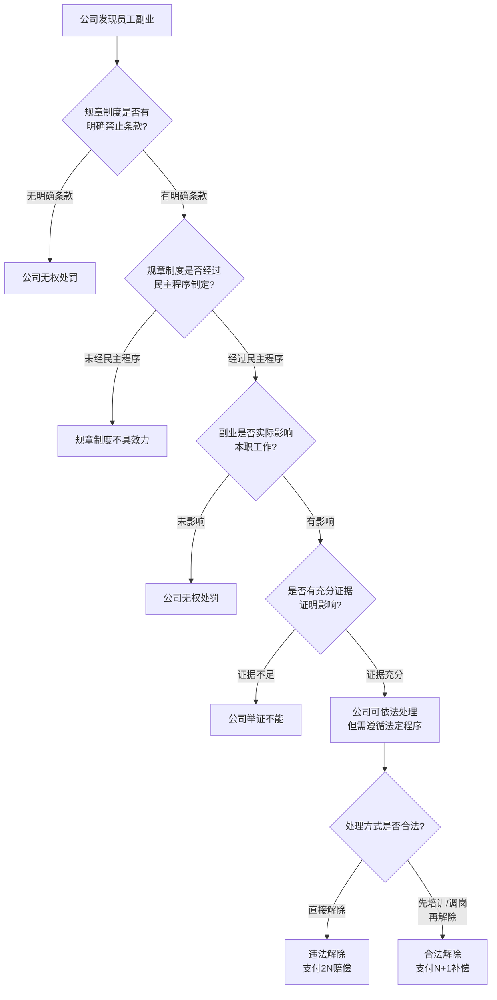
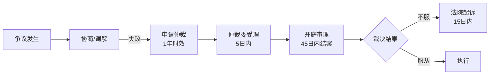

## 案例四：劳动争议——副业收入被公司追索与违法解除赔偿

### 案例背景

张某，28岁，某互联网公司前端开发工程师，月薪18000元。工作之余，张某利用晚上和周末时间在技术社区撰写付费专栏，月均收入约8000元，同时承接少量外包项目，月均副业总收入约15000元。

2024年3月，公司HR发现张某的副业行为后，以"违反公司规章制度、严重影响本职工作"为由，要求张某签署《自愿离职申请书》。张某拒绝签署后，公司当月将其工资降至当地最低工资标准（2320元/月），并将其调至后勤部门负责设备盘点。张某遂向劳动仲裁委员会提起仲裁申请。

**本案涉及的核心法律问题：**

| 争议焦点 | 法律依据 | 张某立场 | 公司立场 |
|----------|---------|---------|---------|
| 副业是否构成严重违纪 | 《劳动合同法》第39条 | 副业在非工作时间进行，未影响工作 | 规章制度明确禁止兼职 |
| 降薪是否合法 | 《劳动合同法》第35条 | 未经协商一致单方降薪违法 | 岗位调整后薪资随岗位变动 |
| 调岗是否合法 | 《劳动合同法》第40条 | 恶意调岗逼迫离职 | 属于企业自主管理权 |
| 经济赔偿金 | 《劳动合同法》第87条 | 违法解除应支付2N赔偿 | 属于合法解除 |

### 案例完整分析

#### 第一阶段：争议发生与证据收集（第1-2周）

**张某采取的关键行动：**

1. **拒绝签署任何文件。** 公司要求签署的《自愿离职申请书》一旦签署，将丧失主张经济赔偿的权利。这是劳动者最常见的陷阱——"被自愿离职"。

2. **收集和保全证据。** 张某在接到HR口头通知后，立即开始系统性地收集以下证据：

   - **劳动合同原件：** 确认合同中关于兼职的具体条款。经查，合同仅约定"不得在竞争对手处任职"，并未禁止所有形式的兼职。
   - **公司规章制度：** 张某入职时签署的《员工手册》中确实有"员工不得从事第二职业"的条款，但该条款过于宽泛，且未经民主程序制定（未提供职工代表大会讨论记录）。
   - **工资条和银行流水：** 保留降薪前后的完整工资记录，证明薪资被单方面降低。
   - **工作记录：** 导出公司内部系统中的项目交付记录、代码提交记录、绩效考核表，证明工作表现正常。
   - **沟通记录：** 对HR的谈话进行录音（需注意：录音者本人参与的对话录音在多数省份具有证据效力），保存微信/钉钉聊天记录截图。
   - **调岗通知：** 要求公司出具书面调岗通知，确认调岗理由和新岗位内容。

3. **继续正常出勤。** 张某没有因降薪而旷工，避免给公司留下"严重违反劳动纪律"的把柄。这一点至关重要——很多劳动者在遭遇不公待遇后选择不去上班，反而给公司合法解除的理由。

#### 第二阶段：劳动仲裁申请（第3-4周）

**仲裁请求内容：**

张某委托律师向公司所在地劳动人事争议仲裁委员会提交仲裁申请，请求如下：

1. 确认公司单方降薪行为违法，补发工资差额（18000-2320=15680元/月 × 2个月 = 31360元）
2. 确认公司单方调岗行为违法，恢复原岗位
3. 如公司坚持解除劳动合同，支付违法解除赔偿金（2 × 18000 × 工作年限）

**仲裁前的关键法律分析：**

#### 第三阶段：仲裁庭审（第5-8周）

**庭审焦点一：规章制度的效力**

公司主张：《员工手册》第12.3条规定"员工不得以任何形式从事第二职业或兼职工作"，张某签署确认书即表示同意。

张某律师反驳要点：

1. **民主程序瑕疵。** 根据《劳动合同法》第4条，涉及劳动者切身利益的规章制度应当经职工代表大会或者全体职工讨论，与工会或者职工代表平等协商确定。公司无法提供该制度经民主程序制定的证据。
2. **告知程序瑕疵。** 公司仅提供张某签字的确认书，但无法证明已向张某逐条解释了规章制度内容。
3. **条款过于宽泛。** "不得从事任何形式的第二职业"条款涵盖了所有非工作时间的经济活动，包括写作、投资、教学等合法行为，属于排除劳动者权利的无效格式条款。

**庭审焦点二：降薪和调岗的合法性**

公司主张：因张某违纪在先，公司有权调整其岗位和薪资。

张某律师反驳要点：

1. **单方降薪违法。** 工资是劳动合同的核心条款，根据《劳动合同法》第35条，变更劳动合同内容（包括工资）需双方协商一致并采用书面形式。公司未经张某同意单方降薪至最低工资标准，明显违法。
2. **调岗缺乏合理性和关联性。** 从技术开发岗调至后勤设备盘点岗，岗位内容和技能要求完全不同，属于恶意调岗。根据司法实践，用人单位调岗应当具有合理性和必要性，不得带有惩罚性和侮辱性。
3. **实质为逼迫离职。** 降薪加调岗的组合行为，目的是迫使劳动者主动辞职以规避经济补偿金，属于典型的"变相辞退"。

**庭审焦点三：副业是否构成严重违纪**

张某律师举证：

1. 张某的副业均在非工作时间（晚上、周末）进行，从未占用工作时间。
2. 张某在职期间的绩效考核均为B+及以上，最近两个季度连续获得A评级。
3. 张某从未在副业中使用公司资源（设备、代码、客户信息等）。
4. 张某的副业（技术写作和开发）与公司业务不存在竞争关系。

### 仲裁结果

仲裁委员会经过审理，裁决如下：

| 仲裁请求 | 裁决结果 | 理由 |
|---------|---------|------|
| 补发工资差额 | **支持** | 公司单方降薪违反《劳动合同法》第35条 |
| 恢复原岗位 | **支持** | 调岗缺乏合理性，属于惩罚性调岗 |
| 违法解除赔偿金 | **部分支持** | 公司后续在仲裁期间书面解除劳动合同，构成违法解除 |

**最终赔偿计算：**

张某在公司工作3年零2个月，月平均工资18000元。

- 经济补偿基数：18000元/月
- 工作年限：3.5年（超过6个月不满1年按1年计算）
- 违法解除赔偿金 = 2 × 18000 × 3.5 = **126000元**
- 补发工资差额 = 15680 × 2 = **31360元**
- **合计获赔：157360元**

### 深度解析：劳动争议中的关键法律知识

#### 一、劳动仲裁的基本流程

**关键时效提醒：**
- 劳动争议仲裁时效为 **1年**，自当事人知道或者应当知道其权利被侵害之日起计算
- 拖欠劳动报酬的争议，劳动者可在劳动关系存续期间随时申请仲裁，不受1年限制
- 离职后追索加班费、未签合同双倍工资等，离职之日起1年内必须申请仲裁

#### 二、劳动者必须保留的证据清单

| 证据类型 | 具体内容 | 重要程度 | 保存方式 |
|---------|---------|---------|---------|
| 劳动合同 | 原件、补充协议 | ★★★★★ | 纸质原件+扫描件云端备份 |
| 工资记录 | 工资条、银行流水、个税记录 | ★★★★★ | 银行流水盖章+个税APP截图 |
| 考勤记录 | 打卡记录、加班审批 | ★★★★ | 定期截图公司系统 |
| 工作沟通 | 微信/钉钉/邮件 | ★★★★ | 定期导出备份 |
| 规章制度 | 员工手册、通知公告 | ★★★★ | 拍照留存 |
| 绩效记录 | 考核表、奖惩通知 | ★★★★ | 拍照/截图 |
| 社保记录 | 社保缴纳明细 | ★★★★★ | 社保局官网查询下载 |
| 解除通知 | 辞退通知、谈话录音 | ★★★★★ | 原件保存+录音云端备份 |

**特别提醒：** 很多公司在内部系统中修改或删除员工数据，因此证据保全必须趁早。建议入职后就开始定期备份重要数据，而非等到争议发生后才开始收集。

#### 三、副业劳动者的特殊风险与防范

本案揭示了从事副业的劳动者面临的特殊法律风险。以下是系统性的风险分析和防范策略：

**风险一：违反竞业限制协议**

- **场景：** 劳动合同或单独的竞业限制协议中约定了竞业限制条款。
- **风险等级：** 高。如果副业与原公司业务存在竞争关系，可能构成违约，需支付违约金。
- **防范：** 仔细审查劳动合同中的竞业限制条款；如已签署，评估限制范围和期限；必要时与公司协商解除或缩小限制范围。

**风险二：使用公司资源**

- **场景：** 在副业中使用了公司的电脑、软件授权、技术资料、客户信息等。
- **风险等级：** 极高。可能构成侵犯商业秘密，甚至面临刑事追诉。
- **防范：** 严格分离主副业的设备和资料；不使用公司邮箱处理副业事务；不利用公司客户资源。

**风险三：影响本职工作**

- **场景：** 副业导致本职工作质量下降、频繁迟到、拒绝加班等。
- **风险等级：** 中高。即使规章制度没有禁止兼职，公司仍可以"不能胜任工作"为由处理。
- **防范：** 确保本职工作绩效不受影响；副业时间安排在非工作时间；不在公司讨论副业内容。

**风险四：知识产权归属争议**

- **场景：** 在副业中创作的技术文章、软件作品可能被公司主张权利。
- **风险等级：** 中。需区分是否属于"职务作品"或是否利用了公司物质技术条件。
- **防范：** 副业创作不使用公司设备和资源；在副业合同中明确知识产权归属；了解公司知识产权政策。

#### 四、常见劳动争议类型与应对策略速查表

| 争议类型 | 法律依据 | 时效 | 赔偿/补偿标准 | 举证责任 |
|---------|---------|------|-------------|---------|
| 违法解除劳动合同 | 《劳动合同法》第87条 | 1年 | 2N（双倍经济补偿） | 公司举证解除合法 |
| 未签书面劳动合同 | 《劳动合同法》第82条 | 1年 | 最多11个月双倍工资 | 公司举证已签合同 |
| 拖欠/克扣工资 | 《劳动合同法》第30条 | 离职后1年 | 补发+25%赔偿金 | 劳动者初步举证 |
| 未缴社保 | 《社会保险法》第63条 | 无时效限制 | 补缴+滞纳金 | 社保局查询即可证明 |
| 加班费争议 | 《劳动法》第44条 | 2年 | 平日1.5倍/休息日2倍/法定3倍 | 劳动者举证加班事实 |
| 工伤赔偿 | 《工伤保险条例》 | 认定1年 | 按伤残等级1-10级 | 工伤认定决定书 |

### 实操指南：遭遇劳动争议的完整行动方案

#### 第一步：冷静评估（第1天）

不要在情绪激动时做任何决定。问自己以下问题：

1. 我的诉求是什么？（恢复工作？获得赔偿？确认劳动关系？）
2. 我手头有哪些证据？还需要补充哪些？
3. 争议金额是否值得投入时间和精力？
4. 是否需要聘请专业律师？

#### 第二步：证据保全（第1-3天）

立即执行以下操作：

- 导出所有工资条和银行流水（去银行柜台打印并盖章）
- 截图保存所有与HR和上级的聊天记录
- 导出绩效考核记录和项目交付记录
- 如果有谈话录音需求，准备好录音设备（手机录音即可）
- 备份社保缴纳记录（登录当地社保局官网查询）

#### 第三步：尝试协商（第3-7天）

通过正式渠道（书面形式）与公司沟通，明确表达自己的诉求。注意：

- 沟通时保持冷静和专业，避免情绪化表达
- 重要沟通内容通过邮件或书面形式确认，避免仅口头沟通
- 如果公司提出的方案明显不合理，不要勉强接受
- 协商过程中的让步不能作为后续仲裁的不利证据（根据"协商让步不自认"原则）

#### 第四步：申请仲裁（第7-14天）

如果协商失败，向劳动人事争议仲裁委员会提交申请：

**所需材料：**

1. 仲裁申请书（一式三份）
2. 身份证复印件
3. 劳动合同复印件
4. 证据材料（工资记录、聊天记录、录音文字版等）
5. 用人单位工商信息（可通过"国家企业信用信息公示系统"查询打印）

**费用：** 劳动仲裁 **不收取任何费用**（《劳动争议调解仲裁法》第53条）

**管辖地：** 用人单位所在地或劳动合同履行地的仲裁委员会

#### 第五步：庭审与裁决

- 仲裁庭一般在受理后45日内结案，案情复杂的可延长至60日
- 庭审中如实陈述，不要夸大或编造事实
- 对公司提交的证据仔细核对，发现伪造证据可当庭提出异议
- 收到裁决书后，如不服可在15日内向法院提起诉讼

### 警示案例：劳动者的常见败诉原因

#### 败诉原因一：主动辞职

很多劳动者在公司施压后冲动辞职或签署"自愿离职"文件，导致无法主张违法解除赔偿。**正确做法：** 不签任何文件，继续正常出勤，通过仲裁解决争议。

#### 败诉原因二：证据不足

部分劳动者平时不注意保留证据，到争议发生时才发现手中无凭无据。**正确做法：** 入职起即建立个人职场档案，定期备份重要数据。

#### 败诉原因三：超过时效

劳动仲裁时效为1年，很多劳动者错过时效后才申请仲裁。**正确做法：** 权利被侵害后尽快行动，不要拖延。

#### 败诉原因四：诉求不当

部分劳动者提出过高或无法律依据的诉求（如精神损害赔偿），反而影响仲裁员对其的信任度。**正确做法：** 咨询专业律师，制定合理的仲裁请求。

### 与副业合规的关联分析

本案例对从事副业的劳动者具有重要警示意义：

1. **入职前审查合同条款。** 仔细阅读劳动合同中关于兼职、竞业限制、知识产权归属的条款。如有不合理条款，可在入职时协商修改。

2. **副业类型选择有讲究。** 与本职工作不构成竞争关系、不需要投入大量工作时间、不使用公司资源的副业，法律风险最低。技术写作、在线教育、投资理财等是相对安全的选择。

3. **保密义务无处不在。** 即使劳动合同没有明确的保密条款，劳动者在任职期间仍负有法定的保密义务（《劳动合同法》第23条）。不要在副业中泄露公司的商业秘密。

4. **提前做好隔离。** 副业使用个人设备和个人时间，与公司物理隔离。这是应对劳动争议时最有说服力的证据。

### 法律资源与工具

| 资源/工具 | 用途 | 获取方式 |
|----------|------|---------|
| 12333热线 | 劳动法律咨询 | 直接拨打 |
| 中国裁判文书网 | 查询类似案例判决 | wenshu.court.gov.cn |
| 国家企业信用信息公示系统 | 查询公司工商信息 | gsxt.gov.cn |
| 当地法律援助中心 | 免费法律援助（经济困难者） | 各区县司法局 |
| 全国劳动人事争议调解服务平台 | 在线申请调解 | ztgl.mohrss.gov.cn |
| 个人所得税APP | 查询个税缴纳记录 | 应用商店下载 |
