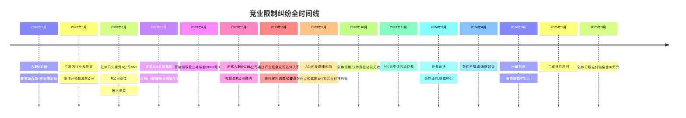
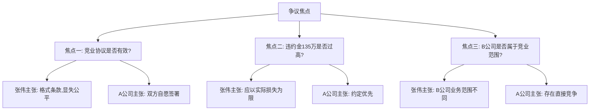
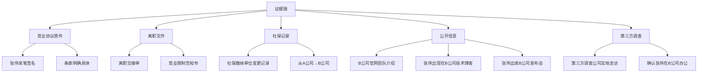
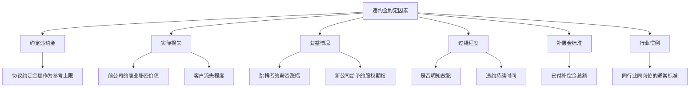
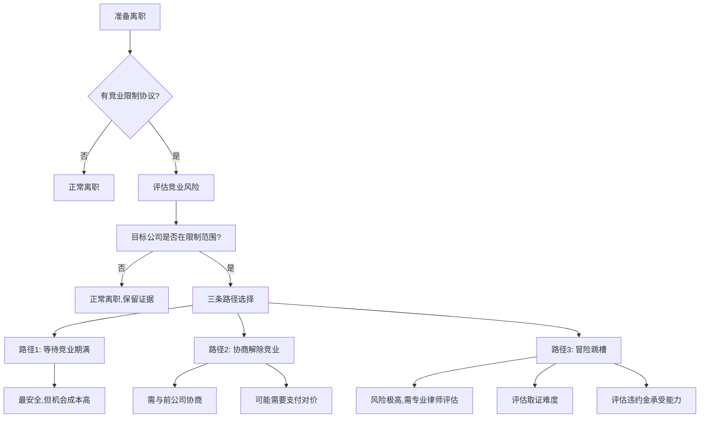
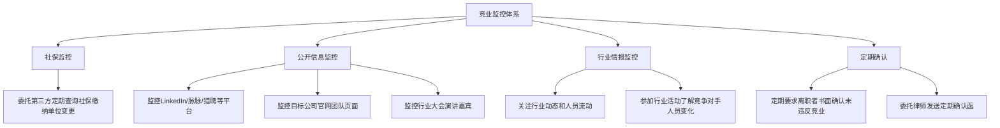
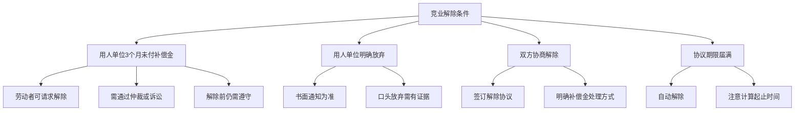
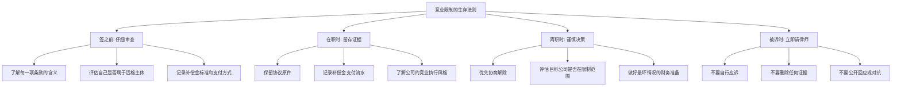

## 案例五：竞业限制纠纷——跳槽后的法律风暴

### 案例概览

本案例讲述的是一位互联网行业高级工程师张伟（化名），从A公司跳槽到B公司后，因违反竞业限制协议被前雇主A公司起诉，最终赔偿82万元的真实经历。这个案例完整展现了竞业限制纠纷从签订协议、触发争议、仲裁诉讼到最终执行的全生命周期，是每一个在职人员和准备跳槽者都必须了解的"血泪教训"。

---

### 第一部分：案情全景

#### 1.1 当事人背景

| 信息 | 详情 |
|------|------|
| 当事人 | 张伟（化名），男，32岁 |
| 原雇主 | A公司，某头部互联网企业，主营在线教育平台 |
| 新雇主 | B公司，某新兴在线教育创业公司 |
| 岗位 | 高级后端工程师 → 技术总监 |
| 在A公司工作年限 | 4年（2019年3月-2023年3月） |
| 离职前年薪 | 税前45万元（月薪30000元 + 年终奖约9万元） |
| 竞业限制补偿金 | 每月9000元（离职前12个月平均工资的30%） |
| 竞业限制期限 | 24个月 |

#### 1.2 竞业协议的核心条款

张伟在入职A公司时签署了《竞业限制协议》，该协议包含以下关键条款：

**限制范围条款：**

> "乙方（张伟）在离职后24个月内，不得在与甲方（A公司）存在竞争关系的单位任职，包括但不限于：从事K12在线教育、在线职业教育、在线教育平台开发等相关业务的企业。也不得自行创办或参股上述类型的企业。"

**违约金条款：**

> "若乙方违反本协议约定，应向甲方支付违约金，金额为乙方离职前12个月工资总额的3倍（即135万元），同时退还已领取的全部竞业限制补偿金。"

**补偿金条款：**

> "甲方在竞业限制期间按月向乙方支付竞业限制补偿金，金额为乙方离职前12个月平均月工资的30%，即每月9000元。"

#### 1.3 事件时间线

---

### 第二部分：争议焦点与法律分析

#### 2.1 三大争议焦点

本案的核心争议集中在以下三个问题上：

#### 2.2 焦点一：竞业限制协议的效力

**张伟的主张：**

张伟认为竞业协议无效，理由如下：
1. 协议是入职时的格式条款，没有协商余地，不签就不录用
2. 限制范围过于宽泛，"在线教育"涵盖几乎所有教育科技公司
3. 补偿金过低，仅为工资的30%，影响基本生活
4. 限制期限24个月过长

**A公司的反驳：**

1. 协议上有张伟的亲笔签名，签署时有书面确认"已阅读并理解全部条款"
2. 张伟是高级工程师，接触公司核心技术和商业秘密，竞业限制有正当理由
3. 补偿金标准符合《劳动合同法》规定（不低于月工资的30%）
4. 24个月是法律规定的最高期限，未超出法定范围

**法院认定：**

法院最终认定竞业协议**有效**，理由如下：

1. **主体适格**：张伟作为高级技术人员，属于《劳动合同法》第24条规定的竞业限制适格主体（高级管理人员、高级技术人员和其他负有保密义务的人员）
2. **意思表示真实**：协议上有张伟亲笔签名，且签署时间与入职时间一致，不存在胁迫情形
3. **内容合法**：限制期限24个月未超过法定上限；补偿金标准不低于法定最低标准
4. **限制范围合理**：虽然"在线教育"表述宽泛，但结合A公司实际业务（K12在线教育平台），限制范围指向明确

> **法律依据**：《中华人民共和国劳动合同法》第23条、第24条。第24条规定："竞业限制的人员限于用人单位的高级管理人员、高级技术人员和其他负有保密义务的人员。竞业限制的范围、地域、期限由用人单位与劳动者约定，竞业限制的约定不得违反法律、法规的规定。在解除或者终止劳动合同后，前款规定的人员到与本单位生产或者经营同类产品、从事同类业务的有竞争关系的其他用人单位，或者自己开业生产或者经营同类产品、从事同类业务的竞业限制期限，不得超过二年。"

#### 2.3 焦点二：违约金是否过高

**张伟的主张：**

张伟主张即使构成违约，135万元违约金（年薪的3倍）明显过高，应当调减。理由：
1. A公司未举证证明实际损失
2. 自己在B公司的年薪为60万元，并非从竞业中获得巨额利益
3. 已退还的补偿金（5个月×9000元=4.5万元）已具有惩罚性质

**法院认定：**

法院认为违约金应适当调减，综合考量以下因素：

| 考量因素 | 具体分析 | 权重 |
|---------|---------|------|
| 约定金额 | 135万元（年薪3倍） | 参考但不照搬 |
| 实际损失 | A公司难以量化，但主张客户流失和技术泄露 | 中等 |
| 张伟过错程度 | 明知有竞业限制仍入职竞争对手，主观故意明显 | 较高 |
| 张伟收入情况 | 新公司年薪60万元，具备一定支付能力 | 中等 |
| 已付补偿金 | 4.5万元需退还 | 确定 |
| 行业惯例 | 互联网行业竞业违约金通常为年薪1-3倍 | 参考 |

最终法院酌定违约金为**77.5万元**，加上退还已付补偿金4.5万元，合计**82万元**。

#### 2.4 焦点三：B公司是否属于竞业范围

这是本案中最具技术含量的争议点。

**张伟的抗辩：**

张伟提出B公司与A公司的业务存在明显差异：

| 对比维度 | A公司 | B公司 |
|---------|-------|-------|
| 主营业务 | K12在线教育（中小学） | 职业技能培训（成人） |
| 目标用户 | 6-18岁学生 | 22-40岁职场人士 |
| 产品形态 | 直播大班课+AI题库 | 录播课+实训项目 |
| 技术栈 | Java微服务架构 | Python+Go微服务 |
| 融资阶段 | D轮（估值50亿） | A轮（估值2亿） |
| 市场份额 | 行业前5 | 行业50名开外 |

张伟认为两家公司虽然都在"在线教育"大范畴内，但目标用户、产品形态、技术架构完全不同，不构成直接竞争关系。

**A公司的反驳：**

A公司提交了以下证据证明竞争关系：

1. **业务拓展证据**：A公司已于2022年下半年启动成人职业教育业务线，与B公司业务直接重叠
2. **客户重叠证据**：A公司调研发现，部分企业客户同时采购了A、B两家公司的企业培训服务
3. **张伟的岗位关联**：张伟在A公司负责的核心系统（用户认证、支付系统、课程推荐引擎）与B公司的技术需求高度重叠
4. **竞业协议约定**：协议明确列举了"在线职业教育"属于限制范围

**法院认定：**

法院最终认定B公司属于竞业限制范围。关键理由：

1. A公司已实际开展成人职业教育业务，与B公司存在业务交叉
2. 竞业协议中"在线教育"的约定虽宽泛但指向明确，且包含了"在线职业教育"
3. 张伟在A公司接触的技术（用户系统、推荐算法）可直接应用于B公司业务
4. 竞争关系的判断应以**实际经营范围**而非工商登记的经营范围为标准

---

### 第三部分：关键证据链

本案能够胜诉（从A公司角度）或败诉（从张伟角度），关键在于证据链的完整性。

#### 3.1 A公司的取证策略

A公司能够成功证明张伟违约，依赖以下取证手段：

**第一层：公开信息收集（成本最低）**

1. **社保记录查询**：通过社保代缴机构发现张伟社保关系转移至B公司（A公司HR与社保机构有合作关系，社保转移时原单位会收到通知）
2. **企业信用信息**：通过天眼查、企查查查询B公司的工商信息、经营范围
3. **公开媒体报道**：B公司官网"团队介绍"页面出现张伟照片和简介
4. **技术社区活动**：张伟以B公司技术总监身份在技术大会上演讲，视频发布在B站
5. **LinkedIn/脉脉等平台**：张伟在职场社交平台更新了工作状态

**第二层：委托专业调查（成本中等）**

A公司委托了专业的商业调查机构进行取证：

| 取证方式 | 具体操作 | 法律效力 |
|---------|---------|---------|
| 实地走访 | 调查员在B公司办公楼蹲守，拍摄张伟出入照片 | 较高，需注意隐私边界 |
| 快递验证 | 以快递名义寄送至B公司，签收人为张伟 | 中等，需与其他证据配合 |
| 商业合作接触 | 假装企业客户与B公司洽谈，确认张伟参与项目 | 中等，存在争议 |
| 公开招标信息 | 查询B公司中标项目的团队名单 | 较高，属于公开信息 |

**第三层：律师函+公证保全（成本最高）**

1. **律师函**：A公司通过律师向张伟和B公司发送律师函，要求确认劳动关系。张伟的回复（否认在B公司工作）本身成为反面证据——因为社保记录和公开信息已证明相反事实
2. **网页公证**：对B公司官网、张伟的公开演讲视频、技术博客文章进行公证保全，防止对方删除证据

#### 3.2 张伟的致命失误

张伟在应对过程中犯了多个关键错误，直接导致败诉：

**失误一：低估取证能力**

张伟认为自己"低调入职"就不会被发现，但忽略了社保缴纳记录这一铁证。很多城市社保系统会自动通知原单位社保关系转出信息。

**失误二：未及时终止竞业**

在收到A公司律师函后，张伟没有立即从B公司离职以止损，而是选择"硬扛"。根据司法实践，违约行为持续时间越长，法院认定的违约金越高。

**失误三：公开身份暴露**

张伟以B公司技术总监身份参加行业大会、发表技术博客、接受采访，这些公开信息直接成为违约证据。如果保持低调，至少能降低被发现的概率。

**失误四：错误理解"竞争关系"**

张伟以"B公司做成人教育、A公司做K12"为由认为不构成竞争，但忽略了A公司已拓展成人教育业务的事实。竞争关系的判断标准是**实际业务重叠**，而非工商登记的经营范围。

**失误五：未聘请专业律师**

张伟在仲裁和一审初期自行应诉，直到一审败诉后才聘请律师。错过了在仲裁阶段争取有利裁决的最佳时机。

---

### 第四部分：赔偿金额的计算逻辑

#### 4.1 违约金的法律框架

竞业限制违约金的计算没有统一标准，法院通常综合以下因素酌定：

#### 4.2 本案的具体计算

| 计算项 | 金额/说明 |
|--------|----------|
| 协议约定违约金 | 135万元（年薪45万×3） |
| 法院酌定违约金 | 77.5万元 |
| 酌减理由 | 调减约43%，考虑了张伟的支付能力、A公司难以量化实际损失等因素 |
| 退还已付补偿金 | 4.5万元（5个月×9000元） |
| 仲裁费用 | 约1万元（由张伟承担） |
| 律师费 | A公司主张15万元，法院支持8万元由张伟承担 |
| **总计** | **约91万元**（其中违约金77.5万+补偿金退还4.5万+律师费8万+仲裁费1万） |

> 注：不同法院的裁判尺度存在差异。根据2023-2024年公开裁判文书统计，互联网行业竞业限制违约金的中位数约为离职者年薪的1.5-2倍。

#### 4.3 全国裁判数据参考

根据中国裁判文书网公开数据（2020-2024年），竞业限制纠纷案件呈现以下趋势：

| 统计维度 | 数据 |
|---------|------|
| 年均案件量 | 约3000-4000件 |
| 用人单位胜诉率 | 约70-75% |
| 平均违约金判决额 | 约20-50万元 |
| 互联网行业占比 | 约35-40% |
| 最常见违约行为 | 入职竞争对手（约65%） |
| 平均限制期限 | 约18-24个月 |
| 违约金调减比例 | 平均调减30-50% |

---

### 第五部分：不同角色的应对策略

#### 5.1 作为员工——如何保护自己

**入职前的审查清单：**

| 检查项 | 具体操作 | 风险等级 |
|--------|---------|---------|
| 竞业限制主体 | 确认自己是否属于"高管/高级技术人员/保密人员" | 不属于则协议可能无效 |
| 限制范围 | 审查竞业限制的具体行业和企业范围是否明确 | 范围过宽可主张不合理 |
| 限制期限 | 检查是否超过24个月 | 超过部分无效 |
| 补偿金标准 | 确认补偿金不低于月工资的30% | 低于法定标准可主张无效 |
| 违约金金额 | 评估违约金是否合理（通常为年薪1-3倍） | 过高可请求调减 |
| 补偿金支付方式 | 确认是按月支付还是一次性支付 | 3个月未付可主张解除 |

**在职期间的注意事项：**

1. **保留所有签署文件的副本**：竞业协议、劳动合同、保密协议的原件或扫描件
2. **记录补偿金支付情况**：保留银行流水，确认公司按时足额支付补偿金
3. **了解公司的竞业执行力度**：有些公司虽然签了竞业协议但不实际执行，有些公司严格执行
4. **提前规划离职时间线**：如果计划跳槽到可能触发竞业的公司，至少提前3-6个月准备

**离职时的关键操作：**

**路径1：等待竞业期满**

- 优点：零法律风险
- 缺点：时间成本高，最长等待24个月
- 适用场景：目标公司愿意等待，或者有其他过渡方案

**路径2：协商解除竞业**

具体协商策略：

1. **主动沟通**：离职时主动与HR或直属领导沟通竞业限制问题
2. **提出方案**：
   - 方案A：公司放弃竞业限制，你放弃补偿金
   - 方案B：缩小竞业限制范围（例如排除特定公司或细分领域）
   - 方案C：缩短竞业限制期限（例如从24个月缩短到12个月）
3. **书面确认**：任何协商结果必须有书面文件，口头承诺无效
4. **保留证据**：邮件、微信聊天记录、会议纪要都要保留

**路径3：跳槽但降低风险**

如果决定跳槽到限制范围内的公司，可以采取以下措施降低风险（但不能消除风险）：

1. **社保挂靠**：新公司不直接缴纳社保，而是通过第三方人力资源公司代缴（但此操作本身存在法律风险）
2. **身份隔离**：不以新公司员工身份公开出现，不更新LinkedIn等平台信息
3. **业务隔离**：避免参与与前公司直接竞争的业务线
4. **公司架构隔离**：通过关联公司而非直接竞争公司签订劳动合同

> **重要警告**：以上措施只能降低被发现的概率，不能免除法律责任。一旦被发现，这些操作反而可能被视为"故意规避"，加重过错认定。

#### 5.2 作为用人单位——如何有效执行竞业

**竞业协议设计的最佳实践：**

| 设计要素 | 推荐做法 | 避免做法 |
|---------|---------|---------|
| 适格主体 | 仅针对真正接触商业秘密的核心人员 | 全员签署竞业协议 |
| 限制范围 | 明确列举竞争对手名单或细分领域 | 使用"同行业所有公司"等模糊表述 |
| 限制期限 | 根据秘密时效性设定6-24个月 | 一律设定最高24个月 |
| 补偿金 | 不低于月工资的30%，建议50%以上 | 低于法定标准或不约定补偿金 |
| 违约金 | 年薪1-2倍，有实际损失可适当提高 | 设定天价违约金（可能被调减） |
| 支付方式 | 按月支付，保留银行转账记录 | 一次性支付或现金支付 |

**执行期间的监控机制：**

#### 5.3 作为新雇主——如何降低连带风险

B公司在本案中虽然没有直接被起诉，但面临了以下风险：

1. **商誉风险**：被A公司公开指控"挖角"和"恶意竞争"
2. **连带风险**：如果A公司选择同时起诉B公司，B公司可能承担连带责任
3. **人才流失风险**：张伟因诉讼压力离职，B公司的人才招聘计划被打乱

**新雇主的合规建议：**

1. **入职审查**：在录用来自竞争对手的候选人时，要求其书面确认是否存在竞业限制
2. **风险评估**：评估候选人的竞业风险等级，必要时咨询律师
3. **岗位安排**：如果候选人存在竞业限制，可以安排到不直接竞争的业务线
4. **隔离入职**：通过关联公司或第三方公司签订劳动合同（存在灰色地带，需专业评估）
5. **法律预案**：提前准备应对前雇主律师函的法律方案

---

### 第六部分：竞业限制的常见误区

#### 6.1 误区对照表

| 误区 | 真实情况 | 法律依据 |
|------|---------|---------|
| "只有高管才受竞业限制" | 高级技术人员和负有保密义务的人员同样受约束 | 《劳动合同法》第24条 |
| "公司不付补偿金，协议就无效" | 需要连续3个月未支付，才能请求解除 | 《最高人民法院关于审理劳动争议案件适用法律问题的解释(一)》第38条 |
| "补偿金低于30%就无效" | 低于30%的约定无效，但可以补足至30% | 同上，第36条 |
| "竞业协议没给补偿金就不受约束" | 未约定补偿金的，劳动者履行义务后可主张按月工资30%支付 | 同上，第36条 |
| "换个城市就不受竞业限制" | 竞业限制是否覆盖外地取决于协议约定和业务范围 | 各地法院裁判标准不一 |
| "做自由职业/兼职不算违反竞业" | 如果实质上从事竞争业务，即使是兼职也可能构成违约 | 司法实践中已有判例 |
| "小公司不会查竞业" | 越来越多企业通过第三方机构进行竞业监控 | 行业趋势 |
| "竞业限制可以自动放弃" | 需要用人单位明确通知放弃，沉默不等于放弃 | 司法实践 |
| "跳槽后主动辞职就不算违约" | 入职行为本身即构成违约，事后辞职不能免除责任 | 已有判例支持 |
| "竞业纠纷只能走劳动仲裁" | 竞业限制纠纷属于劳动争议，仲裁前置 | 《劳动争议调解仲裁法》 |

#### 6.2 最危险的三种心态

**心态一："公司不会真的告我"**

事实：2020年以来，竞业限制案件数量年均增长约25%，企业维权意识显著增强。特别是互联网、新能源、半导体等行业的头部企业，普遍建立了竞业监控体系。

**心态二："我做的事跟前公司不一样"**

事实：法院判断竞争关系时，看的是**实际业务重叠**而非行业分类或公司自述。很多看似不同的业务，在具体细分市场可能存在直接竞争。

**心态三："我等几个月再入职就没事了"**

事实：延迟入职只能降低被发现的概率，不能免除违约责任。而且延迟期间如果公司停止支付补偿金超过3个月，反而可能成为公司主张"劳动者已放弃竞业权利"的证据。

---

### 第七部分：特殊场景分析

#### 7.1 竞业限制 vs 副业

在职期间做副业是否违反竞业限制？需要区分两种情况：

| 场景 | 是否违反竞业 | 说明 |
|------|------------|------|
| 副业与主业完全无关 | 一般不违反竞业限制 | 但可能违反劳动合同中的"忠实义务"条款 |
| 副业与主业存在竞争 | 可能违反竞业限制 | 即使是兼职、顾问、投资入股等形式 |
| 利用主业资源做副业 | 可能同时违反竞业限制和保密义务 | 法律风险最高 |
| 离职前就开始做竞业副业 | 违反竞业限制+可能构成不正当竞争 | 违约金可能加倍 |

#### 7.2 竞业限制的解除条件

劳动者在以下情况下可以请求解除竞业限制：

**重要提醒**：即使用人单位3个月未付补偿金，劳动者在**法院判决解除之前**仍然受竞业限制约束。自行"解除"竞业限制可能导致违约。

#### 7.3 竞业限制与保密义务的区别

很多劳动者混淆竞业限制和保密义务，两者有本质区别：

| 维度 | 竞业限制 | 保密义务 |
|------|---------|---------|
| 法律性质 | 基于约定（需签协议） | 基于法定义务（无需特别约定） |
| 时间限制 | 最长2年 | 无时间限制（只要秘密未公开） |
| 经济补偿 | 必须支付补偿金 | 无需额外补偿 |
| 违约后果 | 支付违约金 | 赔偿实际损失 |
| 约束范围 | 不得在竞争单位任职 | 不得泄露/使用商业秘密 |
| 可否放弃 | 可协商解除 | 不能通过协议免除 |

关键区别：竞业限制解除后，保密义务仍然存在。也就是说，即使竞业期满，你仍然不能使用或泄露前公司的商业秘密。

---

### 第八部分：张伟案的反思与启示

#### 8.1 张伟的总损失清单

| 损失类型 | 金额/影响 |
|---------|----------|
| 违约金 | 77.5万元 |
| 退还补偿金 | 4.5万元 |
| 律师费（己方） | 约5万元（二审请律师） |
| 对方律师费 | 8万元 |
| 仲裁/诉讼费用 | 约1.5万元 |
| 时间成本 | 2年（从仲裁到二审终结） |
| 职业影响 | 被迫离开B公司，职业发展中断6个月 |
| 行业声誉 | 在行业内被标记为"违反竞业"，影响后续求职 |
| 心理压力 | 长期诉讼带来的焦虑和不确定性 |
| **直接经济损失合计** | **约96.5万元** |
| **间接损失（收入损失+声誉）** | **难以量化，可能超过直接损失** |

#### 8.2 如果重来一次，张伟应该怎么做

**最优方案（零风险）：**

1. 离职前与A公司协商解除或缩小竞业限制范围
2. 如果协商失败，在竞业期满后再入职B公司
3. 竞业期间可以做自由职业、咨询工作（与A公司业务无关的方向）
4. 利用竞业期学习新技能，为后续转型做准备

**次优方案（低风险）：**

1. 入职B公司的关联公司（非直接竞争主体）
2. 确保岗位内容与A公司核心业务不重叠
3. 不以B公司员工身份公开活动
4. 做好被发现后的法律预案

**最差方案（张伟实际选择）：**

1. 直接入职竞争对手
2. 公开身份、高调活动
3. 被发现后拒不配合
4. 拖延诉讼进程
5. 最终付出近百万代价

#### 8.3 对所有读者的建议

---

### 第九部分：相关法律条文速查

| 法律/司法解释 | 条款 | 核心内容 |
|-------------|------|---------|
| 《劳动合同法》 | 第23条 | 保密义务和竞业限制的基本框架 |
| 《劳动合同法》 | 第24条 | 竞业限制的主体、范围、期限（不超过2年） |
| 最高法院劳动争议司法解释(一) | 第36条 | 未约定补偿金的，劳动者可主张月工资30% |
| 同上 | 第37条 | 约定补偿金低于30%的，劳动者可要求补足 |
| 同上 | 第38条 | 3个月未付补偿金，劳动者可请求解除竞业限制 |
| 同上 | 第39条 | 用人单位可单方解除竞业限制（需额外支付3个月补偿金） |
| 同上 | 第40条 | 劳动者违反竞业限制，用人单位可主张违约金 |
| 《反不正当竞争法》 | 第9条 | 商业秘密的定义和保护 |
| 《公司法》 | 第148条 | 董事、高管的竞业禁止义务（在职期间） |

---

### 案例总结

本案的核心教训可以用三句话概括：

1. **竞业限制协议是"带牙齿的合同"**——签了就要当回事，不要心存侥幸
2. **跳槽前的法律评估比跳槽本身更重要**——一个错误决定可能让你损失几年积蓄
3. **被诉后的第一反应决定最终结果**——及时请律师、积极配合、争取调解，远比硬扛要好

竞业限制不是洪水猛兽，而是劳动关系中的一个平衡机制。对企业而言，它是保护商业秘密的法律工具；对劳动者而言，它是一份有对价的义务——只要你理解规则、尊重规则，就完全可以在规则范围内最大化自己的利益。
