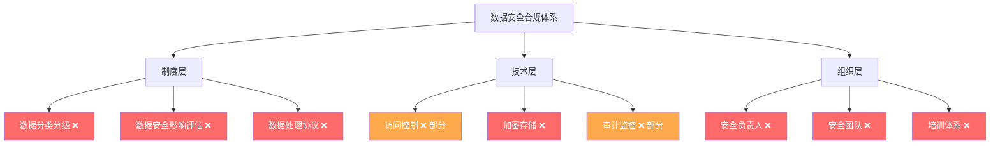
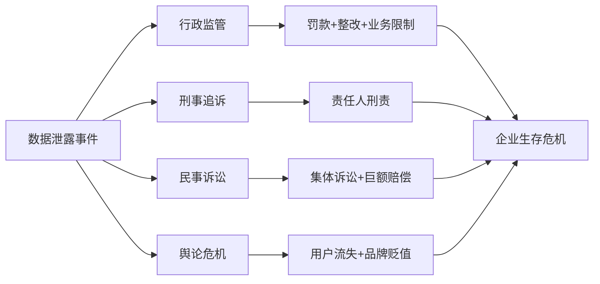

## 案例六：数据泄露事件

数据泄露是数字经济时代最常见、后果最严重的安全事件之一。无论企业规模大小，一旦发生数据泄露，不仅面临巨额罚款和诉讼赔偿，还将遭受品牌信誉的长期损害。本案例以某中型互联网公司的真实数据泄露事件为蓝本，系统剖析从事件发生、应急响应、法律追责到事后整改的完整链条，帮助读者建立数据安全合规的全景认知。

---

### 一、案例背景

#### 1.1 公司基本情况

**公司名称**：某生活服务平台（化名"鲜达科技"）

| 项目 | 详情 |
|------|------|
| 成立时间 | 2019年 |
| 主营业务 | 生鲜电商、社区团购 |
| 注册用户 | 约380万 |
| 员工规模 | 200余人（含技术团队40人） |
| 数据存储 | 阿里云华东区域 |
| 合规状态 | 未进行过正式的数据安全评估 |

#### 1.2 事件时间线

| 时间 | 事件 |
|------|------|
| 2024年3月 | 技术团队为提升查询性能，将用户数据库的访问权限开放给数据分析部门，但未做细粒度权限控制 |
| 2024年5月12日 | 数据库管理员发现异常查询日志，日均查询量从2000次暴增至15000次 |
| 2024年5月14日 | 确认某数据分析员工（张某）利用批量查询接口导出用户数据约42万条 |
| 2024年5月15日 | 内部调查发现张某已将部分数据出售给第三方营销公司 |
| 2024年5月16日 | 公司启动应急响应，向属地网信办报告 |
| 2024年5月18日 | 受影响用户收到短信通知 |
| 2024年6月 | 网信办立案调查 |
| 2024年9月 | 行政处罚决定书下达 |
| 2024年11月 | 民事诉讼集体案件受理 |

#### 1.3 泄露数据范围

泄露的数据字段涵盖用户敏感信息的多个维度：

| 数据类型 | 具体字段 | 影响人数 | 敏感等级 |
|----------|----------|----------|----------|
| 身份信息 | 姓名、手机号、身份证号 | 42万 | 极高 |
| 收货地址 | 详细住址（精确到门牌号） | 38万 | 高 |
| 消费记录 | 近6个月订单详情 | 42万 | 中 |
| 支付信息 | 支付方式（脱敏后银行卡后四位） | 25万 | 中高 |
| 行为数据 | 浏览记录、搜索关键词 | 42万 | 低 |

---

### 二、事件根因分析

#### 2.1 技术层面的漏洞

本次事件并非外部黑客攻击，而是典型的**内部威胁（Insider Threat）**导致的数据泄露。根本技术原因包括：

**权限管理失控**

```text
问题链条：
数据部门申请数据访问权限
    ↓
技术负责人未评估最小权限原则，直接授予数据库只读账号
    ↓
该账号可访问全量用户表，无行级/列级过滤
    ↓
未设置批量导出限制（无单次查询行数上限）
    ↓
张某通过分页查询方式累计导出42万条记录
```

**审计监控缺失**

- 数据库审计日志虽然开启，但无人定期审查
- 异常查询告警阈值设置过高（单日10万次），未能及时触发
- 没有建立用户行为分析（UEBA）机制
- 数据导出操作无二次审批流程

**数据分类分级未执行**

公司未按照《数据安全法》要求建立数据分类分级制度，所有用户数据统一存储在同一数据库实例中，未对敏感字段做加密或脱敏处理。

#### 2.2 管理层面的漏洞

| 管理缺陷 | 具体表现 | 应有措施 |
|----------|----------|----------|
| 制度缺失 | 无数据安全管理制度、无数据访问审批流程 | 建立覆盖数据全生命周期的安全管理制度 |
| 培训不足 | 员工入职未签署数据保密协议，无定期安全意识培训 | 每季度开展数据安全培训，签署保密协议 |
| 背调缺失 | 张某入职时未做背景调查，其有前科记录 | 关键岗位实施入职背景调查 |
| 应急预案缺失 | 无数据泄露应急响应预案，事发后48小时才启动响应 | 制定并定期演练应急响应预案 |
| 组织缺位 | 无专职数据安全负责人（DPO） | 设立数据安全负责人岗位 |

#### 2.3 合规层面的漏洞

鲜达科技在数据安全合规方面存在系统性缺失：



---

### 三、应急响应过程

#### 3.1 应急响应时间线与不足

| 阶段 | 实际耗时 | 行业基准 | 问题 |
|------|----------|----------|------|
| 发现→确认 | 48小时 | 4小时内 | 缺乏自动化告警，依赖人工巡检 |
| 确认→上报 | 24小时 | 发现后立即 | 法务部门介入过晚，未意识到法定上报时限 |
| 上报→通知用户 | 72小时 | 48小时内 | 通知模板和渠道未提前准备 |
| 通知→遏制 | 120小时 | 发现后24小时内 | 权限回收流程繁琐，需多级审批 |

#### 3.2 应急响应的正确流程

根据《个人信息保护法》第五十七条和《数据安全法》第二十九条，数据泄露事件的应急响应应遵循以下流程：

**第一阶段：发现与评估（0-4小时）**

1. **事件确认**：安全团队确认泄露范围、数据类型、影响人数
2. **初步定级**：根据影响范围和数据敏感程度确定事件等级
3. **启动预案**：达到重大事件标准时立即启动应急响应预案

**第二阶段：遏制与止损（4-24小时）**

1. **技术遏制**
   - 立即撤销泄露账号的所有访问权限
   - 封禁可疑IP地址和设备
   - 重置相关系统凭证
   - 保留完整日志用于取证

2. **法律止损**
   - 评估是否需要向监管部门报告
   - 评估是否需要通知受影响用户
   - 保全相关证据，防止证据灭失

**第三阶段：上报与通知（24-72小时）**

1. **监管报告**：向履行个人信息保护职责的部门报告
   - 报告内容应包括：泄露原因、泄露数据种类和数量、可能造成的危害、已采取的措施、个人减轻危害的建议、联系方式

2. **用户通知**：以电话、短信、邮件、公告等方式通知受影响个人
   - 通知内容应包括：泄露的数据类型、可能的风险、已采取的保护措施、个人可采取的自我保护建议、公司联系方式

**第四阶段：恢复与改进（72小时后）**

1. 根因修复
2. 安全加固
3. 善后处理
4. 复盘总结

---

### 四、法律后果

#### 4.1 行政处罚

网信办依据《个人信息保护法》第六十六条作出行政处罚：

| 处罚项目 | 具体内容 |
|----------|----------|
| 罚款 | 对公司罚款500万元 |
| 责任人处罚 | 对直接负责的主管人员罚款10万元 |
| 整改要求 | 30日内完成数据安全整改并通过第三方评估 |
| 整改期间限制 | 整改期间暂停新用户注册功能 |

处罚裁量考量因素：

- **从重情节**：未建立数据安全管理制度、未进行数据安全影响评估、发现泄露后上报不及时
- **从轻情节**：主动发现并报告（非被举报）、积极配合调查、已采取部分补救措施

#### 4.2 刑事责任

张某因涉嫌侵犯公民个人信息罪被公安机关立案侦查：

**法律依据**

《刑法》第二百五十三条之一规定：

> 违反国家有关规定，向他人出售或者提供公民个人信息，情节严重的，处三年以下有期徒刑或者拘役，并处或者单处罚金；情节特别严重的，处三年以上七年以下有期徒刑，并处罚金。

**量刑分析**

| 量刑要素 | 本案情况 | 影响 |
|----------|----------|------|
| 信息数量 | 42万条，属"情节特别严重"（入罪标准5000条） | 加重 |
| 信息类型 | 含身份证号、住址，属敏感个人信息 | 加重 |
| 获利金额 | 出售获利8.6万元 | 加重 |
| 认罪态度 | 到案后如实供述 | 从轻 |
| 退赃情况 | 全额退赃 | 从轻 |

最终张某被判处有期徒刑四年六个月，并处罚金12万元。

#### 4.3 民事赔偿

受影响用户发起集体民事诉讼，主张赔偿：

**诉讼请求**

| 请求项目 | 金额/方式 | 法律依据 |
|----------|----------|----------|
| 财产损失赔偿 | 实际损失（含因信息泄露导致的诈骗损失） | 《个人信息保护法》第六十九条 |
| 精神损害赔偿 | 每人1000-5000元 | 《民法典》第一千一百八十三条 |
| 合理维权费用 | 律师费、公证费等 | 《个人信息保护法》第六十九条 |

**法院最终判决（调解结案）**

- 公司向每位受影响用户赔偿500元（含精神损害抚慰金）
- 承担全部诉讼费用和律师费
- 赔偿总额约2800万元

#### 4.4 综合损失汇总

| 损失类型 | 金额 | 说明 |
|----------|------|------|
| 行政罚款 | 510万元 | 公司500万 + 责任人10万 |
| 民事赔偿 | 2800万元 | 42万用户 × 约500元 + 诉讼费用 |
| 技术整改 | 300万元 | 安全系统建设、第三方评估 |
| 业务损失 | 1500万元（估算） | 整改期暂停注册、用户流失、品牌受损 |
| 公关费用 | 200万元 | 危机公关、品牌修复 |
| **合计** | **约5310万元** | 不含长期品牌价值损失 |

---

### 五、整改方案

#### 5.1 技术整改

**数据分类分级**

按照《数据安全法》第二十一条要求，建立数据分类分级制度：

```text
数据分级体系：
├── 第一级：公开数据（商品信息、公告）
├── 第二级：内部数据（运营数据、内部文档）
├── 第三级：敏感数据（用户手机号、消费记录）
├── 第四级：核心数据（身份证号、支付信息、生物识别）
└── 第五级：绝密数据（系统密钥、数据库凭证）
```

**访问控制重构**

```text
改造前：
  数据分析部门 → 统一数据库只读账号 → 全量用户表

改造后：
  数据分析部门 → 数据分析平台（脱敏层）→ 聚合统计数据
  需要明细数据 → 工单申请 → 主管审批 → 限时访问 → 自动回收
```

**技术措施清单**

| 措施 | 具体方案 | 优先级 |
|------|----------|--------|
| 数据加密 | 敏感字段AES-256加密存储，传输全程TLS 1.3 | P0 |
| 动态脱敏 | 查询结果自动脱敏，身份证号显示前3后4，手机号中间4位 | P0 |
| 访问控制 | 实施RBAC+ABAC混合模型，行级权限控制 | P0 |
| 审计日志 | 全量操作日志，敏感操作实时告警，日志保留180天 | P0 |
| 批量限制 | 单次查询上限1000条，日累计上限10000条 | P1 |
| 数据水印 | 查询结果嵌入不可见水印，支持溯源 | P1 |
| UEBA | 用户行为基线分析，异常行为自动告警 | P2 |

#### 5.2 管理整改

**制度建设清单**

| 制度名称 | 核心内容 | 完成时限 |
|----------|----------|----------|
| 数据安全管理办法 | 数据全生命周期管理规范 | 30天 |
| 数据分类分级制度 | 数据分级标准、标识方法、保护措施 | 30天 |
| 数据访问审批流程 | 申请、审批、授权、监控、回收全流程 | 15天 |
| 数据安全影响评估制度 | 新业务上线前的数据安全评估流程 | 30天 |
| 数据泄露应急预案 | 应急响应流程、职责分工、报告模板 | 15天 |
| 第三方数据处理协议 | 与外部合作方的数据安全协议模板 | 30天 |
| 员工保密协议 | 涵盖数据安全条款的保密协议 | 7天 |

**组织架构调整**

```text
CEO
├── CTO（首席技术官）
│   ├── 数据安全负责人（DPO）← 新增岗位
│   │   ├── 数据安全管理组（3人）
│   │   └── 安全运营中心（SOC，5人）
│   └── 原技术团队
├── 法务部
│   └── 合规团队 ← 新增数据合规专岗
└── 其他部门
```

#### 5.3 合规整改

| 合规要求 | 改造内容 | 法律依据 |
|----------|----------|----------|
| 数据安全影响评估 | 对全部数据处理活动进行评估 | 《数据安全法》第三十五条 |
| 个人信息保护影响评估 | 涉及敏感个人信息的处理活动逐一评估 | 《个保法》第五十五条 |
| 数据出境评估 | 无境外数据存储（确认） | 《数据出境安全评估办法》 |
| App隐私政策更新 | 更新隐私政策，明确数据收集范围和用途 | 《App违法违规收集使用个人信息行为认定方法》 |
| 用户权利响应 | 建立用户查询、更正、删除个人信息的响应机制 | 《个保法》第四十四至四十七条 |

---

### 六、核心经验教训

#### 6.1 数据安全的"木桶效应"

数据安全的强度取决于最薄弱的环节。鲜达科技在技术能力上并不差，但在管理制度、人员安全意识和合规体系建设上存在严重短板。这提醒我们：

- **技术防护不能替代管理制度**：再强的防火墙也挡不住内部人员的合法访问权限
- **合规不是"纸面工程"**：制度要落地到技术手段和操作流程中
- **安全投入的ROI**：本案直接损失5310万元，而建立基本数据安全体系的成本约100-200万元

#### 6.2 中小企业的数据安全误区

| 误区 | 事实 | 正确做法 |
|------|------|----------|
| "我们数据量小，不会被盯上" | 内部威胁与数据量无关 | 建立基本的数据安全制度 |
| "数据安全是大公司的事" | 《个保法》《数安法》对所有企业适用 | 按照法律要求建立合规体系 |
| "买了安全产品就够了" | 产品只是工具，需要制度和人员配合 | 技术+制度+人员三位一体 |
| "出了事再说" | 应急响应能力需要提前建设 | 制定预案并定期演练 |
| "安全是IT部门的事" | 数据安全是全员责任 | 建立跨部门的安全治理体系 |

#### 6.3 数据泄露的连锁反应



#### 6.4 数据安全投入的经济账

以一家300人规模的互联网公司为例：

| 投入项目 | 年度成本 | 保护价值 |
|----------|----------|----------|
| DPO及安全团队（5人） | 100-150万元 | 制度建设+日常安全管理 |
| 安全技术工具 | 50-80万元 | 加密、脱敏、审计、DLP |
| 第三方评估 | 20-30万元 | 合规评估+渗透测试 |
| 员工培训 | 5-10万元 | 安全意识提升 |
| 应急演练 | 5-10万元 | 应急响应能力 |
| **年度总投入** | **180-280万元** | **避免千万级损失** |

投入产出比约为 **1:20**，数据安全是投资而非成本。

---

### 七、相关法律法规速查

| 法律法规 | 核心条款 | 与本案关联 |
|----------|----------|------------|
| 《个人信息保护法》第五十一条 | 个人信息处理者应采取的安全措施 | 未实施加密、访问控制等措施 |
| 《个人信息保护法》第五十七条 | 个人信息泄露的补救和通知义务 | 通知不及时 |
| 《个人信息保护法》第六十六条 | 违法处理个人信息的处罚 | 500万元罚款依据 |
| 《个人信息保护法》第六十九条 | 个人信息处理者的侵权责任 | 民事赔偿依据 |
| 《数据安全法》第二十一条 | 数据分类分级保护制度 | 未建立分类分级制度 |
| 《数据安全法》第二十九条 | 数据安全风险监测和报告义务 | 上报不及时 |
| 《数据安全法》第四十五条 | 未履行数据安全保护义务的处罚 | 行政处罚依据 |
| 《刑法》第二百五十三条之一 | 侵犯公民个人信息罪 | 张某刑事责任依据 |

---

### 八、行动清单

企业负责人和安全管理者可按照以下清单自查：

**紧急（立即执行）**

- [ ] 建立数据分类分级制度，至少区分公开/内部/敏感/核心四级
- [ ] 梳理现有数据访问权限，撤销不必要的高权限账号
- [ ] 所有员工签署保密协议
- [ ] 确认敏感数据已加密存储

**短期（30天内）**

- [ ] 建立数据访问审批流程
- [ ] 部署数据库审计和异常告警
- [ ] 制定数据泄露应急响应预案
- [ ] 完成个人信息保护影响评估

**中期（90天内）**

- [ ] 建立完整的数据安全管理体系
- [ ] 部署数据脱敏和DLP系统
- [ ] 完成全员数据安全培训
- [ ] 设立数据安全负责人岗位

**长期（持续改进）**

- [ ] 每年至少一次第三方安全评估
- [ ] 每半年一次应急响应演练
- [ ] 持续跟踪法律法规更新
- [ ] 建立安全运营中心（SOC）
