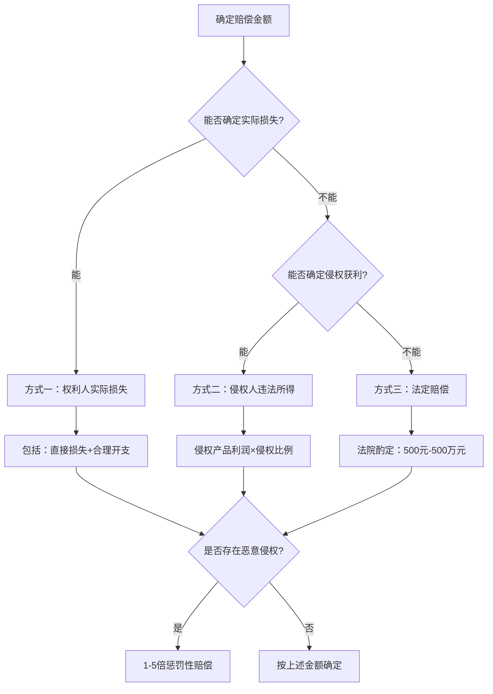
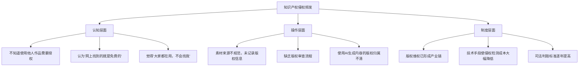
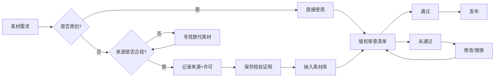

## 案例七：知识产权侵权——字体、图片与内容搬运的连环雷

### 案例背景

#### 人物画像

张明（化名），28岁，某互联网公司UI设计师，月薪15000元。2023年初开始做副业，在淘宝和小红书经营原创手机壳和帆布包定制生意，同时运营一个设计类自媒体账号（公众号+小红书）。

#### 业务模式

- **产品端**：使用Canva和PS设计图案，上传到淘宝店铺，客户下单后由工厂代发
- **内容端**：每周在公众号和小红书发布3-4篇设计教程和素材分享文章
- **收入状况**：副业月均收入8000-12000元，运营6个月累计收入约6万元

#### 风险埋点

张明在创业过程中存在以下知识产权风险行为，但他自己浑然不知：

1. **字体侵权**：产品设计和宣传图中使用了方正字体（方正倩体、方正静蕾体），未购买商用授权
2. **图片侵权**：小红书文章中使用了从Pinterest和花瓣网下载的图片，未确认版权状态
3. **内容搬运**：公众号文章中约30%的内容直接复制自国外设计博客，仅做了翻译和简单改写
4. **素材盗用**：手机壳设计中使用了一位插画师的原创插画元素，从社交平台下载后直接使用

这些行为在短期内没有引发任何问题，张明也因此放松了警惕。直到2023年7月，三封律师函几乎同时到达。

### 侵权经过与法律后果

#### 第一击：字体侵权——方正字库的维权风暴

**事发经过**

2023年7月初，张明收到北京北大方正电子有限公司的律师函，称其淘宝店铺中28款产品使用了方正倩体和方正静蕾体，侵犯了方正公司的字体著作权。律师函要求：

1. 立即停止使用侵权字体
2. 赔偿经济损失每款字体5万元，共计10万元
3. 在店铺首页刊登道歉声明

**法律分析**

字体侵权是近年来知识产权维权的高发领域。根据《著作权法》，字库软件作为计算机程序受著作权保护，而单个字体的美术作品属性在司法实践中存在争议，但主流判例倾向于保护字库设计公司的权益。

关键法律依据：
- 《著作权法》第三条：美术作品受著作权保护
- 《计算机软件保护条例》：字库软件作为计算机程序受保护
- 最高人民法院相关司法解释：字体侵权的赔偿标准

**赔偿标准**

| 侵权类型 | 法定赔偿范围 | 司法实践常见判赔 | 影响因素 |
|---------|------------|----------------|---------|
| 个人非商用 | 500-5000元/字体 | 1000-3000元 | 使用范围、传播量 |
| 企业商用 | 1万-10万元/字体 | 2万-5万元 | 营业额、侵权规模 |
| 大规模商用 | 10万-100万元 | 按实际损失或违法所得 | 主观恶意、持续时间 |
| 恶意侵权 | 1-5倍惩罚性赔偿 | 3倍左右 | 是否收到警告后继续 |

**张明的处理过程**

1. **恐慌期（第1-3天）**：在网上搜索"字体侵权怎么办"，看到各种吓人的案例，一度想关店跑路
2. **咨询期（第4-7天）**：花了2000元咨询律师，律师评估后认为赔偿金额可以协商
3. **协商期（第2-4周）**：通过律师与方正公司协商，最终以每款字体8000元达成和解，共计16000元
4. **整改期（第5-8周）**：将所有产品图中的方正字体替换为免费商用字体

**经验教训**

```text
字体使用决策树：

是否商用？
├── 是 → 是否有授权？
│       ├── 是 → 放心使用 ✓
│       └── 否 → 必须购买授权或更换字体
└── 否 → 个人学习交流可以合理使用
        └── 但公众号/自媒体仍可能被认定为商用
```

#### 第二击：图片侵权——插画师的千里追诉

**事发经过**

2023年7月中旬，张明收到一位自由插画师的律师函，称其手机壳设计中使用了该插画师的原创IP形象"萌兔少女"系列中的3个角色，侵犯了其著作权。该插画师在微博拥有50万粉丝，其作品具有较高的商业价值。

律师函要求：
1. 立即下架侵权产品
2. 赔偿经济损失15万元（每款5万元）
3. 公开道歉
4. 提供侵权产品的销售数据

**法律分析**

图片侵权的法律认定相对清晰。根据《著作权法》，美术作品自创作完成之日起自动享有著作权，无需登记。使用他人美术作品（包括插画、摄影、设计图等）用于商业目的，必须获得权利人授权。

本案的关键争议点：
- 张明声称图片是从花瓣网下载的，不知道原作者是谁——法院通常不认可"不知道"作为免责理由
- 张明仅使用了插画的部分元素而非完整作品——法院会审查是否构成"实质性相似"
- 张明的使用是否属于"合理使用"——商业用途基本排除合理使用的可能

**赔偿计算方式**

图片侵权的赔偿计算有三种方式，按优先级适用：



**赔偿标准详解**

| 计算方式 | 适用条件 | 金额范围 | 举证要求 |
|---------|---------|---------|---------|
| 实际损失 | 权利人能证明损失 | 按实际计算 | 需提供销售数据、授权费标准等 |
| 违法所得 | 侵权人获利可查 | 按侵权利润 | 需申请法院调取销售记录 |
| 法定赔偿 | 以上均无法确定 | 500元-500万元 | 法院根据作品类型、侵权情节酌定 |
| 惩罚性赔偿 | 故意侵权且情节严重 | 1-5倍基数 | 需证明主观恶意 |

**张明的处理过程**

1. **证据保全**：第一时间对侵权产品页面进行公证保全（费用约2000元）
2. **产品下架**：立即下架涉及侵权的3款手机壳
3. **损失核算**：经统计，3款侵权产品的总销售额为18000元，利润率约40%，违法所得约7200元
4. **协商谈判**：通过律师与插画师协商，最终以赔偿35000元达成和解（含合理开支5000元）
5. **后续合作**：意外的是，张明在沟通中展示了自己其他原创作品的水平，插画师后来反而邀请他合作开发联名产品

#### 第三击：内容搬运——版权方的批量维权

**事发经过**

2023年7月下旬，张明收到某设计媒体平台的律师函，称其公众号中有12篇文章涉嫌抄袭该平台的原创内容。该平台是国内知名的设计垂直媒体，拥有专业的版权维权团队。

**法律分析**

文字作品的著作权保护同样自创作完成之日起生效。翻译、改编他人作品需要获得原作者授权。张明的"翻译+改写"行为可能构成对原作品的改编权侵权。

关键判断标准：
- **实质性相似**：文章结构、核心观点、案例引用是否与原文高度一致
- **独创性贡献**：张明是否添加了足够的独创性内容
- **转换性使用**：是否对原作品进行了实质性的转换

**自媒体内容侵权的赔偿标准**

| 侵权情形 | 赔偿范围 | 典型判赔 | 备注 |
|---------|---------|---------|------|
| 单篇文章少量引用 | 500-2000元 | 800-1500元 | 需注明出处，否则仍构成侵权 |
| 单篇文章大量复制 | 2000-10000元 | 3000-5000元 | 即使有改写仍可能构成侵权 |
| 批量搬运（10篇以上） | 1万-50万元 | 按篇累计+惩罚 | 可能涉及刑事责任 |
| 洗稿（AI改写规避检测） | 1000-5000元/篇 | 2000-3000元 | 2024年后司法态度趋严 |
| 盗用完整视频/课程 | 5万-100万元 | 按销售额计算 | 涉及信息网络传播权 |

**张明的处理过程**

1. **自查范围**：对自己公众号所有58篇文章进行全面排查，发现12篇存在不同程度的搬运
2. **证据固定**：将涉嫌侵权的文章截图存档，对比原文的相似度
3. **主动沟通**：在律师建议下，主动联系平台版权负责人，表达诚意
4. **和解方案**：最终以每篇2000元的标准赔偿，共计24000元，并删除全部侵权文章
5. **内容重建**：将删除的12篇文章全部基于自己的经验重新撰写

### 案例最终结果

#### 经济损失汇总

| 侵权类型 | 赔偿金额 | 律师费用 | 其他费用 | 小计 |
|---------|---------|---------|---------|------|
| 字体侵权 | 16000元 | 2000元 | 0 | 18000元 |
| 图片侵权 | 35000元 | 3000元 | 2000元（公证费） | 40000元 |
| 内容搬运 | 24000元 | 2000元 | 0 | 26000元 |
| **合计** | **75000元** | **7000元** | **2000元** | **84000元** |

张明副业6个月的总收入约6万元，而知识产权侵权的赔偿总额达到84000元——不仅赔光了全部收入，还倒贴了24000元。这还不算产品下架、内容删除、店铺降权等隐性损失。

#### 时间成本

从收到第一封律师函到达成全部和解，历时约3个月。期间张明的副业基本停摆，主业也受到影响（频繁请假处理法律事务）。

#### 心理影响

张明事后坦言，最痛苦的不是赔钱，而是那种"不知道什么时候会再收到律师函"的焦虑感。在和解后的半年里，他每次发布新作品前都会反复检查版权问题，甚至一度产生了"不敢创作"的心理障碍。

### 深度复盘：为什么知识产权侵权如此普遍？

#### 根本原因分析



#### 版权维权产业链揭秘

近年来，知识产权维权已经形成了完整的产业链：

**第一层：版权代理公司**
- 从创作者手中批量获取作品的维权授权
- 建立庞大的作品数据库
- 使用AI技术自动监测全网侵权行为

**第二层：技术监测平台**
- 图片反向搜索：TinEye、百度识图、Google Lens
- 文字查重：自建查重系统，覆盖主流内容平台
- 字体识别：通过OCR识别图片中的字体类型

**第三层：律所批量维权**
- 与版权代理公司合作，批量发送律师函
- 采用"先发函后谈价"的策略
- 单个案件利润率极高（律师函模板化，边际成本趋近于零）

**第四层：和解收割**
- 大多数被告选择和解而非诉讼
- 和解金额通常低于诉讼预期，但高于合理范围
- 批量操作下，单个案件的和解金额积少成多

了解这个产业链的意义在于：**不要心存侥幸**。如果你使用了他人的作品用于商业目的，被发现只是时间问题。

### 预防体系：从零建立知识产权合规

#### 第一步：素材来源合规化

**免费商用字体清单**

| 字体名称 | 来源 | 商用许可 | 适用场景 |
|---------|------|---------|---------|
| 思源黑体/宋体 | Google + Adobe | 完全免费商用 | 正文、标题、设计 |
| 阿里巴巴普惠体 | 阿里巴巴 | 完全免费商用 | 电商、品牌设计 |
| 站酷系列字体 | 站酷网 | 完全免费商用 | 设计、标题 |
| 微软雅黑（仅Windows预览） | 微软 | 系统内使用免费 | 屏幕显示 |
| OPPO Sans | OPPO | 完全免费商用 | 科技、极简风格 |
| HarmonyOS Sans | 华为 | 完全免费商用 | 科技、UI设计 |

**免费商用图片来源**

| 平台 | 许可类型 | 图片质量 | 注意事项 |
|------|---------|---------|---------|
| Unsplash | 完全免费商用 | 高 | 不可用于竞品或敏感内容 |
| Pexels | 完全免费商用 | 高 | 不可转售原图 |
| Pixabay | 完全免费商用 | 中高 | 需确认具体图片的许可 |
| StockSnap | CC0许可 | 中高 | 部分图片需署名 |
| 创客贴 | 平台会员商用 | 中 | 需持续订阅 |
| 千图网 | 平台会员商用 | 中 | 需确认具体授权范围 |

**重要提醒**：即使是免费商用素材，也要做到：
1. 保存下载记录（截图+链接）
2. 记录素材的许可类型
3. 按要求署名（如果许可要求的话）
4. 定期检查许可状态是否变更

#### 第二步：建立版权审查清单

每次发布作品前，按以下清单逐项检查：

**产品设计类**

- [ ] 使用的字体是否为免费商用字体或已购买授权？
- [ ] 使用的图片/插画是否为原创或有合法授权？
- [ ] 设计中的图案元素是否可能侵犯他人美术作品著作权？
- [ ] 产品外观是否可能侵犯他人外观设计专利？
- [ ] 产品名称是否可能侵犯他人商标权？
- [ ] 是否保存了所有素材的来源记录和授权证明？

**内容创作类**

- [ ] 文章内容是否为原创或有合法引用？
- [ ] 引用他人观点是否注明出处？
- [ ] 使用的图片是否标注来源和版权信息？
- [ ] 翻译外文内容是否获得原作者授权？
- [ ] 使用AI生成的内容是否进行了充分的二次创作？
- [ ] 转载内容是否获得原作者/平台的转载许可？

#### 第三步：建立合规工作流



#### 第四步：AI生成内容的版权注意事项

随着AI创作工具的普及，新的版权问题正在浮现：

**AI生成内容的版权现状（2024年）**

| 问题 | 现行规则 | 风险等级 |
|------|---------|---------|
| AI生成的图片是否有版权？ | 中国：独创性贡献足够时可获得版权保护 | 中 |
| AI生成内容是否侵犯他人版权？ | 取决于训练数据和输出结果的相似度 | 高 |
| 使用AI改写他人文章是否侵权？ | 实质性相似仍构成侵权 | 高 |
| AI生成的图片是否可能与他人作品相似？ | 存在风险，需人工审查 | 中高 |

**AI创作的安全操作规范**

1. **不要直接使用AI生成的图片用于商业目的**——先用反向图片搜索检查是否与现有作品高度相似
2. **不要用AI改写他人文章**——即使通过了查重，法律上的"实质性相似"标准比查重更严格
3. **AI生成的文案需要大幅二次创作**——添加个人观点、案例分析、原创数据等独创性内容
4. **保存AI创作的完整记录**——包括prompt、生成过程、人工修改记录，以备版权争议时举证

### 常见误区与纠正

#### 误区一："我在花瓣网/Pinterest找到的图片就是免费的"

**真实情况**：花瓣网和Pinterest是图片收藏/分享平台，不是版权授权平台。上面的图片绝大多数有版权保护，平台本身也不授予用户商用权利。

**正确做法**：只从明确标注"免费商用"的平台获取素材（如Unsplash、Pexels），并且保存下载记录。

#### 误区二："我只用了一小部分，不算侵权"

**真实情况**：著作权侵权的判断标准是"实质性相似"，而不是使用比例。即使只使用了插画的一个角色、文章的一个段落，如果构成原作品的核心表达，仍然可能侵权。

**正确做法**：如果需要引用他人作品，必须注明出处，且引用比例不应超过合理范围。商业用途基本不存在"少量使用"的豁免。

#### 误区三："我已经注明了原作者，就不算侵权了"

**真实情况**：注明出处是《著作权法》中"合理使用"的条件之一，但合理使用有严格的前提条件——必须是"为个人学习、研究或欣赏"等非商业用途。商业用途下，即使注明了原作者，仍然需要获得授权。

**正确做法**：商业用途必须获得授权，注明出处只是基本的学术规范，不能替代授权。

#### 误区四："字体是电脑自带的，可以随便用"

**真实情况**：操作系统预装的字体通常只授权屏幕显示使用，不包括商用。例如，Windows系统中的微软雅黑字体，在系统内显示免费，但将其用于产品设计、印刷出版则需要额外授权。

**正确做法**：使用字体前确认其商用许可。不确定的情况下，使用思源黑体、阿里巴巴普惠体等明确免费商用的字体。

#### 误区五："对方没有注册版权，我用了也没事"

**真实情况**：中国著作权法采用"自动保护"原则，作品自创作完成之日起自动享有著作权，不需要登记。版权登记只是便于举证，不是获得权利的前提条件。

**正确做法**：不要假设未登记的作品没有版权。只要是你从网上找到的原创内容（图片、文章、设计等），默认都有版权保护。

### 进阶知识：知识产权保护的主动策略

#### 为自己的作品建立版权保护

不仅要知道如何避免侵权，还要学会保护自己的知识产权：

**版权保护四步法**

1. **创作留痕**
   - 保留创作过程的记录（草稿、修改历史、创作时间线）
   - 使用带有时间戳的工具（如Git、云文档的版本历史）
   - 重要作品可以进行版权登记（中国版权保护中心，费用约300-500元/件）

2. **权利声明**
   - 在所有发布的作品中加入版权声明
   - 使用Creative Commons许可协议明确授权范围
   - 在网站/店铺中加入知识产权声明页面

3. **侵权监测**
   - 图片：定期使用TinEye、百度识图搜索自己的作品
   - 文字：使用维权骑士、原创宝等文字监测工具
   - 产品：在电商平台搜索关键词，检查是否有仿冒

4. **维权行动**
   - 发现侵权后，第一时间保全证据（公证或区块链存证）
   - 先发警告函，给对方改正机会
   - 协商不成时，通过法律途径维权

#### 商标保护的战略价值

对于做副业/创业的人来说，商标保护往往被忽视，但其价值巨大：

| 保护对象 | 注册成本 | 保护期限 | 商业价值 |
|---------|---------|---------|---------|
| 品牌名称 | 270元/类 | 10年（可续展） | 防止他人抢注，保护品牌价值 |
| Logo设计 | 270元/类 | 10年（可续展） | 防止视觉识别被盗用 |
| 产品外观 | 500元/件 | 15年 | 防止产品被仿冒 |
| 技术方案 | 发明4050元/件 | 20年 | 防止核心技术被抄袭 |

**商标注册的时机**：在你的副业/品牌开始有知名度之前就注册。等到品牌做大了再注册，可能发现已经被别人抢注——届时要么花高价买回来，要么被迫改名。

### 工具箱

#### 版权检测工具

| 工具名称 | 功能 | 费用 | 适用场景 |
|---------|------|------|---------|
| TinEye | 图片反向搜索 | 免费基础版 | 检查图片是否已被他人使用 |
| 百度识图 | 图片反向搜索 | 免费 | 中文互联网图片检索 |
| 维权骑士 | 文字原创监测 | 付费 | 自媒体内容版权保护 |
| 360查字体 | 字体版权检测 | 免费 | 检查系统字体的商用许可 |
| 中国版权保护中心 | 版权登记 | 300-500元/件 | 重要作品的版权登记 |
| 区块链存证平台 | 创作时间戳存证 | 几十元/次 | 证明作品创作时间 |

#### 合同模板

**素材授权协议核心条款**

在使用他人素材时，务必签订书面授权协议，至少包含以下条款：

1. **授权范围**：明确授权的使用方式（线上/线下、国内/全球、特定平台/全平台）
2. **授权期限**：永久授权还是限期授权
3. **独占性**：独占授权、排他授权还是普通授权
4. **转授权**：是否有权将素材再授权给第三方使用
5. **修改权**：是否可以对素材进行修改、改编
6. **署名要求**：是否需要注明作者
7. **费用与支付**：授权费用及支付方式
8. **违约责任**：违反授权范围使用的后果

### 案例启示总结

张明的经历揭示了副业/创业中知识产权风险的三个核心教训：

**教训一：免费的最贵**

从网上随便下载素材看似零成本，但一旦被追诉，赔偿金额远超购买正版授权的费用。一套正版字体授权通常几百到几千元，而侵权赔偿动辄上万元。正版素材的"贵"是可预期的小额支出，侵权赔偿的"贵"是不可预期的大额损失。

**教训二：侥幸心理是最大的风险**

很多副业从业者的心态是"大家都在用，不会找上我"。但版权维权已经产业化、技术化，AI监测手段使侵权检测成本趋近于零。被发现不是"会不会"的问题，而是"什么时候"的问题。

**教训三：合规是投资，不是成本**

建立知识产权合规体系需要投入时间和金钱（购买正版素材、学习版权知识、建立审查流程），但这种投入是保护副业长久发展的必要成本。没有合规基础的副业，随时可能因为一次侵权追诉而归零。

> **核心原则**：在知识产权领域，"不知道"不是免责理由，"大家都在用"不是合法理由，"只用了一点点"不是合理使用的理由。唯一的安全策略是：**要么自己创作，要么获得授权**。
