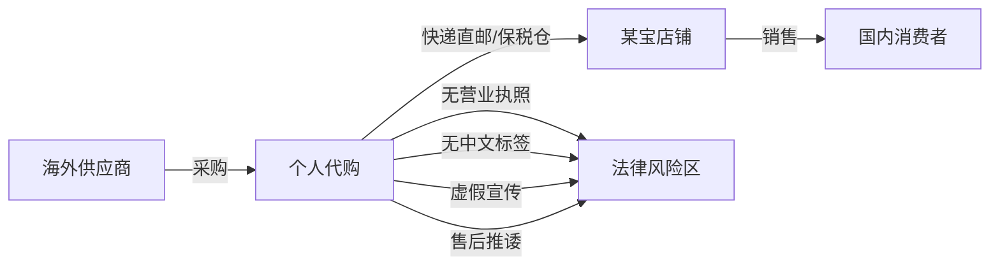
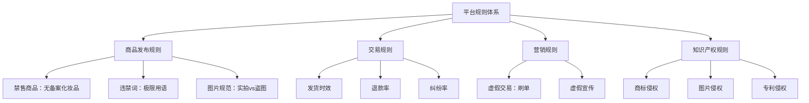
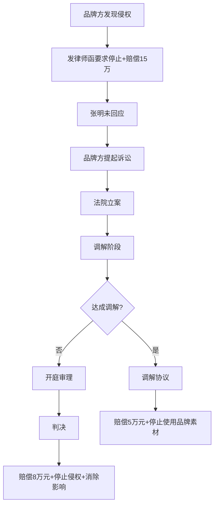
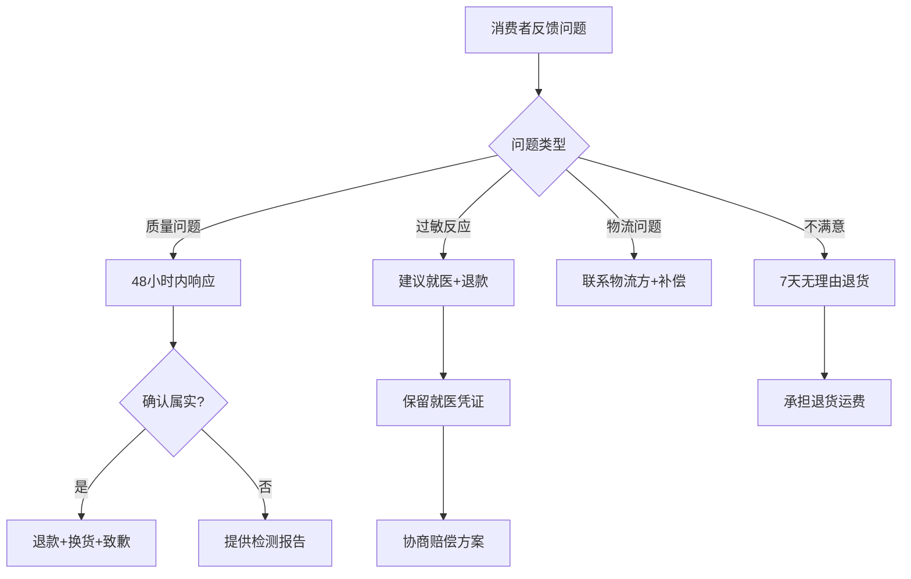
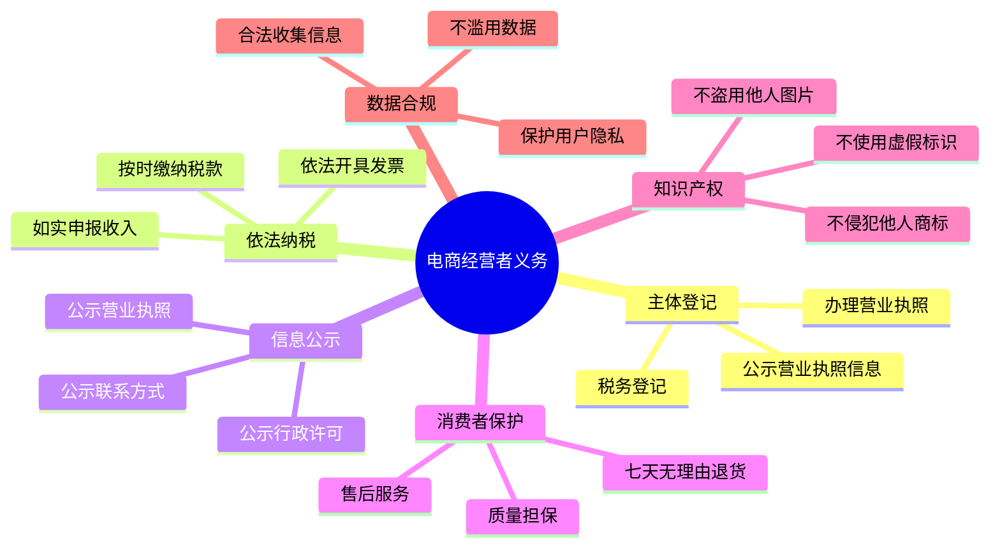
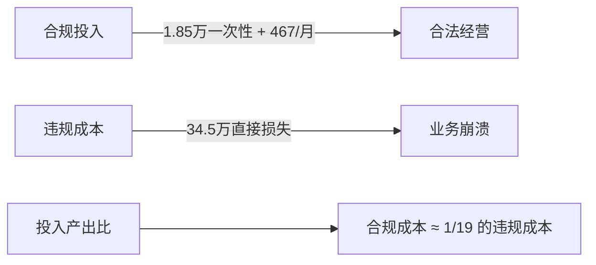

## 案例八：电子商务法律纠纷

> **案例核心**：一个从个人代购转型为电商创业者的全过程——从年销200万到被平台处罚、消费者投诉、品牌方起诉，最终通过系统性合规重建实现合法经营的完整经历。本案例涵盖《电子商务法》《消费者权益保护法》《广告法》《产品质量法》等多部法律在电商场景中的交叉适用。

### 一、案例背景

#### 1.1 人物画像

张明（化名），28岁，原为某外贸公司职员，2022年开始利用业余时间在某宝平台做跨境电商代购，主营进口化妆品和保健品。经过一年积累，月销售额从最初的3000元增长到15万元，2023年全年GMV突破200万元。

#### 1.2 业务模式



张明的业务模式本质上是典型的"个人代购转电商"路径：

| 阶段 | 时间 | 月销售额 | 经营形态 | 合规状态 |
|------|------|----------|----------|----------|
| 起步期 | 2022.1-6 | 3000-8000元 | 个人代购，朋友圈+某宝 | 完全不合规 |
| 成长期 | 2022.7-12 | 2-8万元 | 某宝店铺，少量囤货 | 部分合规 |
| 爆发期 | 2023.1-8 | 10-15万元 | 有仓库，雇1名客服 | 大量违规 |
| 危机期 | 2023.9-12 | 骤降至2万元 | 被投诉/处罚/诉讼 | 全面暴雷 |
| 重建期 | 2024.1-6 | 逐步恢复至12万元 | 注册公司，系统合规 | 合规经营 |

#### 1.3 危机爆发的时间线

2023年9月，三件事几乎同时发生，将张明推入法律困境：

1. **消费者集体投诉**：7名消费者向12315投诉其销售的某日本美白精华无中文标签、成分与宣传不符
2. **平台处罚**：某宝以"发布虚假宣传信息"为由扣12分、罚款2万元、店铺降权30天
3. **品牌方律师函**：某国际品牌发来律师函，指控其未经授权使用品牌商标和官方图片，要求赔偿15万元

这三件事叠加在一起，不仅让张明面临约20万元的直接经济损失，更让他的店铺流量断崖式下跌，月销售额从15万元暴跌至2万元。

### 二、纠纷详解：三线作战

#### 2.1 第一条线：消费者权益纠纷

##### 问题本质

张明销售的进口化妆品存在三个致命问题：

**问题一：无中文标签**

根据《产品质量法》第二十七条和《化妆品监督管理条例》第三十五条，进口化妆品必须加贴中文标签，标注产品名称、原产国、进口商名称及地址、成分表、使用方法、保质期等信息。张明为节省成本，直接销售日文原包装产品，仅在快递包裹里塞一张自行翻译的A4纸。

**问题二：虚假功效宣传**

店铺详情页使用了"7天美白""淡化色斑99%""皮肤科医生推荐"等宣传语。根据《广告法》第四条和第二十八条，这些表述属于虚假广告：

- "7天美白"——无法提供临床试验数据证明
- "淡化色斑99%"——夸大效果，无数据支撑
- "皮肤科医生推荐"——虚构背书，无法提供授权

**问题三：售后推诿**

消费者反馈使用后出现过敏反应，张明以"个人体质问题""代购商品不退不换"为由拒绝处理。根据《消费者权益保护法》第二十四条，经营者提供的商品不符合质量要求的，消费者可以要求退货、换货或修理。

##### 法律后果分析

| 违法行为 | 适用法律 | 法律后果 | 实际处罚 |
|----------|----------|----------|----------|
| 销售无中文标签化妆品 | 产品质量法第27条 | 货值金额等值以上3倍以下罚款 | 没收违法所得+罚款3万元 |
| 虚假功效宣传 | 广告法第28条 | 广告费用3-5倍罚款，无法计算的处20-100万元 | 罚款5万元 |
| 拒绝履行三包义务 | 消保法第24条 | 赔偿消费者损失 | 退款+赔偿共1.2万元 |

##### 处理过程

张明最初试图与消费者私下协商，提出"退一赔一"的方案（退还货款+等额赔偿），但7名消费者中有3人不接受，坚持要求"退一赔三"（消保法第五十五条的惩罚性赔偿）。

最终在市场监管部门调解下，张明同意：
- 对所有投诉消费者执行退款+货款三倍赔偿
- 提交整改报告，承诺加贴中文标签
- 接受行政处罚

**总花费**：退款约2.4万元 + 三倍赔偿约3.6万元 + 行政罚款8万元 = **约14万元**

#### 2.2 第二条线：平台规则违规

##### 某宝平台处罚逻辑

电商平台有自己的一套规则体系，与法律法规并行但又不完全重合。张明在平台上面临的问题：



##### 具体违规项与处罚

| 违规项 | 平台规则依据 | 处罚措施 | 对店铺的影响 |
|--------|-------------|----------|-------------|
| 虚假宣传（极限词） | 广告法+平台发布规则 | 扣12分+罚款2万元 | 搜索降权30天 |
| 盗用品牌官方图片 | 知识产权保护规则 | 扣6分+删除链接 | 失去品牌关键词流量 |
| 无中文标签商品 | 平台禁售规则 | 删除商品+扣2分 | 核心SKU下架 |
| 刷单（前期有少量操作） | 虚假交易规则 | 扣48分+屏蔽店铺 | 店铺面临关店风险 |

##### 平台申诉的关键教训

张明犯了一个典型的错误——在收到平台处罚通知后，盲目提交申诉，结果因为"申诉理由不成立"导致二次扣分。

正确的申诉策略应该是：

1. **仔细研读处罚依据**：明确平台引用的具体规则条款
2. **收集有利证据**：如供应商资质、进货凭证、产品检测报告等
3. **针对性回复**：逐条回应违规指控，而不是笼统否认
4. **利用平台争议解决机制**：如某宝的"平台争议处理中心"

张明后来了解到，平台处罚和行政处罚是两条线——平台扣分不能代替行政罚款，行政处罚也不能免除平台处罚。两者需要分别应对。

#### 2.3 第三条线：品牌方知识产权诉讼

##### 纠纷起因

张明的店铺使用了某日本化妆品品牌的官方产品图、品牌logo和"官方授权经销商"的虚假标识。品牌方通过知识产权代理公司进行线上巡查，发现张明的店铺后，以商标侵权和不正当竞争为由提起诉讼。

##### 诉讼过程



##### 法律分析

**商标侵权认定的关键要素**：

根据《商标法》第五十七条，未经商标注册人的许可，在同一种商品上使用与其注册商标相同的商标的，构成商标侵权。张明的行为包括：

1. **在店铺名称中使用品牌名**：如"XX品牌代购专营店"——构成商标性使用
2. **在商品详情页使用品牌logo**——构成商标性使用
3. **使用"官方授权"标识**——构成虚假宣传+不正当竞争

**一个重要区分**：正品代购是否构成商标侵权？

这个问题在法律上存在争议。根据"商标权用尽"原则，正品经商标权人许可投放市场后，商标权人不能再控制该商品的后续转售。但以下情况例外：

- 未经许可使用商标进行宣传推广（超出了指示性合理使用的范围）
- 销售的商品虽为正品但改变了包装或品质
- 使用商标的方式可能导致消费者误认为是官方授权店铺

张明的问题不在于销售正品代购商品本身，而在于**使用品牌官方图片和"官方授权"标识**进行宣传。

##### 最终结果

在法院主持下达成调解：
- 张明赔偿品牌方5万元
- 立即删除所有使用品牌商标的宣传素材
- 不得使用"官方授权""官方代购"等标识
- 在店铺首页发布致歉声明（持续15天）

**知识产权诉讼的额外成本**：
- 赔偿金：5万元
- 律师费：1.5万元（聘请律师应诉）
- 致歉声明的商誉损失：难以量化

### 三、危机应对：系统性合规重建

#### 3.1 应急处理（第1-2周）

张明在律师帮助下，制定了分阶段的危机应对方案：

**立即停止的行为**：
- 删除所有含极限词的宣传文案
- 删除所有使用品牌官方图片的商品链接
- 暂停销售无中文标签的库存商品
- 停止使用"官方授权"等虚假标识

**立即启动的事项**：
- 聘请专业律师处理品牌方诉讼
- 向市场监管部门主动提交整改报告
- 对库存商品进行清点和分类

#### 3.2 合规重建（第3-8周）

##### 第一步：注册合法经营主体

张明注册了一家个体工商户（后升级为有限公司），完成以下法定手续：

| 手续 | 内容 | 费用 | 时间 |
|------|------|------|------|
| 工商注册 | 个体工商户→有限公司 | 0元（自行办理） | 3-5个工作日 |
| 税务登记 | 国税+地税备案 | 0元 | 同步完成 |
| 食品经营许可证 | 如销售保健品需要 | 0元 | 20个工作日 |
| 海关备案 | 如做跨境电商 | 0元 | 10个工作日 |
| 对公账户 | 银行开户 | 500-1000元 | 3个工作日 |

##### 第二步：产品合规化

这是耗时最长也最关键的环节：

**中文标签制作**：

进口化妆品中文标签必须包含以下信息（依据《化妆品监督管理条例》第三十五条）：

```text
产品中文名称
原产国/地区
生产企业名称及地址
进口商/经销商名称及地址
净含量
成分表（INCI名称）
使用方法
注意事项
保质期（生产日期+保质期 或 生产日期+限期使用日期）
批准文号/备案号（特殊化妆品需批准文号）
```

**供应商资质审核**：

张明建立了供应商准入标准：

1. 海外供应商必须提供品牌授权书或合法进货凭证
2. 每批次商品需附带原产地证明和质量检测报告
3. 首次合作的供应商需提供小批量样品进行第三方检测
4. 签订正式采购合同，明确质量标准和违约责任

##### 第三步：店铺内容合规

**宣传文案全面审查**：

张明按照《广告法》的要求，对所有商品详情页进行了全面审查：

| 审查项 | 违规示例 | 合规改写 |
|--------|---------|---------|
| 绝对化用语 | "最好的美白产品" | "热销美白产品" |
| 虚假功效承诺 | "7天见效" | "坚持使用可能改善肤色"（附说明） |
| 虚假背书 | "医生推荐" | 删除（无授权不得使用） |
| 极限词 | "第一名""独一无二" | 删除或改为客观描述 |
| 对比贬低 | "比XX品牌好10倍" | 删除（涉嫌不正当竞争） |

**图片合规**：
- 删除所有从品牌官网下载的图片
- 聘请摄影师拍摄实拍图
- 自行制作商品对比图和使用说明图
- 保留图片来源的原始文件，作为原创证明

##### 第四步：售后体系重建

建立标准的售后处理流程：



**售后话术标准化**：
- 不推卸责任：不说"个人体质问题"
- 积极处理：不拖延、不敷衍
- 记录留痕：所有沟通通过平台聊天工具进行
- 赔偿标准：质量问题退一赔三，不满意7天无理由退货

#### 3.3 合规成本核算

合规重建的投入如下：

| 项目 | 一次性费用 | 月度费用 | 备注 |
|------|-----------|----------|------|
| 公司注册+开户 | 1,500元 | - | 含代办费 |
| 中文标签制作 | 3,000元 | - | 首批2000张 |
| 产品检测费 | 8,000元 | - | 3款核心产品送检 |
| 实拍产品图 | 5,000元 | - | 专业摄影师拍摄 |
| 法律顾问 | - | 2,000元/年 | 按年付费，均摊约167元/月 |
| 记账代理 | - | 300元/月 | 小规模纳税人 |
| 平台年费 | 1,000元 | - | 某宝企业店铺 |
| **合计** | **约18,500元** | **约467元/月** | |

与危机造成的损失（约34万元）相比，合规成本微不足道。

### 四、法律深度解析：电商经营的法律框架

#### 4.1 电商经营者的核心法律义务

2019年1月1日实施的《电子商务法》是电商领域的基本法。作为电商经营者，必须了解以下核心义务：



##### 个体经营者的特殊规定

《电子商务法》第十条规定了一个重要例外：个人销售自产农副产品、家庭手工业产品，以及个人利用自己的技能从事依法无须取得许可的便民劳务活动和零星小额交易活动，不需要办理市场主体登记。

但"零星小额"的认定标准因地区而异，一般参考标准为年交易额不超过10万元。张明年销售额200万元，远远超出了这个标准。

#### 4.2 电商平台的责任划分

电商平台在不同情况下的法律责任不同：

| 情形 | 平台责任 | 法律依据 |
|------|----------|----------|
| 平台自营商品 | 承担销售者责任 | 电商法第37条 |
| 知道或应当知道经营者侵权 | 与经营者承担连带责任 | 电商法第38条第1款 |
| 未尽到审核义务，造成消费者损害 | 承担相应的补充责任 | 电商法第38条第2款 |
| 对关系消费者生命健康的商品未尽审核义务 | 承担相应的责任 | 电商法第38条第2款 |
| 仅提供网络服务的中间平台 | 接到通知后及时删除/断开链接 | 民法典第1195条 |

##### 一个真实案例的启示

2021年，某消费者在某多多平台购买了一款"XX牌"电动剃须刀，收到后发现是山寨产品。消费者起诉平台要求赔偿，法院判决：

- 商家：承担主要赔偿责任（退一赔三）
- 平台：因已公示商家信息且及时下架问题商品，不承担连带责任

这个案例说明，平台是否承担责任，关键看其是否尽到了合理的审核义务和事后处理义务。

#### 4.3 跨境电商的特殊法律问题

张明做的跨境代购涉及额外的法律问题：

##### 海关与关税

| 模式 | 税费 | 限额 | 适用场景 |
|------|------|------|----------|
| 个人行邮 | 行邮税（15%-50%） | 单次5000元，年度26000元 | 个人代购 |
| 跨境电商零售进口 | 综合税（关税0%+增值税/消费税70%） | 单次5000元，年度26000元 | 正规跨境电商平台 |
| 一般贸易进口 | 正常关税+增值税+消费税 | 无限制 | 企业进口 |

张明最初以"个人行邮"方式避税，但当业务量达到一定规模后，海关可能认定为"以贸易为目的的进口"，要求按照一般贸易方式补缴税款。

**真实的法律红线**：个人代购如果偷逃税款超过10万元，可能构成走私普通货物罪，处三年以下有期徒刑或者拘役，并处偷逃应缴税额一倍以上五倍以下罚金。

##### 进口化妆品备案

根据《化妆品监督管理条例》：

- **特殊化妆品**（美白、防晒、染发等）：需取得国家药监局的注册证
- **普通化妆品**：需进行备案
- **未经注册或备案的化妆品**：不得上市销售

张明销售的美白精华属于特殊化妆品，如果未取得中国的注册批件就销售，将面临没收产品+货值5-20倍罚款的处罚。

### 五、关键教训与实操清单

#### 5.1 电商合规自检清单

以下是每个电商经营者都应该定期执行的合规自检：

**主体资质检查（每月）**：
- [ ] 营业执照是否在有效期内
- [ ] 营业执照信息是否在店铺页面公示
- [ ] 特殊品类是否有相应许可证（食品经营许可、医疗器械许可等）
- [ ] 税务登记是否正常，是否有欠税

**商品合规检查（每批次）**：
- [ ] 产品是否有中文标签（进口商品）
- [ ] 中文标签信息是否完整、准确
- [ ] 产品是否有质检报告或检测报告
- [ ] 产品是否在保质期内
- [ ] 化妆品/食品是否有注册/备案号

**宣传合规检查（每周）**：
- [ ] 是否使用了极限词（最好、第一、唯一等）
- [ ] 是否有虚假功效承诺
- [ ] 是否使用了未经授权的品牌图片
- [ ] 是否有"官方授权"等虚假标识
- [ ] 促销活动规则是否清晰、是否存在价格欺诈

**售后合规检查（持续）**：
- [ ] 是否支持七天无理由退货
- [ ] 退换货流程是否清晰
- [ ] 消费者投诉是否在48小时内响应
- [ ] 是否存在大量未处理的纠纷

**知识产权检查（每月）**：
- [ ] 店铺名称是否侵犯他人商标
- [ ] 商品图片是否为原创或已获授权
- [ ] 商品描述是否抄袭他人文案
- [ ] 是否使用了他人的专利技术

#### 5.2 广告法高频违规词速查

电商宣传中最容易触雷的词汇分类：

| 类别 | 违规词汇示例 | 合规替代 |
|------|-------------|---------|
| 极限词 | 最好、最佳、第一、唯一、NO.1 | 优质、热销、推荐 |
| 虚假承诺 | 100%有效、无效退款、根治 | 可能改善、坚持使用 |
| 权威背书 | 国家级、驰名、免检、专家推荐 | 删除或提供授权证明 |
| 时间承诺 | 3天见效、7天美白、30天去皱 | 坚持使用可能改善 |
| 对比贬低 | 比XX好、超越XX、碾压XX | 删除 |
| 暗示疗效 | 治疗、治愈、药用、处方级 | 护理、保养、修护 |

#### 5.3 电商合同的注意事项

电商经营中需要签订的合同类型及关键条款：

**供应商合同**：
- 质量标准条款：明确产品应符合的国家标准或行业标准
- 违约责任条款：产品不合格的退换货和赔偿机制
- 知识产权担保条款：供应商保证产品不侵犯第三方知识产权
- 售后支持条款：供应商对产品质量问题的协助义务

**物流合同**：
- 时效承诺：明确送达时间和延迟赔偿标准
- 货损赔偿：明确损坏/丢失的赔偿标准和流程
- 保价条款：高价值商品的保价运输方案

**平台服务协议**：
- 佣金/服务费条款：清楚了解平台的收费结构
- 违规处罚条款：了解哪些行为会触发处罚
- 数据使用条款：平台对店铺数据的使用范围

#### 5.4 消费者投诉的正确应对流程

当收到消费者投诉时，不要慌张，按照以下流程处理：

**第一步：分类判断（24小时内）**

| 投诉类型 | 严重程度 | 处理优先级 |
|----------|----------|-----------|
| 产品质量问题（过敏/伤害） | 极高 | 立即处理 |
| 假货/山寨指控 | 高 | 24小时内回应 |
| 虚假宣传指控 | 高 | 24小时内回应 |
| 物流损坏/延迟 | 中 | 48小时内解决 |
| 不满意/不想要 | 低 | 按正常退货流程 |

**第二步：证据固定**
- 保存与消费者的全部聊天记录
- 截图保存消费者上传的图片/视频
- 保留相关产品的进货凭证、质检报告
- 记录产品批次信息，便于追溯

**第三步：协商解决**
- 态度诚恳，不推诿责任
- 提出合理的解决方案（退款、换货、补偿）
- 达成一致后书面确认（通过平台聊天工具）

**第四步：无法协商时**
- 引导消费者通过平台争议解决机制处理
- 如涉及行政处罚，积极配合市场监管部门调查
- 如收到律师函或法院传票，立即咨询专业律师

### 六、常见误区与纠正

#### 误区一："我是个人卖家，不需要营业执照"

**真实情况**：《电子商务法》第十条的豁免范围非常有限——仅限于自产农副产品、家庭手工业产品、便民劳务活动和零星小额交易。绝大多数电商经营者都需要办理市场主体登记。不办理营业执照的后果包括：被市场监管部门责令限期改正，逾期不改正的处以5000元以上10万元以下罚款。

#### 误区二："我卖的是正品，不会构成侵权"

**真实情况**：即使是正品，如果未经授权使用品牌商标进行宣传推广，仍可能构成商标侵权或不正当竞争。正品代购的合法边界在于"指示性合理使用"——即只能在必要范围内使用品牌名称来描述商品来源（如"适用于XX品牌"），而不能使用品牌logo、官方图片或"官方授权"等标识。

#### 误区三："消费者投诉就退款，息事宁人"

**真实情况**：一味退款而不解决根本问题，会导致两个后果——第一，助长恶意投诉（职业打假人会盯上你），第二，不改变违规行为就会持续被投诉。正确的做法是：个案退款解决当前问题，同时系统性整改消除违规根源。

#### 误区四："刷一点单没关系，平台查不出来"

**真实情况**：各大平台的反作弊系统已经非常成熟，通过交易行为分析、物流数据比对、买家画像分析等多维度检测刷单行为。一旦被认定为虚假交易，处罚极为严厉——轻则删除销量和评价、商品降权，重则扣48分、屏蔽店铺甚至永久关店。更严重的，刷单行为还可能违反《反不正当竞争法》第八条，面临20-100万元的行政罚款。

#### 误区五："出了问题找平台就行，平台有责任"

**真实情况**：平台仅在特定情形下承担连带责任（如自营商品、知道或应当知道侵权、对生命健康商品未尽审核义务）。在大多数情况下，电商经营者作为第一责任人，需要自行承担产品质量、宣传合规、售后服务等方面的法律责任。把希望寄托在平台身上，不如自己做好合规。

### 七、数据驱动的经营启示

#### 7.1 案例成本数据汇总

将张明在整个危机中的全部经济损失汇总：

| 损失项目 | 金额 | 性质 |
|----------|------|------|
| 消费者退赔 | 6万元 | 直接赔偿 |
| 行政罚款 | 8万元 | 法律处罚 |
| 品牌方赔偿 | 5万元 | 知识产权赔偿 |
| 律师费 | 1.5万元 | 维权成本 |
| 平台罚款 | 2万元 | 平台处罚 |
| 流量损失（3个月） | 约12万元 | 间接损失 |
| **总计** | **约34.5万元** | |

#### 7.2 合规投入vs违规成本对比



这个对比清晰地说明：**合规不是成本，而是投资**。张明如果在创业初期就投入2万元做合规建设，可以避免34.5万元的损失。

#### 7.3 合规后经营数据变化

| 指标 | 合规前（2023.8） | 危机期（2023.12） | 合规后（2024.6） |
|------|-----------------|------------------|-----------------|
| 月销售额 | 15万元 | 2万元 | 12万元 |
| 店铺评分 | 4.6 | 4.2 | 4.8 |
| 退货率 | 8% | 25% | 4% |
| 投诉率 | 3.2% | 12% | 0.5% |
| 复购率 | 25% | 10% | 35% |

合规后的店铺评分和复购率反而超过了合规前的水平，说明消费者更信任合规经营的店铺。

### 八、进阶指南：电商经营的法律护城河

#### 8.1 从被动合规到主动防御

成熟的电商经营者应该建立"法律护城河"，不仅避免违规，还要用法律保护自己的权益：

**主动保护知识产权**：
- 注册自己的商标（35类：广告销售+产品所属类别）
- 对原创图片进行版权登记
- 对独创的包装设计申请外观设计专利

**建立合规管理体系**：
- 指定专人负责合规事务
- 建立合规审查流程（新品上架前审查、促销活动前审查）
- 定期进行合规培训（每季度至少一次）
- 建立合规档案（进货凭证、检测报告、授权文件等）

#### 8.2 应对职业打假人

电商经营者经常会遇到职业打假人的"钓鱼式"投诉。应对策略：

1. **预防为主**：做好宣传文案审查，不给打假人把柄
2. **了解法律边界**：职业打假人的维权行为在法律上是合法的（消保法不区分"知假买假"）
3. **标准化应对**：建立统一的投诉处理流程，避免情绪化应对
4. **保留证据**：对异常订单（同一人多次购买、购买数量异常等）做好记录
5. **必要时报警**：如果打假人以投诉为要挟索要高额赔偿，可能构成敲诈勒索

#### 8.3 电商直播的法律风险

如果张明后续扩展到直播带货，需要额外注意：

- **直播内容合规**：直播中说的话等同于广告，受《广告法》约束
- **主播责任**：主播如果对商品功效进行虚假承诺，可能承担连带责任
- **弹幕管理**：对消费者在直播间的投诉和反馈要及时回应
- **录屏保存**：直播内容应至少保存3年，作为日后争议的证据

### 九、总结：电商经营的法律生存法则

通过张明的案例，我们可以提炼出电商经营的五条核心法则：

**法则一：先合规后经营。** 在开店之前就完成主体注册、资质办理、产品合规审查。不要抱有"先做着再说"的侥幸心理——法律风险不会因为你不知道就不存在。

**法则二：知法才能用法。** 了解《电子商务法》《消费者权益保护法》《广告法》《产品质量法》的核心条款，不是为了成为律师，而是为了知道哪些红线不能碰、哪些权利可以主张。

**法则三：专业的事交给专业的人。** 遇到诉讼、行政处罚等复杂法律问题时，一定要聘请专业律师。自己硬抗往往导致更严重的后果（如张明未回应品牌方律师函导致被起诉）。

**法则四：合规是投资不是成本。** 1.85万元的合规投入可以避免34.5万元的损失——这是19倍的投入产出比。把合规当作保险，而不是负担。

**法则五：消费者是核心。** 所有法律的终极目的都是保护消费者权益。做好产品质量、做好售后服务、做好信息透明，消费者自然会用复购和好评回报你。

---

> **本案例的法律启示**：电商不是法外之地。从《电子商务法》到《广告法》，从《消费者权益保护法》到《产品质量法》，电商经营者需要遵守的法律法规数量远超一般人的想象。但法律不是束缚——它是规则，而掌握规则的人才能在竞争中立于不败之地。张明花了34.5万元学到了这个教训，希望读到这里的你不需要付出同样的代价。
