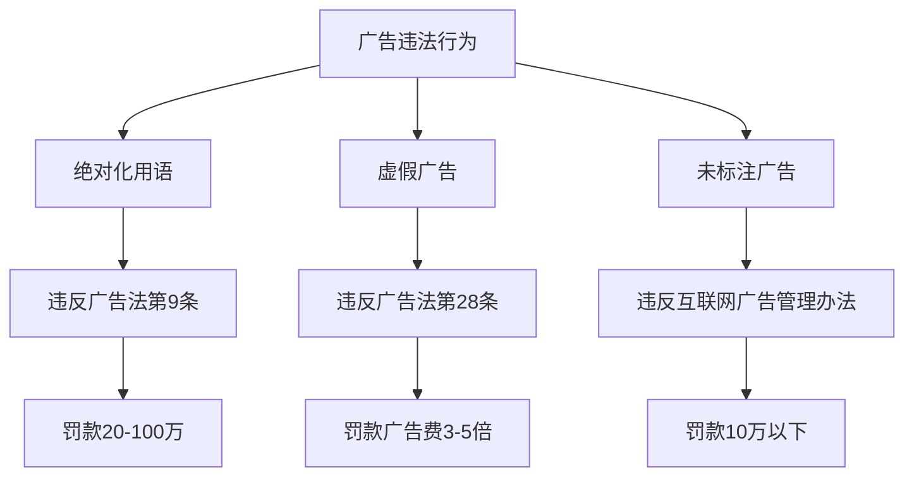
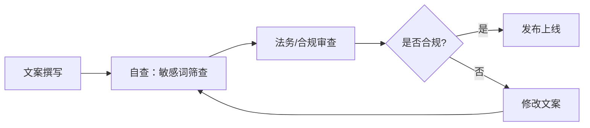

## 案例九：广告法违规案例——从虚假宣传到天价罚款的惨痛教训

### 案例背景

2023年，杭州某电子商务公司在经营淘宝店铺期间，因多次违反《中华人民共和国广告法》相关规定，被市场监督管理部门处以累计超过80万元的罚款。这是一起典型的中小企业在副业经营中因法律意识薄弱而遭受重创的案例。

#### 当事人信息

| 项目 | 详情 |
|------|------|
| 企业名称 | 杭州XX电子商务有限公司 |
| 经营范围 | 化妆品、护肤品线上销售 |
| 经营平台 | 淘宝、抖音、小红书 |
| 年营业额 | 约500万元 |
| 员工规模 | 8人（含创始人） |

#### 违规行为概述

该公司在经营过程中存在以下广告法违规行为：

**第一类：使用绝对化用语**

在商品详情页、直播间话术、短视频文案中多次使用"最好"、"第一"、"顶级"、"国家级"等绝对化用语。例如：

- "全网销量第一的面膜"
- "国家级专利技术"
- "最好的保湿效果"
- "顶级原料，无添加"

**第二类：虚假功效宣传**

对化妆品功效进行夸大宣传，超出产品实际功效范围：

- 普通面膜宣称"7天淡斑"
- 护肤品宣称"医学级修复"
- 普通精华液宣称"逆转衰老20年"

**第三类：虚构用户评价**

通过刷单、编造用户评价等方式进行虚假宣传：

- 雇佣刷单团队制造虚假交易
- 编造"使用前后对比图"
- 虚构"医生推荐"、"专家背书"

**第四类：未标注广告**

在小红书、抖音等平台投放的软文广告未标注"广告"字样，违反《互联网广告管理办法》相关规定。

### 法律依据与违规分析

#### 核心法律条文

**《中华人民共和国广告法》相关条款：**

```text
第九条 广告不得有下列情形：
（三）使用"国家级"、"最高级"、"最佳"等用语；

第二十八条 广告以虚假或者引人误解的内容欺骗、误导消费者的，
构成虚假广告。广告有下列情形之一的，为虚假广告：
（二）商品的性能、功能、产地、用途、质量、规格、成分、价格、
生产者、有效期限、销售状况、曾获荣誉等信息，以及与商品或者
服务有关的允诺等与实际情况不符，对购买行为有实质性影响的；

第五十五条 违反本法规定，发布虚假广告的，由市场监督管理部门
责令停止发布广告，责令广告主在相应范围内消除影响，处广告费
用三倍以上五倍以下的罚款，广告费用无法计算或者明显偏低的，
处二十万元以上一百万元以下的罚款。
```

#### 违规行为法律定性



### 执法过程与处罚结果

#### 执法时间线

| 时间节点 | 事件 | 关键细节 |
|----------|------|----------|
| 2023年3月 | 竞争对手举报 | 同行向市场监管局举报该公司虚假宣传 |
| 2023年4月 | 立案调查 | 市场监管局正式立案，调取店铺后台数据 |
| 2023年5月 | 现场检查 | 执法人员到公司检查，扣押相关证据材料 |
| 2023年6月 | 行政处罚事先告知 | 告知拟处罚内容，当事人有权陈述申辩 |
| 2023年7月 | 听证会 | 公司申请听证，但未改变处罚结果 |
| 2023年8月 | 正式处罚决定 | 下达行政处罚决定书 |
| 2023年9月 | 缴纳罚款 | 公司在规定期限内缴纳罚款 |

#### 处罚结果明细

| 违规行为 | 法律依据 | 罚款金额 |
|----------|----------|----------|
| 使用绝对化用语 | 广告法第57条 | 20万元 |
| 虚假功效宣传 | 广告法第55条 | 45万元 |
| 刷单虚构评价 | 反不正当竞争法第8条 | 15万元 |
| 未标注广告 | 互联网广告管理办法 | 3万元 |
| **合计** | — | **83万元** |

### 直接与间接损失

#### 直接经济损失

| 损失项目 | 金额 |
|----------|------|
| 行政罚款 | 83万元 |
| 律师费（听证+复议） | 5万元 |
| 广告下架整改成本 | 3万元 |
| 库存积压损失 | 12万元 |
| **直接损失合计** | **103万元** |

#### 间接经济损失

| 损失项目 | 影响 |
|----------|------|
| 店铺降权 | 淘宝搜索排名下降90%，流量暴跌 |
| 平台处罚 | 抖音账号封禁30天，小红书限流90天 |
| 品牌信誉 | 消费者信任度大幅下降，复购率从60%降至15% |
| 融资受阻 | 投资方因合规风险终止投资意向 |
| 团队士气 | 核心员工离职3人 |

### 案例深度分析

#### 为什么中小企业容易触犯广告法？

**第一，法律意识薄弱**

许多创业者认为广告法只约束大企业，自己"小打小闹"不会被查。实际上，市场监管部门对中小企业的广告违法行为同样严格执法，且竞争对手举报是常见的触发机制。

**第二，行业内卷导致的"合规焦虑"**

当同行都在使用夸张宣传时，合规经营者反而面临竞争劣势。这种"劣币驱逐良币"的环境，容易诱导企业铤而走险。

**第三，平台规则与法律规定的认知偏差**

许多经营者熟悉平台规则（如淘宝的广告法敏感词过滤），但不了解广告法的完整规定。平台规则只是底线，法律要求更为严格。

**第四，MCN机构和代运营的误导**

部分代运营公司为追求短期效果，怂恿商家使用违规宣传话术，出了问题却由商家承担全部法律责任。

#### 违规宣传的"灰色地带"

| 宣传话术 | 是否违规 | 法律依据 |
|----------|----------|----------|
| "全网热销" | 违规（无法证明） | 需提供全网销售数据证明 |
| "用户好评如潮" | 需谨慎 | 需有真实评价数据支撑 |
| "性价比高" | 一般不违规 | 主观评价，无绝对化含义 |
| "XX明星同款" | 需谨慎 | 需有授权或真实使用证据 |
| "纯天然成分" | 可能违规 | 需有成分检测报告支持 |
| "畅销全球50国" | 需提供证据 | 需有海关出口数据或销售凭证 |

#### 化妆品行业广告法高风险点

化妆品行业是广告法违规的重灾区，主要原因在于：

**功效宣称风险**

《化妆品监督管理条例》对化妆品功效宣称有严格规定：

- 普通化妆品不得宣称特殊功效（如美白、祛斑、防晒等需特殊化妆品批文）
- 功效宣称需有充分科学依据
- 不得使用医疗术语（如"治疗"、"修复"、"药用"）

**常见违规宣称对照表**

| 合规表述 | 违规表述 | 风险等级 |
|----------|----------|----------|
| 帮助改善肌肤状态 | 治疗皮肤病 | 极高 |
| 使肌肤更加光滑 | 去除皱纹 | 高 |
| 补水保湿 | 医学级补水 | 高 |
| 帮助提亮肤色 | 美白淡斑 | 极高 |
| 适合敏感肌使用 | 修复敏感肌 | 高 |

### 合规经营的正确做法

#### 广告内容审查流程

建立内部广告审查机制是避免违规的关键：



#### 广告合规自查清单

在发布任何广告内容前，对照检查以下项目：

**绝对化用语检查**

- [ ] 是否使用"最"、"第一"、"顶级"、"国家级"等词汇
- [ ] 是否有"全网销量冠军"、"行业领先"等无法证实的表述
- [ ] 是否有"独家"、"唯一"等排他性表述

**功效宣传检查**

- [ ] 产品功效宣称是否有科学依据或检测报告支持
- [ ] 是否超出产品注册/备案的功效范围
- [ ] 是否使用医疗术语（治疗、修复、药用等）
- [ ] 是否有明确的免责声明

**证据支持检查**

- [ ] 销量数据是否有后台数据或第三方统计支持
- [ ] 用户评价是否真实，是否有刷单行为
- [ ] "专家推荐"是否有授权文件
- [ ] 荣誉奖项是否可验证

**广告标识检查**

- [ ] 付费推广内容是否标注"广告"字样
- [ ] 软文广告是否符合《互联网广告管理办法》要求
- [ ] 直播带货是否明确告知商业合作性质

#### 合规宣传话术模板

**产品描述模板**

```text
【合规示例】
本产品采用XX原料，经实验室测试，使用后可帮助改善肌肤
含水量。建议配合日常护肤程序使用，效果因人而异。

【违规示例】
本产品采用顶级原料，7天见效，彻底改善干燥肌肤，
效果秒杀市面上所有同类产品。
```

**用户评价引用模板**

```text
【合规示例】
以下为真实用户反馈（已获得用户授权）：
"使用两周后感觉皮肤状态有所改善" —— 用户A，2024年3月

【违规示例】
99%的用户表示效果惊人！所有用过的人都说好！
```

### 处罚后的应对与恢复

#### 行政复议与诉讼

如果认为处罚不当，企业有权进行法律救济：

| 救济途径 | 时限 | 成功率 | 成本 |
|----------|------|--------|------|
| 陈述申辩 | 收到告知书后3日内 | 较低 | 无 |
| 行政复议 | 处罚决定后60日内 | 约15-20% | 律师费2-5万 |
| 行政诉讼 | 处罚决定后6个月内 | 约10-15% | 律师费5-10万 |

**注意事项：**

- 行政复议和行政诉讼期间，处罚决定不停止执行（除非申请暂缓执行并获批准）
- 如果违法行为确凿，不建议盲目提起复议或诉讼，应优先整改

#### 店铺恢复策略

处罚后的店铺恢复是一个漫长的过程：

**第一阶段：立即整改（1-2周）**

- 全面排查所有广告内容
- 删除或修改违规表述
- 建立内部合规审查流程

**第二阶段：信誉重建（1-3个月）**

- 通过真实用户好评积累新评价
- 投放合规广告，重新获取流量
- 参加平台官方活动提升店铺权重

**第三阶段：长期合规经营（持续）**

- 定期进行广告合规培训
- 建立广告法敏感词库，持续更新
- 聘请法律顾问进行定期合规审查

### 经验教训与核心启示

#### 五条核心教训

**第一，合规是底线，不是成本**

广告法合规不是额外负担，而是企业生存的基础。一次违规罚款可能吞噬数年利润，品牌信誉损失更是无法估量。

**第二，建立内部合规机制**

不要依赖"运气"或"不会被查"的侥幸心理。建立文案审查流程、敏感词库、合规培训机制，从源头杜绝违规。

**第三，警惕"行业内卷"的合规陷阱**

同行都在做的不代表是对的。当所有人都在使用违规宣传时，率先合规的企业反而能建立差异化竞争优势。

**第四，代运营和MCN机构的合规责任划分**

与代运营公司合作时，必须在合同中明确广告合规责任归属。建议要求代运营公司对广告内容的合规性承担连带责任。

**第五，及时止损，主动整改**

一旦发现违规行为，立即停止并主动整改。主动整改在行政处罚裁量时可作为从轻或减轻处罚的情节。

#### 广告法常见误区纠正

| 常见误区 | 正确认知 |
|----------|----------|
| "小店铺不会被查" | 任何规模的企业都可能被举报或抽查 |
| "平台过滤了敏感词就行" | 平台规则≠法律规定，法律要求更严格 |
| "用户说的不是我宣传的" | 纵容或引导虚假评价同样违法 |
| "软文不是广告" | 付费推广内容均属广告，需标注 |
| "改一下措辞就没事了" | 实质性虚假宣传不受措辞影响 |
| "罚款交了就结束了" | 违规记录会影响企业信用评级 |

#### 广告合规资源清单

| 资源类型 | 推荐资源 | 用途 |
|----------|----------|------|
| 法律文本 | 《广告法》2021修正版 | 了解法律底线 |
| 部门规章 | 《互联网广告管理办法》2023年 | 互联网广告合规指引 |
| 行业规范 | 《化妆品监督管理条例》 | 化妆品行业专项规定 |
| 敏感词工具 | 广告法敏感词在线检测工具 | 发布前自查 |
| 培训课程 | 市场监管总局在线培训 | 系统学习广告法 |
| 法律顾问 | 专业广告法律师 | 复杂场景法律咨询 |

### 总结

本案是一起典型的中小企业广告法违规案例，涉及绝对化用语、虚假功效宣传、刷单造假、未标注广告等多种违法行为，最终导致83万元罚款及超过100万元的综合损失。这一案例深刻揭示了：

1. **广告法合规是经营底线**，任何规模的企业都必须严格遵守
2. **行业内卷不能成为违规借口**，合规经营才是可持续发展之道
3. **建立内部合规机制至关重要**，事后补救远不如事前预防
4. **代运营合作需明确责任划分**，避免"代运营出事，商家买单"
5. **处罚后应积极整改恢复**，但品牌信誉重建需要长期努力

在流量竞争日益激烈的今天，合规经营不仅是法律要求，更是企业核心竞争力的重要组成部分。守住合规底线，才能走得更远。
