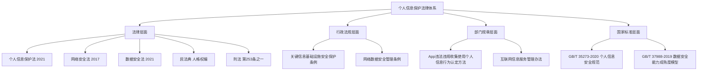
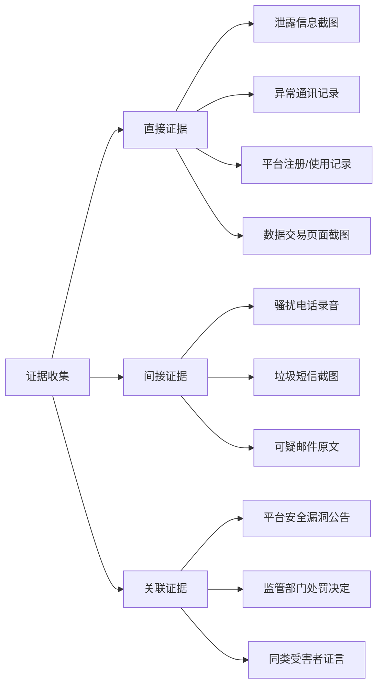
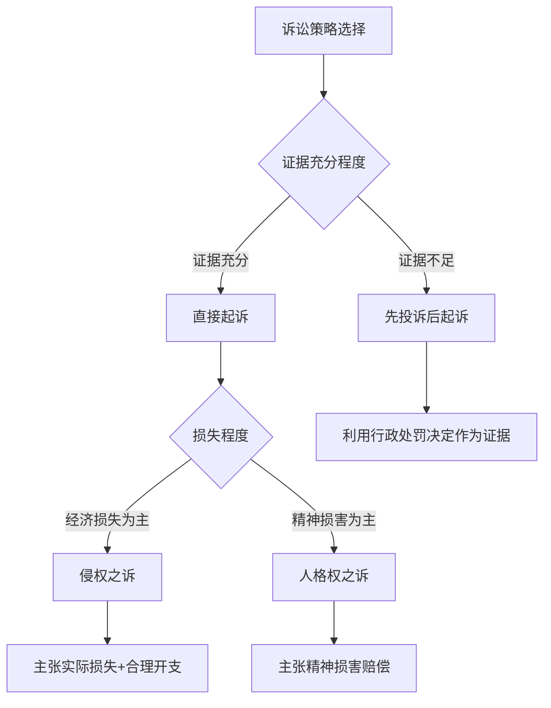
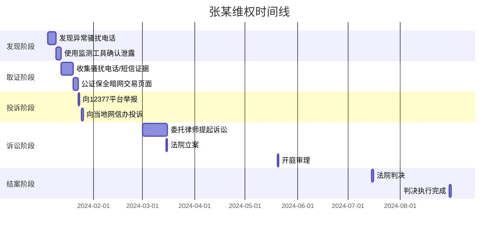
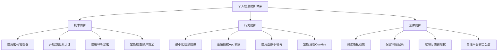
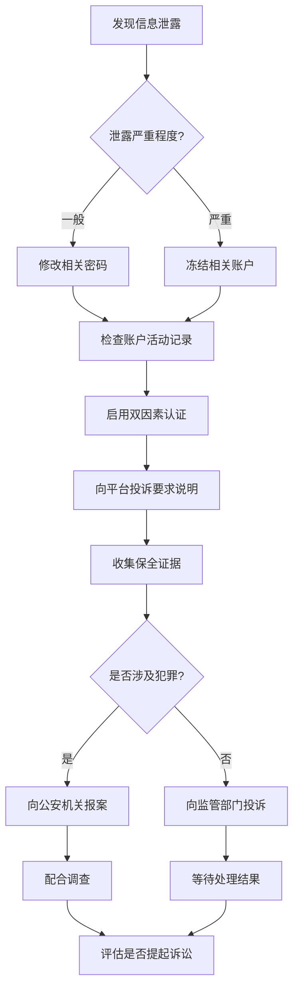

## 案例十：个人信息泄露维权实战

### 一、案例背景

2024年初，北京市朝阳区居民张某（化名）发现自己频繁接到各类推销电话和短信，内容涉及教育培训、房产中介、贷款理财等多个领域。更严重的是，张某发现自己的姓名、手机号、身份证号甚至家庭住址等信息被明码标价在某暗网论坛出售。经调查，张某的信息泄露源头为某在线教育平台的数据泄露事件。

**受害者基本情况：**

| 信息维度 | 具体内容 |
|---------|---------|
| 受害者 | 张某，32岁，互联网从业者 |
| 泄露信息类型 | 姓名、手机号、身份证号、家庭住址、消费记录 |
| 泄露规模 | 约50万用户数据被泄露 |
| 发现时间 | 2024年1月 |
| 维权周期 | 约8个月 |
| 最终结果 | 获赔精神损害赔偿金5000元 + 平台整改 |

### 二、法律框架：个人信息保护的制度基础

#### 2.1 核心法律法规体系

中国已建立较为完善的个人信息保护法律体系，主要包括：



**《个人信息保护法》核心条款：**

| 条款 | 内容要点 | 实际意义 |
|------|---------|---------|
| 第13条 | 处理个人信息的合法性基础 | 明确了"知情-同意"原则 |
| 第14条 | 同意应当是自愿、明确的 | 禁止捆绑授权、默认勾选 |
| 第44条 | 个人对其信息享有知情权、决定权 | 赋予个人主动控制权 |
| 第45条 | 个人有权查阅、复制其个人信息 | 赋予数据可携带权 |
| 第47条 | 个人有权请求删除个人信息 | 赋予"被遗忘权" |
| 第50条 | 个人有权请求更正、补充 | 确保信息准确性 |
| 第69条 | 处理者不能证明无过错的承担侵权责任 | 举证责任倒置 |
| 第70条 | 公益诉讼制度 | 降低个人维权成本 |

#### 2.2 个人信息的法律定义

根据《个人信息保护法》第4条，个人信息是指以电子或者其他方式记录的与已识别或者可识别的自然人有关的各种信息，不包括匿名化处理后的信息。

**个人信息分类体系：**

| 类别 | 具体信息 | 敏感程度 | 泄露风险 |
|------|---------|---------|---------|
| 基本信息 | 姓名、性别、出生日期 | 低 | 身份冒用 |
| 联系信息 | 手机号、邮箱、地址 | 中 | 骚扰、诈骗 |
| 身份信息 | 身份证号、护照号 | 高 | 身份盗用、贷款 |
| 生物识别 | 指纹、人脸、虹膜 | 极高 | 不可更改，终身风险 |
| 财产信息 | 银行卡号、征信报告 | 极高 | 经济损失 |
| 行踪轨迹 | GPS、出行记录 | 高 | 人身安全威胁 |
| 交易记录 | 消费、转账记录 | 中 | 精准诈骗 |
| 健康信息 | 就医记录、体检报告 | 高 | 歧视、隐私侵害 |

### 三、维权全流程详解

#### 3.1 第一阶段：发现与取证（第1-2周）

**发现泄露的常见途径：**

1. **异常通讯**：突然收到大量推销电话、短信、邮件
2. **账户异常**：发现未知设备登录、异常操作记录
3. **暗网监测**：通过Have I Been Pwned等工具检测邮箱/手机号是否泄露
4. **新闻报道**：媒体曝光平台数据泄露事件
5. **监管部门通报**：网信办、公安机关发布的安全事件通报

**关键证据清单：**



**取证操作规范：**

```bash
# 1. 网页证据保全 - 使用浏览器开发者工具
# 打开F12 -> Network -> 保存完整请求/响应

# 2. 屏幕录制取证
# 使用OBS等工具录制完整操作过程

# 3. 证据文件命名规范
# 格式: 日期_证据类型_平台_序号
# 示例: 20240115_截图_XX平台_001.png

# 4. 证据完整性校验
# 计算文件MD5/SHA256哈希值
sha256sum evidence_001.png
# 输出: a1b2c3d4...  evidence_001.png

# 5. 证据时间戳
# 使用可信时间戳服务（如联合信任）
# 网址: https://www.tsa.cn/
```

**公证保全要点：**

- 选择有电子证据保全资质的公证处
- 公证费用通常在500-2000元
- 公证过程需全程在公证员监督下操作
- 公证后获得的公证书具有强证明力

#### 3.2 第二阶段：投诉举报（第2-4周）

**投诉渠道优先级排序：**

| 优先级 | 渠道 | 适用场景 | 响应时间 | 有效性 |
|--------|------|---------|---------|--------|
| 1 | 12321网络不良信息举报 | 骚扰电话/短信 | 3-7天 | 高 |
| 2 | 12377互联网违法和不良信息举报 | 平台违规收集 | 7-15天 | 高 |
| 3 | 12315消费者投诉 | 消费者权益侵害 | 7-15天 | 中 |
| 4 | 当地网信办 | 大规模数据泄露 | 15-30天 | 高 |
| 5 | 当地公安机关网安部门 | 涉嫌犯罪 | 视案件而定 | 极高 |
| 6 | App所属行业监管部门 | 行业特定问题 | 15-30天 | 中 |

**投诉信模板（12377平台）：**

```text
标题：关于XX平台违规收集使用个人信息的举报

举报人信息：
- 姓名：张XX
- 身份证号：110XXXXXXXXXXXXXXX
- 联系电话：138XXXXXXXX
- 通讯地址：北京市朝阳区XX路XX号

被举报对象：
- 名称：XX科技有限公司
- 平台：XX App（版本号：X.X.X）
- 注册地址：XX市XX区XX路XX号

举报事实：
本人于2023年X月X日注册使用XX平台，在使用过程中发现该平台存在
以下违规行为：

1. 违反"最小必要"原则，强制收集与服务无关的个人信息
   （具体表现：要求授权通讯录、位置等非必要权限）

2. 未明确告知信息处理目的、方式和范围
   （具体表现：隐私政策模糊不清，未列明第三方共享名单）

3. 2024年X月，本人发现个人信息被泄露，频繁收到骚扰电话
   （附：骚扰电话截图、通话记录）

举报请求：
1. 依法查处被举报对象的违法行为
2. 要求被举报对象删除本人个人信息
3. 要求被举报对象赔偿本人因此遭受的损失

附件：
1. 身份证明文件
2. 平台注册/使用记录
3. 信息泄露相关证据
4. 骚扰电话/短信记录
```

**行政投诉的法律效力：**

根据《个人信息保护法》第65条，个人发现个人信息处理者违反法律、行政法规或者违反约定处理其个人信息的，有权请求个人信息处理者予以说明，并有权请求个人信息处理者予以更正、删除。

监管部门可以采取以下措施：
- 责令改正
- 给予警告
- 没收违法所得
- 对违法处理个人信息的应用程序，责令暂停或者终止提供服务
- 处100万元以下罚款
- 情节严重的，处5000万元以下或者上一年度营业额5%以下罚款

#### 3.3 第三阶段：民事诉讼（第2-6个月）

**诉讼策略选择：**



**管辖法院确定：**

根据《民事诉讼法》及司法解释，个人信息侵权案件的管辖：

- **被告住所地**：平台公司注册地或主要经营地
- **侵权行为地**：包括侵权行为实施地和侵权结果发生地
- **信息网络侵权**：被侵权人住所地法院也有管辖权

**诉讼请求设计：**

```text
诉讼请求：
1. 判令被告立即停止侵害原告个人信息权益的行为；
2. 判令被告删除其持有的原告全部个人信息；
3. 判令被告在国家级媒体及被告平台首页公开赔礼道歉，
   持续时间不少于30日；
4. 判令被告赔偿原告经济损失人民币XX元；
5. 判令被告赔偿原告精神损害抚慰金人民币XX元；
6. 判令被告赔偿原告为维权支出的合理费用人民币XX元
   （包括律师费、公证费、差旅费等）；
7. 本案诉讼费用由被告承担。
```

**举证责任分配：**

| 举证事项 | 举证方 | 证明标准 | 证据类型 |
|---------|--------|---------|---------|
| 信息处理行为存在 | 原告 | 高度盖然性 | 平台截图、注册记录 |
| 信息泄露事实 | 原告 | 高度盖然性 | 异常通讯记录、暗网截图 |
| 处理者有过错 | 被告（倒置） | 证明无过错 | 安全措施记录、合规审计 |
| 损害结果 | 原告 | 高度盖然性 | 经济损失凭证、精神损害证明 |
| 因果关系 | 法院综合认定 | 高度盖然性 | 全案证据综合判断 |

#### 3.4 第四阶段：执行与后续（第6-8个月）

**判决执行要点：**

1. **经济赔偿执行**：如被告不主动履行，申请法院强制执行
2. **道歉执行**：监督被告在指定媒体/平台发布道歉声明
3. **信息删除执行**：要求被告出具信息删除确认函，并保留追诉权
4. **整改监督**：关注监管部门对平台的后续监管措施

### 四、张某案例的详细复盘

#### 4.1 事件经过时间线



#### 4.2 关键转折点分析

**转折点一：平台拒绝承认泄露**

平台最初辩称"无法确认泄露来源"，并以"用户可能在其他平台泄露"为由推卸责任。

**应对策略：**
- 张某提供了多个受害者的联名证言（共127人）
- 引用了监管部门此前对该平台的安全检查报告
- 申请法院调取平台的安全日志记录

**转折点二：举证责任倒置的运用**

根据《个人信息保护法》第69条，张某主张平台过错后，举证责任转移至平台。平台无法证明其已采取充分的安全保护措施：

- 平台未提供安全审计报告
- 平台的安全防护措施不符合《网络安全法》要求
- 平台未及时向监管部门报告泄露事件（违反第57条）

**转折点三：公益诉讼的补充**

在张某个人诉讼期间，省检察院还对该平台提起了个人信息保护公益诉讼，进一步确认了平台的违法事实，为张某的案件提供了有力支持。

#### 4.3 判决核心内容

法院最终判决：

1. **停止侵害**：平台立即停止违规收集、使用个人信息的行为
2. **删除信息**：平台删除其持有的张某全部个人信息
3. **赔礼道歉**：在平台首页发布道歉声明，持续30天
4. **经济赔偿**：
   - 精神损害抚慰金：5000元
   - 公证费：800元
   - 律师费：8000元（部分支持）
   - 其他合理支出：1200元
5. **平台整改**：监管部门对平台处以200万元罚款

### 五、维权成本与收益分析

#### 5.1 维权成本明细

| 成本项目 | 金额（元） | 说明 |
|---------|-----------|------|
| 律师费 | 10000-30000 | 视案件复杂程度 |
| 公证费 | 500-2000 | 电子证据保全 |
| 诉讼费 | 100-500 | 财产案件按标的额计算 |
| 鉴定费 | 2000-5000 | 如需技术鉴定 |
| 差旅费 | 视情况 | 异地诉讼可能较高 |
| 时间成本 | 无法量化 | 约6-8个月 |
| 精力成本 | 无法量化 | 心理压力、生活干扰 |

#### 5.2 维权收益评估

| 收益类型 | 具体内容 | 评估 |
|---------|---------|------|
| 经济赔偿 | 精神损害赔偿+实际损失 | 通常5000-50000元 |
| 维权费用 | 律师费、公证费等由败诉方承担 | 可部分追回 |
| 信息删除 | 平台删除个人信息 | 降低后续风险 |
| 道歉声明 | 公开赔礼道歉 | 精神慰藉 |
| 社会效益 | 推动平台整改、保护其他用户 | 间接收益 |
| 经验积累 | 提升法律意识和维权能力 | 长期价值 |

#### 5.3 替代性纠纷解决机制

| 方式 | 优点 | 缺点 | 适用场景 |
|------|------|------|---------|
| 协商和解 | 成本低、效率高 | 可能被迫妥协 | 损失较小、平台态度积极 |
| 人民调解 | 免费、专业 | 无强制执行力 | 双方愿意调解 |
| 行政调解 | 有监管背书 | 周期较长 | 监管部门已介入 |
| 仲裁 | 一裁终局、保密性强 | 费用较高 | 合同中有仲裁条款 |
| 诉讼 | 强制执行力、权威性高 | 成本高、周期长 | 其他方式无效 |

### 六、常见误区与避坑指南

#### 6.1 认知误区

**误区一："个人信息泄露很常见，维权没用"**

事实：个人信息保护法建立了完整的救济体系。2023年全国法院受理个人信息保护案件同比增长45%，胜诉率超过60%。监管部门对平台的处罚力度也在不断加大。

**误区二："只有造成经济损失才能索赔"**

事实：根据《民法典》第1183条，侵害自然人人身权益造成严重精神损害的，被侵权人有权请求精神损害赔偿。个人信息泄露造成的焦虑、恐惧、生活安宁被破坏等，都可以主张精神损害赔偿。

**误区三："平台有免责条款，告不赢"**

事实：平台的格式条款中免除自身责任、加重用户负担的条款，根据《民法典》第497条，该条款无效。平台不能通过一纸协议免除其法定的个人信息保护义务。

**误区四："维权成本太高，得不偿失"**

事实：
- 行政投诉渠道是免费的
- 公益诉讼由检察机关提起，个人无需承担费用
- 胜诉后合理维权费用可由败诉方承担
- 部分地区对个人信息保护案件提供法律援助

#### 6.2 操作误区

**误区一：发现泄露后立即删除所有账户**

正确做法：先保全证据，再考虑删除账户。删除账户可能导致证据灭失，影响后续维权。

**误区二：在网上公开曝光平台泄露**

正确做法：通过合法渠道举报，避免因"网络曝光"引发名誉权纠纷。网上发布的内容如果措辞不当，可能构成对平台的名誉侵权。

**误区三：接受平台的"封口费"私下和解**

正确做法：谨慎评估和解方案。如果和解金额明显偏低，或要求放弃追诉权，建议咨询律师后再做决定。同时注意，和解不影响向监管部门举报。

**误区四：只关注经济赔偿，忽略其他权利**

正确做法：综合行使知情权（要求平台说明泄露情况）、删除权（要求删除个人信息）、更正权（要求更正不准确信息）等多项权利。

### 七、个人信息泄露的预防策略

#### 7.1 个人层面的防护措施



**实用工具推荐：**

| 工具类型 | 推荐工具 | 用途 |
|---------|---------|------|
| 密码管理器 | 1Password、Bitwarden | 生成和管理强密码 |
| 泄露监测 | Have I Been Pwned | 监测邮箱/手机号是否泄露 |
| 虚拟手机号 | 阿里小号、和多号 | 注册非重要平台 |
| 邮箱别名 | SimpleLogin、AnonAddy | 隔离不同平台的邮箱 |
| 浏览器插件 | Privacy Badger | 阻止跟踪器 |
| VPN服务 | 自建或可信商业VPN | 加密网络流量 |

#### 7.2 企业层面的合规要求

对于运营平台的企业，必须做到：

1. **数据分类分级**：建立个人信息分类分级保护制度
2. **最小必要原则**：只收集实现服务目的所需的最少信息
3. **安全技术措施**：加密存储、访问控制、安全审计
4. **泄露应急预案**：建立数据泄露事件应急响应机制
5. **定期安全评估**：每年至少进行一次个人信息保护合规审计
6. **第三方管理**：对数据处理合作方进行安全评估和监督

#### 7.3 泄露后的应急响应

发现个人信息泄露后的标准响应流程：



### 八、行业深度分析：个人信息泄露的现状与趋势

#### 8.1 泄露事件统计

根据公开数据和监管通报，2023年中国个人信息泄露事件呈现以下特点：

| 维度 | 数据 | 趋势 |
|------|------|------|
| 年度事件数量 | 超过500起重大事件 | 同比增长30% |
| 受影响用户规模 | 累计超过10亿人次 | 持续上升 |
| 主要泄露渠道 | App、网站、内部人员 | App占比最高 |
| 高发行业 | 电商、金融、教育、医疗 | 教育行业增速最快 |
| 平均处罚金额 | 50-500万元 | 显著提高 |

#### 8.2 技术发展对维权的影响

**区块链存证**：部分法院已认可区块链存证的法律效力，降低了电子证据保全成本。

**AI辅助取证**：AI技术可以帮助快速识别和分类泄露信息，提高取证效率。

**自动化投诉工具**：部分平台提供一键投诉功能，简化了维权流程。

**数据泄露监测服务**：专业的数据泄露监测服务可以帮助个人及时发现信息泄露。

#### 8.3 国际比较与借鉴

| 国家/地区 | 核心法规 | 最高罚款 | 维权特点 |
|----------|---------|---------|---------|
| 欧盟 | GDPR | 全球营业额4% | 集体诉讼发达、罚款力度大 |
| 美国 | CCPA/CPRA | 7500美元/次 | 集体诉讼活跃、赔偿金额高 |
| 中国 | 个人信息保护法 | 全球营业额5% | 行政监管为主、公益诉讼发展 |
| 日本 | APPI | 1亿日元 | 行政指导为主、企业自律 |

### 九、进阶话题：个人信息保护的前沿问题

#### 9.1 人工智能时代的新挑战

**大模型训练数据中的个人信息**：大语言模型的训练数据可能包含大量个人信息，如何保障数据主体权利成为新的法律问题。《生成式人工智能服务管理暂行办法》要求使用合法来源的数据进行训练。

**深度伪造与人脸信息**：AI换脸、语音合成等技术对生物识别信息的保护提出了更高要求。《民法典》第1019条明确禁止利用信息技术手段伪造等方式侵害他人的肖像权。

#### 9.2 跨境数据流动

个人信息出境需要满足以下条件之一：
- 通过国家网信部门组织的安全评估
- 经专业机构进行个人信息保护认证
- 按照国家网信部门制定的标准合同与境外接收方订立合同

#### 9.3 个人信息保护合规审计

2025年5月1日起施行的《个人信息保护合规审计管理办法》要求：
- 处理超过1000万人个人信息的，应当每年至少开展一次合规审计
- 处理100万人以上个人信息的，应当每两年至少开展一次合规审计
- 合规审计可以自行开展，也可以委托专业机构开展

### 十、实用工具与资源汇总

#### 10.1 投诉举报渠道

| 渠道 | 网址/方式 | 适用场景 |
|------|----------|---------|
| 12321举报中心 | www.12321.cn | 骚扰电话/短信/邮件 |
| 12377举报中心 | www.12377.cn | 互联网违法信息 |
| 12315消费者投诉 | www.12315.cn | 消费权益侵害 |
| 公安部网络违法犯罪举报 | www.cyberpolice.cn | 涉嫌犯罪 |
| 各地网信办 | 各省市网信办官网 | 大规模数据泄露 |
| 工信部申诉 | yhssglxt.miit.gov.cn | 电信服务质量 |

#### 10.2 法律援助资源

- **12348法律服务热线**：免费法律咨询
- **中国法律服务网**：www.12348.gov.cn 在线法律咨询
- **地方法律援助中心**：为经济困难的当事人提供免费法律服务
- **高校法律诊所**：部分高校法学院提供免费法律服务

#### 10.3 推荐阅读

- 《个人信息保护法理解与适用》（程啸著）
- 《数据合规：入门、实战与进阶》（刘耀华著）
- 最高人民法院《关于审理使用人脸识别技术处理个人信息相关民事案件适用法律若干问题的规定》
- 国家标准GB/T 35273-2020《信息安全技术 个人信息安全规范》

### 十一、总结与行动清单

#### 11.1 核心要点回顾

1. **法律武器充分**：中国已建立以《个人信息保护法》为核心的完善法律体系
2. **维权渠道多元**：行政投诉、民事诉讼、公益诉讼等多条路径可选
3. **举证责任倒置**：平台需证明自身无过错，降低了个人维权难度
4. **预防优于救济**：建立个人信息防护体系，从源头降低泄露风险
5. **成本收益合理**：行政投诉免费，诉讼费用可控，精神损害赔偿可期

#### 11.2 发现泄露后的行动清单

- [ ] 立即修改涉及账户的密码，启用双因素认证
- [ ] 截屏、录屏保全泄露证据，计算文件哈希值
- [ ] 联系平台客服要求说明泄露情况和处理方案
- [ ] 使用公证或可信时间戳对关键证据进行保全
- [ ] 向12377或12321平台提交投诉举报
- [ ] 如涉及犯罪，向当地公安机关网安部门报案
- [ ] 咨询专业律师评估是否提起民事诉讼
- [ ] 定期监测个人信息是否继续被滥用
- [ ] 关注监管部门对该平台的后续处理结果

---

> **编辑提示**：本案例基于真实事件改编，细节已做脱敏处理。个人信息保护是一个快速发展的法律领域，建议读者在实际维权时咨询专业律师，并关注最新的法律法规和司法解释。
