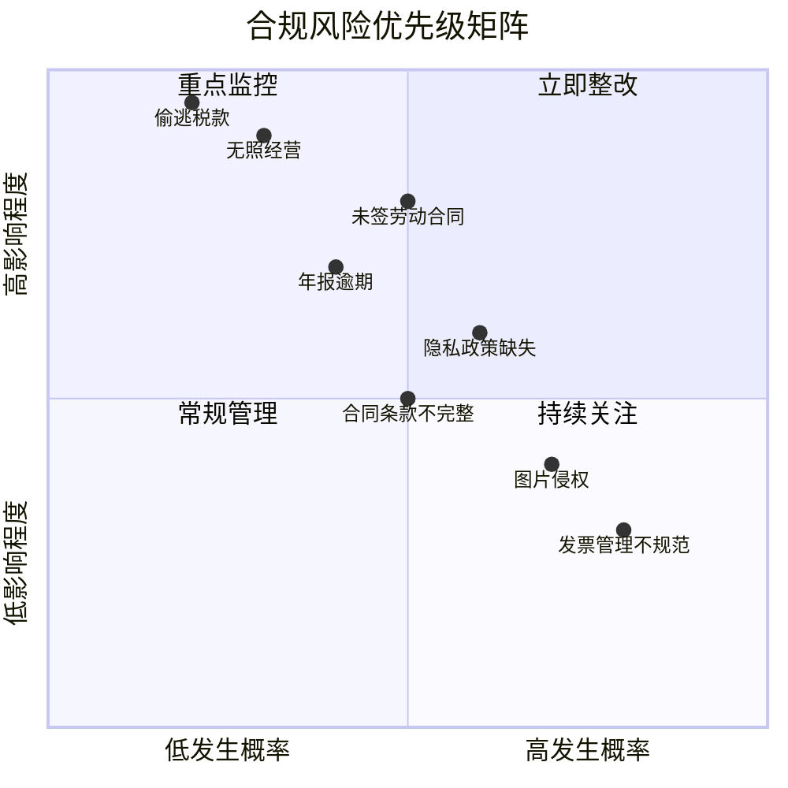

## 法律合规检查清单

法律合规不是一次性任务，而是贯穿创业和副业全生命周期的持续过程。本清单将前文所有法律知识点转化为可执行的自查项目，覆盖从创业筹备到成熟运营的每个阶段。按照清单逐项检查，可以系统性地识别和消除法律风险。

### 清单使用说明

本清单采用"红黄绿"三色评级体系：

| 状态 | 含义 | 行动要求 |
|------|------|----------|
| ✅ 已完成 | 该项已合规 | 定期复查即可 |
| ⚠️ 部分完成 | 存在风险隐患 | 30天内必须整改 |
| ❌ 未开始 | 严重合规缺失 | 立即暂停相关业务，优先整改 |

检查频率建议：
- **创业筹备期**：启动前完成全部检查项
- **运营初期（0-6个月）**：每月全面检查一次
- **稳定运营期（6个月以上）**：每季度全面检查一次
- **重大变更时**：业务调整、规模扩大、法规更新时立即检查

---

### 第一部分：主体资质合规检查

#### 1.1 经营主体注册

| 检查项 | 合规标准 | 常见问题 | 整改措施 |
|--------|----------|----------|----------|
| 是否办理营业执照 | 任何持续性经营活动都需持照经营 | 以"个人兼职"为由不办照 | 按经营规模选择个体工商户或公司注册 |
| 经营范围是否匹配 | 实际经营内容在营业执照范围内 | 超范围经营 | 变更经营范围，增加相关条目 |
| 注册地址是否真实 | 注册地址与实际经营地一致或使用合规挂靠地址 | 使用虚假地址注册 | 变更为真实地址或合规的集群注册地址 |
| 年报是否按时提交 | 每年6月30日前完成企业年报 | 忘记年报被列入异常名录 | 补报年报，申请移出异常名录 |
| 许可证是否齐全 | 特定行业需额外许可（如食品经营许可、ICP备案等） | 未意识到需要额外许可 | 对照《市场准入负面清单》逐项检查 |

#### 1.2 行业特殊资质

不同行业有特定的准入要求，以下是常见副业领域的资质检查：

**电商类副业：**
- [ ] 已办理市场主体登记（个人销售自产农副产品等豁免情形除外）
- [ ] 已在平台公示营业执照信息
- [ ] 食品类已取得食品经营许可证或食品生产许可证
- [ ] 化妆品类已取得化妆品生产许可证（自产）或已完成备案（销售）
- [ ] 保健食品已取得"蓝帽子"标识

**内容创作类副业：**
- [ ] 网络文化经营许可证（从事网络表演、网络动漫等）
- [ ] 信息网络传播视听节目许可证（从事视频内容制作传播）
- [ ] 出版物经营许可证（销售图书、音像制品）
- [ ] 广告发布登记（发布广告内容）

**技术服务类副业：**
- [ ] ICP备案（网站/小程序上线前必须完成）
- [ ] 增值电信业务经营许可证（ICP许可证，涉及经营性互联网信息服务）
- [ ] 网络安全等级保护备案（处理大量用户数据的系统）
- [ ] 软件著作权登记（自研软件产品）

**金融服务类副业：**
- [ ] 相关金融牌照（基金销售、保险经纪等必须持牌经营）
- [ ] 反洗钱义务履行（客户身份识别、可疑交易报告）

---

### 第二部分：税务合规检查

#### 2.1 税务登记与申报

| 检查项 | 合规标准 | 检查方法 | 风险等级 |
|--------|----------|----------|----------|
| 税务登记 | 取得营业执照后30日内完成税务登记 | 登录电子税务局查看登记状态 | 高 |
| 税种核定 | 已核定应纳税种（增值税、个人所得税/企业所得税等） | 查看税种认定信息 | 高 |
| 申报期限 | 按期完成纳税申报（即使零收入也要零申报） | 查看申报记录，确认无逾期 | 高 |
| 发票管理 | 按规定领用、开具、保管发票 | 检查发票使用记录 | 中 |
| 银行账户备案 | 已向税务机关报告全部银行账号 | 核对已备案账户与实际使用账户 | 中 |

#### 2.2 收入合规检查

```text
收入合规自查流程：

1. 梳理所有收入来源
   ├── 平台结算收入（电商、内容平台、接单平台）
   ├── 私域客户直接转账
   ├── 线下现金收入
   ├── 投资收益（股息、利息、转让所得）
   └── 其他偶然所得

2. 核对收入申报情况
   ├── 平台代扣代缴的税款是否准确
   ├── 自行申报的收入是否完整
   ├── 是否存在隐瞒收入的情况
   └── 收入确认时点是否正确

3. 检查成本费用扣除
   ├── 成本凭证是否齐全（发票、合同、付款记录）
   ├── 费用是否与经营相关
   ├── 是否存在虚列成本的情况
   └── 固定资产折旧是否按规定计提
```

#### 2.3 个税专项检查（自由职业者/副业者）

| 收入类型 | 适用税目 | 税率 | 预扣预缴 | 年度汇算 |
|----------|----------|------|----------|----------|
| 劳务报酬 | 综合所得 | 3%-45% | 20%-40%预扣 | 并入综合所得汇算 |
| 稿酬所得 | 综合所得 | 3%-45% | 20%预扣（减征30%） | 并入综合所得汇算 |
| 经营所得 | 经营所得 | 5%-35% | 按月/季预缴 | 年度汇算 |
| 特许权使用费 | 综合所得 | 3%-45% | 20%预扣 | 并入综合所得汇算 |

**关键提醒：** 年度汇算清缴是法定义务，每年3月1日至6月30日必须完成。即使平台已代扣代缴，仍可能需要补税或申请退税。

---

### 第三部分：合同合规检查

#### 3.1 合同签订前检查

- [ ] **主体资格核实**：确认合同对方具有签约资格（营业执照、授权委托书）
- [ ] **信用状况调查**：通过企查查/天眼查查询对方经营状态、诉讼记录、失信信息
- [ ] **条款完整性审查**：合同必备条款是否齐全（标的、数量、质量、价款、履行期限、违约责任）
- [ ] **知识产权归属**：明确约定工作成果的知识产权归属
- [ ] **保密条款**：涉及商业秘密的合同是否包含保密义务条款
- [ ] **争议解决条款**：约定明确的管辖法院或仲裁机构

#### 3.2 合同履行中检查

- [ ] **交付记录保留**：每次交付都有书面确认（签收单、验收报告、平台确认记录）
- [ ] **变更书面化**：任何合同变更都以书面形式确认（邮件、补充协议）
- [ ] **付款凭证保存**：所有付款保留转账记录，现金支付要求出具收据
- [ ] **沟通记录存档**：重要沟通通过书面渠道（邮件、平台消息）进行，定期备份
- [ ] **违约证据固定**：发现对方违约时及时保全证据（公证、截图、录音）

#### 3.3 合同模板库建设

建议针对常见业务场景准备标准化合同模板：

| 业务场景 | 合同类型 | 核心条款 | 参考来源 |
|----------|----------|----------|----------|
| 接单开发 | 技术服务合同 | 需求范围、验收标准、源码归属、维护期 | 《技术合同司法解释》 |
| 内容创作 | 委托创作合同 | 创作要求、交付标准、著作权归属、署名权 | 《著作权法》第十九条 |
| 商品销售 | 买卖合同 | 商品描述、质量标准、退换货条件、质保期 | 《民法典》合同编 |
| 居间介绍 | 居间合同 | 居间事项、报酬计算、如实报告义务 | 《民法典》第九百六十一条 |
| 合伙经营 | 合伙协议 | 出资比例、利润分配、决策机制、退出机制 | 《合伙企业法》 |

---

### 第四部分：知识产权合规检查

#### 4.1 自有知识产权保护

| 检查项 | 检查内容 | 保护措施 | 成本参考 |
|--------|----------|----------|----------|
| 商标 | 品牌名称、Logo是否已注册商标 | 申请商标注册（文字+图形分开申请） | 官费270元/类，代理费500-1500元 |
| 著作权 | 软件、文章、设计作品是否已登记 | 中国版权保护中心登记 | 官费免费（网上登记） |
| 专利 | 技术方案、产品设计是否申请专利 | 根据类型申请发明/实用新型/外观设计 | 发明官费3450元起，实用新型500元起 |
| 域名 | 品牌相关域名是否已注册 | 注册.com/.cn/.com.cn等主要域名 | 50-100元/年 |
| 商业秘密 | 核心技术/客户信息是否采取保密措施 | 签订保密协议、信息分级管理 | 主要是管理成本 |

#### 4.2 避免侵权他人知识产权

- [ ] **商标使用检查**：产品名称、店铺名称、宣传材料中不使用他人注册商标
- [ ] **图片版权检查**：使用的图片有合法来源（自拍、购买授权、CC0素材）
- [ ] **字体版权检查**：商用字体已购买授权（方正、汉仪等需付费），或使用免费商用字体（思源、阿里巴巴普惠体）
- [ ] **软件正版化**：开发和办公使用正版软件或开源替代方案
- [ ] **内容原创性**：文章、视频等内容为原创或已获授权，引用部分标明出处
- [ ] **专利侵权排查**：产品设计、技术方案是否落入他人专利保护范围

#### 4.3 电商平台知识产权合规

在电商平台经营时，需特别注意以下知识产权规则：

```text
电商平台知识产权风险排查：

1. 商品标题
   ├── 是否包含他人品牌名称（如"XX同款"可能构成侵权）
   ├── 是否使用通用描述词而非商标
   └── 是否存在虚假宣传用语

2. 商品图片
   ├── 是否使用官方图片（需获得授权）
   ├── 是否盗用他人实拍图
   └── 图片中的品牌元素是否已处理

3. 商品描述
   ├── 是否未经授权使用他人专利号
   ├── 是否虚假标注"专利产品"
   └── 是否侵犯他人著作权（抄袭文案）

4. 店铺装修
   ├── 店铺名称是否侵犯他人商标
   ├── 店铺Logo是否原创
   └── 装修素材是否有合法来源
```

---

### 第五部分：数据与隐私合规检查

#### 5.1 个人信息处理合规

根据《个人信息保护法》，处理个人信息需遵循"合法、正当、必要、诚信"原则：

| 检查项 | 合规要求 | 实操要点 |
|--------|----------|----------|
| 告知同意 | 收集个人信息前需告知目的、方式、范围并取得同意 | 隐私政策/告知书需清晰、完整、易懂 |
| 最小必要 | 只收集实现目的所必需的个人信息 | 不强制要求用户提供与服务无关的信息 |
| 目的限制 | 不得超出收集时的目的使用个人信息 | 二次使用需重新取得同意 |
| 存储期限 | 个人信息保存期限为实现目的所必需的最短时间 | 定期清理过期数据 |
| 安全保障 | 采取必要措施防止个人信息泄露、篡改、丢失 | 加密存储、访问控制、安全审计 |
| 主体权利 | 保障用户的知情权、决定权、查阅权、更正权、删除权 | 提供便捷的权利行使渠道 |

#### 5.2 数据安全检查清单

- [ ] **数据分类分级**：已对数据进行分类分级管理（一般数据、重要数据、核心数据）
- [ ] **访问权限控制**：实施最小权限原则，定期审查权限分配
- [ ] **数据加密**：敏感数据存储和传输均采用加密措施
- [ ] **备份恢复**：重要数据定期备份，并测试恢复流程
- [ ] **安全事件响应**：已制定数据安全事件应急预案，明确报告流程
- [ ] **第三方数据共享**：与第三方共享数据时已签订数据处理协议
- [ ] **跨境数据传输**：涉及跨境传输时已完成安全评估或签订标准合同

#### 5.3 网站/App合规要求

如果运营网站或App，还需检查以下项目：

| 合规要求 | 具体内容 | 法律依据 |
|----------|----------|----------|
| 隐私政策 | 在显著位置公示隐私政策，说明数据处理规则 | 《个人信息保护法》第十七条 |
| Cookie告知 | 首次访问时告知Cookie使用情况并取得同意 | 《个人信息保护法》第十三条 |
| 一键注销 | 提供便捷的账号注销功能 | 《个人信息保护法》第四十七条 |
| 未成年人保护 | 识别未成年人用户并取得监护人同意 | 《未成年人保护法》第七十四条 |
| 算法透明 | 向用户说明推荐算法的基本原理 | 《互联网信息服务算法推荐管理规定》 |

---

### 第六部分：劳动用工合规检查

#### 6.1 雇佣关系合规

如果副业发展到需要雇佣人员，以下检查项至关重要：

| 检查项 | 合规要求 | 违规后果 |
|--------|----------|----------|
| 劳动合同 | 用工之日起一个月内签订书面劳动合同 | 支付双倍工资 |
| 社会保险 | 为员工缴纳五险一金 | 补缴+滞纳金+罚款 |
| 工资支付 | 按月足额支付，不低于当地最低工资标准 | 补发+赔偿金 |
| 工作时间 | 标准工时制不超40小时/周，加班需支付加班费 | 补发加班费+罚款 |
| 休息休假 | 保障法定节假日、年休假、病假等权利 | 补发工资+赔偿 |
| 劳动保护 | 提供安全的工作环境和必要的劳动保护 | 行政处罚+民事赔偿 |

#### 6.2 灵活用工合规

副业中常见的灵活用工形式及合规要点：

**兼职人员：**
- 明确是劳动关系还是劳务关系（影响社保义务和税务处理）
- 劳动关系需签劳动合同、缴纳社保
- 劳务关系签劳务协议，按劳务报酬代扣个税

**实习生：**
- 签订实习协议，明确实习期间的权利义务
- 购买实习生意外伤害保险
- 实习报酬按"工资薪金"预扣预缴个税

**外包/众包：**
- 与外包公司签订服务合同，不直接管理外包人员
- 避免"假外包真派遣"的法律风险
- 明确工作成果的验收标准和知识产权归属

---

### 第七部分：广告与营销合规检查

#### 7.1 广告法合规

| 检查项 | 违规行为 | 法律后果 | 合规建议 |
|--------|----------|----------|----------|
| 绝对化用语 | 使用"最好""第一""国家级"等绝对化用语 | 罚款20-100万元 | 使用"优质""领先"等相对表述 |
| 虚假宣传 | 商品性能、功能、产地等信息与实际不符 | 罚款+吊销营业执照 | 所有宣传内容有据可查 |
| 代言规范 | 使用未经授权的推荐或证明 | 罚款+连带责任 | 获取书面授权或不使用推荐 |
| 医疗/药品广告 | 未经审查发布医疗、药品、医疗器械广告 | 罚款+吊销许可 | 提交审查，取得批准文号 |
| 保健食品广告 | 声称具有疾病预防、治疗功能 | 罚款+吊销许可 | 标注"本品不能代替药物" |
| 烟草广告 | 发布烟草广告 | 罚款 | 禁止任何形式的烟草广告 |

#### 7.2 电商营销合规

- [ ] **价格标示**：标价真实准确，不存在虚构原价、虚假优惠折价
- [ ] **促销规则**：促销活动规则清晰明确，不存在歧义
- [ ] **好评返现**：不得以返现、红包等方式诱导用户好评（违反《反不正当竞争法》）
- [ ] **刷单炒信**：不得虚构交易量和评价（严重的构成刑事犯罪）
- [ ] **直播带货**：直播间不使用绝对化用语，主播需了解商品真实信息
- [ ] **社交电商**：分销层级不超过三级，避免构成传销

#### 7.3 内容营销合规

```text
内容发布前合规审查流程：

1. 事实核查
   ├── 数据是否有可靠来源？
   ├── 案例是否真实可查证？
   └── 引用是否标注出处？

2. 法律风险审查
   ├── 是否涉及他人名誉权？
   ├── 是否侵犯他人隐私？
   ├── 是否构成不正当竞争？
   └── 是否涉及敏感话题？

3. 平台规则检查
   ├── 是否符合平台社区规范？
   ├── 是否触发平台审核机制？
   └── 是否含有平台禁止的内容？

4. 版权合规检查
   ├── 文字内容是否原创？
   ├── 图片/视频素材是否有授权？
   ├── 背景音乐是否有版权？
   └── 引用内容是否符合合理使用？
```

---

### 第八部分：电子商务专项合规检查

#### 8.1 平台经营者义务

| 义务类型 | 具体要求 | 法律依据 |
|----------|----------|----------|
| 主体审查 | 对入驻商家进行实名登记和资质审查 | 《电子商务法》第二十七条 |
| 信息公示 | 在首页显著位置公示营业执照等信息 | 《电子商务法》第十五条 |
| 交易记录保存 | 保存商品和服务信息、交易信息不少于三年 | 《电子商务法》第三十一条 |
| 安全保障 | 保障交易安全，保障用户信息安全 | 《电子商务法》第三十条 |
| 知识产权保护 | 建立知识产权保护规则，处理侵权投诉 | 《电子商务法》第四十一条 |

#### 8.2 消费者权益保护

- [ ] **七天无理由退货**：除特殊商品外，支持七天无理由退货
- [ ] **退换货政策**：明确退换货流程和时限，在显著位置公示
- [ ] **售后服务**：提供有效的售后联系方式，及时响应消费者诉求
- [ ] **消费者评价**：不得删除消费者评价，保障消费者评价权利
- [ ] **个人信息保护**：妥善保管消费者个人信息，不泄露给第三方
- [ ] **格式条款**：格式条款不得含有排除消费者权利、减轻经营者责任的内容

#### 8.3 跨境电商合规

如果涉及跨境电商，还需检查：

- [ ] **海关备案**：已完成跨境电商企业备案
- [ ] **商品准入**：进口商品符合中国质量安全标准
- [ ] **关税申报**：如实申报商品价值，按规定缴纳关税
- [ ] **标签合规**：进口商品有中文标签，标明必要信息
- [ ] **检验检疫**：特定商品（食品、化妆品等）已办理检验检疫手续

---

### 第九部分：反洗钱与反恐怖融资合规

#### 9.1 反洗钱义务

即使是个体经营者，在以下情形下也需履行反洗钱义务：

| 义务类型 | 适用情形 | 具体要求 |
|----------|----------|----------|
| 客户身份识别 | 单笔现金交易5万元以上 | 核实并记录客户身份信息 |
| 大额交易报告 | 单笔或当日累计现金交易5万元以上 | 向中国反洗钱监测分析中心报告 |
| 可疑交易报告 | 发现交易与客户身份、经营状况明显不符 | 及时报告可疑交易 |
| 交易记录保存 | 所有交易记录 | 保存至少5年 |

#### 9.2 合规自查要点

- [ ] **身份核实**：大额交易前核实对方身份
- [ ] **交易监控**：关注异常交易模式（频繁大额转账、拆分交易等）
- [ ] **记录保存**：妥善保存交易凭证和客户信息
- [ ] **配合调查**：积极配合监管部门的反洗钱调查

---

### 第十部分：年度合规日历

将合规工作制度化，建立年度合规日历：

| 月份 | 合规事项 | 截止日期 | 负责人 |
|------|----------|----------|--------|
| 1月 | 个人所得税经营所得预缴申报 | 1月15日 | 财务 |
| 3月 | 个人所得税年度汇算清缴开始 | 3月1日起 | 财务 |
| 4月 | 增值税一般纳税人年度资格确认 | 4月30日 | 财务 |
| 5月 | 企业所得税年度汇算清缴 | 5月31日 | 财务 |
| 6月 | 企业/个体工商户年度报告 | 6月30日 | 负责人 |
| 7月 | 住房公积金缴存基数调整 | 7月1日 | 财务 |
| 9月 | 个人所得税专项附加扣除信息确认 | 9月起 | 财务 |
| 12月 | 年终税务自查与规划 | 12月31日 | 财务 |
| 每月 | 增值税、个税预缴申报 | 次月15日 | 财务 |
| 每季 | 企业所得税/经营所得预缴 | 季末次月15日 | 财务 |

---

### 第十一部分：合规风险评估矩阵

对检查发现的问题，按照影响程度和发生概率进行优先级排序：



**第一象限（高概率+高影响）——立即整改：**
未签劳动合同、偷逃税款、无照经营等，一旦被查实后果严重，且发生概率不低。

**第二象限（低概率+高影响）——重点监控：**
重大安全事故、数据泄露、知识产权诉讼等，虽然概率不高但影响巨大，需要建立应急预案。

**第三象限（高概率+低影响）——常规管理：**
图片侵权、发票管理不规范等问题，虽然单次影响不大，但累积风险不可忽视。

**第四象限（低概率+低影响）——持续关注：**
某些边缘性合规问题，定期关注法规更新即可。

---

### 第十二部分：合规整改行动计划模板

发现问题后，使用以下模板制定整改计划：

```markdown
## 合规整改行动计划

**发现日期：** 2024年XX月XX日
**问题描述：** [简要描述发现的合规问题]
**风险等级：** [高/中/低]
**涉及法规：** [列出相关法律法规]

### 问题分析
- 根本原因：[分析问题产生的根本原因]
- 影响范围：[评估问题影响的业务范围]
- 潜在后果：[列举可能面临的法律后果]

### 整改措施
| 序号 | 整改事项 | 责任人 | 完成时间 | 所需资源 |
|------|----------|--------|----------|----------|
| 1 | [具体整改动作] | [姓名] | [日期] | [资金/人力/工具] |
| 2 | [具体整改动作] | [姓名] | [日期] | [资金/人力/工具] |

### 验证标准
- [ ] [整改完成的验证条件1]
- [ ] [整改完成的验证条件2]

### 预防措施
- [防止问题再次发生的长期措施]
```

---

### 常见误区

**误区一："我是个人做副业，不需要合规"**

纠正：个人副业同样受法律约束。持续性的经营活动需要办理营业执照，收入需要依法纳税，签订的合同受合同法保护，处理个人信息需要遵守隐私法规。合规不是企业的专利。

**误区二："小规模经营不会被查"**

纠正：随着金税四期上线、大数据监管普及，税务稽查能力大幅提升。平台代扣代缴、银行大额交易报告、消费者投诉举报等都可能触发检查。"查不到"只是侥幸心理。

**误区三："合同太复杂会吓跑客户"**

纠正：规范的合同恰恰是专业性的体现，能够建立信任、减少纠纷。一份清晰的合同比事后扯皮的成本低得多。可以根据业务规模调整合同的详细程度，但核心条款不能省略。

**误区四："注册了公司就万事大合规"**

纠正：注册公司只是合规的第一步。后续的税务申报、社保缴纳、年报公示、经营范围管理等都是持续的合规义务。忽视这些义务比不注册公司更危险。

**误区五："网上找的模板合同可以直接用"**

纠正：网络模板往往过时、不完整或不适合你的具体业务场景。使用前必须根据实际情况修改，并建议请律师审核关键条款。一份不合适的合同可能比没有合同更危险。

---

### 进阶内容：合规管理体系搭建

对于业务规模较大的副业或创业者，建议建立系统化的合规管理体系：

**第一步：合规制度建设**

- 制定合规管理办法，明确合规责任人和流程
- 建立合规风险识别、评估、应对机制
- 制定合规培训计划，确保团队了解合规要求

**第二步：合规流程嵌入**

- 将合规检查嵌入业务流程的关键节点
- 建立合同审批、付款审批、数据访问审批流程
- 设置合规红线，明确禁止性行为

**第三步：合规监控与审计**

- 定期开展合规自查和内部审计
- 建立合规事件报告和处理机制
- 跟踪法规更新，及时调整合规措施

**第四步：外部支持网络**

- 与专业律师建立长期合作关系
- 加入行业协会获取合规指导
- 关注监管部门的政策解读和典型案例

---

### 工具推荐

| 工具类型 | 推荐工具 | 用途 | 费用 |
|----------|----------|------|------|
| 企业信息查询 | 天眼查/企查查 | 合同对方背景调查 | 免费基础版 |
| 商标查询 | 中国商标网/标库网 | 商标注册前查重 | 免费 |
| 合同管理 | e签宝/法大大 | 电子合同签署和管理 | 按量计费 |
| 税务管理 | 电子税务局/税务APP | 纳税申报和查询 | 免费 |
| 财务记账 | 随手记/挖财/专业财务软件 | 收支记录和财务报表 | 免费-付费 |
| 法律咨询 | 12348法律服务热线/华律网 | 法律问题咨询 | 免费-付费 |
| 知识产权 | 权大师/快法务 | 商标专利申请代理 | 按件计费 |
| 数据合规 | OneTrust/自建检查表 | 隐私合规管理 | 免费-付费 |
