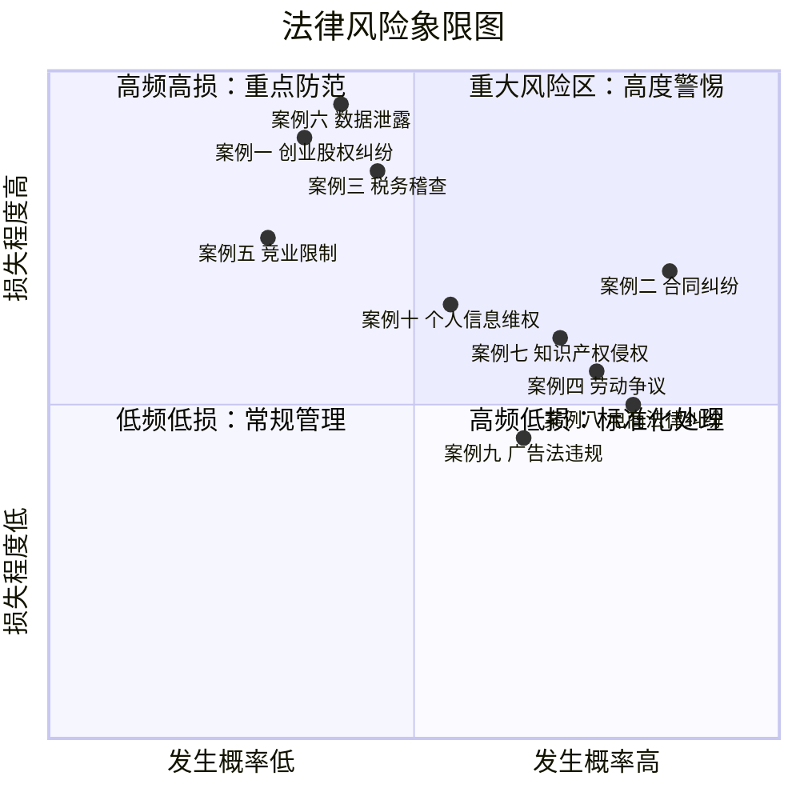
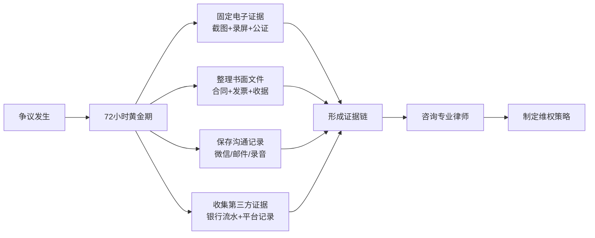
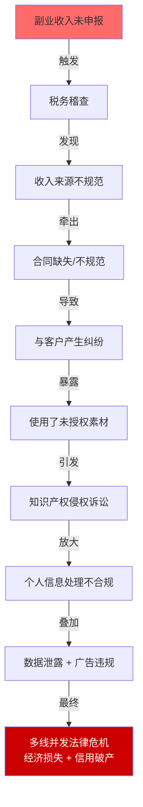
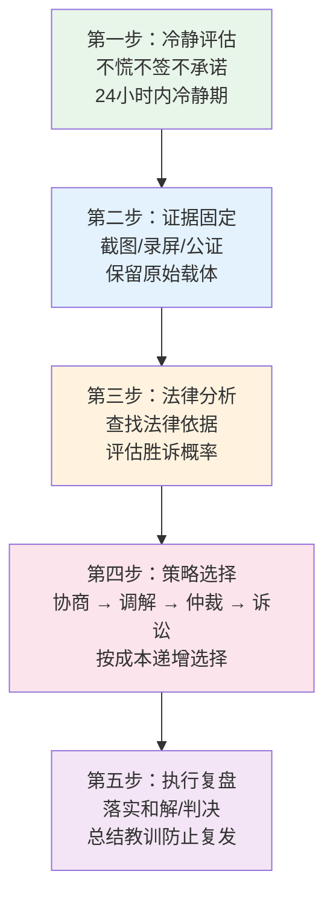

## 案例总结：从十个真实案例中提炼的法律合规实战体系

本节对前述十个实战案例进行系统性总结，提炼共性规律、归纳关键教训、构建可复用的风险管理框架。这不是简单的内容回顾，而是将分散的案例经验上升为可操作的方法论——让你在搞钱路上遇到任何法律问题时，都能迅速找到应对思路。

---

### 一、十大案例全景回顾

#### 1.1 案例类型与风险等级矩阵

十个案例覆盖了搞钱过程中最常见的法律风险领域。按照**发生概率**和**损失程度**两个维度，可以将它们定位如下：



#### 1.2 案例内容概要

| 序号 | 案例名称 | 核心法律领域 | 关键人物 | 核心争议 | 最终结果 |
|------|----------|-------------|---------|---------|---------|
| 一 | 创业股权纠纷 | 公司法、合伙协议 | 创业合伙人 | 股权分配不明确、退出机制缺失 | 控制权旁落、公司陷入僵局 |
| 二 | 合同纠纷 | 合同法 | 自由设计师 vs 餐饮企业 | 服务范围模糊、交付标准不清 | 经调解达成补充协议，损失部分追回 |
| 三 | 税务稽查 | 税收征管法 | 副业从业者 | 收入未申报、发票违规 | 补缴税款+滞纳金+罚款 |
| 四 | 劳动争议 | 劳动合同法 | 程序员 vs 互联网公司 | 副业被发现后遭违法解除 | 获得2N经济赔偿金 |
| 五 | 竞业限制纠纷 | 劳动合同法、反不正当竞争法 | 离职员工 vs 原公司 | 竞业限制范围过宽、补偿金争议 | 竞业限制条款被部分认定无效 |
| 六 | 数据泄露事件 | 数据安全法、个人信息保护法 | 技术创业者 | 用户数据管理不善导致泄露 | 被监管部门处罚+民事赔偿 |
| 七 | 知识产权侵权 | 著作权法、商标法 | 内容创业者 | 使用未授权素材构成侵权 | 赔偿权利人经济损失+停止侵权 |
| 八 | 电子商务法律纠纷 | 电子商务法、消费者权益保护法 | 网店经营者 | 平台规则违规+消费者投诉 | 店铺被处罚+赔偿消费者 |
| 九 | 广告法违规 | 广告法 | 营销从业者 | 使用极限词、虚假宣传 | 被市场监管部门罚款 |
| 十 | 个人信息维权 | 个人信息保护法 | 普通消费者 | 个人信息被违规收集和使用 | 维权成功获得赔偿 |

---

### 二、跨案例规律提炼

#### 2.1 十大案例的共同教训

将十个案例反复对比分析后，可以提炼出以下**六条核心教训**。这些教训不是空洞的"要守法"口号，而是从真实纠纷中用真金白银换来的实战经验。

**教训一：书面化是一切法律保护的起点**

在案例一（股权纠纷）和案例二（合同纠纷）中，当事人最初都因为"口头约定""兄弟情义"而省略了书面文件。结果一旦发生争议，口说无凭，维权举步维艰。

> **规则：任何涉及金钱、权利、义务的约定，必须落纸为文。** 不是"最好有书面协议"，而是"没有书面协议就不要开始"。

具体而言：
- 合伙创业：在出资前签订《合伙协议》或《股东协议》，明确出资比例、分工、退出机制
- 自由职业：在开工前签订书面《服务合同》，明确范围、标准、价格、交付时间
- 副业收入：保留所有合同、发票、银行流水，这些是税务合规的基础

**教训二：模糊条款是最大的定时炸弹**

案例二的合同中，服务范围写的是"品牌视觉识别系统全套设计"，"全套"二字没有穷举清单，导致甲方不断追加需求而乙方无法拒绝。案例一中"各占50%股权"看似公平，实则在决策时制造了僵局。

> **规则：合同中每一个可能产生歧义的词语，都必须有明确的定义或穷举清单。**

| 常见模糊表述 | 风险 | 正确写法 |
|-------------|------|---------|
| "全套设计" | 范围无限扩张 | 附录列出全部交付物清单（logo 3款、菜单4页等） |
| "合理时间内" | 时间无法约束 | "自合同签订之日起30个工作日内" |
| "甲方满意" | 主观标准无法衡量 | "符合附件所列的设计规范和技术标准" |
| "协助配合" | 义务不明确 | "乙方应在收到甲方通知后3个工作日内提供修改方案" |
| "等其他事项" | 兜底条款被滥用 | 全部列出，不用"等"字省略 |

**教训三：合规是日常习惯，不是事后补救**

案例三（税务稽查）、案例六（数据泄露）、案例九（广告法违规）有一个共同特征：当事人在出事前都觉得"不会查到我"，等到被查时已经来不及补救。

> **规则：合规不是成本，是保险。预防成本通常是事后补救成本的1/10到1/100。**

以税务为例：

| 阶段 | 行为 | 成本 |
|------|------|------|
| 事前合规 | 注册个体户/公司，按规定申报纳税 | 税款（可合法筹划降低） |
| 事中被查 | 税务稽查，需提供账目和凭证 | 补税 + 滞纳金（日万分之五） |
| 事后处罚 | 定性为偷税漏税 | 补税 + 滞纳金 + 0.5-5倍罚款 + 信用记录受损 |
| 极端情况 | 涉嫌逃税罪 | 补缴 + 罚款 + 刑事责任（最高7年有期徒刑） |

**教训四：证据意识决定维权成败**

案例四（劳动争议）中，张某之所以能够胜诉，关键在于他在争议发生后第一时间系统性地收集了证据：劳动合同、工资条、银行流水、工作记录、HR谈话录音、微信聊天记录截图。这些证据形成了完整的证据链，让公司的辩解不攻自破。

> **规则：平时养成保留关键文件的习惯，争议发生后72小时内完成核心证据的固定。**

证据保全的关键动作：



**教训五：不要在情绪激动时做决定**

案例四中，张某被要求签署《自愿离职申请书》时拒绝签字，这是最关键的一步。案例一中，创始人在愤怒中做出了让步，事后追悔莫及。

> **规则：收到任何法律文件、通知、要求时，先不要签、不要回、不要承诺。给自己至少24小时冷静期，咨询专业人士后再行动。**

需要冷静期的典型场景：
- 公司要求你签署《自愿离职申请书》 → 不签，要求公司出具书面解除通知
- 客户发来律师函要求赔偿 → 不回复，先确认事实再应对
- 合作方要求修改合同条款 → 不立即同意，评估影响后回复
- 税务机关发来稽查通知 → 不慌张，聘请税务师协助应对

**教训六：专业的事交给专业的人**

十个案例中，凡是当事人自行应对的（如案例一、案例三），结果通常不如委托专业人士的（如案例四委托律师、案例二最终请律师调解）。法律是一门专业学科，普通人很难在短时间内掌握足够的法律知识来应对复杂纠纷。

> **规则：年收入超过10万元的副业/创业项目，每年至少进行一次法律体检；遇到纠纷时第一时间咨询律师。**

律师的价值不在于打赢官司，而在于**提前告诉你哪些事情不能做**。

---

#### 2.2 案例间的因果链条

很多法律风险不是孤立存在的，它们之间存在因果传导关系。一个领域的违规，往往会引发连锁反应：



**关键洞察：法律风险的叠加效应远大于单个风险之和。** 一次税务稽查可能牵出合同问题，合同问题又牵出知识产权问题，最终形成多线并发的法律危机。这就是为什么必须建立**系统性合规思维**，而不是"头痛医头、脚痛医脚"。

---

### 三、法律风险分类应对框架

#### 3.1 按搞钱路径的风险对照表

不同搞钱路径面临的法律风险侧重点不同。下表将十个案例中的经验映射到四种主要搞钱路径：

| 搞钱路径 | 高频风险 | 对应案例 | 核心防范措施 |
|---------|---------|---------|------------|
| **创业** | 股权纠纷、合同陷阱、税务违规 | 案例一、二、三 | 完善股权协议、规范合同模板、按时申报纳税 |
| **自由职业** | 合同纠纷、知识产权侵权、税务不规范 | 案例二、七、三 | 使用标准化服务合同、确保素材合规、注册个体户 |
| **副业** | 劳动争议、竞业限制、税务稽查 | 案例四、五、三 | 审查劳动合同、评估竞业限制、副业收入申报 |
| **电商** | 平台违规、消费者投诉、广告违规 | 案例八、九、十 | 熟悉平台规则、合规宣传、保护消费者数据 |

#### 3.2 风险应对五步法

无论遇到哪种法律风险，都可以按照以下五步流程应对：



**各步骤详解：**

**第一步：冷静评估（0-24小时）**

- 评估风险的真实程度：是对方虚张声势还是确实存在问题
- 评估潜在损失：最坏情况下会损失多少
- 评估时间成本：纠纷可能持续多久
- 决定是否需要立即聘请律师

**第二步：证据固定（24-72小时）**

- 电子证据：对聊天记录、网页内容进行录屏+截图，有条件的话做公证保全
- 书面证据：整理合同、发票、收据、银行流水等原始文件
- 证人证据：联系知情人，了解其是否愿意作证
- 注意：电子证据容易被篡改，公证保全的证据效力最高

**第三步：法律分析（3-7天）**

- 查找相关法律条文（可使用"国家法律法规数据库"官方平台）
- 评估自己的法律地位：有理还是无理，有证还是无证
- 咨询律师，获取专业意见
- 评估对方可能采取的行动

**第四步：策略选择**

争议解决的四种途径，按成本从低到高排列：

| 途径 | 适用场景 | 时间 | 成本 | 优势 | 劣势 |
|------|---------|------|------|------|------|
| **协商** | 双方仍有合作意愿 | 1-2周 | 几乎为零 | 最快、最省 | 无强制力 |
| **调解** | 双方愿意让步但需要第三方 | 2-4周 | 调解费用较低 | 较快、有一定约束力 | 结果取决于双方让步幅度 |
| **仲裁** | 合同中有仲裁条款 | 1-3个月 | 仲裁费+律师费 | 一裁终局、保密性强 | 费用较高 |
| **诉讼** | 其他途径无法解决 | 3-12个月 | 诉讼费+律师费 | 有强制执行力 | 时间长、公开审理 |

**第五步：执行复盘**

- 判决/调解生效后，及时申请执行（注意：申请执行的期限为2年）
- 将纠纷中的教训转化为制度改进（修改合同模板、完善内部流程等）
- 建立法律风险台账，记录已发生的风险和处理结果

---

### 四、搞钱路上的法律合规自检体系

#### 4.1 合规自检清单（按搞钱阶段）

**启动阶段自检：**

- [ ] 确认本职工作合同中是否有竞业限制或禁止兼职条款
- [ ] 选择合适的企业类型（个体户/有限公司/合伙企业）
- [ ] 股权结构是否合理（避免50:50僵局）
- [ ] 是否签订了书面合伙协议/股东协议
- [ ] 协议中是否约定了退出机制（回购条款、估值方法）
- [ ] 知识产权归属是否明确约定
- [ ] 公司名称、商标是否已查重和注册

**运营阶段自检：**

- [ ] 所有业务合同是否使用标准化模板
- [ ] 合同中服务范围、交付标准、付款节点是否明确
- [ ] 违约责任和争议解决条款是否合理
- [ ] 副业收入是否按期申报纳税
- [ ] 发票开具和管理是否规范
- [ ] 用户个人信息收集是否获得明确同意
- [ ] 隐私政策是否完整且符合法律要求
- [ ] 广告宣传内容是否合规（无极限词、无虚假宣传）
- [ ] 使用的图片、字体、音乐等素材是否有合法授权
- [ ] 电商平台经营是否符合平台规则

**危机阶段自检：**

- [ ] 是否在72小时内完成了核心证据固定
- [ ] 是否咨询了专业律师
- [ ] 是否了解对方的真实诉求和底线
- [ ] 是否评估了所有可能的解决方案及其成本
- [ ] 是否在冷静状态下做出了决定

#### 4.2 年度法律健康体检表

建议每年至少进行一次全面的法律健康体检，特别是副业或创业收入超过10万元的从业者：

| 体检项目 | 检查内容 | 风险等级判断标准 |
|---------|---------|----------------|
| 合同管理 | 现有合同是否需要续签/修订、是否有即将到期的合同 | 存在口头协议或过期合同 → 高风险 |
| 税务合规 | 全年收入是否全部申报、是否有漏报 | 有未申报收入 → 高风险 |
| 知识产权 | 商标是否续展、版权是否登记、是否有侵权风险 | 使用未授权素材 → 中风险 |
| 劳动合规 | 员工/外包合同是否规范、社保是否缴纳 | 未签劳动合同 → 高风险 |
| 数据合规 | 隐私政策是否更新、数据收集是否有合法基础 | 无隐私政策 → 中风险 |
| 广告合规 | 宣传材料是否使用极限词、是否虚假宣传 | 有违规表述 → 中高风险 |

---

### 五、案例数据的深度解读

#### 5.1 纠纷处理成本分析

从十个案例中提炼出的纠纷处理成本数据，可以为决策提供量化参考：

| 纠纷类型 | 平均处理周期 | 平均直接成本（律师费+诉讼费） | 平均间接成本（时间+精力+机会成本） | 比例 |
|---------|-------------|---------------------------|-------------------------------|------|
| 合同纠纷 | 3-6个月 | 1-5万元 | 2-3倍直接成本 | 直接:间接 ≈ 1:2.5 |
| 劳动争议 | 2-4个月 | 0.5-2万元 | 3-4倍直接成本 | 直接:间接 ≈ 1:3.5 |
| 税务稽查 | 1-6个月 | 税务师费+补缴+罚款 | 信用损失难以量化 | 直接成本为主 |
| 知识产权 | 6-12个月 | 2-10万元 | 品牌声誉损失 | 直接:间接 ≈ 1:1.5 |
| 数据泄露 | 即时-3个月 | 罚款+整改费+律师费 | 用户信任损失 | 间接成本远大于直接成本 |

**关键发现：间接成本通常是直接成本的1.5到3.5倍。** 这意味着很多当事人在计算"是否值得打官司"时，往往低估了真实成本。预防永远比补救划算。

#### 5.2 胜诉关键因素统计

在已有明确结果的案例中，影响最终结果的关键因素排序：

1. **证据完整性**（权重最高）——案例四中张某胜诉的决定性因素
2. **法律依据充分性**——案例五中竞业限制条款被认定无效的关键
3. **应对时效性**——案例二中及时调解避免了更大的损失
4. **专业支持**——有律师介入的案例结果普遍优于自行处理
5. **态度与策略**——案例四中张某拒绝"被自愿离职"的冷静判断

---

### 六、构建个人法律合规体系

#### 6.1 三层防护架构

基于十个案例的经验，建议每个搞钱者建立三层法律防护体系：

```mermaid
graph TD
    subgraph 第一层：预防层
        A1[标准化合同模板库]
        A2[合规自检清单]
        A3[年度法律体检]
        A4[法律知识学习]
    end
    
    subgraph 第二层：监控层
        B1[合同到期提醒]
        B2[税务申报日历]
        B3[政策法规更新跟踪]
        B4[竞争对手动态监控]
    end
    
    subgraph 第三层：响应层
        C1[律师联系人清单]
        C2[证据保全流程]
        C3[应急预案手册]
        C4[纠纷处理SOP]
    end
    
    第一层 --> 第二层 --> 第三层
```

**第一层：预防层（日常建设）**

- 建立自己的合同模板库，至少包含：服务合同、劳动合同、保密协议、合作框架协议
- 制作个人合规自检清单，每季度对照执行
- 每年至少学习一部新法律或重要法规修订
- 对新业务模式进行法律可行性评估

**第二层：监控层（持续跟踪）**

- 合同到期前30天提醒续签或评估
- 税务申报日历，避免逾期申报
- 关注所在行业的法规更新（如广告法修订、数据安全新规）
- 监控是否有他人侵犯自己的知识产权

**第三层：响应层（危机应对）**

- 手机里至少存两位律师的联系方式（一位民事律师、一位劳动法律师）
- 了解证据保全的基本流程和注意事项
- 针对常见纠纷场景（客户欠薪、被投诉、被举报）制定应急预案
- 纠纷处理完成后进行复盘，更新预防层措施

#### 6.2 个人法律工具箱

| 工具类型 | 推荐资源 | 用途 |
|---------|---------|------|
| **法律法规查询** | 国家法律法规数据库 (flk.npc.gov.cn) | 查询现行有效法律全文 |
| **司法案例查询** | 中国裁判文书网 (wenshu.court.gov.cn) | 查询类似案例的判决结果 |
| **企业信息查询** | 天眼查/企查查 | 查询合作方工商信息和诉讼记录 |
| **知识产权查询** | 中国商标网/中国版权保护中心 | 查询商标和版权注册情况 |
| **合同模板** | 市场监督管理局示范合同文本 | 获取官方认可的合同范本 |
| **法律咨询** | 12348公共法律服务热线 | 免费法律咨询 |
| **法律援助** | 当地法律援助中心 | 经济困难时的免费律师服务 |

---

### 七、从案例到行动：你的法律合规路线图

#### 7.1 按紧迫度排列的行动清单

**立即执行（本周内）：**

1. 检查本职工作合同中是否有竞业限制和禁止兼职条款
2. 如果已在做副业或创业，确认所有业务是否签订了书面合同
3. 整理保存现有的合同、发票、银行流水等关键文件
4. 手机中保存至少一位律师的联系方式

**短期执行（一个月内）：**

5. 根据业务规模，注册个体工商户或有限责任公司
6. 准备标准化的合同模板（服务合同、保密协议）
7. 完成副业收入的税务登记和申报
8. 检查业务中使用的图片、字体等素材是否有合法授权
9. 如经营涉及用户数据，完善隐私政策和数据保护措施

**长期建设（持续进行）：**

10. 每季度进行一次合规自检
11. 每年进行一次全面法律健康体检
12. 持续学习与业务相关的法律法规更新
13. 建立法律纠纷案例库，记录和复盘每次遇到的法律问题

#### 7.2 法律合规成熟度模型

搞钱者的法律合规能力可以分为五个成熟度等级：

| 等级 | 名称 | 特征 | 对应案例教训 |
|------|------|------|------------|
| L1 | 无意识 | 没有法律概念，出事了才知道 | 案例一：口头约定股权分配 |
| L2 | 被动应对 | 出了问题才找律师，平时不关注 | 案例三：被查才知要报税 |
| L3 | 基本合规 | 有合同、有报税，但不系统 | 案例七：知道要授权但省了步骤 |
| L4 | 主动管理 | 建立合规体系，定期自查 | 案例四：系统收集证据成功维权 |
| L5 | 战略合规 | 法律是竞争优势，合规创造价值 | — |

大多数搞钱者的起始水平在L1-L2之间。通过本章的学习和实践，目标是达到L3-L4水平。L5是最终理想状态——不仅不违法，还能利用法律工具（如知识产权布局、合同条款优化）创造额外价值。

---

### 八、常见问题速查

**Q1：副业收入到底要不要交税？**

要。个人所得税法规定，工资薪金、劳务报酬、稿酬、经营所得等都需要纳税。副业收入通常属于"劳务报酬所得"或"经营所得"，年收入超过起征点就必须申报。不申报被查到的后果远比主动申报的税款高得多。

**Q2：签合同时最需要注意哪三个条款？**

（1）**服务范围/标的条款**——明确"做什么"和"不做什么"，避免范围无限扩张；（2）**付款条款**——明确金额、时间、方式、条件，防止拖欠；（3）**违约责任条款**——明确双方违约时的赔偿标准和计算方式。

**Q3：被公司发现做副业，公司能直接开除我吗？**

不一定。需要看：（1）劳动合同和规章制度中是否有明确禁止条款；（2）该条款是否经过民主程序制定（职工代表大会讨论）并向员工公示；（3）副业是否实际影响了本职工作。三个条件缺一，公司的解除行为就可能被认定为违法解除。

**Q4：收到律师函怎么办？**

不要慌张，不要立即回复。第一步，仔细阅读律师函的内容，弄清楚对方的诉求是什么；第二步，评估对方的诉求是否有事实和法律依据；第三步，咨询自己的律师，制定应对策略。很多律师函是"试探性"的，目的是迫使对方让步，不一定真的会起诉。

**Q5：什么情况下必须请律师？**

以下情况强烈建议聘请律师：（1）涉及金额超过5万元的纠纷；（2）收到法院传票或仲裁通知；（3）涉及刑事案件风险（如涉嫌诈骗、逃税）；（4）需要签订复杂的股权/投资/合作协议；（5）被监管部门调查。

---

### 九、本节核心金句

> **法律是搞钱者的底层操作系统。系统不稳，应用再花哨也会崩溃。**

> **合同上的每一句话，都是你未来纠纷中的武器或枷锁。签之前多花一小时，签之后少花十万元。**

> **合规不是成本，是保险。你为合规付出的每一分钱，都在为你省下未来十倍的损失。**

> **证据是法律世界的货币。没有证据的事实，在法律面前不存在。**

> **搞钱路上最大的法律风险不是犯法，而是不知道自己在犯法。**
