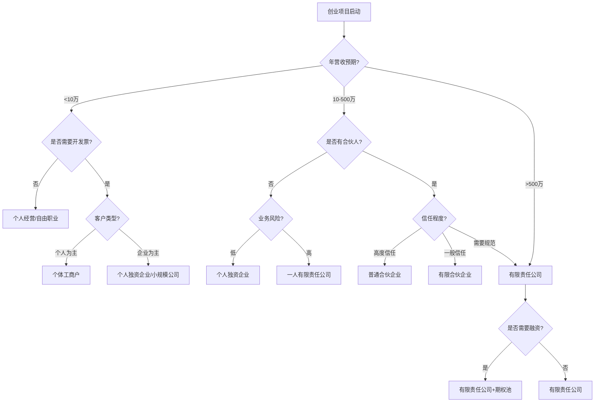
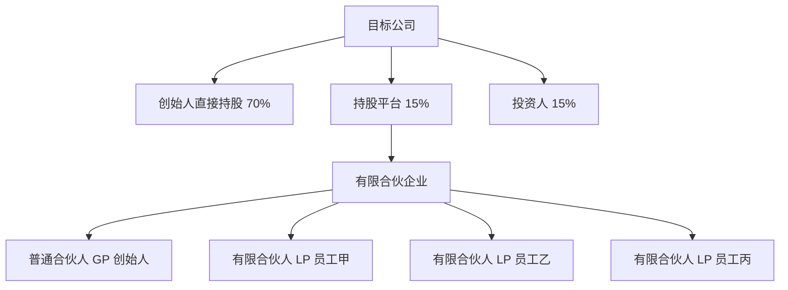

## 一、公司注册技巧

公司注册是创业的第一步，也是法律合规的起点。一个合理的公司架构不仅能保护创业者个人资产，还能为后续融资、税务筹划、业务扩展奠定基础。本节将从公司类型选择、注册流程优化、股权结构设计、注册地址策略、后续合规义务五个维度，系统讲解公司注册的核心技巧。

### 1.1 公司类型选择

#### 1.1.1 中国主要商事主体类型

中国法律体系下，创业者可选择的商事主体主要包括以下几种：

| 类型 | 法律依据 | 责任形式 | 适用场景 | 注册难度 |
|------|----------|----------|----------|----------|
| 个体工商户 | 《个体工商户条例》 | 无限责任 | 小规模经营、试水项目 | ★☆☆☆☆ |
| 个人独资企业 | 《个人独资企业法》 | 无限责任 | 个人工作室、咨询服务 | ★★☆☆☆ |
| 合伙企业（普通） | 《合伙企业法》 | 普通合伙人无限责任 | 专业服务、合伙创业 | ★★★☆☆ |
| 合伙企业（有限） | 《合伙企业法》 | LP有限责任/GP无限责任 | 投资基金、股权激励 | ★★★☆☆ |
| 有限责任公司 | 《公司法》 | 股东以出资额为限 | 大多数创业项目 | ★★★☆☆ |
| 股份有限公司 | 《公司法》 | 股东以股份为限 | 规模较大、准备上市 | ★★★★☆ |

#### 1.1.2 公司类型选择决策框架



#### 1.1.3 个体工商户 vs 有限责任公司深度对比

**责任风险对比：**

个体工商户的最大风险在于无限责任。以一个真实案例说明：张先生经营一家个体工商户餐馆，因食品安全问题被顾客起诉索赔50万元。由于个体工商户承担无限责任，张先生不仅需要赔偿餐馆资产，还需用个人房产、存款等家庭财产进行赔偿。如果张先生当初选择注册有限责任公司，且公司资产与个人资产严格隔离，他最多只需以公司注册资本（如10万元）为限承担责任。

**税务成本对比：**

| 税种 | 个体工商户 | 有限责任公司 |
|------|-----------|-------------|
| 增值税 | 月销售额10万以下免征（小规模纳税人） | 小规模纳税人同左，一般纳税人6%-13% |
| 个人所得税 | 经营所得5%-35%超额累进税率 | 不适用 |
| 企业所得税 | 不适用 | 25%（小微企业5%） |
| 股东分红个税 | 不适用 | 20% |
| 综合税负（年利润50万） | 约8.5% | 约21%（小微企业） |

从税务角度看，年利润在50万以下时，个体工商户的综合税负明显低于有限责任公司。但随着利润增长，两者差距缩小，且有限责任公司可通过工资、费用等方式合理降低税负。

**融资能力对比：**

有限责任公司可以通过股权转让、增资扩股等方式引入投资人。个体工商户无法进行股权融资，银行贷款也更困难，因为银行更倾向于向具有法人资格的企业放贷。

#### 1.1.4 特殊行业主体选择

某些行业对主体类型有特殊要求：

- **餐饮食品**：必须办理食品经营许可证，个体工商户和公司均可
- **教育培训**：通常需要民办非企业单位或公司形式，且需教育部门审批
- **医疗器械**：需医疗器械经营许可证，通常要求公司形式
- **互联网信息服务**：需ICP经营许可证，要求公司形式且注册资本100万以上
- **劳务派遣**：要求有限责任公司，注册资本200万以上

### 1.2 注册流程优化

#### 1.2.1 完整注册流程


#### 1.2.2 核名技巧详解

公司名称由四部分组成：**行政区划+字号+行业特征+组织形式**。例如："北京小米科技有限公司"中，"北京"是行政区划，"小米"是字号，"科技"是行业特征，"有限公司"是组织形式。

**核名避坑指南：**

| 错误类型 | 错误示例 | 正确做法 |
|----------|----------|----------|
| 使用禁用词汇 | "中国第一科技有限公司" | 避免"中国""第一""最佳"等 |
| 与知名企业近似 | "阿里八八科技" | 查询国家企业信用信息公示系统 |
| 使用通用词汇 | "北京科技有限公司" | 字号需有显著性，至少2个字 |
| 包含特殊字符 | "北京@科技有限公司" | 只能使用汉字、字母、数字 |

**高效核名策略：**

1. **提前查询**：登录国家企业信用信息公示系统（www.gsxt.gov.cn）或天眼查、企查查等平台，先排查心仪名称是否已被注册
2. **准备5-8个备选名称**：按优先级排序，第一个被驳回可立即提交下一个
3. **使用生僻组合**：将两个不常见的词组合，如"云栖""星瀚"等
4. **避免行业通用词**：如"鑫""诚""信"等高频字容易重名
5. **利用线上核名系统**：多数地区已开通网上核名，可即时反馈结果

#### 1.2.3 经营范围填写策略

经营范围决定了公司可以从事的业务活动，也影响税率和资质申请。

**填写原则：**

1. **主营业务前置**：经营范围的第一项决定了公司的行业归属和税率，务必将主营业务放在第一位
2. **适当宽泛**：在不违反规定的前提下，适当扩大经营范围，避免未来变更
3. **参考同行**：在企查查上搜索同行业头部企业，参考其经营范围
4. **注意审批要求**：部分经营范围需要前置审批（先办许可证再注册）或后置审批（先注册再办许可证）

**常见经营范围模板：**

| 行业 | 推荐经营范围 |
|------|-------------|
| 科技公司 | 技术开发、技术咨询、技术服务、技术转让；软件开发；计算机系统集成；数据处理 |
| 电商公司 | 网上销售日用百货、服装鞋帽、电子产品；国内贸易；货物进出口 |
| 咨询公司 | 企业管理咨询；经济信息咨询；市场调查；会议服务；展览展示服务 |
| 文化传媒 | 组织文化艺术交流活动；设计、制作、代理、发布广告；企业策划；摄影服务 |

**特别提醒**：经营范围不是越多越好。过多的经营范围可能：
- 导致税种认定复杂化
- 引起税务机关关注
- 增加年报披露负担

#### 1.2.4 注册资本设置策略

2014年《公司法》修订后，注册资本由实缴制改为认缴制，但这并不意味着可以随意设置。

**注册资本设置参考框架：**

| 注册资本范围 | 适用场景 | 风险提示 |
|-------------|---------|---------|
| 10-50万 | 小型服务类公司、个人工作室 | 部分招投标要求注册资本门槛 |
| 50-100万 | 一般贸易、科技公司 | 平衡信誉与风险的常见选择 |
| 100-500万 | 有融资需求的创业公司 | 认缴金额即为股东最大责任限额 |
| 500万以上 | 特殊行业资质要求 | 谨慎设置，避免过度承诺 |

**注册资本的常见误区：**

1. **误区一：注册资本越高越好**
   - 真相：注册资本是股东认缴的出资额，也是股东承担有限责任的上限。注册资本1000万意味着股东最多需承担1000万的责任
   - 建议：根据实际经营需要和股东承受能力合理设置

2. **误区二：认缴制不需要实缴**
   - 真相：认缴制只是延长了出资期限，但股东仍需在约定期限内实缴。公司破产清算时，未实缴部分需加速到期
   - 建议：在公司章程中合理约定出资期限，避免过长

3. **误区三：注册资本可以随意增减**
   - 真相：增资相对简单，但减资需要公告、通知债权人，程序复杂
   - 建议：初始设置时留有余地，宁可稍高也不要后期频繁变更

#### 1.2.5 注册地址选择

注册地址是公司营业执照上的住所地，影响税收政策、行业准入和运营成本。

**地址类型对比：**

| 地址类型 | 年费用 | 优点 | 缺点 |
|---------|-------|------|------|
| 实际办公地址 | 视地段而定 | 真实可信，无异常风险 | 成本高 |
| 集中办公区/孵化器 | 3000-8000元 | 有实际地址，可接收信函 | 空间有限 |
| 虚拟注册地址 | 1000-5000元 | 成本低，灵活 | 部分银行开户受限 |
| 住宅地址 | 免费 | 零成本 | 需业委会同意，部分行业不允许 |

**地址选择注意事项：**

1. **税收优惠园区**：部分地方政府为招商引资，提供税收返还政策。例如某些园区可返还增值税地方留存部分的30%-50%
2. **集群注册**：多个企业共用一个注册地址，适合初创企业，但需确保托管机构正规
3. **地址异常风险**：如果工商局通过登记的住所无法联系企业，企业将被列入经营异常名录，影响信用和招投标

### 1.3 股权结构设计

#### 1.3.1 股权比例的法律意义

股权比例不仅仅是利润分配的依据，更决定了股东对公司的控制权。以下是关键比例节点：

| 持股比例 | 法律权利 | 适用场景 | 实操建议 |
|----------|---------|---------|---------|
| 67%以上 | 绝对控制权：可修改公司章程、增减注册资本、合并分立解散 | 创始人绝对控股 | 适合创始人能力突出、资源集中的项目 |
| 51%以上 | 相对控制权：可决定经营方针、选举董事监事 | 创始人相对控股 | 多数创业公司的理想结构 |
| 34%以上 | 一票否决权：可阻止重大事项通过 | 联合创始人/重要投资人 | 保护核心股东利益 |
| 10%以上 | 临时提案权：可提议召开临时股东会 | 小股东保护 | 防止被大股东完全边缘化 |
| 3%以上 | 提案权：可向股东大会提出议案 | 上市公司小股东 | 适用于股份有限公司 |
| 1%以上 | 代位诉讼权：可代表公司起诉董事高管 | 监督制衡 | 上市公司股东权益保护 |

#### 1.3.2 创始人股权分配原则

**错误的股权分配模式：**

| 模式 | 问题 | 后果 |
|------|------|------|
| 50:50 | 没有决策者，容易僵局 | 公司陷入决策瘫痪 |
| 平均分配（33:33:34） | 谁说了都不算 | 合伙人反目、公司分裂 |
| 一人独占（100:0:0） | 合伙人无归属感 | 核心团队流失 |
| 过早分配 | 早期贡献未充分评估 | 后期贡献者无股份可分 |

**推荐的股权分配模型：**


**股权分配的四个维度：**

1. **资金出资**：实际投入的资金占比
2. **人力投入**：全职参与 vs 兼职参与，工作时间长短
3. **资源贡献**：带来的客户、渠道、技术、专利等资源
4. **风险承担**：放弃其他机会的成本，个人担保等

#### 1.3.3 股权成熟机制（Vesting）

股权成熟机制是防止合伙人早期离开带走股份的重要工具。

**标准Vesting方案：4年成熟期，1年悬崖期**

| 时间节点 | 成熟比例 | 说明 |
|---------|---------|------|
| 入职满1年 | 25% | 悬崖期（Cliff），一次性成熟25% |
| 第1-4年 | 每月成熟1/48 | 线性成熟，每月获得约2.08% |
| 满4年 | 100% | 全部成熟，完全拥有股份 |

**Vesting条款设计要点：**

1. **离职处理**：未成熟股份由公司或创始人按约定价格回购
2. **回购价格**：通常为原始出资额或净资产对应份额，避免按估值回购
3. **加速成熟**：可约定公司被收购时加速成熟（单触发/双触发）
4. **违约条款**：因重大过错离职的，已成熟股份也可回购

**公司章程中的Vesting条款示例：**

```text
第X条 股权成熟

一、股东A持有公司30%股权，分四年成熟，具体安排如下：
（一）自公司成立之日起满一年，成熟25%（即7.5%股权）；
（二）此后每月成熟1/48（即0.625%股权），直至四年期满全部成熟。

二、股东A在成熟期内离职的，未成熟部分由其余股东按原始出资额回购。

三、因违反竞业限制、泄露商业秘密等重大过错离职的，公司有权以原始出资额回购已成熟股份的50%。
```

#### 1.3.4 期权池设计

期权池（ESOP）是预留用于员工激励的股权比例，通常在融资前设立。

**期权池设计参数：**

| 参数 | 建议范围 | 说明 |
|------|---------|------|
| 预留比例 | 10%-20% | 早期公司通常预留15%-20% |
| 分配对象 | 核心员工 | CTO、VP级别，关键技术人员 |
| 行权价格 | 低于估值 | 通常为最新融资估值的30%-50% |
| 行权期限 | 4年 | 标准4年Vesting，1年Cliff |
| 退出机制 | 90天 | 离职后90天内决定是否行权 |

**期权池的设立方式：**

1. **创始人代持**：创始人预留部分股权用于激励，简单但有代持风险
2. **有限合伙持股平台**：设立有限合伙企业作为持股平台，员工通过LP份额间接持股，便于管理和税务筹划
3. **直接持股**：员工直接持有公司股权，适合后期成熟公司

**持股平台架构图：**



### 1.4 公司章程设计

#### 1.4.1 公司章程的重要性

公司章程是公司的"宪法"，规定了公司的组织架构、股东权利义务、利润分配方式等核心事项。很多创业者直接使用工商局提供的模板，但模板章程往往缺乏个性化条款，容易在后续经营中产生纠纷。

**必须在章程中约定的关键条款：**

1. **股东出资方式和期限**：明确各股东的出资额、出资方式（货币/实物/知识产权）、出资期限
2. **利润分配规则**：是否按持股比例分配，是否可以不按出资比例分配
3. **表决权安排**：是否实行一人一票，还是按出资比例表决
4. **股权转让限制**：其他股东的优先购买权，对外转让的限制条件
5. **退出机制**：股东退出时的股权回购价格和程序
6. **竞业禁止**：股东和高管的竞业限制义务
7. **僵局处理**：股东会无法形成决议时的解决方案

#### 1.4.2 章程个性化条款设计

**同股不同权条款（有限责任公司可约定）：**

```text
第X条 表决权

一、股东会会议由股东按照出资比例行使表决权，但全体股东约定如下：
（一）股东A虽持有公司40%股权，但享有60%的表决权；
（二）股东B虽持有公司35%股权，但享有25%的表决权；
（三）股东C虽持有公司25%股权，但享有15%的表决权。
```

**利润分配条款：**

```text
第X条 利润分配

一、公司税后利润按以下顺序分配：
（一）弥补以前年度亏损；
（二）提取法定公积金10%；
（三）提取任意公积金（比例由股东会决定）；
（四）向股东分配利润。

二、股东利润分配比例与出资比例相同/不同，具体为：
股东A：50%，股东B：30%，股东C：20%。
```

### 1.5 注册后的合规义务

#### 1.5.1 税务登记与申报

公司领取营业执照后30日内必须办理税务登记。逾期未登记的，税务机关可处以2000元以下罚款。

**税务登记流程：**

1. 携带营业执照副本、法人身份证、公章到税务局
2. 填写税务登记表
3. 认定纳税人类型（小规模纳税人/一般纳税人）
4. 核定税种和申报期限
5. 领取发票（如需要）

**申报期限一览：**

| 税种 | 申报期限 | 备注 |
|------|---------|------|
| 增值税 | 次月15日前 | 小规模纳税人可按季度申报 |
| 企业所得税 | 季度预缴，年度汇算清缴 | 季度终了15日内预缴 |
| 个人所得税（代扣代缴） | 次月15日前 | 员工工资薪金 |
| 印花税 | 次月15日前 | 合同、账簿等 |
| 城建税及附加 | 随增值税一同申报 | 随主税申报 |

#### 1.5.2 银行开户

公司银行基本户是公司资金往来的唯一合法账户。

**开户所需材料：**

- 营业执照正副本
- 法定代表人身份证
- 公章、财务章、法人章
- 公司章程
- 租赁合同或产权证明（证明注册地址）

**开户注意事项：**

1. **选择银行**：大行（工农中建）网点多但费用高，小行（城商行、农商行）费用低但服务可能受限
2. **账户管理费**：部分银行收取年费、小额账户管理费，开户前问清楚
3. **网银功能**：确认是否支持网银转账、代发工资等功能
4. **办理时间**：预约开户通常需要1-2周，紧急情况可加急

#### 1.5.3 社保与公积金开户

公司成立30日内必须办理社保登记，录用员工30日内必须为其缴纳社保。

**社保缴纳基数与比例（以北京为例，2024年标准）：**

| 险种 | 单位比例 | 个人比例 | 缴纳基数 |
|------|---------|---------|---------|
| 养老保险 | 16% | 8% | 工资总额（上下限为社平工资的60%-300%） |
| 医疗保险 | 9.8% | 2%+3元 | 同上 |
| 失业保险 | 0.5% | 0.5% | 同上 |
| 工伤保险 | 0.2%-1.9% | 0 | 同上 |
| 生育保险 | 0.8% | 0 | 同上 |

**公积金缴纳比例**：5%-12%，单位和个人各承担一半。

### 1.6 常见注册误区与风险防范

#### 1.6.1 注册阶段常见错误

| 错误 | 风险 | 正确做法 |
|------|------|---------|
| 使用虚假地址注册 | 被列入经营异常名录，影响信用 | 使用真实地址或正规虚拟地址 |
| 注册资本写1亿 | 承担1亿的有限责任上限 | 根据实际需要合理设置 |
| 经营范围照抄模板 | 可能遗漏必要项目或包含需审批项目 | 根据实际业务定制 |
| 不设监事 | 违反公司法规定 | 至少设一名监事（不能是法人） |
| 法人代表随意指定 | 法人需承担法律责任，限制高消费等 | 选择了解业务、有法律意识的人担任 |
| 不设公司章程 | 使用模板章程，缺乏个性化保护 | 聘请律师定制章程 |

#### 1.6.2 一人有限公司的特殊风险

一人有限责任公司（只有一个股东）在法律上有一个致命缺陷：**如果股东不能证明公司财产独立于个人财产，需对公司债务承担连带责任**。

**防范措施：**

1. **严格财务独立**：公司账户与个人账户完全分离，禁止混用
2. **规范记账**：聘请专业会计或代理记账公司，确保账目清晰
3. **年度审计**：每年编制财务会计报告，并经会计师事务所审计
4. **保留凭证**：所有收支保留发票、合同、银行流水等凭证
5. **避免关联交易**：减少公司与股东个人之间的交易，如必须进行，需按市场价格并保留完整记录

#### 1.6.3 代理注册公司的选择

市场上代理注册公司的服务费从0元到数千元不等，选择时需注意：

**代理注册服务对比：**

| 服务类型 | 费用 | 包含内容 | 适合人群 |
|---------|------|---------|---------|
| 免费注册+代理记账 | 0元注册，200-500元/月记账 | 注册+首年代理记账 | 需要记账服务的创业者 |
| 纯注册服务 | 500-1500元 | 核名+注册+刻章+开户 | 自己有会计的创业者 |
| 全包服务 | 2000-5000元 | 注册+地址+记账+社保 | 省心省力的创业者 |

**选择代理公司的注意事项：**

1. **资质审查**：确认是否有正规的营业执照和代理记账许可证
2. **口碑查询**：查看网上评价，避免选择投诉较多的代理
3. **合同明确**：签订书面合同，明确服务内容、费用、时限
4. **材料安全**：确保代理公司妥善保管公章、执照等重要材料
5. **隐性费用**：问清楚是否有额外费用，如银行开户费、税控盘费等

### 1.7 实战案例

#### 案例一：股权结构不合理导致公司僵局

**背景**：三位朋友合伙创业，股权比例为34%:33%:33%。公司成立一年后，因发展方向分歧，三位股东无法达成一致，公司陷入决策僵局。

**问题分析**：
- 没有任何一方拥有超过50%的表决权
- 修改公司章程需要2/3以上表决权，无人能够单独通过
- 公司经营陷入停滞，错失市场机会

**解决方案**：
1. 引入外部投资人，稀释三方股权，打破僵局
2. 一方收购其他两方股权，实现控股
3. 协商解散公司，清算分配资产

**教训**：
- 创始团队必须有一个核心决策者
- 股权比例设计要避免均分
- 提前在章程中约定僵局处理机制

#### 案例二：注册资本过高导致股东承担巨额债务

**背景**：张先生注册一家贸易公司，为显示实力，注册资本设为1000万元，认缴期限20年。公司经营两年后因市场变化亏损严重，对外负债800万元。

**问题分析**：
- 公司资产仅剩100万元，无法偿还800万债务
- 债权人起诉公司，同时要求股东在未出资范围内承担责任
- 张先生注册资本1000万，实缴仅50万，需在950万范围内承担责任

**最终结果**：法院判决张先生在未出资的950万范围内对公司债务承担补充赔偿责任。

**教训**：
- 注册资本不是越大越好
- 认缴制不等于不缴
- 要根据实际经营需要和股东承受能力合理设置

#### 案例三：利用持股平台实现税务优化

**背景**：某科技公司需要给5名核心员工股权激励，每人2%的股份。如果直接持股，员工获得股权时需按"工资薪金所得"缴纳个人所得税，税率最高45%。

**优化方案**：
1. 设立有限合伙企业作为持股平台
2. 员工通过有限合伙间接持有公司股权
3. 选择在有税收优惠的地区注册有限合伙企业（如新疆霍尔果斯、江西共青城等）
4. 股权转让时按"经营所得"缴纳个人所得税，税率20%，部分地区有税收返还

**节税效果**：假设股权转让收益100万元，直接持股需缴纳约35万元个税，通过持股平台可能只需缴纳约15万元，节税约20万元。

### 1.8 公司注册的法律依据

创业者应了解公司注册相关的法律法规，以便在遇到问题时有据可依：

| 法律法规 | 主要内容 | 与注册的关系 |
|---------|---------|-------------|
| 《公司法》 | 公司设立、组织架构、股东权利 | 公司注册的基本法律依据 |
| 《公司登记管理条例》 | 登记程序、材料要求 | 注册流程的具体规定 |
| 《市场主体登记管理条例》 | 统一市场主体登记制度 | 2022年实施，简化注册流程 |
| 《企业名称登记管理规定》 | 名称规范、禁用词汇 | 核名的法律依据 |
| 《合伙企业法》 | 合伙企业设立、运营 | 合伙企业注册的法律依据 |
| 《个体工商户条例》 | 个体工商户设立、管理 | 个体户注册的法律依据 |

### 1.9 本节小结

公司注册看似简单，实则涉及法律、税务、管理等多个领域。一个合理的公司架构能为创业之路保驾护航，而不当的设置可能埋下隐患。

**核心要点回顾：**

1. **选择合适的公司类型**：根据业务规模、风险程度、融资需求综合判断
2. **合理设置注册资本**：不是越高越好，要在信誉和风险之间平衡
3. **设计科学的股权结构**：避免均分，预留期权池，设置Vesting机制
4. **重视公司章程**：不要使用模板，要根据实际情况定制个性化条款
5. **及时办理后续手续**：税务登记、银行开户、社保开户缺一不可
6. **防范常见风险**：一人公司财产混同、代理注册陷阱、虚假地址等

**注册清单：**

- [ ] 确定公司类型
- [ ] 准备3-5个公司名称
- [ ] 确定注册地址
- [ ] 确定注册资本和股东出资比例
- [ ] 编制公司章程
- [ ] 确定经营范围
- [ ] 办理核名
- [ ] 提交注册材料
- [ ] 领取营业执照
- [ ] 刻制公章、财务章、法人章
- [ ] 银行开户
- [ ] 税务登记
- [ ] 社保开户
- [ ] 公积金开户

下一步，我们将学习合同审查技巧，这是企业日常经营中最常接触的法律文书。
