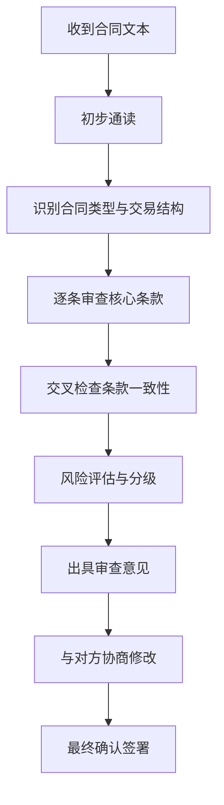

## 二、合同审查技巧

合同审查是法律风险防控的第一道防线。一份审查不到位的合同，可能让企业损失数百万甚至陷入长期诉讼泥潭。本节从审查流程、核心条款拆解、常见陷阱识别到实战工具，系统讲解如何高效、专业地完成合同审查。

### 1. 合同审查的底层逻辑

#### 1.1 为什么要审查合同

合同的本质是**风险分配协议**。双方通过条款约定各自的权利、义务和违约责任。审查合同的核心目的有三个：

- **识别风险**：发现对我方不利的条款、模糊表述和潜在漏洞
- **平衡利益**：确保权利义务对等，避免单方面承担过多风险
- **确保可执行**：条款必须在法律框架内可落地，而非一纸空文

#### 1.2 审查的三重视角

专业合同审查需要同时从三个视角切入：

| 视角 | 关注点 | 典型问题 |
|------|--------|----------|
| **法律视角** | 合法性、效力性、管辖权 | 条款是否违反强制性规定？争议解决方式是否有利？ |
| **商业视角** | 商业逻辑、利益平衡 | 付款条件是否合理？交付标准是否清晰？ |
| **执行视角** | 可操作性、证据留存 | 违约如何认定？变更程序是否明确？ |

#### 1.3 审查流程标准化



### 2. 八大核心条款逐条拆解

#### 2.1 合同主体条款

**审查要点：**

- **主体资格**：确认签约方是否具有合法主体资格。企业需核实营业执照、经营范围；个人需核实身份信息
- **签约权限**：法定代表人可直接签约；代理人需审查授权委托书的范围和有效期
- **关联关系**：是否存在关联交易、利益冲突需要披露

**常见陷阱：**

- 用分公司签约，但分公司无独立法人资格，责任最终归属不清
- 代理人超越授权范围签约，合同效力存疑
- 对方已注销或被列入经营异常名录

**实务操作：** 签约前通过"国家企业信用信息公示系统"查询对方工商登记信息，通过"中国执行信息公开网"查询是否为失信被执行人。

#### 2.2 标的条款

**审查要点：**

- 标的物名称、规格、型号、数量必须明确具体
- 服务类合同需明确服务范围、标准、交付物
- 知识产权类合同需明确权利归属、使用范围、期限

**反面案例：**

> 某软件开发合同约定"开发一套管理系统"，未明确功能模块、技术架构、验收标准。开发完成后，甲方认为功能不全，乙方认为已按约定交付，双方陷入长达两年的诉讼。

**改进写法：**

> "乙方为甲方开发XX管理系统，功能模块包括：用户管理（支持角色权限配置）、订单管理（支持批量导入导出）、数据报表（支持自定义维度筛选），具体功能清单见附件一《需求规格说明书》。"

#### 2.3 价款与支付条款

**审查要点：**

- 价款金额是否含税、税率多少
- 支付方式：一次性支付、分期支付、里程碑付款
- 支付条件：预付款比例、进度款触发条件、尾款支付前提
- 发票类型：增值税专用发票还是普通发票

**关键对比：**

| 付款方式 | 适用场景 | 风险点 |
|----------|----------|--------|
| 一次性预付 | 小额交易、信任基础好 | 乙方履约动力不足 |
| 分期付款 | 中大型项目 | 需明确每期触发条件 |
| 里程碑付款 | 工程/开发类项目 | 里程碑节点必须可量化 |
| 验收后付款 | 交付物明确的项目 | 需明确验收标准和期限 |

**风险防范条款示例：**

> "甲方在合同签订后5个工作日内支付合同总价的30%作为预付款；乙方完成系统开发并通过甲方验收后15个工作日内，甲方支付剩余70%。甲方逾期付款的，每逾期一日按未付金额的万分之五支付违约金。"

#### 2.4 履行期限与交付条款

**审查要点：**

- 履行期限是否明确（具体日期，而非"尽快""合理时间内"）
- 交付方式、地点、运费承担
- 延迟履行的宽限期和违约责任
- 不可抗力条款的适用范围

**常见问题：**

"合理期限""尽快完成"这类表述在司法实践中极难认定，应替换为具体天数或日期。

#### 2.5 违约责任条款

**审查要点：**

- 违约情形是否穷尽列举（逾期交付、质量不合格、逾期付款、泄密等）
- 违约金比例是否合理（过高可被法院调减，过低无法弥补损失）
- 违约金与定金的关系（二者只能择一主张）
- 损害赔偿的范围是否明确

**法律依据：**

《民法典》第585条规定，约定的违约金过分高于造成的损失的，人民法院或者仲裁机构可以根据当事人的请求予以适当减少。实践中，违约金一般不超过实际损失的30%。

**违约金设置建议：**

| 合同类型 | 建议违约金比例 | 说明 |
|----------|---------------|------|
| 买卖合同 | 合同总价的10%-20% | 需与实际损失相当 |
| 服务合同 | 应付服务费的10%-30% | 可分阶段设置 |
| 建设工程合同 | 合同总价的5%-15% | 行业惯例较低 |
| 保密协议 | 50万-200万元固定金额 | 泄密损失难以量化 |

#### 2.6 保密条款

**审查要点：**

- 保密信息的定义范围是否清晰（是否包括口头信息、电子数据）
- 保密义务的期限（通常2-5年，部分核心商业秘密可约定永久保密）
- 保密信息的使用限制和返还/销毁义务
- 违反保密义务的赔偿标准

**高级审查技巧：**

保密条款中的"保密信息"定义应采用**列举+兜底**的方式，避免因列举不全导致核心信息泄露后无法追责：

> "保密信息包括但不限于：技术方案、源代码、算法模型、客户名单、供应商信息、财务数据、定价策略、商业计划、内部管理制度，以及任何标注'保密'或按其性质应被合理视为保密的信息。"

#### 2.7 知识产权条款

**审查要点：**

- 现有知识产权的归属不变
- 履行合同过程中新产生知识产权的归属（委托开发 vs 合作开发）
- 知识产权侵权的责任承担
- 许可使用的范围、方式、期限

**委托开发的知识产权归属：**

根据《民法典》第859条，委托开发完成的发明创造，除法律另有规定或当事人另有约定外，申请专利的权利属于研究开发人。**因此，委托方必须在合同中明确约定知识产权归属，否则默认归开发方所有。**

#### 2.8 争议解决条款

**两种主要方式对比：**

| 对比项 | 诉讼 | 仲裁 |
|--------|------|------|
| 管辖确定 | 被告住所地或合同履行地 | 约定仲裁机构 |
| 审级制度 | 两审终制 | 一裁终局 |
| 公开性 | 原则上公开审理 | 原则上不公开 |
| 执行效力 | 判决直接执行 | 裁决需法院承认 |
| 费用 | 诉讼费相对较低 | 仲裁费相对较高 |
| 适用场景 | 希望有上诉机会 | 希望快速解决、保密性强 |

**注意事项：**

- 仲裁条款必须明确具体的仲裁机构名称，"由仲裁机构仲裁"这类约定无效
- 约定管辖法院不得违反级别管辖和专属管辖的规定
- 涉外合同可约定适用法律和仲裁地

### 3. 九大常见合同陷阱

#### 3.1 阴阳合同

**表现形式：** 签订两份内容不一致的合同，一份用于备案或应付检查，一份为实际履行依据。

**风险：** 一旦发生纠纷，双方可能各执一词。以虚假意思表示签订的合同无效（《民法典》第146条）。

#### 3.2 模糊表述陷阱

**典型表述及改写：**

| 原文（模糊） | 改写（明确） |
|-------------|-------------|
| "优质产品" | "符合GB/T XXXX-2024国家标准，合格率≥99.5%" |
| "合理时间" | "收到通知后5个工作日内" |
| "相关费用" | "包括但不限于运输费、安装调试费、培训费" |
| "尽力配合" | "在XX条件下，乙方应当完成XX事项" |

#### 3.3 管辖陷阱

对方在合同中约定由其所在地法院管辖或其指定的仲裁机构仲裁，导致我方维权成本大幅增加。

**应对：** 争取约定我方所在地法院管辖，或选择双方均可接受的第三方仲裁机构。

#### 3.4 单方解除权陷阱

合同赋予对方单方解除权，但未给我方对等权利，或解除条件过于宽泛。

**审查重点：** 双方的解除权是否对等，解除后的结算和补偿是否明确。

#### 3.5 自动续约陷阱

合同到期后自动续约，且续约通知期极短（如提前30天），导致我方错过退出窗口。

**应对：** 将通知期延长至90天以上，或约定不自动续约、需双方另行签署续约协议。

#### 3.6 免责条款过度

对方将大量免责事项写入格式条款，免除自身主要义务。

**法律依据：** 《民法典》第497条规定，提供格式条款一方不合理地免除或者减轻其责任、加重对方责任、限制对方主要权利的，该格式条款无效。

#### 3.7 瑕疵担保缺失

买卖合同中未约定质量保证期、退换货条件、维修责任。

**应对：** 明确质保期限、质保范围、响应时间、维修方式（上门或返厂）以及质保期满后的有偿维修条件。

#### 3.8 通知条款陷阱

约定通知只能以特定方式（如纸质信函）送达，且以寄出为送达，排除电子邮件、短信等便捷方式。

**应对：** 增加电子邮件、微信等电子送达方式，并约定以实际收到为准。

#### 3.9 反向违约陷阱

合同将我方的正常履约行为定义为违约，或将对方的违约责任转嫁给我方。

**审查重点：** 逐条检查违约情形的定义，确保违约认定标准客观、可量化。

### 4. 不同类型合同的审查重点

#### 4.1 买卖合同

- 标的物的质量标准和检验方式
- 风险转移时点（交付时转移 vs 所有权保留）
- 包装、运输、保险责任
- 售后服务和质保条款

#### 4.2 服务合同

- 服务范围和交付标准
- 服务人员的资质要求
- 服务过程中的信息保密
- 知识产权归属

#### 4.3 劳动合同

- 试用期期限和工资标准
- 竞业限制的范围、期限和补偿
- 违约金仅限于培训费和竞业限制两种情形
- 社保和公积金缴纳基数

#### 4.4 租赁合同

- 租金调整机制
- 装修添附物的归属和补偿
- 转租限制
- 续租优先权

#### 4.5 投资/股权协议

- 估值方法和对赌条款
- 反稀释保护
- 优先清算权
- 信息权和参与管理权

### 5. 审查效率提升工具与方法

#### 5.1 审查清单法

建立标准化的合同审查清单，按条款逐项打勾确认：

```text
□ 合同主体信息完整且已核实
□ 标的物/服务描述明确具体
□ 价款金额、税率、支付方式清晰
□ 履行期限具体到日期
□ 违约责任条款完整且对等
□ 争议解决条款明确
□ 保密条款范围合理
□ 知识产权归属约定明确
□ 附件清单齐全
□ 签章位置正确
```

#### 5.2 对比审查法

将待审合同与同类型标准合同模板进行逐条对比，快速识别差异和风险点。建议按合同类型建立标准模板库，新合同审查时直接与模板对比。

#### 5.3 风险矩阵法

对每个条款的风险程度进行评估：

| 风险等级 | 标准 | 处理方式 |
|----------|------|----------|
| 高风险 | 可能导致重大经济损失或法律纠纷 | 必须修改，否则建议拒签 |
| 中风险 | 存在一定不确定性或对我方不利 | 建议修改，协商争取 |
| 低风险 | 影响较小，可通过补充协议弥补 | 标注风险，可接受 |

#### 5.4 AI辅助审查

利用AI工具进行初步审查可以提升效率，但需注意：

- AI审查可作为初筛手段，识别明显风险点
- 复杂交易结构和行业特殊惯例仍需人工判断
- AI无法替代对商业背景和谈判策略的理解
- 最终审查意见必须由专业人员出具

### 6. 审查意见的撰写规范

审查意见应包含以下要素：

**1. 合同基本信息**：合同名称、双方主体、签订日期、合同金额

**2. 风险汇总表**：

| 序号 | 条款位置 | 风险描述 | 风险等级 | 修改建议 |
|------|----------|----------|----------|----------|
| 1 | 第X条 | 违约金比例过高 | 高 | 调整为合同总价的15% |
| 2 | 第X条 | 知识产权归属不明 | 高 | 增加归属约定条款 |
| 3 | 第X条 | 验收标准模糊 | 中 | 附件明确验收指标 |

**3. 逐条审查意见**：对每个有风险的条款，引用原文、说明问题、给出修改建议

**4. 总体结论**：给出"建议签署""修改后签署""建议拒签"的明确结论

### 7. 常见误区与纠正

| 误区 | 正确认知 |
|------|----------|
| "对方是大公司，合同肯定没问题" | 大公司的格式合同往往更偏向保护自身利益，更需要仔细审查 |
| "口头承诺也算数" | 口头承诺举证困难，必须写入合同才能确保可执行 |
| "签了字就没办法改了" | 签字前发现的问题应当场提出；签字后可通过补充协议修改 |
| "合同越厚越安全" | 合同质量取决于条款的精准度，而非页数 |
| "用网上下载的模板就行" | 模板只是起点，必须根据具体交易情况进行定制化修改 |

### 8. 进阶：合同谈判中的审查策略

合同审查不仅是文本工作，更是谈判策略的一部分：

- **审查阶段发现的问题要分级**：哪些必须修改（底线）、哪些可以协商（交换筹码）、哪些可以接受（释放善意）
- **用审查意见推动谈判**：将高风险条款的修改与我方的让步打包谈判
- **记录沟通过程**：邮件往来、会议纪要可作为合同解释的辅助证据（《民法典》第142条）
- **善用"附件"机制**：将技术细节、验收标准等放入附件，避免主合同过于冗长，也便于后续单独修订
