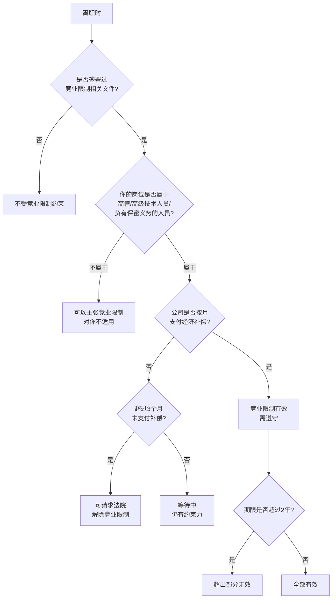

## 四、竞业限制应对技巧

竞业限制是职场人士最容易忽视、却杀伤力最大的法律约束之一。很多人在签劳动合同时对竞业限制条款不以为意，直到离职后被前雇主起诉索赔才追悔莫及——赔偿金额通常高达年薪的 2-3 倍。本节将从法律规定、条款识别、效力判断、应对策略四个维度，系统讲解如何正确认识和妥善应对竞业限制。

### 1. 竞业限制的法律基础

#### 1.1 什么是竞业限制

竞业限制（Non-Compete Agreement），是指用人单位与劳动者约定，在劳动合同解除或终止后的一定期限内，劳动者不得到与本单位生产或经营同类产品、从事同类业务的有竞争关系的其他用人单位工作，也不得自己开业生产或经营同类产品、从事同类业务。

核心法律依据为《中华人民共和国劳动合同法》第二十三条和第二十四条：

- **第二十三条**：用人单位与劳动者可以在劳动合同中约定保守用人单位的商业秘密和与知识产权相关的保密事项。对负有保密义务的劳动者，用人单位可以在劳动合同或者保密协议中与劳动者约定竞业限制条款，并约定在解除或者终止劳动合同后，在竞业限制期限内按月给予劳动者经济补偿。劳动者违反竞业限制约定的，应当按照约定向用人单位支付违约金。
- **第二十四条**：竞业限制的人员限于用人单位的高级管理人员、高级技术人员和其他负有保密义务的人员。竞业限制的范围、地域、期限由用人单位与劳动者约定，竞业限制的约定不得违反法律、法规的规定。在解除或者终止劳动合同后，前款规定的人员到与本单位生产或者经营同类产品、从事同类业务的有竞争关系的其他用人单位，或者自己开业生产或者经营同类产品、从事同类业务的竞业限制期限，不得超过二年。

#### 1.2 竞业限制的三个核心要素

| 要素 | 说明 | 法律要求 |
|------|------|----------|
| 适用主体 | 只限于高管、高级技术人员和负有保密义务的人员 | 普通员工不受竞业限制约束（但需证明自己不属于上述人员） |
| 经济补偿 | 用人单位在竞业限制期间必须按月支付补偿金 | 补偿标准：离职前12个月平均工资的30%（不低于当地最低工资标准） |
| 期限限制 | 竞业限制有最长期限限制 | 最长不得超过2年（24个月） |

#### 1.3 竞业限制与保密协议的区别

很多人将竞业限制和保密协议（NDA）混为一谈，但二者有本质区别：

| 维度 | 竞业限制 | 保密协议 |
|------|----------|----------|
| 本质 | 限制劳动者的就业自由 | 要求劳动者保守商业秘密 |
| 经济补偿 | 必须支付补偿金才有效 | 通常不需要额外补偿 |
| 期限上限 | 最长2年 | 可以是永久（商业秘密存续期间） |
| 违约后果 | 支付违约金 + 继续履行 | 赔偿损失 |
| 生效条件 | 离职后自动生效 | 签署即生效 |

关键区别：保密义务是法定义务，即使没有签订保密协议，劳动者也应当保守用人单位的商业秘密。而竞业限制必须通过书面协议约定，且用人单位必须支付经济补偿。

### 2. 识别你是否受到竞业限制约束

#### 2.1 竞业限制可能出现在哪些文件中

竞业限制条款并不一定只出现在劳动合同中，它可能隐藏在以下任何一份文件里：

1. **劳动合同**中的竞业限制条款
2. **单独的竞业限制协议**（最常见，通常在入职时签署）
3. **保密协议**中附带竞业限制条款
4. **员工手册**或**规章制度**中的竞业限制规定
5. **知识产权归属协议**中附带的竞业限制条款
6. **股权激励协议**中附带的竞业限制条款
7. **培训服务期协议**中附带的竞业限制条款

**自查清单**：入职时签署的所有文件都要仔细翻阅，特别关注以下关键词：竞业限制、竞业禁止、竞业禁止义务、竞争性就业限制、同类业务限制、同行业限制、非竞争条款。

#### 2.2 常见的竞业限制条款形式

**形式一：独立协议（最规范）**——包含完整五要素：甲乙方信息、限制范围（行业+业务类型）、限制地域、限制期限（月数）、经济补偿（金额+支付方式）、违约金。这是最规范也最容易执行的形式。

**形式二：嵌入劳动合同的条款**——在劳动合同的保密条款中附带竞业限制内容，通常表述较为简略，如"乙方同意在劳动合同终止或解除后的12个月内，不从事与甲方业务相同或类似的工作"。这种形式的问题是约定往往不够明确，容易产生争议。

**形式三：员工手册中的概括性条款**——在员工手册中规定"公司核心技术人员和管理人员须遵守竞业限制义务，具体按照双方另行签署的竞业限制协议执行"。这种条款本身不构成完整的竞业限制约定，需要配合单独签署的协议才有效力。

#### 2.3 判断竞业限制是否对你生效的快速流程

### 3. 竞业限制条款的效力判断

#### 3.1 无效竞业限制的五种情形

并非所有竞业限制条款都有效。以下五种情形下，竞业限制条款可以被认定为无效或部分无效：

**情形一：适用主体不适格**

竞业限制只能适用于三类人员：高级管理人员（总经理、副总经理、财务总监等）、高级技术人员（核心研发人员、技术总监等）、其他负有保密义务的人员（接触核心商业秘密的销售、采购等）。

如果你是一名普通行政人员、前台、普通客服，却被要求签订竞业限制协议，该协议很可能因主体不适格而无效。司法实践中，法院会审查你实际接触的商业秘密是否达到了"需要竞业限制保护"的程度。

**情形二：未约定经济补偿或未实际支付**

根据《最高人民法院关于审理劳动争议案件适用法律问题的解释（一）》第三十六条：当事人在劳动合同或者保密协议中约定了竞业限制，但未约定解除或者终止劳动合同后给予劳动者经济补偿，劳动者履行了竞业限制义务，可以要求用人单位按照劳动者在劳动合同解除或者终止前十二个月平均工资的30%按月支付经济补偿。

第三十七条进一步规定：劳动合同解除或者终止后，因用人单位的原因导致三个月未支付经济补偿，劳动者可以请求解除竞业限制约定。

也就是说：即使约定了竞业限制，如果公司连续3个月不支付补偿金，你有权向法院请求解除竞业限制。

**情形三：竞业限制范围过宽**

如果竞业限制的范围过于宽泛，例如限制你"不得从事任何行业的工作"，这种笼统的限制会被法院认定为不合理而予以限缩。

典型的不合理限制包括：
- 限制范围覆盖所有行业，而非与用人单位有竞争关系的特定行业
- 限制地域覆盖全国乃至全球，而用人单位业务仅在特定区域
- 限制期限超过2年的部分

**情形四：违约金明显过高**

如果约定的违约金远超合理范围（例如约定违约金为年薪的10倍），法院可以依据《劳动合同法》的精神和公平原则予以调整。司法实践中，违约金一般不超过补偿金总额的3-5倍。

**情形五：欺诈、胁迫签订**

如果用人单位在签订劳动合同时，以欺诈、胁迫的手段或乘人之危，使劳动者在违背真实意思的情况下签订竞业限制条款，该条款无效。

#### 3.2 竞业限制效力评估表

| 评估维度 | 有效 | 有争议 | 可能无效 |
|----------|------|--------|----------|
| 适用对象 | 高管/核心技术/掌握商业秘密 | 接触部分敏感信息的中层 | 普通员工、不接触机密 |
| 补偿金 | 按月支付，≥30%平均工资 | 约定了但低于30% | 未约定或未支付超3个月 |
| 限制范围 | 与原单位有竞争关系的特定行业 | 范围较宽但尚可解释 | 所有行业/所有企业 |
| 限制地域 | 与原单位经营区域一致 | 略大于经营区域 | 全国/全球（原单位仅区域经营） |
| 限制期限 | 12-24个月 | 刚好24个月 | 超过24个月（超出部分无效） |
| 违约金 | 与补偿金总额合理比例 | 略高但可接受 | 显著过高（10倍年薪等） |

### 4. 竞业限制的六种应对策略

#### 4.1 策略一：入职前预防——谈判竞业限制条款

最好的应对是在入职时就把竞业限制谈清楚。以下是可以谈判的关键点：

**谈判要点清单：**

1. **争取不签或缩窄范围**：如果你的岗位不属于高管或核心技术人员，可以要求删除竞业限制条款
2. **缩短限制期限**：从24个月缩短到12个月甚至6个月
3. **缩窄行业范围**：从"同行业"缩窄到"直接竞争对手"并明确列举
4. **缩窄地域范围**：从全国缩窄到你所在的城市或省份
5. **提高补偿金标准**：从30%提高到50%甚至更高
6. **降低违约金**：确保违约金在合理范围内（不超过补偿金总额的3-5倍）
7. **加入自动终止条款**：例如"公司3个月未支付补偿金，本协议自动终止"
8. **加入通知义务**：要求公司在你离职时书面通知是否启动竞业限制

**谈判话术示例：**

> "关于竞业限制条款，我理解公司保护商业秘密的需要。考虑到我的岗位职责，我建议将限制范围明确为'直接竞争对手列表中的企业'，期限调整为12个月，补偿金按月工资的50%计算。这样既保护了公司利益，也确保了条款的合理性和可执行性。"

#### 4.2 策略二：离职时确认——明确公司是否启动竞业限制

离职时，很多员工不知道公司是否会真正执行竞业限制。主动确认非常重要：

**确认流程：**

1. **书面询问**：在离职交接时，以邮件形式向HR书面确认公司是否会在离职后执行竞业限制
2. **保留证据**：保存所有沟通记录（邮件、微信截图、录音等）
3. **等待3个月**：如果公司在你离职后3个月内没有主动联系你支付补偿金，也没有书面通知你遵守竞业限制，你可以主动向法院请求确认竞业限制是否需要继续履行
4. **定期检查银行账户**：如果公司开始支付补偿金，说明竞业限制已启动

**重要提醒**：不要假设公司不会执行竞业限制就自行违反。有些公司会在你入职竞争对手数月后才提起诉讼，届时你已经投入了大量时间和精力。

#### 4.3 策略三：在职期间合理准备——建立"防火墙"

如果你预见离职后可能受到竞业限制，在职期间就要开始准备：

**准备工作清单：**

1. **明确自己的知识边界**：区分"在公司学到的技能"和"公司的商业秘密"。通用技能（编程语言、项目管理方法、行业知识）不属于商业秘密，你可以自由使用
2. **建立个人知识体系**：利用业余时间学习行业通用知识，建立不依赖于公司商业秘密的个人能力体系
3. **保存个人创作成果**：如果你在业余时间有个人项目、开源贡献、技术博客等，确保这些成果与公司业务有明确界限
4. **记录工作内容边界**：在离职前整理清楚哪些是你的个人能力，哪些是公司的商业秘密

**特别注意**：不要在在职期间复制、下载或转移公司的任何文件、代码、客户数据等。这不仅违反竞业限制，还可能构成侵犯商业秘密罪，面临刑事处罚。

#### 4.4 策略四：利用"3个月规则"解除竞业限制

这是最实用的法律策略之一。

**法律依据**：《最高人民法院关于审理劳动争议案件适用法律问题的解释（一）》第三十七条规定，用人单位在劳动合同解除或者终止后超过三个月未支付经济补偿的，劳动者可以请求人民法院解除竞业限制约定。

**操作步骤：**

1. **离职后观察3个月**：保留所有银行流水，证明公司未支付补偿金
2. **收集证据**：整理离职证明、竞业限制协议、银行流水（证明3个月无补偿金入账）
3. **向法院提起诉讼**：请求确认解除竞业限制约定
4. **等待判决**：通常1-3个月可出判决

**注意事项**：
- "3个月"是从离职之日起算，不是从公司应支付补偿金之日起算
- 即使你签了竞业限制协议，只要公司连续3个月不给钱，你就可以申请解除
- 解除后，公司如果想继续限制你，需要补足之前的补偿金并重新协商
- 如果公司后来补付了补偿金，你不能再以之前的未支付为由解除

#### 4.5 策略五：主张竞业限制条款无效

如果你确信自己的竞业限制条款存在无效情形，可以直接主张无效：

**主张路径：**

1. **收集证据**：整理劳动合同、竞业限制协议、工资单、岗位说明书等
2. **分析无效理由**：
   - 你是否属于法律规定的竞业限制适用主体？
   - 补偿金是否低于法定标准？
   - 限制范围是否过宽？
   - 签署时是否存在欺诈、胁迫？
3. **申请劳动仲裁**：向当地劳动人事争议仲裁委员会提起仲裁
4. **不服仲裁结果可提起诉讼**：对仲裁裁决不服的，可以在收到裁决书之日起15日内向法院提起诉讼

**举证要点：**

你需要证明以下事实之一：
- 你的岗位不涉及接触商业秘密（提供岗位说明书、工作内容描述）
- 公司未支付或未足额支付补偿金（提供银行流水）
- 竞业限制范围过宽（提供协议原文与公司实际业务范围的对比）
- 签署时存在胁迫（提供相关证据，如证人证言、录音等）

#### 4.6 策略六：协商变更或解除竞业限制

在很多情况下，协商是成本最低、效率最高的方式：

**协商时机：**

1. **离职时**：公司可能同意缩小范围或缩短期限，以换取你签署更严格的保密协议
2. **离职后**：如果你确实没有接触到核心商业秘密，公司可能同意解除
3. **被起诉后**：在诉讼过程中达成和解，通常比判决结果对双方都更有利

**协商筹码：**

1. 你掌握的行业知识和技能不构成商业秘密
2. 你入职的新公司与原公司没有直接竞争关系
3. 你愿意签署更严格的保密协议作为替代
4. 继续执行竞业限制对公司没有实际商业价值
5. 诉讼成本和不确定性对双方都不利

### 5. 违反竞业限制的后果与救济

#### 5.1 违反竞业限制的法律后果

如果你确实违反了有效的竞业限制条款，可能面临以下后果：

| 后果类型 | 具体内容 | 严重程度 |
|----------|----------|----------|
| 支付违约金 | 按协议约定支付违约金（通常为年薪的2-3倍） | ★★★★★ |
| 继续履行 | 被要求离开新公司，继续遵守竞业限制 | ★★★★ |
| 赔偿损失 | 赔偿原公司因你违约造成的实际损失 | ★★★★ |
| 信用记录 | 部分地区可能记入个人信用记录 | ★★★ |
| 新公司连带责任 | 新公司如果明知你有竞业限制仍录用，可能承担连带责任 | ★★★ |

#### 5.2 实际案例：竞业限制纠纷中的赔偿金额

**案例一：互联网公司技术总监跳槽案**

某互联网公司技术总监离职后加入竞争对手公司，原公司提起竞业限制违约之诉。法院认定竞业限制有效，判决该技术总监支付违约金80万元（约年薪的2倍），并要求其在竞业限制剩余期间内离开新公司。

**案例二：补偿金未足额支付，竞业限制被解除**

某公司与核心员工约定竞业限制，补偿金仅为月薪的20%（低于法定30%）。离职后公司按此标准支付了6个月。员工提起仲裁，法院认定补偿金标准低于法定最低标准，调整为30%，并要求公司补足差额。公司拒绝补足，员工再次提起仲裁请求解除竞业限制，法院支持。

**案例三：普通员工竞业限制无效**

某公司要求全体销售（包括基层销售代表）签署竞业限制协议，未额外支付补偿金。一名普通销售代表离职后加入同行业公司，原公司起诉。法院审查后认定：该销售代表仅为普通员工，不掌握核心商业秘密，竞业限制协议对其不适用，驳回公司诉求。

#### 5.3 如果已经违反了竞业限制怎么办

如果你已经违反了竞业限制条款，以下是补救措施：

1. **立即停止违反行为**：越早停止，赔偿金额越低
2. **收集有利证据**：证明你未使用原公司的商业秘密、新旧公司业务重叠程度有限等
3. **主动协商和解**：主动联系原公司，协商和解方案，通常比法院判决的赔偿金额低
4. **聘请专业律师**：劳动法专业律师可以帮你评估风险、制定应诉策略
5. **主张违约金过高**：如果约定的违约金明显过高，可以请求法院予以调减

### 6. 竞业限制与副业的关系

#### 6.1 在职期间的竞业限制

在职期间的竞业限制与离职后的竞业限制不同。在职期间，你对用人单位负有忠实义务，不得从事与本职工作有利益冲突的活动。这是法定义务，不需要单独约定。

**在职期间做副业的合规检查清单：**

- [ ] 仔细阅读劳动合同中的竞业限制条款和兼职限制条款
- [ ] 确认副业是否与主业属于同一行业
- [ ] 确认副业是否使用了公司的资源（设备、时间、信息等）
- [ ] 确认副业是否影响了主业的工作表现
- [ ] 确认公司是否有明确的副业政策（有些公司要求报备或审批）
- [ ] 确认副业的收入是否需要向公司申报

#### 6.2 离职后做副业/创业的竞业限制风险

离职后如果受到竞业限制约束，做副业或创业需要注意：

**高风险行为（必须避免）：**
- 利用原公司的客户资源开发业务
- 使用原公司的技术方案或代码
- 招募原公司的同事组建团队
- 直接与原公司的客户签约

**低风险行为（通常可以）：**
- 利用通用行业知识和技能（非商业秘密）提供服务
- 从事与原公司完全不相关的行业
- 做自由职业（非入职竞争对手）
- 从事教育培训、写作等知识分享活动

#### 6.3 竞业限制期间的"安全"收入来源

在竞业限制期间，以下收入来源通常是安全的：

| 收入类型 | 风险等级 | 说明 |
|----------|----------|------|
| 完全不相关的行业 | 低 | 例如互联网从业者做餐饮 |
| 知识付费/教育培训 | 低 | 分享通用行业知识，非商业秘密 |
| 自由职业/咨询 | 中 | 需注意不使用原公司商业秘密 |
| 投资理财 | 低 | 纯投资行为，不涉及竞业 |
| 同行业但非竞争对手 | 中 | 需确认不在竞业限制的竞争对手清单内 |
| 入职直接竞争对手 | 高 | 违反竞业限制，可能被起诉 |

### 7. 竞业限制的常见误区

#### 误区一："公司没给补偿金，竞业限制就无效"

**纠正**：公司未支付补偿金不等于竞业限制无效。只有连续3个月以上未支付，你才能向法院请求解除。在法院判决解除之前，竞业限制仍然有效。如果你擅自违反，公司补付补偿金后仍可追究你的违约责任。

#### 误区二："我是普通员工，不受竞业限制约束"

**纠正**：虽然法律规定竞业限制适用于高管、高级技术人员和负有保密义务的人员，但"负有保密义务的人员"范围较广。如果你接触了公司的客户名单、定价策略、技术方案等信息，即使你是基层员工，也可能被认定为"负有保密义务的人员"。不能仅凭岗位名称来判断。

#### 误区三："口头约定的竞业限制有效"

**纠正**：竞业限制必须采用书面形式。口头约定的竞业限制不具有法律约束力。但是，如果口头约定后双方以实际行动履行（公司支付了补偿金，你也遵守了限制），可能会被认定为事实上的竞业限制关系。

#### 误区四："签了竞业限制协议就必须遵守"

**纠正**：即使签了协议，如果存在以下情形，你不需要遵守：
- 协议存在无效情形（见第3节）
- 公司连续3个月未支付补偿金
- 双方协商解除
- 法院判决解除或认定无效

#### 误区五："竞业限制期间不能做任何工作"

**纠正**：竞业限制只限制你不得从事与原单位有竞争关系的同类业务，不限制你从事所有工作。你可以转行、做完全不相关的行业、做自由职业、甚至创业（只要不与原单位构成竞争关系）。

#### 误区六："离职时公司没提竞业限制就不生效"

**纠正**：竞业限制的效力取决于你是否签署了相关协议，而不是公司是否在离职时提醒你。很多公司不在离职时提醒，等到你入职竞争对手后才提起诉讼。这种"钓鱼执法"在法律上是被允许的。

### 8. 实操模板

#### 8.1 离职时竞业限制确认邮件模板

邮件主题行格式：**关于竞业限制义务的确认 - [您的姓名]**

邮件正文要点：

1. **开头说明离职信息**：写明本人将于[离职日期]正式离职，于[入职日期]签署了《竞业限制协议》，约定竞业限制期限为[X]个月，竞业限制范围为[简述]
2. **书面请求公司确认三个事项**：(a) 是否要求本人在离职后履行竞业限制义务？(b) 如果是，公司将在何时开始支付竞业限制补偿金？补偿金的具体金额和支付方式？(c) 如不要求履行，请书面确认并出具《竞业限制义务免除通知书》
3. **设定回复截止日期**：请于[日期]前书面回复，以便本人做好离职后的职业规划
4. **落款**：署名 + 日期

**关键提醒**：一定要用邮件发送（而非口头或微信），邮件具有法律效力上的证据价值。如果用微信沟通，请务必保留完整聊天记录截图。

#### 8.2 竞业限制合规自查表

自查表分为五个模块：

**模块一：协议审查** — 找到所有签署过的竞业限制相关文件，确认限制期限（最长24个月）、限制范围（行业、地域）、补偿金标准（≥月薪30%）、违约金金额（是否过高），确认协议签署日期和背景

**模块二：主体适格性** — 确认自己的岗位级别（高管/技术核心/普通员工），确认自己是否实际接触商业秘密，评估协议对你的适用性

**模块三：补偿金情况** — 确认公司是否按月支付补偿金，确认补偿金是否达到法定标准，如果未支付则记录已超过的月数

**模块四：风险评估** — 评估新工作/副业是否与原公司构成竞争关系，评估使用原公司商业秘密的风险，评估违反协议的潜在赔偿金额

**模块五：应对方案** — 确定是否需要与原公司协商，确定是否需要法律咨询，准备相关证据材料

### 9. 进阶：特殊场景下的竞业限制应对

#### 9.1 股权激励中的竞业限制

很多科技公司在授予股权激励（期权、RSU等）时，会附加竞业限制条款。这种竞业限制的特点是：

- 通常与股权激励协议绑定，而非劳动合同
- 违反竞业限制可能导致未归属的股权被收回
- 已归属但未行权的期权可能被取消
- 赔偿金额可能包括已获得的股权收益

**应对策略**：在签署股权激励协议时，特别关注竞业限制条款的范围和期限。如果条款过于苛刻，可以要求缩小范围或缩短期限。离职时，确认竞业限制是否影响已归属的股权。

#### 9.2 高管的竞业限制

高管（CEO、CTO、CFO等）面临的竞业限制通常更为严格：

- 限制范围更广（可能覆盖整个行业）
- 补偿金更高（通常不低于年薪的50%）
- 违约金更高（可能达到年薪的5-10倍）
- 可能附带禁止招揽员工和客户的条款

**应对策略**：高管在离职前应提前6-12个月开始规划，与公司协商竞业限制的解除或变更，评估转行或休息一段时间的可行性。

#### 9.3 跨国竞业限制

如果你在外资企业工作，竞业限制可能涉及多个国家的法律。需要注意：

- 不同国家对竞业限制的法律态度不同（美国部分州禁止或严格限制竞业限制）
- 中国法律只在中国境内适用
- 如果竞业限制协议约定适用外国法律，需要评估其在中国的可执行性
- 跨国公司的竞业限制通常需要在中国重新签署符合中国法律的版本

#### 9.4 竞业限制期间的创业

如果你想在竞业限制期间创业，以下是降低风险的方法：

1. **选择不相关的行业**：确保创业方向与原公司业务没有竞争关系
2. **不使用原公司的资源**：包括技术、客户、供应商、员工等
3. **保留完整的创业证据链**：证明你的商业模式是独立开发的
4. **咨询律师评估风险**：在创业前请专业律师审查你的竞业限制协议
5. **考虑以投资而非经营的方式参与**：投资一家不相关的公司，不做日常经营

### 10. 本节总结

竞业限制是一把双刃剑——它保护了用人单位的商业秘密和竞争优势，但也限制了劳动者的就业自由。正确应对竞业限制的核心原则是：

1. **预防为主**：入职前认真审查和谈判竞业限制条款
2. **知己知彼**：清楚了解自己的权利和义务
3. **保留证据**：所有沟通和签署的文件都要妥善保存
4. **善用法律**：利用"3个月规则"等法律工具保护自身权益
5. **专业支持**：遇到纠纷及时咨询专业劳动法律师
6. **灵活应对**：根据具体情况选择协商、诉讼或转行等不同策略

**记住：不要因为恐惧竞业限制而放弃职业发展，也不要因为忽视竞业限制而承担不必要的法律风险。理性评估、合规应对，才是最优解。**
