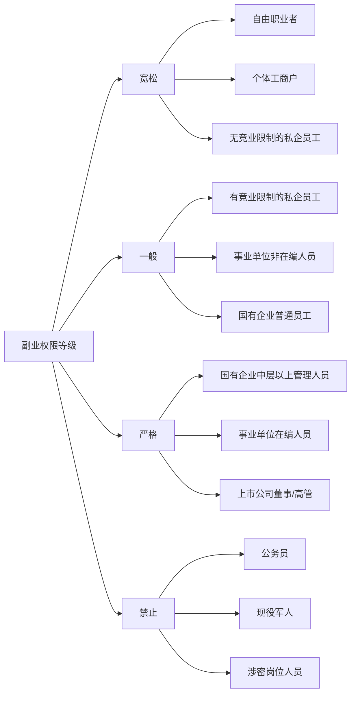
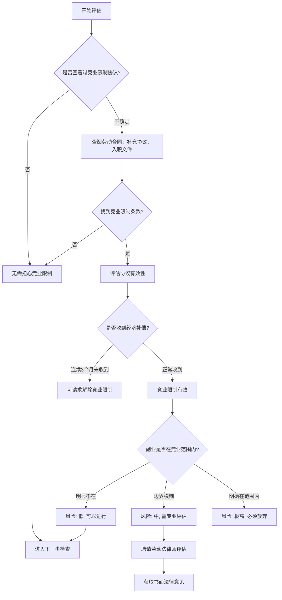
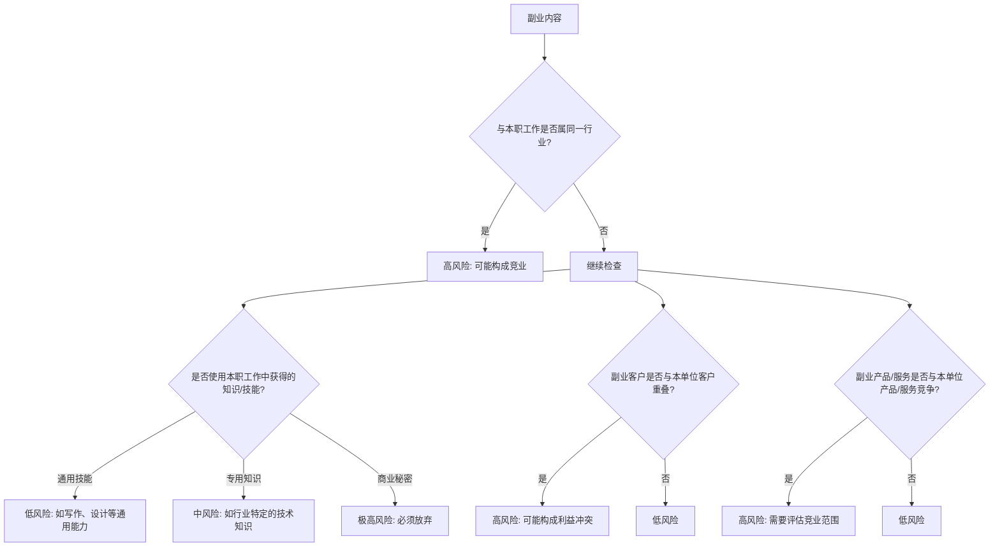

## 五、副业合规技巧

副业是当代职场人增加收入、分散风险的重要手段。然而，副业并非"想做就做"——它涉及劳动法、合同法、竞业限制、税务、知识产权等多个法律领域。一旦合规处理不当，轻则被单位约谈、扣发奖金，重则被解除劳动合同、承担违约赔偿甚至刑事责任。

本节从法律基础出发，系统讲解副业合规的完整知识体系，提供可落地的操作框架，帮助你在合法合规的前提下开展副业。

### 5.1 副业合规的法律基础

#### 5.1.1 核心法律依据

副业合规涉及的法律法规主要包括以下几部：

| 法律法规 | 相关条款 | 核心要点 |
|---------|---------|---------|
| 《劳动合同法》 | 第39条 | 劳动者同时与其他用人单位建立劳动关系，对完成本单位工作任务造成严重影响，或经用人单位提出拒不改正的，用人单位可以解除劳动合同 |
| 《劳动合同法》 | 第23-24条 | 竞业限制的范围、地域、期限由用人单位与劳动者约定，期限不得超过2年 |
| 《公司法》 | 第148条 | 董事、高级管理人员不得违反公司章程或未经股东会同意，与本公司订立合同或进行交易；不得未经股东会同意自营或为他人经营与所任职公司同类的业务 |
| 《公务员法》 | 第59条 | 公务员不得违反有关规定从事或参与营利性活动 |
| 《反不正当竞争法》 | 第9条 | 经营者不得以盗窃、贿赂、欺诈、胁迫、电子侵入或其他不正当手段获取权利人的商业秘密 |
| 《个人所得税法》 | 第2条 | 劳务报酬所得、经营所得等需依法纳税 |

#### 5.1.2 劳动者的副业权利边界

很多人不知道，中国法律并没有禁止劳动者从事副业。《劳动合同法》第39条的措辞是"造成严重影响"或"经提出拒不改正"——这意味着：

- **一般情况下，副业是合法的**：法律不禁止劳动者在工作时间外从事合法的兼职活动
- **限制是条件性的**：只有在副业对本职工作造成"严重影响"，或单位明确提出反对而劳动者拒绝改正时，单位才能解除劳动合同
- **举证责任在单位**：如果单位以副业为由解除劳动合同，需要举证证明副业确实造成了严重影响

但这并不意味着可以随意开展副业。以下情形属于高风险：

1. 劳动合同明确禁止兼职
2. 存在有效的竞业限制协议
3. 属于公务员或事业单位在编人员
4. 副业涉及本单位商业秘密
5. 利用本单位资源（设备、信息、客户资源）开展副业

#### 5.1.3 不同身份的副业权限差异

不同职业身份在副业方面的法律约束差异很大：



### 5.2 副业合规性五步检查法

开展任何副业之前，必须完成以下五步合规检查。这个流程是系统性的，跳过任何一步都可能埋下隐患。

#### 5.2.1 第一步：劳动合同审查

**为什么这是第一步？** 劳动合同是你与用人单位之间最直接的法律约束。合同中的兼职条款直接决定了你能否开展副业。

**审查要点：**

**1）明确禁止条款**

部分劳动合同会直接写明"禁止兼职"或"不得从事与本职工作无关的营利性活动"。如果合同中有此类条款，你签署后即受约束。

- **法律效力**：此类条款一般有效，法院通常尊重当事人的合同约定
- **应对策略**：与HR协商删除或修改该条款；或在续签时提出
- **风险评估**：即使合同禁止，如果单位从未执行过该条款（其他同事也在做副业），则该条款的实际约束力可能较弱，但仍不建议主动违反

**2）未提及兼职**

如果合同中没有关于兼职的条款，根据"法无禁止即自由"的原则，你有权从事副业，但仍需遵守竞业限制、保密义务等其他法定义务。

**3）附条件允许**

部分合同允许兼职但附加条件，例如：
- "需提前书面报备"
- "不得影响本职工作"
- "不得在工作时间从事"

此类条款需要严格遵守，否则单位有权以违反合同为由采取措施。

**审查清单：**

- [ ] 找到劳动合同原件，逐条阅读"工作纪律""保密义务""竞业限制"等章节
- [ ] 确认合同中是否有明确的兼职禁止或限制条款
- [ ] 确认是否有补充协议或员工手册中的相关规定
- [ ] 如有疑问，标记并咨询专业人士
- [ ] 将审查结果记录存档

#### 5.2.2 第二步：竞业限制评估

**竞业限制与副业的关系：** 竞业限制是副业合规中最高风险的领域。违反竞业限制可能导致高额赔偿。

**竞业限制的法律要件：**

| 要件 | 要求 | 说明 |
|-----|------|------|
| 适用对象 | 高级管理人员、高级技术人员、其他负有保密义务的人员 | 普通员工签订的竞业限制条款可能无效 |
| 经济补偿 | 用人单位需按月支付经济补偿 | 补偿标准：不低于离职前12个月平均工资的30%，且不低于当地最低工资标准 |
| 期限限制 | 最长不超过2年 | 超过2年的部分无效 |
| 范围限制 | 需明确竞业范围、地域、期限 | 范围过宽可请求法院调整 |
| 形式要求 | 需以书面形式约定 | 口头约定一般不具有竞业限制效力 |

**竞业限制评估流程：**



**竞业限制的关键判例参考：**

- **补偿金未支付的后果**：根据最高人民法院相关司法解释，用人单位3个月未支付竞业限制补偿金的，劳动者可请求解除竞业限制约定
- **竞业范围过宽的调整**：法院有权对竞业限制的范围、地域、期限进行合理性审查，对明显不合理的条款予以调整
- **在职期间的竞业限制**：在职期间的竞业限制义务是劳动者的法定义务，无需额外约定即需遵守

#### 5.2.3 第三步：资源使用审查

**核心原则：开展副业不得使用本单位的任何资源。**

这里的"资源"包括有形资源和无形资源：

**有形资源（容易界定）：**
- 办公设备：电脑、打印机、电话、办公用品
- 办公场所：不得在办公室从事副业活动
- 交通工具：不得使用单位车辆办理副业事务
- 通信工具：不得使用单位配发的手机号、邮箱处理副业业务

**无形资源（容易忽视但风险更大）：**
- 客户资源：不得将本单位客户转化为副业客户
- 供应商资源：不得利用本单位供应商渠道获取优惠
- 信息资源：不得利用在工作中获取的市场信息、技术信息
- 人力资源：不得利用本单位同事的劳动力（如让同事帮忙完成副业任务）
- 品牌资源：不得利用本单位的名义或品牌影响力

**实操建议：**

1. **设备隔离**：为副业配备独立的电脑、手机、电话号码
2. **时间隔离**：严格在非工作时间从事副业，不占用工作时间的任何碎片时间
3. **空间隔离**：不在办公场所从事副业，不在单位电脑上登录副业相关账号
4. **信息隔离**：不将本单位的任何文件、数据、信息用于副业
5. **社交隔离**：不在本单位的工作群、朋友圈宣传副业

#### 5.2.4 第四步：时间冲突评估

**工作时间的界定：**

| 类型 | 是否属于工作时间 | 副业风险 |
|-----|-----------------|---------|
| 标准工作时间（9:00-18:00） | 是 | 高风险 |
| 加班时间 | 是 | 高风险 |
| 午休时间 | 争议区域 | 中风险 |
| 下班后 | 否 | 低风险 |
| 周末（非加班日） | 否 | 低风险 |
| 法定节假日 | 否 | 低风险 |
| 年假/事假/病假 | 否 | 低风险（但病假期间从事副业可能被质疑） |

**特别注意：**

- **弹性工作制**：即使实行弹性工作制，也需确保副业不影响工作质量和响应速度
- **远程办公**：远程办公期间更难界定工作时间，建议设置明确的时间边界，例如固定时段处理副业
- **待命状态**：如果岗位要求随时待命（如运维、客服），则副业不得影响待命响应

#### 5.2.5 第五步：内容冲突检查

**核心问题：副业的内容是否与本职工作存在利益冲突？**

利益冲突的判断标准：



**常见误判：**

- ❌ "我做副业用的是自己的技能，不是单位的" → 如果该技能是在本职工作中专项培养的、具有行业特殊性的技能，仍可能构成冲突
- ❌ "我只在下班时间做副业" → 时间不是唯一判断标准，内容冲突才是核心
- ❌ "我的副业和公司业务完全不同" → 需要具体分析，不能仅凭主观判断

### 5.3 常见副业类型合规分析

不同类型的副业面临的合规风险差异很大。以下对常见副业类型进行系统分析。

#### 5.3.1 自媒体创作

**合规评级：一般合规（需注意内容边界）**

自媒体创作是目前最常见的副业形式之一，包括公众号写作、短视频制作、知识分享等。

**主要风险点：**

| 风险类型 | 具体表现 | 风险等级 | 防范措施 |
|---------|---------|---------|---------|
| 内容泄密 | 分享行业洞察时无意泄露本单位商业信息 | 高 | 内容发布前进行脱敏审查 |
| 时间占用 | 创作和运营占用工作时间 | 高 | 严格在非工作时间进行 |
| 资源使用 | 使用单位设备拍摄、编辑内容 | 中 | 使用个人设备 |
| 身份关联 | 以本单位员工身份进行宣传引流 | 中 | 不提及本职工作单位 |
| 知识产权 | 副业内容与本职工作成果存在知识产权争议 | 中 | 确保副业内容为独立创作 |

**合规操作指南：**

1. 内容发布前自查：是否涉及本单位的商业信息、技术方案、客户案例？
2. 不在个人简介中提及本职工作单位（除非单位明确允许）
3. 不在工作时间创作和发布内容
4. 不使用单位设备拍摄素材或编辑内容
5. 如分享行业知识，确保是公开可获取的信息，而非内部信息

#### 5.3.2 知识付费与在线教育

**合规评级：一般合规（需特别注意知识产权）**

包括在线课程制作、付费咨询、一对一辅导、社群运营等。

**核心风险分析：**

- **知识产权风险（最高风险）**：如果你在本职工作中积累的专业知识、方法论、案例库被直接用于知识付费产品，可能构成知识产权纠纷。特别是当你的劳动合同中有"工作成果归单位所有"的条款时
- **竞业风险**：如果你教授的内容与本单位的培训业务、咨询服务存在竞争关系
- **客户转化风险**：将本单位的客户或学员转化为个人知识付费产品的用户

**合规操作要点：**

1. 知识付费产品应基于通用知识和公开信息，而非本单位的专有方法论
2. 不使用本单位的案例（除非已脱敏且获得授权）
3. 不在本单位的客户群体中推广个人知识付费产品
4. 课程内容应有明确的差异化，避免与本单位业务直接竞争
5. 保留课程内容的独立创作证据（草稿、创作时间记录等）

#### 5.3.3 电商经营

**合规评级：一般合规（需注意经营范围冲突）**

包括开网店、代购、社交电商、直播带货等。

**风险矩阵：**

| 经营类型 | 与本职冲突风险 | 税务风险 | 合规难度 |
|---------|--------------|---------|---------|
| 与本职无关的商品销售 | 低 | 中 | 低 |
| 与本职相关但非竞争商品 | 中 | 中 | 中 |
| 与本职同类商品销售 | 高 | 中 | 高 |
| 代理本单位竞争对手产品 | 极高 | 中 | 极高 |

**合规操作要点：**

1. 选择与本职工作完全不同的经营领域
2. 依法办理营业执照和税务登记
3. 不利用本单位的供应商资源获取低价货源
4. 不在本单位的客户群中推广个人店铺
5. 确保经营时间不影响本职工作

#### 5.3.4 兼职技术/专业服务

**合规评级：需要谨慎评估（竞业和知识产权风险较高）**

包括兼职开发、设计外包、咨询顾问、培训讲师等。

**为什么风险较高：** 这类副业直接使用你的专业技能，而这些技能往往与本职工作高度重叠。单位可能主张你在副业中使用了在本职工作中积累的专有知识。

**合规操作要点：**

1. 仔细审查竞业限制协议，确认服务范围不在竞业限制范围内
2. 不使用本单位的技术框架、代码库、设计模板
3. 不在副业项目中使用本单位的开发环境或测试环境
4. 确保副业项目的客户与本单位客户无重叠
5. 保留独立完成副业工作的证据（个人设备的开发记录、独立的设计稿等）

#### 5.3.5 投资与理财

**合规评级：一般合规（特定行业有额外限制）**

包括股票投资、基金定投、房产投资、股权投资等。

**特殊限制：**

- **证券行业从业者**：受《证券法》约束，本人及家属的证券交易需报备，不得利用内幕信息交易
- **银行从业者**：不得参与民间借贷，不得为配偶、子女的营利性经营活动提供便利
- **国有企业员工**：不得违规经商办企业，不得违规持有非上市公司股份
- **公务员**：不得违规从事营利性活动，不得违规兼职取酬

#### 5.3.6 内容创作与IP变现

**合规评级：一般合规（需注意知识产权归属）**

包括写作出书、音乐创作、艺术创作、IP授权等。

**关键问题：副业创作的IP归谁？**

这是内容创作类副业最容易被忽视的问题。判断标准：

1. **创作时间**：是否在工作时间创作？
2. **创作工具**：是否使用单位设备？
3. **内容关联**：是否与本职工作内容相关？
4. **合同约定**：劳动合同中是否有知识产权归属条款？

如果以上四个条件中多个为"是"，单位可能主张该知识产权归单位所有。

### 5.4 风险防范体系

#### 5.4.1 事前防范

**1）了解单位的副业政策**

不要假设"没说就是可以"。主动了解以下信息：

- 劳动合同中的相关条款
- 员工手册中的兼职规定
- 公司内部的规章制度
- 行业监管的特殊要求
- 同事中是否有副业先例及单位态度

**2）建立合规档案**

为副业建立专门的合规档案，包括：

```text
副业合规档案/
├── 劳动合同审查记录.txt
├── 竞业限制评估报告.txt
├── 副业方案说明.txt
├── 时间安排计划.txt
├── 设备清单（个人设备）.txt
├── 合规自查记录/
│   ├── 每月合规自查表.txt
│   └── 风险事件记录.txt
└── 法律咨询记录/
    └── 律师意见书.txt
```

**3）设备和账号隔离**

为副业建立完全独立的数字环境：

- 独立的电脑或手机
- 独立的邮箱地址
- 独立的社交账号
- 独立的支付账户
- 独立的云存储空间
- 独立的开发环境（如适用）

#### 5.4.2 事中控制

**1）定期合规自查**

建议每月进行一次合规自查，检查以下事项：

- [ ] 本月是否在工作时间从事过副业活动？
- [ ] 本月是否使用过单位设备处理副业事务？
- [ ] 本月副业内容是否涉及本单位商业信息？
- [ ] 本月副业收入是否依法申报纳税？
- [ ] 本月是否有新的合规风险出现？
- [ ] 本月副业是否影响了本职工作质量？

**2）信息隔离执行**

在日常工作中严格执行信息隔离：

- 不在单位设备上登录任何副业相关账号
- 不在单位场所讨论副业事务
- 不在单位的社交媒体群组中提及副业
- 不将本单位的工作成果用于副业
- 不在副业中使用本单位的客户信息

#### 5.4.3 事后应对

**如果被单位发现或质疑副业，应如何应对？**

**阶段一：冷静评估**

1. 不要惊慌，不要立即承认或否认
2. 评估单位掌握的信息范围
3. 回顾自己的副业是否确实存在合规问题
4. 收集和整理自己合规经营的证据

**阶段二：积极沟通**

1. 主动与直属上级或HR沟通，态度诚恳
2. 说明副业的性质、内容、时间安排
3. 强调副业不影响本职工作质量和效率
4. 提供合规经营的证据（时间记录、设备证明等）
5. 表达愿意配合单位的合理要求

**阶段三：法律应对**

如果沟通无法解决，或单位采取过激措施：

1. 咨询劳动法律师，评估自己的法律地位
2. 收集单位处理不当的证据
3. 如单位违法解除劳动合同，可申请劳动仲裁
4. 保留所有书面沟通记录

### 5.5 税务合规

副业收入的税务处理是很多人的盲区。不合规的税务处理可能带来严重的法律后果。

#### 5.5.1 副业收入的纳税义务

**所有副业收入都必须依法纳税。** 这不是可选项，而是法定义务。

副业收入的类型和税率：

| 收入类型 | 适用税目 | 税率 | 预扣预缴 | 年度汇算 |
|---------|---------|------|---------|---------|
| 兼职薪金 | 工资薪金所得 | 3%-45%超额累进 | 按月预扣 | 并入综合所得汇算 |
| 劳务报酬 | 劳务报酬所得 | 20%-40% | 按次预扣 | 并入综合所得汇算 |
| 稿酬 | 稿酬所得 | 20%（减征30%） | 按次预扣 | 并入综合所得汇算 |
| 经营所得 | 经营所得 | 5%-35%超额累进 | 按季预缴 | 单独汇算 |
| 股息红利 | 利息股息红利所得 | 20% | 按次代扣 | 不并入综合所得 |

#### 5.5.2 税务合规实操

**1）个人劳务报酬的处理**

如果你以个人身份提供劳务（如兼职设计、咨询），对方通常会要求你提供发票。

开票方式：
- 去税务局代开发票（每次需跑税务局）
- 注册个体工商户自行开票（适合长期副业）
- 通过正规的灵活用工平台（平台代扣代缴）

**2）个体工商户的税务优势**

如果副业收入稳定且金额较大，建议注册个体工商户：

- 可以自行开具发票
- 可享受小规模纳税人优惠政策（月销售额10万以下免征增值税）
- 经营所得适用5%-35%的超额累进税率
- 可以扣除经营相关的成本费用

**3）年度汇算清缴**

每年3月1日至6月30日需要进行个人所得税年度汇算清缴。副业收入需要在汇算时如实申报，多退少补。

### 5.6 与单位沟通的策略

#### 5.6.1 是否需要告知单位？

**法律层面：** 除特殊岗位外，法律没有强制要求劳动者告知单位自己的副业情况。

**实务层面：** 是否告知取决于以下因素：

| 因素 | 建议告知 | 可以不告知 |
|-----|---------|-----------|
| 合同要求 | 合同约定需报备 | 合同未提及 |
| 单位文化 | 单位对副业持开放态度 | 单位对副业持保守态度 |
| 副业性质 | 副业与本职有一定关联 | 副业与本职完全无关 |
| 风险程度 | 存在潜在的利益冲突 | 无任何利益冲突 |
| 信任关系 | 与上级关系良好 | 与上级关系一般 |

#### 5.6.2 沟通技巧

如果决定告知单位，建议采取以下策略：

**1）选择合适的时机**
- 在绩效评估后的积极沟通中提及
- 不要在工作繁忙或单位气氛紧张时提出

**2）强调正面价值**
- "我在业余时间学习了XX技能，对本职工作也有帮助"
- "我的副业经验可以为公司带来新的视角"

**3）主动承诺不影响工作**
- "我严格在下班后和周末进行，不会影响工作效率"
- "如果有任何冲突，我会优先保证本职工作"

**4）书面记录**
- 如单位口头同意，建议通过邮件确认
- 保留沟通记录作为证据

### 5.7 副业合规评分矩阵

以下评分矩阵帮助你系统评估副业的整体合规风险。对每一项进行评分（1-5分，1为最低风险，5为最高风险），然后计算总分。

| 评估维度 | 1分（低风险） | 3分（中风险） | 5分（高风险） |
|---------|-------------|-------------|-------------|
| 劳动合同 | 合同未提及或允许 | 合同有条件限制 | 合同明确禁止 |
| 竞业限制 | 无竞业限制 | 有竞业限制但副业不在范围 | 副业在竞业范围内 |
| 资源使用 | 完全使用个人资源 | 偶尔使用单位资源 | 大量使用单位资源 |
| 时间冲突 | 完全在业余时间 | 偶尔占用碎片时间 | 经常占用工作时间 |
| 内容冲突 | 与本职完全无关 | 有一定关联但不竞争 | 直接竞争关系 |
| 税务合规 | 完全依法纳税 | 基本合规有遗漏 | 完全不处理税务 |
| 信息隔离 | 完全隔离 | 基本隔离有疏漏 | 信息混用 |

**评分解读：**
- **7-14分**：低风险，可以正常开展
- **15-21分**：中风险，需要加强合规措施
- **22-28分**：高风险，建议暂缓并整改
- **29-35分**：极高风险，强烈建议放弃或重新规划

### 5.8 典型案例分析

#### 案例一：自媒体创作被解除劳动合同

**案情：** 某互联网公司产品经理在工作之余运营科技类公众号，积累了数万粉丝。公司以其"利用工作时间从事副业"为由解除劳动合同。

**争议焦点：** 公司是否能证明员工在工作时间从事副业？

**裁判结果：** 法院认为公司未能提供充分证据证明员工在工作时间从事公众号运营，判定公司违法解除劳动合同，支付赔偿金。

**启示：** 只要能证明副业完全在业余时间进行，单位以"工作时间做副业"为由解除合同的主张很难成立。

#### 案例二：竞业限制下的副业纠纷

**案情：** 某科技公司高级工程师离职后，在竞业限制期间为竞争对手提供技术咨询服务。原公司发现后提起仲裁。

**争议焦点：** 技术咨询是否属于竞业限制范围？

**裁判结果：** 仲裁庭认定技术咨询服务属于竞业限制协议约定的范围，裁决该工程师支付违约金50万元。

**启示：** 竞业限制期间，任何形式的为竞争对手提供服务（包括咨询、培训、兼职）都可能构成违约。

#### 案例三：知识付费产品知识产权争议

**案情：** 某培训机构讲师在任职期间，将机构的课程体系稍作修改后以个人名义在网上销售。机构发现后提起诉讼。

**争议焦点：** 课程内容的知识产权归属。

**裁判结果：** 法院认定该讲师在任职期间创作的课程内容属于职务作品，知识产权归机构所有，判令讲师停止销售并赔偿损失。

**启示：** 在职期间创作的与工作相关的内容，知识产权可能归单位所有。知识付费产品应基于通用知识，而非单位的专有方法论。

#### 案例四：电商副业的税务处罚

**案情：** 某公司职员在业余时间经营淘宝店铺，年销售额超过200万元，但未办理营业执照，也未申报纳税。被税务机关查处。

**处理结果：** 税务机关追缴税款、滞纳金，并处以罚款，合计超过30万元。

**启示：** 电商副业达到一定规模后必须依法办理营业执照和税务登记。个体工商户月销售额10万以下免征增值税，但需要办理登记并如实申报。

### 5.9 进阶策略

#### 5.9.1 从副业到事业的合规过渡

当副业收入稳定且超过本职工作收入时，可以考虑从副业过渡到独立事业。过渡期间的合规要点：

**过渡准备期（3-6个月）：**
1. 注册个体工商户或公司
2. 开设对公银行账户
3. 建立独立的财务体系
4. 逐步减少本职工作投入（在不影响本职的前提下）
5. 积累足够的客户和收入基础

**离职过渡期：**
1. 审查劳动合同中的离职条款（通知期、交接期）
2. 确认竞业限制的范围和期限
3. 与单位妥善协商离职事宜
4. 确保离职后的副业/创业不违反竞业限制

**离职后合规：**
1. 如有竞业限制，严格遵守限制范围和期限
2. 不利用原单位的商业秘密和客户资源
3. 保留离职交接的完整记录
4. 按时领取竞业限制补偿金（如适用）

#### 5.9.2 副业的公司化运营

当副业发展到一定规模，建议进行公司化运营：

**公司化的好处：**
- 法律主体明确，责任边界清晰
- 可以开具正规发票，便于业务拓展
- 享受小规模纳税人优惠政策
- 资产和债务与个人隔离
- 便于融资和扩大规模

**公司类型选择：**

| 类型 | 适用场景 | 注册资本 | 税负 | 责任 |
|-----|---------|---------|------|------|
| 个体工商户 | 小规模副业 | 无要求 | 较低 | 无限责任 |
| 个人独资企业 | 单人经营 | 无要求 | 较低 | 无限责任 |
| 有限责任公司 | 规模化经营 | 认缴制 | 一般 | 有限责任 |
| 合伙企业 | 多人合作 | 无要求 | 穿透纳税 | 普通合伙人无限责任 |

#### 5.9.3 副业合规的长期维护

副业合规不是一次性的工作，而是需要持续维护的体系：

**季度审查：**
- 审查劳动合同是否有变更
- 评估副业与本职工作的关系是否发生变化
- 检查税务申报是否完整
- 更新合规档案

**年度评估：**
- 重新评估副业的整体合规风险
- 审视副业的发展方向是否需要调整
- 咨询律师进行年度合规体检
- 根据法律法规变化调整合规策略

**触发式审查（以下情况发生时立即审查）：**
- 本职工作发生变动（升职、调岗、换部门）
- 单位规章制度发生变化
- 副业性质或规模发生重大变化
- 相关法律法规发生变化
- 收到单位的任何书面通知

### 5.10 常见误区与纠正

| 误区 | 真实情况 | 正确做法 |
|-----|---------|---------|
| "下班后做副业完全没问题" | 如果内容与本职存在利益冲突，即使在下班后也可能违规 | 时间合规只是条件之一，内容合规更重要 |
| "合同没写就可以随便做" | 即使合同未提及，法定义务（如竞业限制、保密义务）仍然存在 | 全面评估法律风险，而非仅看合同 |
| "小规模副业不用交税" | 所有收入都需依法纳税，只是部分情况可享受减免 | 如实申报，利用合法的税收优惠政策 |
| "兼职不会被发现就没问题" | 一旦被发现，之前的违规行为都会被追究 | 合规经营，不留隐患 |
| "离职后就可以自由做副业了" | 离职后仍受竞业限制约束（如有） | 确认竞业限制状态后再开展相关副业 |
| "朋友介绍的副业不会有问题" | 副业来源不影响合规性判断 | 独立评估合规风险 |
| "网上卖东西不算副业" | 电商经营属于经营行为，需要合规处理 | 达到一定规模需办理营业执照和税务登记 |
| "用自己的技能不算用单位资源" | 在本职工作中专项培养的技能可能被视为单位资源 | 区分通用技能和专用技能，避免使用专用知识 |

副业合规的核心逻辑可以用一句话概括：**在不影响本职工作、不违反合同约定、不侵犯单位权益、不逃避纳税义务的前提下，劳动者有权在业余时间从事合法的副业活动。** 理解并践行这个原则，就能在副业道路上走得稳、走得远。
