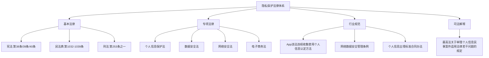
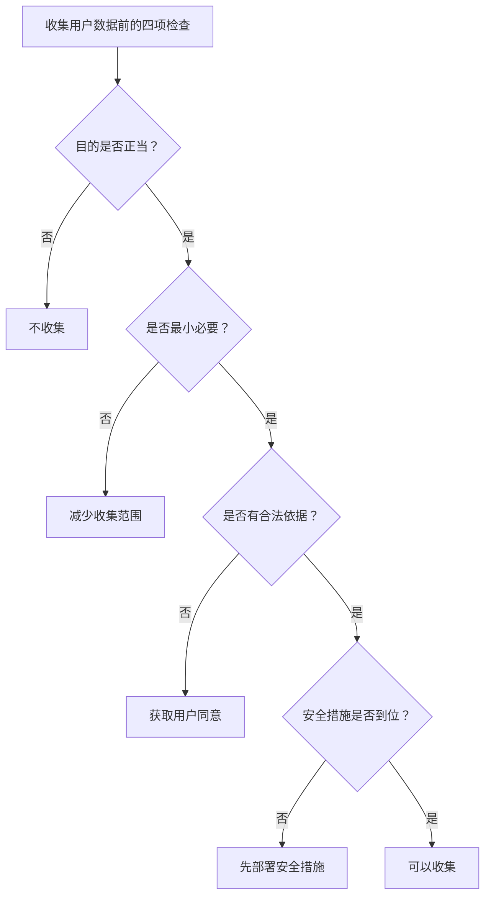

## 六、隐私保护技巧

隐私保护不是道德倡议，而是法律义务和商业竞争力。在数字经济时代，谁掌握了隐私保护的正确方法，谁就掌握了用户信任的基石。一次数据泄露可以让一家公司直接倒闭（参见案例六"数据泄露事件"，直接损失超5300万元），而良好的隐私保护能力则是获取用户、赢得市场的隐性护城河。

本节从三个维度系统讲解隐私保护的实操技巧：**保护自己**（个人信息不被滥用）、**保护客户**（业务合规运营）、**保护资产**（财务和商业秘密安全）。

---

### 6.1 隐私保护的法律框架

在讨论技巧之前，必须先理解法律红线在哪里。隐私保护涉及的法律法规构成一个多层级体系：



#### 6.1.1 《个人信息保护法》核心要点

《个人信息保护法》（2021年11月1日施行）是隐私保护的基本法，以下是与"搞钱"直接相关的核心条款：

| 条款 | 内容要点 | 实操影响 |
|------|----------|----------|
| 第13条 | 处理个人信息的合法性基础（同意、合同、法定义务等6种） | 收集用户信息必须有合法依据，不能"想要就要" |
| 第14条 | 同意应当在充分知情的前提下自愿、明确作出 | 不能用"一揽子同意"捆绑授权 |
| 第17条 | 个人信息处理规则应公开、透明 | 必须有清晰的隐私政策 |
| 第28条 | 敏感个人信息的处理需取得单独同意 | 生物识别、金融账户、行踪轨迹等需额外授权 |
| 第44-49条 | 个人信息主体的知情权、决定权、查阅复制权、更正权、删除权 | 用户有权要求你删除其数据 |
| 第55条 | 处理敏感信息前需进行个人信息保护影响评估 | 涉及敏感数据的业务必须做PIPIA |
| 第57条 | 发生泄露时的通知义务（72小时内） | 出了事必须及时报告和通知 |
| 第66条 | 违法处罚：最高5000万元或上年度营业额5% | 违法成本极高 |

#### 6.1.2 个人信息的法律定义

很多人对"个人信息"的理解过于狭隘。根据《个保法》第四条：

> 个人信息是以电子或者其他方式记录的与已识别或者可识别的自然人有关的各种信息，不包括匿名化处理后的信息。

**关键概念辨析**：

| 概念 | 定义 | 示例 | 处理要求 |
|------|------|------|----------|
| 个人信息 | 能单独或结合识别特定个人的信息 | 姓名、手机号、身份证号、IP地址、设备ID | 需要合法性基础 |
| 敏感个人信息 | 泄露后容易导致人格尊严受侵害或人身财产安全受危害的信息 | 生物识别、宗教信仰、医疗健康、金融账户、行踪轨迹、不满14周岁未成年人信息 | 需单独同意+影响评估 |
| 匿名化 | 经处理后无法识别特定个人且不能复原 | 统计报告中的聚合数据 | 不属于个人信息，可自由使用 |
| 去标识化 | 经处理后不经额外信息不能识别特定个人 | 用假名替代真名的数据集 | 仍属于个人信息，需保护 |

**实操要点**：IP地址、Cookie、设备指纹、浏览记录这些"看似不是个人信息"的数据，在结合其他信息后完全可以识别特定个人，因此同样受法律保护。

---

### 6.2 保护自己：个人隐私防护技巧

#### 6.2.1 信息最小化原则

信息最小化是隐私保护的黄金法则：只提供完成目的所必需的最少信息。

**日常场景应用**：

| 场景 | 常见错误做法 | 正确做法 |
|------|-------------|----------|
| 注册网站 | 使用真实姓名+手机号+身份证 | 仅填写必要字段；用虚拟号码注册非重要平台 |
| 快递收件 | 使用真实全名+详细地址 | 使用化名（如"张先"代替"张先生"）+快递驿站地址 |
| 问卷调查 | 如实填写所有个人信息 | 只填必填项，选填项留空或使用模糊信息 |
| WiFi连接 | 自动连接任何可用WiFi | 关闭自动连接，不使用公共WiFi处理敏感操作 |
| App权限 | 默认授予所有权限 | 仅授予必要权限，关闭通讯录/位置等非必要权限 |

#### 6.2.2 手机号隔离策略

手机号是数字身份的核心枢纽，一旦泄露会引发连锁反应。推荐建立三级手机号体系：

```text
手机号分级管理：
├── 第一级：核心号码（1个）
│   ├── 用途：银行、社保、公积金、主社交账号
│   ├── 特点：永不公开，不用于注册任何商业服务
│   └── 保护：设置SIM卡PIN码，开启运营商二次验证
│
├── 第二级：常用号码（1-2个）
│   ├── 用途：常用App、外卖、电商、工作邮箱
│   ├── 特点：仅用于正规大平台
│   └── 保护：定期检查账号关联，清理不再使用的服务
│
└── 第三级：临时号码（若干）
    ├── 用途：一次性注册、不信任的平台、临时需求
    ├── 特点：用完即弃，不关联任何重要信息
    └── 工具：虚拟号码服务（如TextNow、Google Voice）或副卡
```

#### 6.2.3 密码管理实战

密码是最基础也是最脆弱的安全防线。以下是经过验证的密码管理方案：

**密码强度标准**：

| 安全等级 | 密码要求 | 示例 | 可抵抗的攻击 |
|----------|----------|------|-------------|
| 低（不推荐） | 6位纯数字 | 123456 | 无 |
| 中 | 8位字母+数字 | Abc12345 | 普通暴力破解（数小时） |
| 高 | 12位混合字符 | Kj#9mP$2xL!n | 高级暴力破解（数年） |
| 极高 | 16位以上随机 | 用密码管理器生成 | 量子计算前安全 |

**推荐方案：密码管理器 + 主密码**

```text
密码管理架构：
主密码（唯一需要记忆的）
    ├── 规则：20位以上，由4-5个不相关词语组成
    ├── 示例："咖啡月亮铁轨蜻蜓风暴" → "咖啡月亮铁轨蜻蜓风暴2024!"
    └── 存储：仅存在于大脑中，不写在任何电子设备上
         ↓
密码管理器（Bitwarden/KeePass/1Password）
    ├── 所有账号使用自动生成的随机密码（20位以上）
    ├── 每个账号独立密码，绝不复用
    ├── 数据库文件本地加密存储
    └── 定期备份加密数据库到安全位置
```

**绝对禁止的密码行为**：

- 所有账号使用同一个密码（一个泄露，全部沦陷）
- 使用个人信息做密码（生日、手机号、名字拼音）
- 将密码保存在浏览器明文存储中
- 通过微信/QQ/邮件发送密码
- 使用"记住密码"功能登录银行等敏感账号

#### 6.2.4 双因素认证（2FA）配置

双因素认证是目前最有效的账号保护手段，即使密码泄露，攻击者也无法登录。

**2FA方式安全性排序**（从高到低）：

| 方式 | 安全性 | 便利性 | 适用场景 |
|------|--------|--------|----------|
| 硬件安全钥（YubiKey） | ★★★★★ | ★★★ | 最高安全需求 |
| TOTP认证器（Google Authenticator/Authy） | ★★★★ | ★★★★ | 推荐默认方案 |
| 推送认证（微信/支付宝扫码） | ★★★★ | ★★★★★ | 国内平台常用 |
| 短信验证码 | ★★★ | ★★★★★ | 仅作为兜底方案 |
| 邮箱验证码 | ★★ | ★★★★ | 安全性最低，不推荐 |

**必须开启2FA的账号**（按优先级）：

1. 密码管理器主账号
2. 主邮箱（所有密码重置的入口）
3. 银行和支付App
4. 社交媒体主账号
5. 云存储（iCloud/Google Drive/OneDrive）
6. 工作相关的核心账号

#### 6.2.5 浏览器隐私配置

浏览器是你暴露隐私最多的入口。以下是逐项配置指南：

**基础配置**：

```text
浏览器隐私设置清单：
├── 搜索引擎：替换为 DuckDuckGo 或 Startpage
├── Cookie设置：阻止第三方Cookie
├── 追踪保护：开启"严格"模式
├── DNS设置：使用加密DNS（DoH/DoT）
│   推荐：Cloudflare 1.1.1.1 或 阿里DNS 223.5.5.5
├── 密码管理：关闭浏览器内置密码保存
├── 自动填充：关闭地址和支付信息自动填充
└── 定期清理：每次关闭浏览器时清除浏览数据
```

**进阶配置**：

| 措施 | 工具/方法 | 效果 |
|------|----------|------|
| 广告追踪拦截 | uBlock Origin（浏览器插件） | 阻止99%的追踪脚本 |
| 隐私浏览容器 | Firefox Multi-Account Containers | 不同网站隔离Cookie |
| VPN加密 | 可信VPN服务 | 隐藏真实IP，加密流量 |
| Tor浏览器 | Tor Project | 最高级匿名（速度较慢） |
| Canvas指纹防护 | CanvasBlocker | 防止通过浏览器指纹识别你 |

---

### 6.3 保护客户：业务隐私合规技巧

如果你在"搞钱"过程中涉及收集、处理用户数据（几乎所有线上业务都会），这部分是法律底线。

#### 6.3.1 数据收集的合规框架

在收集任何用户数据之前，必须回答以下四个问题：



**合法依据的六种情形**（《个保法》第13条）：

1. 取得个人的同意
2. 为订立、履行合同所必需
3. 为履行法定职责或者法定义务所必需
4. 为应对突发公共卫生事件，或者紧急情况下为保护自然人的生命健康和财产安全所必需
5. 为公共利益实施新闻报道、舆论监督等行为，在合理范围内处理个人信息
6. 依照本法规定在合理范围内处理个人自行公开或者其他已经合法公开的个人信息

**实操中最常用的是前三种**：同意、合同必要、法定义务。

#### 6.3.2 隐私政策撰写规范

隐私政策不是"写个声明就行"的走过场，而是法律文件。以下是一份合规隐私政策的必备要素：

**隐私政策核心要素清单**：

| 要素 | 法律依据 | 必须说明的内容 |
|------|----------|---------------|
| 处理者信息 | 第17条 | 公司全称、注册地址、联系方式 |
| 处理目的 | 第6条 | 每一类数据的具体使用目的 |
| 处理方式 | 第6条 | 收集、存储、使用、加工、传输、提供、公开、删除 |
| 数据类型 | 第17条 | 收集的每一种个人信息的具体类型 |
| 保存期限 | 第19条 | 各类数据的存储时间及依据 |
| 行使权利的方式 | 第44-49条 | 用户如何查阅、复制、更正、删除其个人信息 |
| 第三方共享 | 第23条 | 向哪些第三方提供数据，提供目的和数据类型 |
| 跨境传输 | 第38-43条 | 是否涉及数据出境，出境的安全保障措施 |

**撰写模板结构**：

```markdown
# [产品/服务名称]隐私政策

## 一、我们收集的信息
  ### 1.1 您主动提供的信息
  ### 1.2 我们自动收集的信息
  ### 1.3 来自第三方的信息

## 二、我们如何使用信息
  ### 2.1 核心业务功能
  ### 2.2 附加业务功能
  ### 2.3 数据的去标识化使用

## 三、信息的共享、转让和公开
  ### 3.1 共享
  ### 3.2 转让
  ### 3.3 公开

## 四、信息的存储与保护
  ### 4.1 存储地点
  ### 4.2 存储期限
  ### 4.3 安全措施

## 五、您的权利
  （查阅、复制、更正、删除、注销账号、撤回同意）

## 六、未成年人保护

## 七、隐私政策的更新

## 八、联系我们
```

#### 6.3.3 数据处理的实操规范

**数据生命周期安全管理**：

| 阶段 | 关键操作 | 合规要求 | 常用工具 |
|------|----------|----------|----------|
| 收集 | 设计收集表单、获取同意 | 明确告知目的、最小必要 | 自定义表单、同意管理平台（CMP） |
| 传输 | 数据从客户端到服务端 | 全程HTTPS/TLS加密 | Let's Encrypt、Nginx SSL |
| 存储 | 数据落库 | 敏感数据加密存储、分类分级 | AES-256、数据库加密 |
| 使用 | 数据加工处理 | 限于声明的目的使用、最小权限 | RBAC权限管理 |
| 共享 | 向第三方提供 | 签订数据处理协议（DPA） | 标准合同模板 |
| 删除 | 数据到期或用户请求删除 | 彻底删除不可恢复 | 安全删除工具 |

**敏感数据脱敏规则**：

| 数据类型 | 脱敏方式 | 脱敏示例 |
|----------|----------|----------|
| 手机号 | 保留前3后4 | 138****5678 |
| 身份证号 | 保留前3后4 | 110***********1234 |
| 银行卡号 | 保留后4位 | ************5678 |
| 邮箱地址 | 保留首字母和域名 | z***@example.com |
| 姓名 | 保留姓 | 张** |
| 地址 | 保留省市 | 北京市朝阳区*** |
| IP地址 | 保留前三段 | 192.168.1.*** |

#### 6.3.4 小微企业和自由职业者的最低合规方案

不是每个创业者都有预算建立完整的数据安全团队。以下是不同规模的最低合规方案：

**个人/自由职业者**（接单、卖课、咨询服务）：

```text
最低合规清单（零成本方案）：
├── 不收集非必要信息（不问就不收集）
├── 与客户签订的合同中加入保密条款
├── 客户资料加密存储（电脑磁盘加密 BitLocker/FileVault）
├── 不在社交平台公开客户案例（除非获得书面授权）
├── 咨询结束后及时删除客户敏感资料
└── 使用正规支付渠道（不直接收取银行卡转账）
```

**小型团队（2-10人）**：

```text
基础合规清单（低成本方案）：
├── 编写基础隐私政策并公示
├── 使用加密通信工具处理客户信息
├── 建立数据访问权限（谁能看什么数据）
├── 员工签署保密协议
├── 定期备份数据（加密备份）
├── 使用正规SaaS服务（而非自建不安全系统）
└── 每季度检查一次数据安全状况
```

**成长型企业（10-50人）**：

```text
标准合规清单：
├── 正式的数据分类分级制度
├── 个人信息保护影响评估（PIPIA）
├── 任命数据安全负责人
├── 部署数据库审计和访问控制
├── 建立数据泄露应急响应预案
├── 年度第三方安全评估
├── 全员数据安全培训（每季度一次）
└── 与所有第三方签订数据处理协议
```

---

### 6.4 保护资产：财务隐私与商业秘密

#### 6.4.1 金融账户安全加固

金融账户是隐私泄露后损失最直接的领域。以下是逐项加固措施：

| 账户类型 | 风险点 | 加固措施 |
|----------|--------|----------|
| 银行卡 | 盗刷、信息泄露 | 开启交易短信通知；设置单日/单笔限额；关闭境外无卡交易（如不使用）；不绑定非必要平台 |
| 支付宝/微信支付 | 二维码被盗用、账号被盗 | 开启指纹/面容支付；设置安全锁（夜间锁、大额锁）；定期检查免密支付授权列表 |
| 股票/基金账户 | 账户被盗、信息泄露 | 使用独立交易密码（不与其他密码相同）；开启登录IP白名单；不使用公共WiFi交易 |
| 数字货币钱包 | 私钥泄露、钓鱼攻击 | 私钥离线存储（硬件钱包或纸钱包）；大额资产冷存储；不点击任何"空投"链接 |

**免密支付授权定期清理**：

很多人不注意支付宝/微信中的"免密支付/自动扣款"授权，一旦授权的商家被攻破，攻击者可以直接扣款。

```text
清理路径：
支付宝：我的 → 设置 → 支付设置 → 免密支付/自动扣款 → 逐一检查并关闭不需要的
微信：我 → 服务 → 钱包 → 支付设置 → 自动续费/免密支付 → 逐一检查并关闭不需要的
```

#### 6.4.2 商业秘密保护

如果你在创业或做副业，商业秘密（客户名单、定价策略、供应链信息、技术方案等）的泄露可能比个人隐私泄露更致命。

**商业秘密保护的三要素**：

| 要素 | 说明 | 实操方法 |
|------|------|----------|
| 秘密性 | 信息不为公众所知 | 控制知悉范围，使用"需要知道"原则 |
| 价值性 | 能带来经济利益 | 评估每类信息的商业价值 |
| 保密性 | 采取了合理的保密措施 | 签署保密协议、技术加密、物理隔离 |

**常用保护手段**：

- **合同保护**：与员工、合作伙伴、供应商签署保密协议（NDA），明确保密范围、期限和违约责任
- **权限控制**：核心商业数据仅限核心团队访问，使用"最小权限原则"
- **水印追踪**：重要文档添加包含使用者信息的隐性水印，泄露时可溯源
- **离职管控**：员工离职时收回所有访问权限、设备，签署竞业限制协议（需支付补偿金）

#### 6.4.3 通信隐私保护

在商务沟通中，很多敏感信息通过即时通信工具传递，但大多数人对此毫无保护意识。

**通信安全分层方案**：

| 安全需求 | 推荐工具 | 特点 |
|----------|----------|------|
| 日常沟通 | 微信/钉钉 | 便利性高，但端到端加密不透明 |
| 敏感商务 | Signal / Wire | 端到端加密、开源、阅后即焚 |
| 文件传输 | 加密压缩后传输 | 7z加密压缩 + 独立渠道告知密码 |
| 极端安全 | PGP加密邮件 | 端到端加密，适合法律文件、合同 |

**文件传输安全操作**：

```bash
# 使用7z加密压缩敏感文件（AES-256加密）
7z a -p"强密码" -mhe=on encrypted.7z sensitive_file.pdf

# 参数说明：
# -p"强密码"：设置密码
# -mhe=on：加密文件名（重要！否则文件名仍可见）
# 加密后的文件通过普通渠道传输，密码通过另一个渠道告知对方
```

---

### 6.5 隐私泄露的应急处理

即使做好了所有防护，隐私泄露仍可能发生。以下是发现泄露后的正确处理流程：

#### 6.5.1 个人信息泄露的应急步骤

```text
发现个人信息泄露后的行动清单：

第一步：止损（立即执行）
├── 修改泄露账号密码
├── 修改使用相同密码的其他账号
├── 冻结银行卡（如涉及金融信息）
│   电话：各银行客服热线 + 挂失冻结
├── 修改支付密码和安全问题
└── 开启所有核心账号的2FA

第二步：评估（1小时内）
├── 确定泄露了哪些信息
├── 评估可能造成的损失
├── 检查是否有异常登录或交易记录
└── 截图保存所有异常证据

第三步：报告（24小时内）
├── 向平台方报告，要求其采取补救措施
├── 向12321网络不良与垃圾信息举报中心举报
├── 如涉及违法犯罪，向公安机关报案
└── 向网信部门投诉（12377.cn）

第四步：维权（视情况）
├── 要求平台删除泄露的信息
├── 要求平台提供泄露原因和范围说明
├── 如造成实际损失，保留证据并索赔
└── 必要时通过法律途径维权
```

#### 6.5.2 业务数据泄露的企业应急

如果你是数据处理者（企业/个体经营者），发生数据泄露时的法定义务：

| 时间要求 | 法定义务 | 法律依据 |
|----------|----------|----------|
| 立即 | 采取补救措施，通知监管部门 | 《个保法》第57条 |
| 72小时内 | 向履行个人信息保护职责的部门报告 | 《网络安全法》第25条 |
| 尽快 | 通知受影响的个人 | 《个保法》第57条 |

**报告内容清单**：

1. 泄露的原因和经过
2. 泄露的个人信息种类和数量
3. 可能造成的危害
4. 已采取的补救措施
5. 个人可以采取的减轻危害的建议
6. 处理者的联系方式

---

### 6.6 隐私保护的常见误区

| 误区 | 事实 | 正确做法 |
|------|------|----------|
| "我不做坏事，不需要隐私保护" | 隐私泄露与你"做没做坏事"无关，犯罪分子利用泄露信息实施诈骗 | 每个人都需要基本的隐私保护 |
| "隐私政策太长，直接同意就行" | 隐私政策决定了你的数据如何被使用，一揽子同意可能授权过度 | 至少浏览"收集信息类型"和"第三方共享"部分 |
| "密码设得够复杂就安全了" | 密码只是第一道防线，SIM卡劫持、钓鱼攻击可以绕过密码 | 密码+2FA+安全习惯三者缺一不可 |
| "删除聊天记录就安全了" | 删除操作只在本地生效，对方设备和服务端仍有记录 | 敏感信息不通过不安全渠道传递 |
| "公司小，不会被攻击" | 自动化攻击工具不区分大小，小企业反而更容易因防护薄弱被突破 | 最基本的安全措施（HTTPS、加密存储、定期更新） |
| "用VPN就完全匿名了" | VPN提供商本身可以看到你的流量，免费VPN可能在收集你的数据 | 使用可信VPN + Tor浏览器获取更高匿名性 |
| "隐私保护太麻烦，影响效率" | 一次信息泄露处理的时间和精力成本远超日常防护成本 | 将隐私保护流程化、自动化 |
| "法律只管大公司，不管个人" | 《个保法》适用于所有个人信息处理者，包括个人和个体工商户 | 即使是小规模经营也要注意合规 |

---

### 6.7 进阶：隐私保护的系统化建设

#### 6.7.1 个人信息安全审计框架

定期审计自己的隐私状况，建议每季度做一次：

```text
个人隐私安全审计清单：

□ 数字足迹清理
  ├── 搜索自己在搜索引擎中的公开信息
  ├── 检查Have I Been Pwned（haveibeenpwned.com）是否账号被泄露
  ├── 清理不再使用的账号（用justdelete.me查找删除入口）
  └── 检查社交媒体隐私设置

□ 账号安全检查
  ├── 检查核心账号是否开启2FA
  ├── 检查是否有异常登录记录
  ├── 清理不再使用的授权应用
  └── 更新密码管理器中的弱密码

□ 设备安全检查
  ├── 更新操作系统和应用到最新版本
  ├── 检查已安装App的权限设置
  ├── 清理不再使用的App
  └── 确认磁盘加密已开启

□ 金融安全检查
  ├── 检查银行/支付App的免密支付授权
  ├── 检查信用卡/储蓄卡的交易记录
  ├── 检查征信报告（每年2次免费，通过中国人民银行征信中心）
  └── 确认短信通知已开启
```

#### 6.7.2 隐私保护工具推荐

| 类别 | 工具 | 用途 | 费用 |
|------|------|------|------|
| 密码管理 | Bitwarden | 全平台密码管理器 | 免费/付费 |
| 2FA认证 | Aegis Authenticator（Android）/ Raivo OTP（iOS） | 两步验证码管理 | 免费 |
| 浏览器 | Firefox（隐私配置）/ Brave | 隐私友好浏览器 | 免费 |
| 搜索引擎 | DuckDuckGo / Startpage | 不追踪的搜索引擎 | 免费 |
| 邮件 | ProtonMail / Tutanota | 加密邮箱 | 免费/付费 |
| 即时通信 | Signal | 端到端加密聊天 | 免费 |
| VPN | Mullvad / ProtonVPN | 可信VPN服务 | 付费 |
| 文件加密 | VeraCrypt | 磁盘/文件加密 | 免费 |
| 邮件别名 | SimpleLogin / AnonAddy | 邮箱地址别名 | 免费/付费 |
| 漏洞监测 | Have I Been Pwned | 账号泄露监测 | 免费 |

#### 6.7.3 企业隐私保护成熟度模型

如果你经营业务并处理用户数据，可以用以下模型评估自己的隐私保护水平：

| 等级 | 状态 | 特征 | 需要达到的标准 |
|------|------|------|---------------|
| L1 初始级 | 无意识 | 没有隐私政策，无安全措施 | - |
| L2 基础级 | 被动应对 | 有基础隐私政策，出了事才处理 | 公示隐私政策；使用HTTPS；基本访问控制 |
| L3 合规级 | 主动合规 | 建立制度流程，定期审查 | 数据分类分级；员工培训；应急响应预案 |
| L4 管理级 | 体系化 | 完整的隐私管理体系 | PIPIA评估；DPO任命；第三方审计 |
| L5 优化级 | 持续改进 | 隐私保护成为竞争优势 | Privacy by Design；自动化合规；用户信任 |

**大多数小微企业至少应达到L2级别，成长型企业应达到L3级别。**

---

### 6.8 核心要点回顾

隐私保护的本质是在信息时代保护自己的数字资产。三个核心原则贯穿始终：

1. **最小化**：只收集/提供完成目的所必需的最少信息
2. **分层化**：根据信息敏感程度采取不同级别的保护措施
3. **制度化**：将隐私保护变成习惯和流程，而非临时行动

无论你是个人用户还是企业经营者，隐私保护都是一项需要持续投入的系统工程。与其在泄露后花费数倍成本弥补，不如在事前用合理成本建立防线。记住数据泄露案例中的教训：投入产出比约为 **1:20**——隐私保护是投资，不是成本。
