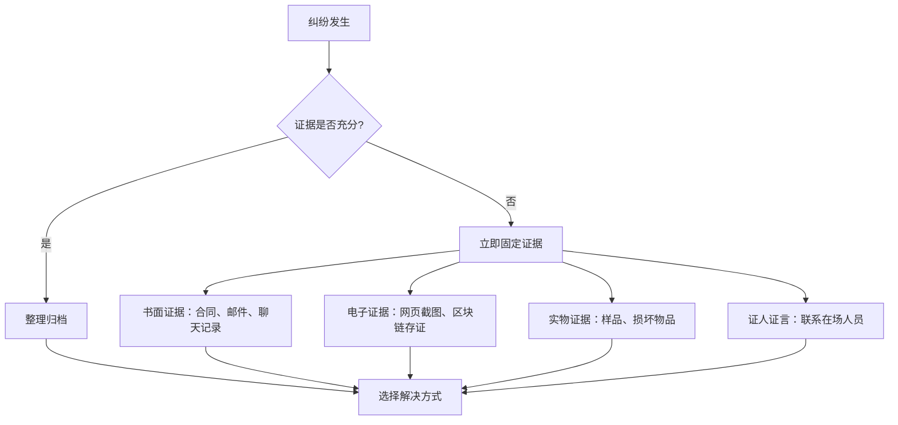
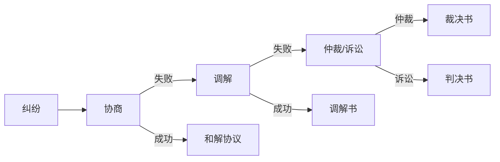
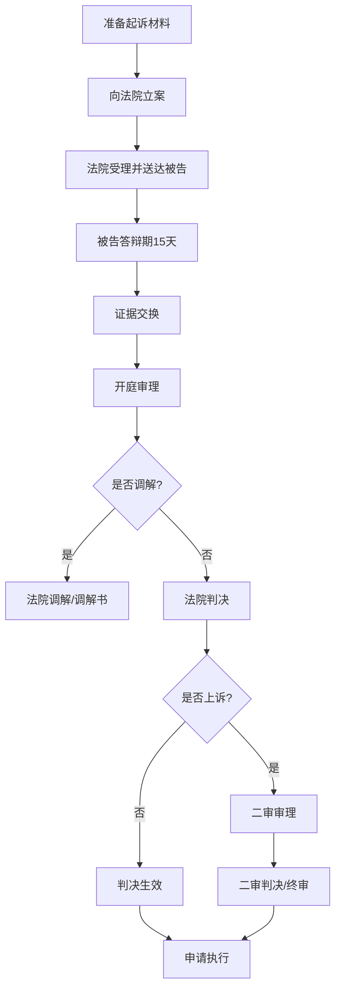
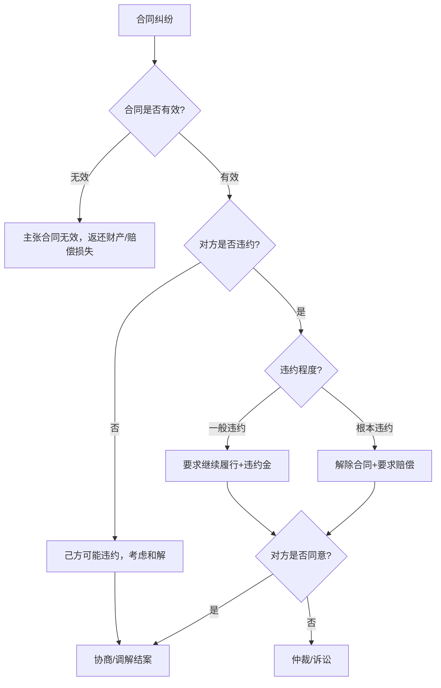
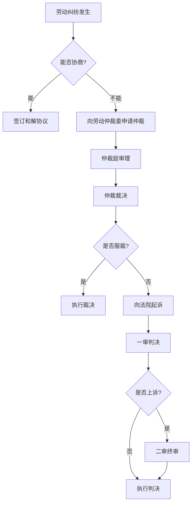

## 七、法律纠纷处理技巧

搞钱的路上，纠纷不是"会不会发生"的问题，而是"什么时候发生"的问题。2023年全国法院受理民商事案件约2000万件，其中合同纠纷占比超过50%。但打官司只是解决纠纷的方式之一，而且往往是最贵、最慢的一种。真正的纠纷处理高手，懂得根据纠纷类型、金额大小、对方态度、证据状况，选择最合适的解决路径，并在每一步都做好成本控制。

本节从纠纷发生的第一秒开始，系统讲解从协商到诉讼的完整处理流程，帮你用最低成本、最高效率解决法律纠纷。

### 1. 纠纷发生后的黄金72小时

纠纷发生后，很多人第一反应是愤怒或恐慌，然后要么冲动行事，要么拖延不管。这两种反应都会让事情变得更糟。正确的做法是按以下步骤冷静处理：

#### 第一步：止损（0-2小时内）

纠纷一旦发生，首先要做的不是追责，而是止损。

- **合同纠纷**：立即停止履行可能扩大损失的义务，同时书面通知对方（微信消息、邮件均可，但要保留记录）
- **知识产权侵权**：截图保存侵权页面（带时间戳），必要时做公证保全
- **劳动纠纷**：继续正常上班打卡，不要主动辞职（主动辞职会丧失经济补偿金请求权）
- **数据泄露事件**：启动应急预案，通知受影响用户，向网信部门报告

#### 第二步：固定证据（2-24小时内）

证据是纠纷处理的核心资产。很多本来有理的案子，因为证据不足而败诉。



**电子证据固定的关键要点**：

| 证据类型 | 固定方式 | 注意事项 |
|---------|---------|---------|
| 微信聊天记录 | 截图 + 导出完整记录 | 包含头像、昵称、时间，不能只截部分 |
| 电子邮件 | 保存邮件原件(.eml格式) | 包含邮件头信息，证明发送/接收时间 |
| 网页内容 | 公证处网页保全 / 区块链存证 | 网页随时可能被修改或删除 |
| 转账记录 | 导出银行流水 | 需银行盖章确认 |
| 合同原件 | 扫描+拍照双备份 | 注意保管原件，复印件证明力较弱 |
| 通话录音 | 手机自带录音功能 | 录音前不需要告知对方（单方录音合法） |

> **关键提醒**：电子证据的证明力取决于其完整性和原始性。2020年修订的《最高人民法院关于民事诉讼证据的若干规定》第14条明确将电子数据列为独立证据类型，包括网页、博客、短信、电子邮件、即时通信记录等。但如果你只截取了对自己有利的部分对话，法官可能会对整份证据的可信度打折扣。

#### 第三步：评估形势（24-72小时内）

冷静下来后，需要对纠纷做一个全面评估，这直接决定后续的处理策略。

**纠纷评估矩阵**：

| 评估维度 | 低风险（可协商） | 中风险（需调解/仲裁） | 高风险（准备诉讼） |
|---------|---------------|-------------------|----------------|
| 金额 | 1万元以下 | 1-50万元 | 50万元以上 |
| 证据 | 充分完整 | 基本充分但有瑕疵 | 关键证据缺失 |
| 对方态度 | 愿意沟通 | 犹豫推诿 | 拒绝沟通或恶意拖延 |
| 时效 | 距诉讼时效届满>1年 | 距届满6-12个月 | 距届满<6个月 |
| 关系 | 长期合作伙伴 | 一般商业关系 | 一次性交易对手 |

### 2. 四种纠纷解决方式详解

纠纷解决有四种主要方式，从温和到激烈依次递进。选对方式，可以事半功倍；选错方式，可能赢了官司输了钱。



#### 2.1 协商：成本最低的首选方案

协商是纠纷双方直接沟通、互谅互让解决争议的方式。超过60%的商业纠纷在协商阶段就能解决。

**协商的核心原则**：

1. **明确底线**：在开始谈判前，确定自己的最低可接受条件（底线）和理想目标（上限）
2. **用书面形式**：口头协商的结果必须落实为书面协议，否则等于没协商
3. **给对方台阶**：不要把对方逼到墙角，留有余地更容易达成协议
4. **分清利弊**：帮对方算一笔账——协商解决 vs 打官司，哪个对他更有利

**协商话术模板**：

```text
场景：对方拖欠货款5万元，已逾期3个月。

开口：「王总，关于那笔5万元的货款，咱们聊聊怎么安排。
      我理解您这边资金可能紧张，咱们看能不能找个双方都接受的方案。」

让步策略：
- 第一步：「如果您能在本周内付3万，剩余2万可以分两个月付清。」
- 第二步：「或者您一次性付4.5万，剩余的咱们就算了。」
- 底线：「最迟月底前必须有明确的还款计划，否则我们只能走法律途径了。」

达成协议后：「好的，那咱们把今天说的这些写成一个还款协议，双方签字确认。」
```

**协商和解协议的必备条款**：

- 双方身份信息（姓名/公司名、身份证号/统一社会信用代码）
- 纠纷事实的简要描述
- 和解方案的具体内容（金额、支付方式、时间）
- 违约责任（未按和解协议履行的后果）
- 争议解决条款（和解协议本身产生争议怎么办）
- 双方签字/盖章 + 日期

#### 2.2 调解：借助第三方的智慧

调解是由中立的第三方介入，帮助双方达成协议。调解的优势在于成本低（很多调解免费）、效率高（通常1-2周内完成）、不伤和气。

**调解的主要渠道**：

| 调解渠道 | 适用场景 | 费用 | 周期 | 法律效力 |
|---------|---------|------|------|---------|
| 人民调解委员会 | 邻里、小额民事纠纷 | 免费 | 1-2周 | 可申请司法确认，具有强制执行力 |
| 行业调解 | 行业内的商业纠纷 | 较低 | 2-4周 | 调解协议具有合同效力 |
| 商事调解中心 | 商业合同、投资纠纷 | 按标的额收费 | 2-6周 | 可申请司法确认 |
| 法院附设调解 | 已起诉的案件 | 免费或很低 | 1-2月 | 调解书与判决书同等效力 |
| 互联网调解平台 | 小额网络纠纷 | 免费 | 1-2周 | 可申请司法确认 |

**调解成功的关键技巧**：

1. **选择合适的调解员**：最好选择有行业背景的调解员，他们更理解争议的实质
2. **准备好底线方案**：调解不是无原则让步，要带着方案去
3. **利用"调解保密"原则**：调解过程中说的话、做的让步，不能在后续诉讼中作为证据使用（这是调解的独特优势）
4. **及时申请司法确认**：调解协议本身没有强制执行力，如果担心对方不履行，应在调解协议生效后30日内向法院申请司法确认

> **实务经验**：调解金额较大的案件时，可以先让调解员分别与双方单独沟通（背对背调解），了解各自的底线后再坐到一起谈，成功率远高于直接面对面。

#### 2.3 仲裁：商事纠纷的高效选择

仲裁是由双方选定的仲裁机构对纠纷进行裁决。仲裁的核心优势是"一裁终局"（不像诉讼可以上诉拖延时间），且保密性好（不会公开裁判文书）。

**仲裁 vs 诉讼的关键区别**：

| 对比维度 | 仲裁 | 诉讼 |
|---------|------|------|
| 启动前提 | 必须有仲裁协议（合同中的仲裁条款或单独的仲裁协议） | 不需要事先约定 |
| 审级制度 | 一裁终局 | 两审终审 |
| 审理周期 | 通常3-6个月 | 一审6个月，二审3个月，实际可能更长 |
| 费用 | 仲裁费 + 律师费，通常高于诉讼 | 诉讼费 + 律师费 |
| 保密性 | 不公开审理，裁决不公开 | 原则上公开审理，裁判文书网上公开 |
| 裁决执行 | 需要向法院申请强制执行 | 判决本身可直接申请执行 |
| 涉外执行 | 《纽约公约》缔约国相互承认执行 | 需双边条约或互惠原则 |
| 灵活性 | 可选择仲裁员、语言、规则 | 法院指定，程序法定 |

**仲裁的适用场景**：

- 商事合同纠纷（尤其是国际贸易合同）
- 需要保密的商业纠纷（如涉及商业秘密）
- 希望快速解决的纠纷（一裁终局，没有上诉拖延）
- 涉外纠纷（仲裁裁决在国际上更容易执行）

**仲裁条款的写法**：

```text
标准仲裁条款模板：
「凡因本合同引起的或与本合同有关的任何争议，均应提交
[仲裁机构名称]按照其仲裁规则进行仲裁。仲裁裁决是终局的，
对双方均有约束力。」

推荐的仲裁机构：
- 中国国际经济贸易仲裁委员会（CIETAC）— 涉外商事首选
- 北京仲裁委员会（BAC）— 国内商事口碑好
- 上海国际仲裁中心（SHIAC）— 长三角地区
- 深圳国际仲裁院（SCIA）— 粤港澳大湾区
```

> **踩坑提醒**：仲裁条款必须明确约定仲裁机构名称。如果写成"由双方协商选择仲裁机构"或"提交北京的仲裁机构"这种模糊表述，仲裁条款可能被认定为无效，导致纠纷无仲裁管辖。《仲裁法》第16条要求仲裁协议必须有"选定的仲裁委员会"。

#### 2.4 诉讼：最后的武器

诉讼是向法院起诉，由法院依法判决。诉讼是最正式、最权威的纠纷解决方式，但也是成本最高、周期最长的方式。

**诉讼的完整流程**：



**诉讼的关键时间节点**：

| 阶段 | 时间限制 | 法律依据 |
|------|---------|---------|
| 诉讼时效 | 普通3年，自知道权利被侵害之日起算 | 《民法典》第188条 |
| 立案审查 | 7日内决定是否立案 | 《民事诉讼法》第123条 |
| 被告答辩期 | 收到起诉状副本后15日内 | 《民事诉讼法》第128条 |
| 一审审限 | 简易程序3个月，普通程序6个月 | 《民事诉讼法》第152条 |
| 上诉期限 | 判决书送达后15日内，裁定书10日内 | 《民事诉讼法》第171条 |
| 二审审限 | 3个月内审结 | 《民事诉讼法》第183条 |
| 申请执行时效 | 判决生效后2年内 | 《民事诉讼法》第246条 |

**诉讼成本估算**：

诉讼费用主要包括法院收取的案件受理费和律师费两部分。

法院受理费标准（财产案件）：

| 诉讼标的额 | 受理费 |
|-----------|-------|
| 1万元以下 | 50元 |
| 1-10万元 | 标的额×2.5%-200元 |
| 10-20万元 | 标的额×2%+300元 |
| 20-50万元 | 标的额×1.5%+1300元 |
| 50-100万元 | 标的额×1%+3800元 |
| 100-200万元 | 标的额×0.9%+4800元 |
| 200-500万元 | 标的额×0.8%+6800元 |

> **省钱技巧**：诉讼费由败诉方承担。如果经济困难，可以申请司法救助（缓交、减交或免交诉讼费）。另外，标的额较小的案件（各省标准不同，一般5万以下）可以适用小额诉讼程序，一审终审，节省时间和费用。

### 3. 常见纠纷类型的具体处理策略

#### 3.1 合同纠纷处理

合同纠纷是最常见的商事纠纷类型，处理的核心在于合同条款的解释和违约责任的认定。

**合同纠纷的处理决策树**：



**合同违约赔偿的计算方法**：

1. **约定违约金**：合同中有约定的，按约定执行（但过高可请求法院调减，过低可请求调增）
2. **实际损失**：包括直接损失和可得利益损失（《民法典》第584条）
3. **可预见性规则**：赔偿范围不超过违约方在订立合同时预见到或应当预见到的损失

```text
违约金调整的法律依据：
《民法典》第585条：
- 约定的违约金低于造成的损失的 → 当事人可以请求增加
- 约定的违约金过分高于造成的损失的 → 当事人可以请求适当减少
- 司法实践中，违约金一般不超过实际损失的130%

举例：
合同标的100万，约定违约金30万。
实际损失20万。
法院可能将违约金调减至26万（20万×130%）左右。
```

#### 3.2 债务纠纷处理（讨债实战）

债务纠纷是"搞钱"过程中最常遇到的纠纷类型。别人欠你的钱，怎么要回来？

**讨债的五种武器（按递进顺序使用）**：

| 武器 | 方式 | 成本 | 效果 | 适用场景 |
|------|------|------|------|---------|
| 第一招 | 电话/微信催收 | 零成本 | ★★ | 刚逾期，对方尚有还款意愿 |
| 第二招 | 律师函 | 500-2000元 | ★★★ | 对方拖延不还，需要施压 |
| 第三招 | 支付令 | 受理费1/3 | ★★★★ | 债权债务关系明确 |
| 第四招 | 诉讼+财产保全 | 诉讼费+律师费 | ★★★★★ | 对方有能力但不愿还 |
| 第五招 | 申请强制执行 | 执行费 | ★★★★★ | 判决生效后对方仍不还 |

**支付令——被忽略的讨债神器**：

很多人不知道，对于债权债务关系明确的案件，可以直接向法院申请支付令，不需要经过漫长的诉讼程序。

支付令的核心优势：
- 审查快：法院15日内审查并发出
- 费用低：受理费仅为诉讼费的1/3
- 效力强：债务人15日内不提异议也不履行的，可直接申请强制执行
- 威慑大：收到支付令后，很多债务人会主动还钱

支付令的适用条件：
- 债权人与债务人没有其他债务纠纷
- 支付令能够送达债务人
- 请求给付金钱或有价证券

```python
# 支付令申请书的核心结构（参考模板）
"""
支付令申请书

申请人：[姓名/公司名]，[地址]
被申请人：[姓名/公司名]，[地址]

请求事项：
请求法院向被申请人发出支付令，要求被申请人支付
[具体金额]元及逾期利息。

事实与理由：
[年月日]，申请人与被申请人签订[合同名称]，
约定[合同核心条款]。申请人已[履行义务情况]，
但被申请人至今未支付[金额]元，已逾期[天数]天。

证据清单：
1. 合同原件
2. 交付/服务完成凭证
3. 催款记录

此致
[法院名称]

申请人：[签名]
[日期]
"""
```

**财产保全——防止对方转移资产**：

如果你预感到对方可能转移财产逃避债务，可以在起诉的同时（甚至起诉前）申请财产保全。

- **诉前保全**：情况紧急时，可在起诉前申请，但必须在法院采取保全措施后30日内起诉
- **诉中保全**：在诉讼过程中申请
- **保全范围**：限于请求的范围或与案件有关的财物
- **担保要求**：通常需要提供相当于保全金额的担保（现金、房产、保函均可）

> **实战经验**：很多债务人一听说被保全了财产（银行账户被冻结、房产被查封），立马主动还钱。财产保全不仅是法律手段，更是心理战武器。

#### 3.3 劳动纠纷处理

劳动纠纷有其特殊的处理程序——必须先经过劳动仲裁，才能向法院起诉（仲裁前置原则）。

**劳动纠纷处理流程**：



**劳动仲裁的关键要点**：

1. **时效**：劳动争议仲裁时效为1年，自知道或应当知道权利被侵害之日起算（但劳动关系存续期间的工资争议不受1年限制）
2. **管辖**：向劳动合同履行地或用人单位所在地的劳动仲裁委申请
3. **费用**：劳动仲裁不收费（2008年起免费）
4. **举证责任**：用人单位对解除劳动合同、减少劳动报酬等事项承担举证责任（举证责任倒置）
5. **审理期限**：45日内审结，案情复杂可延长至60日

**常见劳动纠纷的赔偿标准**：

| 纠纷类型 | 赔偿标准 | 法律依据 |
|---------|---------|---------|
| 违法解除劳动合同 | 2N（经济补偿金的2倍） | 《劳动合同法》第87条 |
| 协商解除劳动合同 | N+1（N为工作年限） | 《劳动合同法》第46条 |
| 未签劳动合同 | 最多11个月双倍工资 | 《劳动合同法》第82条 |
| 拖欠工资 | 补发工资 + 25%经济补偿金 | 《违反和解除劳动合同的经济补偿办法》 |
| 未缴社保 | 补缴社保 + 经济补偿金 | 《劳动合同法》第38条 |
| 加班费 | 平日1.5倍，周末2倍，法定节假日3倍 | 《劳动法》第44条 |

> **N的计算方法**：每满1年支付1个月工资；6个月以上不满1年的，按1年计算；不满6个月的，支付半个月工资。月工资是指解除劳动合同前12个月的平均工资。

#### 3.4 知识产权纠纷处理

知识产权纠纷（著作权、商标、专利）有其特殊的处理方式和赔偿计算方法。

**知识产权纠纷的维权路径**：

| 维权方式 | 适用场景 | 优势 | 劣势 |
|---------|---------|------|------|
| 平台投诉 | 电商平台/社交媒体上的侵权 | 快速下架，零成本 | 只能解决线上，不能获得赔偿 |
| 行政投诉 | 市场上的侵权产品 | 效率高，可查封扣押 | 只能制止侵权，赔偿需另诉 |
| 发送律师函 | 初次发现侵权 | 成本低，威慑力强 | 对方可能无视 |
| 民事诉讼 | 需要赔偿的侵权 | 可获得赔偿 | 周期长，成本高 |
| 刑事报案 | 大规模、恶意侵权 | 威慑力最大 | 门槛高，需达到刑事立案标准 |

**著作权侵权赔偿的计算方法**（按优先顺序）：

1. **实际损失**：权利人因侵权所遭受的实际损失
2. **侵权获利**：侵权人因侵权所获得的利益
3. **法定赔偿**：实际损失和侵权获利均难以确定时，法院酌定500元-500万元
4. **惩罚性赔偿**：故意侵权且情节严重的，可判处1-5倍赔偿（2020年《著作权法》第54条新增）

### 4. 证据管理的系统化方法

纠纷处理的胜负，70%取决于证据。建立系统化的证据管理习惯，是每个搞钱人的必修课。

#### 4.1 日常证据管理清单

不要等到纠纷发生才想起收集证据。日常经营中就应该养成证据管理的习惯。

**必须保留的关键文件**：

- **合同类**：所有合同的原件（包括附件、补充协议）
- **沟通类**：重要商务谈判的邮件、微信记录
- **财务类**：发票、收据、银行流水、转账凭证
- **交付类**：发货单、签收单、验收报告
- **授权类**：授权书、委托书、许可协议
- **通知类**：催告函、解除通知、变更通知（保留发送记录和签收记录）

#### 4.2 电子证据的规范保存

随着数字化办公的普及，越来越多的关键证据以电子形式存在。电子证据的保存需要特别注意以下要点：

**微信证据的保存规范**：

```text
正确做法：
1. 截图时包含：对方头像、昵称、微信号、消息时间
2. 截图要完整，不能只截对自己有利的部分
3. 同时导出完整的聊天记录备份
4. 对于关键对话，可以到公证处做证据保全公证
5. 有条件的话，使用可信时间戳或区块链存证

错误做法：
1. 只截取几条消息的局部截图
2. 使用PS修改截图内容（涉嫌伪造证据）
3. 只保留手机上的原始记录不备份（手机丢失/损坏则证据灭失）
4. 删除对自己不利的聊天记录（可能被认定为故意隐瞒证据）
```

#### 4.3 公证保全与区块链存证

对于容易灭失或被篡改的证据，建议采用公证保全或区块链存证的方式固定。

- **公证保全**：到公证处对网页内容、邮件、聊天记录等进行保全公证。费用通常500-2000元/次，证明力极高
- **区块链存证**：通过司法区块链平台（如北京互联网法院的"天平链"）对电子数据进行存证。费用低（几元到几十元），时间快，已被法院广泛认可
- **可信时间戳**：通过联合信任时间戳服务对电子文件加盖时间戳，证明文件在某个时间点已经存在且未被篡改

### 5. 律师选择与费用控制

#### 5.1 什么时候需要请律师

不是所有纠纷都需要律师。以下情况建议请律师：

- 争议金额超过5万元
- 对方已经请了律师
- 涉及公司股权、知识产权等复杂法律关系
- 需要进行诉讼保全
- 案件可能涉及刑事风险
- 你不熟悉相关法律程序

以下情况可以自己处理：

- 争议金额较小（1万元以下）
- 事实清楚、证据充分
- 对方愿意协商解决
- 适用小额诉讼程序

#### 5.2 律师费的市场行情

| 服务类型 | 费用范围 | 说明 |
|---------|---------|------|
| 法律咨询 | 200-1000元/小时 | 首次咨询部分律所免费 |
| 律师函 | 500-3000元/封 | 简单的律师函500元左右 |
| 合同审查 | 500-5000元/份 | 取决于合同复杂程度 |
| 劳动仲裁代理 | 3000-10000元 | 简单案件3000-5000元 |
| 一审诉讼代理 | 5000-50000元 | 通常按标的额3%-8%收费 |
| 风险代理 | 胜诉金额的10%-30% | 前期不收费或收少量基础费 |

**降低律师费的技巧**：

1. **分阶段委托**：先委托到一审结束，二审根据情况再决定
2. **部分代理**：自己做大部分工作，只在关键环节请律师把关
3. **风险代理**：如果胜诉把握大但资金紧张，可以选择风险代理模式
4. **法律援助**：经济困难的公民可以申请免费法律援助
5. **法学院法律诊所**：部分高校法学院提供免费或低价的法律服务

### 6. 判决执行与债权实现

赢了官司拿不到钱，是最让人崩溃的事情。据统计，全国法院的执行到位率约为40%-50%，意味着有将近一半的胜诉判决难以完全执行到位。因此，在诉讼前就要考虑执行问题。

#### 6.1 执行申请的关键步骤

```text
执行申请时间线：
判决生效 → 等待履行期（判决书通常会写"于本判决生效后X日内履行"）
         → 履行期届满对方仍未履行 → 向法院申请强制执行
         → 申请时效：判决生效后2年内
```

**执行申请需要准备的材料**：

1. 执行申请书
2. 生效判决书/调解书/裁决书原件
3. 申请人身份证明
4. 被执行人的财产线索（银行账号、房产信息、车辆信息、股权信息等）

#### 6.2 如何查找被执行人的财产

查找被执行人财产是执行成功的关键。以下是可以利用的渠道：

| 财产类型 | 查询渠道 | 说明 |
|---------|---------|------|
| 银行存款 | 法院网络查控系统 | 法院可直接查询并冻结 |
| 房产 | 不动产登记中心 | 需向法院提供线索或申请法院调查 |
| 车辆 | 车管所 | 可通过车牌号查询 |
| 股权 | 企业信用信息公示系统 | 可查到对外投资信息 |
| 工资收入 | 被执行人工作单位 | 法院可向单位发出协助执行通知 |
| 社保账户 | 社保中心 | 养老保险个人账户可被强制执行 |

**被执行人常用的逃债手段及应对**：

| 逃债手段 | 应对方式 |
|---------|---------|
| 将财产转移到配偶/亲属名下 | 申请追加配偶为被执行人，或行使撤销权 |
| 将房产过户给他人 | 如系无偿转让或明显低价转让，可行使债权人撤销权 |
| 将银行存款转为现金 | 申请法院调查取款记录 |
| 假离婚转移财产 | 申请追加前配偶为被执行人 |
| 设立新公司转移业务 | 申请追加公司股东为被执行人（需证明人格混同） |

#### 6.3 失信被执行人惩戒机制

如果被执行人拒不履行，可以申请法院将其纳入失信被执行人名单（俗称"老赖黑名单"），对其施加以下限制：

- 限制乘坐飞机、高铁
- 限制高消费（住星级酒店、旅游度假、子女就读高收费私立学校等）
- 限制贷款、办理信用卡
- 在征信系统中记录
- 通过媒体公开曝光
- 限制出境
- 情节严重的，可追究拒不执行判决、裁定罪（最高7年有期徒刑）

### 7. 纠纷处理的成本效益分析

在决定是否打官司之前，一定要做一笔账：打官司划算吗？

**纠纷处理成本效益计算公式**：

```text
净收益 = 预期获赔金额 × 胜诉概率 - 诉讼成本 - 时间机会成本

其中：
- 预期获赔金额 = 请求金额 × 预期执行到位率（一般40%-60%）
- 胜诉概率 = 根据证据充分程度、法律规定综合判断
- 诉讼成本 = 诉讼费 + 律师费 + 差旅费 + 公证费等
- 时间机会成本 = 处理纠纷所花费的时间 × 你的时薪
```

**决策示例**：

```text
场景：对方欠你10万元货款，证据充分（有合同+签收单+催款记录）

计算：
- 预期获赔：10万 × 60% = 6万
- 胜诉概率：90%（证据充分）
- 诉讼成本：诉讼费约2300元 + 律师费约8000元 = 约1万元
- 时间成本：约3个月，假设每月投入10小时 × 时薪200元 = 6000元

净收益 = 6万 × 90% - 1万 - 0.6万 = 3.8万

结论：值得诉讼。但如果标的只有1万：
净收益 = 0.6万 × 90% - 0.3万（小额诉讼费用低）- 0.2万 ≈ 0.04万

结论：勉强值得，但如果对方无财产可执行，不如放弃或用其他方式施压。
```

### 8. 常见误区与纠正

| 误区 | 真实情况 | 正确做法 |
|------|---------|---------|
| 「欠条过了2年就作废了」 | 诉讼时效3年，且可以通过催告中断重新计算 | 定期催款并保留记录，确保时效不过期 |
| 「口头约定没有法律效力」 | 口头合同同样有效，只是举证困难 | 重要约定必须书面化，哪怕是微信确认也行 |
| 「打官司一定要请律师」 | 法律不强制要求请律师，简单案件可以自己诉讼 | 根据案件复杂度和金额决定是否请律师 |
| 「对方没钱，告了也没用」 | 判决生效后2年内都可以申请执行，对方将来有钱了仍可执行 | 即使暂时执行不了，也要先拿到判决确认债权 |
| 「私下录音不能作为证据」 | 单方录音合法，只要不侵犯他人隐私或违反法律禁止性规定 | 录音时不要采取胁迫、窃听等违法手段 |
| 「签了合同就必须履行到底」 | 法定解除权和约定解除权允许在特定条件下解除合同 | 了解合同解除的法定条件，合法行使解除权 |

### 9. 进阶技巧：纠纷预防胜于纠纷处理

最好的纠纷处理，是让纠纷不发生。以下是高级别的纠纷预防策略：

#### 9.1 合同模板标准化

建立一套标准化的合同模板库，覆盖日常业务中的各类合同场景。标准化模板应包含：

- 明确的权利义务条款
- 合理的违约责任条款
- 清晰的争议解决条款
- 完善的保密条款
- 明确的知识产权归属条款

#### 9.2 交易对手背景调查

在签订重要合同前，对交易对手进行背景调查：

1. **企业信用查询**：通过国家企业信用信息公示系统、天眼查、企查查等平台查询企业注册信息、股东信息、行政处罚、司法案件
2. **裁判文书检索**：在中国裁判文书网搜索对方涉及的诉讼案件，了解其诉讼历史
3. **执行信息查询**：在中国执行信息公开网查询对方是否为失信被执行人
4. **行业口碑调查**：通过行业协会、上下游合作伙伴了解对方的商业信誉

#### 9.3 建立法律风险预警机制

对于有持续经营的企业，建议建立法律风险预警机制：

- **合同到期提醒**：提前30天提醒合同到期，避免自动续约陷阱
- **诉讼时效监控**：对所有应收账款建立诉讼时效台账，定期检查
- **法规更新跟踪**：关注与业务相关的新法规、新政策，及时调整合规措施
- **定期法律体检**：每年至少做一次全面的法律风险评估
