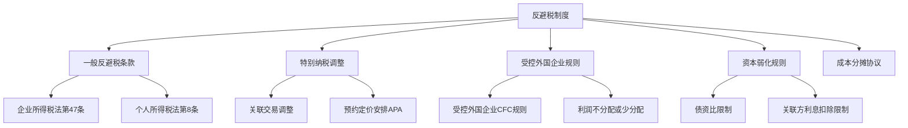
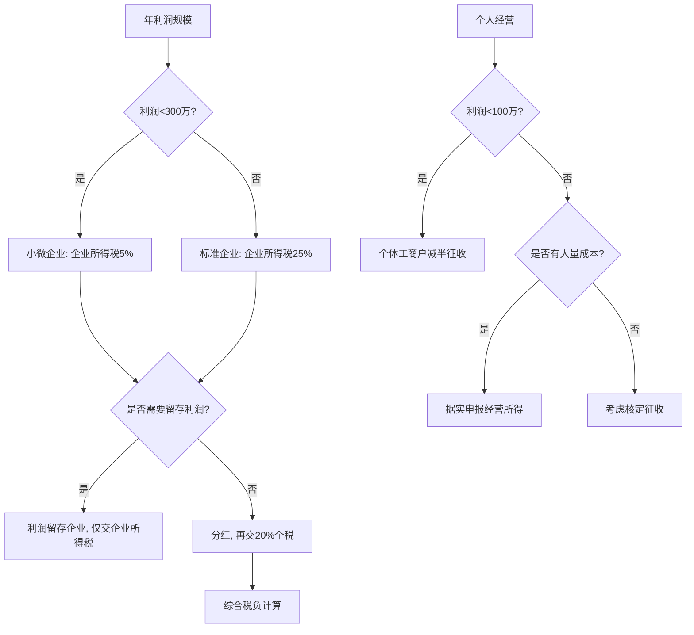

## 九、税务筹划实战技巧

税务筹划的核心不是"少交税"，而是在法律框架内选择最优的纳税方案。本节从法律合规视角出发，系统讲解税务筹划的合法边界、实操方法、风险防范和争议处理，帮助你在不触碰红线的前提下合理降低税负。

### 9.1 税务筹划的法律边界

#### 9.1.1 三个层次：避税、节税与逃税

理解税务筹划的法律性质，首先要区分三个层次的行为：

| 行为类型 | 定义 | 法律性质 | 后果 |
|----------|------|----------|------|
| **节税** | 利用税法中的优惠政策、税率差异，选择税负最低的方案 | 完全合法 | 受法律保护 |
| **避税** | 利用税法漏洞或安排不具合理商业目的的交易，减少纳税义务 | 形式合法但实质违规 | 可能被纳税调整 |
| **逃税** | 采取欺骗、隐瞒手段进行虚假纳税申报或不申报 | 违法犯罪 | 行政处罚乃至刑事责任 |

**关键判断标准**：是否有合理的商业目的。

《企业所得税法》第四十七条规定："企业实施其他不具有合理商业目的的安排而减少其应纳税收入或者所得额的，税务机关有权按照合理方法调整。"这是中国税法的一般反避税条款。个人所得税领域同样适用这一原则。

#### 9.1.2 合法筹划的四条红线

任何税务筹划方案都必须通过以下四条红线检验：

**红线一：真实性原则**
交易必须真实发生，不能虚构交易、虚开发票。虚开发票金额超过5万元即构成刑事犯罪（虚开发票罪），最高可处10年有期徒刑。

**红线二：合理商业目的**
交易安排必须有合理的商业目的，不能仅仅为了减少税收。例如，将员工工资拆分为"工资+劳务费+报销"的安排，如果没有真实的劳务和业务支撑，会被认定为逃税。

**红线三：经济实质原则**
享受税收优惠的主体必须具有经济实质。例如，到"税收洼地"注册空壳公司转移利润，如果没有实际经营活动和办公场所，税务机关可以否认其享受的优惠。

**红线四：合规程序要求**
必须按照税法规定的时间、方式和程序进行申报和备案。错过申报期限、未按规定备案，即使业务真实，也可能丧失优惠资格。

#### 9.1.3 反避税制度框架

中国现行反避税制度主要包括以下几个层面：

**个人所得税法第八条**（2018年修订新增）规定了三项反避税条款：
1. **关联交易**：个人与其关联方之间的业务往来不符合独立交易原则而减少应纳税义务的，税务机关有权调整
2. **受控外国企业**：居民个人控制的外国企业无合理经营需要而不分配或减少分配利润的，该利润中应归属于居民个人的部分应计入当期收入
3. **一般反避税**：个人实施其他不具有合理商业目的的安排而获取不当税收利益的，税务机关有权调整

### 9.2 各类收入的筹划实战

#### 9.2.1 工资薪金筹划

**合法方案一：充分利用专项附加扣除**

这是最基础也最安全的筹划手段。2023年标准更新后的扣除项目：

| 扣除项 | 扣除标准 | 每年节税（适用20%税率） | 操作要点 |
|--------|----------|------------------------|----------|
| 子女教育 | 2000元/月/子女 | 4,800元/子女 | 夫妻可选择一方100%或各50%扣除 |
| 继续教育 | 400元/月（学历）或3,600元/年（证书） | 960-4,320元 | 职业资格证书取得当年扣除 |
| 大病医疗 | 自付超1.5万部分，上限8万/年 | 最高19,200元 | 本人或配偶扣除，汇算时办理 |
| 住房贷款利息 | 1,000元/月 | 2,400元 | 首套房贷，最长240个月 |
| 住房租金 | 800-1,500元/月 | 1,920-3,600元 | 根据城市等级，与房贷利息不可同时享受 |
| 赡养老人 | 3,000元/月 | 7,200元 | 独生子女全额，非独生分摊 |
| 婴幼儿照护 | 2,000元/月/婴幼儿 | 4,800元/婴幼儿 | 3岁以下，夫妻分配方式同子女教育 |

**实操技巧**：
- 夫妻双方收入差距较大时，将扣除项分配给高收入方，节税效果更大
- 例如：丈夫适用30%税率，妻子适用10%税率，将子女教育2000元/月分配给丈夫，每年节税 = 2400 × 30% = 720元；分配给妻子则节税 = 2400 × 10% = 240元
- 住房贷款利息和住房租金不能同时享受，需要计算哪个扣除更多
- 每年3-6月汇算时检查是否有遗漏的扣除项

**合法方案二：年终奖计税方式选择**

年终奖可以选择单独计税或并入综合所得。两种方式的税负差异可能很大：

| 全年应纳税所得额（不含年终奖） | 年终奖金额 | 单独计税税额 | 并入综合所得税额 | 推荐方式 |
|-------------------------------|-----------|-------------|----------------|----------|
| 0元 | 36,000元 | 1,080元 | 1,080元 | 差异不大 |
| 100,000元 | 36,000元 | 1,080元 | 7,200元 | 单独计税 |
| 300,000元 | 100,000元 | 9,790元 | 25,080元 | 单独计税 |
| 36,000元 | 144,000元 | 14,190元 | 10,080元 | 并入综合所得 |

**关键结论**：
- 年终奖金额处于临界点附近时（36,000/144,000/300,000/420,000/660,000/960,000元），要特别注意"年终奖陷阱"
- 例如：年终奖36,001元比36,000元多交税2,310元（多拿1元，多交2,310元税）
- 建议：在个税APP中分别选择两种方式试算，选择税额较低的方式

**合法方案三：公积金最大化**

住房公积金是最强力的合法节税工具之一：
- 缴存比例：5%-12%（单位和个人各承担一半）
- 缴存基数上限：当地上年度职工月平均工资的3倍
- 优势：税前扣除 + 公司等额缴纳 + 免税收益

以月薪20,000元、缴存比例12%为例：

| 项目 | 金额 |
|------|------|
| 个人月缴存 | 2,400元 |
| 单位月缴存 | 2,400元 |
| 年缴存总额 | 57,600元 |
| 年节税金额（20%税率） | 5,760元 |
| 实际到手增加（含单位匹配） | 57,600元 |

**合法方案四：个人养老金**

2022年11月起实施的个人养老金制度：
- 年缴上限：12,000元
- 税前扣除：缴费时全额扣除
- 领取时按3%单独计税
- 适用人群：年收入10万以上（税率≥10%）效果明显

| 边际税率 | 年缴12,000元节税 | 领取时交税(3%) | 净节税 |
|----------|-----------------|---------------|--------|
| 10% | 1,200元 | 360元 | 840元 |
| 20% | 2,400元 | 360元 | 2,040元 |
| 25% | 3,000元 | 360元 | 2,640元 |
| 30% | 3,600元 | 360元 | 3,240元 |
| 35% | 4,200元 | 360元 | 3,840元 |

#### 9.2.2 劳务报酬与经营所得的选择

自由职业者面临一个关键选择：收入以劳务报酬还是经营所得纳税？

**劳务报酬税制**：
- 预扣预缴：收入×(1-20%)×预扣率（20%-40%）
- 年终汇算：并入综合所得，适用3%-45%累进税率
- 特点：没有成本扣除，全额纳税

**经营所得税制**：
- 税率：5%-35%五级超额累进税率
- 可以扣除成本、费用、损失
- 可以享受小规模纳税人增值税优惠

**对比分析**（假设年收入50万元）：

| 项目 | 劳务报酬 | 个体工商户经营所得 |
|------|----------|-------------------|
| 收入 | 500,000元 | 500,000元 |
| 费用扣除 | 100,000元（20%） | 可据实扣除成本费用 |
| 假设成本费用 | — | 200,000元 |
| 应纳税所得额 | 400,000元 | 300,000元 |
| 适用税率 | 综合所得累进 | 5%-35%经营所得 |
| 预估税额 | ~76,080元 | ~45,580元 |
| 差异 | — | 节税约30,500元 |

**筹划路径**：
1. 如果自由职业收入稳定且有较多业务成本，注册个体工商户或个人独资企业更为有利
2. 小规模纳税人月销售额10万元以下免征增值税（2023年起）
3. 部分园区对个体工商户实行核定征收，综合税负可降至1%-3%
4. 注意：核定征收政策正在收紧，需关注当地最新政策

#### 9.2.3 投资收益税务优化

**股票投资**：

| 项目 | 税务处理 | 筹划要点 |
|------|----------|----------|
| 股票买卖差价 | 暂免征收个人所得税 | 无筹划空间 |
| 印花税 | 成交金额的0.05%（2023年8月28日起减半） | 减少频繁交易 |
| 股息红利（持股≤1个月） | 全额征税20% | 短线交易税负高 |
| 股息红利（1个月<持股≤1年） | 减按50%计入，税率10% | 持股超1个月可减半 |
| 股息红利（持股>1年） | 免征个人所得税 | 长期持有免税 |

**基金投资**：
- 买卖开放式基金：暂免个人所得税
- 基金分红：暂免个人所得税
- 买卖封闭式基金：暂免个人所得税
- ETF申赎差价：暂免个人所得税

**房产投资**：

| 持有情况 | 增值税 | 个人所得税 | 契税 |
|----------|--------|-----------|------|
| 不满2年 | 全额5.3% | 差额20%或全额1%-2% | 1%-3% |
| 满2年不满5年 | 免征 | 差额20%或全额1%-2% | 1%-3% |
| 满5年唯一 | 免征 | 免征 | 1%-3% |

**筹划要点**：
- "满五唯一"是房产交易最大的税收优惠，持有满5年且为家庭唯一住房可免征个税和增值税
- 如果有多套房产，出售时选择"满五唯一"的那套优先出售
- 继承房产的持有时间从被继承人取得房产时起算，可能直接满足"满五"

### 9.3 企业层面的税务筹划

#### 9.3.1 企业组织形式选择

不同组织形式的税负差异巨大：

| 组织形式 | 企业所得税 | 个人所得税 | 综合税负 | 适用场景 |
|----------|-----------|-----------|----------|----------|
| 个体工商户 | 无 | 经营所得5%-35% | 5%-35% | 小规模经营 |
| 个人独资企业 | 无 | 经营所得5%-35% | 5%-35% | 个人品牌 |
| 合伙企业 | 无 | 合伙人分别纳税 | 因人而异 | 专业服务 |
| 有限责任公司 | 25%（小微5%） | 分红20% | 40%（小微24%） | 规模经营 |
| 个人独资企业（核定） | 无 | 核定1%-3.5% | 1%-3.5% | 部分园区 |

**关键决策逻辑**：

#### 9.3.2 小微企业税收优惠运用

小型微利企业认定标准（同时满足）：
- 年应纳税所得额不超过300万元
- 从业人数不超过300人
- 资产总额不超过5000万元

实际税负：年应纳税所得额≤300万的部分，减按25%计入，按20%税率 = 实际5%

| 年利润 | 标准企业税负(25%) | 小微企业税负(5%) | 节税金额 | 节税比例 |
|--------|-------------------|-----------------|----------|----------|
| 100万 | 25万 | 5万 | 20万 | 80% |
| 200万 | 50万 | 10万 | 40万 | 80% |
| 300万 | 75万 | 15万 | 60万 | 80% |

**实战技巧**：
- 如果企业利润接近300万，可以通过合理安排支出时间（如提前支付费用、计提奖金）将利润控制在300万以内
- 利润超过300万时，可以考虑业务分拆为独立的关联公司，但必须有真实业务支撑
- 从业人数和资产总额指标按季度平均值计算，年末集中裁员或转移资产是无效的

#### 9.3.3 费用扣除最大化

企业所得税法允许扣除的费用项目及其限额：

| 费用项目 | 扣除限额 | 超限处理 | 筹划建议 |
|----------|----------|----------|----------|
| 职工福利费 | 工资总额14% | 不得扣除 | 控制在限额内 |
| 工会经费 | 工资总额2% | 不得扣除 | 按规定计提 |
| 职工教育经费 | 工资总额8% | 可结转扣除 | 充分利用额度 |
| 业务招待费 | 发生额60%且营收0.5% | 不得扣除 | 转化为会议费、培训费 |
| 广告宣传费 | 营收15%（特殊行业30%） | 可结转扣除 | 充分利用额度 |
| 公益捐赠 | 年利润12% | 可结转3年扣除 | 分年度捐赠 |
| 研发费用 | 据实扣除+100%加计扣除 | — | 充分归集研发费用 |

**业务招待费筹划案例**：
假设企业年营收5,000万元，业务招待费实际发生80万元：
- 按发生额60%扣除：80×60% = 48万元
- 按营收0.5%扣除：5,000×0.5% = 25万元
- 取较低者：只能扣除25万元，调增55万元
- 应对方案：将部分业务招待转化为客户培训、行业会议、市场调研等合规费用名目

### 9.4 风险评估与文档管理

#### 9.4.1 税务风险自检清单

在实施任何筹划方案前，用以下清单进行自检：

**交易层面**：
- [ ] 交易是否真实发生
- [ ] 交易是否有合理的商业目的
- [ ] 交易价格是否符合独立交易原则
- [ ] 交易对手是否为关联方
- [ ] 交易是否有完整的合同和凭证

**主体层面**：
- [ ] 筹划主体是否具有经济实质
- [ ] 是否有真实的办公场所和人员
- [ ] 是否有实际经营活动
- [ ] 注册地与经营地是否一致
- [ ] 是否符合享受优惠的主体条件

**程序层面**：
- [ ] 是否按规定期限申报
- [ ] 是否按规定备案
- [ ] 是否保留完整的备查资料
- [ ] 是否及时更新税务登记信息
- [ ] 是否按时报送关联业务往来报告

**文档层面**：
- [ ] 是否保存完整的合同协议
- [ ] 是否保存发票和付款凭证
- [ ] 是否保存银行流水
- [ ] 是否保存业务审批记录
- [ ] 是否保存会议纪要和决策依据

#### 9.4.2 筹划文档的编写规范

一份合规的税务筹划文档应包含以下要素：

**1. 方案概述**
- 筹划目标：明确要解决的税务问题
- 涉及税种：列出所有涉及的税种
- 适用主体：明确享受优惠或适用方案的主体
- 预期效果：量化节税金额和税负率变化

**2. 法律依据**
- 列明所依据的法律法规条文
- 列明相关的税务文件和公告
- 列明地方性的税收政策
- 注明文件的有效期限

**3. 商业目的说明**
- 阐述交易安排的商业逻辑
- 说明不进行该安排的商业损失
- 提供市场可比案例或行业惯例
- 论证交易安排的经济合理性

**4. 交易架构**
- 绘制交易架构图
- 说明各方的权利义务
- 说明资金流向
- 说明利润分配机制

**5. 风险评估**
- 列出可能被税务机关质疑的风险点
- 提供应对质疑的论据和证据
- 评估被纳税调整的概率和金额
- 制定风险应对预案

**6. 实施计划**
- 时间表和里程碑
- 责任人和分工
- 所需资源和预算
- 监控和调整机制

#### 9.4.3 证据链管理

税务筹划的合法性能否经受住检查，关键在于证据链是否完整。以下是各类筹划方案的证据链要求：

**商业目的证明**：
- 董事会决议或股东会决议
- 商业计划书或可行性分析报告
- 市场调研数据
- 行业分析报告

**交易真实性证明**：
- 合同协议（含补充协议）
- 发票（增值税发票、普通发票）
- 银行转账记录
- 货物验收单、服务确认单
- 物流单据（如有实物交易）

**定价合理性证明**：
- 可比性分析报告
- 同期资料（关联交易必备）
- 独立第三方评估报告
- 行业价格参考数据

**优惠适用证明**：
- 资质认定文件
- 备案回执
- 审批文件
- 年度审计报告

### 9.5 税务稽查应对实务

#### 9.5.1 稽查触发信号

了解税务稽查的触发机制，有助于提前防范：

**高风险信号**：
- 税负率明显低于行业平均水平（低于行业均值50%以上）
- 长期亏损但持续经营（连续3年以上亏损）
- 大额关联交易（关联交易占比超过50%）
- 收入与成本不匹配（毛利率异常波动）
- 发票异常（大量顶额开票、集中开票）
- 银行流水与申报收入严重不符
- 享受税收优惠但经营指标异常

**行业高风险特征**：

| 行业 | 常见稽查点 | 风险等级 |
|------|-----------|----------|
| 电商 | 平台数据与申报收入不一致 | 高 |
| 直播 | 打赏收入、带货佣金未申报 | 高 |
| 建筑 | 人工成本虚列、材料发票虚开 | 高 |
| 餐饮 | 收入不入账、现金交易 | 中 |
| 咨询服务 | 业务真实性存疑 | 中 |
| 房地产 | 土地增值税清算 | 高 |

#### 9.5.2 稽查应对策略

**收到稽查通知后的行动清单**：

**第一步：冷静评估（1-3天）**
- 确认稽查类型（日常检查、专项检查、举报检查、风险检查）
- 确认检查范围（哪些年度、哪些税种、哪些业务）
- 初步评估自身税务合规状况
- 决定是否需要聘请专业税务师或律师

**第二步：资料准备（3-7天）**
- 整理被检查年度的账簿、凭证
- 整理相关的合同、发票
- 整理银行对账单
- 整理税务申报表和备案资料
- 编制自查报告（如有问题，主动说明）

**第三步：配合检查（持续）**
- 指定专人对接
- 按要求提供资料，但注意资料范围（不要过度提供）
- 对检查人员的询问如实回答，但不要过度解释
- 对检查记录仔细核对后再签字

**第四步：结果处理**
- 认真审核《税务检查报告》
- 对有异议的部分及时提出陈述申辩
- 收到处理决定后，在法定期限内决定是否申请行政复议
- 如涉及补税，按规定期限缴纳（避免滞纳金持续累积）

#### 9.5.3 陈述申辩与行政复议

**陈述申辩权**：
税务机关在作出行政处罚决定之前，纳税人有权进行陈述和申辩。这是纳税人的法定权利，行使该权利不会导致更重的处罚。

**行政复议**：
- 申请期限：收到税务处理决定之日起60日内
- 复议机关：作出决定的税务机关的上一级税务机关
- 复议前置：对纳税争议（补税、滞纳金），必须先复议后诉讼
- 复议期间：原则上不停止执行（但可申请暂缓）

**行政诉讼**：
- 适用情形：对复议决定不服，或对行政处罚决定不服
- 起诉期限：收到复议决定之日起15日内
- 管辖法院：被告所在地人民法院
- 举证责任：税务机关对其行政行为的合法性承担举证责任

### 9.6 典型案例分析

#### 案例一：自由职业者的身份选择

**背景**：张某是一名UI设计师，年收入80万元，无雇员，业务成本约15万元（软件工具、设备折旧、办公租金等）。

**方案对比**：

| 项目 | 方案A：劳务报酬 | 方案B：个体工商户 |
|------|----------------|-------------------|
| 年收入 | 800,000元 | 800,000元 |
| 费用扣除 | 160,000元（20%固定） | 150,000元（据实扣除） |
| 应纳税所得额 | 640,000元 | 650,000元 |
| 综合所得税额 | ~157,080元 | ~165,250元 |
| 增值税 | 免（起征点以下） | 免（季度30万以下） |
| 附加税费 | 0 | 0 |
| 合计税负 | ~157,080元 | ~165,250元 |

**分析**：在这个案例中，由于张某的实际业务成本较低（15万 < 16万），劳务报酬的20%固定扣除反而更优。但如果张某的成本增加到30万元，个体工商户方案将更优（应纳税所得额50万 vs 64万）。

**结论**：身份选择不是一成不变的，需要根据实际收入和成本动态调整。

#### 案例二：小微企业利润临界点

**背景**：某设计公司年利润320万元，从业人数50人，资产总额800万元。

**方案分析**：

| 项目 | 原方案 | 筹划后 |
|------|--------|--------|
| 年利润 | 320万 | 295万 |
| 是否小微企业 | 否（超过300万） | 是 |
| 企业所得税 | 320×25% = 80万 | 295×5% = 14.75万 |
| 节税金额 | — | 65.25万 |

**筹划方法**：
- 年末一次性计提员工年终奖25万元（合理且有先例）
- 提前支付下一年度的办公租金和软件订阅费
- 增加员工培训投入

**合法性论证**：
- 年终奖计提有劳动合同和薪酬制度支撑
- 租金和软件费属于正常的经营支出
- 培训费不仅合法扣除，还可以加计扣除

**关键风险**：不能通过虚列费用或推迟确认收入来压低利润，这些行为构成偷税。

#### 案例三：房产交易时机选择

**背景**：李某2019年购入一套住房，购入价200万元，当前市场价350万元，属于家庭唯一住房。

**出售时机分析**：

| 项目 | 不满5年出售 | 满5年后出售 |
|------|------------|------------|
| 增值税 | 免（满2年） | 免（满2年） |
| 个人所得税 | (350-200)×20% = 30万 | 免（满五唯一） |
| 契税（买方） | 买方承担 | 买方承担 |
| 税务成本 | 30万元 | 0元 |

**结论**：等待满5年再出售可节省30万元个税。如果急需资金，可以考虑抵押贷款而非出售。

### 9.7 常见误区与纠正

#### 误区一：到"税收洼地"注册就能避税

**错误认知**：在有税收优惠的园区注册公司，将利润转移过去即可大幅节税。

**实际风险**：
- 2021年以来，国家税务总局多次清理"税收洼地"政策
- 没有实际经营的空壳公司不能享受核定征收
- 转让定价不符合独立交易原则的，税务机关有权调整
- 部分园区已追缴已享受的优惠税款

**正确做法**：如果确实在园区有实际经营活动（办公场所、员工、业务），可以合法享受当地优惠政策。但纯粹为避税注册空壳公司，风险极高。

#### 误区二：个人账户收款可以避税

**错误认知**：通过个人银行账户或微信/支付宝收款，不入公司账，就可以不交税。

**实际风险**：
- 金税四期系统已实现银行、税务、市场监管数据联网
- 大额个人账户交易会触发反洗钱监控
- 个人卡流水与经营收入不匹配会被重点关注
- 一旦被查，不仅要补税，还要加收滞纳金（日万分之五）和罚款（0.5-5倍）

**正确做法**：所有经营收入必须通过对公账户收取并如实申报。个人卡收款被查实后，定性为偷税的概率极高。

#### 误区三：多发工资少缴社保可以节税

**错误认知**：将工资拆分为"基本工资+现金补贴+报销"，降低社保缴费基数。

**实际风险**：
- 2019年起社保由税务部门征收，数据比对更严格
- 社保缴费基数应按上年度月平均工资核定，不能人为降低
- 员工维权时企业需补缴全部欠缴社保
- 可能面临社保局的处罚

**正确做法**：按实际工资如实缴纳社保。社保虽然增加了企业成本，但社保缴费本身是税前扣除的，实际增加的税负有限。

#### 误区四：买发票冲抵成本

**错误认知**：购买增值税发票增加成本费用，减少应纳税所得额。

**实际风险**：
- 虚开增值税发票是刑事犯罪
- 虚开金额1万元以上或致使国家税款被骗取5,000元以上即构成犯罪
- 虚开增值税专用发票最高可判无期徒刑
- 金税四期"以数治税"，发票异常一查一个准

**正确做法**：所有发票必须对应真实的交易。如果确实缺少成本发票，应该从业务源头解决（选择能开票的供应商），而非买票。

#### 误区五：个体户不用记账报税

**错误认知**：个体工商户规模小，不需要记账和报税。

**实际风险**：
- 《税收征收管理法》规定所有纳税人都需要设置账簿
- 不记账的个体户被查到后，税务机关有权核定应纳税额
- 核定金额通常远高于实际应纳税额
- 长期不申报会被列为非正常户，影响法人征信

**正确做法**：即使是个体工商户，也应该建立简易账簿，按时申报纳税。月销售额10万以下免征增值税，但仍然需要按期申报。

### 9.8 进阶：税务筹划的系统方法论

#### 9.8.1 筹划的时机选择

税务筹划的最佳时机往往在交易发生之前，而非之后：

**事前筹划（最优）**：
- 选择最优的交易架构
- 确定最佳的纳税主体
- 利用时间差异安排收入和支出
- 充分享受税收优惠

**事中调整（效果有限）**：
- 调整费用结构
- 补充缺失的凭证
- 完善合同条款

**事后补救（风险最高）**：
- 汇算时调整
- 纳税自查补报
- 申请延期纳税

#### 9.8.2 多税种联动思维

税务筹划不能只看单一税种，需要考虑多税种联动效应：

| 筹划动作 | 个税影响 | 企业所得税影响 | 增值税影响 | 总体影响 |
|----------|----------|---------------|-----------|----------|
| 提高工资 | 增加个税 | 增加扣除 | 无影响 | 需计算平衡点 |
| 增加福利 | 可能免税 | 限额扣除 | 进项转出 | 需控制比例 |
| 业务外包 | 员工个税降低 | 全额扣除 | 取得进项 | 可能更优 |
| 注册公司 | 经营所得 | 新增企业所得税 | 新增增值税 | 需综合计算 |

#### 9.8.3 长期视角的筹划

税务筹划不是一次性行为，而是需要持续优化的长期过程：

**年度循环**：
1. **年初**：制定全年税务计划，确认可享受的优惠政策
2. **季度**：评估实际经营情况，调整筹划方案
3. **年中**：关注政策变化，及时调整策略
4. **年末**：进行税务自查，安排年终决算
5. **次年3-6月**：进行汇算清缴，补退税款

**政策跟踪**：
- 关注国家税务总局公告
- 关注财政部税收政策文件
- 关注当地税务局通知
- 关注行业税收政策变化
- 参加税务局组织的政策培训

### 9.9 实用工具与资源

#### 9.9.1 官方工具

| 工具名称 | 用途 | 获取方式 |
|----------|------|----------|
| 个人所得税APP | 申报、查询、扣除填报 | 各应用商店下载 |
| 电子税务局 | 企业申报、发票管理 | 各省税务局网站 |
| 国家企业信用信息公示系统 | 查询企业信息 | www.gsxt.gov.cn |
| 全国增值税发票查验平台 | 发票真伪查验 | inv-veri.chinatax.gov.cn |
| 12366纳税服务热线 | 政策咨询 | 拨打12366 |

#### 9.9.2 专业服务

**何时需要聘请专业人士**：
- 涉及金额较大的交易（如股权转让、房产交易）
- 涉及跨境税务问题
- 收到税务稽查通知
- 企业架构调整或重组
- 享受复杂税收优惠的备案

**选择标准**：
- 具有税务师或注册会计师资质
- 有相关行业的服务经验
- 了解当地税务机关的执法口径
- 收费合理透明
