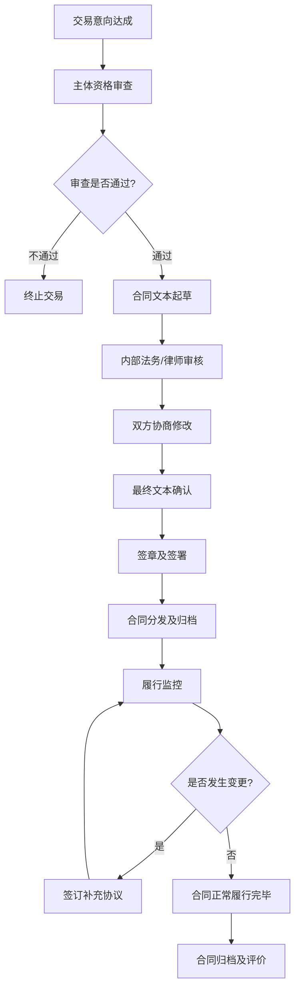

## 十、合同签订的法律风险防范

合同是商业活动和日常交易中最基本的法律文件，也是产生纠纷最多的领域之一。根据中国裁判文书网的数据，2023年全国合同纠纷案件超过600万件，其中相当一部分源于签订阶段的风险疏忽。签订一份合同，不是简单地"签个名字"——它是一次法律行为，一旦生效，对双方产生约束力。本节从签订前、签订中、签订后三个阶段，系统梳理合同签订过程中的法律风险，并提供可操作的防范策略。

### 1. 合同签订前的风险防范

#### 1.1 合同主体审查：你到底在跟谁签？

合同主体审查是风险防范的第一道防线。很多合同纠纷的根源，不是条款有问题，而是"签错了人"。

**（一）自然人主体审查**

与个人签订合同时，需要核实以下信息：

| 审查项目 | 审查方法 | 风险场景 |
|----------|----------|----------|
| 身份真实性 | 要求提供身份证原件并留存复印件，与本人核对 | 对方冒用他人身份签约，合同无效或难以追责 |
| 民事行为能力 | 确认对方已满18周岁，精神状态正常 | 与限制民事行为能力人（如未成年人）签订的合同可能效力待定 |
| 代理权限 | 若对方为代理人，需核查授权委托书原件 | 无权代理人签订的合同，被代理人可以不追认 |
| 信用状况 | 通过中国执行信息公开网查询是否为失信被执行人 | 与"老赖"签约，胜诉后也难以执行 |

**（二）企业主体审查**

与企业签订合同时，审查更为复杂：

- **工商登记信息**：通过国家企业信用信息公示系统（www.gsxt.gov.cn）查询企业名称、统一社会信用代码、法定代表人、注册资本、成立日期、经营范围、存续状态（是否注销/吊销）
- **经营资质**：确认对方是否持有行业特定资质或许可证（如建筑企业需有建筑资质等级证书，食品企业需有食品经营许可证）
- **法定代表人身份**：核实签字人是否为法定代表人本人，若不是则需提供有效的授权委托书
- **企业信用**：通过企查查、天眼查等平台查询企业的涉诉记录、行政处罚记录、经营异常信息
- **实际控制人穿透**：对于重大合同，应穿透到实际控制人层面，了解是否存在关联交易、利益输送等风险

**（三）主体审查的实操清单**

```text
合同主体审查五步法：

第一步：确认对方身份
  ├── 自然人 → 身份证原件 + 复印件
  └── 企业   → 营业执照副本 + 复印件（加盖公章）

第二步：验证主体资格
  ├── 经营范围是否覆盖本次交易
  ├── 特许经营资质是否在有效期内
  └── 是否存在经营异常或被列入严重违法名单

第三步：核实签约人权限
  ├── 法定代表人 → 直接签字
  ├── 委托代理人 → 授权委托书 + 代理人身份证
  └── 公司职员   → 职务证明 + 公司授权文件

第四步：信用调查
  ├── 中国执行信息公开网 → 失信被执行人查询
  ├── 中国裁判文书网     → 涉诉记录查询
  └── 企业信用公示系统   → 行政处罚/经营异常查询

第五步：留存证据
  ├── 所有证照复印件加盖对方公章或签字确认
  ├── 授权委托书留存原件
  └── 查询结果截图存档
```

#### 1.2 合同相对方的履约能力评估

审查主体合法只是第一步，还需评估对方"能不能做到"：

- **财务状况**：对方是否有足够的资金履行合同？可要求提供近期财务报表或银行资信证明
- **生产能力**：对方是否具备完成合同标的物的生产条件和技术能力？必要时进行实地考察
- **过往业绩**：对方是否有类似合同的履约记录？可要求提供过往合同或客户评价
- **人员配置**：对于服务类合同，对方是否有足够的专业人员？

#### 1.3 合同形式的选择

《民法典》第四百六十九条规定，当事人订立合同可以采用书面形式、口头形式或者其他形式。但不同形式的法律效力和举证难度差异巨大：

| 合同形式 | 优点 | 缺点 | 适用场景 |
|----------|------|------|----------|
| 书面合同 | 条款明确，举证容易 | 签订流程较长 | 金额较大、期限较长、内容复杂的交易 |
| 电子合同 | 签署便捷，可追溯 | 需确保电子签名合法性 | 远程交易、电商、SaaS服务 |
| 口头合同 | 灵活高效 | 举证极难，易生争议 | 即时完成的小额交易（不推荐用于重大交易） |
| 信件/传真 | 有书面记录 | 原件保存困难，真伪鉴别难 | 传统国际贸易 |

**实务建议**：除即时清结的小额交易外，一律采用书面形式。口头约定一旦发生纠纷，"说不清"是最大的风险。

### 2. 合同签订中的核心风险点

#### 2.1 合同必备条款缺失风险

一份有效的合同应当具备以下核心条款，缺一不可：

**（一）合同主体条款**

必须明确写明双方的全称、住所地、法定代表人（或负责人）、联系方式。注意：

- 企业名称必须与营业执照完全一致，不能用简称
- 自然人需写明身份证号码
- 地址需精确到门牌号，这是日后送达法律文书的依据

**（二）标的条款**

标的是合同的核心，必须清晰、具体、唯一。常见风险：

- 描述模糊：如"一批货物""相关服务"，缺乏具体规格、型号、数量
- 标的不合法：如合同标的违反法律强制性规定，合同无效
- 标的不存在：如出售的房产已被查封

```text
标的条款写法示例（以货物买卖为例）：

❌ 错误写法：
"甲方向乙方购买一批电脑。"

✅ 正确写法：
"甲方向乙方购买以下货物：
 品牌：联想ThinkPad X1 Carbon
 型号：Gen 11（2024款）
 配置：Intel Core i7-1365U / 16GB内存 / 512GB SSD / 14英寸2.8K OLED屏
 数量：50台
 单价：人民币12,000元/台（含增值税13%）
 总价：人民币600,000元（大写：陆拾万元整）"
```

**（三）价款和支付条款**

- 金额必须同时有大小写，且两者一致
- 明确币种（人民币/美元/其他）
- 明确是否含税及税率
- 明确支付方式（银行转账/现金/承兑汇票）
- 明确支付时间节点和条件（预付比例、进度款、尾款）
- 明确收款账户信息

**（四）履行期限、地点和方式**

- **期限**：不仅是"截止日期"，还应包括各阶段的时间节点
- **地点**：涉及管辖法院的确定（合同履行地法院有管辖权）
- **方式**：交货方式（送货/自提）、运输方式、风险转移时点

**（五）违约责任条款**

这是合同中最重要的"牙齿条款"，没有违约责任的合同等于没有约束力。需要注意：

- 违约金比例要合理，过高（超过实际损失的30%）可能被法院调减
- 违约情形要具体列举，不能笼统写"违反本合同"
- 应包括迟延履行、瑕疵履行、根本违约等不同情形的对应责任
- 损失赔偿范围要明确（直接损失/间接损失/预期利益）

**（六）争议解决条款**

| 方式 | 特点 | 注意事项 |
|------|------|----------|
| 诉讼 | 两审终制，强制执行力强 | 约定管辖法院需符合法定条件（被告住所地、合同履行地、合同签订地等） |
| 仲裁 | 一裁终局，保密性强 | 必须明确仲裁机构名称，且仲裁与诉讼不能同时约定 |

**常见陷阱**："发生争议由甲方所在地法院管辖"——这对乙方极为不利，因为甲方可以选择对其有利的法院。应争取约定"合同履行地法院管辖"或选择中立的仲裁机构。

#### 2.2 格式条款的风险

格式条款是一方预先拟定、未经协商的条款，常见于保险合同、银行合同、平台服务协议等。《民法典》第四百九十六条至第四百九十八条对格式条款有严格规定：

**格式条款的三大法律约束**：

1. **提示说明义务**：提供格式条款的一方应当采取合理方式提示对方注意免除或减轻其责任的条款，并按对方要求予以说明。未履行提示说明义务的，对方可以主张该条款不成为合同内容
2. **无效情形**：不合理地免除或减轻己方责任、加重对方责任、限制对方主要权利的格式条款无效
3. **解释规则**：对格式条款有两种以上解释的，应当作出不利于提供格式条款一方的解释

**实务中如何应对格式条款**：

- 签约前仔细阅读全部条款，特别关注小字、附件和特别约定部分
- 对不公平条款提出修改要求，即使对方不同意修改，也应要求在合同中注明"乙方已阅读并理解全部条款，但对第X条持保留意见"
- 拍照或复印留存签约时的合同文本，防止对方事后篡改
- 对于电子格式合同，截图保存并记录签署时间

#### 2.3 合同效力瑕疵风险

并非所有签字盖章的合同都有效。《民法典》规定了以下合同无效或可撤销的情形：

**合同无效的情形**：

- 无民事行为能力人签订的合同
- 双方以虚假意思表示签订的合同（如阴阳合同中的阳合同）
- 违反法律、行政法规的强制性规定的合同（如买卖人体器官）
- 违背公序良俗的合同（如包养协议）
- 恶意串通损害他人合法权益的合同

**合同可撤销的情形**：

- 重大误解（对合同重要事项存在错误认识）
- 欺诈（一方故意告知虚假情况或隐瞒真实情况）
- 胁迫（以给对方或其亲友的生命健康、名誉、财产等造成损害为要挟）
- 显失公平（一方利用对方处于危困状态、缺乏判断能力等情形）

**实务要点**：如果发现合同存在可撤销情形，应当自知道或应当知道撤销事由之日起**一年内**向法院或仲裁机构请求撤销，否则撤销权消灭。

#### 2.4 先合同义务与缔约过失

合同尚未成立时，双方也负有法律义务。《民法典》第五百条规定，当事人在订立合同过程中有下列情形之一，给对方造成损失的，应当承担损害赔偿责任：

- 假借订立合同恶意进行磋商（如竞争者故意拖延你的谈判时间）
- 故意隐瞒与订立合同有关的重要事实或提供虚假情况
- 其他违背诚信原则的行为

**案例**：甲公司与乙公司就厂房买卖进行了三个月的谈判，乙公司在此期间拒绝了其他买家的报价。临近签约时，甲公司突然告知乙公司其从未有购买意向，只是借此拖延时间配合竞争对手。乙公司因此错失了其他交易机会，遭受损失。乙公司可以依据缔约过失责任要求甲公司赔偿。

### 3. 合同签订流程的法律风险

#### 3.1 签章环节的风险

**（一）公章管理风险**

- **假公章**：合同上的公章可能是伪造的。防范方法：要求对方提供工商备案的公章印模进行比对，或到工商部门核实
- **多套公章**：部分企业私自刻制多套公章，用于不同用途。备案公章与实际使用公章不一致时，可能引发争议
- **公章盗用**：公司内部人员私自使用公章签订合同，公司可能以"未经授权"为由否认合同效力

**法律规则**：《民法典》第一百七十二条规定了"表见代理"——即使签约人没有代理权，但如果相对人有理由相信其有代理权，该代理行为有效。这意味着，如果对方公司员工持公章签订了合同，且你有合理理由相信其有权代表公司，合同对公司有效。

**（二）签字风险**

- 自然人签字需使用与身份证一致的姓名，不能用别名、艺名
- 签字应由本人亲笔签署，不能代签（除非有合法授权）
- 建议在签字处加按指印，增加防伪性
- 每页合同都应有双方签字或骑缝章，防止页面替换

**（三）签约时间与地点**

- 合同落款日期应为实际签署日期，不能倒签或预签
- 签约地点的约定影响管辖法院的确定
- 双方不在同一地点签署时，应以最后一方签署的日期为合同成立日期

#### 3.2 电子合同的特殊风险

随着数字化进程加快，电子合同的使用越来越普遍。2020年施行的《民法典》和《电子签名法》为电子合同提供了法律依据，但也有特殊风险需要关注：

**电子合同的生效要件**：

- 合同双方的身份认证必须可靠（实名认证、数字证书等）
- 电子签名必须符合《电子签名法》第十三条的"可靠电子签名"要求
- 合同内容在签署后不能被篡改（需有技术保障）

**电子合同的常见风险**：

| 风险类型 | 具体表现 | 防范措施 |
|----------|----------|----------|
| 身份冒用 | 他人冒用你的账号签署合同 | 使用数字证书+短信验证+人脸识别多重认证 |
| 内容篡改 | 签署后合同内容被修改 | 使用有存证功能的第三方电子合同平台（如e签宝、法大大、上上签） |
| 时间争议 | 对签署时间产生争议 | 使用可信时间戳服务（TSA），由国家授时中心认证 |
| 证据灭失 | 电子合同存储在对方服务器，随时可能被删除 | 签署后自行下载保存合同文件，并进行区块链存证或公证 |
| 效力质疑 | 对方不认可电子签名效力 | 选择通过资质认证的第三方平台，确保签名符合《电子签名法》要求 |

**推荐做法**：涉及金额超过5万元或期限超过一年的合同，即使使用电子签约，也建议同步签署一份纸质合同作为备份。

#### 3.3 合同变更与补充协议的风险

签订后的合同并非不可修改，但变更过程同样存在风险：

- **口头变更的效力**：虽然《民法典》允许口头变更合同，但举证极为困难。实务中应坚持书面变更
- **变更范围的限制**：有些合同约定"任何变更须经双方书面签字确认方可生效"，此时口头变更不具有法律效力
- **补充协议的效力**：补充协议与原合同不一致的，以补充协议为准（除非另有约定）
- **变更的连锁影响**：修改一个条款可能影响其他条款的逻辑一致性，需要整体审查

### 4. 特定类型合同的特殊风险

#### 4.1 买卖合同

- **质量标准**：必须明确约定质量标准（国家标准/行业标准/企业标准/样品标准），验收程序和异议期限
- **风险转移**：《民法典》第六百零四条规定，标的物毁损、灭失的风险在交付之前由出卖人承担，交付之后由买受人承担。但对于需要运输的合同，当事人可以约定"交由第一承运人后风险转移给买方"
- **检验期限**：买受人应在约定的检验期限内通知出卖人标的物数量或质量不符合约定，未在期限内通知的，视为交付的标的物符合约定

#### 4.2 服务合同

- **服务标准**：服务质量难以量化，应在合同中明确可衡量的服务标准和验收条件
- **知识产权归属**：服务成果（如设计方案、软件代码）的知识产权归属必须明确约定，未约定的归受托方
- **保密义务**：服务过程中可能接触到客户的商业秘密，需约定保密条款和违约金

#### 4.3 租赁合同

- **租赁期限**：超过20年的部分无效（《民法典》第七百零五条）
- **转租限制**：承租人未经出租人同意转租的，出租人可以解除合同
- **优先购买权**：出租人出售租赁房屋的，应在合理期限内通知承租人，承租人享有以同等条件优先购买的权利
- **买卖不破租赁**：租赁物在承租人按照租赁合同占有期限内发生所有权变动的，不影响租赁合同的效力

#### 4.4 劳动合同

- **试用期**：劳动合同期限三个月以上不满一年的，试用期不得超过一个月；一年以上不满三年的，不得超过二个月；三年以上的，不得超过六个月
- **竞业限制**：竞业限制期限不得超过二年，且用人单位需按月给予劳动者经济补偿
- **培训费用**：用人单位为劳动者提供专项培训费用的，可以约定服务期和违约金，但违约金不得超过培训费用

#### 4.5 民间借贷合同

- **利率上限**：以合同成立时一年期贷款市场报价利率（LPR）的四倍为上限。以2024年LPR 3.45%计算，年利率上限为13.8%
- **砍头息禁止**：借款的利息不得预先在本金中扣除，预先扣除的应按实际借款数额返还借款并计算利息
- **自然人之间的借贷**：自贷款人提供借款时成立（实践合同），仅有借条但未实际支付的，合同未成立

### 5. 合同签订的十大常见陷阱

以下是实务中最常见的合同陷阱，每个都附有识别方法和应对策略：

#### 5.1 阴阳合同

**表现**：签订两份内容不同的合同，用于备案的是"阳合同"（通常金额较低以避税），实际执行的是"阴合同"。

**风险**：阳合同因虚假意思表示无效；阴合同如果涉及违法目的（如逃税），也可能无效或面临行政处罚。

**防范**：拒绝签订阴阳合同，只签一份真实反映交易内容的合同。

#### 5.2 空白合同

**表现**：对方让你在一份部分条款留空的合同上签字，声称"后面再补上"。

**风险**：签字后对方可以在空白处填写对你不利的内容，且你很难证明内容是后填的。

**防范**：拒绝在任何留有空白的合同上签字。如果必须留空，应在空白处划线标注"以下空白"。

#### 5.3 偷换合同文本

**表现**：签约时展示的是一份合同，实际让你签字的是另一份。

**防范**：签字前仔细核对合同内容是否与协商一致的版本相同，逐页确认。

#### 5.4 违约金陷阱

**表现**：合同中对你设定了高额违约金，对对方的违约责任却很轻或缺失。

**防范**：确保双方的违约责任对等，违约金比例合理（建议不超过合同总额的20%-30%）。

#### 5.5 管辖条款陷阱

**表现**：约定由对方所在地法院管辖或对方指定的仲裁机构仲裁。

**风险**：增加你的维权成本和难度。

**防范**：争取约定合同履行地法院管辖，或选择双方所在地之外的仲裁机构。

#### 5.6 免责条款陷阱

**表现**：在合同中大量使用免责条款，免除对方的主要义务或责任。

**防范**：识别不合理的免责条款，要求删除或修改。记住：造成人身损害的免责条款无效。

#### 5.7 期限陷阱

**表现**：合同中设置了极短的异议期或索赔期，过期即视为验收合格或放弃索赔。

**防范**：确保验收和异议期限合理，留有充足的检查和反应时间。

#### 5.8 自动续约陷阱

**表现**：合同到期后自动续约，且续约后不能提前终止。

**防范**：要求设置续约通知期（如到期前30天书面通知是否续约），并保留提前终止权。

#### 5.9 不可抗力滥用

**表现**：将普通的商业风险（如市场波动、成本上升）纳入不可抗力条款。

**防范**：不可抗力应限于不能预见、不能避免、不能克服的客观情况（如自然灾害、战争、政府禁令）。

#### 5.10 口头承诺不入合同

**表现**：签约前对方做出各种口头承诺（如售后服务、技术支持），但合同中没有体现。

**防范**：所有承诺必须写入合同，"口说无凭"是合同纠纷中最常见的教训。

### 6. 合同签订后的风险管控

#### 6.1 合同档案管理

签订合同后，需要做好档案管理：

- **原件保存**：合同原件至少一式两份，双方各执一份。建议额外保存一份独立的原件用于归档
- **电子备份**：将合同扫描为PDF，存储在安全的云端或本地服务器
- **台账管理**：建立合同台账，记录合同编号、签订日期、对方主体、标的金额、履行状态、到期时间等关键信息
- **到期提醒**：设置合同到期前30天、60天的提醒，留足续约或终止的决策时间

#### 6.2 履行过程中的风险监控

合同签订只是开始，履行过程中同样需要持续监控：

- **证据留存**：所有与合同履行相关的沟通（邮件、微信聊天记录、电话录音等）都应妥善保存
- **书面确认**：重要的变更、确认、通知都应采用书面形式，并保留送达凭证
- **及时主张权利**：发现对方违约时，应在合同约定的期限内书面提出异议，逾期可能丧失权利

#### 6.3 诉讼时效管理

《民法典》第一百八十八条规定，向人民法院请求保护民事权利的诉讼时效期间为**三年**。这意味着：

- 从你知道或应当知道权利受到侵害之日起三年内必须提起诉讼
- 超过诉讼时效的，对方可以提出时效抗辩，你将丧失胜诉权
- 诉讼时效可以因提起诉讼、主张权利、对方同意履行义务而中断，中断后重新计算

### 7. 合同风险防范工具箱

#### 7.1 实用查询工具

| 工具名称 | 网址 | 用途 |
|----------|------|------|
| 国家企业信用信息公示系统 | www.gsxt.gov.cn | 查企业工商登记信息 |
| 中国执行信息公开网 | zxgk.court.gov.cn | 查失信被执行人 |
| 中国裁判文书网 | wenshu.court.gov.cn | 查涉诉记录 |
| 全国建筑市场监管公共服务平台 | jzsc.mohurd.gov.cn | 查建筑资质 |
| 国家药品监督管理局 | www.nmpa.gov.cn | 查药品/医疗器械许可 |
| 中国人民银行征信中心 | www.pbccrc.org.cn | 查企业/个人征信 |

#### 7.2 合同审查检查清单

```text
合同签订前检查清单：

□ 主体审查
  □ 对方营业执照/身份证已核实
  □ 签约人有权代表对方
  □ 信用查询无异常记录
  □ 特许经营资质已验证

□ 条款审查
  □ 标的描述清晰具体
  □ 价款金额大小写一致
  □ 支付时间和方式明确
  □ 履行期限和地点明确
  □ 质量标准和验收条件明确
  □ 违约责任对等且具体
  □ 争议解决方式约定明确
  □ 无不合理免责条款
  □ 无空白待填写内容

□ 形式审查
  □ 合同文本与协商版本一致
  □ 每页有签字或骑缝章
  □ 附件齐全且有签章
  □ 日期为实际签署日期

□ 存档准备
  □ 合同原件至少两份
  □ 对方证照复印件已留存
  □ 电子备份已完成
  □ 合同台账已登记
```

#### 7.3 合同签订流程标准化



### 8. 常见误区与纠正

#### 误区一：签了字就有法律效力

**真相**：签字只是合同成立的要件之一，合同的有效性还取决于主体资格、意思表示真实性、内容合法性。签字了但内容违法的合同自始无效。

#### 误区二：合同越厚越安全

**真相**：合同的安全性取决于条款的质量和针对性，而非篇幅。一份精心设计的10页合同，可能比一份套模板的50页合同更安全。关键是覆盖核心风险点，而不是堆砌条款。

#### 误区三：口头约定不算数

**真相**：口头合同在法律上同样有效，只是举证困难。如果能通过录音、微信聊天记录、证人证言等方式证明口头约定的存在和内容，法院会予以支持。

#### 误区四：对方违约了我就可以不履行

**真相**：对方违约不构成你拒绝履行的当然理由。除非对方的违约构成根本违约（导致合同目的无法实现），否则你仍应继续履行自己的义务，同时通过法律途径追究对方的违约责任。

#### 误区五：合同签完就锁抽屉

**真相**：合同签订后需要持续管理。跟踪履行进度、监控到期时间、留存履行证据、及时主张权利——这些"签后管理"同样重要。

### 9. 进阶：从个人到企业的合同管理体系

#### 9.1 个人层面

对于个人（如自由职业者、副业经营者），至少应做到：

- 所有交易超过1000元的签订书面合同
- 使用标准合同模板（可在国家市场监督管理总局官网下载示范合同文本）
- 重要合同花钱请律师审查（律师审查费通常500-2000元，远低于纠纷成本）

#### 9.2 小微企业层面

对于小微企业，建议建立以下合同管理制度：

- **合同模板库**：针对高频交易类型（采购、销售、服务、劳动）建立标准化模板
- **审批流程**：设立合同审批权限，如5万以下部门负责人审批，5-50万总经理审批，50万以上需董事会或股东会审批
- **印章管理**：公章专人保管，用章审批登记，严禁携带公章外出
- **档案管理**：合同原件集中保管，电子化备份，到期自动提醒

#### 9.3 中大型企业层面

对于中大型企业，应在上述基础上增加：

- **法务部门或常年法律顾问**：重大合同必须经法务审查
- **合同管理系统（CLM）**：实现合同全生命周期的数字化管理
- **风险评估机制**：对重大合同进行履约风险评估和信用风险评估
- **合规培训**：定期对业务人员进行合同法律知识培训
- **争议预警机制**：监控合同履行中的异常信号，提前采取措施

### 10. 本节核心要点总结

```text
合同签订风险防范的"三阶段九要点"模型：

签订前（预防）
  ├── 主体审查：确认"跟谁签"
  ├── 履约评估：确认"对方能不能做到"
  └── 形式选择：确认"用什么方式签"

签订中（控制）
  ├── 条款完整：核心条款不能缺
  ├── 格式合规：格式条款要提示
  └── 效力合法：合同内容不违法

签订后（管理）
  ├── 档案管理：原件保管、电子备份
  ├── 履行监控：证据留存、及时主张
  └── 时效管理：三年诉讼时效、及时中断
```

**记住一个公式**：

> 合同安全 = 主体可靠 × 条款完备 × 流程合规 × 管理到位

任何一项为零，整体安全归零。合同签订的法律风险防范，不是某一个环节的事，而是贯穿始终的系统工程。
