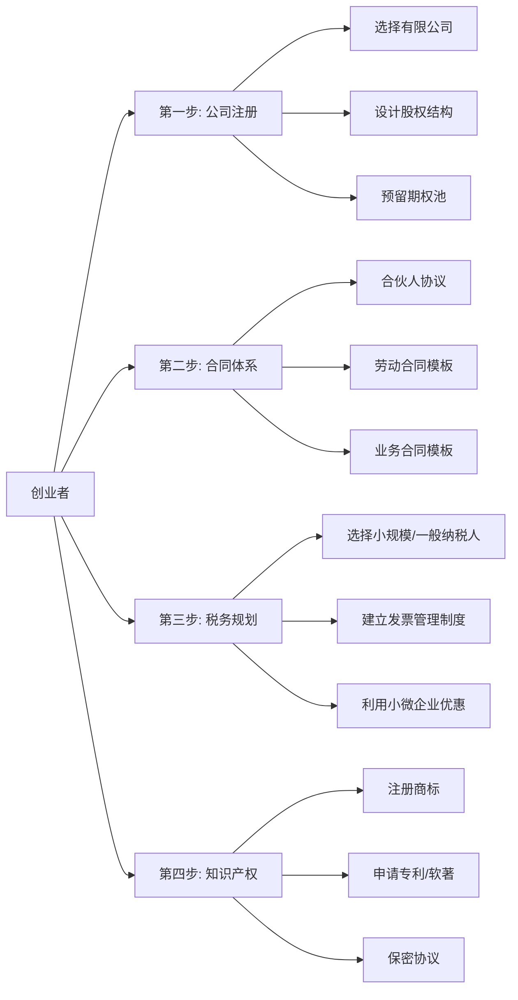
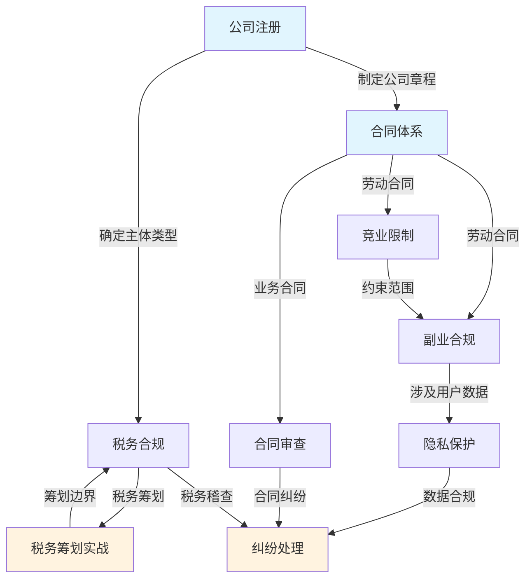

## 十一、核心技巧篇总结

核心技巧篇是整章"道法术器"体系中的**"术"**——理论基础篇告诉你"为什么"，核心技巧篇告诉你"怎么做"。本篇围绕搞钱过程中最高频的九个法律实操场景，提供了一套从公司注册到纠纷处理的完整操作手册。

本节作为核心技巧篇的收尾，将九个子章节的精华浓缩为一张**全景速查图**和**分场景行动清单**，方便你在实际遇到法律问题时快速定位、即查即用。

### 1. 核心技巧全景图

```mermaid
graph TD
    A[核心技巧篇] --> B[公司注册技巧]
    A --> C[合同审查技巧]
    A --> D[税务合规技巧]
    A --> E[竞业限制应对技巧]
    A --> F[副业合规技巧]
    A --> G[隐私保护技巧]
    A --> H[法律纠纷处理技巧]
    A --> I[税务筹划实战技巧]
    A --> J[合同签订风险防范]

    B --> B1[企业类型选择]
    B --> B2[注册流程优化]
    B --> B3[股权结构设计]

    C --> C1[20项必查条款]
    C --> C2[风险条款识别]
    C --> C3[审查清单模板]

    D --> D1[个税申报实操]
    D --> D2[专项附加扣除]
    D --> D3[合法节税工具]

    E --> E1[协议效力判断]
    E --> E2[竞业范围分析]
    E --> E3[应对策略选择]

    F --> F1[合规性检查清单]
    F --> F2[常见副业分析]
    F --> F3[风险隔离方法]

    G --> G1[个保法合规]
    G --> G2[数据安全措施]
    G --> G3[隐私政策编写]

    H --> H1[纠纷处理流程]
    H --> H2[诉讼/仲裁/调解选择]
    H --> H3[证据收集要点]

    I --> I1[10种合法节税方法]
    I --> I2[企业类型税负对比]
    I --> I3[税收优惠政策]

    J --> J1[签约前风险排查]
    J --> J2[签约中条款把控]
    J --> J3[签约后履行监控]
```

### 2. 九大技巧速查表

下表汇总了每个技巧的核心要点、适用场景和关键行动，是本篇的"一页纸速查手册"：

| 技巧编号 | 技巧名称 | 核心要点 | 适用场景 | 关键行动 |
|---------|---------|---------|---------|---------|
| 技巧一 | 公司注册技巧 | 选对企业类型是第一步 | 创业、注册公司、开工作室 | 评估业务规模→选择个体户/有限公司→优化股权结构 |
| 技巧二 | 合同审查技巧 | 逐条审查，不留盲区 | 签任何合同之前 | 用20项审查清单逐一核对，标记风险条款 |
| 技巧三 | 税务合规技巧 | 应报尽报，应扣尽扣 | 个税申报、收入增加时 | 用个税APP填报专项附加扣除，合理选择年终奖计税方式 |
| 技巧四 | 竞业限制应对技巧 | 先判断效力，再制定策略 | 签竞业协议、跳槽前 | 审查协议范围/期限/补偿，评估实际约束力 |
| 技巧五 | 副业合规技巧 | 五步合规检查，逐项过关 | 在职期间做副业前 | 检查劳动合同→竞业限制→资源使用→时间冲突→内容冲突 |
| 技巧六 | 隐私保护技巧 | 收集最小化，保护最大化 | 涉及用户数据的任何业务 | 制定隐私政策、数据分级、加密存储、定期审计 |
| 技巧七 | 法律纠纷处理技巧 | 先协商，后仲裁，最后诉讼 | 发生合同/劳动/知识产权纠纷 | 固定证据→评估成本→选择解决路径→执行到底 |
| 技巧八 | 税务筹划实战技巧 | 合法节税≠偷税漏税 | 收入增加、税负较重时 | 利用公积金/个人养老金/公益捐赠/企业架构优化 |
| 技巧九 | 合同签订风险防范 | 签前排查、签中把控、签后监控 | 签订任何合同的全过程 | 前期尽调→中期条款谈判→后期履约跟踪 |

### 3. 按场景分类的行动指南

不同搞钱场景面临不同的法律风险组合。以下是四种典型身份的**优先行动清单**：

#### 3.1 创业者优先行动

**创业者核心清单**：
- 注册前：确定企业类型（有限责任公司为首选），设计股权结构（避免50:50僵局），签订书面合伙协议
- 运营中：建立合同模板体系，按时纳税申报，保护知识产权（商标/专利/著作权）
- 扩张期：融资前做好股权稀释规划，员工入职签竞业限制和保密协议，数据合规先行

#### 3.2 上班族优先行动

**上班族核心清单**：
- 入职时：仔细审查劳动合同，特别关注竞业限制条款、知识产权归属条款、违约金条款
- 在职中：做副业前完成五步合规检查（劳动合同→竞业限制→资源使用→时间冲突→内容冲突）
- 离职时：确认竞业限制是否生效（用人单位需按月支付补偿金），保存工资单和工作记录作为证据
- 报税时：每年3-6月完成个税年度汇算，填报全部专项附加扣除，合理选择年终奖计税方式

#### 3.3 自由职业者优先行动

**自由职业者核心清单**：
- 业务起步：注册个体工商户或个人独资企业，获取合规经营资质
- 接单签合同：每单必签书面合同，明确交付标准、付款节点、违约责任、知识产权归属
- 税务管理：了解经营所得申报流程（次年3月31日前），考虑核定征收的适用条件
- 隐私保护：如涉及客户数据，签署保密协议，使用加密工具存储敏感信息

#### 3.4 投资者优先行动

**投资者核心清单**：
- 投资前：识别非法集资特征（承诺保本高收益、面向不特定公众、无正规牌照）
- 签约时：审查投资合同的核心条款（退出机制、分红条款、信息披露义务、违约责任）
- 持有中：关注被投企业的合规状况，保留投资凭证和沟通记录
- 退出时：了解股权转让的法律程序和税务影响

### 4. 法律风险等级矩阵

不同法律风险的发生概率和损失程度不同。以下矩阵帮助你**用有限的精力覆盖最大的风险**：

| 风险等级 | 发生概率 | 损失程度 | 典型风险 | 应对策略 |
|---------|---------|---------|---------|---------|
| **极高** | 高 | 高 | 税务违规、竞业限制违反、数据泄露 | 必须立即建立防控机制 |
| **高** | 中 | 高 | 合同陷阱、股权纠纷、知识产权侵权 | 签约前必审，留存证据 |
| **中** | 高 | 中 | 劳动争议、广告违规、消费者投诉 | 建立标准化流程 |
| **低** | 低 | 低 | 轻微合同瑕疵、格式条款争议 | 了解基本规则即可 |

**核心原则**：**先防高概率高损失的风险，再覆盖低概率高损失的风险，最后处理低损失的风险。** 对于搞钱人来说，税务合规和合同审查是最优先的两个领域——前者出问题直接罚款，后者出问题可能血本无归。

### 5. 各技巧之间的关联关系

法律合规不是孤立的知识点，而是一个**互相咬合的齿轮系统**。理解各技巧之间的关联，才能做到系统性防控：

**关键关联解读**：

1. **公司注册 → 税务合规**：企业类型直接决定适用的税种和税率。个体工商户可核定征收，有限公司查账征收，个人独资企业在特定场景下有税务优势。注册时的选择，决定了后续税务合规的难度和成本。

2. **合同审查 → 竞业限制 → 副业合规**：这三者构成了一条"劳动法律链条"。入职时签的劳动合同和竞业协议，直接决定了你能不能做副业、能做什么副业。审查合同时就要预判竞业限制的影响。

3. **隐私保护 → 纠纷处理**：数据泄露一旦发生，既面临行政处罚（最高5000万元或年营业额5%），又面临民事赔偿。事前的隐私保护投入，远低于事后的纠纷处理成本。

4. **税务筹划 → 税务合规**：筹划和合规是一体两面。合法节税的前提是完全合规，任何"擦边"操作都可能被认定为偷逃税。筹划必须在合规的框架内进行。

### 6. 关键工具与模板速查

核心技巧篇涉及的实操工具和模板汇总如下，方便日常使用：

| 工具/模板 | 用途 | 使用频率 | 获取方式 |
|----------|------|---------|---------|
| 个税APP | 个税申报、专项附加扣除填报 | 每年至少2次 | 应用商店下载 |
| 20项合同审查清单 | 签合同前逐项检查 | 每次签约 | 见技巧二 |
| 副业合规五步检查表 | 做副业前的合规自检 | 每次开展新副业 | 见技巧五 |
| 企业类型选择决策图 | 注册公司时选择企业类型 | 创业时一次性 | 见技巧一 |
| 年终奖计税选择器 | 决定年终奖单独计税还是并入综合所得 | 每年1次 | 见技巧三 |
| 法律纠纷处理流程图 | 发生纠纷后的处理路径选择 | 按需 | 见技巧七 |
| 税收优惠匹配表 | 匹配适用的税收优惠政策 | 年度税务规划时 | 见技巧八 |
| 合同签订三阶段清单 | 签约前/中/后的风险控制 | 每次签约 | 见技巧九 |

### 7. 常见问题速答

以下是搞钱过程中最高频的法律问题及简明回答，详细内容请查阅对应技巧章节：

**Q1：我应该注册个体工商户还是有限责任公司？**
A：年营收50万以下、无融资需求、无合伙人→个体工商户（注册简单，核定征收）。其他情况→有限责任公司（有限责任保护，便于融资扩展）。详见技巧一。

**Q2：签合同时最容易踩的坑是什么？**
A：三个高频雷区——（1）违约金条款不对等（你违约赔10倍，对方违约不赔）；（2）知识产权归属不清（你写的代码/文案，著作权归对方）；（3）争议解决条款不利（约定在对方所在地法院诉讼）。详见技巧二和技巧九。

**Q3：做副业被公司发现了怎么办？**
A：取决于副业是否合规。如果你的副业不违反劳动合同、不涉及竞业限制、不使用公司资源、不在工作时间进行，公司无权干涉。但如果违反了上述任一条，公司可以解除劳动合同且不支付经济补偿。预防胜于补救，做副业前务必完成五步合规检查。详见技巧五。

**Q4：年终奖应该选择单独计税还是并入综合所得？**
A：没有统一答案，需要分别计算两种方式的税额后取低。简单判断：如果你的年终奖较高而月薪较低（月薪不超过起征点），单独计税通常更优；反之并入综合所得可能更省税。详见技巧三。

**Q5：竞业限制协议签了就一定要遵守吗？**
A：不一定。竞业限制生效需要满足三个条件——（1）范围合理（不能限制你从事任何工作）；（2）期限不超过2年；（3）用人单位按月支付补偿金（通常不低于离职前12个月平均工资的30%）。如果用人单位超过3个月不支付补偿金，你可以请求法院解除竞业限制。详见技巧四。

**Q6：个人收入多少需要缴税？如何合法少缴？**
A：综合所得年收入超过6万元（扣除起征点后）即需缴纳个税。合法节税的核心路径——（1）最大化专项附加扣除（子女教育、房贷/房租、赡养老人等）；（2）提高公积金缴存比例（5%-12%，税前扣除）；（3）每年缴纳个人养老金（上限12000元）；（4）合理选择年终奖计税方式。详见技巧三和技巧八。

### 8. 从技巧到习惯：法律合规的日常化

掌握技巧只是第一步，真正的合规能力来自于**将法律意识融入日常决策习惯**。以下是三个核心习惯：

**习惯一：签前必审**
每次签署任何文件（合同、协议、授权书、确认函）之前，花10分钟用审查清单过一遍。这个习惯能帮你规避80%以上的合同风险。不需要每次都请律师，但一定要自己过一遍关键条款。

**习惯二：收入必报**
任何收入（工资、稿费、劳务报酬、投资收益、副业收入）都要纳入税务考量。不是说每笔收入都要立刻缴税，而是要清楚每笔收入的税务处理方式，到申报季不遗漏。遗漏申报的代价远高于主动补缴。

**习惯三：证据必留**
重要的沟通（尤其是涉及金额、承诺、变更的内容）尽量留有书面记录。微信聊天记录、邮件、合同、收据、转账凭证——这些在纠纷发生时就是你的"法律武器"。养成习惯：口头约定后补一条确认消息，大额交易保留完整凭证链。

### 9. 进阶路径

核心技巧篇是"术"的层面，适合解决具体问题。如果你希望进一步提升法律能力，以下是进阶路径：

| 阶段 | 目标 | 学习内容 | 建议时间 |
|------|------|---------|---------|
| 入门 | 避免踩坑 | 核心技巧篇（本篇） | 1-2天 |
| 进阶 | 系统防控 | 理论基础篇（理解法律框架）+ 实战案例篇（学习真实教训） | 3-5天 |
| 高级 | 主动管理 | 常见误区篇（纠正错误认知）+ 练习方法篇（内化能力） | 2-3天 |
| 专业 | 持续合规 | 关注法规更新 + 建立个人/企业合规体系 | 持续 |

**核心认知升级**：

- **入门者**认为法律是"出了事才需要的东西"→ 学完技巧篇后知道法律是"做事之前的必备准备"
- **进阶者**能够"遇到问题知道查哪条法律"→ 学完理论基础后能"预判风险提前布局"
- **高级者**能"独立完成合规检查和风险评估"→ 通过案例和误区学习建立"法律直觉"
- **专业者**能"设计合规体系，指导他人规避风险"→ 持续学习保持法律知识的时效性

### 10. 本篇一句话总结

> **法律合规的本质不是限制你搞钱，而是保护你搞到的钱不被法律问题吞掉。** 花在法律合规上的每一小时，都是在为你的财富大厦加固地基。从今天起，把"签前必审、收入必报、证据必留"变成你的肌肉记忆。
