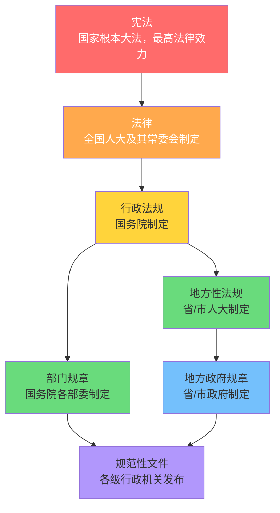
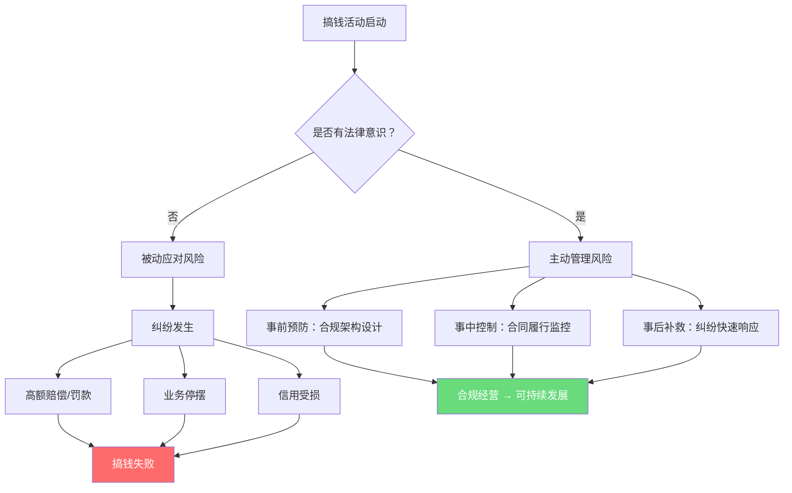
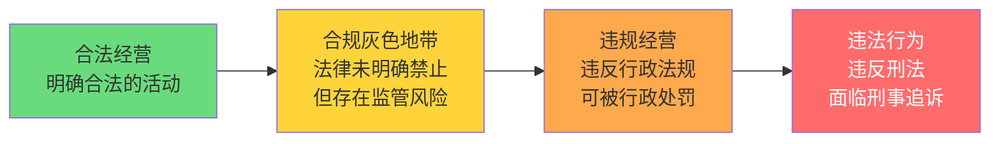
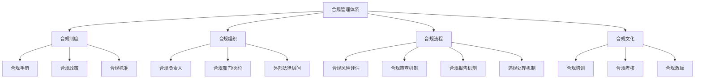
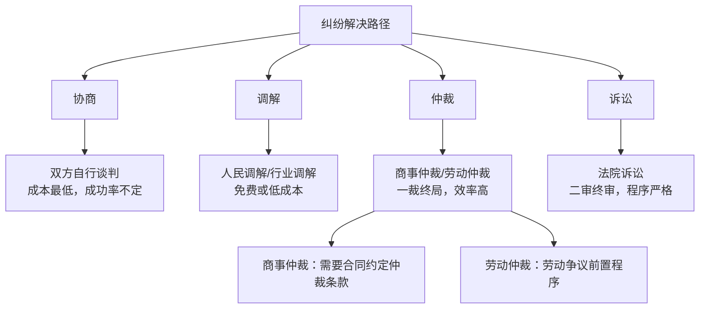
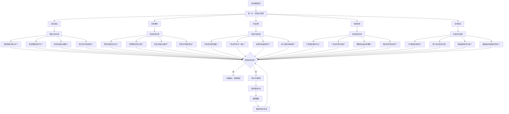
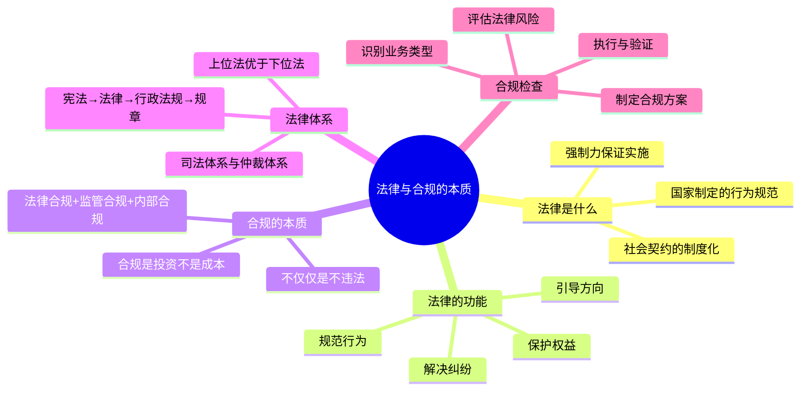

## 一、法律与合规的本质

搞钱之前，先搞懂规则。法律不是束缚你手脚的绳索，而是你在商业丛林中生存的基本装备。本节从最底层讲起：法律到底是什么？合规到底在做什么？搞钱的人为什么必须理解这两件事？

### 1.1 法律是什么

#### 1.1.1 法律的定义与本质

法律是由国家制定或认可、以国家强制力保证实施的行为规范总和。这个定义包含三个关键要素：

| 要素 | 含义 | 对搞钱者的意义 |
|------|------|--------------|
| 国家制定或认可 | 法律来源于立法机关的立法活动，或对习惯法的正式承认 | 你不能说"我不知道有这条法律"就不遵守 |
| 国家强制力保证 | 违法会受到国家机器的制裁 | 法律不是建议，是强制性约束 |
| 行为规范总和 | 法律规范的是人的行为，不是思想 | 你心里怎么想不重要，关键是你做了什么 |

法律的本质是**社会契约的制度化表达**。在一个社会中，人们让渡一部分自由给国家，换取秩序和保护。你注册公司、签订合同、申报税务，本质上都是在法律框架内行使权利、履行义务。

#### 1.1.2 法律的四大功能

**规范功能**：法律告诉你可以做什么、不能做什么、必须做什么。《公司法》规定了公司的设立条件和治理结构，《税法》规定了纳税义务和税率，《劳动法》规定了用工规范。没有法律，商业活动就没有基本规则可言。

**保护功能**：法律保护你的合法权益不受侵犯。你的知识产权被抄袭，可以用《著作权法》维权；你的合同对方违约，可以用《民法典》索赔；你的个人信息被泄露，可以用《个人信息保护法》追究责任。

**裁判功能**：当纠纷发生时，法律提供解决争议的标准和程序。法院、仲裁机构依据法律作出裁判，而不是靠谁的拳头大、谁的关系硬。

**引导功能**：法律通过奖惩机制引导社会行为方向。税收优惠政策引导投资方向，反垄断法限制市场垄断行为，环保法规推动绿色发展。搞钱的人读懂法律的引导方向，就能找到政策红利。

#### 1.1.3 法律与道德、行业规范的区别

很多人混淆法律、道德和行业规范。这三者的关系如下：

| 维度 | 法律 | 道德 | 行业规范 |
|------|------|------|----------|
| 制定主体 | 国家立法机关 | 社会自发形成 | 行业协会/监管部门 |
| 约束力 | 强制力，违法必究 | 舆论压力，违反受谴责 | 行业内约束，违规受行业处分 |
| 表现形式 | 成文法典、法规、规章 | 不成文的社会共识 | 行业标准、自律公约 |
| 最低标准 | 是——法律是道德的底线 | 高于法律——道德要求更高 | 介于两者之间 |
| 违反后果 | 罚款、拘留、判刑 | 舆论谴责、社会排斥 | 行业禁入、资质吊销 |

**关键认知**：合法不等于合规，合规不等于道德。一个行为可能合法但不道德（如利用信息差高价销售），也可能合规但不被行业接受（如钻监管灰色地带）。搞钱的人需要同时关注三个层面，但法律是底线——突破法律底线的代价最大。

#### 1.1.4 法律的层级体系

中国法律体系呈金字塔结构，下位法不得违反上位法：

**搞钱者需要关注的法律层级**：

- **法律层面**：《民法典》《公司法》《税法》《劳动法》《个人信息保护法》《电子商务法》等——这些是硬规矩，违反后果最严重
- **行政法规层面**：《市场主体登记管理条例》《发票管理办法》等——国务院颁布，实施细则
- **部门规章层面**：证监会、市监总局、税务总局等部门的具体规定——实操层面必须遵守
- **地方性法规**：各地的实施细则，比如深圳前海的特殊政策、上海自贸区的优惠措施——地方差异大，需要针对性了解

#### 1.1.5 搞钱者必须知道的法律分支

法律体系庞大，搞钱者不需要精通所有法律，但需要知道哪些法律与自己的活动相关：

| 法律分支 | 核心法律 | 与搞钱的关系 |
|----------|----------|-------------|
| 民商法 | 《民法典》合同编、《公司法》《合伙企业法》 | 创业、签合同、股权架构的基础 |
| 经济法 | 《反不正当竞争法》《反垄断法》《消费者权益保护法》 | 市场竞争行为的边界 |
| 知识产权法 | 《著作权法》《专利法》《商标法》 | 保护创意、品牌、技术 |
| 税法 | 《个人所得税法》《企业所得税法》《增值税暂行条例》 | 每笔收入都涉及税务 |
| 劳动法 | 《劳动法》《劳动合同法》《社会保险法》 | 雇人、被雇、副业都涉及 |
| 数据与隐私法 | 《个人信息保护法》《数据安全法》《网络安全法》 | 收集用户数据、运营网站/App |
| 电子商务法 | 《电子商务法》《广告法》《网络交易管理办法》 | 线上卖货、直播带货 |
| 刑法 | 《刑法》相关章节 | 合同诈骗、逃税、非法集资等红线 |

### 1.2 为什么搞钱必须懂法律

#### 1.2.1 法律风险的真实代价

法律风险不是理论概念，是真金白银的损失。以下数据来自公开的司法和行政案例：

| 风险类型 | 典型场景 | 代价量级 |
|----------|----------|----------|
| 合同陷阱 | 合同条款不明确导致纠纷 | 损失合同金额的30%-100% |
| 税务违规 | 个人收入未申报被稽查 | 补缴税款 + 0.5-5倍罚款 + 滞纳金 |
| 竞业限制 | 跳槽后违反竞业协议 | 赔偿年薪的2-3倍 |
| 知识产权侵权 | 使用未授权字体/图片 | 每张图片赔偿500-5000元 |
| 数据泄露 | 违规收集用户信息 | 最高5000万元或年营业额5% |
| 广告违规 | 使用"最好""第一"等极限词 | 罚款20万-100万元 |
| 非法集资 | 未经批准向公众募资 | 最高无期徒刑 |
| 合同诈骗 | 以虚构事实骗取财物 | 最高无期徒刑 |

#### 1.2.2 法律风险的底层逻辑

法律风险的本质是**信息不对称**。你不知道法律规定，而你的对手知道。

一个残酷的现实：法律风险往往在你不知道的时候就已经埋下。合同签完才发现有坑，税报完才发现少缴了，离职后才发现竞业协议限制很大。**事后补救的成本通常是事前预防的5-10倍**。

#### 1.2.3 不同搞钱场景的法律风险等级

| 场景 | 风险等级 | 主要风险点 | 必须了解的法律 |
|------|---------|-----------|--------------|
| 在职做副业 | ⭐⭐⭐ | 竞业限制、劳动合同违约、税务申报 | 《劳动合同法》《个人所得税法》 |
| 注册公司创业 | ⭐⭐⭐⭐ | 公司类型选择、股权架构、合同管理 | 《公司法》《民法典》合同编 |
| 电商卖货 | ⭐⭐⭐ | 产品质量、广告合规、消费者权益 | 《电子商务法》《广告法》《消保法》 |
| 内容创作变现 | ⭐⭐ | 版权侵权、广告合规、税务申报 | 《著作权法》《广告法》 |
| 投资理财 | ⭐⭐⭐⭐ | 非法集资识别、内幕交易、资金安全 | 《证券法》《基金法》 |
| 开发App/网站 | ⭐⭐⭐ | 数据隐私、用户协议、ICP备案 | 《个保法》《网络安全法》 |
| 跨境业务 | ⭐⭐⭐⭐⭐ | 外汇管制、跨境税务、出口管制 | 《外汇管理条例》《海关法》 |

### 1.3 合规的本质

#### 1.3.1 什么是合规

合规（Compliance）是指企业的经营管理行为符合法律法规、监管规定、行业准则和企业章程、规章制度以及国际条约、规则等要求。

合规不仅仅是"不违法"，它包含三个层次：

| 层次 | 内容 | 举例 |
|------|------|------|
| 法律合规 | 遵守国家法律法规 | 依法纳税、签订劳动合同 |
| 监管合规 | 遵守监管部门的具体要求 | 金融牌照、食品经营许可 |
| 内部合规 | 遵守企业自身的规章制度 | 财务审批流程、采购制度 |

对个人搞钱者而言，合规意味着你的每一笔收入、每一项业务活动都有法律依据，经得起审查。

#### 1.3.2 合规与违法的边界

很多搞钱者最困惑的问题是：合法经营和违法经营的边界在哪里？

**合法 → 合规灰色地带 → 违法 的光谱**：

**合法经营**：依法注册、依法纳税、合同规范、产品合规——这是基本盘。

**合规灰色地带**：法律没有明确禁止，但也没有明确允许。比如某些新型商业模式（社交电商、知识付费分销）、某些税务筹划方案、某些数据使用方式。灰色地带不是不能做，但需要控制风险敞口，做好预案。

**违规经营**：违反行政法规但不构成犯罪。比如超范围经营、未按规定公示信息、使用违规广告用语。后果通常是罚款、责令整改。

**违法行为**：触犯刑法。比如合同诈骗、逃税、非法集资、洗钱。后果是刑事追诉，最高可判无期徒刑。

#### 1.3.3 合规的经济价值

合规不是成本，是投资。以下是合规带来的直接经济回报：

| 合规投入 | 回报 |
|----------|------|
| 花2000元请律师审查合同 | 避免数十万甚至数百万的合同纠纷损失 |
| 花5000元做税务筹划 | 合法节税数万至数十万元 |
| 花1万元注册商标 | 保护品牌价值，避免被抢注后花数十万回购 |
| 花3000元做隐私合规 | 避免最高5000万元的罚款 |
| 花2000元审查广告文案 | 避免20万-100万元的广告违规罚款 |

**一个真实案例**：某电商卖家使用"全网最低价"宣传语，被市场监管部门认定为虚假宣传，罚款30万元。而审查一句广告文案的成本不到1000元。

#### 1.3.4 合规管理体系框架

对于有一定规模的搞钱活动（创业、经营企业），建立合规管理体系是必要投入：

**个人搞钱者的简化版合规清单**：

1. **收入合规**：所有收入是否依法申报纳税？是否有合法的收入来源证明？
2. **合同合规**：所有业务往来是否有书面合同？合同条款是否经过审查？
3. **经营合规**：是否取得了必要的经营许可和资质？经营范围是否覆盖实际业务？
4. **数据合规**：是否合法收集和使用用户/客户数据？是否有隐私政策？
5. **劳动合规**：如有雇员，是否签订劳动合同、缴纳社保？
6. **知识产权合规**：使用的素材、技术是否有合法授权？自有知识产权是否已注册保护？
7. **广告合规**：宣传内容是否真实？是否使用了违禁用语？

### 1.4 中国法律体系概览

#### 1.4.1 立法机关与法律效力

| 层级 | 制定主体 | 效力 | 举例 |
|------|----------|------|------|
| 宪法 | 全国人民代表大会 | 最高 | 《中华人民共和国宪法》 |
| 法律 | 全国人大及其常委会 | 高 | 《民法典》《公司法》《刑法》 |
| 行政法规 | 国务院 | 中高 | 《市场主体登记管理条例》 |
| 地方性法规 | 省/市人大及其常委会 | 中（本行政区域内） | 《上海市优化营商环境条例》 |
| 部门规章 | 国务院各部委 | 中 | 《网络交易监督管理办法》 |
| 司法解释 | 最高法/最高检 | 中（指导审判） | 关于适用《民法典》的解释 |

**效力规则**：上位法优于下位法；同位阶的法律，特别规定优于一般规定，新法优于旧法。

#### 1.4.2 司法体系

中国司法体系分为法院系统和仲裁系统两条路径：

**搞钱者需要知道的**：

- **民事诉讼**：标的额在各基层法院管辖范围内的一审案件由基层法院管辖。诉讼时效一般为3年（自知道或应当知道权利被侵害之日起计算）
- **劳动仲裁**：劳动争议必须先经劳动仲裁，对裁决不服才能起诉。仲裁时效为1年
- **商事仲裁**：需要在合同中约定仲裁条款。优势是保密性强、效率高、一裁终局
- **行政复议/诉讼**：对行政处罚不服，可以先申请行政复议，再提起行政诉讼

#### 1.4.3 执法机构

搞钱者需要知道哪些机构可能来管你：

| 机构 | 管辖范围 | 常见处罚场景 |
|------|----------|-------------|
| 市场监督管理局 | 市场主体登记、广告、反不正当竞争、消费者权益 | 虚假宣传、无照经营、产品质量问题 |
| 税务局 | 税收征管 | 偷税漏税、虚开发票、未按规定申报 |
| 人力资源和社会保障局 | 劳动关系、社会保险 | 未签劳动合同、欠薪、社保违规 |
| 网信办 | 网络安全、数据保护、内容管理 | 违规收集个人信息、传播违法信息 |
| 知识产权局 | 专利、商标 | 专利侵权、商标抢注 |
| 公安机关 | 刑事犯罪侦查 | 合同诈骗、非法集资、洗钱 |
| 海关 | 进出口监管 | 走私、逃税、违规报关 |
| 证监会 | 证券期货市场监管 | 内幕交易、操纵市场、虚假陈述 |

### 1.5 合规检查流程

#### 1.5.1 搞钱活动合规自检流程

在开展任何搞钱活动之前，按以下流程进行合规自检：

#### 1.5.2 合规风险评估矩阵

对识别出的每个合规风险，用以下矩阵评估优先级：

| | 影响程度低 | 影响程度中 | 影响程度高 |
|---|----------|----------|----------|
| **发生概率高** | 中优先级：制定应对方案 | 高优先级：立即整改 | 紧急：暂停活动，优先解决 |
| **发生概率中** | 低优先级：持续监控 | 中优先级：制定应对方案 | 高优先级：立即整改 |
| **发生概率低** | 可接受：定期检查 | 低优先级：持续监控 | 中优先级：制定应对方案 |

#### 1.5.3 合规整改的执行步骤

当发现不合规项时，按以下步骤整改：

1. **识别问题**：明确不合规的具体内容和涉及的法律法规
2. **评估风险**：判断不合规的严重程度和可能的处罚
3. **制定方案**：确定整改的具体措施、责任人、时间节点
4. **执行整改**：按方案落实整改措施
5. **验证效果**：确认整改是否到位，是否引入新的合规风险
6. **文档记录**：保留整改过程的文档记录，作为合规证据

### 1.6 常见误区

#### 误区一："我不知道有这条法律"

**真实情况**：法律一经公布即生效，"不知法"不是免责理由。《刑法》明确规定，法律认识错误不影响定罪量刑。《行政处罚法》也规定，当事人不得以不知道法律规定为由免除行政处罚。

**正确做法**：在开展任何搞钱活动之前，主动了解相关法律法规。至少知道自己活动涉及哪些法律领域，然后针对性学习或咨询专业人士。

#### 误区二："大家都这么干，没问题"

**真实情况**：违法行为不会因为参与者众多就变成合法。很多行业的"潜游规则"实际上都是违法的，只是监管部门尚未查处。一旦严查，所有参与者都要承担法律后果。

**典型案例**：2021年之前，很多教培机构都存在超前教学、虚假宣传等问题，行业"默认"可以这么做。"双减"政策出台后，大量机构因违规经营被处罚或关停。

**正确做法**：不以行业惯例为合规标准，以法律法规为准绳。

#### 误区三："小本生意没人管"

**真实情况**：监管覆盖面越来越广，技术手段越来越先进。税务系统金税四期可以追踪个人和企业的资金流，市场监管局的线上巡查系统可以自动识别违规广告，网信办的数据监测可以发现违规收集个人信息的行为。

**正确做法**：不管规模大小，基本合规是底线。个体工商户也需要办理营业执照、依法纳税、签订合同。

#### 误区四："签了合同就万事大吉"

**真实情况**：合同的效力取决于条款是否合法、是否真实表达了双方意愿、是否违反强制性规定。很多看似完善的合同，因为条款违法、显失公平或存在重大误解，被法院认定为无效或可撤销。

**正确做法**：签合同之前，至少审查关键条款（标的、价格、违约责任、争议解决、知识产权归属）是否明确、合法、公平。

#### 误区五："合规太贵了，小生意负担不起"

**真实情况**：基础合规的成本远低于违法的代价。办理营业执照免费，税务登记免费，合同模板网上可以找到很多免费资源，12348法律热线免费咨询。

**正确做法**：区分"必须投入的合规"和"锦上添花的合规"。基础合规（注册、纳税、合同）是必须的，高级合规（知识产权布局、数据合规体系）可以随着业务发展逐步完善。

### 1.7 本节核心要点

**一句话总结**：法律是搞钱的游戏规则，合规是遵守规则的系统方法。不懂规则的玩家，赢面为零。

***

> **下一步**：理解了法律与合规的本质后，下一节将进入具体的创业法律基础——公司类型选择、注册流程、股权架构设计，这些是搞钱路上第一道法律关卡。
