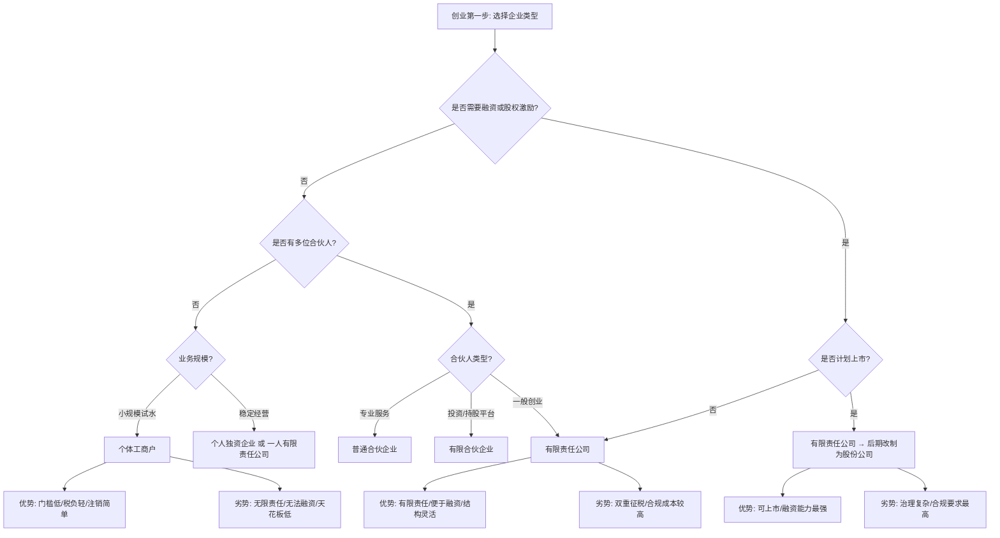
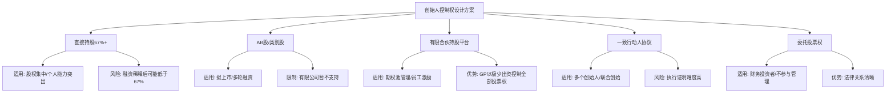

## 二、创业法律基础

创业的第一步不是写商业计划书，而是搞清楚法律框架。选错企业类型可能导致多缴几十万税款，股权设计失误可能让你被踢出自己创办的公司，融资协议里一个条款可能让你失去公司控制权。本节从法律视角系统梳理创业必须掌握的基础知识，帮你建立合规经营的底层认知。

### 2.1 企业组织形式的法律分类

中国法律体系下，创业者可选择的企业组织形式主要有五种。每种形式在法律责任、税收待遇、融资能力、管理复杂度等方面差异显著，选错形式的代价往往在创业中后期才暴露出来。

#### 2.1.1 五种企业形式对比

| 维度 | 个体工商户 | 个人独资企业 | 合伙企业（普通/有限） | 有限责任公司 | 股份有限公司 |
|------|-----------|-------------|---------------------|-------------|-------------|
| **法律依据** | 《个体工商户条例》 | 《个人独资企业法》 | 《合伙企业法》 | 《公司法》 | 《公司法》 |
| **法律人格** | 无独立法人资格 | 无独立法人资格 | 无独立法人资格 | 独立法人 | 独立法人 |
| **责任形式** | 无限责任 | 无限责任 | 普通合伙人无限连带 / 有限合伙人以出资为限 | 以认缴出资为限 | 以认购股份为限 |
| **投资者人数** | 1人（家庭经营可多人） | 1人 | 2人以上（有限合伙2-50人） | 1-50人（一人公司1人） | 2-200人发起人 |
| **企业所得税** | 不缴纳（缴个人经营所得税） | 不缴纳（穿透征税） | 不缴纳（穿透征税） | 缴纳25%企业所得税 + 股东分红20%个税 | 缴纳25%企业所得税 + 股东分红20%个税 |
| **融资能力** | 极弱 | 弱 | 中等 | 较强 | 最强（可上市） |
| **决策效率** | 最高 | 高 | 中等 | 中等（需股东会/董事会） | 低（治理结构复杂） |
| **设立难度** | 最低 | 低 | 中等 | 中等 | 高 |
| **存续期限** | 随经营者 | 随投资人 | 协议约定 | 长期 | 长期 |

#### 2.1.2 各形式适用场景分析

**个体工商户**——适合小规模试水：

个体工商户是门槛最低的经营形式，注册快（最快当天出证）、注销简单、税务可核定征收。适合以下场景：个人开店（餐饮、零售）、自由职业者接单、电商初期试水、兼职副业。但要注意，个体工商户承担无限责任——如果经营亏损，你的个人财产（房子、车子、存款）都可能被用于偿还债务。另外，个体工商户无法引入投资人、无法做股权融资，天花板明显。

**个人独资企业**——适合特定专业服务：

与个体工商户类似，但可以使用"企业"名义签订合同、开设对公账户。适合律师、会计师、设计师等专业人士独立执业。最大优势是税务穿透——企业利润直接按个人经营所得纳税，税率5%-35%超额累进，无需缴纳企业所得税。在特定税收洼地（如某些地方的核定征收政策），综合税负可低至3%-5%。但注意，2024年后多地收紧核定征收政策，查账征收已成为趋势。

**合伙企业**——适合专业服务机构和投资基金：

合伙企业分为普通合伙和有限合伙两种。普通合伙中所有合伙人都承担无限连带责任，适合律师事务所、会计师事务所等专业机构。有限合伙中，普通合伙人（GP）承担无限责任并负责管理，有限合伙人（LP）以出资为限承担责任但不参与管理——这种结构被广泛用于私募股权基金和员工持股平台。

有限合伙的核心价值在于：GP可以用极少出资（通常1%）控制整个基金，LP享受收益但不干预决策。这也是为什么几乎所有VC/PE基金都采用有限合伙形式。

**有限责任公司**——大多数创业者的首选：

有限责任公司是创业最常用的形式，核心优势是"有限责任"——股东以认缴出资为限承担责任，公司债务不会波及个人财产（除非存在人格混同等例外情况）。有限责任公司可以引入多个股东、设立董事会和监事会、做股权激励、接受风险投资。绝大多数创业公司从有限责任公司起步，在准备上市时改制为股份有限公司。

**股份有限公司**——适合需要上市的企业：

股份有限公司的资本划分为等额股份，可以公开发行股票、上市交易。设立门槛最高（发起人2-200人、注册资本500万以上），治理结构最复杂（必须设董事会5-19人、监事会不少于3人）。普通创业者不需要直接设立股份有限公司，通常在获得多轮融资、准备IPO时，才会从有限责任公司改制为股份有限公司。

#### 2.1.3 企业类型选择决策流程



#### 2.1.4 容易踩的坑

**坑一：一人有限责任公司的财产混同风险。**

《公司法》第23条第3款规定，一人有限责任公司的股东不能证明公司财产独立于股东自己的财产的，应当对公司债务承担连带责任。这意味着，如果你是一人公司的唯一股东，一旦公司被起诉，你需要自证公司财产和个人财产没有混同。如果账目不清、公私不分，法院很可能判你承担连带责任——等于有限责任变成了无限责任。

应对方法：严格区分公司账户和个人账户，保留完整的财务记录，每年做审计报告。

**坑二：个体工商户"无限责任"的实际含义。**

很多人觉得个体工商户的"无限责任"只是理论上的风险，实际上当你的经营规模扩大到一定程度（比如雇了5个以上员工、年营收超过100万），一旦发生产品责任纠纷、劳动纠纷或债务纠纷，个人财产被执行的风险是真实存在的。

**坑三：合伙企业中普通合伙人的连带责任。**

在普通合伙企业中，任何一个合伙人签订的合同，其他合伙人都要承担连带责任。如果你的合伙人背着你签了一份巨额合同，你也要共同偿还。这就是为什么选择合伙人比选择企业类型更重要。

### 2.2 公司注册的法律要素

公司注册不是填几张表那么简单，每一个注册要素都涉及法律权利义务的分配。以下逐一分析关键注册要素的法律含义和实操要点。

#### 2.2.1 公司名称

公司名称由四部分组成：行政区划 + 字号 + 行业 + 组织形式，例如"北京字节跳动科技有限公司"。字号是公司名称的核心标识，也是商标保护的基础。

**法律要点**：

- 字号不得与同行业已注册企业相同或近似（《企业名称登记管理规定》）
- 不得使用国家名称、党政机关名称、社会团体名称等
- 不得含有可能对公众造成欺骗或误解的内容
- 字号核准后保留期为2个月（各地略有不同），逾期需重新核准
- 建议同步注册商标，防止字号被他人抢注

**实操建议**：准备3-5个备选字号，优先使用2-4个字的独创性词汇（如"华为""小米"），避免使用通用词汇（如"科技""创新"）。先在国家企业信用信息公示系统（www.gsxt.gov.cn）查询是否已被注册，再在商标局网站查询是否已被注册为商标。

#### 2.2.2 经营范围

经营范围决定了公司可以从事的业务活动，也是税务机关确定税种和税率的依据。

**法律要点**：

- 经营范围分为一般经营项目和许可经营项目
- 一般经营项目：取得营业执照后即可经营
- 许可经营项目：需取得相关许可证后方可经营，分为前置审批（先办许可证再注册公司）和后置审批（先注册公司再办许可证）
- 超越经营范围签订的合同不一定无效，但可能面临行政处罚

**常见需要前置审批的行业**：

| 行业 | 审批部门 | 许可证名称 |
|------|---------|-----------|
| 金融/银行 | 银保监会 | 金融许可证 |
| 证券/期货 | 证监会 | 经营证券期货业务许可证 |
| 医疗器械 | 药监局 | 医疗器械经营许可证 |
| 食品销售 | 市场监管局 | 食品经营许可证 |
| 药品销售 | 药监局 | 药品经营许可证 |
| 教育培训 | 教育局 | 办学许可证 |
| 出版/影视 | 出版署/广电局 | 出版许可证/影视制作许可证 |
| 电信业务 | 工信部 | 增值电信业务经营许可证（ICP/EDI） |

**填写技巧**：参考同行业上市公司的经营范围（可在巨潮资讯网查询其年报），宁可多写不要少写。建议在主营业务之外，加上"技术咨询""技术推广""企业管理咨询"等通用项目，为未来业务扩展留余地。但不要写与实际业务无关的项目，以免增加不必要的税务和监管负担。

#### 2.2.3 注册资本

2014年《公司法》修订后实行注册资本认缴制，股东可以自主约定出资额、出资方式和出资期限，无需一次性实缴。但这不意味着注册资本可以随便写。

**法律要点**：

- 注册资本 = 股东承诺向公司投入的资本总额
- 认缴制下，股东以其认缴的出资额为限对公司承担责任
- 如果公司破产清算，股东需补缴未实缴的注册资本来偿还公司债务
- 2024年新《公司法》要求5年内完成实缴（2024年7月1日起施行）

**注册资本设置参考**：

| 业务类型 | 建议注册资本 | 理由 |
|---------|------------|------|
| 咨询/服务类 | 10-100万 | 轻资产，无需大额资金 |
| 电商/零售 | 50-200万 | 需要一定供应商信任 |
| 科技/互联网 | 100-500万 | 融资时投资方会关注 |
| 建筑/工程 | 500万以上 | 招投标有资质门槛 |
| 金融类 | 1000万以上 | 监管有最低要求 |

**关键提醒**：

- 注册资本不是越高越好。注册资本1000万，意味着你最多承担1000万的有限责任——如果公司负债2000万，你只需补缴1000万，但如果注册资本写了1亿，你就要补缴1亿。
- 2024年新《公司法》第47条规定，有限责任公司全体股东认缴的出资额应自公司成立之日起5年内缴足。对于存量公司，国务院已出台过渡期安排（至2032年6月30日前调整出资期限）。这意味着认缴制的"无限期认缴"时代结束了。

#### 2.2.4 注册地址

注册地址是公司的法定住所地，决定了公司的管辖法院和税务归属。

**法律要点**：

- 注册地址必须是真实存在的地址，不得使用虚假地址
- 住宅可以作为注册地址（需提供住所使用证明，部分城市需业委会或居委会同意）
- 虚拟地址/集群注册地址在特定区域合法（如各地的创业园区、孵化器）
- 注册地址与实际经营地址不一致的，可能被列入经营异常名录

**选择建议**：

- 初创期可使用孵化器或众创空间提供的注册地址（年费通常2000-5000元）
- 注意该地址是否能接收工商、税务的信函和上门检查
- 有条件的话，注册在有税收优惠的区域（如海南自由贸易港、西部大开发区域、各地高新区）

#### 2.2.5 法定代表人

法定代表人是代表公司行使职权的负责人，通常是执行董事或总经理。

**法律风险**：

- 公司被列为失信被执行人时，法定代表人会被限制高消费（不能坐飞机、高铁商务座、住星级酒店）
- 公司欠税时，法定代表人可能被限制出境
- 公司涉及刑事犯罪时，法定代表人可能承担刑事责任（如虚开发票罪、拒不支付劳动报酬罪）
- 法定代表人因执行职务造成他人损害的，由公司承担民事责任

**重要提醒**：不要轻易答应别人让你当法定代表人。很多人觉得"挂名法代"只是走个形式，但实际上法定代表人承担的法律风险是实实在在的。如果你是合伙人之间约定"你当法定代表人"，一定要在公司章程和股东协议中明确约定法定代表人的权限范围、退出机制和免责条款。

#### 2.2.6 公司章程

公司章程是公司的"宪法"，规定了公司的组织架构、股东权利义务、利润分配方式等核心事项。很多创业者直接使用工商局的模板章程，这是一个巨大的错误。

**公司章程的法律效力**：

- 《公司法》第5条规定：公司章程对公司、股东、董事、监事、高级管理人员具有约束力
- 公司章程的约定优先于公司法的任意性规定（强制性规定除外）
- 股东之间的纠纷，法院首先看公司章程怎么约定

**必须在章程中明确的核心条款**：

| 条款 | 法律意义 | 模板章程的缺陷 |
|------|---------|--------------|
| 利润分配 | 决定股东如何分红 | 通常按出资比例，无法体现贡献差异 |
| 表决权 | 决定谁说了算 | 通常按出资比例，创始人可能失去控制权 |
| 股权转让限制 | 防止股东随意退出 | 通常没有限制条款 |
| 优先购买权 | 保护现有股东 | 通常只有简单规定 |
| 竞业禁止 | 防止股东做同行 | 通常没有规定 |
| 退出机制 | 股东退出时如何处理股权 | 通常没有规定，导致僵局 |
| 反稀释条款 | 保护早期股东比例 | 通常没有规定 |
| 僵局处理 | 股东意见不合怎么办 | 通常没有规定 |

### 2.3 股权架构设计

股权架构是创业公司最重要的法律结构，它决定了谁控制公司、谁分享利润、谁承担风险。股权架构一旦定下来，修改成本极高（需要全体股东同意），所以必须在创业之初就设计好。

#### 2.3.1 股权比例的法律含义

不同持股比例对应不同的法律权利，这是《公司法》明确规定的：

| 持股比例 | 法律权利 | 具体含义 |
|---------|---------|---------|
| **≥67%** | 绝对控制权 | 可以单独修改公司章程、增减注册资本、合并/分立/解散公司等重大事项（需代表2/3以上表决权的股东通过） |
| **≥51%** | 相对控制权 | 可以决定一般经营事项（普通决议需过半数表决权通过），如选举董事、批准预算、决定利润分配方案 |
| **≥34%** | 一票否决权 | 可以阻止需要2/3以上表决权通过的重大事项，虽然不能主动推动决策，但能阻止你不同意的决策 |
| **≥10%** | 临时提案权 | 可以提议召开临时股东会、提出临时提案；在公司经营管理发生严重困难时，可以请求法院解散公司 |
| **≥3%** | 临时提案权（股份公司） | 股份有限公司中，持有3%以上股份的股东可以在股东大会召开10日前提出临时提案 |
| **≥1%** | 股东代表诉讼权 | 可以书面请求监事会/董事会起诉侵害公司利益的董监高，在其拒绝后以自己名义代位起诉 |

#### 2.3.2 创始人控制权设计

创始人必须确保对公司的控制权，否则辛苦创业的成果可能被他人收割。以下是几种常见的控制权设计方法：

**方法一：直接持股保持67%以上**

最简单直接的方式。创始人持有67%以上股权，拥有绝对控制权。适合个人能力突出、资源独占、不需要太多合伙人的创业项目。缺点是其他股东的参与感弱，不利于激励团队。

**方法二：AB股（双重股权结构）**

同股不同权——创始人的1股拥有10股的投票权，投资人的1股只有1股的投票权。京东、小米、拼多多等公司都采用了AB股结构。但注意，中国《公司法》目前仅允许股份有限公司（需在章程中明确规定）采用类别股制度，有限责任公司暂不支持AB股。

**方法三：有限合伙持股平台**

将团队期权池放在一个有限合伙企业中，创始人担任GP（普通合伙人），员工担任LP（有限合伙人）。GP出资1%但拥有100%的管理权和表决权。通过这种方式，创始人可以用1%的出资控制期权池对应的全部投票权。

**方法四：一致行动人协议**

多个股东签署协议，约定在股东会投票时保持一致。如果意见不一致，以创始人的意见为准。这种方式在法律上有约束力，但证明和执行难度较高。

**方法五：委托投票权**

其他股东将投票权委托给创始人行使。效果类似一致行动人协议，但法律关系更清晰。



#### 2.3.3 股权分配的常见模型

**模型一：721模型**

创始人70%，联合创始人20%，期权池10%。适合创始人主导型项目，创始人拥有绝对控制权。

**模型二：532模型**

创始人50%，联合创始人30%，期权池20%。适合双核驱动型项目，但创始人只有相对控制权，需要一致行动人协议辅助。

**模型三：433模型**

创始人40%，联合创始人30%，期权池30%。适合技术+商务双核驱动项目，创始人没有绝对控制权，需要通过章程条款（如创始人一票否决权）来保障控制力。

**期权池的法律设计**：

期权池（ESOP）通常预留10%-20%的股权，用于激励核心员工。期权池的法律载体通常有两种：

| 载体 | 优势 | 劣势 |
|------|------|------|
| 有限合伙企业 | 税务穿透、GP控制投票权、设立灵活 | 需要维护合伙企业 |
| 直接持股（代持） | 操作简单 | 代持法律风险大、无法享受税收优惠 |

建议使用有限合伙企业作为期权池载体，创始人担任GP，员工担任LP。员工离职时，其份额由GP按约定价格回购，避免股权外流。

#### 2.3.4 股权相关的法律陷阱

**陷阱一：口头承诺股权没有法律效力。**

"给你10%的股权"如果只是一句口头承诺，没有书面协议、没有工商登记，在法律上几乎无法主张。必须签订书面的股权协议，并在工商登记中体现。

**陷阱二：股权代持的法律风险。**

股权代持（实际出资人借用他人名义持股）在法律上是允许的（《公司法司法解释三》第24条），但存在以下风险：名义股东可能擅自处分股权；名义股东的债权人可能强制执行该股权；公司上市时需要清理代持关系。

**陷阱三：没有退出机制。**

合伙人中途退出，如果没有约定退出价格和方式，就会陷入僵局。退出的合伙人要求按公司估值回购，剩余合伙人觉得价格太高——这种纠纷在创业公司中极为常见。必须在创始协议中约定：退出时按什么价格回购（通常按出资额或最近一轮融资估值的折扣）、回购款什么时候支付、退出后是否还有竞业限制。

### 2.4 创始协议（股东协议）

创始协议是创业公司最重要的法律文件之一，它比公司章程更灵活、更详细，是股东之间权利义务的"私人定制"。

#### 2.4.1 创始协议必须包含的条款

**1. 出资条款**

明确每个股东的出资额、出资方式（货币、知识产权、实物等）、出资时间。特别注意：以知识产权出资的，需要经过评估作价，且知识产权出资的比例不得超过注册资本的70%（2024年新《公司法》取消了此限制，但仍建议合理评估）。

**2. 股权成熟条款（Vesting）**

股权成熟条款规定股东的股权分批获得，通常是4年期限、1年悬崖期。如果股东在悬崖期内离开，其未成熟的股权由公司或创始团队回购。

典型的Vesting安排：

```text
总期限：4年
悬崖期：1年
悬崖期后：按月/季度成熟
第1年结束：成熟25%
之后每月：成熟1/48（即每月成熟约2.08%）
```

这个条款的法律意义在于防止"搭便车"——有人拿到股权后就离开，既不出力又占股份。Vesting在中国法律下是有效的，但需要在创始协议和公司章程中同时约定。

**3. 竞业禁止条款**

约定股东在持股期间和退出后一定期限内（通常1-2年），不得从事与公司业务相同或相似的活动。竞业禁止条款的有效性取决于以下条件：
- 范围合理（不能限制所有行业）
- 期限合理（通常不超过2年）
- 有经济补偿（竞业限制期间需支付补偿金，通常不低于离职前12个月平均工资的30%）

**4. 知识产权归属条款**

约定创业过程中产生的知识产权（专利、商标、著作权、商业秘密等）归公司所有。这条极其重要——如果没有明确约定，合伙人离职后可能主张其在职期间的技术成果归个人所有。

**5. 反稀释条款**

保护早期股东在后续融资中的股权比例不被过度稀释。常见的反稀释方式：

| 方式 | 含义 | 对创始人的影响 |
|------|------|--------------|
| 完全棘轮（Full Ratchet） | 后轮估值低于前轮时，前轮投资人的价格调整为后轮价格 | 对创始人最不利，股权被大幅稀释 |
| 加权平均（Weighted Average） | 按加权平均公式调整前轮价格 | 对创始人相对公平，也是最常见的条款 |

**6. 优先清算权**

约定公司被出售或清算时，投资人优先于创始人获得回报。例如：投资人投入1000万，约定1倍优先清算权，则公司出售所得先分给投资人1000万，剩余部分再按股权比例分配。优先清算权倍数越高（通常1-3倍），对创始人越不利。

**7. 领售权（Drag-along Right）**

如果持有一定比例以上股权的股东同意出售公司，其他股东必须同意共同出售。这条保护了大股东的利益，防止少数股东阻碍公司出售。

**8. 跟售权（Tag-along Right）**

如果大股东出售其股权，小股东有权按同等条件一并出售。这条保护了小股东的利益，防止大股东套现离场而小股东被留在一个没有大股东的公司里。

#### 2.4.2 创始协议 vs 公司章程

很多创业者分不清创始协议和公司章程的关系。简单来说：

| 维度 | 创始协议（股东协议） | 公司章程 |
|------|-------------------|---------|
| 约束对象 | 仅约束签约股东 | 约束公司、股东、董事、监事、高管 |
| 法律效力 | 合同效力（违约可诉） | 组织法效力（可对抗第三人） |
| 灵活性 | 高（可约定任意条款） | 中（需符合公司法框架） |
| 公开性 | 不公开（内部文件） | 公开（工商登记备案） |
| 修改 | 需全体签约人同意 | 需2/3以上表决权股东通过 |
| 冲突处理 | 两者冲突时，通常以公司章程为准（因为章程具有对外效力） |

**建议**：同时签订创始协议和公司章程，两者互为补充。创始协议约定股东之间的私密安排（如股权成熟、竞业禁止、退出机制），公司章程约定公司的组织架构和治理规则。对于创始协议中有但公司章程模板中没有的条款，需要同步到公司章程中（如特殊表决权安排、股权转让限制等）。

### 2.5 融资的法律框架

创业公司的融资路径通常为：自筹 → 天使轮 → A轮 → B轮 → C轮 → IPO。每个阶段都涉及不同的法律问题。

#### 2.5.1 融资方式的法律分类

| 融资方式 | 法律性质 | 适用阶段 | 法律依据 |
|---------|---------|---------|---------|
| 天使投资 | 股权融资 | 种子期/天使轮 | 《公司法》股权转让规定 |
| 风险投资（VC） | 股权融资 | A轮-C轮 | 《公司法》+《合伙企业法》 |
| 私募股权（PE） | 股权融资 | 成熟期/Pre-IPO | 《私募投资基金监督管理条例》 |
| 银行贷款 | 债权融资 | 各阶段 | 《商业银行法》《贷款通则》 |
| 可转债（Convertible Note） | 债权+期权 | 种子期/天使轮 | 《合同法》+各方约定 |
| 众筹 | 股权/产品/回报 | 种子期 | 《证券法》（股权众筹受严格监管） |
| 政府补贴/扶持资金 | 无偿资助 | 各阶段 | 各级政府政策文件 |

#### 2.5.2 股权融资的核心法律文件

一轮完整的股权融资通常涉及以下法律文件：

**1. 投资条款清单（Term Sheet / TS）**

投资意向的框架性文件，通常不具有法律约束力（保密条款和排他条款除外）。TS中约定的估值、投资金额、投资方式、投资人权利等，是后续正式协议的基础。

**TS中必须关注的核心条款**：

| 条款 | 对创始人的影响 | 注意事项 |
|------|--------------|---------|
| 估值 | 决定出让多少股权 | 区分投前估值和投后估值——同一笔投资，投前估值1000万和投后估值1000万，创始人出让的股权比例差一倍 |
| 优先清算权 | 公司出售时谁先拿钱 | 1倍不参与分配型对创始人最友好 |
| 反稀释条款 | 后轮降价时如何保护投资人 | 加权平均比完全棘轮对创始人更公平 |
| 董事会席位 | 谁控制公司决策 | 天使轮通常不给董事席位，A轮开始给 |
| 一票否决权 | 投资人可以阻止哪些决策 | 否决权事项越少越好 |
| 对赌条款 | 业绩不达标怎么办 | 尽量避免股权对赌，选择现金补偿或延期 |

**2. 增资协议（Subscription Agreement）**

投资的正式法律文件，约定投资金额、股权比例、交割条件、陈述与保证等。签署后具有完全法律约束力。

**3. 股东协议修正案**

对原有股东协议的修改，加入新股东的权利安排。

**4. 公司章程修正案**

对公司章程的修改，反映新股东的权利和公司治理结构的变化。

#### 2.5.3 对赌协议（Valuation Adjustment Mechanism）

对赌协议是中国创业融资中最常见也最容易产生纠纷的条款。它本质上是一种估值调整机制——如果公司未来业绩达到约定目标，创始人获得奖励（如投资人让渡部分股权）；如果未达到，创始人需要补偿投资人。

**对赌的两种主要形式**：

| 形式 | 含义 | 案例 |
|------|------|------|
| 股权回购型 | 业绩未达标时，创始人需按约定价格回购投资人的股权 | 海富投资诉世恒案（最高法2012年判决，确立了"与目标公司对赌无效，与股东对赌有效"的裁判规则） |
| 现金补偿型 | 业绩未达标时，创始人需向投资人支付现金补偿 | 常见条款：补偿金额 = 投资金额 ×（1 - 实际利润/承诺利润） |

**对赌的法律效力**：

根据最高人民法院的裁判规则（2019年《全国法院民商事审判工作会议纪要》即"九民纪要"）：
- 股东之间的对赌：有效
- 投资人与目标公司之间的对赌：有效，但公司履行回购义务需符合法定减资程序
- 对赌条款不能违反法律强制性规定，不能损害公司债权人利益

**创始人应对对赌的策略**：

- 尽量避免签订对赌协议，用"里程碑付款"（分阶段投资）替代
- 如果必须签，选择现金补偿而非股权回购
- 业绩目标要合理，给自己留余地
- 设置补偿上限（如不超过投资金额的1倍）
- 约定不可抗力条款（如疫情、政策变化导致业绩不达标时免责）

#### 2.5.4 融资中的法律红线

**红线一：非法吸收公众存款罪**

《刑法》第176条规定，非法吸收公众存款或者变相吸收公众存款，扰乱金融秩序的，处三年以下有期徒刑或者拘役。构成要件包括：未经批准、公开宣传、承诺回报、向不特定对象吸收资金。创业融资必须向特定对象（合格投资者）私下进行，不能公开宣传、不能承诺固定回报。

**红线二：集资诈骗罪**

《刑法》第192条规定，以非法占有为目的，使用诈骗方法非法集资的，处三年以上七年以下有期徒刑。如果创业者虚构项目骗取投资款并挥霍，可能构成集资诈骗罪。

**红线三：擅自发行股票罪**

《证券法》规定，公开发行证券必须经证监会注册。如果创业公司通过互联网向不特定对象发行股权（所谓"股权众筹"），可能构成擅自发行股票罪。目前中国的股权众筹必须在经批准的平台上进行，且投资者需为合格投资者。

### 2.6 创业者个人法律保护

创业者在为公司承担风险的同时，也需要保护自己的个人权益。

#### 2.6.1 个人资产与公司资产隔离

- 不要用个人账户收取公司款项（可能构成财产混同，导致有限责任被刺破）
- 不要为公司债务提供个人担保（如果必须担保，设置上限和期限）
- 保留完整的公司财务记录和审计报告
- 及时缴纳注册资本（未实缴的部分在公司破产时需要补缴）

#### 2.6.2 创始人离职/被踢出的法律保护

在股权分散的公司中，创始人可能被其他股东联合投票罢免。以下法律工具可以保护创始人：

- **创始人保护条款**：在公司章程中约定，罢免创始人需要90%以上表决权通过
- **黄金降落伞**：约定如果创始人被无正当理由罢免，公司需支付高额补偿金
- **核心资产控制**：将核心技术、商标等知识产权放在创始人控制的实体中，授权给公司使用

#### 2.6.3 刑事风险防范

创业者面临的刑事风险不容忽视：

| 罪名 | 触发场景 | 量刑 |
|------|---------|------|
| 虚开增值税专用发票罪 | 为他人或自己虚开发票 | 3年以下至无期徒刑 |
| 挪用资金罪 | 将公司资金挪作私用 | 3年以下至10年以下 |
| 职务侵占罪 | 将公司财物非法占为己有 | 3年以下至15年以下 |
| 合同诈骗罪 | 以虚构事实骗取对方财物 | 3年以下至无期徒刑 |
| 拒不支付劳动报酬罪 | 有能力支付而拒不支付劳动者报酬 | 3年以下至7年以下 |
| 侵犯商业秘密罪 | 非法获取、披露他人商业秘密 | 3年以下至10年以下 |
| 非法经营罪 | 未经许可经营专营专卖物品 | 5年以下至15年以下 |

### 2.7 创业法律基础自查清单

在正式创业前，对照以下清单逐项检查：

```mermaid
flowchart TD
    A[创业法律自查] --> B[企业类型]
    A --> C[注册要素]
    A --> D[股权架构]
    A --> E[协议文件]
    A --> F[合规基础]
    
    B --> B1[是否选择了最适合的企业类型?]
    B --> B2[是否了解该类型的责任形式?]
    B --> B3[是否了解该类型的税务待遇?]
    
    C --> C1[注册资本是否合理?]
    C --> C2[经营范围是否覆盖所有业务?]
    C --> C3[注册地址是否合法?]
    C --> C4[法定代表人是否了解风险?]
    
    D --> D1[创始人是否拥有控制权?]
    D --> D2[是否有股权成熟Vesting条款?]
    D --> D3[是否有退出机制?]
    D --> D4[期权池是否已预留?]
    
    E --> E1[是否签订创始协议?]
    E --> E2[公司章程是否定制而非模板?]
    E --> E3[知识产权归属是否明确?]
    E --> E4[竞业禁止条款是否合理?]
    
    F --> F1[是否完成税务登记?]
    F --> F2[是否了解行业许可要求?]
    F --> F3[是否建立基本的财务制度?]
    F --> F4[是否做好个人与公司资产隔离?]
```



### 2.8 小结

创业法律基础的核心可以归纳为三句话：

**第一，选对企业类型。** 有限责任公司是大多数创业者的首选，它提供了有限责任保护和灵活的融资空间。只有在特殊场景下（如小规模试水选个体户、投资基金选有限合伙）才考虑其他类型。

**第二，设计好股权架构。** 创始人必须拥有控制权（67%绝对控制或通过其他法律工具实现）。股权分配要体现贡献差异，预留期权池，签订Vesting条款防止搭便车，约定退出机制防止僵局。

**第三，签好法律文件。** 创始协议和公司章程是创业公司的"地基"，不能用模板应付。每一个条款都对应一种可能的风险场景——条款写得好是保护伞，写不好是定时炸弹。

法律不是创业的障碍，而是创业的基础设施。在创业第一天就把法律基础打牢，远比在纠纷发生后再找律师要划算得多。
