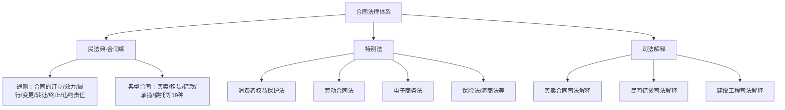
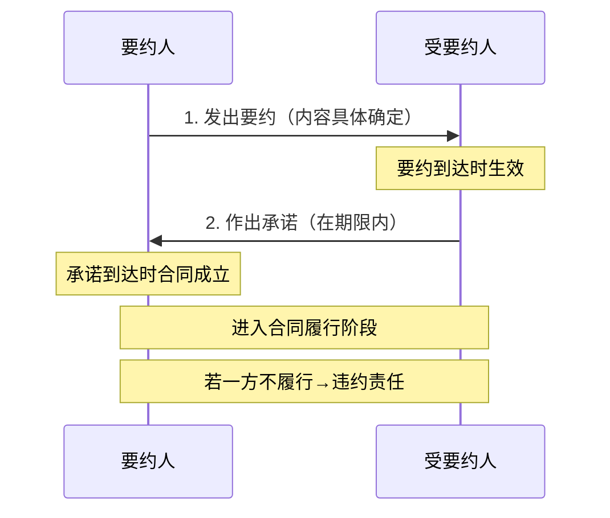
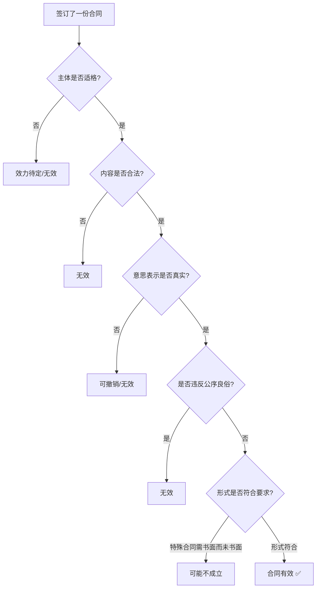
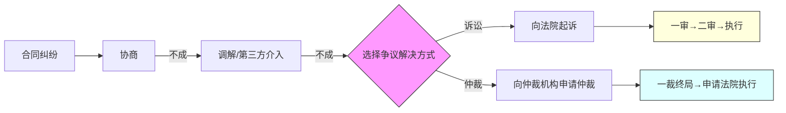

## 三、合同法律基础

合同是市场经济的基石。无论是租房、买菜、签劳动合同，还是创业融资、技术合作、股权分配，几乎每一笔交易都以合同为载体。理解合同法律基础，不是律师的专利，而是每一个想要保护自己财产和权益的人的必修课。

本节从合同的本质出发，系统讲解合同的成立要件、效力规则、履行原则、违约救济，以及日常生活中最常见的合同类型和风险防范要点。

---

### 1. 合同的本质与法律框架

#### 1.1 什么是合同

合同是平等主体的自然人、法人、非法人组织之间设立、变更、终止民事法律关系的协议。核心特征：

| 特征 | 含义 | 实际意义 |
|------|------|----------|
| 平等性 | 各方地位平等，不存在上下级关系 | 即使和大公司签约，法律地位也是平等的 |
| 合意性 | 各方意思表示一致 | 单方面的声明不构成合同 |
| 法律约束力 | 依法成立的合同受法律保护 | 违约方需承担法律责任 |
| 任意性（民法领域） | 法律不禁止的事项均可约定 | 可以自由约定合同内容 |

#### 1.2 法律依据

中国合同法律制度的核心法律依据：

- **《民法典》合同编**（第三编，第463-988条）：2021年1月1日起施行，取代了原《合同法》，是合同法律制度的基本法
- **最高人民法院相关司法解释**：如《关于审理买卖合同纠纷案件适用法律问题的解释》《关于审理民间借贷案件适用法律若干问题的规定》等
- **特别法**：如《消费者权益保护法》《劳动合同法》《电子商务法》等对特定领域合同的特殊规定



#### 1.3 合同编的体例结构

《民法典》合同编分为三个分编：

- **通则**（第463-594条）：适用于所有合同的通用规则，是学习合同法的重点
- **典型合同**（第595-988条）：法律明确规定的19种合同类型（买卖、租赁、借款、保证、保理、物业服务、合伙等）
- **准合同**（第985-988条）：无因管理和不当得利

---

### 2. 合同的成立：从要约到承诺

合同的成立需要经过"要约—承诺"的过程。理解这个过程，能帮你判断"到底签没签成合同"。

#### 2.1 要约

要约是希望与他人订立合同的意思表示。发出要约的人叫"要约人"。

**要约的构成要件：**

1. **内容具体确定**：包含合同的主要条款（标的、数量、价格等）
2. **表明经受要约人承诺即受约束的意思**：不是随便说说，而是认真的

**要约 vs 要约邀请：**

| 区分项 | 要约 | 要约邀请 |
|--------|------|----------|
| 目的 | 直接订立合同 | 引诱他人发出要约 |
| 内容 | 具体确定 | 通常不完整 |
| 法律效果 | 到达对方即生效 | 不产生法律约束力 |
| 典型例子 | "我以500元卖这台电脑给你" | 商场标价牌、拍卖公告、招股说明书 |

> **实务要点**：网购场景下，商品页面展示通常被认定为"要约邀请"，你下单才是"要约"，商家发货才是"承诺"。这意味着商家在你下单后尚未发货前，理论上有权拒绝你的订单（但可能需要承担缔约过失责任）。2023年多起电商平台"砍单"纠纷的法律争议就围绕这一点展开。

#### 2.2 承诺

承诺是受要约人同意要约的意思表示。

**承诺的有效条件：**

1. **由受要约人作出**：只有收到要约的人才能承诺
2. **在承诺期限内到达**：超过期限的承诺视为新要约
3. **内容与要约一致**：实质性变更的视为新要约

**承诺的到达时间：**

- 以对话方式作出的承诺：相对人知道内容时生效
- 以非对话方式作出的承诺：到达相对人时生效
- 电子数据形式：进入相对人指定的特定系统时生效；未指定特定系统的，相对人知道或应当知道进入其系统时生效

#### 2.3 合同成立的时间和地点

**成立时间：**

- 一般规则：承诺生效时合同成立
- 签字盖章：当事人采用合同书形式的，自最后一方签字、盖章或按指印时成立
- 实际履行：未采用书面形式但一方已履行主要义务且对方接受的，合同成立

**成立地点：**

- 承诺生效的地点为合同成立的地点
- 电子合同：收件人的主营业地为合同成立地点；没有主营业地的，住所地为合同成立地点

#### 2.4 合同的形式

| 形式 | 说明 | 典型场景 |
|------|------|----------|
| 书面形式 | 合同书、信件、电报、电传、传真、电子数据交换、电子邮件 | 房屋买卖、借款、劳动合同 |
| 口头形式 | 面谈、电话 | 日常小额交易、即时清结的交易 |
| 其他形式 | 行为推定（如投币自动售货机） | 默示合同、行为合同 |

> **重要提示**：口头合同在法律上完全有效，但发生争议时举证极其困难。建议涉及金额超过1000元或履行期超过1个月的交易，均采用书面形式（包括微信聊天记录+转账记录的电子形式）。



---

### 3. 合同的效力：签了不一定有效

合同成立不等于合同生效。成立是事实判断（签没签），效力是价值判断（有没有效）。

#### 3.1 合同生效的一般规则

- **成立即生效**：依法成立的合同，自成立时生效（最常见）
- **批准生效**：法律、行政法规规定应当办理批准等手续的，依其规定（如外商投资企业合同）
- **附条件/附期限生效**：当事人可以约定生效条件或生效期限

#### 3.2 效力瑕疵的类型

这是合同法最核心的部分之一。效力瑕疵从重到轻分为四种：

**（1）无效合同（自始无效、当然无效、绝对无效）**

| 无效情形 | 法律依据 | 举例 |
|----------|----------|------|
| 违反法律、行政法规的强制性规定 | 第153条 | 赌博合同、贩卖毒品协议 |
| 违背公序良俗 | 第153条 | "借腹生子"协议、包养协议 |
| 恶意串通损害他人合法权益 | 第154条 | 假离婚转移财产逃避债务 |
| 无民事行为能力人实施的 | 第144条 | 8岁儿童签订的购房合同 |

> **注意**：只有违反法律和行政法规的强制性规定才导致合同无效，违反部门规章、地方性法规一般不会导致合同无效，除非该规章涉及公序良俗。

**（2）可撤销合同（撤销前有效，撤销后自始无效）**

| 可撤销情形 | 法律依据 | 撤销权人 | 除斥期间 |
|-----------|----------|----------|----------|
| 重大误解 | 第147条 | 误解方 | 知道或应当知道之日起90日 |
| 欺诈 | 第148-149条 | 被欺诈方 | 知道或应当知道之日起1年 |
| 胁迫 | 第150条 | 被胁迫方 | 胁迫行为终止之日起1年 |
| 显失公平 | 第151条 | 受损害方 | 知道或应当知道之日起1年 |

> **实务要点**：欺诈和重大误解的区别——欺诈是对方故意误导你，重大误解是你自己搞错了。例如：卖家明知是赝品却说是真迹，属于欺诈；卖家和买家都以为是真迹但其实是赝品，属于重大误解。

**（3）效力待定合同**

- **限制民事行为能力人超越能力范围的合同**：需法定代理人追认
- **无权代理合同**：需被代理人追认
- **无权处分合同**：需权利人追认或处分人取得处分权

**（4）未生效合同**

合同已成立但尚未满足生效条件：
- 附生效条件的合同，条件未成就
- 附生效期限的合同，期限未届至
- 需要批准的合同，尚未获批

#### 3.3 合同效力判断的实操流程



---

### 4. 合同的履行：签完之后怎么办

#### 4.1 合同履行的基本原则

| 原则 | 含义 | 实际应用 |
|------|------|----------|
| 全面履行 | 按照约定的标的、数量、质量、价款、期限、方式等全面完成 | 不能只交一部分货就算完成 |
| 诚信履行 | 根据合同的性质、目的和交易习惯履行通知、协助、保密等义务 | 工程施工中发现地下管线应及时通知对方 |
| 绿色原则 | 避免浪费资源、污染环境和破坏生态 | 包装不过度、回收废旧产品 |

#### 4.2 合同内容不明确时的补充规则

合同生效后，当事人就质量、价款、履行地点等内容没有约定或约定不明确的，可以协议补充；不能达成补充协议的，按照以下规则确定：

| 不明确的内容 | 确定规则 |
|-------------|----------|
| 质量要求 | 按照强制性国家标准→推荐性国家标准→行业标准→通常标准或符合合同目的的特定标准 |
| 价款或报酬 | 按照订立合同时履行地的市场价格 |
| 履行地点 | 给付货币的在接受货币一方所在地；交付不动产的在不动产所在地；其他在履行义务一方所在地 |
| 履行期限 | 债务人可以随时履行，债权人也可以随时请求履行，但应给对方必要的准备时间 |
| 履行方式 | 按照有利于实现合同目的的方式 |
| 履行费用 | 由履行义务一方负担 |

#### 4.3 三大履行抗辩权

这是合同法中极其重要的制度，告诉你"什么时候可以合法地不履行"。

**（1）同时履行抗辩权（第525条）**

- 条件：双方互负债务，没有先后履行顺序
- 效果：一方未履行或履行不符合约定的，另一方有权拒绝其相应的履行请求
- 例子：买卖合同约定"一手交钱一手交货"，卖方不交货，买方可以不付钱

**（2）先履行抗辩权（第526条）**

- 条件：双方互负债务，有先后履行顺序
- 效果：先履行一方未履行的，后履行一方有权拒绝其履行请求
- 例子：合同约定卖方先发货、买方后付款，卖方不发货，买方可以不付款

**（3）不安抗辩权（第527条）**

- 条件：先履行一方有确切证据证明后履行一方存在以下情形之一：
  - 经营状况严重恶化
  - 转移财产、抽逃资金以逃避债务
  - 丧失商业信誉
  - 丧失或可能丧失履行债务能力的其他情形
- 效果：可以中止履行，但应及时通知对方
- 例子：你向供应商预付了货款，但发现供应商因大量诉讼被法院冻结了银行账户，你可以中止付款并要求对方提供担保

> **关键区别**：同时履行抗辩权和先履行抗辩权是"被动防御"（对方不履行我才不履行），不安抗辩权是"主动防御"（对方还没到履行期，但我有理由担心他不能履行）。

#### 4.4 代位权与撤销权

当债务人消极对待自己的债权或积极转移财产时，债权人有两把利剑：

**代位权（第535条）**：债务人怠于行使对第三人的债权，影响债权人到期债权实现的，债权人可以自己的名义代位行使债务人的债权。

**撤销权（第538-539条）**：债务人以放弃债权、放弃债权担保、无偿转让财产等方式无偿处分财产权益，或以明显不合理的低价转让财产，影响债权人债权实现的，债权人可以请求法院撤销。

| 对比项 | 代位权 | 撤销权 |
|--------|--------|--------|
| 适用场景 | 债务人对第三人有债权但不去要 | 债务人把财产转移给别人 |
| 行使方式 | 以自己名义向第三人主张 | 向法院起诉请求撤销 |
| 除斥期间 | — | 知道或应当知道之日起1年，行为发生之日起5年 |
| 典型案例 | A欠你10万，B欠A10万，A不向B要债，你直接向B要 | A欠你100万，A把房产低价卖给亲戚，你请求法院撤销这笔交易 |

---

### 5. 合同的变更、转让与终止

#### 5.1 合同变更

合同变更是指合同内容的改变，如修改价款、延期交付等。

- **协商变更**：双方协商一致即可变更
- **法定变更**：情势变更（第533条）——合同成立后，合同的基础条件发生了当事人在订立合同时无法预见的、不属于商业风险的重大变化，继续履行对一方明显不公平的，可以请求法院或仲裁机构变更或解除合同

> **情势变更 vs 不可抗力**：不可抗力导致合同目的不能实现时可以直接解除合同（如地震摧毁工厂）；情势变更导致继续履行显失公平时，先协商，协商不成再请求法院变更或解除（如原材料价格暴涨10倍）。2020年疫情期间，大量租赁合同纠纷援引了情势变更原则。

#### 5.2 合同转让

| 转让类型 | 含义 | 条件 | 通知/同意 |
|----------|------|------|-----------|
| 债权转让 | 债权人将债权让与第三人 | 债权性质可以转让、当事人没有约定不得转让、法律没有规定不得转让 | 通知债务人即可，无需同意 |
| 债务转移 | 债务人将债务转移给第三人 | — | 需经债权人同意 |
| 权利义务概括转让 | 一方将合同中的权利义务一并转让 | — | 需经对方同意 |

#### 5.3 合同终止

合同权利义务终止的情形（第557条）：

1. **债务已经履行**：最正常的终止方式
2. **债务相互抵销**：双方互负债务且标的物种类、品质相同的，可以抵销
3. **债务人依法将标的物提存**：债权人无正当理由拒绝受领的，债务人可以将标的物交给提存机关
4. **债权人免除债务**：债权人放弃债权
5. **债权债务同归于一人**：如企业合并
6. **合同解除**：包括协商解除、约定解除、法定解除

**法定解除的五种情形（第563条）：**

1. 因不可抗力致使不能实现合同目的
2. 履行期限届满前，一方明确表示或以行为表明不履行主要债务（预期违约）
3. 一方迟延履行主要债务，经催告后在合理期限内仍未履行
4. 一方迟延履行债务或有其他违约行为致使不能实现合同目的
5. 法律规定的其他情形

---

### 6. 违约责任：不履行怎么办

#### 6.1 违约责任的归责原则

中国合同法采用**严格责任原则**（无过错责任）：只要没有按照合同约定履行义务，就构成违约，不考虑是否有过错。但法律另有规定的除外（如委托合同中受托人的过错责任）。

#### 6.2 违约责任的承担方式

| 方式 | 说明 | 适用场景 |
|------|------|----------|
| 继续履行 | 强制违约方按照合同约定履行义务 | 标的物是特定物（如房产） |
| 采取补救措施 | 修理、更换、重作、退货、减少价款等 | 质量不符合约定 |
| 赔偿损失 | 赔偿因违约造成的损失（包括可得利益损失） | 所有违约情形 |
| 违约金 | 按照合同约定支付违约金 | 合同有约定时 |
| 定金罚则 | 交付定金一方违约，无权要求返还；收受定金一方违约，双倍返还 | 合同有定金约定时 |

**违约金与定金的选择（第588条）：**

当事人既约定违约金又约定定金的，一方违约时，对方可以选择适用违约金或定金条款（只能选其一，不能同时适用）。

**违约金的调整（第585条）：**

- 约定的违约金低于造成的损失的，可以请求增加
- 约定的违约金过分高于造成的损失的（一般超过损失的30%），可以请求适当减少

#### 6.3 违约损害赔偿的范围

```text
赔偿范围 = 实际损失 + 可得利益损失（但不超过违约方在订立合同时预见到或应当预见到的损失）

实际损失 = 已经发生的财产减少（如已支付的款项、维修费用）
可得利益损失 = 合同正常履行情况下可以获得的利益（如转售利润）
可预见性限制 = 违约方在签约时能预见的损失范围
```

**举例**：你向A采购一批货物（成本10万），计划以15万转售给B。A违约不交货。
- 实际损失：10万（你付的货款）
- 可得利益损失：5万（转售利润）
- 可预见性：如果A不知道你有转售安排，可能只赔10万；如果A知道，应赔15万

#### 6.4 免责事由

1. **不可抗力**：不能预见、不能避免、不能克服的客观情况（自然灾害、战争、政府行为等），可部分或全部免责，但需及时通知并提供证明
2. **对方过错**：损失是对方的原因造成的，可以免责
3. **约定免责**：当事人可以约定免责条款，但不得免除造成对方人身损害的责任，也不得免除因故意或重大过失造成对方财产损失的责任

---

### 7. 常见合同类型精讲

#### 7.1 买卖合同

买卖合同是最常见、最重要的合同类型，也是《民法典》合同编中篇幅最长的典型合同。

**风险转移规则：**

| 交付方式 | 风险转移时间 | 法律依据 |
|----------|-------------|----------|
| 一般交付 | 交付时转移 | 第604条 |
| 需要运输 | 交付第一承运人时转移 | 第603条 |
| 在途货物 | 合同成立时转移 | 第606条 |
| 买方迟延受领 | 约定交付之日起转移 | 第605条 |
| 卖方迟延交付 | 卖方违约时起转移 | 第605条 |

> **关键教训**：网购中，商品在运输途中损坏，风险由谁承担？答案是：如果商家包邮，商品交付给承运人后风险转移给买家（但如果商品本身质量不合格，商家仍需承担责任）。如果运费由买家承担，风险在商品到达买家时才转移。

**瑕疵担保责任：**

- 质量瑕疵：交付的标的物不符合质量要求的，买受人可以合理选择要求修理、更换、重作、退货、减少价款
- 权利瑕疵：第三人对标的物享有权利的，出卖人应承担违约责任
- 检验期间：买受人应在检验期间内通知出卖人（未约定的，应在合理期间内通知，最长不超过收到标的物之日起2年）

#### 7.2 租赁合同

租赁合同与日常生活息息相关，尤其是房屋租赁。

**核心规则要点：**

| 事项 | 规则 | 实务提示 |
|------|------|----------|
| 租赁期限 | 最长20年，超过部分无效 | 超过20年的，期满可以续签 |
| 书面形式 | 6个月以上应采用书面形式 | 未采用书面形式的视为不定期租赁 |
| 续租优先权 | 租赁期满，承租人享有以同等条件优先承租的权利 | 房东卖房时租客有优先购买权 |
| 买卖不破租赁 | 租赁物在承租人占有期限内发生所有权变动的，不影响租赁合同效力 | 买了二手房不能赶走现有租客 |
| 转租 | 需经出租人同意，否则出租人可以解除合同 | 二房东问题的关键法律依据 |

**押金/保证金的法律性质：**

押金不是法定担保方式，而是习惯做法。退租时，扣除合理费用后应退还押金。如果房东无故不退押金，可以：
1. 协商
2. 向消费者协会投诉
3. 向住建部门投诉
4. 起诉（标的额不大可适用小额诉讼程序，一审终审）

#### 7.3 民间借贷合同

民间借贷是最容易产生纠纷的合同类型之一。

**利率红线（2020年修订后的规则）：**

```text
法律保护的利率上限 = 合同成立时一年期贷款市场报价利率（LPR）的4倍

2024年12月LPR = 3.10%
4倍LPR = 12.4%

→ 年利率12.4%以内：法律保护
→ 年利率12.4%-36%：已支付的不退还，未支付的不支持
→ 年利率超过36%：超出部分无效
```

> **注意**：2020年8月20日之后新受理的民间借贷案件，一律适用4倍LPR标准。之前的案件适用"两线三区"规则（24%和36%）。

**借条 vs 欠条 vs 收条：**

| 类型 | 法律性质 | 诉讼时效起算 |
|------|----------|-------------|
| 借条 | 借贷关系的凭证 | 约定还款期限届满之日起3年；未约定的，从要求还款被拒之日起3年 |
| 欠条 | 债权债务关系的结算凭证 | 出具欠条之日起3年 |
| 收条 | 收到款项的凭证 | 不能单独证明借贷关系 |

**规范借条模板（关键要素）：**

```text
借    条

今借到 [出借人全名]（身份证号：XXX）人民币 [大写金额]（小写：¥XXX），借款期限自 [日期] 至 [日期]，年利率为 [X]%，按 [月/季/年] 付息，到期还本。

借款用途：[具体用途]
还款方式：[银行转账/现金]（收款账户：XXX）

如逾期未还，逾期部分按 [X]% 计算逾期利息。

借款人：[全名]（签字并按指印）
身份证号：XXX
联系地址：XXX
联系电话：XXX

日期：[年月日]

（附：借款人身份证复印件）
```

#### 7.4 劳动合同

劳动合同受《劳动合同法》特别调整，与一般合同法有显著差异。

**用人单位必须签订书面劳动合同的时限：**

- 用工之日起1个月内
- 超过1个月不满1年未签的：支付双倍工资
- 超过1年未签的：视为已订立无固定期限劳动合同

**试用期的法定限制：**

| 合同期限 | 试用期上限 | 工资标准 |
|----------|-----------|----------|
| 3个月-1年 | 1个月 | 不低于约定工资的80%且不低于当地最低工资 |
| 1年-3年 | 2个月 | 同上 |
| 3年以上/无固定 | 6个月 | 同上 |

**经济补偿金的计算（N/N+1/2N）：**

- **N**：每工作满1年支付1个月工资（6个月以上不满1年按1年算，不满6个月支付半个月工资）
- **N+1**：用人单位未提前30天通知解除的，需额外支付1个月工资（代通知金）
- **2N**：用人单位违法解除的，需支付2倍经济补偿金（赔偿金）

---

### 8. 电子合同与数字经济中的合同问题

#### 8.1 电子合同的法律效力

《民法典》第469条明确规定：以电子数据交换、电子邮件等方式能够有形地表现所载内容，并可以随时调取查用的数据电文，视为书面形式。

**电子合同的特殊规则：**

| 事项 | 规则 |
|------|------|
| 签名/盖章 | 可靠的电子签名与手写签名或盖章具有同等法律效力 |
| 成立时间 | 对方知道或应当知道电文进入其系统时 |
| 成立地点 | 收件人的主营业地（无主营业地的为住所地） |
| 原件要求 | 能够有效地表现所载内容并可供随时调取查用 |

#### 8.2 格式条款的特殊规制

平台经济中大量使用格式条款（"霸王条款"），法律有严格规制：

**提供格式条款一方的义务：**

1. 遵循公平原则确定当事人之间的权利和义务
2. 采取合理方式提示对方注意免除或减轻其责任的条款
3. 按照对方的要求对该条款予以说明

**格式条款无效的情形：**

- 不合理地免除或减轻其责任
- 加重对方责任
- 排除或排除对方主要权利
- 提供格式条款一方未履行提示说明义务，对方可以主张该条款不成为合同的内容

> **日常应用**：App用户协议中的"最终解释权归本公司所有"条款无效。平台单方修改服务条款且未有效通知用户的，修改对用户不生效。

#### 8.3 电子商务中的合同问题

- **自动信息系统订立的合同**：通过自动化系统订立的合同有效，即使自然人未逐案审查
- **合同确认**：经营者应保证消费者在提交订单前可以更正输入错误
- **信息披露义务**：经营者应以显著方式提请消费者注意格式条款

---

### 9. 合同风险管理实务

#### 9.1 签约前的风险审查清单

| 审查项 | 具体内容 | 风险等级 |
|--------|----------|----------|
| 对方主体资格 | 营业执照、经营范围、法定代表人身份 | 🔴 高 |
| 对方信用状况 | 企查查/天眼查查询涉诉情况、被执行信息 | 🔴 高 |
| 授权委托 | 签约人是否有授权委托书、是否在授权范围内 | 🟡 中 |
| 合同文本 | 是否有空白条款、是否有多份不同版本 | 🔴 高 |
| 标的物状况 | 权属是否清晰、是否存在抵押/查封 | 🔴 高 |
| 担保措施 | 是否需要对方提供担保（保证、抵押、质押） | 🟡 中 |

#### 9.2 合同履行中的风险监控

1. **证据留存**：所有沟通尽量采用书面形式（微信、邮件），重要事项通过书面函件确认
2. **定期对账**：长期合同应定期核对已履行部分和应付/应收款项
3. **异常预警**：关注对方经营状况变化（工商变更、涉诉信息、负面新闻）
4. **及时催告**：对方违约后及时发送书面催告函，固定违约事实

#### 9.3 常见合同陷阱及防范

| 陷阱类型 | 具体表现 | 防范措施 |
|----------|----------|----------|
| 阴阳合同 | 签两份内容不同的合同，用于不同目的 | 坚持只签一份，保留原件 |
| 主体移花接木 | 盖章的公司与签约的公司不一致 | 核实公章与营业执照一致 |
| 无限期拖延 | 不约定明确的履行期限 | 书面约定具体日期和违约责任 |
| 口头变更 | 签约后口头修改关键条款 | 所有变更必须书面确认 |
| 违约金过低 | 违约金远低于实际损失 | 约定合理的违约金或损失计算方式 |
| 管辖陷阱 | 约定对己方不利的管辖法院 | 尽量约定己方所在地法院或仲裁 |
| 自动续约 | 合同到期自动续约且退出成本高 | 注意自动续约条款，约定提前通知退出机制 |

#### 9.4 合同纠纷的解决途径



**诉讼 vs 仲裁：**

| 对比项 | 诉讼 | 仲裁 |
|--------|------|------|
| 审级 | 两审终审 | 一裁终局 |
| 公开性 | 原则上公开审理 | 原则上不公开 |
| 费用 | 诉讼费较低 | 仲裁费较高 |
| 执行力 | 法院直接执行 | 需向法院申请执行 |
| 选择权 | 不能排除法院管辖 | 需双方达成仲裁协议 |
| 适用场景 | 一般民商事纠纷 | 商事纠纷、涉外合同、专业性强的纠纷 |

> **实务建议**：仲裁协议必须明确约定仲裁机构的名称，如"提交中国国际经济贸易仲裁委员会仲裁"。仅写"提交仲裁解决"而未指定机构的，仲裁协议无效。

---

### 10. 日常生活中的合同法律要点速查

#### 10.1 高频场景速查表

| 生活场景 | 合同类型 | 关键法律要点 |
|----------|----------|-------------|
| 租房 | 租赁合同 | 押金退还、提前解约违约金、维修责任、转租限制 |
| 购房 | 买卖合同 | 定金与订金的区别、逾期交房/付款的违约责任、面积差异处理 |
| 买车 | 买卖合同 | 质量瑕疵担保、PDI检测、"定金"与"订金" |
| 装修 | 承揽合同 | 工期延误违约金、质量验收标准、增项控制 |
| 消费预付卡 | 服务合同 | 7天无理由退款、商家跑路的维权、转让权利 |
| 网购 | 买卖合同 | 7天无理由退货、虚假宣传的赔偿、平台责任 |
| 借钱 | 借款合同 | 利率上限、借条规范、担保人责任 |
| 理财产品 | 委托理财/借贷 | 风险提示义务、保底条款效力、举证责任 |

#### 10.2 定金 vs 订金 vs 押金

这三个概念常被混淆，但法律效果完全不同：

| 对比项 | 定金 | 订金 | 押金 |
|--------|------|------|------|
| 法律性质 | 法定担保方式 | 预付款性质 | 习惯做法，非法定担保 |
| 上限 | 不超过主合同标的额的20% | 无法定上限 | 无法定上限 |
| 给付方违约 | 无权要求返还 | 可以要求返还（可能需赔偿损失） | 扣除损失后返还 |
| 收受方违约 | 双倍返还 | 原额返还 + 赔偿损失 | 原额返还 + 赔偿损失 |
| 适用场景 | 购房、购车、大额交易 | 购物预订、服务预约 | 租赁、借用 |

> **必记要点**：签合同时看清写的是"定金"还是"订金"。"定金"适用定金罚则（违约则丧失或双倍返还），"订金"只是预付款，违约可以退还。

#### 10.3 诉讼时效提醒

普通诉讼时效为**3年**，从知道或应当知道权利受到损害以及义务人之日起计算。但最长不超过权利受到损害之日起20年。

**诉讼时效中断的事由（重新起算3年）：**

1. 权利人向义务人提出履行请求
2. 义务人同意履行义务
3. 权利人提起诉讼或申请仲裁
4. 与提起诉讼或申请仲裁具有同等效力的其他情形

> **实务提醒**：借钱给别人，如果快到3年了对方还没还，一定要留下催款记录（微信、短信、邮件均可），否则过了诉讼时效就丧失了胜诉权。

---

### 11. 常见误区与纠正

| 误区 | 正确认知 |
|------|----------|
| "口头协议没有法律效力" | 口头合同有效，但举证困难。微信聊天记录可作为口头合同的证据 |
| "签字就一定有效" | 无权代理、欺诈、胁迫等情形下签字的合同可能无效或可撤销 |
| "合同写什么就是什么" | 格式条款、霸王条款可能被认定无效；违反强制性法律规定的条款无效 |
| "违约金想写多少就多少" | 过高的违约金（超过损失30%）可以请求法院调减 |
| "公司盖章了就是公司行为" | 需确认盖章人是否有权限，是否在授权范围内 |
| "合同到期了就不用管了" | 某些合同有后合同义务（保密、竞业限制等） |
| "打官司太贵不值得" | 小额诉讼（标的额各省上年度就业人员年平均工资30%以下）一审终审，诉讼费减半 |
| "有了借条就一定能要回钱" | 还需要实际交付了借款（转账记录），且未超过诉讼时效 |

---

### 12. 进阶：合同谈判与起草技巧

#### 12.1 合同谈判的核心策略

1. **BATNA分析**（最佳替代方案）：谈判前明确"如果谈不成，我的替代方案是什么"。BATNA越强，谈判筹码越大
2. **锚定效应**：先出价的人通常能设定谈判基准。如果你对市场行情更了解，主动出价
3. **利益 vs 立场**：关注对方真正的需求（利益），而不是他表面的要求（立场）。例如对方坚持要降价，实际可能是付款压力大，可以协商分期付款
4. **让步策略**：每次让步的幅度应递减，暗示已接近底线；不要做单方面让步

#### 12.2 合同起草的关键条款清单

一份完善的合同应包含以下条款：

```text
1. 合同主体信息（全称、统一社会信用代码/身份证号、地址、联系方式）
2. 鉴于条款（合同背景和目的，辅助解释合同条款）
3. 标的条款（交易的对象、范围）
4. 数量和质量条款（计量方式、验收标准、检验期间）
5. 价款和支付条款（金额、币种、支付方式、支付时间、发票）
6. 履行条款（期限、地点、方式）
7. 验收条款（验收标准、验收程序、异议期限）
8. 违约责任条款（违约情形、违约金、损失赔偿计算方式）
9. 保密条款（保密范围、保密期限、违约后果）
10. 知识产权条款（权属、许可范围、侵权责任）
11. 争议解决条款（协商→调解→仲裁/诉讼、管辖法院/仲裁机构）
12. 合同变更和解除条款（变更程序、解除条件、解除后果）
13. 通知条款（通知方式、送达地址、地址变更通知义务）
14. 不可抗力条款（定义、通知义务、后果）
15. 附件（技术规格、图纸、清单等）
16. 合同份数和生效条件
```

#### 12.3 合同审查的"三步法"

1. **合法性审查**：合同主体是否有资格、内容是否合法、形式是否合规
2. **合理性审查**：权利义务是否对等、违约责任是否公平、风险分配是否合理
3. **可操作性审查**：条款是否明确具体、履行程序是否清晰、争议解决是否可行

---

### 总结

合同法律基础的核心可以概括为"四问"：

1. **签不签？** —— 重大交易一定要签书面合同，口头合同虽然有效但风险极高
2. **有没有效？** —— 主体适格、内容合法、意思表示真实、不违反公序良俗
3. **怎么履行？** —— 全面、诚信履行；善用三大抗辩权保护自己
4. **违约怎么办？** —— 及时固定证据、发送催告函、选择合适的救济途径

掌握这些基础，你就具备了在日常经济活动中保护自身合法权益的基本能力。遇到复杂或大额的合同事务，建议咨询专业律师——预防纠纷的成本远低于解决纠纷的成本。
