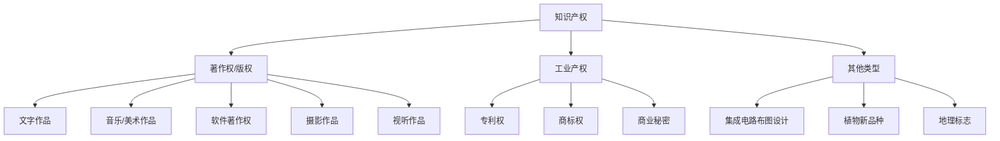
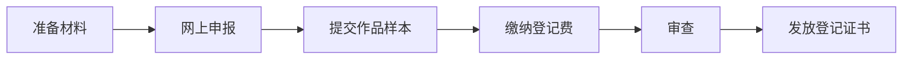
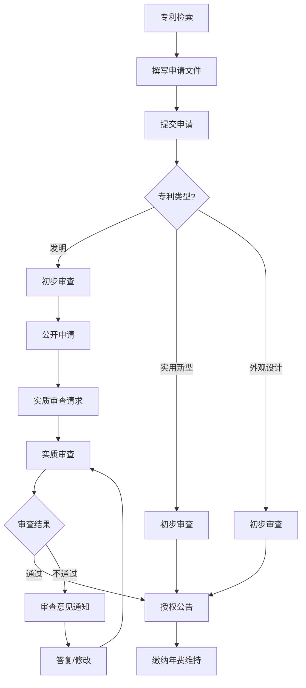
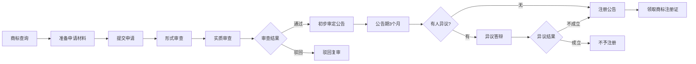
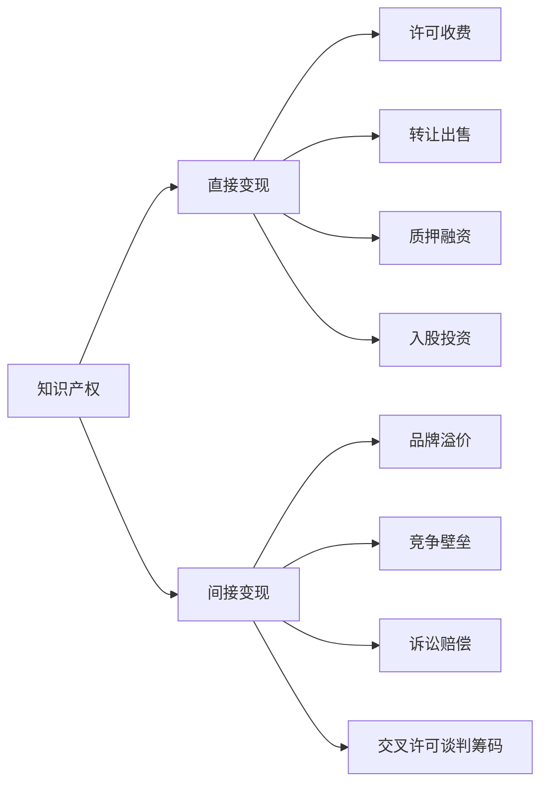

## 四、知识产权法律基础

知识产权（Intellectual Property，简称IP）是现代社会中最具价值的无形资产之一。对于想要"搞钱"的人来说，理解知识产权不仅仅是法律合规的需要，更是发现商业机会、保护自身利益、构建竞争壁垒的核心能力。一个短视频博主的原创内容、一个程序员开发的开源工具、一个设计师创作的品牌形象——这些都是知识产权的具体形态。不懂知识产权，你可能在不知不觉中侵犯他人权利而面临巨额赔偿，也可能眼睁睁看着自己的创意被他人无偿使用。

本节将从知识产权的基本概念出发，系统讲解中国知识产权法律体系的核心框架，帮助你建立起完整的知识产权认知，并掌握在实际商业活动中保护和运用知识产权的基本方法。

### 1. 知识产权的定义与范围

#### 1.1 什么是知识产权

知识产权是指人们对其智力劳动成果所享有的法定权利。与有形财产（如房屋、汽车）不同，知识产权是一种无形财产权，它的客体是人类智力活动创造的成果和商业活动中的标识性信息。

知识产权的核心特征包括：

- **无形性**：权利的客体是无形的智力成果，而非具体的物质实体。你买了一本书，你拥有这本书的所有权，但你不拥有书中的著作权——这是两个完全不同的权利。
- **专有性**：知识产权赋予权利人在一定期限内对其智力成果享有独占使用权，未经许可他人不得擅自使用。
- **时间性**：知识产权有法定的保护期限，期限届满后智力成果进入公共领域，任何人都可以自由使用。这与所有权的永久性形成鲜明对比。
- **地域性**：知识产权的保护具有严格的地域限制，在一国获得的知识产权仅在该国有效。如果你的商标只在中国注册，那么在美国它不受保护。

#### 1.2 知识产权的主要类型

中国法律体系下的知识产权主要包括以下几大类：

| 类型 | 保护对象 | 保护期限 | 主管机关 | 申请成本（大致） |
|------|----------|----------|----------|------------------|
| 发明专利 | 技术方案（产品/方法） | 20年（自申请日起） | 国家知识产权局 | 5000-15000元（代理） |
| 实用新型专利 | 产品的形状/构造 | 10年 | 国家知识产权局 | 2000-5000元（代理） |
| 外观设计专利 | 产品的外观设计 | 15年 | 国家知识产权局 | 1500-3000元（代理） |
| 商标权 | 品牌标识（文字/图形等） | 10年（可无限续展） | 国家知识产权局商标局 | 300元/类（官费） |
| 著作权 | 文学/艺术/科学作品 | 作者终生+死后50年 | 自动获得（无需申请） | 登记费100-300元 |
| 软件著作权 | 计算机程序及文档 | 自然人：终生+死后50年；法人：首次发表后50年 | 中国版权保护中心 | 登记费约300元 |
| 商业秘密 | 技术信息/经营信息 | 无固定期限（保密即保护） | 无需申请 | 保密措施成本 |

### 2. 著作权（版权）法律基础

著作权是与普通人关系最密切的知识产权类型。你写的每一篇文章、拍的每一张照片、录的每一段视频、写的每一行代码，从创作完成的那一刻起就自动享有著作权保护——不需要申请、不需要登记、不需要标注"版权所有"。

#### 2.1 著作权的主体与客体

**著作权的主体**即著作权人，通常是作品的作者。但存在几种特殊情况：

- **职务作品**：员工在工作职责范围内创作的作品，著作权归属取决于劳动合同和单位规定。一般情况下，著作权归作者（员工），但单位有权在其业务范围内优先使用。特殊职务作品（主要利用单位物质技术条件且由单位承担责任的）著作权归单位。
- **委托作品**：委托他人创作的作品，著作权归属由双方合同约定；没有约定的，著作权归受托人（创作者）。这就是为什么你找设计师做Logo，如果不签合同约定版权归属，设计师有权在其他地方使用同样的设计。
- **合作作品**：两人以上合作创作的作品，著作权由合作者共同享有。
- **法人作品**：由法人或非法人组织主持、代表法人意志创作、由法人承担责任的作品，著作权归法人。

**著作权的客体**包括以下类型：

| 类别 | 具体示例 | 说明 |
|------|----------|------|
| 文字作品 | 小说、论文、博客文章、广告文案 | 以文字形式表现的作品 |
| 口述作品 | 演讲、授课、相声 | 以口头语言表现的作品 |
| 音乐作品 | 歌曲、交响乐、BGM | 带词或不带词的曲谱 |
| 戏剧/曲艺作品 | 话剧、京剧、小品剧本 | 用于舞台演出的作品 |
| 美术作品 | 绘画、书法、雕塑、Logo设计 | 有审美意义的造型艺术 |
| 建筑作品 | 建筑物外观设计 | 有审美意义的建筑造型 |
| 摄影作品 | 照片 | 借助器械记录客观物体形象 |
| 视听作品 | 电影、短视频、直播录屏、动画 | 由一系列有伴音或无伴音的画面组成 |
| 图形作品 | 工程图纸、地图、示意图 | 展示科学信息的图形 |
| 模型作品 | 微缩模型、立体造型 | 展示科学信息的立体模型 |
| 计算机软件 | 程序源代码、文档 | 受《计算机软件保护条例》保护 |

**不受著作权保护的对象**：法律法规、国家机关文件、历法、通用数表、通用表格和公式。注意：创意和想法本身不受保护，只有以一定形式表达出来的作品才受保护。这就是所谓的"思想/表达二分法"——你可以保护你写出来的故事，但不能保护"写一个穿越故事"这个想法本身。

#### 2.2 著作权的内容

著作权包含两大类权利：**人身权**和**财产权**。

**人身权**（不可转让、不可继承）：

- **发表权**：决定作品是否公之于众的权利
- **署名权**：表明作者身份，在作品上署名的权利
- **修改权**：修改或授权他人修改作品的权利
- **保护作品完整权**：保护作品不受歪曲、篡改的权利

**财产权**（可转让、可继承、可许可使用）：

- **复制权**：以印刷、复印、录音等方式将作品制作一份或多份的权利
- **发行权**：以出售或赠与方式向公众提供作品原件或复制件的权利
- **出租权**：有偿许可他人临时使用视听作品、软件的权利
- **展览权**：公开陈列美术作品、摄影作品原件或复制件的权利
- **表演权**：公开表演作品以及用各种手段公开播送作品表演的权利
- **放映权**：通过技术设备公开再现美术、摄影、视听作品等的权利
- **广播权**：以无线/有线方式公开传播或转播作品的权利
- **信息网络传播权**：以有线或无线方式向公众提供作品，使公众可以在其个人选定的时间和地点获得作品的权利——这是互联网时代最核心的著作权之一
- **改编权**：改变作品、创作出具有独创性的新作品的权利
- **翻译权**：将作品从一种语言文字转换成另一种语言文字的权利
- **汇编权**：将作品或作品的片段通过选择或编排汇集成新作品的权利
- **其他**：应当由著作权人享有的其他权利

对于"搞钱"而言，信息网络传播权是最常被涉及的权利——当你在网上发布内容、开设网课、销售电子书时，本质上都是在行使这项权利。

#### 2.3 合理使用与法定许可

著作权并非绝对的垄断权利，法律对著作权设置了一定的限制，以平衡创作者利益和公众利益。

**合理使用**（《著作权法》第二十四条）——在以下情况下使用作品，可以不经著作权人许可，不向其支付报酬，但应当指明作者姓名、作品名称，并且不得影响该作品的正常使用，也不得不合理地损害著作权人的合法权益：

1. 为个人学习、研究或欣赏，使用他人已发表的作品
2. 为介绍、评论某一作品或说明某一问题，在作品中适当引用他人已发表的作品
3. 为报道新闻，在报纸、期刊、广播电台、电视台等媒体中不可避免地再现或引用已发表的作品
4. 其他法定情形

**自媒体创作者最需要注意的"合理使用"边界**：

- **二次创作**（混剪、解说、评论）：适度引用原作品进行评论、解说，可能构成合理使用，但如果大量使用原作品的精华部分，替代了原作品的市场价值，则不构成合理使用
- **转载**：直接全文转载他人的文章或视频，几乎不可能构成合理使用
- **背景音乐/图片**：在视频中使用他人的音乐或图片作为背景素材，不属于合理使用的范围

**法定许可**——在以下情况下，可以不经著作权人许可使用其作品，但应当支付报酬：

- 编写教科书法定许可
- 录音制作者法定许可（已合法录制为录音制品的音乐作品，其他录音制作者可以重新录制）
- 广播组织法定许可（播放已发表的作品）

#### 2.4 著作权登记与保护实务

虽然著作权自创作完成自动产生，但进行著作权登记具有重要的实践意义：

**为什么要做著作权登记？**

1. **举证优势**：在侵权诉讼中，著作权登记证书是证明权利归属的初步证据。没有登记，你需要用其他方式证明"这个作品是我创作的"——这在实践中可能非常困难。
2. **商业交易需要**：进行著作权许可或转让时，对方通常要求查验登记证书。
3. **平台维权**：各内容平台（微信、抖音、B站等）的投诉机制中，著作权登记证书是最有效的维权材料。
4. **政府项目申报**：申请政府补贴、高新技术企业认定等，通常需要提供知识产权证明。

**著作权登记流程**：

具体步骤：

1. 登录中国版权保护中心网站（www.ccopyright.com.cn）或各省版权局网站
2. 注册账号并在线填写著作权登记申请表
3. 准备申请材料：身份证明、作品样本（文字作品提交全文或前30页+后30页）、权利归属证明
4. 缴纳登记费用（文字作品约100-300元）
5. 等待审查（通常1-3个月）
6. 领取著作权登记证书

**时间节点与费用**：

| 项目 | 普通办理 | 加急办理 |
|------|----------|----------|
| 办理时间 | 30个工作日 | 10/5/3/1个工作日 |
| 费用 | 100-300元 | 加急费500-2000元不等 |
| 证书有效期 | 无期限限制 | 同左 |

### 3. 专利权法律基础

专利权是保护技术创新和外观设计的核心法律工具。如果你开发了一个有技术含量的产品、发明了一种新的工艺方法，或者设计了一个独特的产品外观，专利权是保护和变现这些成果的最佳手段。

#### 3.1 专利的类型与条件

中国专利法规定了三种专利类型：

**发明专利**——对产品、方法或其改进所提出的新的技术方案

- **新颖性**：在申请日之前，没有同样的发明在国内外出版物上公开发表过、在国内公开使用过或以其他方式为公众所知
- **创造性**：与现有技术相比，具有突出的实质性特点和显著的进步
- **实用性**：能够制造或使用，并且能够产生积极效果
- 保护期限：20年
- 审查方式：实质审查（审查周期通常2-3年）

**实用新型专利**——对产品的形状、构造或其结合所提出的适于实用的新的技术方案

- 只保护产品，不保护方法
- 创造性要求低于发明专利（"有实质性特点和进步"即可）
- 保护期限：10年
- 审查方式：初步审查（审查周期通常6-12个月）
- 优点：授权快、费用低、门槛较低

**外观设计专利**——对产品的整体或局部外观所作出的富有美感并适于工业应用的新设计

- 保护的是产品外观，而非技术方案
- 必须与产品结合（单纯的图案设计不受外观设计专利保护）
- 保护期限：15年
- 审查方式：初步审查

| 对比维度 | 发明专利 | 实用新型专利 | 外观设计专利 |
|----------|----------|--------------|--------------|
| 保护对象 | 产品/方法的技术方案 | 产品的形状/构造 | 产品的外观设计 |
| 新颖性标准 | 高 | 中 | 中 |
| 创造性标准 | 高（突出的实质性特点和显著进步） | 中（实质性特点和进步） | 有明显区别 |
| 审查方式 | 实质审查 | 初步审查 | 初步审查 |
| 授权周期 | 2-3年 | 6-12个月 | 4-8个月 |
| 保护期限 | 20年 | 10年 | 15年 |
| 年费（前3年） | 900元/年 | 400元/年 | 300元/年 |
| 代理费用 | 5000-15000元 | 2000-5000元 | 1500-3000元 |

#### 3.2 专利申请流程

**关键步骤详解**：

**第一步：专利检索（最重要但最容易被忽略）**

在申请专利之前，必须进行充分的专利检索，确认你的发明创造是否具有新颖性。这一步决定了你的专利申请是否值得投入。

检索途径：
- 国家知识产权局专利检索系统（https://pss-system.cponline.cnipa.gov.cn/）
- Google Patents（https://patents.google.com/）
- 佰腾专利检索（https://www.baiten.cn/）
- SooPAT（http://www.soopat.com/）

检索关键词策略：从技术问题、技术方案、技术效果三个维度构建检索式；同时使用同义词、近义词扩展检索范围。

**第二步：撰写申请文件**

专利申请文件的质量直接决定专利的保护范围和稳定性。核心文件包括：

- **请求书**：申请人信息、发明名称等基本信息
- **说明书**：详细描述发明的技术方案，包括技术领域、背景技术、发明内容、附图说明、具体实施方式
- **权利要求书**：定义专利保护范围的核心文件，每一条权利要求都是一项独立的技术方案
- **说明书摘要**：发明的简要说明，不超过300字
- **附图**：用于说明技术方案的示意图

权利要求书的撰写是技术活中的技术活。权利要求过宽，容易被驳回或被无效；过窄，则保护范围有限，别人容易绕过去。对于个人申请者，强烈建议委托专业专利代理师撰写。

**第三步：提交与审查**

- 发明专利：提交 → 初步审查（约6个月）→ 公开 → 请求实质审查 → 实质审查（1-3年）→ 授权或驳回
- 实用新型：提交 → 初步审查（6-12个月）→ 授权或驳回
- 外观设计：提交 → 初步审查（4-8个月）→ 授权或驳回

#### 3.3 专利的商业化运用

专利不仅仅是防御性工具，更是直接的赚钱手段：

**许可收费**：将专利许可给他人使用，收取许可费。许可方式包括：
- 独占许可：只许可一个被许可人使用，连专利权人自己也不能使用
- 排他许可：许可一个被许可人使用，专利权人自己仍可使用
- 普通许可：可以许可多个被许可人使用

**转让出售**：将专利权整体转让给他人。中国设有多个知识产权交易平台，如中国专利交易网、各地技术交易所等。

**交叉许可**：与拥有相关专利的企业相互许可使用对方的专利，常见于高科技行业。

**专利质押融资**：以专利权作为质押物向银行申请贷款。国家知识产权局数据显示，2023年全国专利质押融资金额超过8000亿元。

**技术入股**：以专利技术作为出资，入股创业公司。

### 4. 商标权法律基础

商标是品牌的核心载体，是消费者识别商品或服务来源的标志。在商业活动中，商标权可能是最具商业价值的知识产权类型——一个知名商标的价值可以达到数十亿甚至数百亿元。

#### 4.1 商标的构成要素

可以作为商标注册的要素：

- **文字**：中文、外文、数字（如"华为"、"Apple"、"361°"）
- **图形**：平面图案（如耐克的对勾标志）
- **字母**：拼音或英文字母（如"JD"、"TCL"）
- **数字**：阿拉伯数字或中文数字（如"555"牌香烟）
- **三维标志**：立体形状（如可口可乐的瓶身形状）
- **颜色组合**：两种以上颜色的组合
- **声音**：特定的声音标识（如英特尔的"灯等灯等灯"）
- **以上要素的组合**

**不得作为商标使用或注册的情形**：

- 与国家名称、国旗、国徽、军旗等相同或近似的
- 带有民族歧视性的
- 有害于社会主义道德风尚的
- 仅有商品的通用名称、图形、型号的（你不能把"苹果"注册为苹果类水果的商标，但可以注册为电子产品商标）
- 仅直接表示商品的质量、主要原料、功能、用途、重量、数量及其他特点的
- 缺乏显著特征的

#### 4.2 商标注册流程

**关键时间节点**：

| 阶段 | 时间 |
|------|------|
| 形式审查 | 1-2个月 |
| 实质审查 | 6-9个月 |
| 公告期 | 3个月 |
| 总计（顺利情况下） | 9-14个月 |

**商标分类（尼斯分类）**：商标注册采用国际尼斯分类，共45个类别（1-34类为商品，35-45类为服务）。申请人需要根据自己的商品或服务选择相应的类别。

| 常见行业 | 核心类别 | 建议保护类别 |
|----------|----------|--------------|
| 电子产品 | 第9类（电子设备） | 第35类（广告销售）、第42类（技术服务） |
| 服装鞋帽 | 第25类（服装） | 第18类（皮革）、第35类 |
| 餐饮食品 | 第43类（餐饮服务）/第30类（食品） | 第29类、第31类、第35类 |
| 教育培训 | 第41类（教育） | 第35类、第42类 |
| 软件/互联网 | 第9类（可下载软件） | 第35类、第38类（通讯）、第42类 |
| 美妆护肤 | 第3类（化妆品） | 第5类（药品）、第35类 |

**商标注册费用**：

| 项目 | 费用 |
|------|------|
| 官费（网上申请） | 270元/类（10个商品/服务项目以内） |
| 超出项目加收 | 27元/项 |
| 商标代理费 | 500-2000元/类 |
| 驳回复审费 | 750元 |
| 异议费 | 500元 |

#### 4.3 商标使用与维护

商标注册后并非一劳永逸，需要注意以下事项：

- **使用义务**：注册商标连续三年不使用的，任何单位或个人可以向商标局申请撤销该商标（"撤三"制度）。因此注册商标后必须实际使用，并保留使用证据（产品包装、广告材料、销售合同、发票等）。
- **续展**：商标注册有效期为10年，期满前12个月内可以申请续展，每次续展有效期10年，可无限续展。逾期未续展有6个月的宽展期，但需要缴纳宽展费。
- **变更**：商标注册人名称、地址发生变更的，应当及时向商标局申请变更。
- **许可备案**：商标许可他人使用的，应当向商标局备案，未备案的不得对抗善意第三人。
- **监控**：定期检索是否有近似商标申请，及时提出异议，防止品牌被稀释。

### 5. 商业秘密保护

商业秘密是知识产权体系中一个独特的类型——它不需要申请、不需要登记、不需要公开，只要保密措施得当，就可以永久享有保护。

#### 5.1 商业秘密的构成要件

根据《反不正当竞争法》第九条，商业秘密是指不为公众所知悉、具有商业价值并经权利人采取相应保密措施的技术信息、经营信息等商业信息。构成商业秘密必须同时满足三个要件：

- **秘密性**：不为公众所知悉。该信息不能从公开渠道直接获取，不属于该领域的常识或行业惯例。
- **价值性**：具有商业价值。该信息能为权利人带来经济利益或竞争优势。
- **保密性**：权利人采取了合理的保密措施。这是最容易被忽视的要件——如果你自己都不保密，法律为什么要帮你保护？

**合理保密措施的常见形式**：

1. 与员工签订保密协议和竞业限制协议
2. 与合作方签订保密协议（NDA）
3. 对涉密信息进行分级管理（机密、秘密、内部）
4. 设置门禁、监控、密码保护等物理和电子安全措施
5. 限制接触涉密信息的人员范围
6. 在涉密文件上标注"保密"标识
7. 对离职员工进行保密提醒并收回涉密资料

#### 5.2 商业秘密与专利的策略选择

当企业拥有技术创新成果时，面临一个重要的战略选择：申请专利还是作为商业秘密保护？

| 对比维度 | 专利 | 商业秘密 |
|----------|------|----------|
| 保护前提 | 公开技术方案 | 保持秘密状态 |
| 保护期限 | 有限（发明20年） | 无限（只要保密） |
| 权利取得 | 需要申请审批 | 自动获得 |
| 保护成本 | 年费+代理费 | 保密措施成本 |
| 排他强度 | 强（法定垄断权） | 弱（只能禁止不正当获取） |
| 被规避风险 | 他人可改进绕过 | 逆向工程合法 |
| 举证难度 | 低（有专利证书） | 高（需证明秘密性） |

**决策建议**：

- 选择专利保护的场景：容易被逆向工程的产品、需要公开合作的技术、需要许可收费的技术、竞争对手难以绕过的开创性技术
- 选择商业秘密保护的场景：难以逆向工程的配方/工艺（如可口可乐配方）、不易被发现和证明的内部方法、持续迭代的算法/数据、保护期限可能超过20年的技术

### 6. 互联网时代的知识产权新问题

#### 6.1 数字内容的版权保护

互联网极大地降低了内容创作和传播的门槛，也带来了前所未有的版权挑战：

**短视频/自媒体领域的版权问题**：

- **搬运问题**：直接下载他人视频重新上传，是最明显的侵权行为。各大平台（抖音、B站、微信）都建立了原创保护机制，创作者应主动开通原创保护功能。
- **二次创作的边界**：影视解说、混剪、鬼畜等二次创作形式的合法性存在争议。2021年影视行业联合声明抵制短视频侵权，但具体的合理使用边界仍需在个案中判断。一般原则：如果二次创作大量使用原作内容、替代了原作的市场价值，就不构成合理使用。
- **AI生成内容的版权**：使用AI（如Stable Diffusion、ChatGPT）生成的内容是否享有版权？中国司法实践中已有案例（北京互联网法院"AI文生图"案）认定，如果使用者对AI生成过程进行了充分的智力投入（如精心设计提示词、反复调整参数、进行选择和编排），生成的图片可以作为作品受著作权保护。但如果只是简单的指令输入，可能不被认定为作品。
- **字体侵权**：在商业设计中使用未授权字体是常见的侵权"雷区"。微软雅黑、方正系列字体等均有版权保护，商业使用需要购买授权。安全的做法是使用开源字体（如思源字体、阿里巴巴普惠体）或购买商用授权。

#### 6.2 域名与商标冲突

域名与商标的关系是互联网商业中的经典问题：

- **域名抢注**：将他人注册商标注册为域名，可能构成商标侵权或不正当竞争。但注册与自己品牌对应的域名是正当行为。
- **反向域名劫持**：商标权人恶意利用商标权，试图夺取他人合法注册的域名，这也受到法律制裁。
- **争议解决机制**：通过中国互联网络信息中心（CNNIC）的域名争议解决程序或法院诉讼解决域名争议。

#### 6.3 开源软件的许可证合规

开源不等于免费、不等于没有约束。使用开源软件必须遵守其许可证条款：

| 许可证类型 | 代表 | 核心要求 | 商业使用风险 |
|------------|------|----------|--------------|
| 宽松型 | MIT、BSD、Apache 2.0 | 保留版权声明即可 | 低 |
| 弱Copyleft | LGPL | 修改部分需开源 | 中 |
| 强Copyleft | GPL | 整个项目需开源 | 高 |
| 网络Copyleft | AGPL | 通过网络提供服务也需开源 | 很高 |

**常见误区**："我在GitHub上找到的代码，用在商业项目里没问题"——这完全错误。你必须检查该项目使用的开源许可证，并严格遵守其条款。违反GPL协议将开源代码用于闭源商业产品，可能面临版权侵权诉讼。

### 7. 知识产权侵权的法律后果

#### 7.1 民事责任

- **停止侵害**：立即停止侵权行为
- **赔偿损失**：
  - 按照权利人的实际损失计算
  - 按照侵权人的违法所得计算
  - 参照权利许可使用费的合理倍数计算
  - 法定赔偿：著作权侵权最高500万元；专利权侵权最高500万元；商标权侵权最高500万元
  - 惩罚性赔偿：故意侵权且情节严重的，可以判处1-5倍惩罚性赔偿
- **消除影响**：在公开媒体上发布声明以消除不良影响

#### 7.2 行政责任

- **著作权行政责任**：警告、没收违法所得、没收侵权复制品、罚款（违法经营额5倍以下；无法计算的，25万元以下）
- **专利行政责任**：责令停止侵权、没收违法所得、罚款
- **商标行政责任**：责令停止侵权、没收侵权商品、罚款（违法经营额5倍以下；无法计算的，25万元以下）

#### 7.3 刑事责任

严重侵犯知识产权的行为可能构成犯罪：

| 罪名 | 刑法条文 | 量刑 |
|------|----------|------|
| 假冒注册商标罪 | 第213条 | 3年以下/3-10年有期徒刑 |
| 销售假冒注册商标的商品罪 | 第214条 | 3年以下/3-10年有期徒刑 |
| 非法制造/销售非法制造的注册商标标识罪 | 第215条 | 3年以下/3-10年有期徒刑 |
| 假冒专利罪 | 第216条 | 3年以下有期徒刑 |
| 侵犯著作权罪 | 第217条 | 3年以下/3-10年有期徒刑 |
| 销售侵权复制品罪 | 第218条 | 3年以下有期徒刑 |
| 侵犯商业秘密罪 | 第219条 | 3年以下/3-10年有期徒刑 |

### 8. 个人创业者的知识产权策略

#### 8.1 早期知识产权布局清单

| 优先级 | 事项 | 时间 | 预算 |
|--------|------|------|------|
| P0 | 注册商标（核心类别） | 创业之初 | 1000-3000元 |
| P0 | 域名注册 | 创业之初 | 50-200元/年 |
| P1 | 与员工/合作方签署保密协议 | 用人时 | 协议模板费用 |
| P1 | 软件著作权登记 | 产品上线前 | 300-500元 |
| P2 | 核心技术专利申请 | 技术方案确定后 | 5000-15000元/件 |
| P2 | 外观设计专利申请 | 产品设计确定后 | 1500-3000元/件 |
| P3 | 商业秘密保护体系建设 | 持续进行 | 保密措施成本 |

#### 8.2 低成本保护策略

对于预算有限的个人创业者，以下策略可以在低成本下实现基本的知识产权保护：

1. **利用著作权自动保护机制**：所有原创内容天然享有著作权保护，关键是要保留创作证据（创作时间戳、原始文件、过程稿等）
2. **善用区块链存证**：通过区块链存证平台（如公证云、IP360、百度超级链）对数字作品进行存证，费用低（几元到几十元），证据效力强
3. **充分利用商标官费减免**：小微企业、个体工商户可以享受商标注册官费减半优惠
4. **使用开源工具替代商业软件**：使用思源字体替代方正字体、使用Unsplash/Pexels等免费可商用图片网站
5. **建立内部保密制度**：即使不花钱请律师，也要在劳动合同中加入保密条款，与合作方签订简单的保密协议
6. **及时登记著作权**：对于核心软件、重要文档，尽早进行著作权登记，费用低但举证价值高

#### 8.3 知识产权变现路径

### 9. 常见误区与纠正

**误区一："我没有注册，所以没有知识产权"**

纠正：著作权自创作完成自动产生，不需要注册。商标权、专利权确实需要申请注册，但未注册商标在满足一定条件下也可以获得一定保护（未注册驰名商标）。不要因为没有注册就放弃维权意识。

**误区二："网上找到的图片/素材可以随便用"**

纠正：网上几乎所有有创意的图片、字体、音乐都有版权保护。"没有标注版权所有"不等于"可以免费使用"。商业使用的图片必须确认授权方式，推荐使用正版图片平台（视觉中国、东方IC、站酷海洛等）或明确标注CC0协议的免费图片网站。

**误区三："小公司/个人不会被追究侵权"**

纠正：随着知识产权保护力度不断加强，权利人主动维权的意识和能力越来越强。图片版权方批量起诉自媒体账号、字体公司起诉中小企业使用未授权字体、软件公司起诉企业使用盗版软件——这些案例越来越多。不要抱侥幸心理。

**误区四："商标注册一次就万事大吉"**

纠正：商标需要持续使用（否则面临"撤三"风险），需要按时续展（每10年），需要监控近似商标申请，需要在业务扩展时补充注册新类别。商标管理是一个持续的过程。

**误区五："开源代码就是免费的，想怎么用就怎么用"**

纠正：开源代码有许可证约束，不同许可证的要求不同。使用GPL代码可能要求你将整个项目开源，使用AGPL代码在SaaS模式下也要求开源。务必在使用前检查许可证类型。

**误区六："我自己发明的东西，肯定能获得专利"**

纠正：获得专利需要满足新颖性、创造性和实用性三个条件。即使是你独立发明的，如果别人已经先申请了或已经在公开场合使用了，你的申请也会被驳回。申请前的专利检索至关重要。

### 10. 工具与资源推荐

| 工具/平台 | 用途 | 网址 |
|-----------|------|------|
| 国家知识产权局 | 专利申请、查询 | https://www.cnipa.gov.cn/ |
| 中国商标网 | 商标查询、注册 | https://sbj.cnipa.gov.cn/ |
| 中国版权保护中心 | 著作权登记 | https://www.ccopyright.com.cn/ |
| 中国裁判文书网 | 查询知识产权判例 | https://wenshu.court.gov.cn/ |
| 国家知识产权局专利检索 | 专利检索 | https://pss-system.cponline.cnipa.gov.cn/ |
| Google Patents | 全球专利检索 | https://patents.google.com/ |
| 企查查/天眼查 | 商标查询、企业知产信息 | https://www.qcc.com/ |
| 公证云 | 区块链存证 | https://www.credoo.cn/ |
| IP360 | 数字版权存证与监测 | https://www.ip360.net.cn/ |
| 思源字体 | 免费开源中文字体 | https://source.typefonts.com/ |
| 阿里巴巴普惠体 | 免费商用字体 | https://fonts.alibabagroup.com/ |
| Unsplash/Unsplash | 免费可商用图片 | https://unsplash.com/ |
| 知乎知学堂-知识产权 | 知识产权科普课程 | 搜索"知乎知学堂 知识产权" |

### 11. 本节要点回顾

1. 知识产权包括著作权、专利权、商标权和商业秘密四大类型，各有不同的保护对象、保护条件和保护方式
2. 著作权自创作完成自动产生，但进行登记有助于举证和维权
3. 专利权需要申请并经审查授权，申请前的专利检索是必不可少的步骤
4. 商标权是品牌保护的核心，需要及时注册、持续使用、定期续展
5. 商业秘密的保护关键在于采取合理的保密措施
6. 互联网时代带来了数字版权、AI生成内容、开源许可证合规等新挑战
7. 个人创业者应优先布局商标注册和核心著作权保护，再逐步完善专利和商业秘密保护
8. 避免常见误区，不要抱侥幸心理，尊重他人的知识产权也是保护自己的前提
