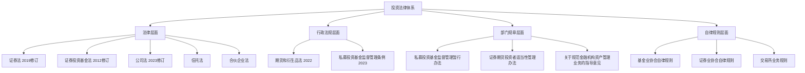
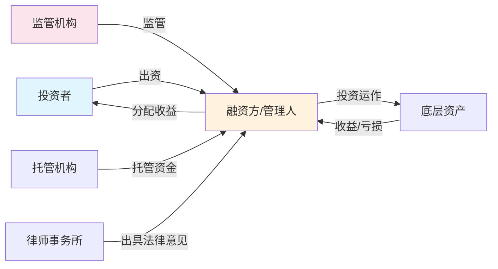
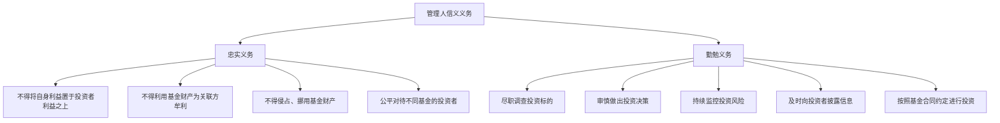
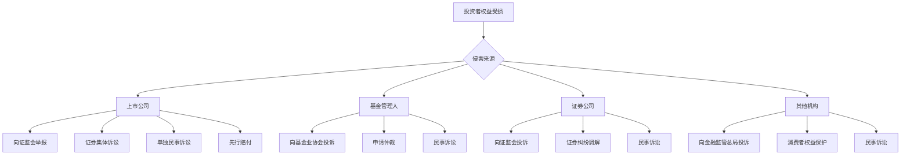
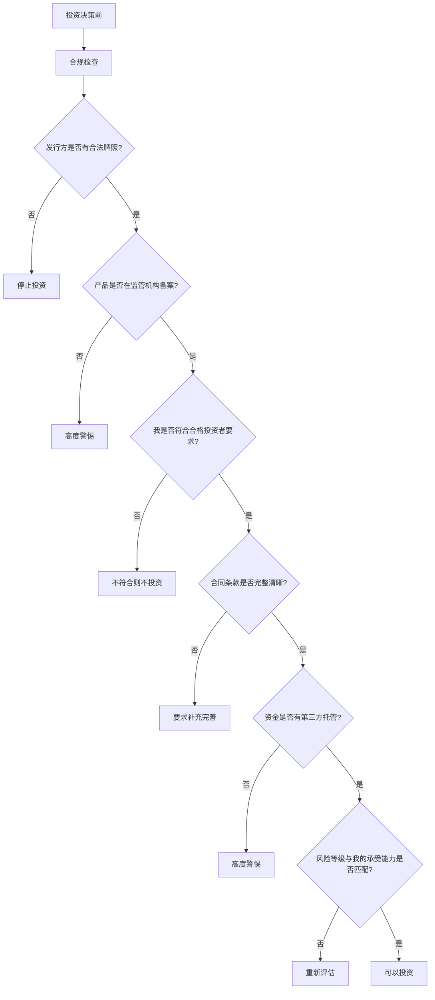

## 五、投资法律基础

投资是搞钱的核心手段之一，但投资活动涉及的法律关系远比大多数人想象的复杂。你买入一只股票、参与一个私募基金、投资一个朋友的创业项目，每一个动作背后都有对应的法律规范在约束。不了解这些规范，轻则错失维权机会，重则踩中法律红线。

本节将系统梳理中国投资领域的法律框架，帮助你在追求投资回报的同时，守住法律底线。

### 1. 投资法律框架全景

#### 1.1 核心法律法规体系

中国投资法律体系以"一法两规三指引"为骨架，涵盖从公开发行到私募投资的完整链条：



**关键法律文本速查表：**

| 法律法规 | 施行时间 | 核心内容 | 与投资者的关系 |
|---------|---------|---------|--------------|
| 《证券法》 | 2020年3月施行（2019修订） | 证券发行、交易、信息披露、投资者保护 | 直接保护证券投资者权益 |
| 《证券投资基金法》 | 2013年6月施行（2012修订） | 公募基金和私募基金的设立、运作、监管 | 基金投资者的权利义务 |
| 《私募投资基金监督管理条例》 | 2023年9月施行 | 私募基金登记备案、投资运作、监督管理 | 私募投资者保护的行政法规依据 |
| 《公司法》 | 2024年7月施行（2023修订） | 公司设立、股东权利、公司治理 | 股权投资者的股东权利保障 |
| 《信托法》 | 2001年10月施行 | 信托关系设立、信托财产、受托人义务 | 信托产品投资者的权利保护 |
| 《期货和衍生品法》 | 2022年8月施行 | 期货交易、衍生品交易、投资者保护 | 期货及衍生品投资者权益 |

#### 1.2 监管机构及其职能

中国投资市场的监管采用"一行一局一会"加行业自律的格局：

| 监管机构 | 全称 | 核心职能 | 对投资者的影响 |
|---------|------|---------|--------------|
| 中国人民银行 | 中国人民银行 | 货币政策、宏观审慎监管、反洗钱 | 影响市场利率和流动性 |
| 国家金融监督管理总局 | 国家金融监督管理总局 | 银行、保险、信托等机构监管 | 金融机构发行的投资产品受其监管 |
| 中国证监会 | 中国证券监督管理委员会 | 证券期货市场监管 | 股票、基金、期货投资者的主要监管者 |
| 基金业协会 | 中国证券投资基金业协会 | 私募基金登记备案、行业自律 | 私募基金合规性的重要判断依据 |
| 地方金融监管局 | 各省市金融监管局 | 地方金融组织监管、非法集资处置 | 区域性投资活动的监管 |

> **实操提示**：判断一个投资产品是否合法，第一步就是确认发行方是否在对应监管机构取得了合法资质。证监会网站（www.csrc.gov.cn）可查询持牌机构，基金业协会网站（www.amac.org.cn）可查询私募基金管理人登记信息。

#### 1.3 投资法律关系的基本结构

任何投资行为，本质上都是一种法律关系的建立。理解这个法律关系的结构，是保护自身权益的前提：



在这个结构中，投资者需要注意三个核心法律关系：

- **委托关系**：你把钱交给管理人，管理人有信义义务（忠实义务+勤勉义务）
- **托管关系**：资金由独立托管机构保管，管理人不能直接接触资金
- **监管关系**：监管机构对融资方/管理人有持续监管职责

### 2. 证券法核心要点

#### 2.1 证券的法律定义与分类

《证券法》第二条规定，证券包括：

| 证券类型 | 具体品种 | 交易场所 | 投资门槛 |
|---------|---------|---------|---------|
| 股票 | A股、B股、H股、红筹股 | 上交所、深交所、北交所、港交所 | 无硬性门槛（A股） |
| 债券 | 国债、企业债、公司债、可转债 | 银行间市场、交易所市场 | 一般无硬性门槛 |
| 基金份额 | 公募基金、ETF、LOF | 交易所、基金销售渠道 | 公募一般1元起 |
| 资产支持证券 | ABS、ABN | 交易所、银行间市场 | 通常需合格投资者 |
| 存托凭证 | CDR | 交易所 | 无硬性门槛 |
| 国务院依法认定的其他证券 | — | — | — |

#### 2.2 证券发行制度

中国证券发行制度经历了从审批制到核准制再到注册制的演变，2023年全面注册制改革落地：

**注册制的核心变化：**

| 维度 | 核准制（旧） | 注册制（新） |
|------|-----------|-----------|
| 审核理念 | 实质审核，监管机构判断企业价值 | 以信息披露为核心，市场判断价值 |
| 审核机构 | 证监会发审委 | 交易所审核+证监会注册 |
| 盈利要求 | 持续盈利是硬指标 | 允许未盈利企业上市（科创板） |
| 发行定价 | 窗口指导，市盈率限制 | 市场化定价 |
| 信息披露 | 监管导向 | 投资者导向，强调充分披露 |
| 退市制度 | 退市难 | 常态化退市 |

**投资者需要注意的变化**：注册制下，"上市"不再等于"监管机构背书"。证监会明确表示，注册制不意味着放松审核，而是将判断企业价值的责任更多交给市场。这意味着投资者需要自行承担更多的判断责任。

#### 2.3 信息披露制度

信息披露是证券法的核心制度，也是投资者保护的第一道防线：

**信息披露义务人的法定义务：**

| 披露类型 | 披露时限 | 主要内容 | 违规后果 |
|---------|---------|---------|---------|
| 招股说明书 | 发行前 | 公司基本情况、财务数据、风险因素 | 欺诈发行可撤销注册 |
| 年度报告 | 每年4月30日前 | 全年经营情况、财务报告 | 警告、罚款、市场禁入 |
| 半年度报告 | 每年8月31日前 | 半年经营情况 | 同上 |
| 季度报告 | 季度结束后1个月内 | 季度主要财务数据 | 同上 |
| 临时报告 | 重大事件发生后2个交易日内 | 重大投资、关联交易、诉讼等 | 同上 |

**信息披露违法的法律后果：**

《证券法》第一百九十七条明确规定，信息披露义务人未按规定披露信息，或者披露的信息有虚假记载、误导性陈述或者重大遗漏的：

- 责令改正，给予警告，并处以100万元以上1000万元以下的罚款
- 对直接负责的主管人员和其他直接责任人员，给予警告，并处以50万元以上500万元以下的罚款
- 发行人的控股股东、实际控制人组织、指使从事上述违法行为的，或者隐瞒相关事项导致发生上述情形的，处以100万元以上1000万元以下的罚款

> **投资者维权路径**：根据《证券法》第八十五条，信息披露义务人未按照规定披露信息，致使投资者在证券交易中遭受损失的，信息披露义务人应当承担赔偿责任。投资者可以通过证券集体诉讼（特别代表人诉讼）维权。

#### 2.4 证券交易的法律规则

**投资者需要了解的核心交易规则：**

| 规则类别 | 具体内容 | 违规后果 |
|---------|---------|---------|
| 禁止内幕交易 | 知悉内幕信息的人不得买卖相关证券 | 没收违法所得+罚款1-10倍，情节严重追究刑事责任 |
| 禁止操纵市场 | 不得以操纵手段影响证券交易价格或交易量 | 没收违法所得+罚款1-10倍，情节严重追究刑事责任 |
| 禁止欺诈客户 | 证券公司不得违背客户委托进行交易 | 赔偿损失+罚款，吊销业务许可 |
| 短线交易限制 | 持股5%以上股东6个月内买卖归入权 | 收益归公司所有 |
| 大股东减持限制 | 大股东减持需提前公告，有限售期 | 责令改正、警告、罚款 |

**内幕交易的认定标准：**

内幕交易是投资者最容易无意触碰的红线之一。根据《证券法》第五十条至第五十四条：

- **内幕信息**：涉及公司的经营、财务或者对该公司的证券市场价格有重大影响的尚未公开的信息，包括重大投资、重大合同、重大亏损、股权变动等
- **内幕知情人**：公司董监高、持股5%以上股东、因职务知悉的人、因监管职责知悉的人
- **交易行为**：买卖该证券、泄露该信息、建议他人买卖

### 3. 私募投资法律规则

#### 3.1 私募基金的法律界定

私募投资基金是指以非公开方式向投资者募集资金设立的投资基金，包括私募证券投资基金、私募股权投资基金、创业投资基金及其他私募投资基金。

**2023年《私募投资基金监督管理条例》的核心要点：**

| 要点 | 具体规定 | 对投资者的影响 |
|------|---------|--------------|
| 登记备案 | 私募基金管理人应向基金业协会登记 | 未登记的管理人不具备合法资质 |
| 合格投资者 | 单只基金投资不低于100万元 | 低于此门槛的"私募"大概率违规 |
| 投资者人数 | 单只基金投资者累计不超过200人 | 超过人数限制可能构成非法集资 |
| 募集方式 | 不得公开募集 | 通过公开渠道宣传的"私募"违规 |
| 信息披露 | 定期向投资者报告基金净值等信息 | 投资者有权要求管理人定期报告 |
| 托管要求 | 原则上应由基金托管人托管 | 资金不受托管的私募风险极高 |

#### 3.2 合格投资者制度

合格投资者制度是私募投资的第一道门槛，目的是确保参与私募的投资者有足够的风险承受能力：

**法定合格投资者标准：**

| 投资者类型 | 认定标准 | 所需证明材料 |
|-----------|---------|------------|
| 机构投资者 | 净资产不低于1000万元 | 审计报告或财务报表 |
| 个人投资者-资产标准 | 金融资产不低于300万元 | 银行存款、股票、基金、债券等资产证明 |
| 个人投资者-收入标准 | 最近三年个人年均收入不低于50万元 | 纳税证明或工资流水 |
| 特殊合格投资者 | 社保基金、企业年金、慈善基金等 | 相关主管部门的批准文件 |

> **重要提醒**：实践中经常出现"拼单"或"代持"的方式绕过合格投资者门槛。这种行为不仅违反私募监管规定，一旦发生纠纷，实际出资人的权益很难得到法律保护。

#### 3.3 私募基金管理人的信义义务

私募基金管理人对投资者负有信义义务，这是私募投资法律关系的核心：

**信义义务的两大支柱：**



**管理人常见违规行为：**

| 违规行为 | 表现形式 | 法律后果 |
|---------|---------|---------|
| 自融 | 将募集资金投向管理人关联方 | 可能构成非法集资 |
| 挪用基金财产 | 将基金资产用于基金合同约定以外的用途 | 赔偿损失+行政处罚 |
| 虚假宣传 | 夸大投资收益、隐瞒投资风险 | 行政处罚+投资者可撤销合同 |
| 利益输送 | 在不同基金之间进行利益输送 | 赔偿损失+行政处罚 |
| 未尽职调查 | 对投资标的未进行充分尽职调查 | 承担赔偿责任 |

### 4. 非法集资的识别与防范

#### 4.1 非法集资的法律定义

根据2022年《最高人民法院关于审理非法集资刑事案件具体应用法律若干问题的解释》，非法集资需同时满足四个条件（"四性"）：

| 特征 | 含义 | 典型表现 |
|------|------|---------|
| 非法性 | 未经有关部门依法批准或者借用合法经营的形式吸收资金 | 无牌照、借用P2P/众筹等合法形式 |
| 公开性 | 通过网络、媒体、推介会、传单、手机短信等途径向社会公开宣传 | 线上推广、线下讲座、朋友圈转发 |
| 利诱性 | 承诺在一定期限内以货币、实物、股权等方式还本付息或者给付回报 | "保本保息""年化收益20%""月月分红" |
| 社会性 | 向社会公众即社会不特定对象吸收资金 | 不限对象、来者不拒 |

**核心判断公式：**

```text
非法集资 = 非法性 + 公开性 + 利诱性 + 社会性（四个要件缺一不可）
```

#### 4.2 非法集资的常见形式

| 形式 | 运作模式 | 识别特征 |
|------|---------|---------|
| 虚假项目型 | 编造虚假投资项目，募集资金后挪作他用或卷款跑路 | 项目信息模糊、无法实地考察、收益远超行业水平 |
| 养老服务型 | 以"养老服务""养老项目"名义吸收资金 | 承诺高额回报、要求预付大额费用 |
| 虚拟货币型 | 发行或炒作虚拟货币，吸引投资者购买 | 发行无实际价值的代币、承诺只涨不跌 |
| 消费返利型 | "消费全返""购物返现"等模式 | 消费金额全额返还、新资金补贴老用户 |
| 私募基金型 | 以私募基金名义变相公开募集 | 不做合格投资者审查、通过公开渠道宣传 |
| 房地产销售型 | 以分割销售、售后包租等方式吸收资金 | 承诺高额租金回报、产权不清晰 |

#### 4.3 非法集资的法律后果

非法集资涉及两个层面的法律责任：

**刑事责任（刑法第一百七十六条 非法吸收公众存款罪）：**

| 情节 | 刑罚 |
|------|------|
| 一般情节 | 三年以下有期徒刑或者拘役，并处或者单处罚金 |
| 数额巨大或有其他严重情节 | 三年以上十年以下有期徒刑，并处罚金 |
| 数额特别巨大或有其他特别严重情节 | 十年以上有期徒刑，并处罚金 |

**刑法第一百九十二条 集资诈骗罪：**

| 情节 | 刑罚 |
|------|------|
| 数额较大 | 三年以上七年以下有期徒刑，并处罚金 |
| 数额巨大或有其他严重情节 | 七年以上有期徒刑或者无期徒刑，并处罚金或者没收财产 |

**对参与者的后果：**

| 角色 | 法律后果 |
|------|---------|
| 组织者/发起人 | 刑事追诉+追缴违法所得 |
| 积极参与者（发展下线、获取高额返佣） | 可能被认定为共犯 |
| 普通投资者 | 本金不受法律保护，损失自担；已获利息冲抵本金 |

> **血泪教训**：非法集资案件中，普通投资者的本金回收率通常极低。以"e租宝"案为例，涉案金额762亿元，最终清退比例仅约35%。参与非法集资，不仅可能血本无归，还可能因为发展下线而承担刑事责任。

#### 4.4 防范非法集资的实操清单

在进行任何投资之前，请逐项核对以下清单：

```text
□ 1. 发行方是否有合法金融牌照？
     → 查证监会/银保监会/基金业协会网站

□ 2. 投资项目是否有真实底层资产？
     → 要求查看项目合同、产权证明、工商登记

□ 3. 收益率是否合理？
     → 超过同期银行贷款利率4倍以上的要高度警惕

□ 4. 是否承诺保本保息？
     → 任何"保本保息"承诺都违反资管新规

□ 5. 资金是否有第三方托管？
     → 要求查看托管协议、托管银行信息

□ 6. 募集方式是否合规？
     → 私募基金不得通过公开渠道宣传

□ 7. 合同条款是否清晰？
     → 注意退出机制、费用结构、风险揭示

□ 8. 是否要求"拉人头"？
     → 有层级返佣模式的大概率涉嫌传销
```

### 5. 投资合同审查要点

#### 5.1 投资合同的法律性质

投资合同是投资者与融资方之间权利义务的书面约定。不同类型的投资，合同形式和法律性质不同：

| 投资类型 | 合同形式 | 法律性质 | 适用法律 |
|---------|---------|---------|---------|
| 股票买卖 | 证券经纪协议 | 委托代理+行纪 | 证券法、民法典 |
| 基金申购 | 基金合同 | 信托关系 | 基金法、信托法 |
| 私募投资 | 私募基金合同 | 委托投资+信托 | 基金法、私募条例 |
| 股权投资 | 股权投资协议 | 投资合同 | 公司法、民法典 |
| 债权投资 | 借款合同/债券认购协议 | 借贷关系 | 民法典 |
| 信托投资 | 信托合同 | 信托关系 | 信托法 |

#### 5.2 投资合同的核心条款审查

无论投资哪种产品，合同中以下条款是审查重点：

**必备条款检查表：**

| 条款类别 | 审查要点 | 风险警示 |
|---------|---------|---------|
| 投资标的 | 投向什么资产？底层资产是否真实？ | 标的模糊或过于复杂的要警惕 |
| 投资期限 | 多长时间？是否有提前终止条款？ | 封闭期过长且无退出机制的风险大 |
| 收益分配 | 收益如何计算？何时分配？如何分配？ | "预期收益""目标收益"不等于承诺收益 |
| 费用结构 | 管理费、托管费、业绩报酬的比例和计算方式 | 注意隐性费用和重复收费 |
| 风险揭示 | 风险等级是什么？最坏情况是什么？ | 没有风险揭示的合同本身就有问题 |
| 退出机制 | 如何赎回/转让？有无锁定期？ | 没有明确退出机制的投资慎入 |
| 违约责任 | 双方违约如何处理？赔偿标准是什么？ | 注意投资者和管理人违约责任是否对等 |
| 争议解决 | 协商、调解、仲裁还是诉讼？ | 注意仲裁与诉讼的区别 |
| 信息披露 | 管理人多久报告一次？报告什么内容？ | 信息不透明是投资风险的重要信号 |

#### 5.3 股权投资协议的特殊条款

股权投资（尤其是创业投资和PE投资）的合同比一般投资合同复杂得多，以下特殊条款需要特别关注：

| 特殊条款 | 含义 | 对投资者的影响 |
|---------|------|--------------|
| 对赌条款（估值调整机制） | 如果目标公司未达到约定业绩，融资方需补偿投资者 | 保护投资者利益，但对赌条件要合理 |
| 反稀释条款 | 后续融资价格低于本轮时，投资者有权获得补偿 | 保护早期投资者不被低价稀释 |
| 优先清算权 | 公司清算时，特定投资者优先获得分配 | 影响普通股股东的清算分配 |
| 优先认购权 | 新一轮融资时，现有投资者有权优先认购 | 保持持股比例不被稀释 |
| 共同出售权 | 创始人出售股份时，投资者有权按比例一起出售 | 退出渠道保障 |
| 回购权 | 约定条件触发时，公司或创始人回购投资者股份 | 退出保障，但要注意回购能力 |
| 一票否决权 | 重大事项需特定投资者同意 | 对公司治理有重大影响 |
| 领售权 | 特定投资者出售股份时，可要求其他股东一起出售 | 强制退出机制 |

> **实操建议**：对赌条款是股权投资纠纷的高发区。最高人民法院在"海富案"中确立了"与股东对赌有效、与公司对赌无效"的裁判规则，但后续司法实践有所变化。签订对赌条款时，务必注意：（1）对赌对手是股东还是公司；（2）对赌条件是否合理；（3）是否有履行保障。

### 6. 投资者权利保护

#### 6.1 投资者适当性制度

投资者适当性制度要求金融机构将适当的产品卖给适当的投资者，是投资者保护的重要制度安排：

**《证券期货投资者适当性管理办法》的核心要求：**

| 环节 | 法律要求 | 违规后果 |
|------|---------|---------|
| 投资者分类 | 划分为普通投资者和专业投资者 | 未分类即销售产品违规 |
| 风险测评 | 评估投资者的风险承受能力 | 未测评或造假测评违规 |
| 产品分级 | 将产品按风险等级分为R1-R5 | 产品未分级即销售违规 |
| 匹配销售 | 产品风险等级不得高于投资者风险承受能力 | 向低风险投资者销售高风险产品违规 |
| 风险揭示 | 充分揭示产品风险 | 未揭示风险或隐瞒风险违规 |
| 双录留痕 | 关键环节录音录像 | 未双录导致举证困难 |

**投资者风险等级与产品匹配：**

| 投资者风险等级 | 适合的产品 | 典型产品 |
|--------------|-----------|---------|
| C1保守型 | R1低风险 | 国债、货币基金、银行存款 |
| C2稳健型 | R1-R2中低风险 | 债券基金、银行理财（低风险） |
| C3平衡型 | R1-R3中风险 | 混合基金、信托产品 |
| C4积极型 | R1-R4中高风险 | 股票基金、私募基金 |
| C5激进型 | R1-R5高风险 | 期货、期权、高杠杆产品 |

> **维权要点**：如果金融机构违反适当性义务，将高风险产品销售给了低风险承受能力的投资者，投资者可以主张金融机构承担赔偿责任。最高人民法院在《全国法院民商事审判工作会议纪要》（九民纪要）第七十二条至第七十八条中明确，卖方机构未尽适当性义务导致金融消费者损失的，应当承担赔偿责任。

#### 6.2 投资者维权的法律途径

当投资者权益受到侵害时，可以通过以下途径维权：



**各维权途径对比：**

| 维权途径 | 适用场景 | 时间成本 | 经济成本 | 成功率 |
|---------|---------|---------|---------|--------|
| 协商和解 | 小额纠纷、事实清楚 | 最快（1-2周） | 无 | 取决于对方态度 |
| 投诉举报 | 违规行为、监管管辖 | 较快（1-3个月） | 无 | 监管介入率高 |
| 调解 | 双方有调解意愿 | 较快（1-2个月） | 低（免费或少量） | 中等 |
| 仲裁 | 合同约定仲裁条款 | 中等（3-6个月） | 中（仲裁费） | 较高 |
| 诉讼 | 复杂纠纷、金额较大 | 较长（6-18个月） | 高（律师费+诉讼费） | 取决于证据 |
| 特别代表人诉讼 | 证券虚假陈述等群体性案件 | 较长 | 低（投保机构代理） | 较高 |

#### 6.3 证券集体诉讼制度

2020年新《证券法》确立的中国特色证券集体诉讼制度（特别代表人诉讼），是投资者维权的重大突破：

**制度要点：**

- **发起主体**：投资者保护机构（中证中小投资者服务中心有限责任公司）
- **参与方式**：投资者"默示加入、明示退出"，即符合条件的投资者自动成为原告，除非明确表示退出
- **适用范围**：证券虚假陈述、内幕交易、操纵市场等案件
- **诉讼费用**：投资者无需支付律师费和诉讼费
- **典型案件**：康美药业案是特别代表人诉讼第一案，5.2万名投资者获赔24.59亿元

### 7. 新兴投资领域的法律问题

#### 7.1 虚拟货币投资的法律风险

中国对虚拟货币的监管态度非常明确——全面禁止：

| 时间 | 政策文件 | 核心内容 |
|------|---------|---------|
| 2013年 | 《关于防范比特币风险的通知》 | 比特币不是货币，金融机构不得开展相关业务 |
| 2017年 | 《关于防范代币发行融资风险的公告》 | 全面禁止ICO，关闭境内交易所 |
| 2021年 | 《关于进一步防范和处置虚拟货币交易炒作风险的通知》 | 虚拟货币相关业务属于非法金融活动 |

**虚拟货币投资的法律后果：**

- **合同效力**：虚拟货币交易合同不受法律保护，法院一般认定为无效合同
- **损失自担**：投资损失无法通过法律途径追回
- **刑事风险**：组织虚拟货币交易、提供兑换服务可能构成非法经营罪
- **洗钱风险**：利用虚拟货币洗钱将被追究刑事责任

#### 7.2 股权众筹的法律边界

股权众筹在中国处于灰色地带，需要区分合法与非法：

| 类型 | 合法性 | 边界条件 |
|------|--------|---------|
| 公益众筹 | 合法 | 通过民政部指定平台 |
| 产品众筹（回报类） | 合法 | 不涉及股权、债券等金融产品 |
| 股权众筹 | 法律未明确 | 目前无专门法规，存在法律不确定性 |
| 债权众筹（P2P） | 已全面清退 | 2020年底P2P网贷机构全部清退 |

#### 7.3 信托产品的投资者保护

信托产品是高净值人群常见的投资工具，但也有独特的法律风险：

**信托投资者的权利：**

| 权利 | 法律依据 | 具体内容 |
|------|---------|---------|
| 知情权 | 信托法第三十三条 | 有权了解信托财产的管理、运用、处分及收支情况 |
| 取消权 | 信托法第二十二条 | 受托人违反信托目的处分信托财产，委托人有权撤销 |
| 解任权 | 信托法第二十三条 | 受托人违反信托目的管理信托财产，委托人有权解任 |
| 损害赔偿请求权 | 信托法第二十二条 | 受托人违反信托目的造成损失，有权要求赔偿 |

**信托产品违约的处理流程：**

1. **核实情况**：确认产品是否真的违约，查看受托人（信托公司）的公告
2. **行使知情权**：要求信托公司提供详细的项目情况报告
3. **参加受益人大会**：通过受益人大会表达意见、行使表决权
4. **协商处置方案**：参与协商延期兑付、资产处置等方案
5. **监管投诉**：向国家金融监督管理总局投诉
6. **法律诉讼**：协商不成的，可以起诉信托公司

### 8. 常见投资法律误区

#### 误区一：签了合同就万事大合同

**错误认知**：只要签了投资合同，权益就有了保障。

**真实情况**：合同只是法律关系的起点，不是终点。合同可能因违法而无效，对方可能无力履行，诉讼可能无法执行。

**正确做法**：签合同前做好尽职调查，签合同时确保条款完整清晰，签合同后持续关注履行情况。关键是要核实对方是否有履行能力——一个空壳公司签的再完美的合同也没有实际保障。

#### 误区二：高收益产品一定违法

**错误认知**：收益率超过一定水平（如年化10%）的产品就一定是骗局。

**真实情况**：高收益不等于违法，但高收益一定伴随高风险。股权投资、量化对冲基金等合法产品的收益可能很高，但同时也可能面临大幅亏损。

**正确做法**：判断一个投资是否合法，核心标准不是收益率，而是：（1）是否有合法资质；（2）资金是否有托管；（3）底层资产是否真实；（4）募集方式是否合规。

#### 误区三：银行卖的产品就一定安全

**错误认知**：银行代销的产品有银行背书，不会有风险。

**真实情况**：银行只是代销渠道，不对产品风险负责。2018年资管新规后，银行理财产品已经打破刚性兑付，不再保本保息。银行代销的基金、保险、信托等产品，风险由投资者自担。

**正确做法**：区分"银行自营产品"和"银行代销产品"。购买任何产品前，都要了解产品的风险等级、底层资产、管理人资质，不能因为"在银行买的"就放松警惕。

#### 误区四：保本保息条款是护身符

**错误认知**：合同里写了"保本保息"，就一定能拿回本金和收益。

**真实情况**：《关于规范金融机构资产管理业务的指导意见》（资管新规）明确禁止资产管理产品的发行人、管理人对产品进行保本保息承诺。如果管理人破产或携款潜逃，"保本保息"条款只是一纸空文。

**正确做法**：不要因为"保本保息"承诺就降低对投资风险的判断。真正安全的投资（如国债、银行存款）不需要额外的"保本保息"承诺，需要承诺的往往是本身就不安全的产品。

#### 误区五：朋友介绍的投资不需要法律保护

**错误认知**：朋友推荐的投资项目，有朋友做担保，不需要签正式合同。

**真实情况**：大量投资纠纷发生在熟人之间。口头承诺难以举证，朋友的"担保"如果没有书面约定，法律效力极弱。

**正确做法**：任何投资，不论金额大小、关系亲疏，都应当：（1）签订书面合同；（2）资金走正规渠道；（3）保留所有沟通记录和转账凭证。

### 9. 投资法律合规自检框架

为了帮助投资者在实际操作中做好法律合规，以下提供一套自检框架：



**投资后的持续合规检查：**

| 检查项 | 频率 | 具体操作 |
|--------|------|---------|
| 确认管理人资质 | 每季度 | 在监管网站查询管理人是否仍具备资质 |
| 查看信息披露报告 | 每季度/半年 | 认真阅读管理人定期报告，关注异常指标 |
| 确认托管状态 | 每半年 | 确认资金仍在托管账户中 |
| 评估投资表现 | 每年 | 将实际收益与承诺收益对比，评估风险变化 |
| 关注监管动态 | 持续 | 关注证监会、基金业协会的监管公告 |

### 10. 本节核心要点回顾

| 要点 | 核心内容 |
|------|---------|
| 法律框架 | "一法两规三指引"：证券法、基金法、私募条例为核心 |
| 监管格局 | 金融监管总局+证监会+基金业协会，各司其职 |
| 证券法核心 | 注册制、信息披露、禁止内幕交易和操纵市场 |
| 私募规则 | 合格投资者门槛、登记备案、信义义务 |
| 非法集资 | "四性"判断：非法性+公开性+利诱性+社会性 |
| 合同审查 | 八大核心条款：标的、期限、收益、费用、风险、退出、违约、争议 |
| 投资者保护 | 适当性制度+特别代表人诉讼+多渠道维权 |
| 新兴领域 | 虚拟货币全面禁止，股权众筹法律灰色地带 |
| 核心原则 | 任何投资决策前都要做法律合规检查，不能只看收益不看风险 |

投资法律知识不是一次学完就够用的——法律法规在持续更新，市场环境在不断变化。建立持续学习的习惯，关注监管动态，遇到复杂问题及时咨询专业律师，这才是投资法律合规的长久之道。
