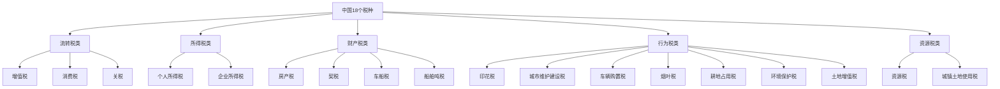
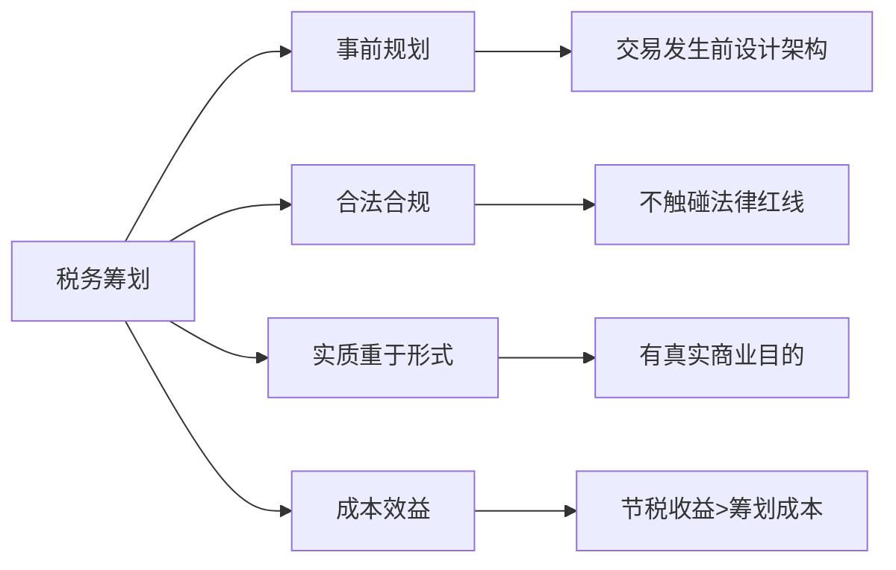

## 六、税务法律基础

税务是每个赚钱的人都绕不开的话题。无论你是上班族、自由职业者、个体户还是企业老板，只要有收入，就涉及纳税义务。很多人对税的认知停留在"发工资扣税"这个层面，但实际上中国税制远比这复杂——增值税、企业所得税、印花税、房产税、个税的综合与分类征收……每一项都直接影响你到手的钱。

本节从法律视角出发，帮你建立完整的税务认知框架：知道该交什么税、交多少、怎么交、怎么合法省税，以及踩了红线会怎样。

---

### 1. 中国税制概览

#### 1.1 税收法律体系层级

中国的税收法律体系呈金字塔结构，效力从高到低：

| 层级 | 文件类型 | 制定主体 | 示例 |
|------|---------|---------|------|
| 第一层 | 税收法律 | 全国人大及其常委会 | 《个人所得税法》《企业所得税法》《税收征收管理法》 |
| 第二层 | 行政法规 | 国务院 | 《增值税暂行条例》《个人所得税法实施条例》 |
| 第三层 | 部门规章 | 财政部、国家税务总局 | 各税种的实施细则、公告、通知 |
| 第四层 | 规范性文件 | 税务总局及省级税务机关 | 具体操作指引、口径解释 |

**关键认知：** 目前中国18个税种中，只有个人所得税、企业所得税、车船税、环境保护税、烟叶税、船舶吨税、耕地占用税、资源税这8个有正式法律依据，其余仍以"暂行条例"形式存在。这意味着很多税种的法律位阶较低，政策变动相对频繁。

#### 1.2 现行18个税种全景



对个人和小微企业而言，最常接触的税种集中在以下几个：

- **个人所得税** — 工资薪金、劳务报酬、经营所得等
- **增值税** — 销售商品或提供服务时产生
- **企业所得税** — 企业盈利后缴纳
- **印花税** — 签订合同、产权转移时缴纳
- **房产税/契税** — 涉及房产交易和持有

#### 1.3 税收征管基本原则

《税收征收管理法》确立了几项核心原则，理解这些原则能帮你判断税务行为的合法性：

**税收法定原则** — 任何税收的开征、停征、税率调整，必须有法律依据。税务机关不能随意加税或创设税种。

**实质课税原则** — 税务机关有权根据交易的经济实质而非法律形式来认定纳税义务。这意味着"换个名字避税"的做法可能被穿透。

**诚实信用原则** — 纳税人应如实申报，税务机关应依法征税。双方都不能滥用权利。

**程序正当原则** — 税务机关做出不利于纳税人的决定前，必须告知、听取陈述申辩。纳税人有权申请行政复议和行政诉讼。

---

### 2. 个人所得税深度解析

个税是与每个人最直接相关的税种。2019年新个税法实施后，从分类征收转向"综合与分类相结合"的模式，这是理解当代中国个税的起点。

#### 2.1 应税所得的九个类别

| 类别 | 具体内容 | 税率 | 纳税方式 |
|------|---------|------|---------|
| 工资薪金所得 | 工资、奖金、津贴、补贴、年终奖 | 3%-45%超额累进 | 综合所得，按年计算 |
| 劳务报酬所得 | 设计、咨询、讲学、演出等非雇佣劳务 | 20%-40%（预扣）→并入综合 | 综合所得，按年计算 |
| 稿酬所得 | 出版、发表作品的收入 | 20%（预扣）→并入综合，享70%减免 | 综合所得，按年计算 |
| 特许权使用费所得 | 专利权、商标权、著作权许可使用费 | 20%（预扣）→并入综合 | 综合所得，按年计算 |
| 经营所得 | 个体户、个人独资企业、合伙企业收入 | 5%-35%超额累进 | 按年计算，按月/季预缴 |
| 利息所得 | 存款利息、债券利息 | 20%（暂免征收储蓄存款利息税） | 分类征收，按次 |
| 股息红利所得 | 股票分红、股权投资收益 | 20%（持股>1年免税） | 分类征收，按次 |
| 财产租赁所得 | 出租房屋、设备等 | 20%（住房出租减按10%） | 分类征收，按月/次 |
| 财产转让所得 | 卖房、卖股票、转让股权 | 20%（个人股票转让暂免） | 分类征收，按次 |
| 偶然所得 | 中奖、受赠（非亲属） | 20% | 分类征收，按次 |

**关键区分：综合所得 vs 分类所得**

综合所得（工资薪金+劳务报酬+稿酬+特许权使用费）合并按年计算，适用3%-45%的七级超额累进税率。这意味着你有4种收入类型可以互相"拉平"，通过合理安排来降低边际税率。

经营所得单独适用5%-35%的五级超额累进税率，不与综合所得合并。

#### 2.2 综合所得税率表（2024年现行）

| 级数 | 全年应纳税所得额 | 税率 | 速算扣除数 |
|------|----------------|------|-----------|
| 1 | 不超过36,000元 | 3% | 0 |
| 2 | 36,000-144,000元 | 10% | 2,520 |
| 3 | 144,000-300,000元 | 20% | 16,920 |
| 4 | 300,000-420,000元 | 25% | 31,920 |
| 5 | 420,000-660,000元 | 30% | 52,920 |
| 6 | 660,000-960,000元 | 35% | 85,920 |
| 7 | 超过960,000元 | 45% | 181,920 |

**计算公式：** 应纳税额 = (年收入 - 60,000元基本减除 - 专项扣除 - 专项附加扣除 - 其他扣除) × 税率 - 速算扣除数

#### 2.3 专项附加扣除详解

这是2019年个税改革的最大亮点，直接降低了实际税负：

| 扣除项目 | 扣除标准 | 条件说明 |
|---------|---------|---------|
| 子女教育 | 每孩每月2,000元（2023年提标） | 3岁至博士阶段，父母各扣50%或一方扣100% |
| 继续教育 | 学历教育每月400元；职业资格取得当年3,600元 | 学历教育最长48个月 |
| 大病医疗 | 自付超15,000元部分，限额80,000元/年 | 医保目录内自付部分，汇算时扣除 |
| 住房贷款利息 | 首套房每月1,000元 | 最长240个月，与住房租金不可同时享受 |
| 住房租金 | 直辖市/省会/计划单列市每月1,500元；市辖区户籍人口>100万城市每月1,100元；≤100万城市每月800元 | 工作城市无自有住房 |
| 赡养老人 | 独生子女每月3,000元（2023年提标）；非独生分摊每月3,000元 | 被赡养人年满60岁 |
| 3岁以下婴幼儿照护 | 每孩每月2,000元（2023年提标） | 父母各扣50%或一方扣100% |

**实操要点：**
- 通过"个人所得税"APP填报，信息需真实
- 单位按月预扣时可享受，也可在年度汇算时一次性扣除
- 大病医疗只能在次年3-6月汇算清缴时扣除，不能按月预扣
- 夫妻间可以协商分配扣除比例，选择对家庭总税负最优的方案

#### 2.4 年终奖的税务处理

年终奖可以选择两种方式：

**单独计税：** 年终奖÷12确定适用税率，单独计算税额。公式：应纳税额 = 年终奖 × 税率 - 速算扣除数。

**并入综合所得：** 年终奖直接计入全年收入，参与综合所得计算。

**关键策略：** 并非所有情况下单独计税都更优。当年终奖金额恰好跨越税率临界点时（如36,000元、144,000元等），多发1块钱可能导致税额增加数千元。需要分别计算两种方案的税额，选择更低的。

**"年终奖陷阱"示例：** 年终奖36,000元，税率3%，税额1,080元；年终奖36,001元，税率10%，税额3,390.10元——多发1块钱多交2,310元税。

这个政策延续至2027年底，届时是否延续需要关注财政部公告。

#### 2.5 年度汇算清缴

每年3月1日至6月30日，需要对上一年度的综合所得进行汇算清缴：

**需要办理汇算的情形：**
- 年度综合所得收入超过12万元且补税金额超过400元
- 预缴税额大于应纳税额，需要申请退税

**不需要办理的情形：**
- 年度汇算需补税但综合所得收入不超过12万元
- 年度汇算需补税金额不超过400元
- 已预缴税额与应纳税额一致
- 符合退税条件但不申请退税

**办理渠道：** 个人所得税APP（最便捷）、自然人电子税务局网页端、邮寄申报、办税服务厅。

---

### 3. 增值税基础

增值税是中国第一大税种，占税收总收入的40%以上。虽然表面上由企业缴纳，但实际上最终承担者是消费者——它隐含在你购买的每一件商品和服务的价格中。

#### 3.1 增值税的基本原理

增值税的核心理念是对"增值额"征税。企业在销售时收取销项税，在采购时支付进项税，两者之差就是应缴的增值税。

```text
应纳增值税 = 销项税额 - 进项税额
销项税额 = 销售额 × 税率
进项税额 = 采购额 × 税率（取得合规发票）
```

**举例：** 一家公司以113万元卖出一批货物（含税），适用13%税率，销项税额 = 113 ÷ 1.13 × 13% = 13万元。该公司采购这批货物花了79.1万元（含税），进项税额 = 79.1 ÷ 1.13 × 13% = 9.1万元。应纳增值税 = 13 - 9.1 = 3.9万元。

#### 3.2 纳税人分类与税率

| 纳税人类型 | 年销售额标准 | 税率/征收率 | 计税方式 |
|-----------|------------|-----------|---------|
| 一般纳税人 | >500万元 | 13%、9%、6%、0% | 销项-进项，可抵扣 |
| 小规模纳税人 | ≤500万元 | 3%（2023-2027年减按1%） | 简易计税，不可抵扣 |

**各税率适用范围：**

- **13%：** 销售货物、加工修理修配劳务、有形动产租赁
- **9%：** 交通运输、建筑、基础电信、不动产租赁/销售、农产品、自来水、暖气、图书报刊等
- **6%：** 金融、现代服务（研发/信息技术/咨询/广告等）、生活服务、增值电信
- **0%：** 出口货物及特定跨境服务

#### 3.3 小规模纳税人的优惠政策

对个人创业者和小微企业来说，小规模纳税人的优惠政策至关重要：

- **月销售额≤10万元（季度≤30万元）：** 免征增值税（普票部分）
- **超过免征额的部分：** 减按1%征收率征收（原3%）
- **适用期限：** 上述优惠延续至2027年12月31日

**实操影响：** 如果你是年收入不超过120万元的小规模纳税人，开具普通发票的部分可以完全免交增值税。这是小微企业最大的税收红利之一。

#### 3.4 发票管理

发票是增值税的核心凭证。中国税务体系高度依赖"以票控税"：

- **增值税专用发票：** 购买方可以凭此抵扣进项税额。一般纳税人才能开具。
- **增值税普通发票：** 不能抵扣，但可以作为成本入账凭证。
- **电子发票：** 与纸质发票具有同等法律效力。2024年起全面推行数电发票（全电发票），不再需要税控设备。
- **数电发票：** 全称"全面数字化的电子发票"，取消了发票限额和份数限制，通过电子发票服务平台开具。

**红线警示：** 虚开增值税专用发票是刑事犯罪。《刑法》第205条规定，虚开税款数额较大或有其他严重情节的，处3年以上10年以下有期徒刑；虚开税款数额巨大或有其他特别严重情节的，处10年以上有期徒刑或无期徒刑。即使是"帮朋友开个票"，也可能构成虚开。

---

### 4. 企业所得税

#### 4.1 基本规则

| 项目 | 内容 |
|------|------|
| 纳税人 | 居民企业（境内注册或实际管理机构在境内） |
| 税率 | 基本税率25% |
| 优惠税率 | 高新技术企业15%；小型微利企业实际税负5%；技术先进型服务企业15% |
| 应纳税所得额 | 收入总额 - 不征税收入 - 免税收入 - 各项扣除 - 弥补亏损 |
| 纳税年度 | 公历1月1日至12月31日 |
| 申报方式 | 按年计算，分月/季预缴，次年5月31日前汇算清缴 |

#### 4.2 小型微利企业优惠

这是创业者最应关注的税收优惠：

**认定标准（同时满足）：**
- 年度应纳税所得额不超过300万元
- 从业人数不超过300人
- 资产总额不超过5,000万元

**优惠内容（2023-2027年）：**
- 应纳税所得额≤300万元的部分，减按25%计入应纳税所得额，按20%税率缴纳
- 实际税负 = 25% × 20% = 5%（相比25%基本税率节省80%）

**举例：** 某小微企业年利润200万元，应纳企业所得税 = 200万 × 25% × 20% = 10万元，实际税负5%。而如果不享受优惠，需缴50万元。

#### 4.3 常见可扣除项目

企业所得税的关键在于"哪些支出可以税前扣除"——扣除越多，应纳税所得额越低，交税越少。

| 扣除项目 | 扣除标准 |
|---------|---------|
| 工资薪金 | 合理支出全额扣除 |
| 职工福利费 | 工资总额的14%以内 |
| 工会经费 | 工资总额的2%以内 |
| 职工教育经费 | 工资总额的8%以内（超出部分可结转） |
| 业务招待费 | 发生额的60%与营收5‰孰低 |
| 广告和业务宣传费 | 营收15%（化妆品/医药/饮料制造为30%，超出可结转） |
| 公益性捐赠 | 年度利润总额的12%以内（超出3年结转） |
| 研发费用 | 加计扣除100%（实际发生额的200%扣除） |

**研发费用加计扣除** 是科技创新企业最重要的税收优惠。假设你的企业投入100万元研发费用，不仅可以据实扣除，还能额外扣除100万元，相当于在25%税率下节省25万元企业所得税。

---

### 5. 个人常见涉税场景实操

#### 5.1 工薪族的税务优化

作为普通上班族，你的可操作空间主要在专项附加扣除的充分利用上：

**自查清单：**
1. 是否填报了所有符合条件的专项附加扣除？
2. 夫妻双方的扣除分配是否为最优方案？
3. 年终奖选择单独计税还是并入综合所得更划算？
4. 是否有符合条件的公益捐赠可以在汇算时扣除？

**常见遗漏：**
- 很多人不知道赡养岳父母/公婆不能扣除（只能扣自己的父母或子女已故的祖父母/外祖父母）
- 继续教育扣除只认"学历继续教育"和"职业资格继续教育"，在职MBA可以扣，但兴趣班不行
- 住房贷款利息和住房租金不能同时享受，需要根据金额选择更优的

#### 5.2 自由职业者/斜杠青年

自由职业者的税务处理比上班族复杂得多，收入类型不同，税负差异巨大：

**劳务报酬 vs 经营所得的区别：**

| 维度 | 劳务报酬 | 经营所得 |
|------|---------|---------|
| 适用场景 | 接零散项目，无固定经营场所 | 注册个体户/个人独资企业，持续经营 |
| 预扣税率 | 20%-40% | 5%-35% |
| 年终汇算 | 并入综合所得 | 单独计算 |
| 成本扣除 | 每次收入≤4,000元扣800元；>4,000元扣20% | 据实扣除经营成本 |
| 实际税负 | 较高（预扣时无成本扣除） | 较低（可扣除实际经营支出） |

**实操建议：** 如果你的自由职业收入稳定且规模较大（年收入超过20万元），可以考虑注册为个体工商户，从"劳务报酬"转变为"经营所得"。经营所得可以扣除房租、设备、交通、办公用品等实际经营成本，实际税负往往远低于劳务报酬的预扣税负。

#### 5.3 房产相关税务

涉及房产的税种多、金额大，是个人最常踩坑的领域：

**卖房（卖方）：**
- 增值税：满2年免征（北上广深的非普通住房除外）；不满2年按5%全额缴纳
- 个人所得税：满5年且唯一住房免征；否则按差额20%或全额1%-2%缴纳
- 印花税：暂免征收
- 土地增值税：个人销售住房暂免征收

**买房（买方）：**
- 契税：首套房90㎡以下1%、90㎡以上1.5%；二套房90㎡以下1%、90㎡以上2%；三套及以上3%（各地政策有差异）
- 印花税：暂免征收

**出租（房东）：**
- 个人所得税：住房出租减按10%征收
- 增值税：月租金≤10万元免征；超过按1.5%征收
- 房产税：住房出租按4%税率减半（实际2%）

**关键提醒：** 很多人卖房时不知道"满五唯一"的免税政策，或者错误理解"满2年"的起算时间。满2年的起算时间是房产证或契税完税证明上的日期（孰先），不是购房合同签订日期。

#### 5.4 股权与投资收益

**股票投资：**
- 个人买卖A股的差价收入暂免个人所得税
- 股息红利按持股期限差异化征税：持股≤1个月全额征税（20%）；1个月至1年减半（10%）；>1年免税
- 新三板（北交所）股票：持股>1年免税，≤1年按20%

**股权转让：**
- 个人转让非上市公司股权，按"财产转让所得"缴纳20%个税
- 转让价格明显偏低且无正当理由的，税务机关有权核定
- 正当理由包括：能出具有效文件证明被投资企业因国家政策调整经营受到重大影响；继承或将股权转让给配偶、父母、子女等直系亲属

**加密货币：** 目前中国没有针对加密货币交易的专门税务规定，但税务实践中已有案例将加密货币交易收益认定为"财产转让所得"按20%征税。由于中国全面禁止加密货币交易，相关收入的法律性质存在争议。

---

### 6. 税务筹划与节税策略

税务筹划是在法律允许的范围内，通过对经营、投资、理财活动的事先安排，尽可能降低税负。它与偷税、漏税有本质区别。

#### 6.1 合法节税的核心原则



**合法与违法的边界：**

| 行为 | 性质 | 后果 |
|------|------|------|
| 充分利用专项附加扣除 | 合法节税 | 受法律保护 |
| 选择合适的纳税人身份 | 合法节税 | 受法律保护 |
| 利用税收优惠政策 | 合法节税 | 受法律保护 |
| 改变交易形式但无商业实质 | 避税/不当避税 | 纳税调整+补税+利息 |
| 隐匿收入、虚列支出 | 偷税 | 补税+0.5-5倍罚款+滞纳金 |
| 虚开发票 | 虚开发票罪 | 刑事责任 |

#### 6.2 个人可操作的节税策略

**策略一：充分利用专项附加扣除**

这是最安全、最直接的节税方式。以一个三口之家为例（1个小孩、赡养1位老人、有首套房贷）：

| 扣除项 | 月扣除额 | 年扣除额 |
|--------|---------|---------|
| 基本减除 | 5,000元 | 60,000元 |
| 五险一金（假设） | 4,000元 | 48,000元 |
| 子女教育 | 2,000元 | 24,000元 |
| 赡养老人 | 3,000元 | 36,000元 |
| 住房贷款利息 | 1,000元 | 12,000元 |
| **合计** | **15,000元** | **180,000元** |

年收入30万元的纳税人，应纳税所得额从24万元降至12万元，税负从22,080元降至4,080元，节省18,000元。

**策略二：合理规划收入时点和类型**

- 年终奖单独计税 vs 并入综合所得的选择
- 将部分工资转为免税的福利（如差旅补贴、通讯补贴等按标准发放的部分）
- 股息红利的持股期限规划（持有超过1年免税）

**策略三：公益捐赠抵税**

个人通过合规公益性社会组织的捐赠，可以在应纳税所得额30%以内扣除。当年不够扣的，可以在当年综合所得中扣除。

**策略四：利用税收优惠政策**

- 个人养老金：每年12,000元的缴费可以在综合所得中扣除，投资收益暂不征税，领取时按3%单独计税
- 商业健康保险：每年2,400元（每月200元）可以在税前扣除
- 税延养老保险：部分地区试点，缴费阶段免税

#### 6.3 创业者的税务架构设计

**个体户 vs 个人独资企业 vs 有限公司：**

| 维度 | 个体工商户 | 个人独资企业 | 有限公司 |
|------|-----------|------------|---------|
| 法律主体 | 自然人 | 自然人 | 法人 |
| 税种 | 个人所得税（经营所得） | 个人所得税（经营所得） | 企业所得税+个税（分红） |
| 核定征收 | 部分地区可核定 | 部分地区可核定 | 一般查账征收 |
| 亏损弥补 | 不能跨年 | 不能跨年 | 5年内弥补 |
| 债务责任 | 无限责任 | 无限责任 | 有限责任 |
| 适合场景 | 小规模、低风险业务 | 灵感/咨询服务等轻资产 | 需融资、有规模的业务 |

**核定征收与查账征收：**

核定征收是税务机关按固定比例或定额征税，适用于账簿不健全的小微企业。在核定征收下，实际税负可能远低于查账征收。

但要注意：2021年以来，多地收紧了核定征收政策，尤其是对个人独资企业和合伙企业的核定征收。部分地区的"税收洼地"政策可能随时调整，依赖核定征收做税务筹划存在政策风险。

---

### 7. 税务违法行为与法律后果

#### 7.1 常见税务违法行为

| 违法行为 | 法律依据 | 处罚标准 |
|---------|---------|---------|
| 偷税（隐匿收入/虚列支出/虚假申报） | 《税收征管法》第63条 | 追缴税款+滞纳金（日万分之五）+0.5-5倍罚款 |
| 逃避追缴欠税 | 《税收征管法》第65条 | 追缴税款+滞纳金+0.5-5倍罚款 |
| 骗取出口退税 | 《税收征管法》第66条 | 追缴退税款+1-5倍罚款；构成犯罪的追究刑事责任 |
| 虚开发票 | 《刑法》第205条 | 3年以下/3-10年/10年以上或无期 |
| 抗税 | 《税收征管法》第67条 | 追缴税款+滞纳金+1-5倍罚款；构成犯罪追究刑事责任 |
| 未按规定申报 | 《税收征管法》第62条 | 责令限期改正，可处2,000元以下罚款；情节严重处2,000-10,000元 |

#### 7.2 税收滞纳金

滞纳金从滞纳税款之日起，按日加收滞纳税款万分之五。换算成年利率约为18.25%，远高于银行贷款利率。

**计算公式：** 滞纳金 = 滞纳税款 × 0.05% × 滞纳天数

**举例：** 欠税10万元，滞纳180天，滞纳金 = 100,000 × 0.05% × 180 = 9,000元。

#### 7.3 税务行政处罚的追诉时效

- 违反税收法律、行政法规应当给予行政处罚的行为，5年内未被发现的，不再给予行政处罚
- 但"偷税"不受5年限制——税务机关可以无限期追征

#### 7.4 刑事责任

涉及税务的刑事犯罪主要规定在《刑法》第三章第六节"危害税收征管罪"中：

| 罪名 | 量刑标准 |
|------|---------|
| 逃税罪 | 逃避缴纳税款数额较大（5万元以上）且占应纳税额10%以上：3年以下有期徒刑或拘役，并处罚金 |
| 逃税罪（加重） | 数额巨大且占30%以上：3-7年有期徒刑，并处罚金 |
| 虚开增值税专用发票罪 | 税款数额较大：3年以下；数额巨大：3-10年；数额特别巨大：10年以上或无期 |
| 骗取出口退税罪 | 数额较大：5年以下；数额巨大：5-10年；数额特别巨大：10年以上或无期 |

**重要条款：** 逃税罪有"首违不罚"的特殊规定——经税务机关依法下达追缴通知后，补缴应纳税款、缴纳滞纳金、已受行政处罚的，不予追究刑事责任（5年内因逃税受过刑事处罚或被税务机关给予两次以上行政处罚的除外）。

---

### 8. 税务稽查与应对

#### 8.1 税务稽查的触发条件

税务机关并非随机抽查，以下情况容易触发稽查：

- **金税系统预警：** 金税四期的大数据比对发现异常（如收入与申报不符、进销项不匹配）
- **举报：** 任何人可以向税务机关举报涉税违法行为
- **专项检查：** 针对特定行业或特定行为的专项整治
- **协查：** 上下游企业被稽查后引发的关联检查
- **随机抽查：** 税务机关按照一定比例随机选取检查对象

#### 8.2 金税四期的影响

金税四期（2024年起全面推行）相比三期的重大升级：

- **纳入非税业务：** 社保、公积金等非税收入也纳入监管
- **银行信息共享：** 与银行、市场监管等部门数据联网
- **个人卡监管：** 个人银行账户的大额交易和可疑交易会被重点关注
- **智能分析：** AI驱动的风险识别，自动预警异常指标

**高风险行为：**
- 公转私频繁且金额较大
- 长期零申报或亏损但持续经营
- 增值税税负率明显低于行业平均水平
- 大量现金交易
- 进销品名严重不匹配

#### 8.3 收到稽查通知后的应对

1. **保持冷静，配合检查。** 税务稽查是正常的行政执法行为，不意味着你一定有问题。
2. **指定专人对接。** 最好是熟悉业务和账务的财务人员或税务师。
3. **准备资料。** 按照《税务检查通知书》要求准备账簿、凭证、合同、银行流水等。
4. **聘请专业人士。** 涉及金额较大的，建议聘请税务师或律师。
5. **陈述申辩权。** 对税务机关拟做出的处理决定，你有权陈述和申辩。
6. **行政复议。** 对处理决定不服的，必须先缴清税款或提供担保，然后在60日内向上一级税务机关申请行政复议。
7. **行政诉讼。** 对复议决定不服的，可在15日内向人民法院提起行政诉讼。

**特别注意：** "先缴后诉"是税务行政诉讼的前置条件——不缴税或不提供担保，不能申请行政复议，也不能提起行政诉讼。

---

### 9. 税务工具与资源

#### 9.1 必备工具

| 工具 | 用途 | 获取方式 |
|------|------|---------|
| 个人所得税APP | 个税申报、专项附加扣除填报、汇算清缴 | 各应用商店搜索"个人所得税" |
| 自然人电子税务局 | 网页端个税申报、收入明细查询 | etax.chinatax.gov.cn |
| 电子税务局 | 企业税务申报、发票开具、涉税查询 | 各省电子税务局网站（如 etax.shanghai.chinatax.gov.cn） |
| 全国增值税发票查验平台 | 验证发票真伪 | inv-veri.chinatax.gov.cn |
| 国家税务总局官网 | 政策文件、公告查询 | www.chinatax.gov.cn |

#### 9.2 税率计算器

对于个人所得税，推荐使用以下在线工具快速计算：

```python
# 个税计算逻辑（Python示例）

def calc_income_tax(annual_income, deductions=60000, special_deductions=0):
    """计算综合所得个人所得税"""
    taxable = annual_income - deductions - special_deductions
    if taxable <= 0:
        return 0
    
    brackets = [
        (36000,   0.03, 0),
        (144000,  0.10, 2520),
        (300000,  0.20, 16920),
        (420000,  0.25, 31920),
        (660000,  0.30, 52920),
        (960000,  0.35, 85920),
        (float('inf'), 0.45, 181920),
    ]
    
    for threshold, rate, deduction in brackets:
        if taxable <= threshold:
            return taxable * rate - deduction
    return 0

# 示例：年收入30万，扣除18万（6万基本+12万专项附加）
tax = calc_income_tax(300000, special_deductions=120000)
print(f"应纳税额: {tax}元")  # 输出: 应纳税额: 4080.0元
```

#### 9.3 关键法规索引

| 法规名称 | 最新修订 | 核心内容 |
|---------|---------|---------|
| 《个人所得税法》 | 2018年修正 | 个税基本制度 |
| 《个人所得税法实施条例》 | 2018年修订 | 个税实施细则 |
| 《企业所得税法》 | 2018年修正 | 企业所得税基本制度 |
| 《增值税暂行条例》 | 2017年修订 | 增值税基本规则 |
| 《税收征收管理法》 | 2015年修正 | 税收征管程序 |
| 《发票管理办法》 | 2023年修订 | 发票管理规则 |

---

### 10. 常见误区与纠正

#### 误区一："工资高才需要交税"

**真相：** 任何类型的收入——包括兼职、稿费、房租、卖房、中奖——都可能产生纳税义务。即使是零收入的大学生，如果中了彩票大奖，也需要缴纳20%的偶然所得税。

#### 误区二："个人所得税APP显示退税就一定能退"

**真相：** APP显示的退税金额是基于你填报信息的预估。如果你填报的专项附加扣除信息不准确，或者有遗漏的收入未申报，税务机关可能在审核后调整。恶意虚假申报骗取退税属于违法行为。

#### 误区三："个体户不用交税"

**真相：** 个体户需要缴纳增值税（小规模纳税人月销售额超10万元部分）和个人所得税（经营所得）。月销售额10万元以下免增值税是优惠政策，不是"不用交税"。经营所得仍需按规定缴纳个税。

#### 误区四："注销公司就不用补税了"

**真相：** 税务注销前必须完成清税。如果有欠税、罚款、滞纳金，必须缴清后才能注销。2019年以来，税务与市场监管部门信息共享加强，"一走了之"几乎不可能。

#### 误区五："现金交易税务局查不到"

**真相：** 金税四期与银行、公安、海关、市场监管等部门数据共享。即便你用现金交易，但交易对手如果走账、有合同、有发票，你的交易链条依然会暴露。而且大额现金交易本身就是反洗钱监管的重点。

#### 误区六："发票可以随便开"

**真相：** 发票开具必须基于真实交易。没有真实业务而开具发票构成虚开；有真实业务但金额、品名与实际不符也属于违规。虚开增值税专用发票是重罪，最高可判无期徒刑。

---

### 11. 进阶内容

#### 11.1 税收协定与中国税务居民身份

中国已与110多个国家和地区签订了避免双重征税的税收协定（DTA）。如果你有跨境收入（如海外投资收益、跨境劳务报酬），税收协定可以帮助你避免在两个国家重复纳税。

**中国税务居民的判定标准：**
- 在中国有住所（因户籍、家庭、经济利益关系而习惯性居住）的个人
- 在中国无住所，但一个纳税年度内在中国累计居住满183天的个人

**注意：** 2019年起，中国引入了183天的居民纳税人判定标准（原来为1年），这意味着即使你在中国没有住所，只要一年内住满183天，全球收入都可能在中国纳税。

#### 11.2 CRS与海外资产申报

中国于2018年实施了共同申报准则（CRS），与100多个国家和地区自动交换税务居民的金融账户信息。这意味着：

- 你在海外的银行存款、证券账户、保险等信息会被自动报送给中国税务机关
- 隐匿海外收入的难度大幅增加
- 已有大量补税案例，补缴金额从数万到数千万元不等

#### 11.3 数字经济下的税务新挑战

随着电商、直播、自媒体等新业态兴起，税务监管也在不断适应：

- **直播打赏/带货：** 主播收入可能涉及劳务报酬、经营所得等多种类型，MCN机构和个人主播的税务处理差异很大
- **社交电商/微商：** 通过微信群、朋友圈销售商品，同样需要依法纳税
- **知识付费：** 在线课程、付费咨询等收入，按劳务报酬或经营所得缴纳个税
- **平台经济：** 外卖骑手、网约车司机等新就业形态从业者的税务身份认定

---

### 12. 本节小结

税务法律基础不是让你成为税务专家，而是帮你建立三个核心能力：

**第一，知道规则。** 清楚自己该交什么税、交多少、什么时候交。这是避免无意违法的基础。

**第二，会用工具。** 熟练使用个税APP、电子税务局等官方工具，及时申报、充分利用扣除优惠。不利用的优惠就是白白多交的税。

**第三，守住底线。** 区分合法节税与违法偷税的边界。税务筹划可以大胆，但红线不能碰。金税四期时代，侥幸心理的成本越来越高。

记住一句话：**该交的税一分不能少，不该交的税一分不多交。** 这是税务合规的最高境界。
