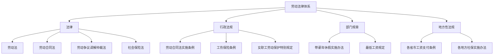
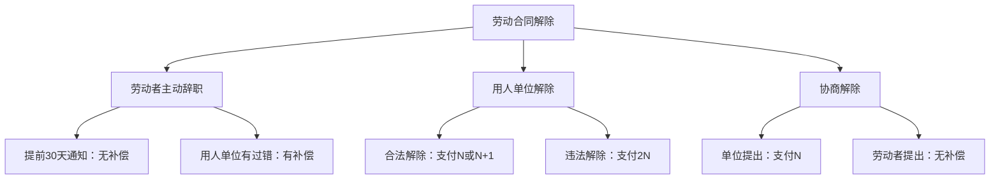

## 七、劳动法律基础

劳动法律是保护劳动者权益的基础性法律体系。在中国，劳动法与每个人的钱包直接相关——你的工资怎么算、加班费有没有、被辞退拿多少补偿、社保公积金交多少，全部由劳动法律体系规定。了解这些法律，不是为了跟公司打官司，而是为了在职场中守住自己的钱袋子，避免在不知不觉中被侵害权益。

### 1. 劳动法律体系概览

中国的劳动法律体系并非单一法律，而是由多部法律、行政法规、部门规章和地方性法规构成的庞大体系。搞钱路上，你需要理解这套体系的层次结构。

#### 1.1 核心法律框架

| 层级 | 名称 | 核心内容 | 与钱的关系 |
|------|------|----------|------------|
| 法律 | 《劳动法》（1995） | 劳动权利的基本保障 | 确立最低工资、工时等底线 |
| 法律 | 《劳动合同法》（2008） | 劳动合同的订立、履行、解除 | 直接决定经济补偿金 |
| 法律 | 《劳动争议调解仲裁法》（2008） | 劳动纠纷的解决程序 | 仲裁不收费，降低维权成本 |
| 法律 | 《社会保险法》（2011） | 五险的缴纳与享受 | 社保是你的隐性收入 |
| 行政法规 | 《劳动合同法实施条例》 | 劳动合同法的细化 | 经济补偿金计算细则 |
| 行政法规 | 《工伤保险条例》 | 工伤认定与赔偿 | 工伤赔偿可达数十万 |
| 部门规章 | 《企业职工带薪年休假实施办法》 | 年假天数与补偿 | 未休年假按300%工资补偿 |



#### 1.2 劳动法的适用范围

劳动法保护的是"劳动关系"，这与其他用工形式有本质区别：

- **劳动关系**：受《劳动合同法》全面保护，用人单位必须签合同、交社保、支付经济补偿
- **劳务关系**：受《民法典》调整，按约定执行，无社保、无经济补偿
- **承揽关系**：受《民法典》调整，按成果交付，风险自担

> **关键判断标准**：你是否接受用人单位的管理、是否需要遵守其规章制度、工作是否是单位业务的组成部分。如果三个条件都满足，即使没签合同，也可能构成事实劳动关系。

**常见陷阱**：有些公司故意签"劳务合同"或"合作协议"来规避劳动关系的法定义务。但根据《关于确立劳动关系有关事项的通知》（劳社部发〔2005〕12号），认定劳动关系看实质不看形式。如果你的工作实质上是劳动关系，签了劳务合同也可能被认定为劳动关系。

### 2. 劳动合同：你的钱袋子保护伞

劳动合同是劳动关系的法律载体，也是你保护自身权益的核心武器。每一条款都可能影响你的收入。

#### 2.1 必备条款（《劳动合同法》第十七条）

法律规定的劳动合同必备条款，缺一不可：

1. **用人单位信息**：名称、住所、法定代表人
2. **劳动者信息**：姓名、住址、身份证号码
3. **合同期限**：固定期限/无固定期限/以完成一定工作任务为期限
4. **工作内容和工作地点**：具体岗位和办公地点
5. **工作时间和休息休假**：标准工时/综合计算工时/不定时工作制
6. **劳动报酬**：工资数额、支付方式和时间
7. **社会保险**：五险一金的缴纳
8. **劳动保护、劳动条件和职业危害防护**

**重点提醒**：如果合同缺少必备条款，不导致合同无效，但你有权要求补充。如果用人单位拒绝补充，可以向劳动监察部门投诉。

#### 2.2 试用期：最容易被坑的阶段

试用期是用人单位和劳动者互相考察的阶段，但也是权益最容易被侵害的阶段。

**法定试用期期限**：

| 合同期限 | 最长试用期 | 试用期工资底线 |
|----------|-----------|---------------|
| 不满3个月（或以完成一定工作任务为期限） | 不得约定试用期 | — |
| 3个月至1年 | 1个月 | 不低于约定工资的80%且不低于当地最低工资 |
| 1年至3年 | 2个月 | 同上 |
| 3年以上或无固定期限 | 6个月 | 同上 |

**试用期的几个关键规则**：

1. **同一用人单位与同一劳动者只能约定一次试用期**。你辞职后重新入职同一家公司，不能再约定试用期。
2. **试用期包含在合同期限内**。不能单独签"试用期合同"，否则该期限视为正式合同期限。
3. **试用期内用人单位不得随意解除合同**。必须证明劳动者"不符合录用条件"，且录用条件必须事先明确告知。
4. **试用期内劳动者提前3天通知即可解除合同**（转正后需提前30天书面通知）。

**经典坑**：公司以"试用期不合格"为由辞退你，但从未明确告知录用条件是什么。这种辞退是违法的，你可以主张违法解除的赔偿金（2N）。

#### 2.3 无固定期限劳动合同

无固定期限合同不是"铁饭碗"，但提供了更强的保障。满足以下条件之一，你有权要求签订无固定期限合同：

1. 劳动者在该用人单位**连续工作满10年**
2. 用人单位初次实行劳动合同制度或国有企业改制重新订立劳动合同时，劳动者在该用人单位**连续工作满10年且距法定退休年龄不足10年**
3. **连续订立二次固定期限劳动合同**，且劳动者没有法定过错，续订劳动合同的

用人单位拒绝签订无固定期限合同的，自应当订立之日起**每月支付二倍工资**。

### 3. 工资报酬：搞钱的核心保障

#### 3.1 工资构成

工资不只是到手的那个数字，完整的工资构成包括：

| 组成部分 | 说明 | 计税方式 |
|----------|------|----------|
| 基本工资 | 固定发放，合同约定 | 计入应税收入 |
| 岗位工资 | 根据岗位确定 | 计入应税收入 |
| 绩效工资 | 根据考核结果浮动 | 计入应税收入 |
| 加班工资 | 法定标准计算 | 计入应税收入 |
| 津贴补贴 | 高温/夜班/交通/餐补等 | 部分免税 |
| 奖金 | 年终奖/季度奖等 | 可单独计税 |
| 五险一金（单位部分） | 用人单位承担 | 不计入应税收入 |
| 五险一金（个人部分） | 个人承担 | 税前扣除 |

> **重要提醒**：很多公司的"月薪"只包含基本工资+岗位工资，绩效工资、奖金、补贴另算。签合同时要看清楚"劳动报酬"条款写的是全部还是部分。

#### 3.2 最低工资标准

最低工资标准由各省、自治区、直辖市人民政府确定，每1-2年调整一次。2024年部分省市最低工资标准（月最低工资，一档）：

| 地区 | 月最低工资（元） | 适用时间 |
|------|-----------------|----------|
| 上海 | 2,690 | 2024.7 |
| 北京 | 2,420 | 2024.9 |
| 深圳 | 2,360 | 2024.1 |
| 广东（一类） | 2,300 | 2024.1 |
| 江苏（一类） | 2,490 | 2024.1 |
| 浙江（一类） | 2,490 | 2024.1 |

**最低工资的几个要点**：

- 最低工资**不包含**加班费、中夜班津贴、特殊工作环境津贴、伙食补贴、住房补贴
- 最低工资**包含**个人应缴纳的社会保险费和住房公积金（各地规定略有不同）
- 试用期工资不得低于最低工资标准

#### 3.3 加班费计算

加班费是劳动者最容易被"吃掉"的收入之一。法律规定了严格的计算标准：

| 加班类型 | 工作日加班 | 休息日加班 | 法定节假日加班 |
|----------|-----------|-----------|---------------|
| 法定标准 | 1.5倍工资 | 2倍工资（或补休） | 3倍工资 |
| 计算基数 | 不低于劳动合同约定的工资 | 同左 | 同左 |
| 能否用调休替代 | 不可以 | 可以 | 不可以 |

**计算公式**：

```text
小时工资 = 月工资 ÷ 21.75 ÷ 8
工作日加班费 = 小时工资 × 加班小时数 × 1.5
休息日加班费 = 小时工资 × 加班小时数 × 2.0
法定节假日加班费 = 小时工资 × 加班小时数 × 3.0
```

**实际案例**：假设你月工资10,000元，某月加班40小时（工作日20小时、周末16小时、国庆节4小时）：

- 小时工资 = 10,000 ÷ 21.75 ÷ 8 = 57.47元
- 工作日加班费 = 57.47 × 20 × 1.5 = 1,724.10元
- 休息日加班费 = 57.47 × 16 × 2.0 = 1,839.04元
- 法定节假日加班费 = 57.47 × 4 × 3.0 = 689.64元
- **合计加班费 = 4,252.78元**

**常见陷阱**：很多公司用"包薪制"（固定月薪包含加班费）来规避加班费。但如果劳动合同中没有明确约定工资构成和加班费计算基数，且实际加班费高于固定月薪中"包含"的部分，劳动者仍可主张差额。

#### 3.4 工资支付规则

根据《工资支付暂行规定》和各地方条例：

- **支付周期**：至少每月支付一次，实行周、日、小时工资制的可按周、日、小时支付
- **支付日期**：遇到节假日或休息日，应提前在最近的工作日支付
- **支付方式**：以法定货币支付，不得以实物及有价证券替代
- **工资条/清单**：用人单位必须书面记录支付工资的数额、时间、领取者姓名并签字，保存两年以上备查，并向劳动者提供个人工资清单
- **克扣和拖欠**：无故克扣或拖欠工资的，劳动行政部门可责令限期支付，逾期不支付的按应付金额50%-100%加付赔偿金

### 4. 五险一金：你最重要的隐性收入

五险一金（养老保险、医疗保险、失业保险、工伤保险、生育保险 + 住房公积金）不是公司的"恩惠"，而是法定义务。它是你薪酬包中最重要的隐性组成部分。

#### 4.1 五险一金缴纳比例

以下为全国通用参考比例（各地可能略有差异）：

| 险种 | 单位缴费比例 | 个人缴费比例 | 说明 |
|------|-------------|-------------|------|
| 养老保险 | 16% | 8% | 个人部分全部计入个人账户 |
| 医疗保险 | 6%-10% | 2% | 各地差异较大，部分城市附加大病统筹 |
| 失业保险 | 0.5%-1% | 0.2%-0.5% | 农业户口个人不缴（部分地区已统一） |
| 工伤保险 | 0.2%-1.9% | 0 | 按行业风险等级确定 |
| 生育保险 | 0.5%-1% | 0 | 2020年起多数地区已并入医疗保险 |
| 住房公积金 | 5%-12% | 5%-12% | 单位和个人比例一致 |

**公积金的核心价值**：

- 公积金是**1:1匹配**的，你交1元公司也交1元，相当于立即100%收益
- 公积金账户余额可提取（购房、租房、装修、大病、离职等情形）
- 公积金贷款利率远低于商贷利率（2024年首套：2.85% vs 商贷约3.95%）
- 按12%比例缴纳、月薪20,000元计算：个人2,400 + 单位2,400 = 每月4,800元进账户，一年57,600元

**常见坑**：

1. **按最低基数缴纳**：法律规定应按职工上年度月平均工资为基数缴纳，很多公司按当地最低基数缴纳是违法的
2. **试用期不缴纳**：入职第一天起就应缴纳社保，试用期不缴社保是违法行为
3. **以商业保险替代社保**：商业保险是补充，不能替代法定社保
4. **不缴公积金**：公积金不是"可选项"，是法定强制义务

#### 4.2 社保断缴的影响

社保断缴会直接影响你的钱袋子和生活：

| 险种 | 断缴影响 | 补缴政策 |
|------|---------|----------|
| 养老保险 | 累计计算，断缴不影响最终待遇，但缴费年限减少 | 可补缴（各地政策不同） |
| 医疗保险 | 断缴次月起无法报销，连续断缴超过3个月有等待期 | 断缴3个月内可补缴，超过3个月需重新计算连续缴费年限 |
| 失业保险 | 累计计算，断缴不影响 | — |
| 生育保险 | 需连续缴纳6-12个月才能享受生育待遇 | 断缴后重新计算 |
| 公积金 | 断缴影响贷款资格（需连续缴存6-12个月） | 部分城市可补缴 |

**特别提醒**：在一线城市，社保连续缴纳还与购房资格、车牌摇号、积分落户、子女入学等挂钩。断缴一个月可能导致你丧失购房资格。

### 5. 工时与休假：时间也是钱

#### 5.1 工时制度

中国实行三种工时制度：

| 工时制度 | 标准 | 适用范围 | 审批要求 |
|----------|------|----------|----------|
| 标准工时制 | 每日8小时，每周40小时 | 一般岗位 | 无需审批 |
| 综合计算工时制 | 以周/月/季/年为周期综合计算 | 交通、旅游、渔业等季节性岗位 | 需劳动行政部门审批 |
| 不定时工作制 | 不受标准工时限制 | 高管、外勤、长途运输等 | 需劳动行政部门审批 |

**关键点**：综合计算工时制下，周期内总工时超过法定标准的部分，按1.5倍支付加班费；法定节假日工作的，按3倍支付。不定时工作制在多数地区不支付加班费，但法定节假日工作仍需支付3倍工资（各地规定不同）。

#### 5.2 带薪年休假

根据《职工带薪年休假条例》：

| 累计工作年限 | 年休假天数 |
|-------------|-----------|
| 不满10年 | 5天 |
| 10年不满20年 | 10天 |
| 20年以上 | 15天 |

**年假的金钱价值**：

- 未休年假的补偿 = 日工资 × 未休天数 × 300%（其中100%已在正常工资中发放，另付200%）
- 日工资 = 月工资（剔除加班费）÷ 21.75
- 用人单位确因工作需要不能安排年休假的，须经劳动者本人同意

**注意**："累计工作年限"包括在不同单位的工作年限，不限于当前单位。你需要提供社保缴纳记录或原单位工作证明来确认。

#### 5.3 其他假期的工资保障

| 假期类型 | 天数 | 工资待遇 |
|----------|------|----------|
| 法定节假日 | 11天/年 | 带薪，正常发工资 |
| 婚假 | 3天（各地不同） | 带薪 |
| 丧假 | 1-3天 | 带薪 |
| 产假 | 98天+各地延长 | 生育津贴或工资（就高原则） |
| 护理假 | 各地不同（7-30天） | 带薪 |
| 病假 | 根据工龄确定 | 不低于最低工资的80% |
| 事假 | 无上限 | 用人单位可不支付工资 |

### 6. 劳动合同解除与经济补偿金

这是劳动法中最直接影响"钱"的部分。被辞退时能拿多少钱，取决于解除的方式和原因。

#### 6.1 解除类型与经济补偿



#### 6.2 经济补偿金计算（N）

**计算公式**：

```text
经济补偿金 = 工作年限 × 月平均工资
```

**具体规则**：

- **工作年限**：每满1年支付1个月工资；6个月以上不满1年的，按1年计算；不满6个月的，支付半个月工资
- **月平均工资**：劳动者在劳动合同解除前12个月的平均工资，包括计时工资、计件工资、奖金、津贴和补贴等所有货币性收入
- **月工资上限**：劳动者月工资高于当地上年度职工月平均工资3倍的，按3倍计算，且补偿年限最高不超过12年
- **月工资下限**：不低于当地最低工资标准

**实际案例**：你在一家公司工作了3年8个月，离职前12个月平均工资为15,000元：

- 工作年限：3年8个月 → 按4年计算（超过6个月按1年）
- 经济补偿金 = 4 × 15,000 = 60,000元

#### 6.3 N、N+1、2N 详解

| 情形 | 补偿标准 | 适用场景 |
|------|---------|----------|
| N | 经济补偿金 | 协商解除（单位提出）、合同期满不续签（单位降低条件）、经济性裁员、劳动者被迫辞职（单位有过错） |
| N+1 | 经济补偿金 + 代通知金 | 用人单位未提前30天通知的无过失性辞退（医疗期满不能工作、不能胜任工作、客观情况重大变化） |
| 2N | 赔偿金（经济补偿金的2倍） | 用人单位违法解除劳动合同 |

**用人单位可以不支付补偿的情形**（劳动者有过错）：

1. 在试用期间被证明不符合录用条件
2. 严重违反用人单位规章制度
3. 严重失职、营私舞弊，给用人单位造成重大损害
4. 同时与其他用人单位建立劳动关系，严重影响本职工作
5. 以欺诈、胁迫手段订立劳动合同
6. 被依法追究刑事责任

**劳动者可以随时解除并获得补偿的情形**（用人单位有过错）：

1. 未按约定提供劳动保护或劳动条件
2. 未及时足额支付劳动报酬
3. 未依法缴纳社会保险费
4. 规章制度违法，损害劳动者权益
5. 以欺诈、胁迫手段订立劳动合同
6. 以暴力、威胁或非法限制人身自由强迫劳动

#### 6.4 代通知金

代通知金是指用人单位在未提前30天通知的情况下，额外支付的1个月工资。其标准是**劳动者上一个月的工资标准**，不是前12个月平均工资。

### 7. 工伤：最需要了解但最不想用的知识

#### 7.1 工伤认定范围

根据《工伤保险条例》，以下情形应认定为工伤：

1. **工作时间和工作场所内**，因工作原因受到事故伤害
2. **工作时间前后在工作场所内**，从事与工作有关的预备性或收尾性工作受到事故伤害
3. **工作时间和工作场所内**，因履行工作职责受到暴力等意外伤害
4. **因工外出期间**，由于工作原因受到伤害或事故下落不明
5. **上下班途中**，受到非本人主要责任的交通事故伤害
6. **职业病**
7. 法律规定的其他情形

**视同工伤**的情形：在工作时间和工作岗位突发疾病死亡或在48小时内经抢救无效死亡。

#### 7.2 工伤赔偿标准

工伤赔偿项目根据伤残等级不同而不同：

| 伤残等级 | 一次性伤残补助金（月工资倍数） | 伤残津贴（月工资%） |
|----------|------------------------------|-------------------|
| 一级 | 27个月 | 90% |
| 二级 | 25个月 | 85% |
| 三级 | 23个月 | 80% |
| 四级 | 21个月 | 75% |
| 五级 | 18个月 | 70% |
| 六级 | 16个月 | 60% |
| 七级 | 13个月 | — |
| 八级 | 11个月 | — |
| 九级 | 9个月 | — |
| 十级 | 7个月 | — |

五至六级的伤残津贴由用人单位安排工作或按月发放；七至十级的，劳动合同期满终止或劳动者本人提出解除时，由工伤保险基金支付一次性工伤医疗补助金，由用人单位支付一次性伤残就业补助金。

**工亡赔偿**（2024年标准）：

- 丧葬补助金：6个月的统筹地区上年度职工月平均工资
- 供养亲属抚恤金：配偶每月40%，其他亲属每人每月30%，总计不超过生前工资
- 一次性工亡补助金：上一年度全国城镇居民人均可支配收入的20倍（2024年约为1,027,080元）

#### 7.3 工伤处理流程

1. **及时就医**：就近急救，保留所有医疗记录
2. **工伤认定申请**：用人单位应在事故发生之日起30日内提出申请；用人单位不申请的，劳动者或近亲属可在1年内自行申请
3. **劳动能力鉴定**：治疗伤情相对稳定后，向设区的市级劳动能力鉴定委员会申请
4. **享受工伤待遇**：根据鉴定等级享受对应待遇

**关键提醒**：如果用人单位未缴纳工伤保险，所有工伤待遇由用人单位全额承担。

### 8. 特殊群体的劳动保护

#### 8.1 女职工保护

| 保护事项 | 具体规定 | 金钱影响 |
|----------|---------|----------|
| 孕期禁忌劳动 | 不得安排矿山井下、高强度劳动等 | — |
| 孕期产前检查 | 所需时间计入劳动时间 | 正常发工资 |
| 产假 | 98天+各地延长（60-90天不等） | 生育津贴或工资 |
| 哺乳时间 | 每天1小时，多胞胎每多1个加1小时 | 正常发工资 |
| 不得解除合同 | 孕期、产期、哺乳期内不得以无过失性辞退和经济性裁员解除 | 工作保障 |

**违法辞退孕期女职工**：属于违法解除，可主张恢复劳动关系或2N赔偿金，且可要求补发解除期间的工资。

#### 8.2 未成年工保护

- 禁止使用童工（未满16周岁）
- 已满16未满18周岁为未成年工，不得安排矿山井下、有毒有害等劳动
- 用人单位应对未成年工定期进行健康检查

### 9. 劳动争议解决：如何拿回属于你的钱

#### 9.1 争议解决途径

```mermaid
graph LR
    A[劳动争议发生] --> B[协商]
    B -->|不成| C[调解]
    C -->|不成| D[劳动仲裁]
    D -->|不服| E[法院诉讼]
    D -->|| F[一审]
    F -->|不服| G[二审终审]
```

#### 9.2 劳动仲裁详解

劳动仲裁是劳动争议解决的核心环节，具有以下特点：

- **前置程序**：劳动争议必须先经仲裁，不能直接起诉（拖欠工资且有欠条的除外）
- **仲裁时效**：1年，从知道或应当知道权利被侵害之日起计算；但劳动关系存续期间因拖欠工资发生争议的，不受1年限制（离职后1年内必须申请）
- **仲裁费用**：劳动仲裁不收费
- **举证责任**：涉及工资支付、社保缴纳、考勤记录等由用人单位举证；用人单位拒不提供的，承担不利后果
- **审理期限**：45天，最长60天

**仲裁申请书的基本结构**：

1. 申请人信息（你的姓名、身份证号、住址、联系方式）
2. 被申请人信息（公司名称、统一社会信用代码、地址、法定代表人）
3. 仲裁请求（具体金额和事项）
4. 事实与理由（时间线+证据链）
5. 证据清单

#### 9.3 关键证据准备

劳动争议中，证据是决定胜负的核心：

| 证据类型 | 具体内容 | 获取方式 |
|----------|---------|----------|
| 劳动关系证明 | 劳动合同、工牌、工作证、入职通知 | 入职时保存 |
| 工资证明 | 工资条、银行流水、个税记录 | 定期下载保存 |
| 加班证明 | 考勤记录、打卡截图、加班审批、工作群聊天记录 | 日常积累 |
| 辞退证明 | 辞退通知、解除协议、谈话录音 | 收到时立即保存 |
| 社保记录 | 社保缴费清单 | 社保局或APP查询 |
| 工作沟通记录 | 邮件、微信/钉钉聊天记录、会议纪要 | 定期截图备份 |

**证据保全的实操建议**：

1. **入职时**：保存offer letter、劳动合同电子版、工资确认邮件
2. **日常工作中**：定期导出工资条和银行流水，截图保存加班审批记录
3. **离职前**：不要在公司电脑上留下个人文件的痕迹，重要文件提前备份到个人设备
4. **被辞退时**：要求公司出具书面辞退通知，谈话时录音（一方同意录音在大多数情况下合法）

### 10. 常见劳动权益侵害手段与应对

#### 10.1 用人单位常见违规行为

| 违规行为 | 法律定性 | 应对策略 |
|----------|---------|----------|
| 不签劳动合同 | 违法 | 入职1个月内未签，自第2个月起支付双倍工资（最多11个月） |
| 试用期不缴社保 | 违法 | 向社保局投诉要求补缴 |
| 拖欠/克扣工资 | 违法 | 向劳动监察投诉或申请仲裁 |
| 强制加班不付加班费 | 违法 | 保留加班证据，申请仲裁追讨 |
| 以"末位淘汰"辞退 | 违法解除 | 主张2N赔偿金 |
| 劳务派遣滥用 | 违法 | 同工同酬，辅助岗位才能派遣 |
| 随意调岗降薪 | 违法 | 劳动合同变更需双方协商一致 |
| 以"不能胜任工作"辞退未培训/调岗 | 违法解除 | 主张2N赔偿金 |

#### 10.2 "末位淘汰"的法律后果

根据最高人民法院的指导案例，"末位淘汰"不构成《劳动合同法》规定的"不能胜任工作"。排名末位不等于不胜任工作，用人单位不能以此为由直接解除劳动合同。正确的做法是：先培训或调岗，再次考核仍不胜任的，提前30天通知或额外支付1个月工资后解除，并支付N个月经济补偿金。

#### 10.3 被迫辞职的经济补偿

如果用人单位存在以下情形，劳动者可以"被迫辞职"（即时解除劳动合同）并要求经济补偿金：

- 未按约定提供劳动保护或劳动条件
- 未及时足额支付劳动报酬
- 未依法缴纳社会保险费
- 规章制度违法损害劳动者权益
- 以欺诈、胁迫手段或乘人之危订立合同
- 以暴力、威胁或非法限制人身自由强迫劳动

**被迫辞职的操作要点**：

1. 必须书面通知用人单位，明确解除理由（引用具体法条）
2. 理由必须真实存在且有证据支持
3. 建议通过EMS邮寄或当面送达并保留签收凭证
4. 解除后1年内申请劳动仲裁

### 11. 灵活用工与新业态的劳动保护

随着平台经济和灵活用工的发展，越来越多的人从事外卖、网约车、直播等工作。这些新业态从业者的劳动关系认定是当前劳动法的热点问题。

#### 11.1 劳动关系认定的关键要素

根据《关于维护新就业形态劳动者劳动保障权益的指导意见》：

- **符合确立劳动关系情形**：企业对劳动者进行劳动管理，适用劳动法律法规
- **不完全符合确立劳动关系情形**：个人依托平台自主开展经营活动的，引导平台与劳动者订立书面协议
- **个人自主经营**：按民事法律调整

#### 11.2 平台从业者的自我保护

1. 保存所有合作协议和收入记录
2. 关注平台是否为你购买了职业伤害保障
3. 了解平台的抽成规则和惩罚机制是否合法
4. 收入波动较大时，自行缴纳社保（灵活就业人员养老保险和医疗保险）

### 12. 实操工具箱

#### 12.1 劳动合同签署自检清单

签署劳动合同前，逐项检查：

- [ ] 公司名称与offer一致
- [ ] 岗位名称和工作地点明确
- [ ] 薪资数额明确（基本工资+各项津贴）
- [ ] 试用期时长和薪资符合法律规定
- [ ] 工时制度明确（标准/综合/不定时）
- [ ] 社保和公积金缴纳基数和比例明确
- [ ] 合同期限合理
- [ ] 没有不合理的竞业限制条款
- [ ] 没有违约金条款（培训服务期和竞业限制除外）
- [ ] 各项条款没有空白处

#### 12.2 离职时的权益核算

离职前，核算以下应得权益：

1. **当月工资**：工作至离职日的工资
2. **未休年假补偿**：日工资 × 未休天数 × 200%
3. **经济补偿金**：如符合条件，N或N+1或2N
4. **竞业限制补偿金**：如有竞业限制，按月不低于月工资的30%
5. **报销款项**：所有未报销的业务支出
6. **期权/股权**：已行权或待行权部分的处理方案
7. **社保和公积金**：确认缴纳至离职当月

#### 12.3 实用维权渠道

| 渠道 | 方式 | 适用场景 |
|------|------|----------|
| 12333热线 | 电话 | 政策咨询、投诉举报 |
| 劳动监察大队 | 现场/网上投诉 | 拖欠工资、不缴社保 |
| 劳动仲裁委员会 | 书面申请 | 经济补偿、违法解除等 |
| 工会 | 12351热线 | 维权援助 |
| 法律援助 | 12348热线 | 经济困难的劳动者 |
| 人民法院 | 起诉 | 仲裁裁决不服 |

### 13. 劳动法与搞钱的关系总结

劳动法不是纸上谈兵的知识，而是直接影响你收入的实际工具：

1. **入职前**：了解劳动合同条款，避免签下"卖身契"
2. **在职时**：确保工资、加班费、社保、公积金全部到位
3. **被辞退时**：准确计算应得补偿，不被少给一分钱
4. **跳槽时**：合理利用竞业限制补偿金，保护自身利益
5. **创业时**：作为雇主也要了解劳动法，避免因违法用工付出高额赔偿

> **记住**：用人单位违法成本低，劳动者维权成本高，是劳动权益保护的核心矛盾。最好的策略是日常就做好证据保全，让维权有据可依。不懂法不是理由，但懂法一定是你搞钱路上的护城河。
