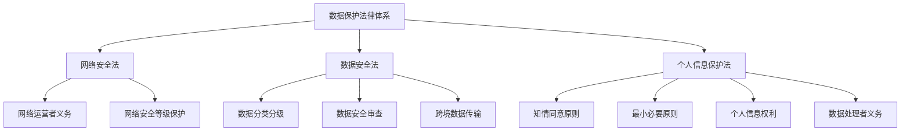
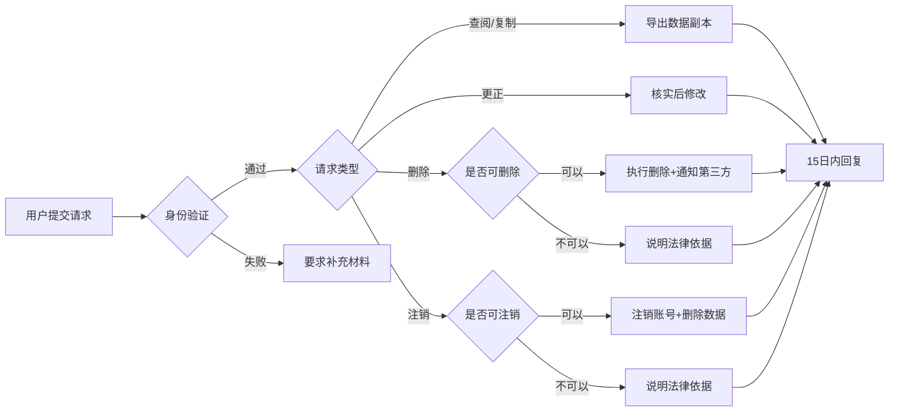
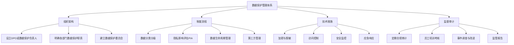

## 八、隐私与数据保护

### 1. 为什么搞钱必须懂隐私与数据保护

很多创业者和自由职业者认为隐私与数据保护是"大公司才需要操心的事"。这是一个危险的认知盲区。2023年中国某电商小卖家因未获用户同意收集手机号用于营销，被处以50万元罚款——这已经超过了该店铺全年利润。

隐私与数据保护不仅是法律义务，更是商业信任的基石。用户愿意把钱交给你，前提是信任你会妥善保管他们的信息。一旦发生数据泄露，不仅面临法律处罚，更会永久失去客户信任。

**三个必须重视的理由：**

- **法律风险**：中国已形成以《个人信息保护法》（PIPL）为核心的完善法律体系，违规罚款最高可达上一年度营业额的5%或5000万元
- **商业价值**：合规的数据管理能力已成为B2B合作的准入门槛，大企业选择供应商时数据保护能力是必审项
- **竞争优势**：主动合规的企业在获客成本、用户留存、品牌溢价方面均优于同行

### 2. 核心法律框架

#### 2.1 中国三大基础法律

中国数据保护法律体系由三部核心法律构成，各有侧重又相互衔接：

| 法律 | 生效时间 | 核心关注点 | 适用场景 |
|------|----------|------------|----------|
| 《网络安全法》 | 2017.06.01 | 网络运营安全 | 网站、App、小程序运营 |
| 《数据安全法》 | 2021.09.01 | 数据分类分级与安全 | 数据收集、存储、处理、传输 |
| 《个人信息保护法》 | 2021.11.01 | 个人信息权益保护 | 任何涉及个人信息的处理活动 |



#### 2.2 《个人信息保护法》核心要点

PIPL是中国隐私保护的根本大法，以下是最关键的六项制度：

**（一）合法性基础（第13条）**

处理个人信息必须具备以下条件之一：
- 取得个人的**同意**（最常用）
- 为订立或履行**合同**所必需
- 为履行**法定职责或义务**所必需
- 为应对突发**公共卫生事件**或紧急情况下保护自然人的生命健康和财产安全所必需
- 在合理范围内处理**已公开**的个人信息
- 法律、行政法规规定的其他情形

**（二）知情同意规则（第14-17条）**

知情同意是个人信息处理最核心的合法性基础，必须满足：

- **告知内容完整**：处理目的、方式、种类、保存期限、个人权利行使方式，一个都不能少
- **同意方式明确**：不能默认勾选，不能捆绑授权，不能以"不同意就无法使用"为要挟（除非是核心功能所必需）
- **单独同意场景**：处理敏感个人信息、跨境传输、向第三方提供、公开个人信息时，必须取得**单独同意**
- **撤回便利**：用户应能随时撤回同意，且撤回不影响撤回前已进行的处理的合法性

**（三）最小必要原则（第6条）**

这是实践中最容易违反的原则。核心要求：

- 只能收集实现处理目的所**最少必要**的个人信息
- 不得过度收集——比如天气App不应索取通讯录权限
- 不得因用户拒绝提供非必要信息而拒绝提供核心服务

**（四）敏感个人信息保护（第28-32条）**

敏感个人信息一旦泄露或非法使用，容易导致自然人人格尊严受到侵害或者人身、财产安全受到危害，包括：

- 生物识别信息（人脸、指纹、虹膜）
- 宗教信仰、特定身份
- 医疗健康、金融账户
- 行踪轨迹
- 不满14周岁未成年人的个人信息

处理敏感信息需要：**特定目的+充分必要+单独同意+影响评估+严格保护措施**。

**（五）个人信息权利（第44-50条）**

个人对其信息享有以下权利：

| 权利 | 含义 | 响应时限 |
|------|------|----------|
| 知情权 | 了解信息被如何处理 | 即时 |
| 决定权 | 限制、拒绝或撤回同意 | 即时 |
| 查阅复制权 | 获取自身信息副本 | 15个工作日 |
| 可携带权 | 转移至其他处理者 | 15个工作日 |
| 更正补充权 | 修改不准确的信息 | 15个工作日 |
| 删除权 | 满足条件时要求删除 | 15个工作日 |
| 规则解释权 | 了解自动化决策规则 | 15个工作日 |
| 死者权利 | 近亲属行使已故者权利 | 15个工作日 |

**（六）跨境数据传输（第38-43条）**

将个人信息传输至境外，必须满足以下条件之一：

- 通过国家网信部门组织的**安全评估**（处理量大或涉及关键信息基础设施）
- 经专业机构进行**个人信息保护认证**
- 按照国家网信部门制定的**标准合同**与境外接收方订立合同
- 法律法规规定的其他条件

跨境传输前必须进行**个人信息保护影响评估**，并向个人告知境外接收方的名称、联系方式、处理目的和方式、种类及权利行使方式。

#### 2.3 配套法规与标准

除三大基础法律外，以下法规和标准同样重要：

| 文件名称 | 生效时间 | 核心内容 |
|----------|----------|----------|
| 《数据出境安全评估办法》 | 2022.09.01 | 数据出境安全评估流程 |
| 《个人信息出境标准合同办法》 | 2023.06.01 | 标准合同模板及适用条件 |
| 《App违法违规收集使用个人信息行为认定方法》 | 2019.12.30 | App合规具体判定标准 |
| GB/T 35273《个人信息安全规范》 | 2020.10.01 | 推荐性国家标准，实操指南 |
| GB/T 39335《个人信息安全影响评估指南》 | 2021.06.01 | 影响评估方法论 |
| 《网络数据安全管理条例》 | 2025.01.01 | 网络数据处理者义务细化 |

### 3. 数据保护的实操体系

#### 3.1 合规落地四步法

任何处理个人信息的主体——无论是企业还是个人开发者——都应按以下步骤建立合规体系：

**第一步：数据资产盘点**

首先搞清楚"我们到底收集了哪些个人信息"。建立数据清单：

```text
┌─────────────┬──────────────┬───────────────┬──────────────┬──────────────┐
│ 数据类别     │ 具体字段      │ 收集场景       │ 存储位置      │ 保存期限      │
├─────────────┼──────────────┼───────────────┼──────────────┼──────────────┤
│ 账户信息     │ 手机号/邮箱   │ 注册           │ MySQL主库     │ 账号注销后30天│
│ 交易信息     │ 订单/金额     │ 下单支付       │ MySQL主库     │ 5年（税务）   │
│ 浏览行为     │ 页面/点击     │ 全站埋点       │ Elasticsearch │ 180天        │
│ 设备信息     │ IMEI/IP/UA   │ 首次访问       │ Redis+ES      │ 90天         │
│ 人脸信息     │ 人脸特征值    │ 实名认证       │ 加密存储      │ 验证后即删    │
└─────────────┴──────────────┴───────────────┴──────────────┴──────────────┘
```

**第二步：合规差距分析**

对照法律要求逐项检查：

- [ ] 是否制定了隐私政策？内容是否完整？
- [ ] 收集前是否获得了用户的有效同意？
- [ ] 是否存在过度收集的情况？
- [ ] 敏感信息处理是否有单独同意和影响评估？
- [ ] 第三方SDK是否在隐私政策中披露？
- [ ] 用户权利请求是否有响应机制？
- [ ] 数据是否加密存储和传输？
- [ ] 数据安全事件是否有应急预案？
- [ ] 跨境传输是否满足法定条件？
- [ ] 员工是否有数据保护培训？

**第三步：制度建设与技术实施**

根据差距分析结果，建立完整的管理制度和技术措施：

制度层面：
- 《个人信息保护管理制度》
- 《数据分类分级管理制度》
- 《数据安全应急预案》
- 《员工保密协议》（模板见本节附录）
- 《第三方数据处理协议》
- 《数据主体权利响应流程》

技术层面：
- 传输层加密（TLS 1.3）
- 存储层加密（AES-256）
- 访问控制（RBAC最小权限）
- 审计日志（全操作留痕）
- 数据脱敏（生产环境禁用明文）
- 自动化合规检测工具

**第四步：持续监控与优化**

合规不是一次性工程。建立持续机制：
- 每季度审查隐私政策是否需要更新
- 每半年进行一次数据保护影响评估
- 每年进行一次全面合规审计
- 关注监管动态和执法案例
- 建立数据安全事件报告机制

#### 3.2 隐私政策编写指南

隐私政策是最基础也最重要的合规文件。以下是必须包含的内容：

**必备要素清单：**

1. **处理者信息**：名称、联系方式、负责人
2. **处理的个人信息种类**：逐一列明，区分一般和敏感
3. **处理目的**：每个种类对应的具体目的
4. **处理方式**：收集、存储、使用、加工、传输、提供、公开、删除
5. **保存期限**：每类信息的保存时长
6. **第三方共享**：共享的第三方名称、目的、信息种类
7. **个人权利行使方式**：查阅、复制、更正、删除等的申请渠道和流程
8. **未成年人保护**：未满14周岁的特殊保护措施
9. **跨境传输**：是否涉及跨境传输及条件
10. **隐私政策更新**：更新通知方式

**编写禁忌：**

- ❌ 使用晦涩难懂的法律术语堆砌
- ❌ 笼统地说"可能收集您的某些信息"而不列明
- ❌ 默认勾选同意框
- ❌ 不提供撤回同意的途径
- ❌ 将隐私政策深藏在网站底部，难以访问
- ❌ 套用其他公司的模板不修改

#### 3.3 用户权利响应流程

当用户行使个人信息权利时，必须在**15个工作日内**响应。建议建立标准化流程：



### 4. 个人搞钱场景的数据保护要点

#### 4.1 自媒体/内容创作者

作为自媒体从业者，你可能处理以下个人信息：

**粉丝数据管理：**
- 收集粉丝邮箱/微信进行营销，必须有明确的**告知+同意**
- 粉丝群内的聊天记录不得未经同意公开
- 抽奖活动收集的个人信息，活动结束后应主动删除
- 粉丝投稿中的个人信息需获得授权才能使用

**注意事项：**
- 使用第三方邮件营销工具（如Mailchimp）时，需在隐私政策中披露
- 微信公众号/小程序有独立的数据收集规范，需额外遵守微信平台规则
- 短视频平台的粉丝数据分析工具可能涉及平台数据使用条款

#### 4.2 电商卖家

**客户信息保护核心规则：**

- **订单信息**：收货地址、电话、姓名属于个人信息，不得向第三方泄露
- **快递面单**：2023年起已推行隐私面单（隐藏收件人完整信息），务必启用
- **评价信息**：买家评价中的个人信息（如真实姓名照片）需脱敏处理
- **售后信息**：退货退款过程中的个人信息需妥善保管

**特别提醒：**
- 不得将客户手机号出售给第三方用于营销——这是最常见的违规行为
- 不得利用客户购买记录进行歧视性定价（大数据杀熟已被明确禁止）
- 客户注销账号后，必须按规定期限删除其个人信息

#### 4.3 知识付费/在线教育

知识付费场景涉及大量敏感数据：

- **学习数据**：课程进度、成绩、学习时长属于个人信息
- **支付信息**：课程费用、支付方式，需严格保护
- **证书信息**：学员获得的证书编号等，不得未经同意公开
- **未成年人保护**：如果面向14岁以下用户，需获得**监护人同意**

#### 4.4 SaaS/技术服务提供者

如果你开发或运营SaaS产品，作为**数据处理者**或**受托方**，需额外注意：

- 与客户签订**数据处理协议**（DPA），明确双方权利义务
- 不得超出约定范围处理数据
- 发生数据安全事件时，**立即通知**委托方
- 接受委托方的合规审计
- 委托关系终止后，按约定删除或返还数据

### 5. 数据安全技术措施

#### 5.1 技术防护矩阵

| 防护层级 | 措施 | 具体实现 | 适用场景 |
|----------|------|----------|----------|
| 传输安全 | TLS加密 | 强制HTTPS，禁用TLS 1.0/1.1 | 所有网络传输 |
| 存储安全 | 数据加密 | AES-256加密敏感字段 | 数据库、文件存储 |
| 访问控制 | 最小权限 | RBAC + ABAC | 内部系统访问 |
| 身份认证 | 多因素认证 | 密码+短信/TOTP | 后台管理系统 |
| 审计追踪 | 操作日志 | 全量记录敏感操作 | 合规审计 |
| 数据脱敏 | 动态脱敏 | 测试环境禁止使用真实数据 | 开发测试 |
| 备份恢复 | 异地备份 | 3-2-1备份策略 | 灾难恢复 |
| 终端安全 | DLP | 防止数据通过终端泄露 | 员工设备管理 |

#### 5.2 开发者必做的技术清单

对于有技术背景的从业者，以下是必须实施的安全措施：

```python
# 1. 数据库字段加密示例（Python + cryptography）
from cryptography.fernet import Fernet

# 生成密钥（生产环境应使用KMS管理）
key = Fernet.generate_key()
cipher = Fernet(key)

# 加密敏感字段
def encrypt_field(plaintext: str) -> bytes:
    """加密个人信息字段"""
    return cipher.encrypt(plaintext.encode())

# 解密敏感字段
def decrypt_field(ciphertext: bytes) -> str:
    """解密个人信息字段"""
    return cipher.decrypt(ciphertext).decode()

# 2. 手机号脱敏示例
import re

def mask_phone(phone: str) -> str:
    """手机号脱敏：138****1234"""
    if len(phone) == 11:
        return phone[:3] + "****" + phone[7:]
    return phone

# 3. 身份证号脱敏示例
def mask_idcard(idcard: str) -> str:
    """身份证号脱敏：110***********1234"""
    if len(idcard) == 18:
        return idcard[:3] + "*" * 11 + idcard[14:]
    return idcard

# 4. 日志中自动脱敏
class PIIMaskingFilter:
    """自动脱敏日志中的个人信息"""
    PATTERNS = {
        "phone": (r"1[3-9]\d{9}", mask_phone),
        "idcard": (r"\d{17}[\dXx]", mask_idcard),
        "email": (r"[\w.]+@[\w.]+", lambda x: x[:2] + "***@" + x.split("@")[1]),
    }

    def filter(self, record):
        msg = record.getMessage()
        for name, (pattern, masker) in self.PATTERNS.items():
            msg = re.sub(pattern, lambda m: masker(m.group()), msg)
        record.msg = msg
        return True
```

#### 5.3 数据泄露应急响应

一旦发现数据泄露，必须立即启动应急预案：

**黄金72小时响应流程：**

| 时间节点 | 行动 | 责任人 |
|----------|------|--------|
| 发现后0小时 | 隔离受影响系统，阻止进一步泄露 | 技术负责人 |
| 发现后2小时 | 初步评估影响范围（类型、数量、波及人数） | 安全团队 |
| 发现后24小时 | 向省级以上网信部门报告 | 法务/合规 |
| 发现后48小时 | 通知受影响的个人（除非已采取措施使信息无法被利用） | 客服/法务 |
| 发现后72小时 | 提交完整报告，含原因、影响、补救措施 | 安全+法务 |
| 后续30天 | 完成根因分析、修复、制度完善 | 技术+管理 |

### 6. 典型案例与处罚

#### 6.1 国内典型执法案例

**案例一：过度收集个人信息（2022年）**

某短视频App被发现在用户首次启动时，未经同意即收集通讯录、位置、相册等信息。网信办依据PIPL第66条，处以5000万元罚款，并责令整改。

教训：首次启动时只应请求核心功能所必需的权限，非必要权限应在用户使用相关功能时再请求。

**案例二：违规跨境传输（2023年）**

某跨境电商平台将中国用户的购物数据、地址信息传输至境外服务器，未进行安全评估，也未获得用户单独同意。被处以上一年度营业额3%的罚款，约1.2亿元。

教训：任何向境外传输个人信息的行为，都必须先完成法定的安全评估或认证程序。

**案例三：数据泄露未及时报告（2022年）**

某在线教育公司发生数据泄露，约200万条学生信息被黑客获取。公司延迟30天才向监管部门报告，且未通知受影响用户。因未及时报告被额外加重处罚。

教训：发现泄露后必须立即启动应急响应，72小时内完成报告和通知。

**案例四：大数据杀熟（2023年）**

某旅游平台利用用户消费数据，对老用户展示更高的酒店价格。市场监管部门依据《个人信息保护法》第24条关于自动化决策的规定，处以罚款并责令整改。

教训：利用个人信息进行自动化决策时，不得对个人在交易价格等方面实行不合理的差别待遇。

#### 6.2 处罚金额参考

| 违规行为 | 处罚依据 | 罚款范围 |
|----------|----------|----------|
| 一般违规 | PIPL第66条 | 100万元以下 |
| 情节严重 | PIPL第66条 | 5000万元以下或上年营业额5% |
| 直接责任人 | PIPL第66条 | 10万-100万元，可禁业 |
| 未及时报告泄露 | 网络安全法第59条 | 1万-10万元 |
| 关键基础设施违规 | 网络安全法 | 10万-100万元 |

### 7. 常见误区与纠正

**误区一：隐私政策有了就行，内容无所谓**

纠正：隐私政策必须**准确、完整、易懂**。监管机构会逐条核对，不完整或不准确的隐私政策本身就是违规行为。2022年工信部通报的App中，约40%因隐私政策不合规被下架。

**误区二：用户勾选了同意就万事大吉**

纠正：同意必须是**知情的、自愿的、明确的**。默认勾选、捆绑授权、不同意就不给用（非核心功能）——这些情形下的"同意"在法律上无效。

**误区三：数据脱敏了就可以随便用**

纠正：脱敏不等于匿名化。如果通过技术手段可以重新识别个人身份（如与其他数据集交叉比对），则仍然属于个人信息，仍需遵守相关法律规定。真正的**匿名化**是指经过处理后无法识别特定自然人且不能复原。

**误区四：小公司/个人不用管数据保护**

纠正：PIPL适用于所有处理个人信息的主体，不论规模大小。个人博主收集粉丝信息、小卖家处理客户订单，都在法律管辖范围内。2023年已有多个个体工商户因违规被处罚的案例。

**误区五：客户数据是我的资产，可以随便用**

纠正：个人信息的所有权属于个人，你只是在授权范围内进行处理。超出授权范围的使用（如将购物客户数据用于推送贷款广告）属于违规处理。

**误区六：数据存在国内就不会有跨境传输问题**

纠正：使用境外云服务商（如AWS、Azure海外节点）、外资背景的数据处理工具、甚至通过VPN中转到境外服务器，都可能构成跨境传输。判断标准是数据是否到达了中国境外的接收方。

### 8. 进阶：合规管理框架

对于需要系统化管理数据保护的团队，建议参考以下框架：



**DPO（数据保护负责人）设置建议：**

并非所有企业都强制要求设立DPO，但以下情况必须指定：
- 处理个人信息达到国家网信部门规定数量的
- 处理敏感个人信息的
- 关键信息基础设施运营者

即使不强制要求，也建议指定一名数据保护负责人，职责包括：
- 组织合规审查和影响评估
- 处理用户投诉和权利请求
- 监督数据处理活动
- 与监管部门沟通协调

### 9. 工具与资源推荐

| 类别 | 工具/资源 | 用途 |
|------|----------|------|
| 合规自查 | App隐私合规自查工具（工信部） | 检测App是否合规 |
| 影响评估 | GB/T 39335-2020 | 个人信息安全影响评估方法论 |
| 加密工具 | OpenSSL、libsodium | 数据加密实现 |
| 密钥管理 | HashiCorp Vault、AWS KMS | 密钥安全管理 |
| 脱敏工具 | DataX（阿里开源） | 数据脱敏处理 |
| 隐私政策生成 | 信通院隐私政策模板 | 快速生成合规隐私政策 |
| 学习资源 | 信通院《数据安全治理实践指南》 | 系统学习数据安全治理 |
| 案例查询 | 国家网信办执法案例 | 了解监管尺度和执法动态 |
| 行业标准 | ISO 27701 | 隐私信息管理体系国际标准 |

### 10. 本章小结

隐私与数据保护不是阻碍业务发展的绊脚石，而是建立长期竞争优势的护城河。核心要点：

1. **知法**：掌握PIPL、数据安全法、网络安全法的核心要求
2. **懂理**：理解知情同意、最小必要、目的限制等基本原则
3. **会做**：建立数据清单、编写隐私政策、实施技术措施、响应用户权利
4. **能防**：制定应急预案、定期审计、持续监控
5. **不停**：合规是持续过程，法律在更新、业务在变化、技术在演进

记住一句话：**处理个人信息就像保管别人的钱财——受人之托，忠人之事，不越权、不泄露、到期归还。**
