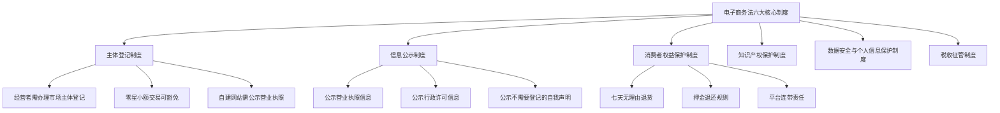
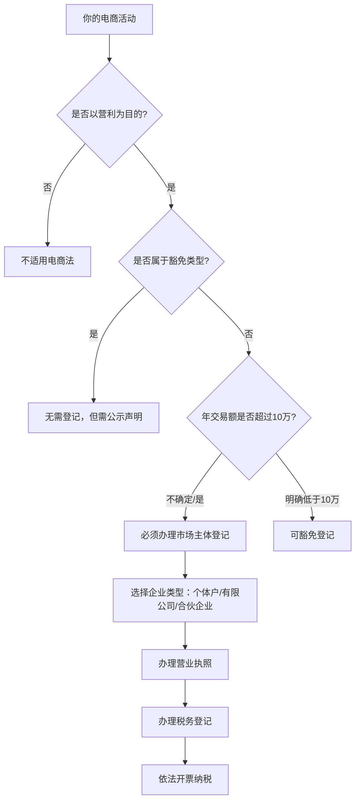
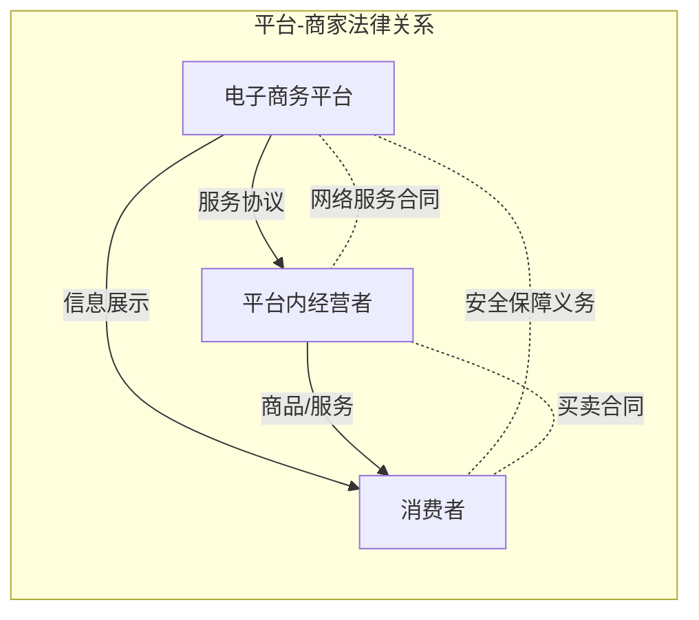
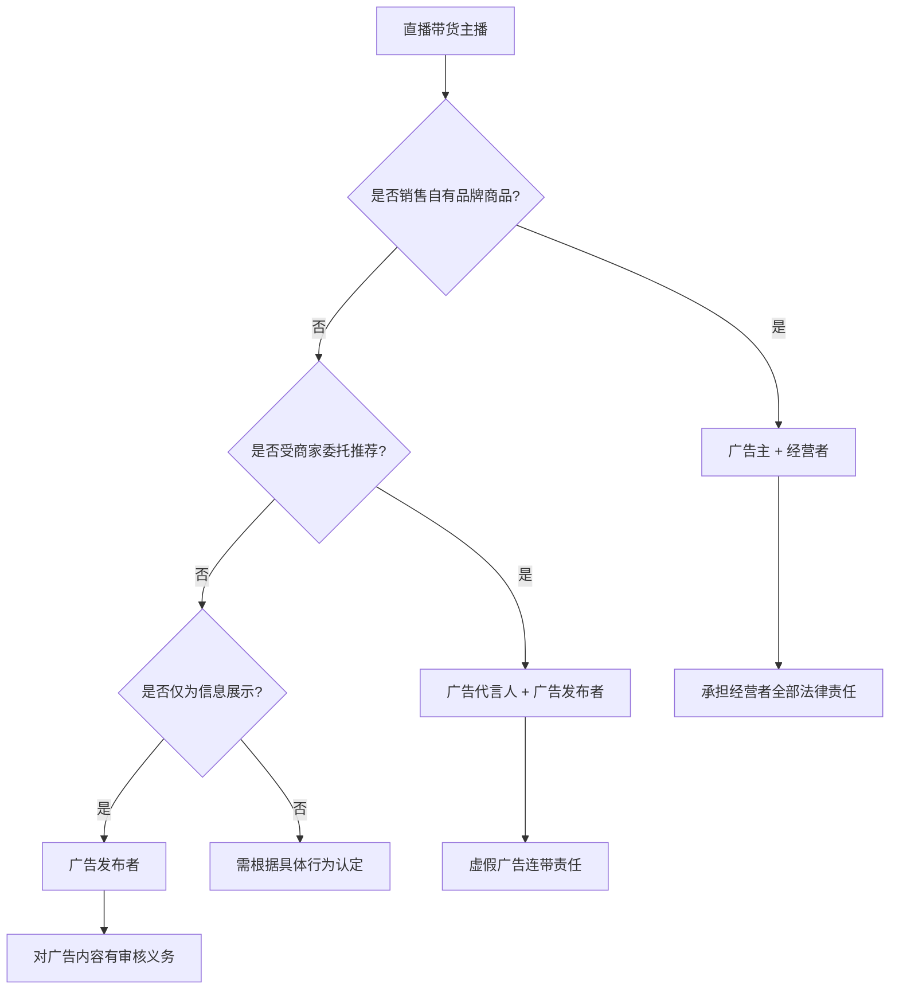
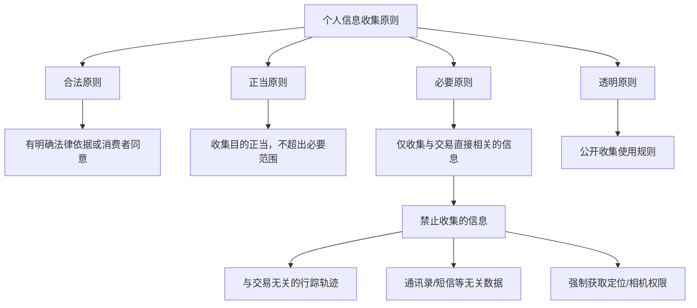
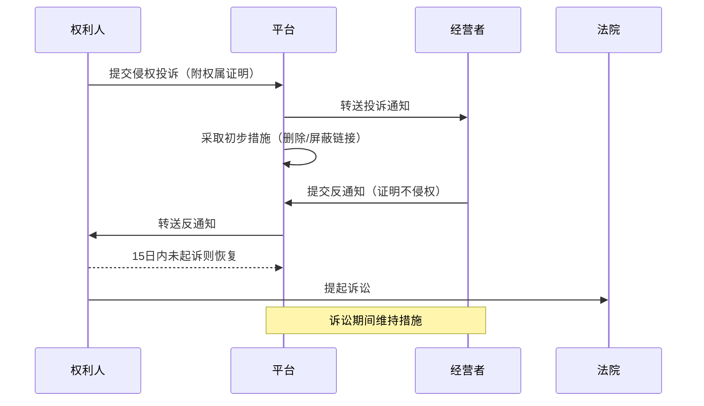
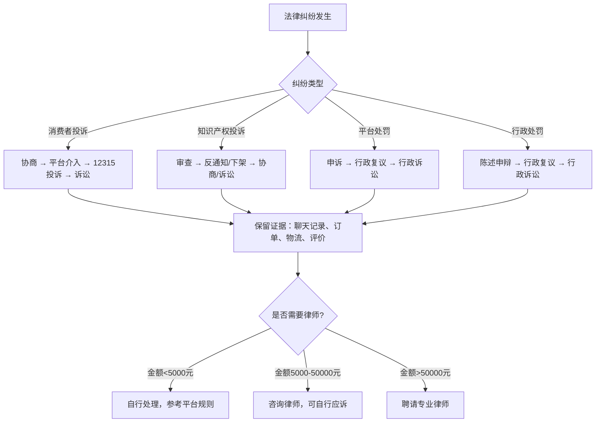

## 十、电子商务法律基础

2023年中国网络零售额达15.42万亿元，占社会消费品零售总额的27.6%。与此同时，全国市场监管系统受理的电商投诉举报超过200万件。每一个做电商、搞直播带货、开网店的人，都处在法律风险的最前沿。

电子商务法律不是"懂一点就行"的知识——它是你做生意的地基。本节从《电子商务法》的立法框架出发，系统讲解电商经营者的法律义务、平台规则的法律边界、广告合规、消费者权益保护、跨境电商法规，以及知识产权与反不正当竞争等核心领域。

### 1. 《电子商务法》的立法框架与核心制度

#### 1.1 立法背景与适用范围

《中华人民共和国电子商务法》于2019年1月1日正式施行，是中国电商领域的基本法。该法的出台填补了此前电商监管"九龙治水"的空白——工商、商务、网信、海关各管一摊的局面被终结。

**适用范围的三个层次：**

| 层次 | 具体范围 | 典型场景 |
|------|---------|---------|
| 电子商务经营者 | 通过互联网等信息网络销售商品或提供服务的自然人、法人和非法人组织 | 淘宝店主、微商、直播带货主播 |
| 电子商务平台经营者 | 在电子商务中为交易双方或多方提供网络经营场所、交易撮合、信息发布等服务的主体 | 淘宝、京东、拼多多、抖音电商 |
| 平台内经营者 | 通过电子商务平台销售商品或提供服务的经营者 | 入驻天猫的品牌商家、拼多多店铺 |

**一个重要澄清：** 朋友圈卖货、微信群团购、小红书种草带货，只要是以营利为目的的商品交易行为，都受《电子商务法》约束。很多人误以为"我不是正规电商，法律管不到我"——这是最常见的认知误区。

#### 1.2 六大核心制度

**制度一：主体登记制度**

《电子商务法》第十条明确规定，电子商务经营者应当依法办理市场主体登记。但有以下例外：

- 个人销售自产农副产品
- 家庭手工业产品
- 个人利用自己的技能从事依法无须取得许可的便民劳务活动
- 零星小额交易活动（具体标准由国务院税务主管部门制定，实践中通常指年交易额不超过10万元）

**制度二：信息公示制度**

电子商务经营者必须在首页显著位置持续公示以下信息：

| 必须公示的信息 | 说明 | 违反后果 |
|--------------|------|---------|
| 营业执照信息 | 注册号、法定代表人、经营范围等 | 责令限期改正，可处1万元以下罚款 |
| 行政许可信息 | 食品经营许可证、医疗器械经营许可证等 | 同上 |
| 不需要登记的声明 | 适用豁免情形的经营者需公示自我声明 | — |
| 经营地址、联系方式 | 真实有效的联系信息 | 责令限期改正 |

**制度三：税收征管制度**

电商经营者必须依法纳税。这意味着：

- 办理税务登记
- 按时申报纳税
- 依法开具发票
- 平台需向税务部门报送平台内经营者的身份信息和纳税相关信息

很多人以为线上交易"查不到"，但金税四期系统已经打通了银行、税务、市场监管的数据壁垒。2023年税务部门通过大数据分析追缴电商税款超过50亿元。

### 2. 电子商务经营者的法律义务

#### 2.1 经营者主体资格

**谁需要办理市场主体登记？**

**办理主体登记的实操流程：**

1. **选择企业类型**：个人电商首选个体工商户（税负低、手续简）；有合伙人或需要融资的选有限责任公司
2. **核名**：在当地市场监管局网站或现场核名，准备3-5个备选名称
3. **准备材料**：身份证、经营场所证明（自有房产证或租赁合同）、经营范围描述
4. **在线申请**：通过"全国企业信用信息公示系统"或当地政务服务平台在线提交
5. **领取营业执照**：通常1-3个工作日
6. **税务登记**：领取执照后30日内到税务部门办理税务登记
7. **开立银行对公账户**：用于经营资金往来

**经营者登记后的持续义务：**

- 每年1月1日至6月30日进行企业年报公示
- 经营信息变更后20个工作日内进行变更登记
- 妥善保管交易记录不少于三年
- 依法进行纳税申报

#### 2.2 商品与服务质量义务

电子商务经营者销售的商品或提供的服务应当符合保障人身、财产安全的要求，不得销售或提供法律、行政法规禁止交易的商品或服务。

**禁止在网上销售的商品类别：**

| 类别 | 具体内容 | 法律依据 |
|------|---------|---------|
| 特许经营商品 | 烟草、处方药、管制药品 | 相关行政法规 |
| 危险品 | 枪支弹药、管制刀具、爆炸物 | 刑法相关条款 |
| 侵权商品 | 假冒伪劣产品、盗版软件 | 商标法、著作权法 |
| 违禁品 | 濒危野生动植物制品、毒品 | 野生动物保护法、禁毒法 |
| 特殊许可商品 | 金融产品、医疗器械（部分） | 证券法、医疗器械监督管理条例 |

#### 2.3 信息保存与配合执法义务

《电子商务法》第三十一条要求，电子商务平台经营者应当记录、保存平台上发布的商品和服务信息、交易信息，并确保信息的完整性、保密性、可用性。商品和服务信息、交易信息保存时间自交易完成之日起不少于三年。

这意味着：
- 平台有义务配合监管部门的调查取证
- 经营者的每一笔交易记录都可能成为法律证据
- 删除交易记录不能免除法律责任

### 3. 平台规则与法律关系

#### 3.1 平台与商家的法律关系

电商平台与商家之间存在多重法律关系，理解这些关系是合规经营的前提：

**平台的三重角色：**

| 角色 | 法律地位 | 权利义务 |
|------|---------|---------|
| 网络服务提供者 | 提供技术服务 | 有义务审核商家资质、提供交易信息 |
| 市场管理者 | 对平台内经营者进行管理 | 制定平台规则、处理违规行为、保护消费者 |
| 信息中介 | 连接买卖双方 | 确保信息真实、不得虚构交易 |

#### 3.2 平台责任的法律边界

《电子商务法》对平台责任的规定遵循"避风港规则"和"红旗规则"的平衡：

**避风港规则（通知-删除规则）：**

当权利人认为平台内经营者侵犯其合法权益时，可以向平台发出通知。平台收到通知后应当：
1. 及时采取删除、屏蔽、断开链接、终止交易和服务等必要措施
2. 将通知转送平台内经营者
3. 平台经营者接到转送通知后可以提交不存在侵权行为的声明
4. 平台将声明转送权利人，并告知其可以投诉或起诉

**红旗规则（明知或应知规则）：**

平台经营者对以下情形不能援引避风港规则免责：
- 明知或应知平台内经营者侵犯他人知识产权而未采取必要措施
- 明知或应知商品或服务不符合保障人身安全要求
- 对消费者未尽到安全保障义务造成损害

**平台的连带责任情形：**

| 情形 | 责任类型 | 法律依据 |
|------|---------|---------|
| 未审核经营者资质 | 先行赔付责任 | 电商法第38条第1款 |
| 明知侵权未采取措施 | 连带责任 | 电商法第38条第2款 |
| 未尽安全保障义务 | 相应责任 | 电商法第38条第2款 |
| 自营业务标注误导 | 自营责任 | 电商法第37条 |

#### 3.3 平台规则的合规审查

平台规则不是法外之地。《电子商务法》第三十四条明确规定，平台修改服务协议和交易规则应当在其首页显著位置公开征求意见，时间不少于七日。

**商家应对平台规则的策略：**

1. **入驻前仔细阅读服务协议**：重点关注保证金条款、处罚规则、退出机制
2. **保留所有交易证据**：聊天记录、订单截图、物流信息、评价截图
3. **了解申诉机制**：熟悉平台的申诉流程和时效
4. **关注规则变更**：平台规则变更时评估对自己业务的影响
5. **建立合规自查制度**：定期对照平台规则检查自身经营行为

### 4. 广告法合规

#### 4.1 电商广告的法律框架

电商广告受到《广告法》《电子商务法》《反不正当竞争法》的三重约束。其中最容易踩雷的是广告用语。

**绝对禁止使用的广告用语（绝对化用语）：**

| 类型 | 违规示例 | 合规替代 |
|------|---------|---------|
| 极限词 | 最好、最佳、第一、唯一 | 优质、推荐、领先 |
| 绝对化表述 | 100%有效、绝无副作用 | 多数用户反馈良好 |
| 虚假承诺 | 永不反弹、一次见效 | 坚持使用可能有效果 |
| 国家级用语 | 国家级品质、世界级水平 | 品质优良 |

**特殊商品广告的额外要求：**

| 商品类型 | 额外要求 | 法律依据 |
|---------|---------|---------|
| 食品 | 不得声称有治疗功能，需标注"本品不能代替药物" | 食品安全法第73条 |
| 药品 | 必须经审批，需标注批准文号、禁忌、不良反应 | 广告法第15条 |
| 医疗器械 | 不得含有治愈率、有效率 | 广告法第16条 |
| 保健品 | 不得暗示有治疗功能，需标注"本品不能代替药物" | 广告法第18条 |
| 农药/兽药/饲料 | 必须有批准文号 | 广告法第21条 |
| 教育培训 | 不得明示或暗示有考试通过保证 | 广告法第24条 |

#### 4.2 直播带货的广告合规

直播带货中，主播的身份认定是关键问题——主播到底是广告代言人、广告发布者还是广告主？

**主播身份的法律认定：**

**直播带货十大合规要点：**

1. 不得使用"全网最低价""独家"等绝对化用语
2. 不得虚构原价、虚假优惠折价
3. 不得使用"秒杀""抢购"等制造虚假紧迫感（如实际库存充足）
4. 不得使用患者/消费者形象作推荐证明
5. 食品、保健品不得宣传疗效
6. 化妆品不得使用医疗用语或虚假功效宣称
7. 需要事先公示商品的真实信息（价格、产地、成分等）
8. 不得诱导未成年人消费
9. 赠品信息需明确告知，不得"先涨后降"
10. 退换货政策需提前说明，不得设置不合理门槛

#### 4.3 虚假宣传的法律后果

| 违法行为 | 处罚标准 | 法律依据 |
|---------|---------|---------|
| 一般虚假广告 | 广告费用3-5倍罚款，无法计算的处20-100万元 | 广告法第55条 |
| 虚假广告两年内有三次以上违法行为 | 处100-200万元罚款，可吊销营业执照 | 广告法第55条 |
| 发布虚假广告，欺骗、误导消费者 | 消费者可要求退一赔三（最低500元） | 消保法第55条 |
| 直播带货虚假宣传 | 广告主、广告经营者、广告发布者、代言人承担连带责任 | 广告法第56条 |

### 5. 消费者权益保护

#### 5.1 七天无理由退货制度

《消费者权益保护法》第二十五条和《电子商务法》第三十二条共同确立了网购"七天无理由退货"制度。但这个制度有明确的适用边界。

**可以不适用七天无理由退货的商品：**

| 类别 | 具体情形 | 处理方式 |
|------|---------|---------|
| 定制类商品 | 按消费者要求定制的家具、服装等 | 经营者需在商品页面明确标注 |
| 鲜活易腐商品 | 生鲜食品、鲜花等 | 同上 |
| 数字商品 | 在线下载的音视频、软件等 | 消费者确认后不可退 |
| 交付的报纸、期刊 | 时效性商品 | 同上 |
| 拆封后影响安全或品质的商品 | 内衣裤、食品（已拆封）等 | 需在销售前明确告知 |

**重要澄清：** "拆封后不可退"不等于"试穿后不可退"。衣服试穿属于正常验货，不能以"已拆封"为由拒绝退货。只有当商品拆封后确实影响二次销售时，经营者才能拒绝。

#### 5.2 消费者个人信息保护

电商经营者在收集消费者个人信息时，必须遵守以下原则：

**电商平台常见的违规行为：**

- 未经同意收集个人位置信息
- 强制用户同意过度的隐私政策
- 将消费者个人信息出售给第三方
- 利用大数据"杀熟"（对老用户标高价）
- 用户注销后仍保留个人信息

#### 5.3 预付式消费的法律保护

电商领域的预付式消费（充值会员、预购储值卡等）有专门的法律规制：

**经营者的义务：**
- 以书面合同形式与消费者约定商品或服务的内容、价格、预付款退还方式等
- 不得设定"一经售出、概不退款"等不公平条款
- 消费者有权在约定期限内要求退还预付款余额
- 经营者停业或迁址的，应提前30日告知消费者

**消费者的维权路径：**

1. 与经营者协商
2. 向消费者协会投诉（12315热线或全国12315平台）
3. 向市场监管部门投诉
4. 申请仲裁或提起诉讼
5. 通过平台投诉机制维权

### 6. 跨境电商法规

#### 6.1 跨境电商的法律框架

跨境电商涉及海关、税务、外汇、质检等多个监管领域，法律关系比国内电商复杂得多。

**跨境电商的三种模式及其法律关系：**

| 模式 | 法律关系 | 适用场景 | 代表平台 |
|------|---------|---------|---------|
| 保税进口（1210） | 商品先入保税仓，消费者下单后从保税仓发货 | 标准化商品，量大 | 天猫国际、京东国际 |
| 直购进口（9610） | 消费者下单后从海外直邮 | 长尾商品，个性化需求 | 亚马逊海外购 |
| 海外直邮（个人代购） | 个人从海外购买后邮寄回国 | 个人消费，代购 | 微商、朋友圈 |

**跨境电商的税收政策：**

| 类别 | 税收规则 | 优惠限额 |
|------|---------|---------|
| 跨境电商零售进口 | 关税0%+增值税/消费税70%征收 | 单次5000元，年度26000元 |
| 超过限额 | 按一般贸易全额征税 | — |
| 个人代购 | 行邮税 | 税额≤50元免征 |

#### 6.2 跨境电商经营者的合规要求

**必须满足的合规条件：**

1. **商品准入合规**：进口商品需符合中国国家标准，获得必要的CCC认证、备案等
2. **中文标签**：进口商品必须加贴中文标签（跨境电商零售进口商品可豁免，但需在商品页面提供中文电子标签）
3. **消费者告知义务**：明确告知消费者商品原产地、是否经过质检、售后保障方式等
4. **退换货政策**：跨境电商商品同样适用七天无理由退货（定制、鲜活易腐等特殊商品除外）
5. **知识产权保护**：不得销售侵权商品，平台有义务建立知识产权保护规则

**跨境电商常见违规类型：**

| 违规行为 | 法律后果 | 案例参考 |
|---------|---------|---------|
| 假冒品牌代购 | 商标侵权，最高5倍赔偿 | 假冒奢侈品代购案 |
| 虚假原产地 | 消费欺诈，退一赔三 | 标注"日本制造"实为国产 |
| 无中文标签 | 产品质量法处罚 | 进口化妆品无标签 |
| 超限额不报关 | 走私，刑事责任 | 化整为零规避关税 |
| 未经许可进口特殊商品 | 行政处罚乃至刑事追诉 | 未经备案进口保健品 |

#### 6.3 海关与税务合规

跨境电商经营者需要特别注意海关申报和税务合规：

**海关申报要点：**
- 如实申报商品名称、数量、价值
- 不得伪报、瞒报、低报价格
- 个人代购年交易额超过免税限额需主动申报纳税
- 保税仓商品的库存管理需配合海关监管

**税务合规要点：**
- 跨境电商零售进口商品的增值税和消费税由跨境电商平台代收代缴
- 个人代购达到经营标准的需要办理工商登记和税务登记
- 通过"蚂蚁搬家"式代购规避关税的，可能构成走私罪

### 7. 知识产权保护

#### 7.1 电商平台的知识产权保护机制

各大电商平台都建立了知识产权保护体系。权利人可以通过平台的投诉机制维权，经营者也需要了解如何应对侵权投诉。

**主流平台的知识产权投诉流程：**

**经营者应对知识产权投诉的策略：**

1. **收到投诉后立即审查**：确认投诉是否合理，是否确实存在侵权
2. **保留证据**：保存商品来源、进货凭证、授权文件等
3. **及时提交反通知**：如确实不侵权，应在平台规定时限内提交反通知
4. **自查自纠**：检查店铺内其他商品是否也存在类似问题
5. **建立知识产权合规制度**：定期检查商品标题、图片、描述是否侵犯他人知识产权

#### 7.2 电商常见的知识产权侵权类型

| 侵权类型 | 具体表现 | 赔偿标准 |
|---------|---------|---------|
| 商标侵权 | 使用与他人注册商标相同或近似的标识 | 实际损失或侵权获利，1-5倍惩罚性赔偿 |
| 著作权侵权 | 使用他人图片、文案、视频 | 实际损失或侵权获利，500元-500万元 |
| 专利侵权 | 销售侵犯他人外观设计或实用新型专利的商品 | 实际损失或侵权获利，1-5倍惩罚性赔偿 |
| 不正当竞争 | 使用他人知名商品的包装装潢 | 赔偿实际损失 |

**高发侵权场景与防范：**

- **图片侵权**：使用他人拍摄的产品图片、模特图、场景图。防范：使用原创图片或购买正版图片素材
- **文案侵权**：复制他人的商品描述、营销文案。防范：撰写原创文案
- **品牌名称侵权**：店铺名或商品标题中使用他人商标。防范：提前进行商标查询
- **外观设计侵权**：销售与他人外观设计专利相似的商品。防范：采购前确认供应商的设计权属

### 8. 反不正当竞争

#### 8.1 电商领域的不正当竞争行为

《反不正当竞争法》规制以下电商领域的典型不正当竞争行为：

**刷单炒信（虚构交易）：**

刷单炒信是电商领域最普遍的不正当竞争行为之一。经营者通过虚构交易量和好评来提升店铺信誉。

法律后果：
- 市场监管部门可处20万-100万元罚款
- 情节严重的，处100万-200万元罚款，可吊销营业执照
- 构成虚假宣传的，适用广告法处罚
- 涉嫌非法经营罪的，移送司法机关

**大数据杀熟：**

平台利用大数据分析对不同消费者实施差异化定价，对老用户收取更高价格。

法律认定要素：
- 利用消费者个人信息进行画像
- 实施不合理的差异化定价
- 未向消费者明示定价规则
- 损害消费者的知情权和公平交易权

**恶意不兼容：**

平台要求商家"二选一"，限制商家在其他平台经营。

法律后果：
- 反不正当竞争法和反垄断法均可适用
- 可处上年度销售额1%-10%的罚款
- 2021年某电商平台因"二选一"被罚182.28亿元

#### 8.2 商业秘密保护

电商经营者还需要注意保护自身的商业秘密：

- 客户名单和联系方式
- 供应商信息和采购价格
- 营销策略和推广数据
- 技术方案和运营流程

**保护措施：**
1. 与员工签订保密协议和竞业限制协议
2. 对核心数据设置访问权限
3. 离职交接时收回所有账号和权限
4. 发现商业秘密被侵犯时及时取证并报警

### 9. 常见误区与风险防范

#### 9.1 十大电商法律误区

| 误区 | 真相 | 正确做法 |
|------|------|---------|
| "我是小卖家，法律管不到我" | 电商法适用于所有以营利为目的的经营者 | 达到标准就办理登记，合规经营 |
| "朋友圈卖货不算电商" | 微信、小红书等社交平台的商业交易同样受电商法约束 | 遵守电商法各项义务 |
| "七天无理由退货是无条件的" | 有明确的例外情形和适用边界 | 在商品页面明确标注退货政策 |
| "平台规则就是法律" | 平台规则不得违反法律强制性规定 | 了解法律底线，不盲从平台规则 |
| "刷单是行业潜规则，大家都做" | 刷单炒信是违法行为，可处高额罚款 | 通过合法方式提升店铺信誉 |
| "进口商品不需要中文标签" | 一般贸易进口商品必须加贴中文标签 | 确保商品标签合规 |
| "图片网上找的，大家都在用" | 未经授权使用他人图片构成著作权侵权 | 使用原创或正版授权图片 |
| "消费者投诉了再处理也不晚" | 主动合规远比被动应对成本低 | 建立完善的售后服务体系 |
| "税务问题查不到我" | 金税四期已打通银行、税务、市场监管数据 | 依法纳税，保留完整财务记录 |
| "跨境电商利润高，可以先做再说" | 跨境电商涉及海关、税务、质检等多重监管 | 先了解法规再开展业务 |

#### 9.2 电商合规自查清单

**日常经营合规检查：**

- [ ] 营业执照信息在店铺首页显著位置公示
- [ ] 商品信息真实、准确、完整
- [ ] 广告用语不含绝对化用语和虚假宣传
- [ ] 进口商品中文标签合规
- [ ] 七天无理由退货政策明确公示
- [ ] 消费者个人信息收集获得明确同意
- [ ] 商品图片、文案为原创或已获授权
- [ ] 交易记录完整保存
- [ ] 税务登记正常，按时申报纳税
- [ ] 平台规则变更及时跟进

**知识产权合规检查：**

- [ ] 店铺名称未侵犯他人商标权
- [ ] 商品标题不含他人注册商标
- [ ] 产品图片为原创或正版授权
- [ ] 商品描述未复制他人文案
- [ ] 销售商品未侵犯他人外观设计专利
- [ ] 获得品牌授权的经营者持有有效的授权文件

### 10. 进阶：电商法律纠纷的应对策略

#### 10.1 纠纷发生后的应对流程

#### 10.2 证据保全的关键要点

电商纠纷中，电子证据的保全至关重要：

1. **即时保全**：发现侵权或纠纷时第一时间截图、录屏
2. **区块链存证**：使用可信时间戳或区块链存证平台（如公证云、权大师）固定电子证据
3. **公证保全**：对重要证据进行公证保全，提高证据效力
4. **原始载体保留**：保留聊天记录的原始手机或电脑，不要删除原始数据
5. **完整链条**：证据要形成完整的链条，从下单到付款到物流到收货到售后

#### 10.3 合规成本与收益分析

| 合规项目 | 合规成本 | 不合规风险 | 投入产出比 |
|---------|---------|-----------|-----------|
| 办理营业执照 | 时间成本约1周 | 罚款1万元以下 | 高 |
| 商品标签合规 | 每个SKU约增加5-10元 | 没收违法所得+罚款3万起 | 高 |
| 广告用语合规 | 内部培训+审核制度 | 罚款20万-100万元 | 极高 |
| 知识产权检索 | 年费约1000-5000元 | 侵权赔偿500-500万元 | 极高 |
| 税务合规 | 会计成本约3000-5000元/年 | 补税+滞纳金+1-5倍罚款 | 高 |
| 数据合规 | 技术改造约1-5万元 | 罚款5000万元或年营业额5% | 极高 |

**结论：** 合规不是成本，而是投资。每一项合规投入都能避免数倍甚至数十倍的潜在损失。

### 11. 本节小结

电子商务法律基础的核心可以浓缩为三句话：

**第一，主体要合规。** 办理必要的工商登记和税务登记，依法公示经营信息，这是做生意的基本门槛。

**第二，行为要合规。** 广告用语不踩红线，商品质量有保障，消费者权益要尊重，知识产权要敬畏——这些是日常经营的行为准则。

**第三，体系要合规。** 从商品上架到售后服务，从数据收集到税务申报，建立系统性的合规管理制度，而不是出了问题再补救。

电商法律不是束缚，而是护城河。在一个人人都在打擦边球的市场里，合规经营者反而拥有最大的竞争优势——因为消费者信任合规的商家，平台扶持合规的店铺，法律保护合规的经营者。

> **关联阅读：** 隐私与数据保护（本章第八节）为电商场景中的数据合规提供了更详细的法律分析；反洗钱与反恐怖融资（本章第十一节）涉及大额交易和可疑交易的报告义务；实战案例"电子商务法律纠纷"（本章案例八）提供了真实的电商法律纠纷全流程分析。
