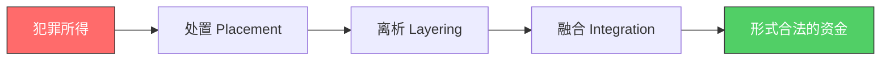

## 十一、反洗钱与反恐怖融资

反洗钱（Anti-Money Laundering, AML）与反恐怖融资（Counter-Terrorist Financing, CTF）是全球金融监管的核心议题。随着中国金融监管体系日趋完善，个人和企业在日常经济活动中触碰反洗钱红线的风险显著增加。无论是开设银行账户、进行大额转账、参与跨境电商，还是从事加密货币交易，都可能触发反洗钱审查机制。理解这套制度的运作逻辑，不仅是法律义务，更是保护自身财产安全的必备能力。

### 1. 基本概念与法律框架

#### 1.1 什么是洗钱

洗钱（Money Laundering）是指将犯罪所得及其收益通过各种手段掩饰、隐瞒其来源和性质，使其在形式上合法化的行为。通俗地说，就是把"脏钱"洗成"干净的钱"。

洗钱的典型三个阶段：

| 阶段 | 英文 | 目的 | 典型手法 |
|------|------|------|----------|
| 处置（Placement） | Placement | 将非法资金投入金融体系 | 化整为零存入多个账户、购买高价值商品、混入合法经营收入 |
| 离析（Layering） | Layering | 通过复杂交易切断资金与犯罪的关联 | 多层转账、跨境汇款、壳公司交易、虚假贸易 |
| 融合（Integration） | Layering | 将"洗净"的资金重新投入合法经济 | 投资房产、创办企业、购买金融产品 |

#### 1.2 什么是恐怖融资

恐怖融资（Terrorist Financing）是指为恐怖活动组织、恐怖活动人员实施恐怖活动提供资金或其他物质支持的行为。与洗钱的关键区别在于：恐怖融资的资金来源可能是合法的（如慈善捐款、合法经营收入），其核心违法性在于资金的去向和用途。

| 维度 | 洗钱 | 恐怖融资 |
|------|------|----------|
| 资金来源 | 犯罪所得（非法） | 可能合法，也可能非法 |
| 资金去向 | 洗白后供个人使用 | 用于恐怖活动 |
| 核心违法性 | 掩盖资金来源 | 为恐怖活动提供资助 |
| 交易特征 | 金额通常较大 | 金额可能很小 |
| 典型手段 | 大额转移、贸易伪装 | 小额多次、慈善组织、非正规汇款 |

#### 1.3 国际法律框架

**金融行动特别工作组（FATF）** 是全球反洗钱和反恐怖融资领域最重要的国际组织，成立于1989年，总部设在巴黎。FATF制定的"40项建议"是全球反洗钱/反恐融资的国际标准，涵盖：

- 客户尽职调查（CDD）
- 可疑交易报告（STR）
- 大额交易报告（CTR）
- 政治敏感人物（PEP）加强审查
- 国际合作与信息交换

FATF每轮互评估会对成员国进行评级，中国于2019年接受了第四轮互评估。评估结果直接影响一个国家的国际信用评级和金融准入。

其他重要国际组织和框架：

- **联合国**：《制止向恐怖主义提供资助的国际公约》《联合国反腐败公约》
- **巴塞尔银行监管委员会**：银行客户尽职调查指引
- **沃尔夫斯堡集团**（Wolfsberg Group）：私营银行反洗钱最佳实践
- **埃格蒙特集团**（Egmont Group）：各国金融情报机构之间的国际合作网络

#### 1.4 中国反洗钱法律体系

中国反洗钱法律体系呈"法律—行政法规—部门规章—行业规范"四级结构：

**第一层：法律**
- 《中华人民共和国反洗钱法》（2006年制定，2025年修订）——反洗钱领域的基本法
- 《中华人民共和国刑法》第191条（洗钱罪）、第312条（掩饰、隐瞒犯罪所得罪）、第349条（窝藏、转移、隐瞒毒品犯罪所得罪）
- 《中华人民共和国反恐怖主义法》
- 《中华人民共和国中国人民银行法》赋予央行反洗钱监管职责

**第二层：行政法规**
- 《金融机构反洗钱规定》
- 《金融机构大额交易和可疑交易报告管理办法》
- 《金融机构客户身份识别和客户身份资料及交易记录保存管理办法》

**第三层：部门规章**
- 中国人民银行发布的各类反洗钱规范性文件
- 银保监会、证监会等行业监管部门的配套规定

**第四层：行业规范**
- 各金融机构内部反洗钱制度和操作规程
- 行业协会的自律规范

2025年新修订的《反洗钱法》带来多项重要变化：扩大了反洗钱义务主体范围（将特定非金融机构纳入）、提高了处罚力度、完善了受益所有人信息登记制度、强化了跨境反洗钱合作机制。

### 2. 反洗钱的核心制度

#### 2.1 客户尽职调查（KYC）

KYC（Know Your Customer）是反洗钱体系的第一道防线。金融机构在与客户建立业务关系时，必须核实客户身份并了解交易目的。

**基础尽职调查（CDD）** 包含：

1. **身份识别**：自然人需提供有效身份证件（居民身份证、护照等），法人需提供营业执照、法定代表人身份证等
2. **地址验证**：常住地址、经营地址的核实
3. **职业/经营信息**：了解客户的收入来源和交易背景
4. **受益所有人识别**：穿透股权结构，识别最终控制人（持股25%以上或以其他方式控制的自然人）

**增强尽职调查（EDD）** 适用于高风险场景：
- 与政治敏感人物（PEP）的交易
- 来自FATF灰名单/黑名单国家的客户
- 大额现金交易
- 无明显经济目的的复杂交易
- 代理行关系

**简化尽职调查（SDD）** 适用于低风险场景：
- 政府机构
- 上市公司
- 低风险产品（如小额预付卡）

#### 2.2 大额交易与可疑交易报告

金融机构必须向中国反洗钱监测分析中心报送两类报告：

**大额交易报告标准：**

| 交易类型 | 报告阈值 |
|----------|----------|
| 境内现金交易 | 单笔或当日累计人民币5万元以上 |
| 境外现金交易 | 单笔或当日累计等值1万美元以上 |
| 境内转账（非现金） | 单笔或当日累计人民币200万元以上 |
| 跨境转账（非现金） | 单笔或当日累计等值20万美元以上 |

**可疑交易报告（STR）** 不设金额门槛，以交易行为异常为判断标准。常见的可疑特征包括：

- 短期内频繁收取大量小额转账后集中转出（"化整为零"型）
- 与客户身份、经营状况明显不符的大额交易
- 长期闲置账户突然出现大量资金活动
- 频繁在深夜或非工作时间进行大额交易
- 资金快进快出，账户余额极低
- 客户拒绝提供合理解释或提供虚假信息

#### 2.3 交易记录保存

金融机构必须保存客户身份资料和交易记录至少5年。这些记录包括：

- 客户身份证明文件的复印件
- 开户申请资料
- 每笔交易的详细信息（交易时间、金额、对手方、交易渠道）
- 可疑交易分析报告和相关工作记录

#### 2.4 制裁名单筛查

金融机构必须对客户和交易对手进行制裁名单筛查，筛查范围包括：

- 联合国安理会制裁名单
- 中国人民银行反洗钱局发布的各类名单
- FATF高风险及不予合作司法管辖区名单
- 美国OFAC制裁名单（对于涉及美元交易的机构）
- 欧盟制裁名单

### 3. 反洗钱义务主体

#### 3.1 金融机构

金融机构是反洗钱义务的核心承担者：

- **银行业**：商业银行、政策性银行、农村信用社等
- **证券期货业**：证券公司、期货公司、基金管理公司
- **保险业**：保险公司、保险经纪公司
- **支付机构**：第三方支付平台（支付宝、微信支付等均在此列）
- **信托公司、金融资产管理公司**

#### 3.2 特定非金融机构

2025年修订的《反洗钱法》将以下非金融机构纳入反洗钱义务主体：

- **房地产开发企业和房产中介机构**
- **贵金属和宝石交易商**
- **会计师事务所、律师事务所**（在特定业务中）
- **公证机构**
- **公司服务提供商**（代理注册、代理记账等）

#### 3.3 个人的反洗钱义务

普通个人虽不是反洗钱义务主体，但在以下场景中需要配合反洗钱工作：

1. **配合身份核实**：办理银行业务时提供真实身份信息
2. **如实报告大额现金交易**：部分场景下需填写资金来源和用途
3. **不得协助洗钱**：出借银行账户、协助转移资金均属违法
4. **举报可疑活动**：发现洗钱线索可向反洗钱部门举报

### 4. 洗钱罪的法律后果

#### 4.1 刑事责任

根据《刑法》第191条，洗钱罪的刑罚如下：

| 情节 | 刑罚 |
|------|------|
| 一般情节 | 五年以下有期徒刑或拘役，并处或单处洗钱金额5%以上20%以下罚金 |
| 情节严重 | 五年以上十年以下有期徒刑，并处洗钱金额5%以上20%以下罚金 |

洗钱罪的上游犯罪包括：
- 毒品犯罪
- 黑社会性质的组织犯罪
- 恐怖活动犯罪
- 走私犯罪
- 贪污贿赂犯罪
- 破坏金融管理秩序犯罪
- 金融诈骗犯罪

《刑法》第312条（掩饰、隐瞒犯罪所得罪）覆盖面更广，不限于特定上游犯罪，最高刑罚为七年有期徒刑。

#### 4.2 行政处罚

对金融机构的反洗钱违规行为，监管部门可处以：

- 对机构：最高500万元罚款
- 对直接负责的主管人员和其他直接责任人员：最高50万元罚款
- 情节严重的，可责令停业整顿或吊销经营许可证
- 禁止从事相关金融工作

2024年至2025年间，中国人民银行对多家金融机构开出反洗钱罚单，单笔罚款金额屡创新高，部分银行被罚金额超过千万元，多名高管被追究个人责任。

#### 4.3 对个人的影响

即使不构成刑事犯罪，个人如果触发反洗钱监管，也可能面临：

- 银行账户被冻结或限制交易
- 被列入反洗钱关注名单
- 被金融机构拒绝服务（"断卡行动"后的现实风险）
- 信用记录受到影响
- 影响签证和出入境（部分国家会查询反洗钱记录）

### 5. 个人与企业的合规实践

#### 5.1 个人层面的合规要点

**日常生活中需要注意的事项：**

1. **不外借银行卡和账户**：将自己的银行卡、手机卡出借或出售给他人，一旦被用于洗钱，出借人将承担连带法律责任。近年来"断卡行动"严厉打击此类行为，已有大量案例
2. **配合银行尽职调查**：银行要求提供收入证明或交易说明时应如实配合，拖延或拒绝配合反而会引起更大怀疑
3. **避免异常交易模式**：
   - 不要频繁进行刚好低于报告阈值的交易（"结构化交易"本身即违法）
   - 不要短期内大量转入转出
   - 不要在无合理理由的情况下使用多个银行账户进行资金归集
4. **保护个人信息**：防止身份被盗用开设"幽灵账户"用于洗钱
5. **跨境汇款合规**：个人每年购汇额度为等值5万美元，超额需提供真实用途证明

**什么是"结构化交易"（Structuring）：**

结构化交易是指故意将大额资金拆分为多笔小额交易，以规避大额交易报告制度。例如，将50万元拆成10笔5万元以下的现金存款。这种行为本身就是违法的，无论资金来源是否合法。美国法律将此定为联邦犯罪，中国法律下同样属于违规行为，可能构成洗钱罪的帮助行为。

#### 5.2 企业层面的合规要点

**企业应建立的反洗钱内控制度：**

1. **客户尽职调查制度**：建立标准化的客户身份识别和风险评估流程
2. **交易监测系统**：部署自动化交易监控工具，设置异常交易预警规则
3. **可疑交易报告流程**：明确报告路径、时限和责任人
4. **员工培训制度**：定期开展反洗钱培训，确保一线员工掌握基本识别技能
5. **记录保存制度**：确保客户资料和交易记录完整保存至少5年
6. **内部审计制度**：定期对反洗钱合规情况进行内部审计

**企业反洗钱风险评估矩阵：**

| 风险维度 | 低风险 | 中风险 | 高风险 |
|----------|--------|--------|--------|
| 客户类型 | 本地居民、政府机构 | 外地客户、中小企业 | 外国人、PEP、现金密集型行业 |
| 产品/服务 | 标准存贷款 | 电子银行、贸易融资 | 私人银行、跨境汇款、代理行业务 |
| 地域 | 低风险国家/地区 | 中等风险国家/地区 | FATF灰名单/黑名单国家 |
| 交易方式 | 电子转账、有据可查 | 部分现金交易 | 大额现金、匿名交易 |
| 业务关系 | 长期稳定客户 | 新客户 | 一次性交易、代理关系 |

#### 5.3 特定行业的合规注意事项

**跨境电商：**
- 确保资金收付渠道合法合规
- 保留完整的交易合同、发票、物流凭证
- 注意关联公司之间的交易定价（可能触发反避税和反洗钱双重审查）
- 使用第三方跨境支付平台时，确认平台已取得相关牌照

**数字资产/加密货币：**
- 2021年起中国全面禁止加密货币交易和挖矿
- 个人持有加密货币不违法，但交易和兑换受到严格限制
- 通过境外平台交易同样面临法律风险
- 境外部分司法管辖区已将加密货币交易所纳入反洗钱监管（如欧盟MiCA法规、日本《资金结算法》）
- NFT、DeFi等新兴领域正在成为反洗钱监管的新焦点

**房地产交易：**
- 大额房产交易是常见的洗钱渠道
- 购房资金来源需合理说明
- 房地产开发企业和中介机构已被纳入反洗钱义务主体
- 利用他人名义购房（"代持"）可能涉及洗钱风险

**慈善与非营利组织：**
- 慈善捐款可能被用于恐怖融资
- 境外捐赠需特别注意合规审查
- 基金会应建立完善的资金来源审查机制

### 6. 典型案例分析

#### 案例一：银行卡出借导致的法律风险

大学生小李将自己名下的银行卡以500元价格"借"给朋友使用。该卡后来被诈骗团伙用于转移赃款，涉及资金超过200万元。小李虽然未直接参与诈骗，但因出借银行卡协助转移犯罪资金，被以帮助信息网络犯罪活动罪追究刑事责任，判处有期徒刑一年，并处罚金。

**教训**：任何情况下都不应出借、出租或出售银行卡、手机卡、对公账户。

#### 案例二：代购行业的洗钱陷阱

某海外代购商在日常经营中，接受了一位"大客户"的请求：以高于市场价的汇率代为收取人民币款项，再以等值外币在境外采购商品。该代购商未意识到，"大客户"实际上是利用其账户进行跨境洗钱。最终该代购商因涉嫌洗钱罪被调查。

**教训**：经营中遇到明显偏离市场规律的交易条件时，应高度警惕洗钱风险。

#### 案例三：加密货币场外交易的风险

张某通过场外交易（OTC）帮他人用人民币购买USDT，赚取差价。其交易对手的资金来源于电信诈骗。张某虽然声称自己只是"搬砖"赚差价，但因未核实资金来源，被认定为掩饰、隐瞒犯罪所得罪，获刑三年。

**教训**：即使是看似正常的商业活动，忽视资金来源审查也可能构成犯罪。

#### 案例四：企业账户异常交易

某贸易公司在正常经营期间，突然频繁收到与业务无关的大额转账，随后迅速将资金转出至多个个人账户。银行反洗钱系统触发预警，经调查发现该公司实际控制人利用公司账户为他人洗钱，涉案金额超过5000万元。该公司被处以高额罚款，实际控制人被判处有期徒刑七年。

**教训**：企业主应确保公司账户仅用于正常经营活动，对异常资金往来保持警觉。

### 7. 常见误区与纠正

| 误区 | 纠正 |
|------|------|
| "我又不犯罪，反洗钱跟我无关" | 普通人也可能因账户出借、配合调查不力等原因被卷入反洗钱案件 |
| "小额交易不会被监控" | 可疑交易报告没有金额门槛，反洗钱系统会分析交易模式而非单笔金额 |
| "拆分多笔小额存款可以避开监控" | 这是"结构化交易"，本身就是违法行为 |
| "银行要求提供信息是故意刁难" | 这是法律要求的尽职调查，不配合反而会触发更高级别的审查 |
| "洗钱只涉及现金" | 电子转账、房产交易、加密货币、贸易发票等都是洗钱渠道 |
| "反洗钱只是银行的事" | 2025年修订后，房地产、贵金属、会计师等行业均被纳入义务范围 |
| "用别人账户转账不违法" | 出借和借用账户都是违规行为，可能承担连带法律责任 |
| "在境外交易不受中国法律管辖" | 中国公民在境外实施的洗钱行为同样可能被追究刑事责任 |

### 8. 实用工具与自查清单

#### 8.1 个人反洗钱风险自查表

在进行任何大额或异常交易前，建议对照以下清单自查：

- [ ] 交易对手是否为本人了解和信任的人？
- [ ] 资金来源和用途是否能够合理说明？
- [ ] 交易金额和频率是否与本人身份和收入匹配？
- [ ] 是否存在刻意规避报告门槛的行为？
- [ ] 是否使用了他人账户或被他人使用自己的账户？
- [ ] 交易是否涉及高风险国家或地区？
- [ ] 是否保留了交易的相关凭证和合同？

#### 8.2 企业合规检查要点

- [ ] 是否建立了书面的反洗钱内控制度？
- [ ] 是否对客户进行了充分的尽职调查？
- [ ] 是否部署了交易监测系统？
- [ ] 员工是否定期接受反洗钱培训？
- [ ] 是否有明确的可疑交易报告流程？
- [ ] 客户身份资料和交易记录是否保存完整（至少5年）？
- [ ] 是否定期进行反洗钱合规内部审计？
- [ ] 是否指定了专门的反洗钱合规负责人？

#### 8.3 相关查询资源

- **中国人民银行反洗钱局**：发布反洗钱政策和监管信息
- **中国反洗钱监测分析中心**（CAMLMAC）：接收和分析可疑交易报告
- **FATF官网**（www.fatf-gafi.org）：查阅国际标准和各国评估报告
- **国家外汇管理局**：跨境资金流动管理政策

### 9. 趋势与展望

反洗钱和反恐怖融资领域正在经历深刻变革：

1. **科技驱动监管（RegTech）**：人工智能和大数据技术在交易监测中的应用日益广泛，反洗钱系统的检测精度和效率大幅提升
2. **受益所有人透明化**：全球范围内推动公司实际控制人信息登记公开，堵塞利用壳公司洗钱的漏洞
3. **加密资产监管趋严**：FATF的"旅行规则"（Travel Rule）要求加密资产服务商共享交易双方信息，各国正在逐步落地
4. **跨境合作深化**：各国金融情报机构之间的信息交换日益频繁和便捷
5. **特定非金融机构扩围**：中国2025年修订的反洗钱法已将房地产、贵金属等行业纳入，未来可能进一步扩大范围
6. **个人数据保护与反洗钱的平衡**：如何在反洗钱信息收集和个人隐私保护之间取得平衡，是立法和执法面临的重要课题
