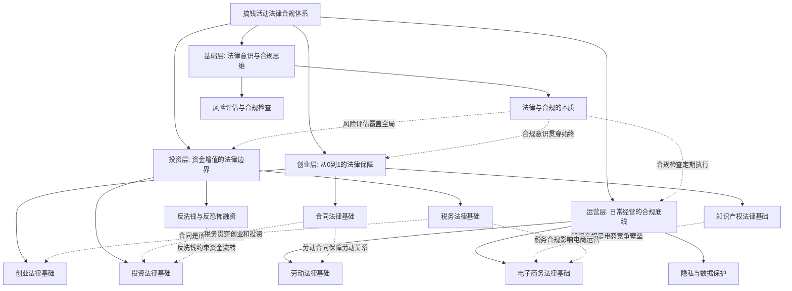
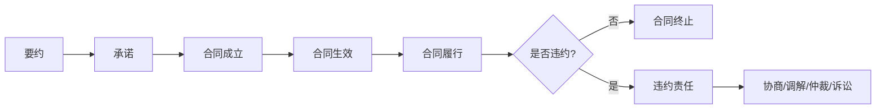
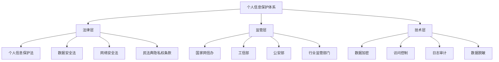

## 十二、本节总结

本节从法律与合规的本质出发，系统梳理了个人在搞钱过程中涉及的十大法律领域。本总结将各章核心知识串联为一个完整的法律合规知识体系，帮助你建立全局视野，形成可执行的合规思维框架。

### 1. 十大法律领域全景回顾

下表汇总了本节各章的核心内容、关键法律依据和最常见的风险点：

| 序号 | 领域 | 核心内容 | 关键法律依据 | 高频风险点 |
|------|------|----------|-------------|-----------|
| 1 | 法律与合规的本质 | 法律的功能、合规的意义、风险评估框架 | 《民法典》《刑法》《行政处罚法》 | 忽视法律导致民事/行政/刑事责任 |
| 2 | 创业法律基础 | 企业组织形式、公司设立、股东权利义务 | 《公司法》《合伙企业法》《个人独资企业法》 | 公司注册不规范、股权结构不合理 |
| 3 | 合同法律基础 | 合同的订立、效力、履行、违约责任 | 《民法典》合同编 | 口头合同举证难、违约条款不明确 |
| 4 | 知识产权法律基础 | 著作权、专利权、商标权、商业秘密 | 《著作权法》《专利法》《商标法》《反不正当竞争法》 | 侵权风险、未及时注册保护 |
| 5 | 投资法律基础 | 证券法、基金法、非法集资的界限 | 《证券法》《证券投资基金法》《刑法》相关条款 | 内幕交易、操纵市场、非法集资 |
| 6 | 税务法律基础 | 纳税义务、税种税率、税务筹划合法性 | 《个人所得税法》《企业所得税法》《税收征收管理法》 | 偷税漏税、虚开发票、税务筹划越界 |
| 7 | 劳动法律基础 | 劳动合同、竞业限制、社保公积金 | 《劳动法》《劳动合同法》《社会保险法》 | 竞业限制滥用、社保违规、违法解除 |
| 8 | 隐私与数据保护 | 个人信息保护、数据安全、网络安全 | 《个人信息保护法》《数据安全法》《网络安全法》 | 数据泄露、违规收集个人信息 |
| 9 | 电子商务法律基础 | 电商经营者义务、消费者权益、广告合规 | 《电子商务法》《消费者权益保护法》《广告法》 | 虚假宣传、假冒伪劣、售后义务缺失 |
| 10 | 反洗钱与反恐怖融资 | 可疑交易识别、客户身份识别、大额交易报告 | 《反洗钱法》《反恐怖主义法》 | 账户异常被冻结、卷入洗钱链条 |

### 2. 核心知识体系串联

法律合规不是孤立的知识点，而是一张相互关联的网。以下思维导图展示了各领域之间的逻辑关系：

### 3. 各领域核心要点速查

#### 3.1 法律与合规的本质——定方向

**核心认知**：法律不是束缚，而是保护。合规经营是搞钱活动的底线和护城河。

**三层法律后果**：
- **民事责任**：赔偿损失、恢复原状、支付违约金——直接侵蚀利润
- **行政责任**：罚款、吊销执照、列入黑名单——切断经营命脉
- **刑事责任**：拘留、判刑——人身自由的代价，任何利润都无法弥补

**风险评估方法**：对每一项搞钱活动，先问三个问题：
1. 这件事有没有法律禁止或限制？
2. 如果出了问题，最坏后果是什么？
3. 我有没有足够的法律知识来判断风险等级？

如果对任何一个问题回答不确定，就需要咨询专业人士或深入学习相关法规。

#### 3.2 创业法律基础——选对路

**企业组织形式对比**：

| 形式 | 设立门槛 | 责任范围 | 税负特点 | 适用场景 |
|------|----------|----------|----------|----------|
| 个体工商户 | 最低，无需注册资本 | 无限连带责任 | 经营所得税，税负较轻 | 小规模经营、试水阶段 |
| 个人独资企业 | 低，无需注册资本 | 无限连带责任 | 经营所得税，可核定征收 | 小型工作室、咨询业务 |
| 合伙企业 | 中等，需合伙协议 | 普通合伙人无限责任，有限合伙人以出资为限 | 先分后税，穿透征税 | 专业服务、投资基金 |
| 有限责任公司 | 较高，需注册资本 | 以认缴出资为限 | 企业所得税+个人所得税（双重征税） | 正规创业、需要融资 |

**关键决策逻辑**：
- 个人试水 → 个体工商户
- 轻资产专业服务 → 个人独资企业或合伙企业
- 需要融资、做大品牌 → 有限责任公司
- 有合伙人 → 合伙协议必须书面，明确出资、分红、退出机制

**股权结构常见陷阱**：
- 50:50 股权结构：决策僵局，公司无法运转
- 平均分配股权：没有实际控制人，效率低下
- 未约定股权退出机制：合伙人退出时引发纠纷

合理的股权结构建议：核心创始人持股 67% 以上（绝对控制权），或至少 51%（相对控制权）。

#### 3.3 合同法律基础——守好门

**合同的生命周期**：

**合同必备条款清单**：
1. 当事人信息（名称/姓名、住所、联系方式）
2. 标的（交易的对象是什么）
3. 数量和质量
4. 价款或报酬
5. 履行期限、地点和方式
6. 违约责任
7. 争议解决方式

**实务中的合同陷阱**：
- **阴阳合同**：签两份不同内容的合同，用于逃避税费或掩盖真实交易——涉嫌违法
- **格式条款**：一方预先拟定、未与对方协商的条款——提供方有提示义务，争议时按不利于提供方的解释
- **口头合同**：法律上有效但举证困难——重要交易必须书面化
- **违约金过高或过低**：法院可调整，一般不超过实际损失的 30%

**合同审查五步法**：
1. 核实签约主体资格（营业执照、授权委托书）
2. 检查合同条款完整性（是否缺少必备条款）
3. 审查权利义务是否对等
4. 关注违约责任和争议解决条款
5. 留意附件和补充协议的效力

#### 3.4 知识产权法律基础——护好墙

**知识产权四大类型对比**：

| 类型 | 保护对象 | 保护期限 | 取得方式 | 搞钱场景中的应用 |
|------|----------|----------|----------|-----------------|
| 著作权 | 文字、音乐、美术、软件等作品 | 作者生前+死后50年 | 自动取得，无需登记 | 自媒体内容、软件开发、课程制作 |
| 专利权 | 发明、实用新型、外观设计 | 发明20年，实用新型/外观10年 | 需申请并获授权 | 技术创业、产品创新 |
| 商标权 | 品牌标识（文字、图形、组合等） | 10年，可续展 | 需注册 | 品牌建设、电商经营 |
| 商业秘密 | 技术信息、经营信息 | 无期限，保密即保护 | 采取保密措施 | 客户名单、配方、经营策略 |

**常见侵权场景与规避**：
- **自媒体创作**：使用他人图片、音乐、文字必须获得授权或使用免费商用素材。转载需注明来源并获得许可。
- **软件开发**：使用开源代码要遵守许可证要求（MIT、Apache、GPL 等），GPL 协议要求衍生作品也开源。
- **品牌经营**：注册商标前先检索是否已有近似商标，避免被驳回或被诉侵权。
- **技术创业**：开发前做专利检索，避免重复发明；核心技术及时申请专利保护。

#### 3.5 投资法律基础——看清线

**合法投资与非法行为的界限**：

| 行为 | 合法形态 | 违法形态 | 法律后果 |
|------|----------|----------|----------|
| 证券交易 | 公开市场买卖 | 内幕交易、操纵市场 | 没收违法所得+罚款+刑事责任 |
| 基金投资 | 持有正规基金产品 | 非法集资、庞氏骗局 | 本金损失+参与者也可能担责 |
| 民间借贷 | 自然人之间借贷 | 高利转贷、职业放贷 | 合同无效+行政处罚+刑事责任 |
| 股权投资 | 合法私募 | 公开发行、非法发行证券 | 合同无效+罚款+刑事责任 |

**投资者自我保护要点**：
1. **查验资质**：投资平台是否持有金融牌照（银保监会、证监会官网可查）
2. **警惕高收益承诺**：年化收益超过 10% 就需要高度警惕，超过 15% 大概率有风险
3. **资金托管**：正规平台的资金由银行第三方托管，不会直接进入平台账户
4. **保留证据**：投资协议、转账记录、沟通记录全部留存
5. **了解退出机制**：投资前明确退出条件和期限

#### 3.6 税务法律基础——算清账

**个人搞钱涉及的主要税种**：

| 税种 | 适用场景 | 税率范围 | 关键规定 |
|------|----------|----------|----------|
| 个人所得税 | 工资薪金 | 3%-45%（累进） | 年收入 6 万起征，专项附加扣除 |
| 个人所得税 | 劳务报酬 | 20%-40% | 预扣预缴，年度汇算清缴 |
| 个人所得税 | 经营所得 | 5%-35%（累进） | 个体户/个人独资企业适用 |
| 个人所得税 | 股息红利 | 20% | 上市公司持股超1年免税 |
| 增值税 | 销售货物/服务 | 1%/3%/6%/9%/13% | 小规模纳税人月销售额≤10万免征 |
| 企业所得税 | 企业利润 | 25%（基本税率） | 小微企业优惠税率 5% |

**合法税务筹划的三条红线**：
1. **真实性原则**：所有交易必须真实发生，虚构交易就是偷税
2. **合理商业目的**：筹划方案必须有合理的商业目的，不能纯粹为了避税
3. **合规申报**：享受优惠政策必须符合法定条件并如实申报

**常见的违法税务行为**：
- 个人收入不申报（自由职业者、副业收入最容易忽视）
- 虚开发票（为他人、为自己、让他人为自己、介绍他人虚开均违法）
- 私户收款不入账（金税四期下大数据监控，风险极高）
- 阴阳合同（表面低价实际高价，逃避税款）

#### 3.7 劳动法律基础——管好人

**劳动合同核心条款**：

无论你是雇主还是雇员，以下条款直接关系到切身利益：
1. **工作内容和工作地点**：调岗调薪的依据
2. **劳动报酬**：工资标准、支付方式和时间
3. **工作时间和休息休假**：加班费计算基数
4. **社会保险**：五险一金的缴纳基数和比例
5. **劳动保护和劳动条件**：安全卫生标准
6. **竞业限制和保密条款**：离职后的约束

**竞业限制的关键规则**：
- 适用对象：高级管理人员、高级技术人员和其他负有保密义务的人员
- 期限：最长不超过 2 年
- 经济补偿：用人单位必须按月支付经济补偿（一般不低于离职前 12 个月平均工资的 30%）
- 违约金：约定了竞业限制就必须给补偿，否则劳动者可不受约束

**副业与劳动法的冲突**：
- 劳动合同中约定"不得兼职"是否有效？——一般有效，但限制范围过宽可被认定无效
- 利用工作时间做副业？——违反劳动纪律，用人单位可解除合同
- 副业与本职工作存在竞争关系？——可构成违反竞业限制或忠实义务

#### 3.8 隐私与数据保护——守住底线

**个人信息保护的法律框架**：

**搞钱活动中的隐私合规要点**：
- **收集个人信息**：必须遵循"最小必要"原则，告知用户收集目的、方式和范围
- **存储个人信息**：境内存储，跨境传输需安全评估
- **使用个人信息**：不得超出收集时声明的目的，不得未经同意向第三方提供
- **用户权利保障**：用户有权查阅、复制、更正、删除其个人信息

**违反个人信息保护法的处罚**：
- 一般违法：责令改正，没收违法所得，罚款 100 万以下
- 情节严重：罚款 5000 万以下或上一年度营业额 5% 以下
- 直接负责人：罚款 10 万至 100 万，可禁止担任相关企业董事、监事、高管

#### 3.9 电子商务法律基础——做好生意

**电商经营者的法定义务**：
1. **主体登记**：除个人销售自产农副产品等少数例外，均需办理市场主体登记
2. **信息公示**：在首页显著位置公示营业执照、行政许可等信息
3. **消费者权益保护**：七天无理由退货、三包义务、售后保障
4. **数据报送**：向市场监督管理部门报送经营数据

**广告法的红线**：
- 不得使用"国家级""最高级""最佳"等绝对化用语
- 不得虚构使用效果或用户评价
- 食品、保健品不得宣称治疗功效
- 房地产广告不得承诺升值或投资回报

**违反电商法的法律后果**：
- 未办理市场主体登记：责令限期改正，可处 1 万元以下罚款
- 未公示经营者信息：责令限期改正，可处 1 万元以下罚款
- 侵犯消费者权益：退一赔三（最低 500 元），食品领域退一赔十（最低 1000 元）

#### 3.10 反洗钱与反恐怖融资——远离红线

**为什么普通人需要了解反洗钱**：
- 银行账户异常交易可能被冻结，影响正常资金使用
- 出借银行卡、帮助他人转账可能构成洗钱罪的共犯
- 虚拟货币交易、跨境汇款等场景容易触发反洗钱监控

**触发反洗钱监控的常见行为**：
1. 个人银行账户频繁大额现金存取（单日 5 万以上需报告）
2. 短期内频繁与多个陌生账户发生资金往来
3. 账户资金快进快出，无合理商业目的
4. 使用他人账户进行交易
5. 拆分大额交易以规避报告门槛（即"化整为零"）

**自我保护建议**：
- 不要出借、出租银行卡和支付账户
- 不要为他人代收代付不明资金
- 大额交易保留完整的交易背景资料
- 被银行询问资金来源时如实说明
- 发现可疑交易及时向反洗钱监测分析中心报告

### 4. 跨领域关联分析

很多法律风险不是单一领域的，而是跨领域的复合风险。以下是常见的跨领域风险场景：

| 场景 | 涉及领域 | 复合风险 | 防范策略 |
|------|----------|----------|----------|
| 创业做电商 | 创业+合同+电商+税务+知识产权 | 公司注册不规范+合同漏洞+虚假宣传+税务违规+商标侵权 | 先完成法律合规体系搭建再开业 |
| 自媒体变现 | 知识产权+税务+广告+隐私 | 内容侵权+收入未报税+广告违规+用户数据泄露 | 建立内容审核+税务申报+广告合规流程 |
| 投资理财 | 投资+反洗钱+税务 | 卷入非法集资+账户被冻结+投资收益未报税 | 选择正规平台+保留完整记录+如实申报 |
| 副业兼职 | 劳动+税务+合同 | 违反竞业限制+副业收入未报税+口头协议无保障 | 审查劳动合同+申报个税+签书面协议 |
| 技术创业 | 创业+知识产权+劳动+数据保护 | 技术归属纠纷+竞业限制+开源合规+数据安全 | 签署知识产权归属协议+遵守开源协议 |

### 5. 法律合规自查清单

在启动任何搞钱活动之前，对照以下清单逐项检查：

#### 5.1 启动前自查

- [ ] 明确活动涉及哪些法律领域
- [ ] 确认经营主体形式是否合适
- [ ] 检查是否需要特定资质或行政许可
- [ ] 了解相关法律法规的核心要求
- [ ] 评估法律风险等级（低/中/高）
- [ ] 高风险事项是否已咨询律师

#### 5.2 合同与协议自查

- [ ] 重要交易是否签订书面合同
- [ ] 合同是否包含必备条款（标的、价款、期限、违约责任）
- [ ] 合同签约主体是否具备资格
- [ ] 违约责任和争议解决条款是否明确
- [ ] 合同原件是否妥善保管

#### 5.3 知识产权自查

- [ ] 品牌标识是否已注册商标
- [ ] 核心技术是否已申请专利
- [ ] 原创内容是否保留创作证据（时间戳、原始文件）
- [ ] 使用他人素材是否获得合法授权
- [ ] 开源代码的许可证要求是否已遵守

#### 5.4 税务自查

- [ ] 所有收入渠道是否已纳入税务申报
- [ ] 是否了解适用的税种和税率
- [ ] 发票管理是否规范（不开具、不接收虚开发票）
- [ ] 税收优惠政策的适用条件是否满足
- [ ] 税务相关凭证和账目是否完整保存

#### 5.5 数据与隐私自查

- [ ] 个人信息收集是否遵循最小必要原则
- [ ] 是否向用户告知了隐私政策
- [ ] 用户数据存储是否安全（加密、访问控制）
- [ ] 是否存在未经授权向第三方提供数据的情况
- [ ] 用户行使数据权利（查阅、删除等）的渠道是否畅通

### 6. 法律风险应对策略矩阵

面对不同等级的法律风险，采取不同的应对策略：

| 风险等级 | 判断标准 | 应对策略 | 资源投入 |
|----------|----------|----------|----------|
| 低风险 | 有明确法律依据，合规路径清晰 | 学习相关法规，保持合规意识，定期自查 | 时间投入为主 |
| 中风险 | 法律规定模糊或存在灰色地带 | 深入研究法规和司法解释，咨询专业人士意见 | 时间+少量资金 |
| 高风险 | 涉及行政许可、大额资金、刑事责任 | 必须聘请专业律师全程参与，建立合规体系 | 资金投入为主 |
| 紧急风险 | 已收到监管通知、投诉或诉讼 | 立即聘请律师应对，暂停相关活动，保全证据 | 紧急资金投入 |

### 7. 常见法律误区纠正

| 误区 | 真相 | 后果 |
|------|------|------|
| "小本经营不用管法律" | 任何经营规模都受法律约束 | 小问题积累成大风险 |
| "口头协议不算数" | 口头合同同样具有法律效力 | 举证困难导致权益受损 |
| "注册公司后就万事大吉" | 公司运营中还有大量合规要求 | 被列入经营异常名录 |
| "网上卖东西不用交税" | 电商收入同样需要纳税 | 补税+滞纳金+罚款 |
| "反洗钱和我没关系" | 普通人也可能被卷入洗钱链条 | 银行账户被冻结甚至刑事追责 |
| "开源代码可以随便用" | 不同开源协议有不同的使用限制 | 侵犯知识产权面临诉讼 |
| "个人信息保护只是大公司的事" | 任何处理个人信息的主体都受约束 | 面临巨额罚款 |
| "合同签了就一定要执行" | 无效合同自始没有法律约束力 | 履行了无效合同造成损失 |

### 8. 从理论到实践：下一步行动建议

本节建立了法律合规的理论基础框架。理论学习之后，需要通过以下路径转化为实际能力：

1. **建立法律知识档案**：将本节各章的核心法律依据整理为个人知识库，遇到问题时快速查阅
2. **制定合规检查清单**：根据自己的搞钱活动类型，从通用清单定制为个性化清单
3. **建立专业资源网络**：了解当地法律援助中心、行业律师、法律服务平台的联系方式
4. **进入实操学习**：本章后续"核心技巧"部分将提供具体的合规操作方法和工具
5. **通过案例深化理解**："实战案例"部分将展示真实场景中的法律风险和应对策略

**记住**：法律合规不是一次性工作，而是贯穿整个搞钱过程的持续行为。定期回顾本节内容，结合自身情况更新合规策略，才能在合法合规的前提下实现财富增长。
