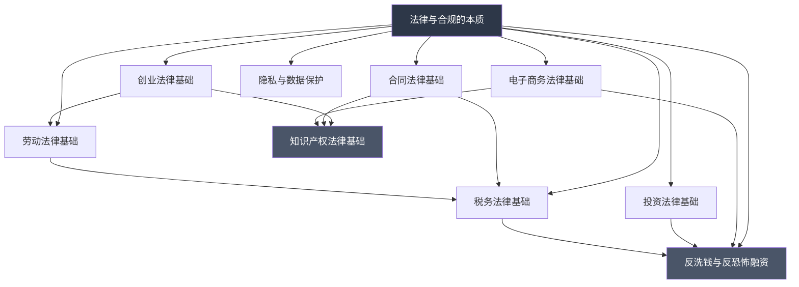

## 九、本节总结

### 9.1 理论基础全景回顾

本节从十个维度系统梳理了个人在"搞钱"过程中必须掌握的法律与合规知识。这些知识并非孤立存在，而是构成了一个完整的法律风险防控体系。下图展示了各知识模块之间的逻辑关系：



### 9.2 十大知识模块核心要点

#### 9.2.1 法律与合规的本质

法律是搞钱活动的底线框架，合规是可持续发展的前提。核心认知：

- **法律三层次**：民事责任（赔偿）、行政责任（罚款/吊照）、刑事责任（拘役/判刑），层层递进，后果越来越严重
- **合规的价值**：不仅是"不犯法"，更是建立商业信誉、获得合作机会的基础
- **风险评估思维**：任何搞钱行为启动前，先做法律风险评估——识别风险类型、评估风险等级、制定应对策略

关键行动：建立"先查法、再动手"的习惯，在创业、投资、税务、劳动、隐私五大领域建立基本法律意识。

#### 9.2.2 创业法律基础

创业是法律风险最密集的搞钱方式，涉及公司法、合伙企业法、税法、劳动法等多个法律领域。

- **企业组织形式选择**：个体工商户（简单但无限责任）、有限责任公司（最常用，股东以出资额为限担责）、合伙企业（适合专业服务类）、股份有限公司（适合大规模融资）
- **公司注册合规**：名称核准→工商登记→税务登记→银行开户→社保登记，每一步都有法律要求
- **股权架构设计**：创始人控制权保障（67%绝对控制、51%相对控制、34%一票否决）、股权激励的法律安排、代持协议的法律风险
- **合规经营要素**：经营范围不能超出登记范围、法定代表人的法律责任、公司人格混同风险（个人账户与公司账户不分）

#### 9.2.3 合同法律基础

合同是所有商业活动的法律载体，"口说无凭，立字为据"是基本准则。

- **合同生效要件**：当事人有相应民事行为能力、意思表示真实、不违反法律强制性规定和公序良俗
- **核心条款清单**：当事人信息、标的物/服务描述、数量与质量、价款与支付方式、履行期限与地点、违约责任、争议解决方式（仲裁或诉讼）、不可抗力条款
- **常见合同陷阱**：阴阳合同（法律风险极高）、模糊条款（日后争议的根源）、单方面免责条款（可能被认定无效）、违约金过高或过低（法院可调整）
- **电子合同效力**：根据《电子签名法》，可靠的电子签名与手写签名具有同等法律效力

#### 9.2.4 知识产权法律基础

知识产权是无形资产，保护创新成果、品牌价值和商业秘密。

- **四大类型**：
  - **著作权（版权）**：自动取得，保护文学、艺术、科学作品，包括软件著作权
  - **专利权**：需申请授权，保护发明创造（发明专利20年、实用新型10年、外观设计15年）
  - **商标权**：需注册取得，保护品牌标识，有效期10年可续展
  - **商业秘密**：需采取保密措施，保护技术信息和经营信息
- **搞钱场景中的知识产权风险**：副业创作的版权归属（注意劳动合同中的知识产权条款）、使用他人素材的侵权风险、品牌命名的商标冲突、技术方案的专利侵权
- **保护策略**：创作完成即保留证据（时间戳、邮件自存）、核心品牌及时注册商标、技术方案评估是否申请专利、与合作方签订知识产权归属协议

#### 9.2.5 投资法律基础

投资活动受《证券法》《基金法》《期货和衍生品法》等多部法律监管。

- **投资者适当性制度**：不同投资产品对投资者有不同门槛要求（如私募基金要求合格投资者：金融资产不低于300万元或近三年年均收入不低于50万元）
- **证券市场红线**：
  - 内幕交易：利用未公开信息交易，罚款违法所得1-5倍，情节严重追究刑事责任
  - 操纵市场：通过虚假交易影响证券价格，最高可处10年有期徒刑
  - 短线交易：上市公司董监高及持股5%以上股东，6个月内买卖本公司股票的收益归公司所有
- **非法集资识别特征**：未经批准、公开宣传、承诺回报、向不特定对象吸收资金。记住"四看三思等一夜"原则
- **民间借贷法律边界**：年利率超过LPR四倍的部分不受法律保护（2024年约为13.8%）、砍头息违法、套路贷涉嫌刑事犯罪

#### 9.2.6 税务法律基础

税务合规是每个搞钱人的必修课，"合理避税"与"偷税漏税"只有一线之隔。

- **个人所得税综合所得**：工资薪金、劳务报酬、稿酬、特许权使用费四项合并计税，税率3%-45%七级超额累进
- **经营所得**：个体工商户、个人独资企业等适用5%-35%五级超额累进税率
- **常见税前扣除项**：专项附加扣除（子女教育、继续教育、大病医疗、住房贷款利息、住房租金、赡养老人、3岁以下婴幼儿照护）
- **偷税与避税的法律边界**：
  - 合法节税：利用税收优惠政策、合理安排收入结构、充分利用扣除项
  - 违法偷税：隐匿收入、虚列支出、虚假申报、骗取退税
  - 法律后果：补缴税款+滞纳金（日万分之五）+罚款（0.5-5倍），构成逃税罪的处3-7年有期徒刑
- **发票管理**：虚开增值税发票是重罪，最高可判无期徒刑；即使是"帮忙开票"也构成犯罪

#### 9.2.7 劳动法律基础

无论是作为雇主还是雇员，劳动法律知识都直接关系到切身利益。

- **劳动合同必备条款**：用人单位信息、劳动者信息、合同期限、工作内容与地点、工作时间与休假、劳动报酬、社会保险、劳动保护与劳动条件
- **试用期法律规定**：合同期限3个月以上不满1年，试用期不超过1个月；1年以上不满3年，不超过2个月；3年以上及无固定期限，不超过6个月
- **经济补偿金计算**：每工作满1年支付1个月工资，6个月以上不满1年按1年计算，不满6个月支付半个月工资。月工资高于当地社平工资3倍的，按3倍计算且最高不超过12年
- **竞业限制**：限于高级管理人员、高级技术人员和其他负保密义务的人员；期限不超过2年；用人单位须按月支付经济补偿（一般不低于离职前12个月平均工资的30%）
- **副业与劳动法的关系**：需审查劳动合同中是否有竞业限制或兼职禁止条款；利用工作时间或单位资源做副业可能构成违约；副业收入同样需要依法纳税

#### 9.2.8 隐私与数据保护

《个人信息保护法》《数据安全法》《网络安全法》构成了数据保护的三驾马车。

- **个人信息处理原则**：合法正当必要、目的明确、最小必要、公开透明、准确完整、安全保障
- **敏感个人信息**：生物识别、宗教信仰、特定身份、医疗健康、金融账户、行踪轨迹等，处理敏感信息须取得单独同意
- **搞钱场景中的数据合规**：
  - 电商经营：收集客户信息需告知目的、方式和范围，不得过度收集
  - 内容创作：使用他人肖像、姓名需取得授权
  - 数据分析：使用爬虫采集数据不得侵犯他人合法权益
  - 跨境传输：向境外提供个人信息须通过安全评估或取得个人单独同意
- **违规后果**：情节严重的，处5000万元以下或上一年度营业额5%以下罚款，并可责令暂停业务、吊销营业执照

#### 9.2.9 电子商务法律基础

《电子商务法》规范了所有通过互联网等信息网络销售商品或提供服务的经营活动。

- **电商经营者义务**：办理市场主体登记（个人销售自产农副产品等除外）、依法纳税、亮照经营、保障消费者知情权和选择权
- **平台责任**：对平台内经营者身份进行核验和登记、对关系消费者生命健康的商品或服务未尽到审核义务的承担相应责任
- **消费者权益保护**：七天无理由退货（定制商品、鲜活易腐等除外）、个人信息保护、不得以虚假宣传误导消费者
- **跨境电商合规**：海关申报、关税缴纳、检验检疫、产品标识中文标注要求
- **直播带货法律风险**：主播的广告代言人责任、虚假宣传的法律后果、产品质量连带责任

#### 9.2.10 反洗钱与反恐怖融资

《反洗钱法》要求金融机构和特定非金融机构履行反洗钱义务，个人也受到直接影响。

- **大额交易报告标准**：个人单笔现金交易人民币5万元以上或外币等值1万美元以上、个人单笔转账人民币20万元以上或外币等值1万美元以上
- **可疑交易识别**：短期内频繁开户销户、与身份不符的大额交易、资金快进快出（过渡账户特征）、多人向同一账户集中转入分散转出
- **个人被冻结账户的应对**：配合金融机构进行身份核实、提供资金来源合法证明、必要时向反洗钱部门申诉
- **对搞钱人的实际影响**：正常使用银行卡不会触发反洗钱预警；但频繁的大额现金交易、多账户间频繁互转、帮他人"走账"等行为可能被监测和报告；出借银行卡帮他人转移资金可能构成洗钱罪

### 9.3 跨模块知识关联图

在实际搞钱活动中，法律问题往往不是单一模块的，而是多模块交叉。以下是典型场景的法律关联：

| 搞钱场景 | 涉及法律模块 | 典型风险 |
|----------|-------------|----------|
| 注册公司做副业 | 创业+合同+税务+劳动 | 股权纠纷、合同违约、税务违规、违反竞业限制 |
| 线上开店卖货 | 电商+知识产权+隐私+税务 | 商标侵权、虚假宣传、数据泄露、偷逃税款 |
| 自媒体内容变现 | 知识产权+电商+税务+广告法 | 版权纠纷、软文违规、收入未申报 |
| 股票/基金投资 | 投资+反洗钱+税务 | 内幕交易、异常交易监控、资本利得税 |
| 技术外包接单 | 合同+知识产权+税务+劳动 | 知识产权归属争议、发票问题、竞业限制 |
| 跨境电商 | 电商+税务+反洗钱+隐私 | 海关申报、转移定价、外汇合规、跨境数据传输 |

### 9.4 法律合规能力自评清单

完成理论基础学习后，用以下清单评估自己的法律合规能力：

**基础认知层（必须掌握）**：

- [ ] 能区分民事责任、行政责任和刑事责任的适用场景
- [ ] 了解自己从事的搞钱活动涉及哪些法律法规
- [ ] 知道什么情况下必须咨询专业律师
- [ ] 理解"合理避税"与"偷税漏税"的法律边界

**合同与协议层（核心技能）**：

- [ ] 能独立审查常见商业合同的核心条款
- [ ] 知道合同中哪些条款可能无效或可撤销
- [ ] 了解电子合同的法律效力和签署要求
- [ ] 能识别合同中的常见陷阱和模糊条款

**知识产权层（保护能力）**：

- [ ] 了解著作权、专利权、商标权的区别和取得方式
- [ ] 知道自己的创作成果如何进行法律保护
- [ ] 能识别常见的知识产权侵权行为
- [ ] 了解劳动合同中的知识产权归属条款

**税务合规层（必备技能）**：

- [ ] 了解个人所得税的计算方式和申报流程
- [ ] 知道哪些收入需要缴税、如何申报
- [ ] 了解专项附加扣除的具体项目和标准
- [ ] 能区分合法节税和违法偷税

**数据与隐私层（时代要求）**：

- [ ] 了解《个人信息保护法》对个人和企业的基本要求
- [ ] 知道收集、使用他人个人信息的合规要求
- [ ] 了解数据泄露的法律后果和应急处理流程
- [ ] 能评估自己业务中的数据合规风险

**投资与金融层（风险意识）**：

- [ ] 能识别非法集资的基本特征
- [ ] 了解证券市场的法律红线（内幕交易、操纵市场）
- [ ] 知道反洗钱对个人的直接影响
- [ ] 了解民间借贷的法律保护边界

### 9.5 从理论到实践的行动指南

理论学习的最终目的是指导实践。以下是将本节知识转化为行动的建议：

**第一步：建立法律合规档案（1-2天）**

整理自己所有正在从事或计划从事的搞钱活动，逐一对照十大法律模块进行风险标注。建议用表格形式记录：

```text
活动名称 | 涉及法律模块 | 风险等级 | 当前合规状态 | 需要采取的行动
---------|-------------|---------|-------------|---------------
XX副业   | 创业+税务+劳动 | 中     | 未注册       | 咨询是否需要市场主体登记
XX投资   | 投资+税务      | 低     | 已合规       | 定期自查
```

**第二步：解决最紧迫的问题（1-2周）**

根据风险等级排序，优先处理高风险项。典型的紧迫问题包括：

- 劳动合同中的竞业限制条款是否影响当前副业
- 副业收入是否需要纳税申报
- 使用的素材、字体是否存在侵权风险
- 收集的客户信息是否符合隐私保护要求

**第三步：建立长期合规机制（持续）**

- 每季度进行一次法律合规自查
- 关注相关法律法规的更新（可通过国家法律法规数据库 flk.npc.gov.cn 查询）
- 重大商业决策前咨询专业律师
- 保留所有商业活动的书面记录和电子证据

### 9.6 常见法律认知误区纠正

| 误区 | 正确认知 | 法律依据 |
|------|---------|---------|
| "口头协议不算数" | 口头合同同样具有法律效力，但举证困难 | 《民法典》第469条 |
| "小规模不用交税" | 纳税义务与规模无关，只与是否达到起征点有关 | 《个人所得税法》 |
| "网上图片都能用" | 未经授权使用他人图片构成著作权侵权 | 《著作权法》 |
| "个人不用管反洗钱" | 异常个人交易同样会被监测和报告 | 《反洗钱法》 |
| "注册公司就能少交税" | 公司有增值税、企业所得税等额外税负 | 《税收征收管理法》 |
| "竞业限制自动生效" | 需在合同中明确约定且用人单位需支付补偿金 | 《劳动合同法》第23-24条 |
| "自己开发的APP全部归自己" | 需看是否利用了单位资源或工作时间 | 《专利法》第6条 |
| "借朋友银行卡走账没事" | 可能构成洗钱罪或帮助信息网络犯罪活动罪 | 《刑法》第191条、第287条之二 |

### 9.7 进阶学习路径

对于希望深入研究法律合规知识的读者，推荐以下学习路径：

**入门级（1-3个月）**：
- 阅读《民法典》合同编、侵权责任编的重点条文
- 学习《个人所得税法》及实施条例
- 了解《消费者权益保护法》核心条款
- 关注"中国普法"等官方普法账号

**进阶级（3-6个月）**：
- 系统学习《公司法》《合伙企业法》
- 深入研究《电子商务法》及配套规定
- 学习《反不正当竞争法》《广告法》
- 参加法律职业资格考试的相关课程（不一定要考证，但可以系统学习）

**专业级（持续精进）**：
- 关注最高人民法院的指导案例和典型案例
- 学习行业特定法规（如金融科技领域的监管规定）
- 建立律师资源网络，遇到问题能快速获得专业支持
- 定期参加法律合规培训和研讨会

### 9.8 核心原则总结

回顾整个理论基础部分，有三条贯穿始终的核心原则：

**第一，预防优于补救**。法律风险的事前预防成本远低于事后补救。一份几百元的合同审查，可能避免几十万元的损失；一次合规自查，可能避免行政处罚和刑事责任。

**第二，底线思维优先**。在搞钱过程中，收益的追求没有上限，但法律底线不可触碰。宁可少赚一点，也不能踩法律红线。一旦涉及刑事责任，所有收益都会化为乌有，甚至面临牢狱之灾。

**第三，专业的事交给专业的人**。法律知识可以帮助你识别风险、做出初步判断，但重大法律决策（如公司设立、股权设计、重大合同签订、税务筹划方案）一定要咨询专业律师。律师费不是成本，而是投资。

理论基础的学习到此结束。接下来的"核心技巧"部分，将把这些法律知识转化为可操作的实战方法，帮助你在具体的搞钱场景中做好法律合规工作。
