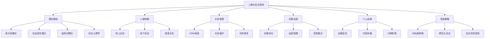
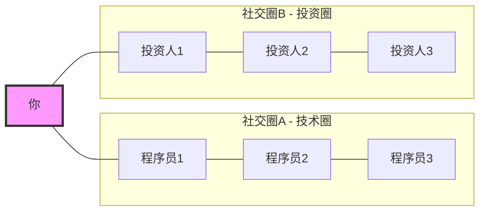
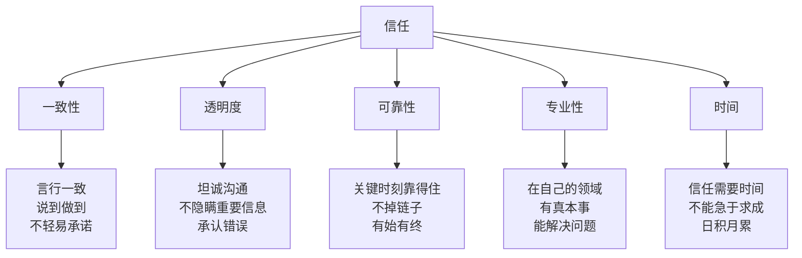
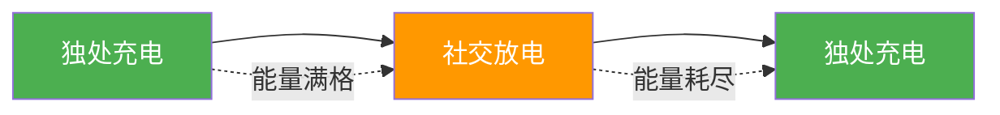
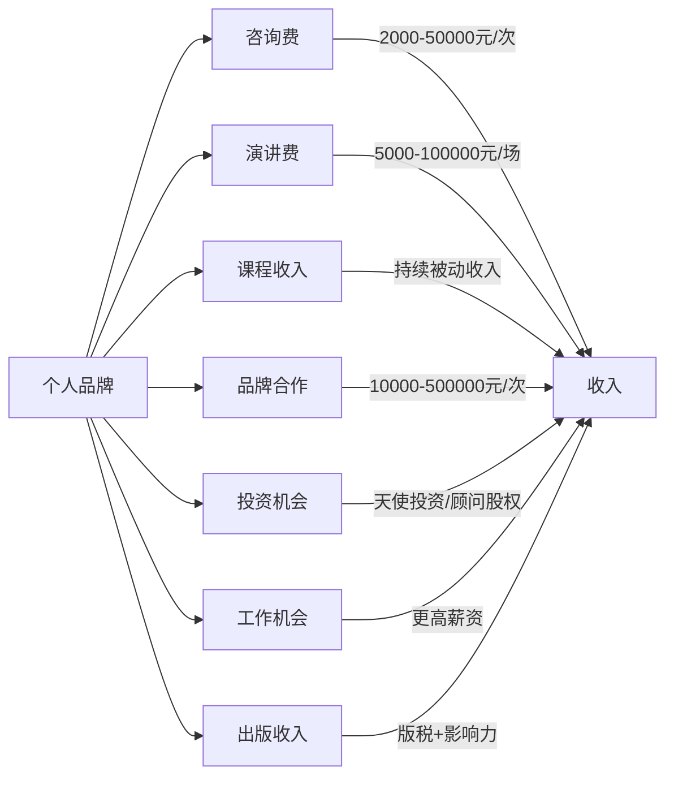

# 第十六章：人脉与社交资本

> "你的网络就是你的净资产。" —— 波特·盖尔

在搞钱的道路上，很多人只关注"钱生钱"的技术，却忽略了一个关键的财富杠杆——人脉与社交资本。事实上，一个人的收入水平与其社交网络的质量和广度高度相关。斯坦福大学教授马克·格兰诺维特（Mark Granovetter）的经典研究《找工作》（Getting a Job）发现，超过80%的工作机会是通过人际关系获得的，其中大部分来自"弱关系"——那些你不太熟悉的人。

本章将从社交资本的理论基础、人脉构建方法、关系管理系统、社群运营、个人品牌建设、高级网络策略六个维度，帮助你系统地构建和运用社交资本，为搞钱之路注入强大的"关系引擎"。

***

## 16.1 人脉的理论基础

### 16.1.1 人脉的本质：价值交换网络

很多人对"人脉"有误解，认为人脉就是"认识很多人"或者"加了很多微信好友"。实际上，**人脉的本质是价值交换网络**。你的人脉质量不取决于你认识多少人，而取决于你能为多少人提供价值，以及多少人愿意为你提供价值。

**社会交换理论**（Social Exchange Theory）由彼得·布劳（Peter Blau）在1964年提出，其核心观点是：人际关系建立在成本-收益分析之上。当一段关系的收益（情感支持、信息、资源）大于成本（时间、精力、情感负担）时，关系就会维持和发展；反之则会衰退。理解这一点不是要你变得功利，而是要你认识到：**可持续的关系一定是有价值流动的**。

**人脉的三层结构**：

| 层级 | 人数 | 关系特征 | 信任程度 | 互动频率 | 典型关系 |
|------|------|----------|----------|----------|----------|
| 核心层 | 5-15人 | 深度信任，愿意无条件支持 | 极高 | 每周至少1次 | 挚友、家人、长期合伙人 |
| 中间层 | 50-150人 | 有定期互动，互相认可 | 中等 | 每月1-3次 | 同事、同行、业务伙伴 |
| 外围层 | 500-1500人 | 弱连接，偶尔联系 | 低 | 几个月1次 | 社交媒体联系人、点头之交 |

根据邓巴数（Dunbar's Number），人类能够维持稳定社交关系的上限约为150人。英国人类学家罗宾·邓巴通过研究灵长类动物的新皮层大小与群体规模的关系，推算出人类的认知极限。这意味着你不可能和所有人都建立深度关系，必须有策略地分配社交精力。

**关键认知**：你不需要成为"社交达人"，但你需要在核心层和中间层建立高质量的关系。与其广撒网，不如深耕几个关键关系。

### 16.1.2 弱关系的力量

马克·格兰诺维特在1973年发表的论文《弱关系的力量》（The Strength of Weak Ties）是社会学领域最具影响力的论文之一。他的研究发现了一个反直觉的现象：

- **强关系**（亲密朋友、家人）：提供情感支持，但信息同质化严重——你和你的亲密朋友知道的事情大概率是相同的
- **弱关系**（不太熟悉的人）：连接不同的社交圈，带来你不知道的新信息和机会

**为什么弱关系更重要？**

1. **信息桥梁作用**：弱关系连接着你与不同的社交圈，能够传递你不知道的信息和机会。你的亲密朋友知道的招聘信息，你大概率也知道；但一个半年没联系的前同事告诉你的内部消息，可能是一个全新的机会
2. **打破信息茧房**：强关系往往与你有相似的背景和认知，弱关系能够拓宽你的视野，让你接触到不同的思维方式和商业模式
3. **机会来源**：LinkedIn 2023年的数据显示，85%的工作岗位是通过人脉关系填补的，其中弱关系贡献了大部分

**弱关系的激活策略**：

弱关系需要定期"激活"才能保持活力。以下是具体方法：

1. **节日问候**：春节、中秋等节日发送个性化的祝福（不是群发模板）
2. **内容分享**：看到对方可能感兴趣的文章或信息，主动分享并附上简短评论
3. **社交动态互动**：在朋友圈、LinkedIn上给对方的动态点赞、评论
4. **信息中转**：当你遇到可能对对方有价值的信息时，主动传递
5. **牵线搭桥**：当两个人脉可能互相有价值时，主动介绍他们认识

**案例**：小王是一名程序员，在一次技术meetup上认识了一位产品经理，交换了微信后偶尔在朋友圈互动。半年后，这位产品经理跳槽到一家创业公司，正好需要外包开发，第一时间想到了小王。这个项目不仅给小王带来了10万元的收入，还让他积累了创业公司的开发经验，最终走上了独立开发者的道路。关键不在于那次meetup，而在于之后半年里保持的微弱但持续的联系。

### 16.1.3 社会资本理论：纽带型 vs 桥接型

哈佛大学政治学家罗伯特·帕特南（Robert Putnam）在《独自打保龄》（Bowling Alone）中提出了社会资本的两种类型：

| 类型 | 纽带型社会资本（Bonding） | 桥接型社会资本（Bridging） |
|------|--------------------------|--------------------------|
| 定义 | 同质群体内部的紧密联系 | 异质群体之间的松散联系 |
| 特征 | 深度信任、强情感支持 | 广度信息、新机会 |
| 类比 | "入室抢劫时帮你挡子弹的人" | "给你介绍工作机会的人" |
| 价值 | 情感支持、资源互助、身份认同 | 信息获取、视野拓宽、机会发现 |
| 风险 | 群体思维、排斥外部信息 | 关系脆弱、信任建立慢 |
| 建设方法 | 深度交流、共同经历、长期承诺 | 参加多样化活动、跨领域社交 |

**搞钱启示**：你需要同时建设两种社会资本。纽带型给你安全感和深度支持，桥接型给你信息和机会。很多人的问题是只建设了一种——要么只有几个铁哥们但信息闭塞，要么认识很多人但没有深度关系。

### 16.1.4 结构洞理论：站在信息枢纽上

芝加哥大学社会学家罗纳德·伯特（Ronald Burt）提出的**结构洞理论**（Structural Holes Theory）是理解人脉价值的关键理论。

结构洞是指两个不相连的社交圈之间的空白地带。站在结构洞上的人，能够获取两个圈子的信息和资源，具有信息优势和控制优势。

**结构洞的价值**：

在上图中，"你"站在技术圈和投资圈之间的结构洞上。你既知道技术圈的最新动态，也知道投资圈的资金流向。当技术圈有人有好项目需要融资，或者投资圈有人在寻找技术项目时，你就是那个关键的连接者。

**如何找到和利用结构洞**：

1. **识别断层**：观察你所在的行业，哪些群体之间缺乏连接？比如技术与商业、传统行业与互联网、国内与海外
2. **桥接断层**：主动成为这些群体之间的连接者。参加跨领域的活动，学习不同领域的语言
3. **维护中立**：作为桥梁，你需要保持相对中立的立场，不能完全偏向任何一方
4. **创造价值**：不是简单地"认识两边的人"，而是要能为两边创造实际价值——介绍合作、传递信息、撮合交易

### 16.1.5 社交心理学：影响人际关系的底层机制

理解社交心理学的底层机制，能够让你在社交中更加游刃有余。罗伯特·西奥迪尼（Robert Cialdini）在《影响力》中总结了六大影响力原则，它们在人脉经营中同样适用：

**1. 互惠原则（Reciprocity）**

人类有一种强烈的"回报"倾向。当你为别人提供了价值，对方会自然地想要回报你。这不是功利，而是人类社会的基本运作机制。

实操应用：
- 主动帮助别人，不求即时回报
- 分享有价值的信息和资源
- 在别人需要时伸出援手
- 记住别人帮过你的忙，在合适时回报

**2. 承诺与一致性（Commitment & Consistency）**

人们倾向于保持言行一致。当你公开承诺要做某件事时，你会更有动力去完成它。

实操应用：
- 在社交场合公开表达你的目标和承诺
- 请别人监督你的进展
- 从小承诺开始，逐步建立信任

**3. 社会认同（Social Proof）**

人们倾向于参考他人的行为来决定自己的行为。当你看到很多人都在做某件事时，你会更倾向于参与。

实操应用：
- 展示你的社交证明（客户评价、合作案例、媒体报道）
- 利用"圈子效应"——人们更愿意加入已有高质量成员的社群
- 在社交中提及共同认识的人，增加信任感

**4. 喜好原则（Liking）**

人们更容易被自己喜欢的人影响。喜好来自相似性、赞美、合作和熟悉感。

实操应用：
- 寻找与对方的共同点（同乡、校友、共同爱好）
- 真诚地赞美对方的优点和成就
- 创造合作机会，建立共同经历
- 保持定期互动，增加熟悉感

**5. 权威原则（Authority）**

人们倾向于信任和服从权威人物。专业能力和头衔是建立权威的两大来源。

实操应用：
- 持续提升专业能力，成为领域专家
- 积累专业头衔和认证
- 发表专业内容，建立行业影响力
- 引用权威数据和研究来支持你的观点

**6. 稀缺原则（Scarcity）**

人们对稀缺的东西赋予更高的价值。当机会有限时，人们会更积极地争取。

实操应用：
- 不要让自己显得太"廉价"——不是所有社交邀请都要接受
- 创造独家价值——提供别人无法轻易获取的信息或资源
- 限定名额——社群招生、咨询服务可以限制人数

***

## 16.2 人脉构建方法

### 16.2.1 线上社交

在数字化时代，线上社交是构建人脉的重要渠道。但线上社交不是简单地"加好友"，而是有策略地建立和维护关系。

**社交媒体运营**

**领英（LinkedIn）**——全球最大的职场社交平台：

| 操作 | 具体做法 | 预期效果 |
|------|----------|----------|
| 完善资料 | 头像用专业照，标题写清核心价值主张，经历部分用数据量化成果 | 提高被搜索到的概率，给人专业第一印象 |
| 内容发布 | 每周2-3篇行业见解，用"观点+案例+结论"的结构 | 建立专业形象，吸引同行关注 |
| 主动连接 | 每周添加5-10位目标行业人士，附上个性化邀请语 | 稳步扩大职业网络 |
| 群组参与 | 加入3-5个行业群组，每周参与1-2次讨论 | 增加曝光，结识同行 |
| 推荐与背书 | 主动为优质联系人写推荐，换取对方的推荐 | 增强社交证明 |

**微信**——中国最核心的社交工具：

微信在中国的人脉经营中扮演着核心角色。以下是具体策略：

1. **朋友圈经营**：
   - 专业内容占比60%（行业洞察、工作成果、学习心得）
   - 生活内容占比30%（展示真实的生活状态，让人觉得你是个"活人"）
   - 转发互动占比10%（为朋友的内容点赞评论）
   - 发布频率：每天1-2条，不要刷屏

2. **微信群策略**：
   - 加入3-5个高质量行业群，退出无价值的群
   - 在群里定期输出有价值的内容
   - 主动回答别人的问题，建立专业形象
   - 避免在群里发广告或无意义的闲聊

3. **一对一沟通**：
   - 重要联系人定期私聊，不总是群发消息
   - 沟通时提供具体价值，不要只说"在吗"
   - 记住对方的重要日期（生日、入职纪念日等）

**脉脉**——中国版的职场社交平台：

脉脉的匿名功能让它成为了解行业真实情况的窗口。策略如下：
- 完善职场档案，突出职业成就
- 参与行业圈子的深度讨论
- 利用"职言"板块了解行业真实动态
- 通过"找人"功能精准连接目标人脉

**专业社群参与**

| 社群类型 | 代表平台 | 适合人群 | 加入策略 |
|----------|----------|----------|----------|
| 付费知识社群 | 知识星球、小报童 | 希望深度学习的人 | 选择与你领域相关的高评价社群，先潜水学习再积极参与 |
| 行业论坛 | 雪球（投资）、掘金（技术）、站酷（设计） | 行业从业者 | 坚持输出高质量内容，成为论坛的意见领袖 |
| 在线课程社群 | 极客时间、得到 | 终身学习者 | 在课程社群中主动分享学习笔记和心得 |
| 开源社区 | GitHub、GitLab | 技术人员 | 贡献代码、提Issue、写文档，建立技术声誉 |
| 创业社群 | 36氪、创业邦 | 创业者 | 参加线上线下活动，主动分享创业经验 |

**知识分享与输出**

知识分享是线上社交中建立影响力最有效的方式。它不是"炫耀"，而是"通过输出倒逼输入，通过分享建立连接"。

1. **写作**：
   - 平台选择：知乎（深度长文）、公众号（私域运营）、头条号（流量获取）
   - 内容策略：每周至少1篇深度文章，用"问题→分析→方案→案例"的结构
   - 标题技巧：数字+痛点+解决方案，如"3个方法帮你解决XX问题"
   - 互动维护：认真回复每一条评论，与读者建立连接

2. **视频**：
   - 平台选择：B站（长视频深度内容）、抖音（短视频快速传播）
   - 内容策略：将文字内容转化为视频，降低创作门槛
   - 制作建议：先用手机录制，不需要专业设备，内容比形式更重要

3. **直播**：
   - 定期举办专业主题的直播分享
   - 准备好大纲，但保持一定的即兴互动
   - 直播后将精华内容剪辑成短视频二次传播

4. **播客**：
   - 适合深度内容，听众粘性高
   - 可以邀请行业嘉宾对谈，一举两得（内容+人脉）
   - 平台：小宇宙、喜马拉雅、Apple Podcasts

**案例**：小李是一名数据分析师，他坚持在知乎上分享数据分析的实战案例和学习心得，每周2篇，雷打不动。一年后，他积累了5万粉丝，收到了多家公司的offer邀请，还获得了多个付费咨询的机会。更重要的是，他通过知乎认识了行业内的多位专家，这些人脉为他后来的职业发展提供了重要支持。他的秘诀是：**不追热点，只写自己真正做过的东西，用真实数据和案例说话**。

### 16.2.2 线下社交

虽然线上社交越来越重要，但线下社交仍然是建立深度关系的最佳方式。面对面的交流能够传递线上无法替代的信息——肢体语言、微表情、气场、握手的力度。

**行业会议与论坛**

选择标准：
- 与你的专业领域直接相关，或者在你的"结构洞"位置的另一侧
- 有高质量的演讲嘉宾（他们的水平决定了参会者的水平）
- 有足够的社交时间（茶歇、晚宴、after party）
- 规模适中（100-500人，太小没有多样性，太大难以深入交流）

参与策略：

| 阶段 | 时间 | 具体行动 |
|------|------|----------|
| 会前准备 | 前1周 | 研究议程和嘉宾，确定3-5个想认识的目标人物，准备30秒自我介绍 |
| 第一天 | 会议当天 | 主动坐在陌生人旁边，利用茶歇时间交换名片，午餐找不认识的人同桌 |
| 晚间社交 | 晚宴/after party | 这是建立深度关系的最佳时机，放松状态下更容易建立真实连接 |
| 会后跟进 | 后1-3天 | 给新认识的人发消息，提及你们聊过的具体内容，提出具体的下一步 |

**自我介绍模板**：

一个好的自我介绍应该包含三个要素：你是谁、你做什么、你能提供什么价值。

> "你好，我是[名字]，在[公司/领域]做[具体工作]。我最近在研究[具体方向]，发现[一个有意思的洞察]。你是做什么的？"

关键技巧：
- 不要一上来就递名片，先聊天建立连接
- 问开放式问题，让对方多说
- 找到共同点后深入聊，不要蜻蜓点水
- 记住对方的名字和关键信息

**线下社交场景选择**

| 场景 | 优势 | 适合人群 | 注意事项 |
|------|------|----------|----------|
| 行业峰会 | 信息密度高，人脉质量高 | 有明确行业方向的人 | 提前做好功课，不要盲目参会 |
| 创业活动 | 结识创业者和投资人 | 有创业意向的人 | 准备好你的项目简介 |
| 技术meetup | 深度技术交流，同行认可 | 技术人员 | 带着问题去，主动分享经验 |
| 校友活动 | 天然的信任基础 | 有名校背景的人 | 校友身份是敲门砖，但不能只靠它 |
| 运动俱乐部 | 在运动中建立真实关系 | 所有人 | 运动状态下的交流更真实自然 |
| 读书会 | 展示思考深度，找到同频的人 | 喜欢阅读的人 | 提前读完书，准备独到的见解 |
| 商务饭局 | 中国式社交的核心场景 | 商务人士 | 注意座次、敬酒、话题选择 |

**商务饭局的社交技巧**：

在中国的商业环境中，饭局是建立信任和关系的重要场景。以下是一些实用技巧：

1. **座次礼仪**：主位对着门，主客坐主位右侧，副客坐左侧。如果你是主人，安排好座位；如果你是客人，等主人安排
2. **话题选择**：先聊轻松的话题（美食、旅行、运动），饭过三巡后再谈正事
3. **敬酒技巧**：主动敬酒但不要强灌，碰杯时杯沿低于对方表示尊重
4. **买单规则**：谁邀请谁买单。如果你是被邀请的，可以主动提出AA或者下次回请
5. **饭后跟进**：第二天发一条消息，感谢对方的款待，提及你们聊过的话题

### 16.2.3 深度关系的构建与维护

深度关系是人脉网络的核心，它需要时间和精力来培养。

**寻找导师**

导师是你职业发展中的重要引路人。一个好的导师能够在关键时刻给你方向性的指导，帮你避免走弯路。

导师的类型与价值：

| 导师类型 | 提供的价值 | 寻找渠道 | 维护方式 |
|----------|-----------|----------|----------|
| 技术导师 | 专业技能提升、技术方向判断 | 技术社区、开源项目、公司内部 | 定期技术交流，请教具体问题 |
| 职业导师 | 职业规划、行业洞察、机会推荐 | 校友网络、行业活动、LinkedIn | 定期汇报进展，征求意见 |
| 创业导师 | 商业模式、融资策略、资源对接 | 创业社群、孵化器、投资人介绍 | 分享创业进展，请求指点 |
| 人生导师 | 价值观、人生选择、心态调整 | 长辈、前领导、行业前辈 | 真诚交流，不只谈工作 |

**如何找到并维护导师关系**：

1. **明确需求**：先想清楚你需要什么类型的导师，以及你希望从导师那里获得什么
2. **寻找目标**：在你敬佩的前辈中，找3-5位作为潜在导师
3. **创造接触机会**：通过活动、社交媒体、共同朋友等方式建立初步联系
4. **提供价值先行**：在请求指导之前，先为对方提供价值——帮忙整理资料、分享行业信息、协助项目
5. **正式请求**：在建立一定信任后，诚恳地请求对方成为你的导师，明确你希望获得的指导内容和频率
6. **尊重时间**：每次交流前准备好问题，控制好时间，不要让导师觉得在浪费时间
7. **汇报进展**：定期向导师汇报你的进展和成果，让导师看到他的指导产生了效果

**建立信任的五个维度**

信任是深度关系的基础。信任的建立不是一蹴而就的，而是通过一系列小的互动逐步积累的。

**信任修复**：当信任被打破时，修复它需要以下步骤：

1. **承认错误**：不要找借口，直接承认问题
2. **真诚道歉**：表达你的歉意，说明你理解对方的感受
3. **说明原因**：解释发生了什么（不是为自己开脱，而是让对方理解）
4. **提出补救**：说明你将如何弥补和防止再次发生
5. **用行动证明**：最重要的是后续的行动，用持续的表现重建信任

**互惠互利的实践**

健康的人脉关系是互惠互利的。但"互惠"不是"交易"——不是你帮我一次，我就必须马上帮你一次。互惠是一种长期的、不计较即时回报的价值流动。

**如何成为"给予者"**：

1. **信息给予**：分享有价值的行业信息、学习资源、工作机会
2. **连接给予**：为可能互相受益的人牵线搭桥
3. **技能给予**：用你的专业技能帮助别人解决问题
4. **情感给予**：在别人遇到困难时提供情感支持和鼓励
5. **机会给予**：当你遇到好机会时，想到可能适合的人

**案例**：小张是一名产品经理，他在一次行业会议上认识了一位投资人。会后，小张没有直接请求什么，而是花了两天时间写了一份详细的行业分析报告发给投资人，分析了三个他观察到的市场机会。投资人很欣赏小张的分析能力和主动付出的精神，开始定期与他交流行业见解。小张每次交流都会提前准备，分享自己的新观察。一年后，当投资人准备投资一个产品项目时，第一时间想到了小张，邀请他担任产品顾问。这个机会不仅给小张带来了丰厚的顾问费，还让他积累了创业公司的经验。

### 16.2.4 社交焦虑的应对

很多人不是不知道社交的重要性，而是被社交焦虑所阻碍。这很正常——根据研究，约40%的人认为自己是内向者，社交对他们来说是一种消耗而非充电。

**内向者的社交优势**：

内向者在社交中并非劣势，反而有一些独特的优势：

| 优势 | 说明 | 如何发挥 |
|------|------|----------|
| 深度倾听 | 内向者更善于倾听，能让对方感到被重视 | 在社交中多问问题，让对方多说 |
| 深度思考 | 内向者倾向于深度思考，能提供有见地的观点 | 在社交中分享你的深度分析 |
| 真诚关系 | 内向者不善于"表演"，反而更容易建立真实的关系 | 保持真实，不要强迫自己变得外向 |
| 一对一交流 | 内向者在一对一的深度交流中表现出色 | 选择小规模、高质量的社交场景 |

**社交焦虑的应对策略**：

1. **提前准备**：社交焦虑很大程度上来自不确定性。提前准备自我介绍、话题清单、提问清单，能够大大降低焦虑
2. **设定小目标**：不要给自己设定"要在活动上认识20个人"的目标，而是"和3个人进行深入交流"
3. **关注对方**：把注意力从"别人怎么看我"转移到"我能从对方身上学到什么"，焦虑会大大减轻
4. **接受不完美**：不是每次社交都要完美，允许自己紧张、说错话、冷场
5. **事后复盘**：每次社交后回顾一下做得好的地方和可以改进的地方，逐步提升
6. **能量管理**：内向者需要独处来恢复能量，社交活动前后安排独处时间

**社交能量管理模型**：

内向者的社交节奏：社交活动前独处30分钟充电 → 参加社交活动 → 活动后独处恢复。不要连续参加多个社交活动，给自己留出恢复时间。

***

## 16.3 关系管理系统

### 16.3.1 人脉CRM：系统化管理你的关系

很多人的人脉经营是"随机"的——想到谁就联系谁，忘了就忘了。这种方式在关系少的时候还能应付，但当你的关系网络扩大到几百人时，就需要系统化的管理工具了。

**为什么需要人脉CRM**：

1. **避免遗忘**：重要联系人的生日、重要日期、上次沟通时间
2. **关系分层**：区分核心层、中间层、外围层，分配不同的维护精力
3. **互动记录**：记录每次沟通的要点，下次聊天时能够延续话题
4. **机会追踪**：记录潜在的合作机会、推荐机会等
5. **定期提醒**：设置定期联系的提醒，避免关系"断线"

**人脉CRM工具选择**：

| 工具 | 适合人群 | 优势 | 劣势 |
|------|----------|------|------|
| Excel/Notion | 关系简单的人 | 免费、灵活、易上手 | 缺乏提醒功能，需要手动维护 |
| 飞书多维表格 | 团队协作场景 | 协作方便，功能强大 | 学习成本稍高 |
| Clay | 高级用户 | AI驱动，自动整合社交信息 | 付费，英文界面 |
| Dex | 个人用户 | 专注人脉管理，界面友好 | 付费，英文界面 |
| 微信备注+标签 | 微信重度用户 | 零成本，随时可用 | 功能有限，无法管理非微信联系人 |

**人脉CRM模板**：

无论用什么工具，以下字段是必须记录的：

| 字段 | 说明 | 示例 |
|------|------|------|
| 姓名 | 对方的姓名 | 张三 |
| 称呼 | 对方喜欢被怎么称呼 | 三哥 |
| 公司/职位 | 当前工作信息 | XX科技/CTO |
| 关系层级 | 核心层/中间层/外围层 | 中间层 |
| 认识方式 | 怎么认识的 | 2024年XX技术大会 |
| 认识日期 | 第一次认识的时间 | 2024-03-15 |
| 兴趣爱好 | 对方的兴趣爱好 | 跑步、摄影 |
| 重要日期 | 生日、纪念日等 | 生日：8月15日 |
| 上次联系 | 最后一次沟通的时间和内容 | 2024-06-01，讨论XX项目 |
| 关键信息 | 对方的需求、痛点、关注点 | 正在找技术合伙人 |
| 待办事项 | 需要跟进的事项 | 下周分享XX文章给他 |

### 16.3.2 关系维护的系统化方法

**维护频率建议**：

| 关系层级 | 维护频率 | 维护方式 | 每次投入时间 |
|----------|----------|----------|-------------|
| 核心层 | 每周至少1次 | 电话、见面、深度聊天 | 30-60分钟 |
| 中间层 | 每月至少1次 | 微信、邮件、偶尔见面 | 10-30分钟 |
| 外围层 | 每季度至少1次 | 点赞评论、节日问候 | 5-10分钟 |

**维护技巧**：

1. **个性化沟通**：不要群发模板消息，每次沟通都要有具体内容。提到你们上次聊的话题，分享对方可能感兴趣的信息
2. **价值前置**：在请求帮助之前，先提供价值。"我看到这篇文章想到你"比"在吗？能帮我个忙吗？"好一万倍
3. **记住细节**：记住对方的喜好、家庭情况、工作变动等细节，在沟通中提及这些细节会让对方感到被重视
4. **定期盘点**：每月花30分钟盘点你的人脉CRM，检查是否有"断线"的关系需要重新激活
5. **关系升级**：当你发现与某个人有越来越多的共同话题和价值交换时，主动将关系从外围层升级到中间层

**关系维护日历模板**：

建议用日历工具（Google Calendar、飞书日历）设置定期提醒：

- **每周一**：检查本周需要联系的核心层联系人
- **每月1号**：检查本月需要联系的中间层联系人
- **每季度首月1号**：检查本季度需要激活的外围层联系人
- **生日提醒**：提前1天设置提醒，准备个性化祝福
- **重要日期**：对方的入职纪念日、公司周年庆等

### 16.3.3 冲突管理与关系修复

在长期的人脉经营中，冲突是不可避免的。处理冲突的能力决定了你的人脉网络能否长期稳定。

**冲突的常见类型**：

| 冲突类型 | 表现 | 处理策略 |
|----------|------|----------|
| 利益冲突 | 合作中出现利益分配不均 | 提前明确利益分配方案，出现分歧时回归合同和承诺 |
| 误解冲突 | 沟通不畅导致的误解 | 及时澄清，面对面沟通优于文字沟通 |
| 信任冲突 | 一方失信导致关系受损 | 承认错误，提出补救方案，用行动重建信任 |
| 价值观冲突 | 核心价值观不同导致的分歧 | 尊重差异，求同存异，必要时保持距离 |

**冲突处理的五步法**：

1. **冷静下来**：不要在情绪激动时做决定或发消息。给自己至少24小时的冷静期
2. **换位思考**：站在对方的角度思考问题，理解对方的立场和感受
3. **主动沟通**：不要回避冲突，主动找对方沟通。选择面对面或电话，不要用微信文字
4. **聚焦解决**：沟通时聚焦于"如何解决问题"，而不是"谁对谁错"
5. **达成共识**：找到双方都能接受的解决方案，并明确后续的行动

**不可修复的关系**：

有些关系确实无法修复，或者修复的成本太高。在这种情况下，你需要：

1. **接受现实**：不是所有关系都能维持，接受这一点
2. **优雅退出**：不要撕破脸，保持基本的尊重和礼貌
3. **总结教训**：反思这段关系中的经验教训，避免在未来重蹈覆辙
4. **释放精力**：把维护这段关系的精力投入到其他更有价值的关系中

***

## 16.4 社群运营

### 16.4.1 社群定位与价值

社群是人脉经营的重要载体。一个好的社群能够：
- 聚集志同道合的人，形成高质量的人脉网络
- 提供持续的价值输出，让成员持续受益
- 建立深度的信任关系，从弱关系升级为强关系
- 创造商业变现机会，实现"人脉→钱脉"的转化

**社群定位的关键要素**：

1. **目标人群**：你想吸引什么样的人？越具体越好。"互联网人"太宽泛，"3-5年经验的产品经理"更精准
2. **核心价值**：你能为成员提供什么独特价值？为什么他们要加入你的社群而不是其他的？
3. **差异化**：你的社群与其他同类社群有什么不同？是内容质量、成员质量、运营方式还是资源独占性？
4. **变现模式**：社群如何实现商业变现？从第一天就要想清楚

**社群类型与定位**：

| 类型 | 核心价值 | 变现方式 | 适合人群 | 关键成功因素 |
|------|----------|----------|----------|-------------|
| 兴趣社群 | 共同兴趣爱好的交流和分享 | 广告、周边商品、活动门票 | 有共同爱好的人 | 氛围营造、活动策划 |
| 学习社群 | 知识分享和学习成长 | 付费课程、会员费、咨询 | 希望学习成长的人 | 内容质量、讲师资源 |
| 行业社群 | 行业交流和资源对接 | 会员费、资源对接费、猎头费 | 行业从业者 | 成员质量、资源密度 |
| 创业社群 | 创业经验分享和资源对接 | 会员费、投资收益、项目合作 | 创业者、投资人 | 信任基础、资源整合 |

### 16.4.2 社群运营的完整流程

**阶段一：冷启动（0-100人）**

冷启动是社群最艰难的阶段。你需要在没有"社会证明"的情况下吸引第一批成员。

1. **种子用户获取**：
   - 从你现有的人脉中筛选目标人群，逐一邀请
   - 提供"创始会员"的特殊权益（终身折扣、专属标识、优先参与权）
   - 前50人可以免费邀请，重点是质量而非数量
   - 每位种子成员都要进行1对1的深度沟通，了解他们的需求

2. **内容体系搭建**：
   - 制定前3个月的内容日历
   - 准备好开营仪式和第一次活动的内容
   - 建立内容模板和SOP，确保输出的稳定性

3. **规则制定**：
   - 入群规则：明确什么样的人可以加入
   - 行为规则：禁止广告、禁止人身攻击、鼓励分享
   - 退出规则：什么情况下会被移出社群

**阶段二：成长期（100-500人）**

1. **口碑传播**：
   - 设计"老带新"机制，如推荐奖励、组队优惠
   - 收集成员的好评和案例，作为传播素材
   - 在相关平台和社群中适度推广

2. **内容升级**：
   - 从群主单向输出升级为成员共创
   - 引入嘉宾分享，增加内容多样性
   - 建立内容沉淀机制（知识库、精华帖）

3. **活动体系**：
   - 线上活动：每周讨论、月度分享、季度复盘
   - 线下活动：季度聚会、年度大会
   - 活动频率：不要太多导致疲劳，也不要太少导致沉寂

**阶段三：成熟期（500人以上）**

1. **分层运营**：
   - 根据活跃度和贡献度对成员进行分层
   - 为核心成员提供更深度的服务
   - 对沉默成员进行激活或自然淘汰

2. **生态建设**：
   - 建立成员之间的连接机制（项目组、兴趣小组）
   - 培养社群KOL，让他们成为内容和活动的主力
   - 建立从社群到商业的转化通道

### 16.4.3 社群活跃度维持

社群的活跃度是社群价值的核心指标。以下是维持活跃度的具体方法：

**内容驱动活跃**：

1. **每日话题**：每天抛出一个讨论话题，引导成员参与
   - 周一：本周目标分享
   - 周二：行业热点讨论
   - 周三：工具/资源推荐
   - 周四：案例分析
   - 周五：周末读书/学习推荐

2. **精华内容**：每周整理社群内的精华内容，制作成精华周报
3. **外部引流**：将外部的优质内容引入社群，引发讨论

**互动驱动活跃**：

1. **互助机制**：建立成员之间的互助机制，如"需求对接板"
2. **挑战活动**：定期举办挑战活动，如"21天打卡"、"每周一书"
3. **线下聚会**：线下见面能大幅提升成员之间的连接感和归属感

**激励驱动活跃**：

1. **积分体系**：分享内容、回答问题、参与活动都可以获得积分，积分可以兑换权益
2. **荣誉体系**：月度最佳贡献者、年度优秀成员等荣誉称号
3. **特权体系**：活跃成员可以获得更多的社群权益（优先参与活动、免费课程等）

**社群健康度指标**：

| 指标 | 健康标准 | 预警信号 | 改善措施 |
|------|----------|----------|----------|
| 日活跃率 | >30% | <10% | 增加互动内容，激活沉默成员 |
| 内容产出 | 每天5+条有价值内容 | 连续3天无内容 | 主动产出内容，邀请成员分享 |
| 新成员融入率 | >70% | <30% | 优化入群流程，安排"老带新" |
| 付费续费率 | >60% | <40% | 提升内容质量，增加独家价值 |
| 线下活动参与率 | >20% | <5% | 优化活动形式，增加吸引力 |

### 16.4.4 社群变现模式

**会员制变现**：

| 会员等级 | 价格 | 权益 | 目标人群 |
|----------|------|------|----------|
| 基础会员 | 299元/年 | 社群交流、基础内容、活动参与 | 初级从业者 |
| 高级会员 | 999元/年 | 全部内容、嘉宾分享、资源对接 | 中级从业者 |
| VIP会员 | 2999元/年 | 一对一咨询、线下闭门会、项目优先对接 | 高级从业者/创业者 |

**知识付费变现**：

1. **付费课程**：将社群内的精华内容系统化，制作成付费课程
2. **付费咨询**：提供一对一的付费咨询服务
3. **付费内容**：提供独家的深度报告、行业分析等

**资源对接变现**：

1. **项目对接费**：为成员之间的项目合作收取服务费（通常为项目金额的5-10%）
2. **猎头服务**：为成员推荐工作机会，收取猎头费（通常为年薪的15-25%）
3. **投资对接**：为创业者和投资人搭建桥梁，收取FA费用

**案例**：老王是一名互联网运营专家，他创建了一个名为"运营增长圈"的付费社群。社群采取年费制，每人每年1999元。社群提供以下价值：
- 每周一次的运营干货分享
- 每月一次的嘉宾分享
- 运营资源库（工具、模板、案例）
- 项目对接和合作机会
- 线下聚会和交流活动

三年后，社群积累了2000名付费会员，年收入超过400万元。更重要的是，社群内的资源对接和合作机会，为老王自己带来了更多的商业机会和收入来源。老王的成功秘诀是：**他自己就是社群最活跃的成员，每天花2小时在社群里回答问题、分享内容、连接成员**。

### 16.4.5 社群运营工具

| 工具类型 | 推荐工具 | 功能特点 | 价格 |
|----------|----------|----------|------|
| 社群管理 | 企业微信 | 成员管理、消息推送、数据分析、客户标签 | 免费 |
| 社群管理 | 飞书 | 团队协作、文档管理、日历、会议 | 免费/付费 |
| 内容管理 | 知识星球 | 付费内容、课程管理、会员管理 | 平台抽成 |
| 内容管理 | 小鹅通 | 付费课程、直播、会员管理 | 付费 |
| 活动管理 | 活动行 | 活动发布、报名管理、签到 | 免费/付费 |
| 数据分析 | 友盟 | 用户行为分析、转化分析 | 免费/付费 |
| 表格管理 | 飞书多维表格 | 人脉管理、项目跟踪、数据汇总 | 免费 |
| 自动化 | 微伴助手 | 自动欢迎语、关键词回复、数据统计 | 付费 |

***

## 16.5 个人品牌建设

### 16.5.1 个人品牌的价值与变现

个人品牌是你在他人心中的认知和印象。它不是你"说"自己是什么，而是别人"认为"你是什么。

**个人品牌的四大价值**：

1. **信任背书**：好的个人品牌能够快速建立信任，降低交易成本。当别人已经通过你的内容了解你的专业水平时，合作的起点就高了很多
2. **溢价能力**：个人品牌能够让你获得更高的收入。同样能力的人，有个人品牌的那个收费可以高出50-200%
3. **资源整合**：个人品牌能够吸引更多的资源和机会。当你成为某个领域的意见领袖时，资源会主动向你聚集
4. **风险抵御**：个人品牌能够帮助你在职业变动中保持竞争力。即使公司裁员，有个人品牌的人也能快速找到新机会

**个人品牌的变现路径**：

### 16.5.2 品牌定位与内容策略

**品牌定位三步法**：

1. **找到你的独特价值**：
   - 你擅长什么？（能力维度）
   - 你热爱什么？（热情维度）
   - 市场需要什么？（需求维度）
   - 这三个维度的交集就是你的品牌定位

2. **明确你的目标受众**：
   - 你想影响谁？越具体越好
   - 他们的痛点是什么？
   - 你能为他们解决什么问题？
   - 他们在哪里获取信息？

3. **打造你的品牌故事**：
   - 你的背景和经历（为什么要相信你）
   - 你的专业能力和成就（你有什么资格）
   - 你的价值观和理念（你和别人有什么不同）
   - 你的独特视角和见解（你能带来什么新东西）

**内容矩阵策略**：

| 平台 | 内容形式 | 更新频率 | 核心目标 |
|------|----------|----------|----------|
| 主阵地（1-2个） | 深度长文/视频 | 每周2-3次 | 建立专业形象，积累核心粉丝 |
| 辅助阵地（3-5个） | 同步分发/短内容 | 每周3-5次 | 扩大覆盖面，引流到主阵地 |
| 私域阵地 | 社群/朋友圈 | 每天1-2次 | 深度互动，促进转化 |

**内容策略的四个维度**：

1. **专业内容（60%）**：分享你的专业知识、行业洞察、实操经验。这是你品牌的基石
2. **故事内容（20%）**：分享你的个人经历、成长故事、失败教训。让人觉得你是一个"有血有肉"的人
3. **互动内容（10%）**：发起讨论、回答问题、与粉丝互动。增强粉丝的参与感和归属感
4. **热点内容（10%）**：结合热点话题输出你的专业观点。借势获取流量

### 16.5.3 口碑积累与危机管理

**口碑积累的五个层次**：

| 层次 | 内容 | 建设方法 | 时间周期 |
|------|------|----------|----------|
| 第一层 | 专业能力 | 持续学习和实践，用作品说话 | 6-12个月 |
| 第二层 | 服务质量 | 对待每个客户都超出预期 | 3-6个月 |
| 第三层 | 案例积累 | 有意识地积累和展示成功案例 | 持续进行 |
| 第四层 | 客户见证 | 收集客户的好评和推荐 | 持续进行 |
| 第五层 | 行业认可 | 获得行业奖项、媒体报道、同行认可 | 1-3年 |

**危机管理**：

当你的个人品牌遭遇负面事件时，处理方式至关重要：

1. **快速响应**：不要回避，24小时内做出回应
2. **真诚态度**：如果是你的问题，真诚道歉并说明补救措施
3. **事实澄清**：如果是误解或恶意攻击，用事实和证据澄清
4. **持续行动**：用后续的行动证明你的态度和改变
5. **吸取教训**：总结危机的根源，建立预防机制

### 16.5.4 个人IP打造实录

**案例：从普通程序员到技术大V的蜕变**

小陈是一名普通的Java程序员，工作5年后，他决定打造自己的个人IP。以下是他的完整打造过程：

**第一阶段：定位（1-2个月）**

| 分析维度 | 具体内容 |
|----------|----------|
| 自身优势 | Java技术扎实，有多个大型项目经验，擅长性能优化 |
| 市场需求 | Java开发者众多，但高质量的实战技术内容稀缺 |
| 竞品分析 | 现有技术博主多偏向理论，缺乏真实项目案例 |
| 定位确定 | Java架构师，专注于高并发、分布式系统的实战经验 |

**第二阶段：内容积累（3-6个月）**

- 在掘金和CSDN上发布技术文章，每周2-3篇，坚持不动摇
- 在GitHub上开源自己的项目和工具，积累Star
- 在B站上发布技术教程视频，从录屏讲解开始
- 参加技术meetup，进行技术分享，锻炼演讲能力
- 关键数据：6个月写了60+篇文章，GitHub项目获得500+ Star

**第三阶段：影响力扩大（6-12个月）**

- 出版技术书籍《Java高并发实战》，用项目经验作为书籍素材
- 在极客时间上开设付费课程，将文章内容系统化
- 受邀参加行业大会进行演讲，从技术meetup升级到行业峰会
- 被媒体报道为"Java架构师"，获得行业认可
- 关键数据：书籍销量2万册，课程学员5000人

**第四阶段：商业变现（12个月以后）**

| 收入来源 | 月收入 | 占比 |
|----------|--------|------|
| 付费课程 | 5-10万元 | 40% |
| 企业培训 | 3-5万元 | 25% |
| 技术咨询 | 2-3万元 | 20% |
| 品牌合作 | 1-2万元 | 15% |
| **合计** | **11-20万元** | **100%** |

**关键成功因素**：

1. **坚持输出高质量内容**：不追热点，只写自己真正做过的东西
2. **持续学习和提升专业能力**：内容输出倒逼学习，形成正循环
3. **积极参与社区活动和互动**：不只是输出，也要和社区互动
4. **建立和维护行业人脉关系**：技术大V之间互相推荐，放大影响力
5. **保持耐心和长期主义**：前6个月几乎没有收入，但坚持下来后回报巨大

***

## 16.6 高级人脉策略

### 16.6.1 内向者的社交策略

内向者不是不能社交，而是需要找到适合自己的社交方式。强迫自己变成外向者既痛苦又低效。

**内向者的社交策略框架**：

1. **选择合适的社交场景**：
   - 优先选择小规模、高质量的社交场景（3-5人的深度交流）
   - 避免大型派对、嘈杂的社交场合
   - 选择有共同话题的场景（技术meetup、读书会、兴趣小组）

2. **利用线上优势**：
   - 内向者往往在线上表达更自如，充分利用写作、社交媒体
   - 先在线上建立关系，再线下见面，降低社交门槛
   - 用文字深度思考后再沟通，避免即兴表达的压力

3. **建立社交节奏**：
   - 每周安排1-2次社交活动，不要贪多
   - 社交活动前后安排独处时间来恢复能量
   - 学会拒绝不必要的社交邀请

4. **发挥深度优势**：
   - 内向者擅长一对一的深度交流，充分利用这个优势
   - 不要追求"认识很多人"，追求"深入了解几个人"
   - 用深度内容（文章、分析、见解）代替频繁的社交互动

### 16.6.2 跨文化社交

在全球化的背景下，跨文化社交能力越来越重要。

**跨文化社交的核心原则**：

1. **尊重差异**：不同文化有不同的社交规范，不要用自己的标准评判别人
2. **提前学习**：与不同文化背景的人交往前，了解基本的礼仪和禁忌
3. **保持开放**：对不同的观点和做法保持开放的态度
4. **寻找共性**：在差异中寻找共同点，建立连接的基础

**中西方社交差异**：

| 维度 | 中国社交 | 西方社交 |
|------|----------|----------|
| 关系建立 | 先建立个人关系，再谈业务 | 先谈业务，关系随合作深化 |
| 沟通方式 | 含蓄、委婉、留面子 | 直接、明确、就事论事 |
| 信任基础 | 关系和人品 | 能力和合同 |
| 时间观念 | 关系维护是长期投资 | 更注重效率和结果 |
| 社交场合 | 饭局、茶局 | 咖啡、酒吧、运动 |

### 16.6.3 社交资本的高级变现

当你积累了足够的社交资本后，如何将其变现？

**变现模式一：连接者变现**

作为结构洞上的连接者，你可以通过撮合交易来变现：
- **FA（财务顾问）**：为创业者和投资人搭建桥梁，收取融资额的2-5%
- **猎头**：为企业推荐人才，收取年薪的15-25%
- **商务对接**：为企业之间牵线搭桥，收取服务费

**变现模式二：影响力变现**

当你在某个领域建立了影响力后：
- **付费社群**：建立付费社群，年费制持续变现
- **付费咨询**：按小时或按项目收取咨询费
- **品牌合作**：与品牌合作推广产品，收取推广费
- **演讲培训**：受邀演讲或举办培训，收取费用

**变现模式三：平台变现**

当你成为某个平台的头部创作者后：
- **平台分成**：获得平台的流量分成和创作激励
- **广告收入**：接受品牌广告投放
- **电商带货**：推荐产品，赚取佣金
- **知识付费**：课程、电子书、付费专栏

### 16.6.4 人脉经营的风险管理

人脉经营也有风险，需要提前防范。

**常见风险与防范**：

| 风险 | 表现 | 防范措施 |
|------|------|----------|
| 过度社交 | 花太多时间社交，影响工作和生活 | 设定社交时间上限，每周不超过10小时 |
| 关系绑架 | 被人情绑架，做出违背原则的事 | 建立明确的边界，学会说"不" |
| 信息泄露 | 在社交中泄露过多个人信息或商业机密 | 分享有度，核心信息不轻易透露 |
| 圈子固化 | 只和同质化的人交往，视野变窄 | 有意识地拓展不同领域的人脉 |
| 功利化 | 过于功利的社交方式让人反感 | 保持真诚，先付出后回报 |

**社交边界设定**：

1. **时间边界**：每天/每周花在社交上的时间有上限
2. **精力边界**：学会拒绝消耗性社交，保护自己的能量
3. **信息边界**：不是所有信息都适合在社交中分享
4. **情感边界**：不过度投入情感到每一段关系中
5. **金钱边界**：社交消费有预算，不为了面子过度消费

***

## 16.7 人脉经营的误区与避坑指南

### 16.7.1 常见误区

**误区一：人脉就是认识很多人**

很多人热衷于参加各种活动，加各种微信好友，以为这样就是在"经营人脉"。实际上，如果你不能为别人提供价值，认识再多人也没有用。你微信里有5000个好友，但真正能在关键时刻帮你的可能不到5个人。

**正确做法**：专注于提升自己的价值，让自己成为一个"值得认识"的人。当你足够有价值时，人脉会主动来找你。

**误区二：功利性太强**

有些人只在需要帮助时才联系别人，平时不维护关系。"好久不见，最近在忙什么？"这句话后面往往跟着"能帮我个忙吗？"。这种功利性的社交方式会让人反感，几次之后别人就不愿意回复你了。

**正确做法**：平时主动关心和帮助别人，建立真诚的关系。在你不需要帮助的时候维护关系，在你需要帮助的时候关系自然会发挥作用。

**误区三：只索取不付出**

有些人总是希望从别人那里获得帮助，却不愿意为别人提供价值。这种单向的关系是不可持续的，最终别人会远离你。

**正确做法**：先付出后回报，建立互惠互利的关系。做一个"给予者"而不是"索取者"。

**误区四：忽视关系维护**

有些人建立了关系后就不再维护，导致关系逐渐疏远。他们觉得"关系在那里，需要的时候再联系就行了"。但实际上，关系就像肌肉，不锻炼就会萎缩。

**正确做法**：建立系统化的关系维护机制，定期与重要联系人保持互动。

**误区五：过度社交**

有些人把太多时间花在社交上，忽视了自身能力的提升。他们参加各种活动、加各种群、认识各种人，但自己的专业能力却停滞不前。

**正确做法**：平衡社交和自我提升。社交是手段，提升自己是根本。你自身的价值决定了你的人脉质量。

**误区六：盲目社交**

有些人不加选择地参加所有社交活动，不考虑活动的质量和与自己的相关性。结果浪费了大量时间，却没有获得有价值的人脉。

**正确做法**：有策略地选择社交活动，优先参加与你的目标和定位相关的活动。

**误区七：忽视社交礼仪**

有些人在社交中不注意基本的礼仪，比如不回复消息、迟到、在别人分享时玩手机、说话太大声等。这些小细节会严重影响别人对你的印象。

**正确做法**：注意基本的社交礼仪，尊重每一个人。细节决定成败。

### 16.7.2 人脉经营的核心原则

1. **价值优先**：先让自己变得有价值，人脉自然会来。你的人脉质量不会超过你自身的价值
2. **真诚待人**：真诚是建立信任的基础。不要试图"演"出一个完美的形象，真实比完美更有吸引力
3. **互惠互利**：健康的关系是双向的。永远不要只想从关系中获取，也要思考你能给予什么
4. **长期主义**：人脉经营需要长期投入。不要期望今天参加一个活动，明天就能获得回报
5. **质量重于数量**：深度关系比浅层关系更有价值。10个能在关键时刻帮你的人胜过1000个点赞之交
6. **主动出击**：不要等待机会，主动创造机会。好的关系都是主动经营出来的
7. **持续学习**：不断学习和提升，保持自己的价值。你的价值决定了你的人脉上限

***

## 本章小结

人脉与社交资本是搞钱路上的重要杠杆。本章的核心要点包括：

1. **人脉的本质是价值交换**：不要只想着从别人那里获得什么，先想想你能为别人提供什么。社会交换理论告诉我们，可持续的关系一定是有价值流动的
2. **弱关系的力量**：不要忽视那些不太熟悉的人，他们可能带来意想不到的机会。定期激活你的弱关系网络
3. **结构洞的价值**：站在不同社交圈的交叉点上，你就能获得信息优势和控制优势
4. **社交资本需要长期积累**：不要急于求成，社交资本的积累需要时间和耐心。先付出后回报，长期主义是关键
5. **系统化管理人脉**：用人脉CRM系统化管理你的关系，避免遗忘和疏远
6. **社群是人脉经营的重要载体**：通过社群可以聚集志同道合的人，创造价值和机会
7. **个人品牌是社交资本的放大器**：好的个人品牌能够放大你的社交资本，带来更多的机会和资源
8. **找到适合自己的社交方式**：内向者不需要变成外向者，找到适合自己的社交节奏和方式

***

## 推荐资源

### 书籍
- 《弱关系的力量》—— 马克·格兰诺维特：弱关系理论的奠基之作
- 《影响力》—— 罗伯特·西奥迪尼：理解社交心理学的经典
- 《人脉：关键性关系的力量》—— 韦恩·贝克：社交资本的系统性论述
- 《超级个体》—— 古典：个人品牌的实操指南
- 《社交天性》—— 马修·利伯曼：从脑科学角度理解社交行为
- 《独自打保龄》—— 罗伯特·帕特南：社会资本理论的经典之作
- 《Never Eat Alone》—— Keith Ferrazzi：人脉经营的实操圣经
- 《Give and Take》—— Adam Grant：给予者如何在社交中获得成功

### 平台
- 领英（LinkedIn）：全球最大的职场社交平台
- 脉脉：中国版职场社交平台
- 在行：付费咨询平台，可以约见行业专家
- 知识星球：付费社群平台

### 工具
- 微信：个人社交和商务沟通
- 企业微信：商务社交和客户管理
- 飞书：团队协作和沟通
- Notion/飞书多维表格：人脉管理和笔记工具
- Clay/Dex：专业人脉CRM工具

***

## 本章行动清单

- [ ] 盘点你现有的人脉关系，列出核心层（5-15人）、中间层（50-150人）、外围层（500-1500人）的具体人选
- [ ] 分析你的结构洞位置——你连接着哪些不同的社交圈？你还能桥接哪些断层？
- [ ] 确定3-5个你想建立深度关系的目标人物，制定接触和维护计划
- [ ] 建立你的人脉CRM系统（Notion表格或飞书多维表格），录入你的核心联系人信息
- [ ] 设置关系维护日历，确保定期与各层级联系人保持互动
- [ ] 选择1-2个线上平台开始输出专业内容，每周至少2篇
- [ ] 参加1-2个与你目标相关的行业活动或社群
- [ ] 寻找一位行业导师，按照本章的方法建立导师关系
- [ ] 制定你的个人品牌定位——你的独特价值、目标受众、品牌故事
- [ ] 评估你的社交风格（内向/外向），制定适合自己的社交节奏

***

*下一章，我们将讨论不同人生阶段的搞钱策略，首先从20-30岁的积累期开始。*
