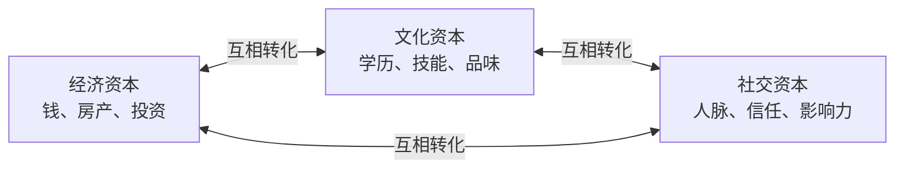
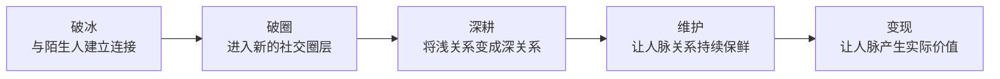

# 第16章 人脉与社交资本

## 一、为什么这一章可能是整本书最重要的一章

在搞钱的所有路径中——无论是创业、投资、职场晋升，还是副业变现——有一条底层规律始终贯穿其中：**你的人脉质量，决定了你的财富上限。**

这不是鸡汤。哈佛大学成人发展研究（Harvard Study of Adult Development）追踪了724个人长达85年（1938年至今），是人类历史上持续时间最长的幸福感研究。研究的核心结论只有一句话：**良好的人际关系是让人保持健康和幸福的最重要因素。** 而在财富创造领域，这个结论更加鲜明——研究者发现，一个人的收入水平与其社交网络的多样性和质量呈现显著正相关。

为什么人脉如此重要？因为财富的本质是**价值交换**，而所有的价值交换都需要通过人来完成。你卖产品，需要客户；你做项目，需要合伙人；你找投资，需要投资人；你获取信息，需要信息源。脱离了人的连接，再好的想法也只是空中楼阁。

用一个公式来表达：

> **财富 = 你能提供的价值 × 你的人脉网络的规模与质量**

这个公式意味着：即使你的能力很强，如果你的人脉网络很小，你的财富天花板也会很低。反过来，一个能力普通但人脉广泛的人，往往能调动比自身能力强得多的资源，做成更大的事。

### 1.1 三个被数据验证的事实

**事实一：弱关系比强关系带来更多机会。** 斯坦福大学教授马克·格兰诺维特在1973年的经典研究中发现，56%的人是通过"不太熟的人"找到工作的，只有16%通过亲密朋友。LinkedIn在2022年的数据报告进一步证实：通过二度人脉（朋友的朋友）获得的工作机会，比一度人脉多出60%以上。

**事实二：社交网络的结构比规模更重要。** 芝加哥大学商学院教授罗纳德·伯特的研究发现，在企业中占据"结构洞"位置（连接不同社交圈的人）的员工，薪酬比同级别的其他人高出22%，晋升速度快18%。

**事实三：社交资本存在复利效应。** 你今天帮的一个人，可能在未来帮你连接整个新圈子。社会学家邓肯·瓦茨（Duncan Watts）的网络动力学研究表明，当社交网络达到临界质量（约150个有效连接）后，机会的到来频率呈指数级增长。

### 1.2 一个常见误解的纠正

很多人把"人脉"等同于"认识人多"。这是错的。**人脉不是你认识多少人，而是多少人认识你、信任你、愿意帮你。** 通讯录里有3000个联系人，但没有一个人会在你遇到困难时伸出援手——这不是人脉，这是通讯录。

真正的社交资本，是一种**可变现的关系资源**。它需要三个条件同时成立：

| 条件 | 含义 | 反面案例 |
|------|------|----------|
| **认识** | 对方知道你是谁，记得你的名字和基本背景 | 微信加了但从没聊过天 |
| **信任** | 对方相信你的能力和人品 | 认识但觉得你不靠谱 |
| **互惠** | 双方愿意在需要时互相帮助 | 单方面索取，从不付出 |

只有三个条件同时满足，这段关系才构成真正的社交资本。

---

## 二、社交资本的底层逻辑

### 2.1 三种资本的关系

法国社会学家皮埃尔·布尔迪厄（Pierre Bourdieu）将一个人拥有的资源分为三种资本：



这三种资本可以相互转化。一个典型的路径是：一个普通人通过读书（获得文化资本）进入名校，结识了优秀的同学和教授（获得社交资本），毕业后通过校友推荐进入头部企业（社交资本转化为经济资本），用高收入继续投资自己的教育和社交（经济资本再转化为文化和社交资本）。

理解这种转化关系非常重要。它告诉我们：**社交资本不是独立存在的，它与你的专业能力和经济实力相互支撑。** 一个没有任何价值输出能力的人，即使社交技巧再好，也难以建立真正有价值的人脉——因为人脉的本质是价值交换。

### 2.2 社交资本的三个维度

综合布尔迪厄、科尔曼、帕特南等学者的研究，社交资本可以从三个维度来理解：

**结构维度——你的网络长什么样**

这是社交网络的"硬件"：你认识多少人？这些人在哪些行业和圈层？你的网络是集中的（都来自同一个行业）还是分散的（覆盖多个领域）？你是网络的中心还是边缘？

**关系维度——你和别人的关系有多深**

这是社交网络的"软件"：你和关键人物之间的信任程度如何？互动频率怎样？有没有共同的经历和情感基础？关系的互惠程度如何？

**认知维度——你和别人有没有共同语言**

这是社交网络的"协议"：你和对方是否来自同一行业、有相似背景？你们是否使用相同的语言和符号系统？是否有共同的价值观和目标？

三个维度的关系如下：

| 维度 | 核心问题 | 影响 | 提升方式 |
|------|----------|------|----------|
| 结构 | 认识谁？覆盖多广？ | 决定你能获得多少不同类型的机会 | 参加跨行业活动、加入新社群 |
| 关系 | 关系多深？信任多强？ | 决定机会能否真正转化为合作 | 持续互动、共同经历、提供价值 |
| 认知 | 能否高效沟通？ | 决定合作的效率和深度 | 学习对方领域的知识、寻找共同点 |

### 2.3 社交资本的运作机制

社交资本之所以能转化为财富，核心机制有四个：

**机制一：信息差变现。** 在商业世界中，信息就是金钱。一个强大的人脉网络能让你比别人更早获得关键信息——一个新项目的招标信息、一个行业的政策变化、一个尚未公开的投资机会。这些信息差可以直接转化为商业决策优势。

**机制二：资源整合。** 创业或做项目时，你几乎不可能单打独斗完成所有事情。你需要技术合伙人、投资人、渠道商、关键人才。这些资源都藏在你的人脉网络中。人脉越强，你能调动的资源就越大。

**机制三：信任背书。** 在商业合作中，信任是最高的交易成本。两个人从零开始建立信任，可能需要数月甚至数年。但如果有一个共同信任的中间人背书，这个过程可以缩短到几天。信任背书能显著降低交易成本，加速合作达成。

**机制四：认知升级。** 吉米·罗恩（Jim Rohn）说过："你是与你相处时间最长的5个人的平均值。" 这句话虽有简化之嫌，但核心观点成立：高质量的人脉能不断拓展你的视野，提升你的思维方式，让你看到之前看不到的可能性。这种认知层面的提升，往往是财富跃迁的前提条件。

---

## 三、本章的知识地图

本章按照"道法术器"的逻辑层层递进，从理论基础到实操方法，从真实案例到练习工具，帮你构建一套完整的人脉经营体系。

```mermaid
graph TD
    A[第16章 人脉与社交资本] --> B[理论基础]
    A --> C[核心技巧]
    A --> D[实战案例]
    A --> E[常见误区]
    A --> F[练习方法]
    A --> G[本章小结]
    A --> H[深度拓展]

    B --> B1[社交资本理论的起源与发展]
    B --> B2[弱关系理论]
    B --> B3[结构洞理论]
    B --> B4[邓巴数与人脉管理]
    B --> B5[社会资本的回报率]
    B --> B6[社交网络的数学模型]
    B --> B7[社交资本的数字化转型]

    C --> C1[人脉建立的五个层次]
    C --> C2[高效社交的七个习惯]
    C --> C3[社交场景的实操指南]
    C --> C4[人脉管理的工具与方法]
    C --> C5[高价值人脉的识别与接近]
    C --> C6[社交资本的复利增长]
    C --> C7[跨文化社交技巧]

    D --> D1[程序员到创业者的蜕变]
    D --> D2[宝妈的社群创业之路]
    D --> D3[销售冠军的人脉秘密]
    D --> D4[跨行业资源整合的奇迹]
    D --> D5[退休人士的社交资本变现]
    D --> D6[从线上到线下的社交升级]
    D --> D7[从社交恐惧到达人]
```



### 3.1 理论基础（道——理解底层规律）

这是本章的"道"——让你理解社交资本为什么有效、如何运作。

| 小节 | 核心问题 | 关键概念 | 对搞钱的启示 |
|------|----------|----------|-------------|
| 社交资本理论的起源与发展 | 什么是社交资本？它从哪来？ | 布尔迪厄三种资本、科尔曼功能性理论、帕特南宏观视角 | 理解社交资本与经济资本的转化关系 |
| 弱关系理论 | 为什么不太熟的人反而更有用？ | 强关系/弱关系、信息冗余度、桥梁作用 | 不要只在同一圈子里社交，主动拓展跨领域人脉 |
| 结构洞理论 | 为什么"连接者"最赚钱？ | 结构洞、经纪人位置、信息/控制/创新优势 | 有意识地成为不同圈子之间的桥梁 |
| 邓巴数与人脉管理 | 一个人到底能维护多少关系？ | 150人上限、五层关系圈、分层管理 | 质量优于数量，分层经营人脉 |
| 社会资本的回报率 | 社交投资值不值？ | 投入成本模型、复利效应、转化路径 | 社交是投资不是消费，要有长期主义思维 |
| 社交网络的数学模型 | 社交网络如何运作？ | 六度分隔、幂律分布、网络效应 | 理论上你可以认识任何人，关键是方法 |
| 社交资本的数字化转型 | 数字时代人脉怎么玩？ | 线上社交、个人品牌、数字身份 | 利用社交媒体放大社交资本的半径和效率 |

### 3.2 核心技巧（法——掌握系统方法）

这是本章的"法"——给你一套可执行的人脉经营方法论。

**人脉建立的五个层次：**



这五个层次是一个递进的过程。大多数人的问题出在前两层——他们要么不敢破冰，要么无法破圈，导致人脉网络长期局限在一个很小的范围内。本章会给你每一层的具体操作方法。

**高效社交的七个习惯：**

| 习惯 | 频率 | 具体动作 | 投入时间 |
|------|------|----------|----------|
| 认识新朋友 | 每周 | 参加活动、朋友引荐、社群互动 | 2-3小时/周 |
| 维护老关系 | 每天 | 问候、点赞、分享有价值信息 | 15分钟/天 |
| 组织聚会 | 每月 | 主题聚餐、运动活动、学习小组 | 半天/月 |
| 人脉盘点 | 每季 | 审视网络结构、识别空白、调整策略 | 2小时/季 |
| 先付出后索取 | 随时 | 帮人解决问题、分享信息、介绍人脉 | 融入日常 |
| 做超级连接者 | 持续 | 介绍不同圈子的人互相认识 | 融入日常 |
| 提升自身价值 | 持续 | 学习、积累、建立个人品牌 | 每天1-2小时 |

**高价值人脉的识别与接近：**

不是所有人都值得花同样的精力去经营。高价值人脉通常具备以下特征：

- 在其所在领域有话语权和影响力
- 拥有丰富的资源和广泛的人脉
- 愿意帮助他人、乐于分享资源
- 与你有互补性（技能、资源、视野、信息）

接近高价值人脉有四条路径：价值先行（先为对方创造价值）、第三方引荐（通过共同朋友介绍）、共同活动（创造自然接触机会）、内容吸引（用高质量输出引起注意）。

### 3.3 实战案例（术——看别人怎么做）

这是本章的"术"——通过真实案例理解人脉变现的具体路径。

本章收录了7个真实案例，覆盖不同背景、不同阶段、不同路径的人脉变现故事：

| 案例 | 主角背景 | 核心策略 | 关键转折点 |
|------|----------|----------|-----------|
| 程序员到创业者 | 技术出身，缺乏商业人脉 | 通过技术社区积累行业人脉 | 一次开源项目合作引来天使投资 |
| 宝妈社群创业 | 全职妈妈，社会关系断裂 | 通过妈妈社群重建社交网络 | 从团购团长到品牌代理商 |
| 销售冠军的秘密 | 普通销售，业绩平平 | 系统化客户关系管理 | 建立客户转介绍体系后业绩翻3倍 |
| 跨行业资源整合 | 某行业资深人士 | 利用结构洞位置连接不同行业 | 促成两个不同行业的企业合作 |
| 退休人士的变现 | 退休干部，人脉丰富但闲置 | 将积累数十年的人脉转化为咨询服务 | 成为行业顾问委员会成员 |
| 线上到线下升级 | 线上社交达人，缺乏深度关系 | 系统化将线上弱关系转化为线下强关系 | 组织行业闭门会建立深度信任 |
| 社交恐惧到达人 | 性格内向，害怕社交 | 从一对一深度交流开始，逐步扩展 | 发现内向者在深度社交中的独特优势 |

每个案例都会拆解：**背景→策略→执行→结果→反思**，帮你理解人脉变现的完整链条。

### 3.4 常见误区（避坑指南）

人脉经营中最容易踩的坑，单独拿出来讲，是因为这些误区足以让你的努力全部白费。

**误区一：功利社交——把人脉当工具。** 很多人一社交就直奔主题："你能不能帮我介绍XX？""你认不认识XX？"这种纯粹以利用为目的的社交，会让对方立刻产生防御心理。正确做法是先建立信任和情感连接，让价值交换自然发生。

**误区二：广撒网——追求数量而非质量。** 认识1000个泛泛之交，不如深耕50个高质量关系。邓巴数告诉我们，人的精力是有限的。与其把有限的精力分散到无数浅关系上，不如集中精力经营关键关系。

**误区三：只进不出——只索取不付出。** 社交资本的本质是互惠。如果你总是索取而不付出，你的社交信用会快速破产。正确的做法是：在你有能力帮助别人的时候，不计回报地伸出援手。

**误区四：忽视维护——建立后放任不管。** 人脉关系就像花园，不浇水就会枯萎。很多人花大力气认识了重要人物，之后就再也不联系。等到需要帮忙时才想起对方，这时关系早已淡化。

**误区五：社交恐惧——用"我是内向的人"作为借口。** 内向不等于不能社交。内向者在深度社交方面甚至有独特优势——他们更善于倾听，更注重关系的深度，更擅长一对一的深入交流。关键不是改变性格，而是找到适合自己的社交方式。

### 3.5 练习方法（器——落地执行的工具）

知道了道理和方法，还需要通过刻意练习将知识转化为能力。本章提供一套循序渐进的练习体系：

- **入门练习**：破冰话术练习、自我介绍打磨、微信社交基础操作
- **进阶练习**：人脉地图绘制、社交日历制定、跨圈子活动组织
- **高级练习**：结构洞分析、社交复利策略设计、个人品牌建设

每个练习都有具体的操作步骤、评估标准和常见问题解答。

---

## 四、本章学习路线图

根据你的基础和目标，可以选择不同的学习路径：

### 4.1 快速入门路径（适合社交新手）

如果你目前人脉很少、社交经验不足，建议按以下顺序学习：

```text
章节概览（本文件）
  → 01 理论基础：重点看弱关系理论和邓巴数
    → 02 核心技巧：重点看人脉建立的五个层次
      → 05 练习方法：从入门练习开始
        → 04 常见误区：避免踩坑
```

### 4.2 系统提升路径（适合有一定社交基础的人）

如果你已经有一些人脉，但缺乏系统管理方法，建议按以下顺序：

```text
章节概览（本文件）
  → 01 理论基础：通读全部，建立完整知识框架
    → 02 核心技巧：重点看高价值人脉识别和社交复利增长
      → 03 实战案例：找到与自己情况最接近的案例深入研究
        → 04 常见误区：对照检查自己是否存在类似问题
          → 07 深度拓展：进一步深化理解
```

### 4.3 高手精进路径（适合社交经验丰富的人）

如果你已经是社交达人，建议重点关注：

```text
章节概览（本文件）
  → 01 理论基础：结构洞理论和社交网络数学模型
    → 02 核心技巧：社交资本的复利增长和跨文化社交
      → 03 实战案例：跨行业资源整合案例
        → 07 深度拓展：前沿理论和高级策略
```

---

## 五、本章完整目录

| 编号 | 小节 | 主题 | 核心内容 | 建议阅读时间 |
|------|------|------|----------|-------------|
| 00 | 章节概览 | 本文件 | 全章地图、学习路线、核心概念预览 | 15分钟 |
| 01 | 理论基础 | 社交资本的科学 | 布尔迪厄三种资本、弱关系、结构洞、邓巴数、社交网络数学模型、数字化转型 | 60分钟 |
| 02 | 核心技巧 | 人脉经营的实操方法 | 五个层次、七个习惯、场景指南、管理工具、高价值人脉、复利增长、跨文化社交 | 90分钟 |
| 03 | 实战案例 | 真实的人脉变现故事 | 7个案例覆盖程序员/宝妈/销售/跨行业/退休人士/线上转线下/内向者 | 45分钟 |
| 04 | 常见误区 | 人脉经营的陷阱 | 功利社交、数量崇拜、只进不出、忽视维护、社交恐惧 | 30分钟 |
| 05 | 练习方法 | 社交能力提升训练 | 入门/进阶/高级三级练习体系 | 45分钟 |
| 06 | 本章小结 | 核心要点回顾 | 关键概念总结、行动清单、推荐资源 | 15分钟 |
| 07 | 深度拓展 | 进阶理论与前沿话题 | 社交资本的量化评估、AI时代的社交变革、跨文化社交资本 | 45分钟 |

**总计建议阅读时间：约5.5小时**（可分3-4次完成）

---

## 六、开始之前的心理准备

在正式进入本章之前，有三件事需要你提前认知：

**第一，社交能力是可以习得的。** 社交不是天赋，而是技能。就像编程、写作、驾驶一样，社交能力可以通过学习和练习来提升。如果你现在觉得自己"不善社交"，那只是因为你还没有掌握正确的方法。

**第二，人脉经营是长期投资。** 不要期望看完这一章就能立刻获得有价值的人脉。社交资本的积累需要时间，就像复利一样，前期增长缓慢，后期才会爆发。你需要耐心。

**第三，真诚是最好的社交策略。** 所有社交技巧的前提是真诚。如果你只是为了利用别人而社交，再好的技巧也会被识破。真正有效的人脉经营，是建立在真心帮助他人、创造共同价值的基础之上的。

> **记住：人脉不是你认识多少人，而是多少人认识你、信任你、愿意帮你。**

现在，让我们开始。
