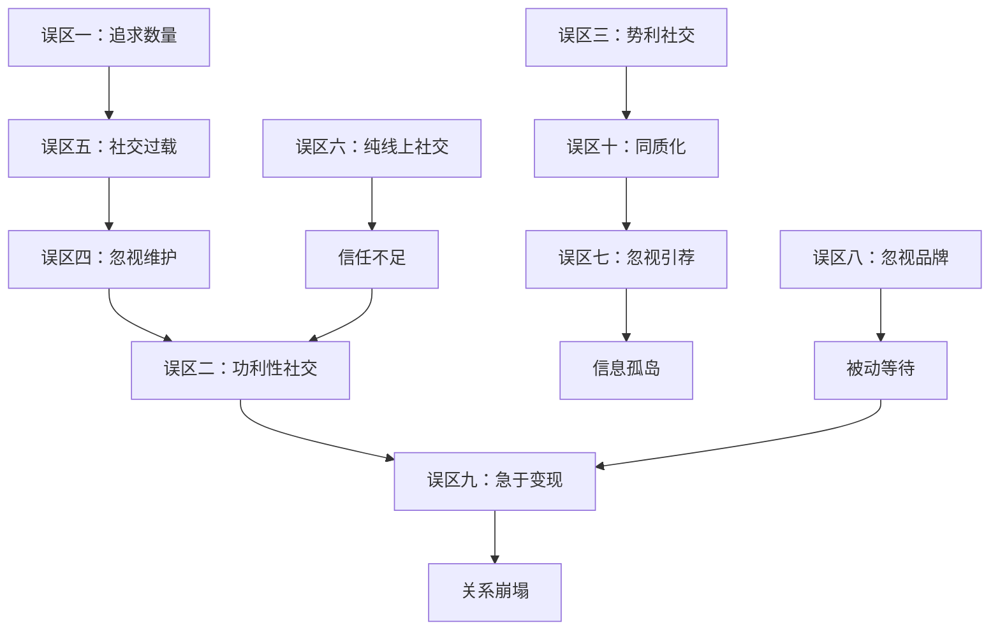

# 第16章 常见误区：人脉经营的十大陷阱

> "人们不是因为无知而犯错，而是因为确信自己知道答案。" —— 伯特兰·罗素

人脉经营是一门需要终身修炼的技艺。遗憾的是，大多数人在这条路上走得跌跌撞撞，不是因为缺乏社交能力，而是因为陷入了某些根深蒂固的认知误区。这些误区往往披着"常识"的外衣，让人浑然不觉地浪费时间、消耗关系、错失机会。

本章将系统拆解人脉经营中最常见的十大误区，每个误区都会从**表现识别→心理机制→危害分析→正确做法→实操工具**五个层次展开，帮助你建立一套科学的人脉经营认知框架。

## 如何识别自己的误区：自检框架

在逐一分析误区之前，先提供一个快速自检工具。以下问卷可以帮助你在 5 分钟内定位自己最可能陷入的误区类型。

| 序号 | 自检问题 | 对应误区 | 你的回答 |
|------|----------|----------|----------|
| 1 | 你的微信好友超过 1000 人，但能叫出来吃饭的不到 20 人？ | 误区一 | 是/否 |
| 2 | 你上一次联系某个朋友，是因为你需要他帮忙？ | 误区二 | 是/否 |
| 3 | 你会根据对方的职业/收入决定是否深入交往？ | 误区三 | 是/否 |
| 4 | 你有超过 3 个月没联系的重要朋友？ | 误区四 | 是/否 |
| 5 | 你每周参加 2 次以上社交活动，但感觉疲惫且收获不大？ | 误区五 | 是/否 |
| 6 | 你和大部分"朋友"只在网上互动，从未线下见面？ | 误区六 | 是/否 |
| 7 | 你认识的大部分人都是自己直接认识的，很少通过引荐？ | 误区七 | 是/否 |
| 8 | 别人提到你时，无法用一句话说清你是谁、擅长什么？ | 误区八 | 是/否 |
| 9 | 你刚认识一个人就会考虑"他能帮我什么"？ | 误区九 | 是/否 |
| 10 | 你的朋友圈里 80% 以上都是同行？ | 误区十 | 是/否 |

回答"是"越多，说明你在对应领域的误区越深。接下来逐一拆解。

---

## 误区一：人脉 = 通讯录人数

### 表现识别

这是最普遍、也最致命的认知误区。典型症状包括：

- 热衷于参加各种行业大会、峰会，核心目标是"加微信"
- 微信好友动辄数千人，但绝大多数从未有过深度对话
- 以"我认识某某大佬"为荣，但对方可能根本不知道你是谁
- 定期参加"社交破冰"活动，每次都收获一叠名片，然后束之高阁

### 心理机制：数量错觉

这种行为背后有一个心理学概念叫**"数量错觉"（Quantity Illusion）**——人类天生倾向于用可量化的指标来衡量不可量化的事物。通讯录人数是一个明确的数字，容易给人"我社交能力很强"的错觉。但人脉的价值本质上是**关系质量**，这是一个难以量化的维度。

社会学家罗纳德·伯特（Ronald Burt）在《结构洞》一书中指出：社交网络的价值不在于节点数量，而在于**网络结构**。一个拥有 200 个紧密连接节点的网络，其信息价值可能远低于一个拥有 100 个节点但跨越多个社群的网络。

### 危害分析

| 维度 | 具体危害 | 量化影响 |
|------|----------|----------|
| 时间成本 | 每次社交活动平均消耗 3-4 小时（含通勤） | 每周 2 次活动 = 每月 24-32 小时 |
| 精力成本 | 大量浅层关系需要基础维护（点赞、评论、节日祝福） | 每天 30-60 分钟 |
| 机会成本 | 用于广撒网的时间本可用于深耕 5-10 个高质量关系 | 难以量化，但影响深远 |
| 心理成本 | "人脉焦虑"——觉得认识的人还不够多 | 持续的社交压力 |

### 正确做法：从"广度思维"转向"深度思维"

**第一步：理解邓巴数的真正含义**

英国人类学家罗宾·邓巴（Robin Dunbar）的研究表明，人类大脑能够维持的稳定社交关系上限约为 150 人。但这 150 人并非等权重——邓巴将其细分为：

- **核心圈（5 人）**：最亲密的人，每周联系，可托付生死
- **亲密圈（15 人）**：好朋友，每月深度交流，可倾诉心事
- **友谊圈（50 人）**：普通朋友，每季度联系，可互相帮忙
- **熟人圈（150 人）**：点头之交，每年联系，知道彼此存在

**第二步：建立人脉分层管理机制**

```text
人脉分层管理表：

┌─────────────────────────────────────────────────────┐
│  层级      │  人数上限  │  维护频率  │  投入精力  │
├─────────────────────────────────────────────────────┤
│  核心圈    │  3-5 人    │  每周      │  40%      │
│  亲密圈    │  10-15 人  │  每月      │  30%      │
│  友谊圈    │  30-50 人  │  每季度    │  20%      │
│  熟人圈    │  100-150人 │  每半年    │  10%      │
└─────────────────────────────────────────────────────┘
```

**第三步：定期清理和优化**

每季度进行一次"人脉审计"：

1. 列出过去 3 个月有过深度互动的人（不仅仅是点赞）
2. 识别哪些关系在"下沉"（互动频率下降）
3. 识别哪些关系有"上升"潜力（可能发展为更深层关系）
4. 将精力重新分配到最重要的关系上

### 实操工具：关系价值评估矩阵

用两个维度评估每段关系的价值：**当前价值**（现在能给你带来什么）和**潜在价值**（未来可能带来什么）。每个维度 1-5 分，总分 10 分。

```text
潜在价值
  5 │  ④战略培育  │  ①重点维护
    │  (低当前    │  (高当前
    │   高潜力)  │   高潜力)
  3 │─────────────┼─────────────
    │  ③观察等待  │  ②日常维护
    │  (低当前    │  (高当前
    │   低潜力)  │   低潜力)
  1 └─────────────┴─────────────
    1            3            5
              当前价值
```

- **① 重点维护**（双高）：核心圈，投入最多精力
- **② 日常维护**（高当前、低潜在）：友谊圈，保持基本联系
- **③ 观察等待**（双低）：熟人圈，保持最低限度联系
- **④ 战略培育**（低当前、高潜在）：重点关注，可能是未来的贵人

---

## 误区二：功利性社交——"用完即弃"的工具人思维

### 表现识别

- 只在需要帮忙时才联系别人，平时音讯全无
- 聊天开场白永远是"最近忙吗？"，下一句就是"有件事想请你帮个忙"
- 别人帮完忙后，除了"谢谢"再无下文，直到下次需要帮忙
- 把人脉按照"能不能帮我"分类，对"没用"的人冷漠对待

### 心理机制：互惠失衡

社会心理学家罗伯特·西奥迪尼（Robert Cialdini）在《影响力》中提出的**"互惠原则"**是人类社交的基石——人们倾向于回报他人的善意。但互惠原则有一个前提：**给予必须是真诚的，而非策略性的**。

当对方感知到你的"付出"只是为了将来的"索取"，互惠原则就会失效。心理学上称之为**"隐性成本计算"**——当人们觉得一段关系的"投入产出比"对自己不利时，会本能地疏远这段关系。

### 危害分析

**信任崩塌的连锁反应**

功利性社交的危害不是线性的，而是指数级的。当一个人意识到自己被利用：

1. **即时反应**：对你的请求敷衍了事或直接拒绝
2. **口碑传播**：在共同朋友圈中传播"这个人只在需要时才找你"
3. **网络效应**：负面口碑会通过社交网络扩散，影响你与其他人建立关系
4. **长期影响**：即使你后来改变行为，曾经的"功利"标签也很难撕掉

### 正确做法：建立"社交账户"思维

将每段关系想象成一个**银行账户**：

- **存款**：主动帮忙、分享信息、介绍资源、情感支持
- **取款**：请求帮助、占用时间、索取资源
- **利息**：信任的自然增长、口碑效应、关系深化

**关键原则**：保持账户余额为正。在你需要"取款"之前，确保已经积累了足够的"存款"。

**具体操作：**

1. **建立"给予清单"**：记录每个人可能需要的帮助类型（信息、资源、人脉、建议）
2. **设置"无目的联系"**：每周至少联系 2-3 个人，不带任何目的，只是问候或分享
3. **及时回报**：别人帮了你，24 小时内表达感谢，1 周内找到机会回报
4. **超额回报**：回报的价值应该超过对方付出的价值，这样关系才会正向循环

### 案例：从"被拉黑"到"被信任"的转变

**反面案例**：某创业者小李，在创业初期频繁联系投资人和行业大佬。每次联系都是"请教问题"或"寻求资源"，但从未主动为对方提供过任何价值。一年后，他发现自己发消息的回复率从 70% 降到了 10%，很多人甚至直接不回。

**正面案例**：同样的场景，另一位创业者小王采取了不同策略。他每周花 2 小时整理行业信息，筛选出对不同联系人有价值的内容，主动分享。他会在朋友圈看到某人发布成果时主动祝贺并转发。三年后，小王的"人脉质量评分"（自定义指标：能直接约到吃饭的人数 / 总联系人数）是小李的 5 倍。

---

## 误区三：势利社交——只和"有用"的人交往

### 表现识别

- 在社交场合中，眼睛总是盯着"最厉害的人"
- 对职位低、资源少的人缺乏基本尊重
- 会根据对方的名片头衔决定聊天投入程度
- 朋友圈分组可见，只给"重要的人"看

### 心理机制：过度自信偏差

这种行为源于**"过度自信偏差"（Overconfidence Bias）**——人们倾向于高估自己判断他人价值的能力。你认为自己能准确判断谁"有用"、谁"没用"，但现实是：

1. **信息不对称**：你看到的只是对方的表面信息（职位、收入、学历），而非真实能力
2. **时间维度缺失**：今天的普通人可能是明天的行业领袖
3. **价值维度单一**：你只看到了"能不能帮我赚钱"，忽略了情感支持、信息来源、精神激励等价值

### 危害分析

**弱关系的价值被严重低估**

回到格兰诺维特的弱关系理论：真正带来新机会的，往往是那些与你处于不同社交圈的弱关系。如果你只和"有用"的人交往，你的社交网络会高度同质化，信息来源单一，反而降低了人脉网络的整体价值。

**数据支撑**：

- 领英（LinkedIn）的内部研究显示，用户通过弱关系获得的工作机会比强关系多 58%
- 哈佛商学院的研究表明，创业者的成功与社交网络的**多样性**（而非"质量"）呈正相关
- 格兰诺维特的经典研究发现，56% 的人是通过弱关系找到工作的，只有 17% 通过强关系

### 正确做法：践行"无差别社交"

**原则一：尊重每一个人**

在社交场合中，对每一个人保持同等的尊重和好奇心。你永远不知道面前这个"普通人"背后有什么样的资源和能力。

**原则二：建立"弱关系基金"**

每月预留一定时间和精力，专门用于发展弱关系：

- 参加跨行业的活动（而非只参加本行业的）
- 在社交媒体上与不同领域的人互动
- 主动认识朋友的朋友

**原则三：培养"连接者"思维**

不要只想着"这个人能给我什么"，而要想"我能连接谁和谁"。成为社交网络中的"连接者"，你的价值会指数级增长。

### 案例：一个"普通人"如何改变了命运

某互联网公司的产品经理小张，在一次行业聚会上认识了一个做公众号的"小人物"。大多数人都不会在意这个粉丝只有几千的小号主，但小张主动和他聊天，分享了自己的产品经验。三年后，这个小号主成长为百万粉丝的大V，而小张成为他最信任的产品顾问，两人合作推出了多款爆款产品。

这个案例说明：**你今天帮助的"普通人"，可能是明天最重要的合作伙伴。**

---

## 误区四：关系维护的"自动巡航"陷阱

### 表现识别

- 认为"关系在那里就行了"，不需要刻意维护
- 长时间不联系后突然求助，觉得"老朋友不会介意"
- 从不主动发起联系，总是等别人来找
- 忽视关系的"保质期"，以为认识了就永远是朋友

### 心理机制：现状偏差与遗忘曲线

**现状偏差（Status Quo Bias）** 让人们倾向于维持现状，不做改变。"关系在那里就行"就是这种偏差的典型表现。

但关系不是静态的。心理学中的**艾宾浩斯遗忘曲线**同样适用于人际关系——如果长时间没有互动，关系的"记忆强度"会指数级衰减。一项牛津大学的研究表明，如果两个人 6 个月没有任何互动，他们之间的关系亲密度会下降约 50%。

### 危害分析

关系维护不足的后果是渐进式的，当你意识到时往往已经太晚：

```text
关系衰减时间线（无主动维护的情况下）：

认识后 1 个月：关系热度 ★★★★☆
认识后 3 个月：关系热度 ★★★☆☆（开始淡化）
认识后 6 个月：关系热度 ★★☆☆☆（基本遗忘）
认识后 1 年：  关系热度 ★☆☆☆☆（需要重新建立）
认识后 2 年：  关系热度 ☆☆☆☆☆（形同陌路）
```

### 正确做法：建立系统化的维护机制

**工具一：关系维护日历**

在日历中设置定期提醒，按人脉层级设定不同的维护频率：

```text
关系维护日历模板：

每周：
  - 核心圈（3-5 人）：主动联系，分享近况或请教问题

每月：
  - 亲密圈（10-15 人）：发送一条个性化消息，关注动态

每季度：
  - 友谊圈（30-50 人）：分享有价值的信息或资源

每半年：
  - 熟人圈（100-150 人）：节日问候或重大事件祝贺
```

**工具二：关系维护的"四个触发点"**

不必等到"想起来了"才联系，利用以下自然触发点：

1. **时间节点**：生日、节日、入职周年、创业纪念日
2. **成就节点**：对方升职、获奖、项目成功、公司上市
3. **内容节点**：对方发布文章/朋友圈，给予有深度的评论
4. **信息节点**：看到与对方行业/兴趣相关的新闻或资源

**工具三：CRM 工具辅助**

对于人脉较多的人，建议使用 CRM（客户关系管理）工具来管理人脉：

| 工具 | 特点 | 适用场景 |
|------|------|----------|
| Notion | 灵活自定义，支持数据库 | 个人人脉管理 |
| 飞书多维表格 | 团队协作，自动化提醒 | 团队人脉共享 |
| 专业 CRM（如 HubSpot） | 功能强大，自动化程度高 | 销售/商务场景 |
| 简单 Excel | 低门槛，易于上手 | 初学者 |

---

## 误区五：社交的"贪多嚼不烂"

### 表现识别

- 什么聚会都参加，什么群都加，什么活动都报名
- 每天忙于各种社交，但感觉"忙了一圈什么也没得到"
- 社交日程排得满满的，反而没有时间独处和思考
- 参加活动时心不在焉，想着"赶紧去下一场"

### 心理机制：FOMO（错失恐惧）

**FOMO（Fear of Missing Out）** 是社交媒体时代的典型心理现象。人们害怕"错过"任何社交机会，于是不加筛选地参加所有活动。但这种"全面撒网"的行为模式会导致**社交过载**——当你的社交投入超过精力上限时，所有社交的质量都会下降。

心理学家巴里·施瓦茨（Barry Schwartz）在《选择的悖论》中指出：选择越多，满意度越低。社交也是如此——参加太多活动，反而让你对每场活动的投入度和满意度都降低。

### 危害分析

| 危害维度 | 具体表现 | 量化指标 |
|----------|----------|----------|
| 时间碎片化 | 每周 5+ 场社交活动 | 每月消耗 40-60 小时 |
| 精力透支 | 社交疲劳，对社交产生抵触 | 工作效率下降 20-30% |
| 关系浅层化 | 认识很多人但没有深度关系 | "能借钱的朋友"数量为 0 |
| 自我迷失 | 忙于社交而忽略自我成长 | 个人技能停滞不前 |

### 正确做法：学会"战略性拒绝"

**第一步：建立社交活动评估矩阵**

参加任何社交活动前，用以下维度评估：

```text
社交活动评估表：

活动名称：_______________
日期时间：_______________

评估维度（1-5 分）：
  1. 目标匹配度：这次活动与我的目标相关吗？    ___分
  2. 人脉质量：参与者是我希望认识的人吗？      ___分
  3. 学习价值：我能从中学到新东西吗？          ___分
  4. 时间成本：活动时间与我的日程冲突吗？      ___分
  5. 精力成本：我现在的精力状态适合参加吗？    ___分

总分：___/25 分
  20+ 分：必须参加
  15-19 分：可以选择参加
  10-14 分：建议跳过
  <10 分：坚决拒绝
```

**第二步：设定社交预算**

像管理财务一样管理社交时间：

- 每周社交时间预算：X 小时（根据个人情况设定）
- 每月大型活动上限：Y 次
- 每周必须的独处时间：Z 小时

**第三步：优雅地拒绝**

拒绝不等于得罪人。以下是一些实用的拒绝话术：

- "这个活动听起来很棒，但最近实在太忙了，下次一定参加"
- "我很想来，但时间冲突了，能给我一份活动资料吗？"
- "感谢邀请，但最近在集中精力做一个项目，等活动结束后我们单独约"

---

## 误区六：线上社交的"虚假亲密感"

### 表现识别

- 觉得加了微信就是建立了人脉
- 在朋友圈点赞就是维护了关系
- 从不主动打电话或约见面
- 把微信群里的互动当作深度社交

### 心理机制：媒介丰富度理论

组织行为学中的**"媒介丰富度理论"（Media Richness Theory）** 指出，不同沟通媒介传递信息的丰富程度差异巨大：

```text
媒介丰富度层级：

面对面交流    ██████████████████████ 100%
视频通话      ██████████████████     85%
语音通话      ████████████████       70%
微信文字      ████████               40%
朋友圈点赞    ██                     10%
```

面对面交流能够传递语言信息（7%）、语调信息（38%）和肢体语言（55%），这是文字消息完全无法替代的。当你只通过微信交流时，你丢失了超过 90% 的沟通信息。

### 危害分析

**线上社交的三大陷阱**：

1. **亲密感幻觉**：频繁的线上互动会制造"我们关系很好"的错觉，但实际上你们可能从未进行过一次深度对话
2. **情感浅层化**：文字消息难以传递复杂情感，导致关系停留在表面
3. **信任建立缓慢**：信任的建立需要面对面的互动，纯线上关系的信任度通常很低

### 正确做法：线上线下结合的"3D 社交法"

**Dimension 1：发现（Discover）**

在线上发现潜在的高价值人脉：

- 在行业社群中识别有深度见解的人
- 通过朋友的朋友发现值得认识的人
- 在社交媒体上关注目标人物

**Dimension 2：对话（Dialogue）**

将线上关系转化为线下对话：

- 主动发起线下见面邀请（咖啡、午餐、散步）
- 重要关系至少每季度线下见面一次
- 线上保持日常联系，线下深化关系

**Dimension 3：深化（Deepen）**

通过共同经历深化关系：

- 一起参加活动、培训、旅行
- 合作完成一个项目
- 互相介绍各自的朋友圈

### 实操模板：线下见面邀请话术

```text
"Hi [名字]，我最近在关注 [某个话题]，想到你在这方面很有经验。
不知道最近有没有时间一起喝杯咖啡？我请你，时间地点你方便就好。"
```

注意事项：
- 给对方"容易拒绝"的空间，不要让人有压力
- 提供明确的时间地点建议，减少对方的决策成本
- 如果对方拒绝，不要追问原因，保持联系等待下次机会

---

## 误区七：忽视"桥接型人脉"的力量

### 表现识别

- 只知道自己直接认识的人，不了解朋友的朋友
- 从不请朋友介绍他们认识的人
- 参加活动时只和自己认识的人待在一起
- 不善于利用"中间人"的背书和引荐

### 心理机制：舒适区偏好

人们倾向于待在自己熟悉的社交圈子里，因为这样感觉安全、舒适。主动请求引荐或通过第三方认识新朋友，会让人感到"不自然"甚至"冒昧"。

但社会网络分析表明，**桥接型人脉**（bridging ties）——连接不同社交圈的关系——是社交网络中价值最高的关系类型。罗纳德·伯特的**结构洞理论**指出：处于社交网络"桥梁"位置的人，能够获得最多的信息优势和控制优势。

### 危害分析

不利用第三方引荐的代价：

- **信息孤岛**：你的信息来源局限于自己的小圈子
- **信任门槛高**：没有中间人背书，从零建立信任的成本很高
- **机会成本**：很多高价值人脉只能通过引荐接触到
- **效率低下**：自己去认识 100 个人，不如通过 10 个中间人认识 100 个人

### 正确做法：构建"引荐网络"

**第一步：识别你网络中的"超级连接者"**

每个社交圈子里都有几个"超级连接者"——他们认识的人多，社交能力强，乐于介绍。识别这些人，并与他们建立深度关系。

**第二步：学会"请求引荐"的艺术**

请求引荐的三个要素：

1. **明确目标**：说清楚你想认识什么样的人
2. **说明原因**：解释为什么想认识这个人
3. **降低门槛**：让中间人觉得介绍你是"加分"而非"添麻烦"

```text
引荐请求模板：

"嗨 [中间人]，我最近在研究 [某个领域]，想认识一些在这个领域有经验的人。
我记得你之前提到过 [目标人物]，不知道方不方便帮我引荐一下？
我保证不会浪费他的时间，只是想请教几个具体问题。
如果你觉得不方便，完全没关系，我理解。"
```

**第三步：做好引荐后的跟进**

- 引荐成功后，24 小时内联系目标人物
- 第一次交流时，提及中间人作为信任锚点
- 交流结束后，向中间人反馈交流结果并表达感谢

### 案例：一个引荐如何带来百万订单

某 B2B 销售人员小陈，想接触一家大型企业的采购总监。他通过正常渠道发了无数邮件、打了无数电话，都没有回应。后来他发现自己的一位大学同学恰好认识这家企业的另一位高管。通过这位高管的引荐，他成功与采购总监建立了联系，最终签下了一笔价值 200 万的订单。

这个案例说明：**正确的引荐可以打破"冷启动"困境，大幅降低信任建立的成本。**

---

## 误区八：忽视个人品牌的"被动社交"

### 表现识别

- 只顾着认识别人，却从不展示自己的价值
- 在社交场合中，别人问"你是做什么的"时，无法清晰回答
- 没有任何可以代表自己专业能力的作品或成果
- 人脉增长完全依赖主动出击，从未有人主动来找你

### 心理机制：信号理论

经济学中的**信号理论（Signaling Theory）** 指出，在信息不对称的环境中，人们通过"信号"来判断他人的能力和价值。个人品牌就是你在社交网络中发出的"信号"。

没有个人品牌，你就像一个没有标签的产品——即使质量再好，也无人问津。而有了清晰的个人品牌，你就像一个知名品牌——别人会主动来找你合作。

### 危害分析

没有个人品牌的人脉经营者面临**"被动等靠"**困境：

```text
有个人品牌 vs 无个人品牌的人脉增长曲线：

人脉数量
  ↑
  │          ╱ 有品牌（吸引式增长）
  │        ╱
  │      ╱
  │    ╱    ___── 无品牌（推力式增长）
  │  ╱  __╱
  │╱__╱
  └──────────────────→ 时间
```

有个人品牌的人脉增长是**吸引式**的——别人主动来找你。没有个人品牌的人脉增长是**推力式**的——你需要不断主动出击。两者的效率差距会随着时间推移越来越大。

### 正确做法：打造"可被发现"的个人品牌

**第一步：定义你的"一句话价值主张"**

别人提到你时，能用一句话说清你是谁、擅长什么。这个"一句话"需要满足三个条件：

1. **具体**：不是"我很厉害"，而是"我在 XX 领域做了 XX 年"
2. **独特**：不是"我是一个程序员"，而是"我擅长用 AI 优化电商供应链"
3. **有用**：让对方知道"找你能解决什么问题"

**第二步：选择你的"品牌阵地"**

根据你的目标受众，选择 1-2 个平台作为品牌阵地：

| 平台 | 适合人群 | 内容形式 |
|------|----------|----------|
| 微信公众号 | 面向国内专业人群 | 深度文章 |
| 知乎 | 面向知识型用户 | 专业回答 |
| 小红书 | 面向年轻消费者 | 图文/短视频 |
| B 站 | 面向 Z 世代 | 视频内容 |
| GitHub | 面向技术社区 | 开源项目 |
| 领英 | 面向职场人士 | 行业洞察 |

**第三步：持续输出高质量内容**

内容输出的"3-3-3 法则"：

- 每周 3 篇短内容（朋友圈、微博、社群分享）
- 每月 3 篇中等内容（知乎回答、公众号文章）
- 每季度 1 篇深度内容（行业报告、白皮书、系列课程）

---

## 误区九：急于变现的"收割思维"

### 表现识别

- 刚认识就急着谈合作、要资源
- 把每次社交都当作"销售机会"
- 在社群中频繁发广告、推销产品
- 对"暂时没用"的人缺乏耐心

### 心理机制：即时满足偏好

心理学中的**"延迟折扣"（Temporal Discounting）** 现象表明，人们倾向于高估即时回报、低估未来回报。在人脉经营中，这种心理表现为"急于变现"——想要立刻看到社交的回报。

但人脉投资的回报周期通常很长。一项针对创业者的研究表明，从建立人脉到产生实质性回报（合作、投资、客户推荐）的平均时间是 **18-24 个月**。急于变现只会破坏关系，反而延长回报周期。

### 危害分析

急于变现的人脉经营者会陷入**"社交债务"**困境：

1. **短期**：频繁的推销行为会让人们对你产生警惕
2. **中期**：你的"社交信用"会迅速透支，别人会主动回避你
3. **长期**：你的社交网络会萎缩，因为没有人愿意和一个"总是想卖东西"的人交往

### 正确做法：践行"长期主义"社交

**原则一：先给予，后索取**

在你需要回报之前，至少要为对方提供 3 次以上的价值。这不是一个精确的数字，而是一个"心理阈值"——当你积累了足够的"社交存款"，取款时才不会让对方感到被利用。

**原则二：小步试水，逐步深化**

不要一开始就谈大合作，先从小的合作开始：

```text
合作深化路径：

第一步：信息交换（分享行业信息、推荐文章）
第二步：小型互助（帮忙转发、提供一个小建议）
第三步：项目试水（合作一个小项目、联合做一次分享）
第四步：深度合作（长期合作、资源互换、共同创业）
```

**原则三：建立"慢就是快"的信念**

把人脉经营看作种树，而不是捕鱼。捕鱼追求即时收获，但资源会枯竭；种树需要耐心等待，但收获是持续的。

### 案例：急于变现的代价

某保险代理人小赵，在加入一个企业家社群后，立即开始频繁发产品广告、私信推销。结果不到一个月，他就被群主踢出群聊，而且在圈子内留下了"这个人只会卖保险"的标签。后来即使他改变了策略，也很难再融入这个圈子。

反面案例：另一位保险代理人小刘，加入同样的社群后，先花三个月时间了解群成员的需求，主动分享有价值的行业信息，帮助群友解决各种问题。当有人主动问"有没有靠谱的保险顾问"时，群友们纷纷推荐小刘。一年后，小刘 80% 的客户都来自这个社群的口碑推荐。

---

## 误区十：人脉同质化的"回音室效应"

### 表现识别

- 朋友圈里 80% 以上都是同行业的人
- 参加的社群和活动都是同一个圈子
- 获取的信息来源高度一致
- 对不同行业、不同背景的人缺乏兴趣

### 心理机制：同质性偏好

社会学中的**"同质性原则"（Homophily）** 指出，人们倾向于与自己相似的人建立关系——相同的教育背景、职业领域、兴趣爱好、价值观。这种偏好是进化的产物，因为在原始社会中，与相似的人结盟更安全。

但在现代社会中，过度的同质性会导致**"回音室效应"（Echo Chamber）**——你只听到与自己观点一致的声音，视野越来越窄，创新能力越来越弱。

### 危害分析

**同质化人脉网络的三大风险**：

1. **信息盲区**：你只能获得本行业的信息，错过跨行业的机会
2. **创新枯竭**：创新往往来自不同领域的交叉，同质化网络缺乏创新土壤
3. **系统性风险**：当你的行业遭遇寒冬时，你的整个社交网络都会受到影响

**数据支撑**：

麻省理工学院媒体实验室的研究发现，创新者与普通人的最大区别不是智力，而是**社交网络的多样性**。创新者的社交网络跨越的社群数量是普通人的 3 倍以上。

### 正确做法：构建"多样性红利"网络

**策略一：跨圈层社交**

主动参加不同行业的活动：

- 如果你是技术人员，参加商业/设计类活动
- 如果你是商务人士，参加技术/创意类活动
- 如果你是创业者，参加公益/学术类活动

**策略二：培养"业余爱好社交"**

通过业余爱好认识不同背景的人：

- 运动（跑步、登山、球类）
- 兴趣（摄影、读书、烹饪）
- 公益（志愿者活动、社区服务）

**策略三：成为"跨界连接者"**

不要只是跨圈子社交，而要成为连接不同圈子的桥梁。当你能把 A 圈子的资源和 B 圈子的需求对接起来时，你在整个社交网络中的价值会指数级增长。

### 多样性自检清单

```text
人脉多样性评估：

□ 我的朋友中，有不同行业的人吗？
□ 我的朋友中，有不同年龄段的人吗？
□ 我的朋友中，有不同教育背景的人吗？
□ 我的朋友中，有不同地域的人吗？
□ 我的朋友中，有不同性格类型的人吗？
□ 我参加过本行业以外的活动吗？
□ 我有跨行业的朋友可以交流吗？
□ 我了解其他行业的最新动态吗？
```

---

## 误区间的关联：复合陷阱

这十大误区并非孤立存在，它们往往会形成**复合陷阱**——多个误区相互强化，让人越陷越深。



**典型复合陷阱案例**：

1. 小王参加了太多社交活动（误区五），导致每段关系都很浅（误区一）
2. 由于关系太浅，他无法获得有效的引荐（误区七）
3. 没有引荐，他只能靠自己主动出击（误区八）
4. 为了快速获得回报，他开始变得功利（误区二）
5. 功利性社交让他的人脉进一步恶化，形成恶性循环

打破这个循环的关键是：**从一个误区开始改变，逐步带动其他方面的改善。**

---

## 从误区到正道：系统化转变路径

认识到误区只是第一步，更重要的是建立一套系统化的转变路径。以下是针对不同阶段的行动指南。

### 第一阶段：认知重建（第 1-2 周）

**目标**：彻底理解十大误区的本质，建立正确的人脉认知

**行动清单**：

- [ ] 完成本章开头的自检问卷，识别自己的主要误区
- [ ] 列出过去一年中，因为误区导致的具体损失
- [ ] 阅读推荐书籍（见下方），建立理论基础
- [ ] 制定个人的"人脉经营原则"（至少 5 条）

**推荐书籍**：

| 书名 | 作者 | 核心观点 |
|------|------|----------|
| 《社交天性》 | 马修·利伯曼 | 人类社交的神经科学基础 |
| 《超级连接者》 | 里德·霍夫曼 | 职场社交的系统方法 |
| 《人脉》 | 基思·法拉奇 | 人脉经营的实操指南 |
| 《弱关系的力量》 | 马克·格兰诺维特 | 弱关系理论的原始论文 |
| 《结构洞》 | 罗纳德·伯特 | 社交网络的结构分析 |

### 第二阶段：行为调整（第 3-8 周）

**目标**：将正确认知转化为日常行为习惯

**行动清单**：

- [ ] 建立人脉分层管理表（核心圈/亲密圈/友谊圈/熟人圈）
- [ ] 设置关系维护日历，开始定期联系重要关系
- [ ] 进行一次"人脉审计"，清理无效社交
- [ ] 开始建立个人品牌（选择一个平台，发布第一篇内容）
- [ ] 参加一次跨行业活动

### 第三阶段：系统优化（第 9-16 周）

**目标**：建立可持续的人脉经营系统

**行动清单**：

- [ ] 使用 CRM 工具管理人脉信息
- [ ] 建立"引荐网络"，与 3-5 个超级连接者建立深度关系
- [ ] 完成第一个"跨界合作"项目
- [ ] 定期回顾人脉经营效果，调整策略
- [ ] 将人脉经营变成一种生活方式，而非临时任务

---

## 自我诊断工具：人脉健康度评估

定期使用以下评估工具检查自己的人脉健康状况。建议每季度进行一次。

```text
人脉健康度评估表（满分 100 分）

一、关系质量（30 分）
  1. 核心圈人数是否在 3-5 人？                    ___/5 分
  2. 核心圈成员是否互相信任？                      ___/5 分
  3. 过去一个月是否有深度对话（超过 1 小时）？      ___/5 分
  4. 是否有人可以在深夜打电话倾诉？                ___/5 分
  5. 核心圈成员是否覆盖不同生活领域？              ___/5 分
  6. 是否定期清理和优化核心圈？                    ___/5 分

二、关系维护（25 分）
  7. 是否有系统的关系维护机制？                    ___/5 分
  8. 是否定期联系重要关系（至少每季度）？          ___/5 分
  9. 是否利用自然触发点进行联系？                  ___/5 分
  10. 是否主动为他人提供价值？                     ___/5 分
  11. 是否在 24 小时内回复重要消息？               ___/5 分

三、网络结构（25 分）
  12. 人脉是否覆盖不同行业？                      ___/5 分
  13. 是否认识跨代际的朋友？                      ___/5 分
  14. 是否有跨地域的人脉？                        ___/5 分
  15. 是否认识不同性格类型的人？                   ___/5 分
  16. 是否在社交网络中扮演"连接者"角色？          ___/5 分

四、个人品牌（20 分）
  17. 别人能否用一句话描述你的价值？               ___/5 分
  18. 是否有持续的内容输出？                      ___/5 分
  19. 是否有人主动来找你合作/交流？               ___/5 分
  20. 你的专业能力是否被广泛认可？                 ___/5 分

总分：___/100 分

评分标准：
  80+ 分：优秀，你的人脉经营非常健康
  60-79 分：良好，有改进空间
  40-59 分：一般，需要系统性改善
  <40 分：警告，立即开始改变
```

---

## 总结：避开误区的核心原则

人脉经营的十大误区，本质上都源于一个根本性错误：**把人脉当作"工具"而非"关系"。**

当你把人脉当作工具时，你会自然地陷入追求数量、功利社交、急于变现等误区。但当你把人脉当作真正需要经营的关系时，你会自然地追求质量、真诚付出、长期维护。

记住以下核心原则：

1. **质量永远大于数量**：10 个真心朋友胜过 1000 个点赞之交
2. **先付出后回报**：社交账户的余额决定了你能提取多少
3. **真诚是最好的策略**：所有的"社交技巧"都比不上一颗真诚的心
4. **长期主义**：人脉投资的回报周期是年，不是天
5. **多样性是创新的源泉**：跳出舒适区，拥抱不同
6. **个人品牌是杠杆**：让别人来找你，而不是你总去找别人
7. **系统化管理**：人脉经营需要体系，不能靠感觉

最后，记住这句古话：**"路遥知马力，日久见人心。"** 人脉经营是一场马拉松，不是百米冲刺。避开这些误区，用正确的方式经营你的人脉网络，你会发现——**真正的人脉，是当你需要帮助时，别人愿意主动伸出援手。**
