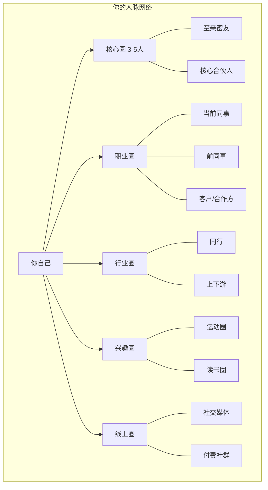
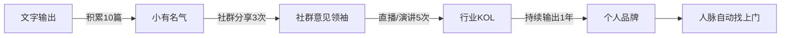
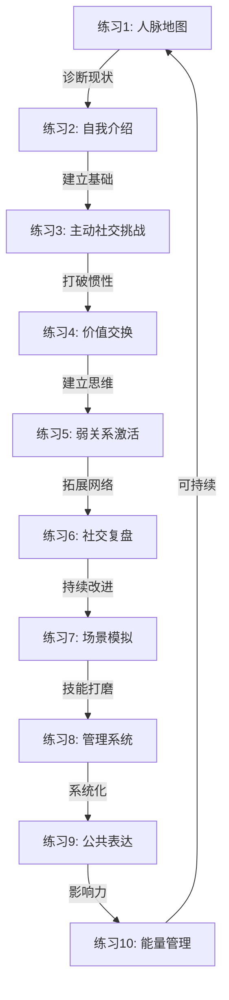

# 第16章 练习方法：提升社交能力的实操练习

社交能力不是天赋，而是一套可以通过刻意练习习得的技能组合。斯坦福大学心理学教授卡罗尔·德韦克（Carol Dweck）的成长型思维理论明确指出：社交能力如同肌肉，越练越强。本章提供10个经过验证的实操练习，从人脉诊断到能量管理，覆盖社交能力提升的完整闭环。

每个练习都包含：理论基础（为什么有效）、详细步骤（怎么做）、工具推荐（用什么做）、常见误区（怎么避坑）、进阶技巧（怎么做得更好）。建议按照文末的训练计划循序渐进，不要跳步。

## 练习一：人脉地图绘制（30-60分钟）

### 理论基础

社会网络分析（Social Network Analysis, SNA）是研究人际关系结构的学科。哈佛大学社会学家尼古拉斯·克里斯塔基斯（Nicholas Christakis）在《大连接》一书中指出：一个人的社会网络结构直接影响其获取信息、资源和机会的能力。人脉地图的核心价值在于让你"看见"自己的社交结构——大多数人对自己的人脉网络存在严重认知偏差，要么高估了网络的广度，要么低估了关键节点的重要性。

社会学家马克·格兰诺维特（Mark Granovetter）的"弱关系理论"表明：真正带来新机会的往往不是亲密的强关系，而是那些你不太熟悉但能连接不同社交圈的弱关系。绘制人脉地图的目的之一，就是识别这些"结构洞"（Structural Holes）——你社交网络中未被连接的区域，这些区域正是最大的机会空间。

### 准备工作

**工具选择：**

| 工具类型 | 推荐工具 | 适用场景 | 学习成本 |
|---------|---------|---------|---------|
| 纸笔 | A2白纸+彩色马克笔 | 快速原型，直觉式思考 | 零 |
| 思维导图 | XMind / MindNode | 结构化梳理，方便修改 | 低 |
| 专业工具 | Kumu / Gephi | 数据分析，可视化网络结构 | 中高 |
| 电子表格 | Excel / Google Sheets | 数据记录，后续筛选排序 | 低 |
| Notion | Notion数据库 | 长期管理，与其他系统整合 | 中 |

**推荐组合**：先用纸笔快速绘制原型（降低启动阻力），再用Notion或Excel建成长期管理数据库。

### 详细步骤

#### 第一步：联系人清点（15分钟）

设定20分钟倒计时，尽可能多地列出你认识的人。不要在这个阶段筛选——先求数量，后做质量分析。

**清点清单（逐类扫描，避免遗漏）：**

1. **家庭与亲属**：直系亲属、旁系亲属、姻亲
2. **教育圈**：小学/初中/高中/大学同学、研究生同门、培训班同学、老师导师
3. **职业圈**：当前同事、前同事、直属领导、跨部门合作者、客户、供应商、猎头
4. **行业圈**：行业会议上认识的人、行业社群群友、行业媒体记者、行业协会成员
5. **兴趣圈**：运动/健身伙伴、读书会成员、游戏队友、旅行搭子
6. **线上圈**：社交媒体互关好友、知识星球/付费社群成员、线上课程同学
7. **服务圈**：房东、中介、保险顾问、理财顾问、律师、医生、家政
8. **社区圈**：邻居、孩子同学家长、社区活动认识的人

**目标**：至少列出80-100人。研究表明，大多数人的稳定社交网络规模在150人左右（邓巴数的社交层），但你实际"认识"的人通常远超这个数字。

#### 第二步：多维度标注（10分钟）

为每个人标注以下维度：

```text
姓名 | 行业/领域 | 关系类型 | 认识渠道 | 认识时长 | 亲密度(1-5) | 互动频率 | 对方社会层级 | 可提供的价值 | 可能需要的价值
```

**维度说明：**

- **亲密度**：1=点头之交，2=偶尔联系，3=定期互动，4=深度信任，5=核心圈
- **互动频率**：每天/每周/每月/每季度/每年/已断联
- **对方社会层级**：不是评判人，而是评估信息和资源的流向——向上连接获取信息，向下连接提供价值，平行连接互助成长
- **可提供的价值**：信息、技能、人脉、资金、情绪支持、行业洞察等
- **可能需要的价值**：对方可能正在寻找什么

#### 第三步：网络可视化（10分钟）

将联系人按以下方式绘制网络图：



**可视化标注规则**：
- 节点大小 = 对方的社会影响力（大=影响力强）
- 连线粗细 = 关系亲密度（粗=亲密）
- 连线颜色 = 互动频率（绿=高频，黄=中频，红=低频/断联）
- 节点颜色 = 行业领域分类

#### 第四步：网络诊断（10分钟）

完成可视化后，回答以下诊断问题：

**结构诊断：**
1. 你的网络是否存在明显的"行业孤岛"——所有人集中在同一行业？
2. 你的弱关系占比是多少？（理想比例：强关系20%，弱关系80%）
3. 你是否有"桥梁人物"——能连接你不同社交圈的人？
4. 你的网络中有哪些"结构洞"——本应连接但未连接的区域？

**质量诊断：**
5. 你的核心圈（亲密度5分）有几个人？（理想值：3-5人，超过5人说明标准不够严格）
6. 哪些高价值关系处于"断联"或"低频"状态？
7. 你的网络中信息流向是否平衡——你是否只是信息的接收者而非传递者？

**风险诊断：**
8. 如果你换行业/换城市/换工作，你的网络会损失多少？
9. 你的关键节点（连接最多的人）是否有备份？
10. 你是否有跨代际、跨地域的人脉？

### 输出物

完成练习后，你应该拥有：

1. **人脉全景图**：一张可视化的人脉网络结构图
2. **人脉数据库**：一份结构化的联系人信息表
3. **诊断报告**：网络优势、空白、风险的分析总结
4. **30天行动计划**：针对诊断出的3个最关键问题，制定具体的改善动作

### 常见误区

| 误区 | 正确做法 |
|------|---------|
| 只列"有用"的人 | 列出所有人，包括看似无关的——弱关系才是信息桥梁 |
| 一次画完就结束 | 每月更新一次，季度做一次深度诊断 |
| 只关注数量 | 质量比数量重要——100个点头之交不如10个深度信任关系 |
| 忽视"向下连接" | 帮助比你年轻/资历浅的人，这是长期投资 |

### 进阶技巧

**社交熵值计算**：给每个联系人的"最近互动时间"赋分（本周=5，本月=4，本季度=3，半年=2，一年以上=1），取平均值。这个数字反映你的社交网络"活跃度"。目标是保持在3.5以上。

---

## 练习二：30秒自我介绍打磨（20-30分钟）

### 理论基础

心理学中的"首因效应"（Primacy Effect）表明：人们在接触的前7秒内就会形成对你的第一印象，而这个印象会在后续互动中持续影响对方的判断。30秒自我介绍不是简单的信息传递，而是一次精心设计的"印象管理"——你需要在这30秒内完成三个任务：建立可信度、激发好奇心、打开对话空间。

传播学中的"信息阶梯"理论指出：有效沟通需要从"事实层"（你是谁）到"价值层"（你能做什么）再到"情感层"（我们有什么共同点）逐级递进。

### 结构模板：WDF法则

**W - Who（我是谁）**：姓名+一句话定位，不超过5秒
**D - Differentiator（我有什么不同）**：用数据或案例证明你的独特价值，15秒
**F - Forward（我们未来可以怎样）**：表达连接意愿，打开对话空间，10秒

### 详细打磨流程

#### 第一步：素材收集（5分钟）

回答以下问题，每个答案用一句话概括：

1. 你的职业身份是什么？（不用头衔，用功能描述——"我帮企业解决XX问题"而非"我是XX公司的XX总监"）
2. 你做过最值得说的一件事是什么？（用数据量化——"帮助XX家企业/创造了XX万营收/服务了XX万用户"）
3. 你和同行最大的区别是什么？（独特的经历、视角或方法论）
4. 你目前最想认识什么样的人？（具体的画像，而非泛泛的"志同道合的人"）

#### 第二步：初稿撰写（5分钟）

将素材组合成30秒口语文稿（约100-120字）。

**示例——普通版 vs 优化版：**

```text
❌ 普通版：
"你好，我是李明，在ABC公司做市场营销，做了5年了，主要负责品牌推广。
希望认识一些做营销的朋友，互相交流学习。"

✅ 优化版：
"你好，我是李明，帮消费品牌用内容营销实现低成本获客。
过去3年，我操盘了20多个品牌的内容项目，其中一个新品牌从0做到月销300万，
获客成本比行业均值低60%。我特别擅长把复杂的品牌故事变成用户愿意主动传播的内容。
如果你也在消费品领域，很想聊聊你的品牌在内容端是怎么做的。"
```

**优化分析**：
- "帮消费品牌用内容营销实现低成本获客"——功能定位，对方立刻知道你能解决什么问题
- "从0做到月销300万，获客成本比行业均值低60%"——数据背书，建立可信度
- "把复杂的品牌故事变成用户愿意主动传播的内容"——差异化描述，区别于"做内容营销"的泛泛说法
- "很想聊聊你的品牌在内容端是怎么做的"——把独角戏变成对话，降低社交压力

#### 第三步：录音迭代（5分钟）

1. 用手机录音功能录下你的自我介绍
2. 回听并检查：
   - 语速是否适中？（理想语速：每分钟200-220字，比日常对话略慢）
   - 是否有口头禅？（"就是""然后""那个"）
   - 语气是否自信但不傲慢？（避免上扬的疑问语气陈述事实）
   - 停顿是否合理？（在关键数据前停顿0.5秒，给对方反应时间）
3. 修改不满意的段落，重新录音
4. 重复3遍，直到听起来自然流畅

#### 第四步：变体制作（5分钟）

同一套核心素材，制作3个版本：

| 版本 | 适用场景 | 风格 | 时长 |
|------|---------|------|------|
| 正式商务版 | 行业峰会、商务会议 | 专业、数据驱动 | 30秒 |
| 轻松社交版 | 朋友聚会、非正式场合 | 亲切、带幽默感 | 20秒 |
| 线上文字版 | 微信加好友、社群自我介绍 | 简洁、有记忆点 | 50字以内 |

**线上文字版示例**：
> 李明 | 消费品牌内容营销操盘手 | 帮20+品牌做到获客成本低于行业60% | 欢迎消费品同行交流 🤝

### 常见误区

- **堆砌头衔**："我是XX协会理事、XX商会会员、XX认证专家"——对方记不住，也没有感觉。用"我帮谁解决什么问题"替代头衔。
- **过度谦虚**："我就是个普通的XX"——自信是社交的基础货币，谦虚在社交场合是贬值的。
- **没有记忆锚点**：说了30秒对方什么都记不住。至少要有一个具体数字或一个生动的画面。
- **独角戏模式**：自我介绍不是演讲，最后一句一定要把话筒递出去。

### 进阶技巧：记忆锚点设计

在自我介绍中植入一个"记忆锚点"——一个独特的标签、故事或画面，让对方在3天后仍然能想起你。

**记忆锚点类型**：
- **数字锚**："帮品牌做到获客成本低于行业60%"——具体数字比"大幅降低"有记忆度10倍
- **故事锚**："我曾经用一条朋友圈帮一个品牌卖了50万"——一个微型故事比抽象描述有力10倍
- **反差锚**："我是程序员出身，现在帮品牌做内容营销"——反差制造好奇心
- **类比锚**："我做的事情类似于品牌的私人健身教练"——类比让抽象概念瞬间具象化

---

## 练习三：主动社交挑战（一周）

### 理论基础

行为心理学中的"曝光效应"（Mere Exposure Effect）表明：人们对频繁出现在视野中的人会产生天然的好感。但现代社交中，大多数人的问题不是曝光太多，而是曝光太少——你的潜在人脉不知道你存在，或者已经忘记了你。

"21天习惯养成"理论（虽然具体天数有争议，但核心结论成立）指出：重复行为会降低行动的心理阻力。主动社交也是如此——第一次主动联系一个很久没联系的人会感到尴尬，但做多了就会变成自然的习惯。

本练习设计为7天渐进式挑战，从最低心理阻力的动作开始，逐步升级。

### 七天挑战详解

#### 第1天（周一）：静默激活

**任务**：给一个3个月以上没联系的朋友发一条问候信息。

**为什么从这里开始**：这是心理阻力最低的动作——发信息不需要对方即时回应，你有足够的时间组织语言，失败成本几乎为零。

**消息模板（选择适合你风格的）**：

```text
场景A - 看到对方动态触发：
"刚看到你朋友圈去了[地点]，看起来玩得很开心！最近怎么样？"

场景B - 节日/天气触发：
"[节日]快乐！好久没联系了，最近忙什么呢？"

场景C - 直接但真诚：
"好久没联系了，突然想起你。最近怎么样？有没有什么新鲜事？"
```

**关键原则**：
- 不要群发，针对这个人写个性化内容
- 不要在消息末尾提要求（借钱、帮忙、推销）
- 对方回复后，正常聊3-5个回合即可，不要刻意延长

**今日复盘**：发送消息后记录——选择联系谁？为什么选TA？发送时的心理感受？

#### 第2天（周二）：价值输出

**任务**：在一个你所在的社群/微信群中主动分享一条有价值的信息。

**什么是"有价值的信息"**：
- 一篇你读过且认为对群里的人有帮助的文章（附上你的简短点评，说明为什么推荐）
- 一个你在工作中发现的实用工具或技巧
- 一个行业内的新趋势或数据
- 对群里某人提出的问题的有价值回答

**什么不是"有价值的信息"**：
- 无点评的链接转发（显得敷衍）
- 自我推销内容（广告、软文）
- 未经验证的传言或新闻
- 纯情绪化表达（抱怨、炫耀）

**示例**：
```text
"最近在项目中用到了[工具名]，效率提升了不少。简单说下：[一句话说明功能]，
适合[什么场景]用。这是官方文档链接：[URL]，有兴趣的可以看看。"
```

#### 第3天（周三）：主动互动

**任务**：在朋友圈给5个朋友的动态点赞，并写下真诚的评论（不少于15个字）。

**为什么15个字**：研究表明，超过15个字的评论会让发布者感受到"被认真对待"，而简单的"好看""厉害""恭喜"则几乎没有社交价值。

**评论公式**：**观察 + 感受 + 问题/延伸**

```text
❌ "恭喜！"
✅ "看到你升职了，真心为你高兴！新岗位最大的挑战是什么？"

❌ "好看。"
✅ "这个地方的建筑风格好特别，是哪个年代的？我也想去看看。"

❌ "赞！"
✅ "这个数据分析的角度很独特，特别是第二张图表的呈现方式，能分享下用的什么工具吗？"
```

#### 第4天（周四）：线下连接

**任务**：约一个朋友喝咖啡或吃饭。

**邀约模板**：
```text
"最近怎么样？好久没见面了，下周找个时间一起吃个饭？
我最近在[做某件事]，也想听听你的近况。你看[具体日期]方便吗？"
```

**邀约原则**：
- 提供具体时间选项，降低对方决策成本
- 说明见面的价值（不只是"叙旧"，而是有具体内容可以聊）
- 如果对方拒绝，不要追问原因，直接说"没关系，下次再约"
- 选择对方方便的地点，而不是你方便的地点

**见面时的准备**：
- 提前了解对方近况（翻翻朋友圈）
- 准备2-3个可以聊的话题
- 准备一个你能提供给对方的价值（信息、人脉、建议）

#### 第5天（周五）：拓展边界

**任务**：参加一个社交活动（线上或线下）。

**活动选择建议**：
- 优先选择有明确主题的活动（行业沙龙、读书分享会、技能工作坊），而非纯社交型活动（聚会、饭局）
- 人数控制在15-30人——太少没有新鲜感，太多无法深入交流
- 选择你有一定知识储备的领域，这样你能贡献价值而非只是学习

**活动现场策略**：
- 提前15分钟到场，此时人少，更容易开启一对一交流
- 带上名片或准备好微信二维码
- 目标：至少和3个陌生人进行5分钟以上的对话
- 主动做"连接者"——如果你发现两个互不认识但有共同话题的人，主动介绍他们认识

#### 第6天（周六）：向上链接

**任务**：给一个你欣赏/敬佩的人发一条表达敬意的信息。

**为什么要"向上链接"**：大多数人只敢和同层级或向下社交，不敢联系比自己厉害的人。但研究表明，适度的"向上社交"是获取高价值信息和机会的最有效途径。

**消息模板**：
```text
"[称呼]，冒昧打扰。我是[简单身份]，一直关注您在[领域]的工作。
特别是[具体的事/文章/演讲]，对我在[具体方面]有很大的启发。
[简短说明你因此做了什么改变]。感谢您持续分享高质量的内容。"
```

**关键原则**：
- 必须具体——提到对方的具体作品/观点，而非泛泛地说"很厉害"
- 必须真诚——不要为了社交而社交，选择真正对你有启发的人
- 不要提要求——这条消息的目的只是"让对方知道你的存在"，而非请求帮助
- 不要期待回复——对方不回是正常的，回了是惊喜

#### 第7天（周日）：复盘总结

**任务**：花30分钟复盘本周的社交行为。

**复盘模板**：

```markdown
## 本周社交复盘

### 完成情况
- [ ] 周一：静默激活 — 联系了谁？对方反应？
- [ ] 周二：价值输出 — 分享了什么？群里的反应？
- [ ] 周三：主动互动 — 评论了谁？对方回复了吗？
- [ ] 周四：线下连接 — 见了谁？聊了什么？收获是什么？
- [ ] 周五：拓展边界 — 参加了什么活动？认识了几个新朋友？
- [ ] 周六：向上链接 — 联系了谁？对方回复了吗？

### 关键收获
1. 本周最有价值的一次社交互动是什么？
2. 哪个任务让你感到最不舒服？为什么？
3. 你发现了自己在社交方面有什么盲点？

### 下周改进
1. 下周要继续保持的习惯是什么？
2. 下周要调整的策略是什么？
3. 下周要联系的人是谁？
```

---

## 练习四：价值交换思维训练（持续进行）

### 理论基础

社会交换理论（Social Exchange Theory）由社会学家乔治·霍曼斯（George Homans）提出，其核心观点是：人际关系本质上是一种交换过程，人们倾向于维持那些"收益大于成本"的关系。但这不意味着人际关系是冷冰冰的交易——相反，最高质量的人际关系建立在"非对称价值交换"之上，即双方提供的价值类型不同，但都感到"我得到的比我付出的多"。

罗伯特·西奥迪尼（Robert Cialdini）在《影响力》一书中提出的"互惠原则"（Reciprocity）表明：当一个人先收到好处时，会产生强烈的回报欲望。这就是"先付出"策略的科学基础——不是讨好，而是主动启动互惠循环。

### 每日思维训练：三问框架

每次与人交流前（特别是重要交流），花30秒问自己三个问题：

1. **对方当前最大的挑战是什么？**（需求识别）
2. **我能为对方提供什么独特价值？**（价值匹配）
3. **我如何自然地、不刻意地传递这个价值？**（传递方式）

### 价值类型矩阵

很多人觉得自己"没什么能给别人"，这是因为对"价值"的理解太狭窄。以下是完整的价值类型矩阵：

| 价值类型 | 具体形式 | 示例 | 获取难度 |
|---------|---------|------|---------|
| 信息价值 | 行业数据、趋势分析、内部消息 | "我刚从展会回来，XX行业明年可能会..." | 低 |
| 技能价值 | 帮忙解决具体问题 | "这个Excel公式我帮你看看" | 中 |
| 人脉价值 | 引荐合适的人 | "你做的这个事，我认识一个人可能对你有帮助" | 中 |
| 情绪价值 | 倾听、认可、鼓励 | "你这个想法真的很好，我觉得值得试试" | 低 |
| 视角价值 | 提供不同角度看问题 | "你有没有考虑过从XX角度来想这个问题？" | 中 |
| 资源价值 | 分享工具、模板、渠道 | "我有一份这个的模板，发给你参考" | 低 |
| 信用背书 | 为对方的能力/信誉做担保 | "我可以给你写一封推荐信" | 高 |
| 时间价值 | 主动花时间帮忙 | "这周末我帮你看看这个方案" | 高 |

**关键洞察**：你不需要成为对方领域的专家才能提供价值。一个跨领域的视角、一个看似无关的人脉引荐、甚至一句真诚的认可，都可能是对方此刻最需要的。

### 场景化训练方案

#### 场景一：与同事交流

**训练重点**：从"只关注自己的工作"转变为"主动成为信息枢纽"

**每日行动**：
- 早上花5分钟浏览行业资讯，把1-2条对同事有价值的信息分享到工作群
- 开会时主动提及"我之前看到XX部门在做类似的事，也许可以参考"
- 同事请教问题时，不仅回答问题，还额外提供一个相关资源

#### 场景二：与朋友交流

**训练重点**：从"有事才联系"转变为"没事也创造连接"

**每周行动**：
- 翻看朋友圈时，不只是点赞，而是私信问"看你最近在忙XX，进展怎么样？"
- 读到好书、看到好文章，想到某个朋友可能感兴趣，主动分享并附上推荐理由
- 记住朋友提到的重要事项（面试、搬家、孩子入学），事后跟进"那个事怎么样了？"

#### 场景三：与新认识的人交流

**训练重点**：从"交换名片"转变为"建立初步信任"

**首次交流后的48小时行动**：
- 发一条消息："很高兴认识你"，附上交流中的一个具体记忆点
- 如果交流中提到了对方的需求，提供一个相关的资源或信息
- 如果你答应了什么，24小时内兑现

### 记录与复盘

**每日记录模板**：

```text
日期：YYYY-MM-DD
今日价值交换：
1. 对象：[谁] | 提供：[什么价值] | 对方反应：[描述]
2. 对象：[谁] | 提供：[什么价值] | 对方反应：[描述]

今日收到的价值：
1. 来自：[谁] | 内容：[什么] | 我的感谢方式：[描述]

反思：今天有没有错过提供价值的机会？
```

**月度复盘**：
- 统计本月价值交换的数量和类型分布
- 分析哪些类型的价值你最容易提供
- 识别哪些关系中价值交换是单向的（你一直在付出或一直在索取）
- 设定下月的重点提升方向

### 常见误区

- **讨好型付出**：不要为了获得好感而无底线地付出。健康的社交是双向的，如果你持续付出3次以上对方毫无回应，这段关系可能需要重新评估。
- **即时回报心态**：付出后不要期待立刻得到回报。社交投资的回报周期通常在3-6个月，有些甚至需要数年。
- **忽视情绪价值**：在技术型/理性型人群中特别常见——只关注"解决问题"而忽视"情感连接"。有时候对方需要的不是你的方案，而是你的理解。
- **价值感不足**：觉得自己"没什么能给别人"是最大的社交障碍。事实是，你拥有的知识、经验、视角对某些人来说可能极其珍贵——只是你习以为常了。

---

## 练习五：弱关系激活练习（两周）

### 理论基础

马克·格兰诺维特在1973年的经典论文《弱关系的力量》中发现：大多数人找到新工作不是通过亲密朋友，而是通过"认识但不太熟"的人。原因很简单——你的亲密朋友和你处于同一个社交圈，接触到的信息和你高度重叠；而弱关系连接着不同的社交圈，能带来你从未接触过的信息和机会。

罗纳德·伯特（Ronald Burt）的"结构洞"理论进一步指出：在社交网络中占据"桥梁"位置的人——连接两个原本不相连的群体——拥有最大的信息优势和控制优势。激活弱关系的目的之一，就是在你的网络中建立更多这样的桥梁。

### 前置准备：弱关系盘点

**第一步：筛选20个弱关系**

从通讯录中筛选符合以下条件的人：
- 认识超过3个月
- 最近6个月没有实质性交流（点赞不算）
- 从事的行业/领域与你不同，或处于你不太熟悉的社交圈
- 你对TA当前的近况不太了解

**第二步：分类与策略匹配**

将20人按以下类型分类，每类5人：

| 类型 | 特征 | 激活策略 | 目标 |
|------|------|---------|------|
| 温暖型 | 曾经关系不错但疏远了 | 问候+近况 | 恢复定期联系 |
| 信息型 | 从事你感兴趣的领域 | 分享+请教 | 建立信息通道 |
| 活动型 | 社交活跃、人脉广泛 | 邀请+互动 | 成为社交连接点 |
| 互助型 | 技能/资源互补 | 帮助+合作 | 建立互助关系 |

### 两周激活计划

#### 第一周：轻触碰（低心理阻力）

**Day 1-2：温暖型激活（5人）**

发送问候消息，核心原则：**以对方为中心，不要提自己**。

```text
✅ "好久没联系了，最近怎么样？上次你说在做XX项目，进展顺利吗？"
❌ "好久没联系了，我最近在做XX，想找你聊聊。"
```

**Day 3-4：信息型激活（5人）**

分享一条对方可能感兴趣的信息，附上你的个人见解。

```text
"刚看到一篇关于[对方行业]的文章，里面提到[具体观点]，
让我想到了你之前说的[之前交流的内容]。你觉得这个观点靠谱吗？"
```

**关键**：消息中必须包含"个性化元素"——提及你们之前的交流内容，或对方的具体工作。群发模板一眼就能看出来。

**Day 5-7：等待与观察**

发出消息后等待回复。统计回复率和回复质量。如果某人3天未回复，不要追问——可能只是忙，不代表拒绝。

#### 第二周：深连接（中等心理阻力）

**Day 8-10：活动型激活（5人）**

邀请对方参加一个具体的活动。活动可以是：
- 你参加的行业活动（"我下周要去XX活动，你有兴趣一起吗？"）
- 你组织的小型聚会（"我打算这周末约几个做XX的朋友聊聊，你要来吗？"）
- 线上分享会（"XX平台有个关于XX的直播，你可能感兴趣"）

**邀请模板**：
```text
"下周[日期]有一个[活动名称]，主题是[具体内容]。
想到你之前提到对[相关话题]感兴趣，觉得你可能会喜欢。
要不要一起去？我可以提前帮你报名。"
```

**Day 11-14：互助型激活（5人）**

**方向A：提供帮助**
```text
"最近在整理[某个领域的资料/资源]，想到你在这方面很有经验，
我整理了一份[具体内容]，发给你看看有没有用？"
```

**方向B：请求帮助（小忙）**
```text
"最近在做一个关于[领域]的项目，想请教一下你在[具体问题]上的经验。
方便的话能聊10分钟吗？我请你喝咖啡。"
```

**请求帮忙的心理学**：富兰克林效应（Benjamin Franklin Effect）指出——帮过你的人会更喜欢你，因为他们需要为自己的行为找到合理解释（"我帮TA是因为TA值得帮"）。所以适度请求帮助反而是建立关系的好方法。

### 激活效果评估

两周结束后，统计以下数据：

```text
总发送消息数：20
回复数：___（回复率：___%）
产生实质性对话的：___
约定后续互动的：___
确认将保持联系的：___
```

**健康指标**：
- 回复率 > 60%：你的筛选质量不错，选对了人
- 回复率 < 40%：可能需要重新审视你的消息质量或筛选标准
- 实质性对话转化率 > 30%：你的消息有足够的"钩子"引发深入交流

### 常见误区

- **功利心太强**：第一次激活就提需求、要帮忙。正确做法是先建立2-3次轻松互动，再进入互助阶段。
- **群发模板**：所有消息都用同一个模板，只改名字。对方一眼就能看出来，效果适得其反。
- **不跟进**：对方回复后你没有继续对话，或者聊了几句就消失了。激活的目的不是"测试对方还在不在"，而是"重新建立连接"。
- **选错人**：选择了一开始关系就很浅或对方本来就对你没兴趣的人。优先选择曾经有过积极互动但因客观原因（换工作、搬家等）而疏远的人。

---

## 练习六：社交复盘日记（每天5分钟）

### 理论基础

心理学家安德斯·艾利克森（Anders Ericsson）在研究"刻意练习"时发现：高手和普通人的核心区别不在于练习时间，而在于练习中的"反馈-调整"循环。社交能力的提升同样依赖这个循环——你需要在每次社交互动后进行有意识的反思，才能把无意识的行为变成有意识的技能。

元认知（Metacognition）——对自己思维过程的思考——是学习能力的核心。社交复盘本质上是一种元认知训练：你不是在"做社交"，而是在"观察自己做社交"，然后基于观察结果进行调整。

### 日记模板：三段式复盘

每天晚上花5分钟，用以下模板记录：

#### 第一段：今日社交互动

```markdown
## [日期] 社交复盘

### 互动记录
**最重要的社交互动：**
- 对象：___
- 场景：___
- 我做了什么：___
- 对方的反应：___
- 我的表现评分：___/10
- 如果重来，我会___（改变什么）
```

#### 第二段：价值交换

```markdown
### 价值流动
**我提供的价值：**
- 给谁：___ → 提供了：___
- 给谁：___ → 提供了：___

**我收到的价值：**
- 来自谁：___ → 内容：___
- 我如何感谢：___
```

#### 第三段：明日计划

```markdown
### 明日社交计划
- 需要联系的人：___（原因：___）
- 需要跟进的事项：___
- 需要准备的内容：___
```

### 进阶：周度分析

每周日花15分钟做一次周度分析：

```markdown
## 第X周 社交分析

### 数据统计
- 有意义的社交互动次数：___
- 主动发起的互动：___ / 被动回应的互动：___
- 线上互动：___ / 线下互动：___
- 新认识的人：___
- 提供价值的次数：___
- 收到价值的次数：___

### 模式识别
1. 本周社交能量最高的时刻是___，因为___
2. 本周社交能量最低的时刻是___，因为___
3. 本周最好的社交策略是___
4. 本周需要改进的是___

### 下周重点
1. 重点维护的关系：___
2. 需要激活的关系：___
3. 需要断舍离的关系：___
```

### 坚持的动力机制

社交复盘最大的挑战不是"怎么写"，而是"如何坚持"。以下策略经过验证有效：

1. **绑定已有习惯**：在每天晚上刷手机之前写复盘（习惯叠加法）
2. **降低启动门槛**：哪怕只写一句话也比不写好。允许自己写"今天没有社交互动"
3. **设置提醒**：手机闹钟或日历提醒，固定时间触发
4. **公开承诺**：在朋友圈或告诉一个朋友"我在做社交复盘30天挑战"，社交压力会推动你坚持
5. **可视化进度**：用日历打卡或Notion追踪，让连续天数形成正向激励

### 常见误区

- **写成流水账**："今天和A吃了饭，和B开了会，和C打了电话。"——这不是复盘，这是记录。复盘的核心是"分析"和"改进"。
- **只写好的**：回避失败的社交经历。恰恰是让你不舒服的互动最值得复盘——不舒服意味着你在学习区。
- **完美主义**：因为某天忘了写就放弃整个练习。断一天不要紧，断一周才需要警惕。

---

## 练习七：社交场景模拟（与朋友一起）

### 理论基础

认知行为疗法（CBT）中的"暴露疗法"（Exposure Therapy）表明：对社交场景的焦虑可以通过在安全环境中反复接触来降低。场景模拟就是一种"社交暴露疗法"——在不承担真实后果的情况下练习应对各种社交场景，积累成功经验，建立自信。

体育心理学中的"心理预演"（Mental Rehearsal）技术也被广泛应用：运动员在比赛前会在脑海中反复模拟比赛场景。社交场景模拟就是社交版的"心理预演"，但比纯想象更有效，因为有真实的互动和反馈。

### 六大高频场景剧本

#### 场景一：陌生人破冰

**设定**：你在一个行业沙龙上，面前站着一个你完全不认识的人，手里端着饮料。

**破冰策略库**：

| 策略 | 话术示例 | 适用场景 |
|------|---------|---------|
| 环境切入 | "今天的场地选得不错，你之前参加过这个活动吗？" | 任何线下活动 |
| 共同话题 | "刚才那位嘉宾讲的XX观点挺有意思的，你怎么看？" | 会议/沙龙 |
| 求助切入 | "不好意思，你知道XX在哪吗？/你认识主办方吗？" | 任何场合 |
| 赞美切入 | "你这个[配饰/笔记本/电脑]好特别，在哪买的？" | 非正式场合 |
| 身份切入 | "你是做什么的？我是做XX的。" | 有明确主题的活动 |

**角色扮演流程**：
1. A扮演陌生人，B扮演主动破冰者
2. B用上述策略之一开启对话
3. 自由对话3分钟
4. 互相反馈：破冰是否自然？话题是否能延续？对方感受如何？
5. 交换角色，用不同策略重复

#### 场景二：30秒价值展示

**设定**：在一个商务社交场合，你和一个潜在合作伙伴或客户面对面，对方问"你是做什么的？"

**角色扮演流程**：
1. A扮演潜在合作伙伴，B展示练习二中打磨好的自我介绍
2. A根据展示内容追问1-2个问题
3. B尝试在追问中继续展示价值
4. 互相反馈：介绍是否清晰？是否激发了好奇心？追问的回答质量如何？

#### 场景三：优雅结束对话

**设定**：你和一个人已经聊了10分钟，你想结束对话去认识其他人。

**结束话术库**：
```text
交换型："很高兴和你聊这个话题，我们加个微信吧，以后继续交流。"
引荐型："对了，你应该认识一下XX，他在你这个领域做得很不错，我介绍你们认识。"
承诺型："你提到的XX，我回去找找资料发给你。我们先加个联系方式？"
场景型："我先去和主办方打个招呼/拿点东西/接个电话，回头再聊。"
```

**角色扮演流程**：
1. A和B自由对话5分钟
2. 在某个时刻，B用话术结束对话
3. A反馈：是否感到被冒犯？结束是否自然？
4. 交换角色

#### 场景四：请求引荐

**设定**：你想认识一个朋友的朋友（某个行业大佬或潜在客户），需要请求朋友引荐。

**引荐请求公式**：**说明原因 + 降低朋友成本 + 表达尊重**

```text
"我最近在做XX项目，看到你认识[目标人物]。想请教一下，
你觉得方便帮我引荐吗？如果为难的话完全没关系。
如果方便的话，我可以先写一段自我介绍，你转发给TA就行。"
```

**角色扮演流程**：
1. C是目标人物，A是中间人（朋友），B是请求引荐的人
2. B向A请求引荐
3. A评估：请求是否合理？是否给了足够的信息？是否给了拒绝的空间？
4. 如果A同意引荐，模拟A向C介绍B的过程

#### 场景五：拒绝不合适的请求

**设定**：一个朋友或同事提出了一个你不想答应但又不好直接拒绝的请求。

**拒绝框架：三明治法（肯定 + 拒绝 + 替代方案）**

```text
"谢谢你想到我，这件事确实挺重要的。（肯定）
不过我最近手头的事情排得比较满，怕耽误你的事。（拒绝+原因）
我认识XX在这方面很专业，要不要我帮你问问TA？（替代方案）"
```

**角色扮演流程**：
1. A向B提出请求（可以设定不同类型：帮忙、借钱、介绍客户等）
2. B用三明治法拒绝
3. A反馈：是否感到被尊重？拒绝的理由是否可信？替代方案是否有价值？
4. 交换角色，练习不同类型的拒绝

#### 场景六：处理尴尬社交情境

**设定**：在一个聚会中，你突然忘记了对方的名字。

**应对策略**：
```text
策略A（直接坦诚）："不好意思，我突然想不起你的名字了，能再说一下吗？"
策略B（迂回确认）："你的微信名是XX来着？"（用线上身份触发记忆）
策略C（引入第三方）："我来介绍一下，这是我的朋友XX。"（等待对方也自我介绍）
```

**其他尴尬场景**：
- 说了不该说的话 → 坦诚道歉 + 转移话题
- 对方说了一个你完全不了解的话题 → 诚实说不了解 + 好奇提问
- 两个人同时说话 → 微笑示意对方先说
- 撞见前任/不想见的人 → 简短点头 + 自然走开

### 模拟练习规范

**频率**：每两周一次，每次30-45分钟
**搭档**：找一个和你社交水平相近或略高的朋友，双方都有提升意愿
**流程**：
1. 选择1-2个场景（不要贪多）
2. 第一轮：自由发挥，不看脚本
3. 反馈：每人3分钟，用"我觉得你做得好的是...如果能改进的是..."格式
4. 第二轮：根据反馈改进，尝试不同策略
5. 总结：每人写3个要点

**反馈原则**：
- 先说优点，再说改进（3:1比例）
- 对行为反馈，不对人格评价（"你刚才说话很快"而非"你太紧张了"）
- 给具体建议而非泛泛评价（"可以试试先停顿一下再说"而非"再自然一点"）

---

## 练习八：人脉管理系统搭建（2-3小时）

### 理论基础

认知心理学中的"外部认知负荷"理论指出：人脑的工作记忆容量有限（米勒的7±2法则）。当你的社交网络超过50人时，仅靠大脑记忆会导致大量信息丢失——忘记跟进承诺、错过重要日期、遗忘关键对话内容。

人脉管理系统的核心价值是"外包记忆"——把维护性工作交给系统，把你的认知资源留给真正的关系建设。

### 工具选型深度对比

| 维度 | Excel/表格 | Notion | 专业CRM | 高级方案 |
|------|-----------|--------|---------|---------|
| 启动成本 | 极低 | 低 | 中 | 高 |
| 维护成本 | 高（手动） | 中（半手动） | 低（自动化） | 低 |
| 搜索能力 | 基础筛选 | 强大（多维筛选） | 强大 | 极强 |
| 自动提醒 | 无/弱 | 中等 | 强 | 极强 |
| 移动端 | 差 | 良好 | 优秀 | 优秀 |
| 适合人群 | <50人 | 50-300人 | 200+人 | 500+人 |
| 推荐工具 | Google Sheets | Notion数据库 | Dex / Clay | HubSpot Free |

**我的建议**：如果你没有CRM经验，从Notion开始——它兼具灵活性和结构化能力，学习曲线平缓，免费额度足够个人使用。

### Notion数据库搭建指南

#### 步骤一：创建数据库

在Notion中创建一个Table类型的数据库，命名为"人脉管理"。

#### 步骤二：设计字段

**核心字段（必填）：**

| 字段名 | 类型 | 说明 | 示例 |
|--------|------|------|------|
| 姓名 | Title | 联系人姓名 | 张明 |
| 公司/组织 | Text | 当前所在公司 | ABC科技 |
| 职位 | Text | 当前职位 | 市场总监 |
| 认识渠道 | Select | 在哪里认识的 | 行业峰会 |
| 认识日期 | Date | 首次认识时间 | 2024-03-15 |
| 亲密度 | Select | 1-5级 | 3-定期互动 |
| 最近联系 | Date | 最近一次交流时间 | 2025-06-01 |
| 联系方式 | Text | 微信/手机/邮箱 | 微信：zhangming_abc |
| 标签 | Multi-select | 行业/兴趣/价值类型 | 市场营销,消费品,内容 |

**进阶字段（选填）：**

| 字段名 | 类型 | 说明 |
|--------|------|------|
| 对方生日 | Date | 生日提醒 |
| 共同好友 | Text | 你们共同认识的人 |
| 上次聊了什么 | Text | 最近一次交流的核心内容 |
| 对方关注什么 | Text | TA当前的重点/挑战 |
| 我能提供什么 | Text | 我能为TA提供的价值 |
| 跟进计划 | Text | 下次联系要做什么 |
| 认识经过 | Text | 怎么认识的，当时聊了什么 |
| 影响力评分 | Number | 1-10，对方的社会影响力 |

#### 步骤三：数据迁移（30分钟）

**来源优先级**：
1. 微信通讯录：按字母顺序逐个扫描，看到名字能想起脸的都录入
2. 手机通讯录：补充微信中没有的人
3. LinkedIn/脉脉：补充职业关系
4. 邮箱通讯录：补充商务关系
5. 你刚才在练习一中绘制的人脉地图

**录入原则**：
- 先求广，后求深——第一轮先录入姓名和基本信息，后续再补充细节
- 不要一次性录入所有人——先录入最重要的50人，再逐步扩展
- 录入时顺手标注最近联系日期和亲密度

#### 步骤四：自动化设置

**Notion自动化（免费方案）**：

1. **提醒视图**：创建一个"需要跟进"的视图，筛选条件为"最近联系"距今超过30天
2. **生日提醒**：创建一个"本月生日"的视图，筛选条件为"对方生日"在本月
3. **新人脉视图**：创建一个"本月新认识"的视图，筛选条件为"认识日期"在本月

**进阶自动化（搭配Zapier/Make）**：
- 当你收到某人的邮件时，自动更新"最近联系"日期
- 当"最近联系"超过设定天数时，自动发送提醒到你的待办事项
- 生日前3天自动触发提醒

#### 步骤五：使用规范

**日常维护（每次社交后，1分钟）**：
- 更新"最近联系"日期
- 补充"上次聊了什么"
- 更新"跟进计划"

**每周检查（周日15分钟）**：
- 打开"需要跟进"视图，逐一处理
- 检查是否有遗漏的重要日期
- 更新亲密度变化

**每月盘点（月末30分钟）**：
- 统计本月新增/流失人脉数量
- 分析亲密度变化趋势
- 设定下月重点维护的5个人
- 清理不再维护的关系（降低亲密度或归档）

### 数据安全提醒

- 不要在人脉管理系统中存储对方的敏感信息（身份证号、银行卡号等）
- 定期备份数据（Notion支持导出为CSV/Markdown）
- 如果使用付费CRM，了解其数据隐私政策
- 微信号等联系方式不要存储在公开可访问的平台上

---

## 练习九：公共表达能力提升（持续进行）

### 理论基础

社会心理学家罗伯特·西奥迪尼的研究表明：公共表达能力是"专家权威"（Authority）的最强信号之一。当你能在公共场合清晰地表达观点时，你不仅在传递信息，还在向所有听众发出"这个人值得信任、值得结交"的信号。

内容营销的底层逻辑同样适用于个人品牌建设——持续输出高质量内容会形成"信任飞轮"：输出内容 → 吸引关注 → 建立信任 → 获得机会 → 积累素材 → 输出更好的内容。

### 四阶段进阶路径

#### 阶段一：文字表达（第1-4周）

**目标**：养成定期输出的习惯

**任务**：每周写1-2篇短文（300-800字），发布在朋友圈或社交媒体

**选题公式**：**你最近学到的 + 你的真实经验 + 对读者的价值**

```text
选题示例：
"我用XX方法解决了XX问题，过程中的3个关键发现"
"XX行业的一个常见误区，以及正确的理解方式"
"我读了XX之后，改变了对XX的看法"
```

**写作框架**：
1. 开头：一个引发好奇的问题或反直觉的观点（1-2句）
2. 正文：3个核心论点，每个配一个具体案例或数据
3. 结尾：一个可执行的建议或一个引发思考的问题

**质量检查清单**：
- [ ] 文章的核心观点是否可以用一句话概括？
- [ ] 每个论点是否有具体的案例或数据支撑？
- [ ] 读者看完后是否能获得至少一个可执行的行动建议？
- [ ] 文章是否在5秒内能吸引注意力？

#### 阶段二：社群分享（第5-8周）

**目标**：在小范围群体中建立影响力

**任务**：在1-2个社群中进行一次主题分享（15-30分钟）

**分享准备流程**：
1. **选题调研**：在社群中观察大家最近讨论什么话题，找到一个你有独特见解的方向
2. **大纲准备**：列出3-5个核心要点，每个要点准备1-2个案例
3. **预热**：分享前1-2天在群里预告，制造期待
4. **分享执行**：用文字+图片的形式分享，每讲完一个要点暂停等反馈
5. **互动回应**：认真回答每一个问题，回答时@提问者
6. **总结收尾**：分享结束后发一段总结，感谢参与者

#### 阶段三：线上直播/语音分享（第9-16周）

**目标**：锻炼实时表达和即兴反应能力

**平台选择**：
- 视频号直播：适合已有一些粉丝基础的人
- 小红书直播：适合面向年轻受众
- 知乎Live：适合深度内容分享
- 社群语音分享：压力最小的起步方式

**直播/语音分享技巧**：
- 准备详细的提纲，但不要逐字稿（念稿会失去自然感）
- 每5-8分钟设置一个互动点（提问、投票、案例讨论）
- 准备3-5个"过渡句"用于衔接话题（"说到这个，让我想到另一个例子..."）
- 结尾留10分钟Q&A

#### 阶段四：线下演讲（第17周起）

**目标**：在真实场景中建立个人品牌

**起步路径**：
1. 公司内部分享 → 2. 行业沙龙嘉宾 → 3. 行业峰会演讲 → 4. 付费演讲/培训

**线下演讲准备清单**：
- [ ] 了解听众画像（行业、层级、痛点）
- [ ] 准备PPT（遵循"一页一个观点"原则）
- [ ] 至少排练3遍（录音/录像回看）
- [ ] 准备2-3个互动环节（提问、案例讨论、投票）
- [ ] 准备一个"金句"作为演讲的核心记忆点
- [ ] 结尾留联系方式，建立后续连接

### 公共表达的社交回报

公共表达的社交回报不是线性增长，而是阶梯式跃迁：



当你成为某个领域的"声音"时，高质量的人脉会主动来找你——这是社交投资的最高回报形式。

---

## 练习十：社交能量管理（持续进行）

### 理论基础

心理学中的"自我损耗"（Ego Depletion）理论指出：意志力和社交精力是有限资源，会随着使用而消耗。这意味着社交不是"多多益善"——过度社交会导致表现下降、关系质量降低、甚至产生社交倦怠。

MBTI性格理论中的内向/外向维度也提示：不同性格类型的人从社交中获得或消耗能量的方式截然不同。内向者在一对一深度交流中充电，在大型社交活动中耗电；外向者则相反。了解自己的能量模式，才能设计可持续的社交策略。

积极心理学中的"心流"（Flow）理论也适用于社交——当社交活动的挑战水平与你的技能水平匹配时，你会进入心流状态，社交不仅不耗能，反而会给你充能。

### 能量审计（第一周）

**记录模板**：在每次社交活动前后（前后各1分钟），用1-10分记录你的能量状态。

```text
| 日期 | 时间 | 社交活动 | 活动类型 | 参与人数 | 能量前 | 能量后 | 差值 | 备注 |
|------|------|---------|---------|---------|--------|--------|------|------|
| 6/25 | 10:00 | 部门周会 | 会议 | 12 | 7 | 4 | -3 | 被动听汇报很耗能 |
| 6/25 | 14:00 | 和小王聊方案 | 1v1 | 2 | 5 | 7 | +2 | 互相激发想法 |
| 6/25 | 19:00 | 行业饭局 | 聚餐 | 8 | 6 | 3 | -3 | 都是生面孔 |
```

**活动类型分类**：
- 1v1深度交流 / 小组讨论 / 会议 / 培训 / 饭局 / 社交聚会 / 线上群聊 / 电话 / 演讲 / 社交媒体互动

### 模式识别（第二周）

收集一周数据后，回答以下问题：

**能量来源分析**：
1. 什么类型的社交活动让你能量增加？（通常是与你兴趣匹配的、小范围的、有深度的）
2. 什么类型的社交活动让你能量急剧下降？（通常是与你无关的、大范围的、表面的）
3. 你在一天中的什么时段社交能量最高？（早起型 vs 夜猫子型）

**社交成本分析**：
4. 一次社交活动持续多长时间后你开始感到疲惫？
5. 你需要多少独处时间来恢复社交能量？
6. 社交活动之间的间隔多长你才不会感到"社交宿醉"？

**关系能量分析**：
7. 哪些人每次和他们交流后你都会感到充实？（能量供给者）
8. 哪些人每次和他们交流后你都会感到疲惫？（能量消耗者）
9. 有没有"能量中性"的人——交流不耗能也不充能？

### 优化策略

基于能量审计的结果，制定以下策略：

#### 策略一：社交日程优化

```text
高能量时段 → 安排最重要的社交（关键客户、潜在合伙人、向上社交）
低能量时段 → 安排低压力社交（微信群聊、朋友圈互动、回消息）
能量低谷期 → 安排独处恢复（阅读、运动、冥想）
```

#### 策略二：社交预算制

像管理财务预算一样管理社交能量：

```text
每周社交能量预算：100单位

分配建议：
- 核心关系维护（家人、至亲好友）：30
- 职业社交（同事、客户、合作方）：30
- 拓展社交（新认识的人、行业活动）：20
- 日常社交（群聊、朋友圈、回消息）：15
- 储备（应对突发社交需求）：5
```

#### 策略三：社交断舍离

**评估你当前的社交活动，问三个问题**：
1. 这个社交活动是否在给我充电或为我创造价值？（如果不是，考虑减少频率）
2. 这个人是否值得我投入社交能量？（如果不是，考虑降低亲密度层级）
3. 这个社交形式是否适合我？（如果饭局让你疲惫，试试改为1v1咖啡）

**断舍离清单**：
- 每次参加都后悔的聚会 → 委婉拒绝，不再勉强
- 从不互动的微信群 → 退出或设置免打扰
- 让你感到消耗的人 → 减少接触频率
- 无实质内容的社交活动 → 用更有价值的活动替代

#### 策略四：社交恢复方案

为不同级别的社交消耗准备对应的恢复方案：

| 消耗级别 | 症状 | 恢复方案 | 恢复时间 |
|---------|------|---------|---------|
| 轻度 | 有点累但能继续 | 10分钟独处+深呼吸 | 10分钟 |
| 中度 | 想回家，不想说话 | 1小时独处活动（散步/阅读/听音乐） | 1小时 |
| 重度 | 社交倦怠，不想见任何人 | 半天到一天的完全独处 | 半天-1天 |
| 极度 | 持续数天的社交恐惧 | 可能需要调整社交结构 | 数天-1周 |

### 内向者的特别指南

如果你是内向者，以下策略特别重要：

1. **不要模仿外向者的社交方式**：你不需要成为聚会的焦点。一对一深度交流、线上文字交流、小范围聚会都是内向者的高效社交方式。
2. **善用"社交前准备"**：参加活动前了解参与者名单和话题，准备2-3个聊天主题，减少即兴发挥的压力。
3. **设置"充电时间"**：在社交活动中定期找机会独处（去洗手间、出去接电话、到安静角落休息）。
4. **选择适合的社交形式**：读书会 > 鸡尾酒会，午餐会 > 晚宴，1v1咖啡 > 大型聚会。
5. **提前设定退出时间**：告诉自己"我只待一个小时"，到期后礼貌离开，不勉强。

---

## 练习总结与训练计划

### 10个练习的内在逻辑

这10个练习不是随机排列的，它们形成一个完整的社交能力提升闭环：



- **诊断**（练习1）→ **基础建设**（练习2）→ **行为突破**（练习3）→ **思维升级**（练习4）→ **网络拓展**（练习5）→ **持续优化**（练习6）→ **技能精进**（练习7）→ **系统支撑**（练习8）→ **影响力扩展**（练习9）→ **可持续保障**（练习10）

### 12周训练计划

| 周次 | 主要练习 | 辅助练习 | 每日时间投入 |
|------|---------|---------|------------|
| 第1周 | 练习1：人脉地图 | — | 60分钟（一次性） |
| 第2周 | 练习2：自我介绍 | 练习6：开始复盘 | 30分钟 |
| 第3周 | 练习3：主动社交挑战 | 练习6：每日复盘 | 20分钟 |
| 第4周 | 练习4：价值交换思维 | 练习6：每日复盘 | 15分钟 |
| 第5-6周 | 练习5：弱关系激活 | 练习4+6：持续 | 15分钟 |
| 第7-8周 | 练习8：管理系统搭建 | 练习4+6：持续 | 30分钟（搭建）→5分钟（维护） |
| 第9-10周 | 练习7：场景模拟 | 练习9：文字表达 | 20分钟 |
| 第11-12周 | 练习9：社群分享 | 练习10：能量管理 | 20分钟 |
| 第13周起 | 全面进入自主循环 | 所有练习按需进行 | 10-15分钟 |

### 关键成功因素

1. **从最低阻力开始**：不要试图同时启动所有练习。先完成练习1（诊断），它会自然告诉你下一步该做什么。
2. **接受不完美**：第一次做社交练习一定会尴尬、不自然。这是正常的。任何人学习任何新技能都会经历这个阶段。
3. **找到同伴**：找一个也在提升社交能力的朋友，互相练习（练习七）、互相监督（复盘打卡）、互相反馈。
4. **量化追踪**：用数字衡量进步——每周有意义的社交互动次数、人脉数据库的人数增长、每月新认识的人数。数字不会骗人。
5. **关注长期回报**：社交投资的回报周期是3-6个月甚至更长。不要因为前几周没有明显效果就放弃——你在做的事情，半年后会给你惊喜。

社交能力的提升没有捷径，但有路径。这10个练习就是那条路径。关键不在于你知道了多少，而在于你做了多少。现在就从练习一开始。
