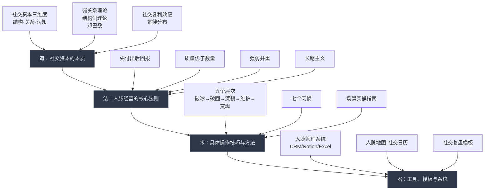
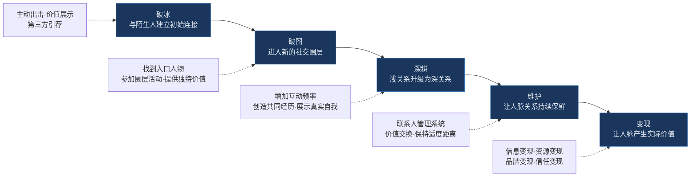
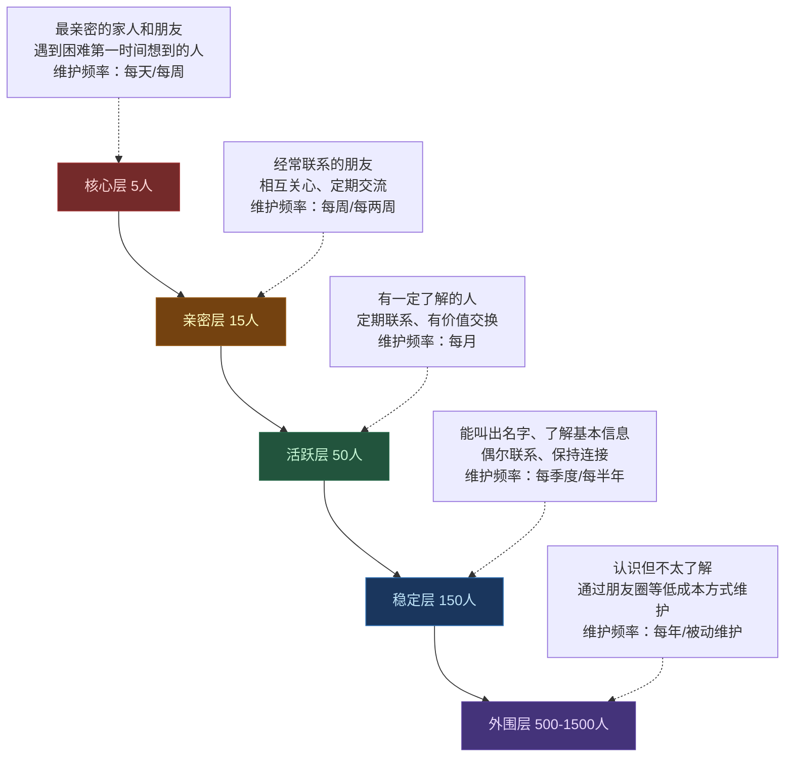

# 第16章 本章小结：人脉与社交资本的知识图谱与行动框架

本章从理论基础、核心技巧、实战案例、常见误区、练习方法五个维度，系统构建了人脉与社交资本的完整知识体系。本小结将对全章内容进行结构化梳理，帮助你建立全局视角，并提供一套可立即执行的行动方案。

## 一、本章知识体系全景

### 1.1 道法术器四层结构

本章的知识体系遵循"道法术器"四层递进结构：

**道——社交资本的本质**：社交资本是通过社会关系网络获得的资源总和，包含结构维度（网络规模与形态）、关系维度（信任与情感深度）、认知维度（共享语言与价值观）。布尔迪厄指出经济资本、文化资本、社交资本三者可相互转化；帕特南从宏观层面论证了社会资本对经济发展的推动作用。理解"道"层，才能把握人脉经营的底层逻辑，而非停留在技巧表面。

**法——核心法则**：弱关系带来信息优势（格兰诺维特），结构洞位置创造连接者价值（伯特），邓巴数限制了稳定关系上限（约150人），社交投资存在复利效应。这些法则共同指向四条行动纲领：先付出后回报、质量优于数量、强弱关系并重、坚持长期主义。

**术——操作技巧**：人脉建立的五个层次（破冰→破圈→深耕→维护→变现）、高效社交的七个习惯、不同社交场景的实操指南（商务社交、线上社交、深度社交）、高价值人脉的识别与接近策略、跨文化社交技巧。

**器——工具与系统**：人脉管理系统（微信标签、Notion数据库、专业CRM）、人脉地图绘制方法、社交日历规划、社交复盘日记模板。工具是手段，真诚才是核心——再精密的系统也无法替代真实的价值交换。

### 1.2 核心理论之间的关联网络

本章涉及的五大理论并非孤立存在，而是形成了一个相互支撑的理论网络：

| 理论 | 提出者 | 核心观点 | 与其他理论的关系 | 搞钱启示 |
|------|--------|----------|------------------|----------|
| 社会资本理论 | 布尔迪厄、科尔曼、帕特南 | 社会关系网络是一种可转化为经济回报的资本 | 为其他四个理论提供宏观框架 | 参与组织、积累人脉本身就是投资 |
| 弱关系理论 | 格兰诺维特（1973） | 弱关系桥接不同圈子，带来新信息和机会 | 是结构洞理论的前身；与邓巴数互补 | 主动拓展跨圈子人脉，维护弱关系成本低 |
| 结构洞理论 | 伯特（1992） | 占据两个不相连群体之间空隙的人获得信息和控制优势 | 深化了弱关系理论；解释了超级连接者的价值 | 成为不同圈子的连接者，整合跨领域资源 |
| 邓巴数理论 | 邓巴（1990s） | 稳定社交关系上限约150人，分5/15/50/150/500/1500层 | 限制了人脉经营的规模，强调质量优先 | 分层管理人脉，将精力集中在高价值关系 |
| 社交复利理论 | 综合多位学者 | 社交投资回报呈指数增长，长期坚持产生复利效应 | 是弱关系理论和结构洞理论的时间维度延伸 | 先付出不求回报，信任积累后机会自动涌现 |

理解这些理论之间的关联，能帮助你在实际操作中灵活运用，而不是机械地套用某一条法则。

## 二、核心要点分层回顾

### 2.1 理论基础回顾：六个关键认知

**认知一：社交资本有三个维度。** 结构维度关注你认识多少人、覆盖多少领域；关系维度关注你与关键人物之间的信任深度；认知维度关注你们是否有共同的语言和价值观。三维度缺一不可——只有广度没有深度是"通讯录人脉"，只有深度没有广度是"圈子局限"，缺少认知维度则无法实现有效沟通。

**认知二：弱关系比强关系更擅长带来新机会。** 格兰诺维特的研究证实，大多数人找到工作不是通过密友，而是通过偶尔联系的熟人。原因在于强关系圈子信息高度重叠（信息冗余度高），而弱关系桥接不同社交圈，能带来你原本接触不到的信息。LinkedIn数据显示，通过二度人脉获得的工作机会比一度人脉多出60%以上。但这不意味着强关系不重要——在中国"关系"文化中，强关系提供的深度信任（资金借贷、信用担保）是弱关系无法替代的。最优策略是"强弱并重"。

**认知三：占据结构洞位置就是占据了信息枢纽。** 伯特的研究发现，在企业中占据更多结构洞位置的人获得更高的薪酬和更快的晋升。因为结构洞位置同时提供三种优势：信息优势（获得两个圈子的信息）、控制优势（控制信息流向）、创新优势（不同观念碰撞产生新想法）。Uber创始人同时了解科技行业和出租车行业，发现了两者之间的结构洞，创造了共享出行模式。

**认知四：邓巴数是人脉经营的"物理定律"。** 邓巴将社交关系分为五层——亲密关系（5人）、好朋友（15人）、朋友（50人）、认识的人（150人）、泛泛之交（500-1500人）。Facebook的研究证实，即使有数千个"好友"，真正互动的人数仍在150人以内。这意味着人脉经营必须分层管理，把80%的精力投入到最核心的30-50人。

**认知五：社交投资存在复利效应。** 今天帮助的一个人，可能在未来帮你连接到整个新圈子。这种回报不是线性的，而是指数级的——当你的社交网络达到临界质量后，机会会自动找上门。这就是为什么"急于变现"是最差的策略：急于求回报的人回报最低，不计回报地帮助他人的人反而获得最大回报。

**认知六：社交网络遵循幂律分布。** 少数人拥有大量连接（超级连接者），大多数人只有少量连接。识别和连接这些关键节点非常重要——一个超级连接者可能帮你打开一个全新的世界。六度分隔理论则告诉我们，理论上你可以认识世界上任何一个人，关键在于是否有意识地去建立这些连接。

### 2.2 核心技巧回顾：五个层次与七个习惯

**人脉建立的五个层次**是本章的方法论主干：

每个层次的核心要领：

| 层次 | 核心动作 | 关键心态 | 常见错误 |
|------|----------|----------|----------|
| 破冰 | 主动开口、找共同点、展示价值 | "我能为你做什么" | 被动等待、开场无聊、过度推销 |
| 破圈 | 找到守门人、参加圈层活动、提供独特价值 | "用价值换入场券" | 盲目追求高端、没有差异化价值 |
| 深耕 | 增加互动频率、共同经历、展示真实 | "真诚比完美重要" | 只在需要时联系、不敢展示脆弱 |
| 维护 | 系统化管理、定期价值交换、适度距离 | "关系需要持续投入" | 不做记录、过于频繁或疏远 |
| 变现 | 信息整合、资源对接、品牌背书 | "互利共赢而非利用" | 功利心太强、急于求成 |

**高效社交的七个习惯**构成了日常行为框架：

1. **每周认识一个新朋友**——保持人脉网络的增长活力
2. **每天维护三个老关系**——15分钟的投入防止关系生锈
3. **每月组织一次聚会**——将不同圈子的朋友连接起来，巩固超级连接者地位
4. **每季度做一次人脉盘点**——审视网络结构，发现盲区和机会
5. **先付出，后索取**——这是所有成功人脉经营者的共同特征
6. **做一个超级连接者**——主动介绍可能互相帮助的人认识
7. **持续提升自身价值**——人脉的本质是价值交换，你自身有价值才能吸引有价值的人脉

### 2.3 实战案例的共同规律

本章通过七个真实案例（程序员创业、宝妈社群创业、销售冠军、跨行业资源整合、退休人士、线上到线下、社交恐惧突破）揭示了人脉变现的共同规律：

**规律一：价值先行是所有人脉变现的起点。** 程序员先在技术社群免费解答问题建立信任，宝妈先在妈妈群分享育儿知识积累影响力，销售冠军先为客户解决超出工作范围的问题。没有人是通过"索取"打开人脉大门的。

**规律二：信任是人脉变现的前提条件。** 信任的建立需要时间、一致性、可靠性三个要素。信任的破坏是瞬间的——一次失信可能毁掉多年积累。所有案例中，信任建立到变现之间都经历了足够长的"酝酿期"。

**规律三：系统化方法将偶然变成必然。** 成功者都有系统化的人脉管理方法——不是随意社交，而是有目标、有计划、有记录、有复盘。销售冠军维护着详细的客户档案，宝妈用社群运营的SOP管理人际关系。

**规律四：利他思维带来最大的长期回报。** 退休人士利用自己的行业经验无偿为年轻人提供咨询，最终获得了远超预期的商业合作机会。这不是运气，而是利他行为在社交复利效应下的必然结果。

### 2.4 必须避开的十大误区

误区的本质是认知偏差。以下是本章揭示的十大误区及其深层原因：

| 误区 | 表面行为 | 深层原因 | 正确做法 |
|------|----------|----------|----------|
| 追求人脉数量 | 疯狂加微信、换名片 | 误将"认识"等同于"人脉" | 深耕少量高质量关系 |
| 功利性太强 | 只在需要时才联系别人 | 短视思维，看不到社交复利 | 平时保持联系，先付出后回报 |
| 只和"有用"的人社交 | 以地位财富判断人的价值 | 缺乏对弱关系价值的认知 | 保持开放心态，真诚对待每个人 |
| 忽视关系维护 | 认识后从不跟进 | 低估关系衰退的速度 | 建立系统化维护机制 |
| 不会拒绝无效社交 | 什么聚会都参加 | 缺乏社交边界意识 | 先评估价值，礼貌拒绝低质量社交 |
| 过度依赖线上社交 | 加微信就算建立了人脉 | 深层信任需要面对面建立 | 线上认识，线下深化 |
| 不会借助第三方力量 | 只知道直接搭讪 | 不理解信任背书的加速作用 | 善用引荐，请信任的人介绍 |
| 忽视个人品牌 | 只顾认识别人，不展示自己 | 不理解"被动社交"的价值 | 持续输出内容，让别人主动找你 |
| 急于变现 | 刚认识就谈合作要资源 | 缺乏长期主义思维 | 先建立信任，小项目试水，逐步深化 |
| 忽视人脉多样性 | 只和同行业同背景的人社交 | 舒适区心理，缺乏跨圈意识 | 主动结交不同领域的人 |

## 三、关键模型与公式

### 3.1 社交资本价值模型

人脉的综合价值可以用以下模型理解：

**人脉价值 = 关系质量 × 网络规模 × 信任程度 × 价值交换频率**

这个公式的四个变量不是简单的加法关系，而是乘法关系——任何一个变量趋近于零，整体价值都趋近于零：

- **关系质量为零**（通讯录里有1000人但没有一个真正的朋友）→ 价值为零
- **网络规模为零**（只有3个亲密朋友，不认识任何其他人）→ 价值极低
- **信任程度为零**（认识很多人但没有人信任你）→ 价值为零
- **价值交换频率为零**（有信任有网络但从不互动）→ 价值为零

四个变量的优先级排序：**信任程度 > 关系质量 > 价值交换频率 > 网络规模**。先建立信任，再提升质量，保持互动频率，最后才是扩大规模。

### 3.2 人脉分层管理模型

基于邓巴数理论的人脉分层管理：

每层关系的维护策略截然不同。核心层需要深度投入（定期见面、深度交流），外围层则用低成本方式维持（朋友圈互动、节日群发）。错误的做法是将所有关系一视同仁——要么精力耗尽，要么每层都维护不好。

### 3.3 社交投资的复利曲线

社交资本的增长遵循一条先平缓后陡峭的指数曲线：

- **投入期（0-6个月）**：大量投入时间和精力，回报几乎看不到。大多数人在这个阶段放弃。
- **积累期（6-18个月）**：开始收到零星的回馈，但投入仍大于产出。关键是保持耐心。
- **加速期（18-36个月）**：网络达到临界质量，机会开始主动找上门，投入产出比开始逆转。
- **复利期（36个月+）**：社交资本产生"滚雪球"效应，每一次价值交换都会引发新的连接和机会。

理解这条曲线的意义在于：**不要在投入期就判断"社交没用"**。很多人脉的价值在数年后才会显现。

## 四、综合行动方案

### 4.1 第一周：建立基础

| 天数 | 行动 | 预期时间 | 产出 |
|------|------|----------|------|
| 第1天 | 绘制人脉地图：列出50个重要联系人，按行业和亲密度分类 | 30分钟 | 人脉地图初稿 |
| 第2天 | 评估人脉网络：找出密集区和空白区，标注关键节点 | 20分钟 | 人脉分析报告 |
| 第3天 | 打磨30秒自我介绍：写出初稿、精简到100字、准备2-3个版本 | 20分钟 | 自我介绍定稿 |
| 第4天 | 对着镜子练习自我介绍5遍，录音回听调整 | 15分钟 | 熟练的自我介绍 |
| 第5天 | 选择并搭建人脉管理工具（Notion/Excel/微信标签） | 30分钟 | 可用的管理系统 |
| 第6天 | 给一个很久没联系的朋友发问候信息 | 5分钟 | 一次关系激活 |
| 第7天 | 复盘本周行动，制定下周计划 | 15分钟 | 个人社交周报 |

### 4.2 第一个月：建立习惯

| 周 | 重点任务 | 每日习惯 |
|----|----------|----------|
| 第1周 | 人脉地图+自我介绍+管理系统 | 给1个老关系发消息 |
| 第2周 | 主动社交挑战（一周七天不同任务） | 朋友圈互动3-5人 |
| 第3周 | 弱关系激活（从通讯录中选20人分组联系） | 社交复盘日记 |
| 第4周 | 参加一次行业社交活动，实践破冰技巧 | 记录社交能量变化 |

### 4.3 持续行动：构建社交飞轮

完成前四周的启动后，将以下行为变成日常习惯，构建"社交飞轮"——投入→信任→机会→更大的投入→更深的信任→更多的机会：

**每日（15分钟）**
- 维护3个老关系（点赞、评论、转发有价值的内容）
- 社交复盘日记（记录当天的社交互动和感受）

**每周（2小时）**
- 认识1个有质量的新朋友（通过活动、社群或引荐）
- 给2-3个重要人脉发个性化信息（不是群发）
- 更新人脉管理系统（补充新联系人信息、标注互动记录）

**每月（半天）**
- 组织或参加1次小规模聚会
- 与5-10个重要人脉进行深度交流（面对面或视频）
- 人脉盘点：审视网络结构，识别需要加强或淡化的关系

**每季度（1天）**
- 全面人脉盘点：重新绘制人脉地图，对比上季度变化
- 拓展计划：确定下季度要进入的新圈子和要认识的新类型人脉
- 社交策略调整：根据实际情况优化维护频率和方式

**每年（1个周末）**
- 年度社交资本审计：评估人脉网络的整体质量和变现能力
- 个人品牌年度复盘：审视自己在社交网络中的定位和影响力
- 下一年社交目标设定：明确要进入的圈层、要建立的关系类型

## 五、从理论到实践的最后一步

### 5.1 最容易被忽视的三个真相

**真相一：你的社交天花板取决于你的个人价值上限。** 所有的人脉技巧都是放大器，但放大器不能放大零信号。如果你自身没有专业能力、没有可交换的价值，再高超的社交技巧也无法帮你建立真正有价值的人脉。持续提升自身价值，是人脉经营的根本——不是"之一"，而是"根本"。

**真相二：人脉经营的最大敌人不是"不会社交"，而是"不持续"。** 社交复利效应需要时间才能显现。那些看似"人脉很广"的人，并不比你更擅长社交，他们只是更早开始、更久坚持。每周花2小时维护人脉，坚持3年，你会发现一个完全不同的社交世界。

**真相三：最强大的人脉网络不是"认识很多人"，而是"被很多人信任"。** 当你的名字成为某个领域的"信任符号"——提到某个问题时人们会说"去找他/她"——你就已经建立起了真正的社交资本。这比通讯录里有10000个联系人更有价值。

### 5.2 本章核心金句

> **人脉不是你认识多少人，而是多少人认识你、信任你、愿意帮你。**

这句话值得每天提醒自己一遍。它浓缩了本章全部内容的精华：

- "认识你"——你需要有存在感和个人品牌（对应个人品牌建设、内容输出）
- "信任你"——你需要用时间和行动证明自己的可靠性（对应长期主义、价值先行）
- "愿意帮你"——你需要先帮助过别人，才能在需要时获得帮助（对应先付出后回报、社交复利）

当你真正理解并践行这个理念时，人脉经营就不再是"社交负担"，而是一种自然而然的生活方式——你帮助别人，因为这本身就是对的事情；你维护关系，因为你真心关心这些人；你拓展圈子，因为你对世界保持好奇。财富只是这种生活方式的副产品。

## 六、下一章预告

下一章，我们将进入人生阶段规划的第一部分——20-30岁的积累期。这是人生中最关键的十年，如何在这个阶段打下坚实的财富基础？如何在有限的资源下最大化积累效率？如何平衡职业发展、财务积累和个人成长？我们将在下一章详细探讨。

社交资本的积累同样需要配合人生阶段来规划——20多岁应该重在破圈和弱关系拓展，30多岁应该重在深耕和结构洞布局，40多岁应该重在变现和价值传递。下一章将为你描绘这幅完整的人生-财富-社交蓝图。