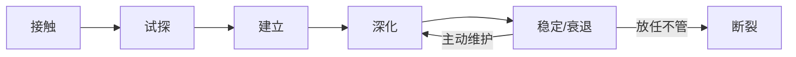
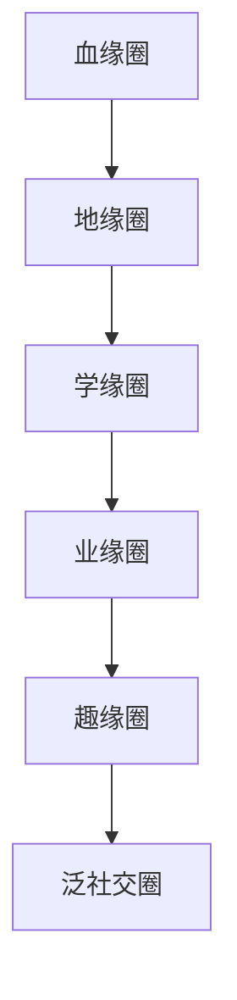

# 深度拓展：人脉与社交资本的前沿视角

本章前六节已系统覆盖社交资本的核心理论（弱关系、结构洞、邓巴数）、实操技巧（人脉建立五层次、高效社交习惯、CRM管理）和真实案例。本节作为全章的纵深拓展，聚焦三个方向：**理论前沿**（心理学与神经科学如何解释社交行为）、**高阶策略**（危机人脉、跨文化社交、内向者路径）、**系统思维**（网络动态演化与社交资本的复利模型）。如果你已完成前面的学习，本节将帮你构建一个更完整的认知框架。

---

## 一、社交行为的心理学与神经科学基础

理解"人脉为什么有效"不能只停留在社会学层面。近年来，认知心理学和神经科学的研究揭示了社交行为的生物学机制，这些发现对实操有直接指导意义。

### 1.1 催产素与信任建立的神经机制

神经经济学家保罗·扎克（Paul Zak）的研究表明，催产素（Oxytocin）是人类建立信任的关键神经递质。当人与人之间进行积极的社交互动——如眼神交流、共同进餐、互赠礼物——大脑会释放催产素，降低对陌生人的防御心理，增加信任感。

**实操启示：**

- **面对面互动不可替代**：线上沟通无法触发同等强度的催产素释放。这就是为什么即便视频会议如此发达，高端商务关系的建立仍然依赖线下面对面交流。研究显示，面对面会议后双方的信任评分比纯视频会议高出30%-40%。
- **共同体验加速信任**：一起运动、一起用餐、一起参加活动，比单纯喝咖啡聊天更能建立深度信任。扎克的实验发现，共同参与一个需要协作的活动（如密室逃脱、团队运动）后，参与者之间的信任度提升约50%。
- **身体接触的边界**：适当的握手、拍肩等社交性身体接触能促进催产素分泌，但必须尊重文化差异和个人边界。在中国商务场景中，握手是最安全的选择；在关系更近的场景中，拍肩、碰杯等动作可以自然使用。

### 1.2 邓巴数的神经科学解释

罗宾·邓巴（Robin Dunbar）提出的"150定律"有坚实的神经科学基础。他发现，人类新皮层（neocortex）的大小与社会群体规模呈正相关。新皮层负责处理复杂的社会信息——识别面孔、理解意图、记忆关系历史。人类大脑的新皮层比例决定了我们能维持稳定社交关系的上限约为150人。

邓巴进一步将这150人细分为四个层级：

| 层级 | 人数 | 关系特征 | 维护方式 |
|------|------|----------|----------|
| 核心圈 | ~5人 | 最亲密的关系（伴侣、至亲、挚友），遭遇重大危机时你会第一时间求助 | 每周多次深度互动 |
| 亲密圈 | ~15人 | 好朋友，定期见面聊天，彼此了解近况 | 每周至少一次联系 |
| 活跃圈 | ~50人 | 朋友，知道对方的基本情况，偶尔聚会 | 每月至少一次互动 |
| 认知圈 | ~150人 | 认识且能叫出名字，了解对方背景 | 每年至少一次联系 |

**关键洞察：** 每一层级的人数大约是上一层级的3倍，这反映了大脑处理社交信息的"分形"结构。这意味着你不能跳过内层直接经营外层——如果核心圈只有2个人（远低于5人），你的整个社交网络都会不稳定，因为你缺少情感锚点。

**实操建议：**

1. 先检查核心圈是否健康。如果核心圈不到3人，优先深化现有关系而非拓展新关系。
2. 每个层级的关系维护时间大致相等——15人亲密圈需要的时间约等于5人核心圈。因此不要试图无限扩张外层，那会挤占内层的维护时间。
3. 当你需要将一个150圈的人升级到50圈，需要的不是更多寒暄，而是共同经历——合作一个项目、一起参加培训、互相帮助度过一个难关。

### 1.3 互惠原理的深层机制

罗伯特·西奥迪尼（Robert Cialdini）在《影响力》中将"互惠"列为六大说服原则之首。神经科学研究进一步揭示了其机制：当人收到礼物或帮助时，大脑的伏隔核（nucleus accumbens）——即"奖赏中枢"——会被激活，同时产生一种心理负债感，驱动回报行为。

**互惠的三个层次：**

- **物质互惠**：请客送礼、资源互换。这是最表层的互惠，效果立竿见影但不持久。典型场景：逢年过节的礼品往来。
- **信息互惠**：分享有价值的信息、行业洞察、市场机会。这是中层互惠，价值密度更高。典型场景：转发一篇对方可能感兴趣的研究报告，附上你的简要分析。
- **情感互惠**：在对方低谷时给予支持、在对方成功时真诚祝贺、在对方迷茫时提供建议。这是最深层的互惠，建立的情感纽带最难被替代。典型场景：在朋友创业失败时不请自到地陪伴和鼓励。

**高级互惠策略——"预付信任"：** 在没有明确回报预期的情况下主动帮助他人。这种"预付"行为的回报率远高于等价交换。沃顿商学院亚当·格兰特（Adam Grant）在《Give and Take》中的研究表明，长期来看，"给予者"（Givers）在职业成就上两极分化——最成功的和最失败的都是给予者。区别在于：成功的给予者会设置边界，不会无底线地牺牲自己；他们的给予是策略性的，优先帮助那些懂得感恩和传递的人。

---

## 二、网络动态演化：人脉不是静态资产

大多数关于人脉的讨论都把社交网络当成静态的——你有多少联系人、他们分别是什么关系。但真实的社交网络是活的、流动的、不断重组的。理解网络的动态演化规律，才能制定长期有效的社交策略。

### 2.1 社交网络的生命周期

一段人脉关系从建立到消亡，通常经历五个阶段：

**第一阶段：接触（Encounter）**——你们在某个场合第一次见面。这个阶段的关键不是留下深刻印象，而是留下"可联系"的理由。交换联系方式时，附带一个具体的后续行动点（如"我把那篇文章发给你"），比单纯的"以后多联系"有效10倍。

**第二阶段：试探（Exploration）**——双方通过几次互动评估对方的价值和可信度。这个阶段最容易犯的错误是"用力过猛"——频繁邀约、过度热情反而会让对方产生防御心理。正确的方式是保持适度的节奏，每次互动都提供一些价值（信息、资源、情感支持），同时观察对方的回应质量。

**第三阶段：建立（Establishment）**——经过几次有价值的互动后，关系从"认识"升级为"熟悉"。标志性事件是双方开始主动联系对方（而不是单方面发起），并且在非正式场合也愿意花时间相处。

**第四阶段：深化（Deepening）**——关系进入深度信任阶段。标志性特征包括：分享个人信息和脆弱面、在对方不在场时为其说话、主动为对方引荐自己的核心人脉。这个阶段需要时间和共同经历来沉淀，无法加速。

**第五阶段：稳定或衰退（Stability/Decline）**——成熟的关系要么保持稳定（定期互动、持续交换价值），要么因生活轨迹变化而逐渐衰退。衰退不代表关系失败——很多人脉在沉寂多年后可以被重新激活，前提是当初建立的基础足够扎实。

### 2.2 网络断裂与重建

社交网络的断裂是不可避免的。工作变动、城市迁移、人生阶段转换都会导致关系流失。研究显示，人们平均每7年会流失约50%的非核心社交关系。

**降低流失率的策略：**

- **建立"弱信号"维护机制**：不需要频繁互动，但保持对方知道你还"活着"。朋友圈点赞、节日问候、偶尔分享对方可能感兴趣的内容——这些低成本动作能让关系处于"待机"状态而非"断线"状态。
- **创造"节点事件"**：每年组织一次小型聚会（如老同事聚餐、同学年度聚会），让多条关系线同时被激活。节点事件的效率远高于逐一维护。
- **记录关系资产**：用CRM工具（详见核心技巧第四节）记录每个人的关键信息和上次互动时间。当系统提示某人超过6个月未联系时，发一条个性化的消息。

### 2.3 社交网络的"反脆弱性"

纳西姆·塔勒布提出的"反脆弱"概念同样适用于社交网络。一个健康的社交网络应该能从冲击中变得更强，而不是一碰就碎。

**反脆弱社交网络的特征：**

- **多元化**：不把所有鸡蛋放在一个篮子里。如果80%的人脉都来自同一个行业、同一个公司、同一个城市，那么一次行业衰退或公司变故就会摧毁你大部分的社交资本。
- **冗余性**：关键功能不依赖单一个体。如果你的信息来源只靠一个人，一旦这个人失联，你就失去了信息渠道。理想状态是每类关键功能至少有2-3个替代来源。
- **可重组性**：网络中的节点能够快速重新组合，形成新的连接。这意味着你需要一些"桥梁型"人脉——他们连接着不同的社交圈，能够在你需要时快速引荐新的关系。

**诊断你的社交网络是否反脆弱：**

1. 列出你最重要的5个信息来源。如果其中3个以上来自同一个圈子，你的网络脆弱。
2. 想象你换了一座城市生活。你的社交网络中还有多少关系能够维持？如果低于20%，你需要拓展地理多样性。
3. 你的"关键人脉"（最不可替代的3个人）各自连接着多少不同的社交圈？如果他们彼此高度重叠，你的网络存在单点故障风险。

---

## 三、高阶社交策略

### 3.1 危机时期的人脉激活

大多数人脉管理的讨论都聚焦于"好时候"——如何拓展、如何维护、如何变现。但人脉的真正价值往往在危机时刻才显现。2020年新冠疫情初期，那些拥有高质量人脉的企业家能够更快获得政策信息、供应链资源和融资渠道，渡过难关的成功率显著高于社交网络薄弱的企业家。

**危机时期的人脉激活策略：**

**第一层：信息获取（24小时内）**
危机发生后，第一时间联系你网络中信息最灵通的人——行业分析师、政策研究者、资深从业者。不要问"发生了什么"（新闻已经报道了），而要问"你判断接下来会怎样"和"你身边的人在怎么做"。获取的不是事实，而是判断和趋势。

**第二层：资源动员（72小时内）**
根据危机性质，识别你需要的资源类型（资金、物资、人力、信息），然后在社交网络中寻找资源持有者。关键是降低对方的决策成本——不要说"我需要帮助"，而要说"我需要X具体资源，用来解决Y问题，预计Z时间内可以归还/回报"。

**第三层：互助网络构建（1-2周内）**
危机中最有效的不是一对一求助，而是构建互助网络。拉一个5-10人的小群，每个人贡献自己最擅长的能力，形成资源互补。这种基于危机建立的互助网络，往往在危机过后会转化为深度的长期合作关系。

**重要提醒：** 危机人脉的"存款"必须在平时完成。如果你平时不维护关系，危机时突然求助，成功率极低。这就是为什么日常维护看似"无用"，实则是在为未来的危机做准备。

### 3.2 内向者的社交路径

社交不是外向者的专利。苏珊·凯恩（Susan Cain）在《安静：内向性格的竞争力》中指出，内向者在社交中拥有独特优势：更善于深度倾听、更擅长一对一交流、更容易建立深度信任关系。

**内向者的社交优势策略：**

**策略一：内容社交（Content Networking）**
通过写作、创作、分享专业内容来吸引人脉，而非主动出击。在知乎、公众号、LinkedIn发布高质量的专业文章，让感兴趣的人主动找到你。这种"被动社交"模式完美契合内向者的特质——你不需要在社交场合主动搭讪，只需要持续输出价值。

**策略二：小圈子深耕（Deep Small Groups）**
内向者不适合大型社交活动（如几百人的行业峰会），但非常适合小规模深度交流（如5-8人的私董会、读书会、技术沙龙）。在小圈子中，内向者的倾听和思考能力成为优势，能够建立比大型活动深得多的关系。

**策略三：一对一深度会面（One-on-One Meetings）**
内向者在一对一场景中表现最佳。将社交活动拆解为一系列一对一的咖啡会谈，每次只和一个人深入交流。频率可以低（每周1-2次），但质量要高（每次会谈至少60分钟，聊对方最关心的话题）。

**策略四：结构化社交（Structured Socializing）**
给社交活动设定明确的结构和目标，减少不确定性带来的焦虑。例如：参加行业活动前，提前研究参与者名单，选定2-3个想认识的人，准备3个话题。活动开始后直接执行计划，完成后即可离开。

### 3.3 跨文化社交的深度策略

在全球化和远程工作常态化的今天，跨文化社交能力越来越重要。但大多数人的跨文化社交停留在"注意礼貌差异"的表层。真正的跨文化社交能力包括三个层次：

**第一层：文化维度认知**

霍夫斯泰德（Geert Hofstede）的文化维度理论为跨文化社交提供了分析框架：

| 维度 | 低分文化特征 | 高分文化特征 | 社交影响 |
|------|-------------|-------------|----------|
| 权力距离 | 平等、扁平 | 等级分明 | 低权力距离文化中可以直接约见高层；高权力距离文化中需要正式引荐 |
| 个人主义 | 集体利益优先 | 个人利益优先 | 集体主义文化中"关系"更重要；个人主义文化中"能力"更受重视 |
| 不确定性规避 | 容忍模糊 | 追求确定 | 高规避文化中合同和规则更重要；低规避文化中灵活应变更被接受 |
| 长期导向 | 短期回报 | 长期投资 | 长期导向文化中关系建立需要更多耐心 |

**第二层：沟通风格适配**

- **高语境文化**（中国、日本、阿拉伯）：沟通依赖上下文和暗示，"面子"很重要，冲突通过第三方协调，"不"往往不会直接说出口。
- **低语境文化**（美国、德国、北欧）：沟通直接明确，冲突当面解决，"不"就是"不"。

在跨文化商务社交中，误判对方的沟通语境是最常见的错误。一个美国商人可能把中国合作伙伴的"我们再研究研究"理解为积极信号，实际上这往往是委婉的拒绝。

**第三层：信任建立路径差异**

- **关系导向型文化**（中国、中东、拉美）：先建立个人关系，再谈生意。信任建立在共同用餐、互相了解家庭、多次非正式接触的基础上。
- **任务导向型文化**（美国、北欧、澳大利亚）：先通过专业表现建立信任，个人关系可以后补。信任建立在合同、绩效和专业能力的基础上。

---

## 四、社交资本的复利模型

### 4.1 社交资本的复利效应

人脉的价值增长遵循复利规律，而非线性增长。每一次有价值的互动都在现有基础上增加信任，而信任的积累会产生"利息"——更多的合作机会、更大的信息网络、更强的声誉效应。

**社交资本复利的三个驱动因素：**

1. **网络效应**：你认识的人越多，每个人脉的价值越高（因为他们可以连接到更多人）。这就是为什么社交资本的边际价值递增——第100个人脉比第10个人脉更有价值。
2. **信任积累**：每次互动都在增加信任存量。当信任超过某个阈值后，关系会从"普通熟人"跃迁为"深度伙伴"，随之而来的是全新的合作可能性。
3. **声誉放大**：当你的声誉在社交网络中传播时，会吸引主动找上门的机会，形成"被动收入"——不需要你主动寻找，机会会自动流向你。

### 4.2 社交资本的时间窗口

社交资本的积累存在关键时间窗口。研究表明：

- **25-35岁**：社交网络扩张的黄金期。这个阶段的职业变动频繁，每次变动都是拓展新人脉的机会。同时，同龄人正处于事业上升期，早期建立的关系在未来20年会产生巨大复利。
- **35-45岁**：社交网络优化期。你应该开始有意识地"修剪"低质量关系，将维护时间集中在高价值人脉上。这个阶段也是从"广撒网"转向"深耕耘"的转折点。
- **45岁以上**：社交资本变现期。你积累的人脉网络开始大规模产出——商业合作、投资机会、行业影响力。但前提是前两个阶段的投入足够扎实。

**不意味着晚了就不用做。** 任何年龄开始积累社交资本都有价值，只是策略不同：35岁以后应该更聚焦、更有策略性，而不是像25岁时那样广泛接触。

### 4.3 社交资本的损耗与修复

社交资本会损耗。以下行为会加速损耗：

- **单方面索取**：只在需要帮助时才联系别人，是最常见的社交资本"提现"行为。当你的"账户余额"耗尽时，关系就会断裂。
- **背叛信任**：泄露对方的隐私、违背承诺、在背后说坏话——任何一次信任背叛都可能导致关系永久性断裂。
- **忽视维护**：长时间不联系不代表关系"还在"。研究表明，超过6个月没有任何互动的关系，信任度会自然衰减约20%。
- **过度交易化**：把每次互动都当作交易，精确计算付出和回报。这种心态会让对方感到被利用，导致关系退化。

**修复受损关系的步骤：**

1. **承认错误**：如果你是过错方，直接承认，不找借口。"上次的事情是我不对"比"当时情况特殊"有效得多。
2. **提供超额补偿**：仅仅是道歉不够，需要通过实际行动证明你的诚意。帮助对方一个忙、提供一个有价值的机会、或者在对方需要时无条件支持。
3. **给时间**：信任修复需要时间。不要期望道歉后关系立刻恢复如初，给对方足够的空间和时间。
4. **重建一致性**：通过一系列小的承诺和兑现，逐步重建对方对你的信任。每次说到做到都在为信任"充值"。

---

## 五、中国商业社交的深层逻辑

### 5.1 关系（Guanxi）的学术解构

"关系"不是简单的"走后门"或"送礼"。学者陈介玄和黄光国的研究将中国式关系分解为三个层次：

- **情感性关系**：以亲情、友情为基础的关系，遵循"需求法则"——对方有需要就帮助，不计较回报。核心圈子通常是家人和少数挚友。
- **工具性关系**：以利益交换为基础的关系，遵循"公平法则"——投入和回报大致对等。商业伙伴、行业同行多属于此类。
- **混合性关系**：中国社会最具特色的关系类型，兼具情感和工具属性，遵循"人情法则"——基于面子、人情、报恩的复杂交换逻辑。同学、同乡、战友多属于此类。

**关键区别：** 在西方社会，商业关系通常是工具性的，情感和利益可以分开。在中国社会，商业关系往往需要先转化为混合性关系——通过请客、送礼、帮忙办事等方式注入情感成分——才能达到深度合作。这就是为什么在中国做生意"先做朋友再谈生意"不是一句空话，而是关系逻辑的必然要求。

### 5.2 面子（Mianzi）的社交功能

面子在中国社交中不是虚荣心的体现，而是一种**社交信用体系**。给对方面子 = 承认对方的社会地位和能力 = 对方的社交信用增加。让对方丢面子 = 贬低对方的社会地位 = 严重的信任破坏。

**面子的实操规则：**

- **公开场合永远给面子**：即使对方犯了错误，也不要在公开场合指出。私下提醒远比公开批评有效。
- **适度"抬轿子"**：在第三方面前称赞对方的能力和成就，这种"背书"行为会让对方感受到极大的尊重。
- **请托的艺术**：在中国文化中，"帮忙"是一种面子行为——你请求对方帮忙，实际上是承认对方的能力和资源（给面子），而不是单纯的索取。适度请托反而能加深关系。
- **还人情要及时**：欠人情不还是社交大忌。但"还人情"的方式需要讲究——直接还同等价值的东西显得太"交易化"，更好的方式是在对方需要时自然地提供帮助。

### 5.3 中国商业社交的圈层结构

中国商业社交呈现明显的圈层结构，从内到外依次为：

- **血缘圈**（家族）：信任度最高，资源共享最充分，但也最容易产生利益纠葛。
- **地缘圈**（同乡）：温州商会、潮汕商会、福建商会等地方商业网络是中国民营经济的重要基础设施。
- **学缘圈**（同学）：长江商学院、中欧商学院、清华北大EMBA等高端教育项目的校友网络，是当代中国最有价值的社交资本之一。
- **业缘圈**（同行）：行业协会、专业社群、行业论坛中建立的关系。
- **趣缘圈**（兴趣）：高尔夫球会、车友会、读书会、跑步社群等基于共同兴趣建立的社交圈。
- **泛社交圈**：线上社交平台上的弱关系网络。

**策略启示：** 不要只在一个圈层中深耕。最有价值的人脉往往来自于圈层交叉点——一个既是你的校友、又是你的同行、还是你的邻居的人，关系深度和信任度远超单一圈层的连接。

---

## 六、前瞻：AI时代的社交资本变革

### 6.1 AI对社交资本的冲击

大语言模型和AI工具正在重塑社交资本的价值结构：

**正在贬值的社交资本：**
- **纯信息差**：当AI可以在3秒内回答大多数知识性问题时，"我知道你不知道"的信息优势大幅缩水。
- **基础翻译和跨语言沟通**：AI翻译质量快速提升，语言壁垒降低。
- **简单的牵线搭桥**：LinkedIn等平台的AI推荐已经能自动匹配潜在合作伙伴。

**正在升值的社交资本：**
- **深度信任**：AI无法替代人与人之间的深度信任。在信息爆炸的时代，"我信任这个人的判断"比"我找到了这个信息"更有价值。
- **非公开信息**：行业内部的非正式消息、未公开的政策动向、隐性的权力关系——这些"暗知识"仍然只能通过人脉获取。
- **情感支持**：AI可以提供信息，但不能提供真正的同理心和情感支持。在人遇到困难时，一个朋友的电话比100条AI建议更有力量。
- **资源整合能力**：将不同领域的人、资源、机会连接在一起的能力，仍然高度依赖人的社交网络。

### 6.2 AI赋能社交资本管理

AI工具可以帮助你更高效地管理社交资本：

- **关系提醒**：用AI助手自动分析你的通讯记录，提醒你哪些人超过预期时间未联系，甚至建议个性化的联络话题。
- **内容匹配**：AI可以根据每个人脉的兴趣和需求，自动匹配你阅读过的有价值内容，推荐分享对象。
- **会面准备**：在约见某人之前，让AI快速整理对方的最新动态、公开发言、关注话题，帮助你准备更有针对性的对话内容。
- **社交分析**：AI可以分析你的社交网络结构，识别网络中的弱点（如过度集中在某个圈子、缺少关键桥梁节点）。

**但记住：AI是工具，不是替代品。** 真正的社交资本建立在真诚、信任和长期投入之上，这些无法被算法优化。过度依赖AI管理人脉，反而可能让关系变得"高效但冰冷"。

---

## 本节核心要点回顾

| 主题 | 核心洞察 |
|------|----------|
| 神经科学基础 | 催产素驱动信任，面对面互动不可替代，共同体验加速关系深化 |
| 邓巴数层级 | 5-15-50-150四层结构，优先维护核心圈，每层关系需要不同维护频率 |
| 网络动态演化 | 关系有生命周期（接触→试探→建立→深化→稳定/衰退），需要主动管理 |
| 反脆弱网络 | 多元化、冗余性、可重组性是健康社交网络的三大特征 |
| 危机人脉 | 平时"存款"，危机时才能"取款"，分三步激活：信息→资源→互助 |
| 内向者路径 | 内容社交、小圈子深耕、一对一深度会面、结构化社交 |
| 跨文化社交 | 文化维度认知→沟通风格适配→信任建立路径差异 |
| 复利模型 | 社交资本遵循复利增长，存在关键时间窗口（25-35岁扩张，35-45岁优化，45+变现） |
| 中国关系学 | 情感性/工具性/混合性三层关系，面子是社交信用体系，圈层交叉最有价值 |
| AI时代变革 | 纯信息差贬值，深度信任和非公开信息升值，AI是管理工具而非替代品 |

> 社交资本的终极价值不在于你认识多少人，而在于多少人在关键时刻愿意为你行动。这种信任不是技巧的产物，而是长期真诚投入的自然回报。
