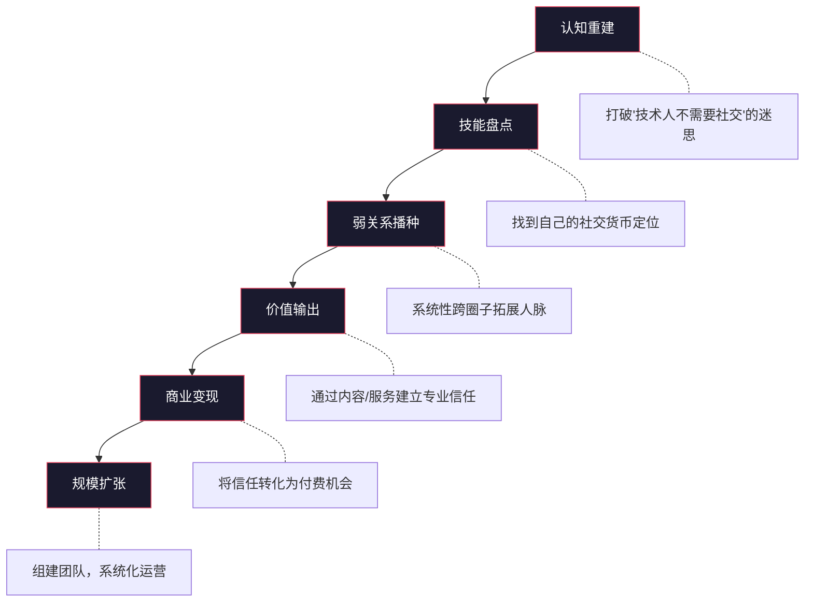
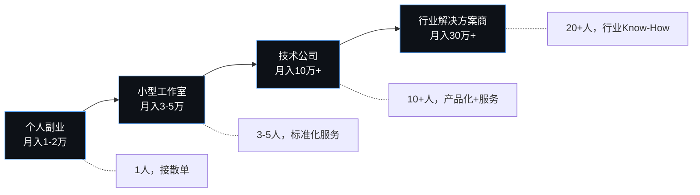

## 案例一：从程序员到创业者的蜕变——一个技术人如何靠社交资本完成从"码农"到CEO的跨越

### 一、案例背景：为什么程序员更需要社交资本？

#### 1.1 主人公画像

张明（化名），28岁，某二线城市互联网公司后端开发工程师，工作4年，技术栈为Java + Spring Boot + MySQL。性格内向偏技术导向，社交圈限于同事和大学同学，几乎没有跨行业人脉。月薪15K，技术能力在团队中属于中上水平，但在公司晋升通道中并不突出。

#### 1.2 他面临的典型困境

大多数程序员到了工作3-5年时，会面临一个共同的瓶颈：

| 困境维度 | 具体表现 | 底层原因 |
|----------|----------|----------|
| 职业天花板 | 技术岗晋升缓慢，管理岗竞争激烈 | 纯技术路线的天花板明显，且技术更迭快 |
| 收入瓶颈 | 工资增长放缓，副业不知道从何做起 | 收入来源单一，完全依赖雇主 |
| 信息茧房 | 只关注技术社区，对商业机会不敏感 | 社交圈单一，弱关系严重不足 |
| 认知局限 | 认为"技术好就够了" | 缺乏跨领域视角，不理解商业逻辑 |
| 社交恐惧 | 不擅长应酬，觉得"社交=虚伪" | 对社交的认知停留在功利层面 |

张明最初的状态，几乎是这个群体的缩影。他的转折点始于一次偶然的社交事件。

#### 1.3 触发转折的事件

2023年3月，张明参加了一个本地的技术沙龙。按他以前的习惯，参加完活动就走，不和任何人深入交流。但这次，他遇到了一位做跨境电商的技术负责人李哥（化名）。两人聊起了自动化运营的技术方案，张明随手分享了自己写的一个数据采集脚本。

李哥看了脚本后非常感兴趣，提出付费请张明帮忙定制一套数据监控系统。这个项目最终收入8000元——这是张明第一次通过"非工资渠道"赚到钱。

**关键洞察**：张明在这次经历中体验到了弱关系理论（格兰诺维特）的威力——带来机会的不是他的同事或好友，而是一个刚认识的陌生人。这次事件成为他后续一系列行动的起点。

### 二、执行过程：从零到一构建社交资本的完整路径

张明的蜕变过程并非一蹴而就，而是经历了一个系统性的、分阶段的演化。以下是他历时18个月的完整路径，拆解为六个阶段。

#### 阶段一：认知重建——打破"技术人不需要社交"的迷思（第1-2个月）

**核心动作**：重新理解社交资本的本质

张明做的第一件事不是去社交，而是学习社交的底层逻辑。他读了三本书：

- 《别独自用餐》（Keith Ferrazzi）：理解"先付出后回报"的社交哲学
- 《弱关系的力量》（格兰诺维特原著解读）：理解为什么跨圈子社交更有价值
- 《影响力》（Robert Cialdini）：理解人际互动中的心理学机制

他总结出了三个认知转变：

| 旧认知 | 新认知 | 行为改变 |
|--------|--------|----------|
| 社交=虚伪应酬 | 社交=价值交换 | 从"推销自己"转变为"为他人提供价值" |
| 技术好就够了 | 技术是敲门砖，关系是通行证 | 开始关注技术之外的商业知识 |
| 认识人多=人脉广 | 被信任=真人脉 | 从追求数量转变为追求深度 |

**实操要点**：

```text
认知重建的 3 个练习：
1. 写下你认识的50个人，标注谁会主动帮你（诚实评估）
2. 回顾过去一年，最大的3次机会是从哪里来的？
3. 如果明天失业，你能通过人脉找到新工作吗？
```

#### 阶段二：技能盘点——找到自己的"社交货币"（第2-3个月）

**核心动作**：明确自己能为别人提供什么价值

张明发现，很多程序员觉得自己"没什么社交价值"，实际上是因为没有系统盘点过自己的资源。他做了一次详细的自我盘点：

**技术类价值**：
- 后端开发能力（Java/Spring Boot/MySQL）
- 数据采集和自动化脚本编写能力
- 系统架构设计经验
- 技术选型和方案评审能力

**非技术类价值**：
- 对互联网行业的理解（可以帮非技术人判断项目可行性）
- 程序员社区的连接（可以帮企业招人）
- 逻辑分析和问题拆解能力（可以帮朋友分析商业问题）

**他提炼出了自己的"社交货币"定位**：

```text
我的一句话价值主张：
"我能帮中小企业用技术手段提升运营效率，
成本是外包公司的1/3，质量是技术团队的水平。"
```

这个定位非常重要——它让张明在社交场合中有了清晰的自我介绍，而不是含糊地说"我是个程序员"。

#### 阶段三：弱关系播种——系统性拓展跨圈子人脉（第3-6个月）

**核心动作**：每月新增10个有价值的弱关系

张明制定了一个"社交拓展计划"，围绕三个方向同时推进：

**方向一：技术圈外的商业人脉**

- 加入本地的创业者社群（不是纯技术社群）
- 参加行业峰会和展会（重点关注电商、教育、本地生活领域）
- 加入付费社群（如知识星球、私董会），这些社群的准入门槛保证了成员质量

**方向二：跨行业技术人脉**

- 参加不同技术栈的Meetup（前端、AI、移动端）
- 加入开源社区，参与跨团队协作
- 在技术论坛（掘金、知乎）持续输出内容

**方向三：潜在客户群体**

- 加入中小企业主社群
- 参加本地商会活动
- 通过朋友介绍认识有技术需求的企业主

**社交执行SOP**：

```text
每次社交活动的标准流程：
┌─────────────────────────────────────────┐
│ 1. 活动前                                │
│    - 了解参会嘉宾名单（如果可能）          │
│    - 确定1-3个想要认识的目标人物           │
│    - 准备好自己的价值主张                  │
├─────────────────────────────────────────┤
│ 2. 活动中                                │
│    - 主动和3个以上陌生人交谈               │
│    - 聊天时关注对方的需求，而非推销自己     │
│    - 记下关键信息（行业、痛点、兴趣）       │
├─────────────────────────────────────────┤
│ 3. 活动后（24小时内）                     │
│    - 添加微信，附上个性化备注              │
│    - 发一条"很高兴认识你"的消息            │
│    - 如果聊天中有提到能帮忙的事，主动跟进   │
├─────────────────────────────────────────┤
│ 4. 后续维护（一周内）                      │
│    - 分享一条对方可能感兴趣的信息           │
│    - 在朋友圈对对方内容点赞/评论            │
│    - 如果有合适的人脉，主动介绍             │
└─────────────────────────────────────────┘
```

#### 阶段四：价值输出——从"认识人"到"被人需要"（第6-9个月）

**核心动作**：通过持续输出建立专业信任

张明意识到，被动地"认识人"是不够的，他需要让别人主动来找他。他采取了三个策略：

**策略一：技术博客 + 开源项目**

张明在掘金和GitHub上开始持续输出，每周发布一篇技术文章。内容不是泛泛而谈的技术教程，而是聚焦在"技术赋能中小企业"这个垂直领域。例如：

- 《500行代码搞定电商数据监控系统》
- 《程序员接单避坑指南：从报价到交付的全流程》
- 《为什么你的小程序开发总超预算？技术人的成本优化方案》

这些文章的阅读量不算高（单篇平均2000-5000阅读），但精准触达了他的目标群体——需要技术解决方案的中小企业主。

**策略二：免费技术咨询**

张明在创业者社群中主动提供免费的技术咨询——帮人评估项目的技术可行性、分析外包报价是否合理、推荐合适的技术方案。这些"免费劳动"实际上是一种社交投资，帮他建立了"技术顾问"的口碑。

**策略三：资源对接**

张明开始有意识地在不同圈子之间做资源对接：

- 帮创业者对接靠谱的UI设计师
- 帮技术朋友对接项目机会
- 帮企业主对接投资人

这正是结构洞理论的实践——张明让自己成为了不同圈子之间的"连接者"。

#### 阶段五：副业验证——从免费价值到付费变现（第9-14个月）

**核心动作**：将社交资本转化为经济资本

经过半年多的积累，张明的人脉网络开始产生实际回报。他的副业收入从零起步，经历了以下增长曲线：

```text
副业收入增长曲线（月收入，单位：元）

15000 |                                              ╭──● 12000
      |                                         ╭───╯
12000 |                                    ╭───╯
      |                               ╭───╯
 9000 |                          ╭───╯
      |                     ╭───╯
 6000 |                ╭───╯
      |           ╭───╯
 3000 |      ╭───╯
      | ●───╯
    0 |───┬───┬───┬───┬───┬───┬───┬───┬───┬───┬───┬───┬───┬───┬───┬───┬───┬───
      M1  M2  M3  M4  M5  M6  M7  M8  M9 M10 M11 M12 M13 M14 M15 M16 M17 M18
```

**收入来源分析**：

| 收入渠道 | 占比 | 来源方式 | 平均客单价 |
|----------|------|----------|------------|
| 定制开发项目 | 45% | 通过人脉直接推荐 | 8000-15000元/项目 |
| 技术顾问咨询 | 25% | 社群口碑传播 | 500-2000元/次 |
| 系统维护服务 | 20% | 老客户续约 | 2000-5000元/月 |
| 技术培训 | 10% | 线下沙龙延伸 | 3000-8000元/期 |

**关键转折点**：

第一个大客户来自他参加创业者社群认识的一个电商老板王总（化名）。王总此前花了5万找外包公司做了一套库存管理系统，结果问题不断。张明免费帮他诊断了问题，并用3天时间修复了核心bug。王总大为感动，直接把后续的系统升级项目（2.5万元）交给了张明，并推荐了3个同行朋友。

这个案例完美体现了社交资本的复利效应：一次免费帮忙 → 获得信任 → 获得大项目 → 获得转介绍 → 更多项目。

#### 阶段六：正式创业——从副业到主业的跨越（第14-18个月）

**核心动作**：组建团队，注册公司，系统化运营

当副业月收入稳定超过1万后，张明做出了一个关键决策：辞去全职工作，注册一家技术服务公司。这个决策的底气来自以下几个条件的成熟：

1. **客户基础**：已有8个稳定付费客户，月均收入12000元以上
2. **口碑积累**：在本地创业者圈子里有了"靠谱技术人"的口碑
3. **团队雏形**：已有2个技术朋友愿意兼职合作
4. **增长预期**：有3-4个意向客户在洽谈中

```text
张明的公司架构（初期）：
┌──────────────────────────────────────────────────┐
│                  张明（创始人/CEO）                │
│         负责：客户关系、项目管理、技术架构          │
├──────────────┬──────────────┬────────────────────┤
│  前端开发     │  后端开发     │  运维/测试          │
│  兼职伙伴A    │  兼职伙伴B    │  兼职伙伴C          │
└──────────────┴──────────────┴────────────────────┘
```

### 三、成果数据：18个月的蜕变清单

| 指标 | 起步时（第0月） | 中期（第9月） | 成熟后（第18月） |
|------|-----------------|---------------|------------------|
| 月收入（副业/主业） | 0元 | 5000元 | 12000-20000元 |
| 有效人脉数量 | 约20人（仅同事同学） | 约80人 | 约150人 |
| 付费客户数 | 0 | 5个 | 15个（含长期维护客户） |
| 客户复购率 | 0% | 40% | 60% |
| 转介绍占比 | 0% | 30% | 50% |
| 跨行业人脉占比 | 5% | 35% | 45% |
| 社交活动频率 | 0次/月 | 2-3次/月 | 4-5次/月 |
| 技术博客粉丝 | 0 | 800 | 2500 |
| 公司团队规模 | 1人（自己） | 1人 | 4人（含3兼职） |

### 四、关键方法论提炼：程序员社交资本变现的五步模型

从张明的案例中，可以提炼出一个可复制的模型：



#### 步骤详解

**第一步：认知重建（1-2个月）**

核心任务：从"社交=虚伪应酬"转变为"社交=价值交换"。

执行清单：
- 阅读2-3本人脉经营类书籍，建立理论框架
- 做一次诚实的人脉现状评估（你的50人名单中，几人会主动帮你？）
- 写下你的"社交恐惧清单"，逐一分析这些恐惧是否合理

**第二步：技能盘点（1个月）**

核心任务：找到你能为他人提供的独特价值。

执行清单：
- 列出你的所有技能（技术+非技术）
- 识别你的"信息差"——你了解但大多数人不了解的领域
- 用一句话概括你的价值主张

**第三步：弱关系播种（3-6个月）**

核心任务：系统性拓展跨圈子人脉，每月新增10个有价值的弱关系。

执行清单：
- 加入2-3个跨行业社群（创业者、行业垂直、兴趣社群）
- 每月参加2-3次线下活动
- 建立人脉CRM系统（哪怕只是一个Excel表格）
- 每次社交活动后24小时内跟进

**第四步：价值输出（3-6个月，与第三步并行）**

核心任务：通过持续的内容输出和免费服务建立专业口碑。

执行清单：
- 每周发布1篇垂直领域内容（博客/知乎/公众号）
- 在社群中主动回答问题、提供帮助
- 做不同圈子之间的"资源连接者"
- 每月至少做1次免费的技术咨询或分享

**第五步：商业变现（6个月后）**

核心任务：将积累的信任转化为付费机会。

执行清单：
- 明确你的服务产品化方案（咨询、定制开发、培训等）
- 制定合理的定价策略（初期可以略低于市场价建立口碑）
- 建立客户管理系统和续约机制
- 通过转介绍机制实现低成本获客

### 五、深度分析：为什么这个模型对程序员特别有效？

#### 5.1 程序员的天然优势

很多程序员低估了自己的社交资本潜力。实际上，程序员在社交资本变现方面有三个天然优势：

**优势一：稀缺技能**

中国有超过700万程序员，但能够用技术语言与非技术人员沟通、理解商业需求的程序员极其稀缺。大多数中小企业主的技术需求并不复杂，但他们找不到既懂技术又值得信任的合作方。张明填补的正是这个空缺。

**优势二：高信任门槛的技能**

技术能力不像其他技能那样容易被验证。一个非技术背景的企业主很难判断一个程序员的技术水平，但他们可以通过口碑、案例和互动来建立信任。一旦信任建立，客户粘性极高——因为更换技术合作方的迁移成本非常高。

**优势三：可复利的技术资产**

张明为一个客户开发的系统，稍作修改就可以卖给同行业的其他客户。技术资产的边际成本趋近于零，这让程序员的副业收入可以实现非线性增长。

#### 5.2 社交资本转化的经济学解释

张明的案例可以用社会资本回报率（本章理论基础第五节）来解释：

```text
社交资本投入产出分析：

投入成本（18个月累计）：
├── 时间成本：约600小时（社交活动+内容输出+免费咨询）
├── 金钱成本：约8000元（社群会费+活动费用+请客吃饭）
└── 精力成本：中等（需要持续投入，但不痛苦）

产出回报（18个月累计）：
├── 直接收入：约12万元（副业/主业累计）
├── 客户资产：15个付费客户（年化价值约15-20万）
├── 人脉资产：150个有效联系人（持续产生价值）
├── 品牌资产：2500个技术博客粉丝（持续引流）
└── 团队资产：3个兼职合作伙伴（可扩展）

投入产出比：约 1:15（含长期资产价值）
```

这个回报率远高于单纯的金融投资，验证了"社交资本是回报率最高的投资"这一论断。

#### 5.3 失败因素分析：哪些做法差点让他放弃？

张明的过程并非一帆风顺。以下是他经历的几个关键挫折：

**挫折一：初期被当成"免费劳动力"**

张明在社群中免费提供技术咨询的初期，遇到了几个"白嫖党"——反复索取免费建议但从不付费，也从不推荐客户。张明一度想放弃这种策略。

**解决方案**：他建立了一条规则——免费咨询只提供"诊断和方向建议"，具体的解决方案需要付费。这条规则既保护了他的时间，又筛选出了真正有价值的客户。

**挫折二：技术输出内容无人问津**

张明最初写的技术博客阅读量很低（平均200-300阅读），让他怀疑是否值得继续投入时间。

**解决方案**：他调整了内容策略——从"写我想写的"转变为"写目标读者需要的"。他开始在创业者社群中收集常见问题，然后围绕这些问题写文章。调整后阅读量提升了10倍以上。

**挫折三：第一个大项目差点翻车**

张明接的第一个大项目（2.5万），因为需求分析不充分，中途需要大幅修改，差点亏损。

**解决方案**：他建立了标准化的项目流程——需求文档→原型设计→技术评审→分阶段交付→验收确认。每个环节都需要客户签字确认，避免了后期的需求变更纠纷。

### 六、常见误区：程序员社交的六个陷阱

| 误区 | 错误做法 | 正确做法 | 张明的实际经历 |
|------|----------|----------|----------------|
| 误区一：只混技术圈 | 只参加技术Meetup，只和技术人社交 | 跨圈子社交，创业者/行业社群同样重要 | 前3个月只混技术圈，副业收入为0 |
| 误区二：急于变现 | 认识人第一天就想推销服务 | 先提供价值，建立信任后再变现 | 第一次免费帮人修bug，3个月后才获得第一个付费客户 |
| 误区三：过度承诺 | 为了拿下客户，答应不切实际的需求 | 诚实评估能力边界，宁可少接也不翻车 | 第一个大项目因为过度承诺差点亏损 |
| 误区四：忽视个人品牌 | 只靠关系接单，不做内容输出 | 内容输出是建立信任的最高效方式 | 博客内容带来30%的新客户 |
| 误区五：社交精力分配不当 | 对所有关系平均投入精力 | 根据邓巴数理论分层管理，80%精力给20%高价值关系 | 初期维护了太多泛泛之交，后来改为重点维护30人 |
| 误区六：单打独斗 | 所有项目都自己做 | 组建互补团队，释放自己的时间用于更高价值的工作 | 前12个月全靠自己，收入天花板明显；引入兼职伙伴后收入翻倍 |

### 七、进阶思考：从个人副业到技术公司的演化路径

张明的案例还可以进一步延伸——从副业到创业公司，再到规模化发展。以下是后续可能的发展路径：



每个阶段的核心能力要求不同：

| 阶段 | 核心能力 | 社交资本需求 | 收入驱动因素 |
|------|----------|-------------|-------------|
| 个人副业 | 技术执行 | 建立初始信任 | 个人口碑+转介绍 |
| 小型工作室 | 项目管理 | 扩大客户池 | 标准化交付+客户满意度 |
| 技术公司 | 团队管理+销售 | 行业人脉+合作伙伴 | 品牌效应+规模化获客 |
| 行业解决方案商 | 商业洞察+资源整合 | 跨行业连接者 | 行业壁垒+长期合同 |

张明目前处于从"个人副业"向"小型工作室"过渡的阶段。他的下一个目标是将月收入稳定在3万以上，并建立可复制的获客体系。

### 八、行动指南：如果你是程序员，今天就可以开始的五件事

读完这个案例，你不需要等到"准备好了"才行动。以下五件事，你今天就可以开始做：

**1. 做一次人脉盘点（30分钟）**

打开你的微信通讯录，列出你认为最重要的50个人。标注以下信息：
- 你们的关系类型（同事/同学/朋友/客户/弱关系）
- 你们上次联系是什么时候
- 如果你开口，对方会帮你什么忙

**2. 加入一个跨行业社群（今天）**

不要只混技术社群。找一个你感兴趣的行业社群加入——可以是本地创业者社群、某个垂直行业的交流群、或者一个付费知识社群。

**3. 写一篇技术文章（本周）**

不需要写得很完美，只需要分享你最近解决的一个技术问题。发布到掘金、知乎、或者公众号。关键不是阅读量，而是建立"我是一个愿意分享的人"的标签。

**4. 主动帮一个人解决技术问题（本周）**

在你加入的社群中，找一个有人提问的技术问题，认真地回答它。不要敷衍，要像给客户做咨询一样认真。这就是你的"社交货币"。

**5. 联系一个很久没联系的老朋友（今天）**

打开微信，找一个半年以上没联系的朋友，发一条真诚的问候消息。不要带任何目的，只是问候。弱关系的维护成本极低，但回报往往超出预期。

### 九、本案例的核心启示

张明的案例揭示了一个被很多技术人忽视的真相：**在商业世界中，技术能力是入场券，社交资本才是放大器。**

一个技术能力80分但社交资本丰富的人，往往比技术能力95分但社交资本匮乏的人获得更多机会、更高收入和更大的发展空间。这不是说技术不重要，而是说技术只是价值链中的一环——你需要社交资本来连接技术能力和市场需求。

从张明的蜕变中，我们可以提炼出三条核心法则：

1. **先给予，后索取**：张明的所有商业机会都源于他先免费为他人提供了价值。社交投资的回报遵循"延迟满足"原则——你今天种下的善因，会在未来某个时刻开花结果。

2. **跨圈子连接创造最大价值**：张明最赚钱的客户都来自技术圈外。结构洞理论告诉我们，连接不同圈子的人，天然拥有信息优势和控制优势。

3. **系统化经营，而非随机社交**：张明的成功不是因为他"会社交"，而是因为他用系统化的方法管理社交——有目标、有计划、有执行、有复盘。社交资本和其他资本一样，需要精心经营才能持续增值。

这三条法则，不仅适用于程序员，也适用于所有希望通过社交资本提升财富水平的人。
