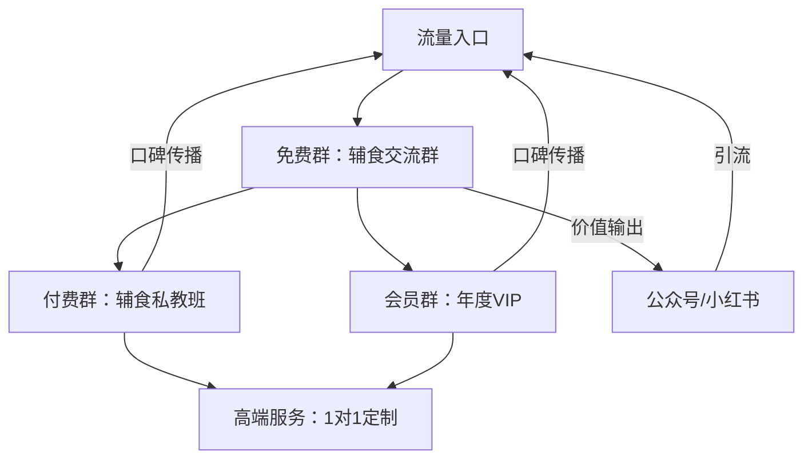
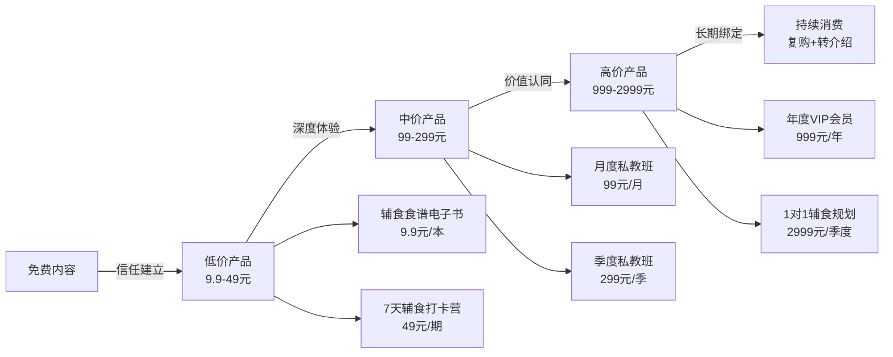

## 案例二：宝妈的社群创业之路

### 为什么选这个案例

在社交资本的变现案例中，宝妈群体的故事最具启发性。她们通常没有显赫的职业背景，没有庞大的初始人脉，甚至因为育儿而暂时脱离职场。但恰恰是这个群体，通过社群运营将"妈妈身份"转化为独特的社交资本，实现了从零到月入3万的跨越。

这个案例的核心价值在于：**社交资本的积累不一定需要高起点，关键在于找到自己的独特价值并持续放大。**

---

### 案例背景

**人物画像：李婷（化名），32岁，坐标成都**

- 学历：普通本科，市场营销专业
- 职业经历：广告公司文案策划（2015-2019），因怀孕辞职
- 家庭状况：全职妈妈，育有一子（3岁）
- 初始社交资本：朋友圈约500人，主要是前同事和大学同学
- 启动资金：5000元（家庭存款中挤出）

**她的困境：**

2019年辞职后，李婷面临典型的全职妈妈困境：
- 收入归零，家庭开支增加
- 社交圈急剧萎缩，与职场脱节
- 自我价值感下降，焦虑情绪加重
- 想重返职场，但3岁前孩子需要照顾

**转折点：**

2021年3月，李婷在小区妈妈群里分享自己制作的辅食，意外获得大量好评和咨询。她敏锐地意识到：**妈妈们在育儿路上的信息需求是巨大的，而她可以成为那个"整理者"和"连接者"。**

---

### 第一阶段：冷启动——从0到100个种子用户（2021年3-6月）

#### 1. 精准定位：找到自己的独特价值

李婷没有盲目跟风做母婴博主，而是做了深度自我分析：

| 维度 | 分析内容 | 可利用点 |
|------|----------|----------|
| 专业背景 | 市场营销+文案策划 | 内容创作能力、用户洞察能力 |
| 个人兴趣 | 烘焙、辅食制作 | 可输出实用内容 |
| 身份标签 | 全职妈妈、成都本地 | 精准人群定位、本地资源整合 |
| 时间特点 | 白天碎片化时间多 | 适合社群运营节奏 |

**她的定位公式：** 营销专业能力 × 辅食制作技能 × 成都本地妈妈身份 = 成都宝妈辅食交流社群

#### 2. 种子用户获取：不花钱的冷启动策略

**策略一：小区妈妈群精准渗透**

李婷没有在群里直接发广告，而是采用"价值前置"策略：
- 每周分享2-3个辅食制作教程（图文+短视频）
- 主动回答群里新手妈妈的喂养问题
- 整理成都本地的母婴店优惠信息
- 组织小区内的"闲置母婴用品交换"活动

**关键动作：** 她制作了一份《成都0-3岁宝宝辅食完全手册》（PDF，48页），作为免费资料在群里分享。这份手册成为她的"社交货币"——妈妈们转发给她朋友，带来自然裂变。

**策略二：线下场景建立信任**

李婷每周三下午在小区儿童游乐区组织"妈妈下午茶"：
- 地点：游乐区旁边的长椅（零成本）
- 形式：带自制小点心，边看孩子边聊天
- 内容：分享育儿经验，解答辅食问题
- 产出：每次活动后在群里发"今日小结"，记录讨论的实用知识点

**为什么线下重要？** 根据社会资本理论，面对面互动能建立更深层次的信任。线上交流是"弱关系"，线下见面能快速升级为"强关系"。李婷深谙此道——她知道，只有见过面、聊过天的人，才会真正信任你推荐的产品和服务。

**策略三：朋友圈内容策略**

李婷的朋友圈不是"晒娃日记"，而是精心设计的内容矩阵：

| 内容类型 | 发布频率 | 目的 |
|----------|----------|------|
| 辅食制作过程 | 每天1条 | 展示专业能力 |
| 育儿知识卡片 | 每周3条 | 提供实用价值 |
| 个人生活感悟 | 每周2条 | 建立人格魅力 |
| 用户反馈截图 | 每周2条 | 社交证明 |
| 产品推荐（软性） | 每周1条 | 商业转化 |

**关键原则：** 80%的内容提供价值，20%的内容引导转化。李婷严格遵守这个比例，避免朋友圈变成"微商广告栏"。

**冷启动成果（3个月）：**
- 建立"成都宝妈辅食交流群"，核心成员87人
- 朋友圈好友增长到1200人
- 收到37份辅食制作咨询
- 零收入，但积累了第一批信任她的用户

---

### 第二阶段：社群运营——从100到1000个活跃用户（2021年7月-2022年3月）

#### 1. 社群架构设计

当用户超过100人时，李婷意识到微信群的局限性。她开始搭建系统化的社群架构：

**免费群（辅食交流群）：**
- 定位：流量入口，建立信任
- 规模：控制在200人以内（超过则新建分群）
- 内容：每周3次主题分享（周一辅食、周三喂养、周五好物）
- 运营：志愿者妈妈轮流主持，培养KOC（关键意见消费者）
- 规则：禁止广告，违者移除

**付费群（辅食私教班）：**
- 定位：深度服务，核心变现
- 价格：99元/月，299元/季度
- 服务：每日辅食食谱、每周直播答疑、专属问题解答
- 规模：每期限制50人（稀缺性+服务质量）
- 周期：每月1日开班，月底结业

**会员群（年度VIP）：**
- 定位：高净值用户，长期绑定
- 价格：999元/年
- 服务：私教班所有内容 + 1对1季度辅食规划 + 线下活动优先权
- 权益：推荐新用户返现15%、专属折扣

#### 2. 内容体系搭建

李婷的内容策略从"随机分享"升级为"体系化输出"：

**公众号「婷妈辅食记」内容矩阵：**

| 内容板块 | 更新频率 | 内容方向 | 目标 |
|----------|----------|----------|------|
| 辅食食谱 | 每周3篇 | 分月龄、分食材、分功能 | 搜索流量 |
| 喂养科普 | 每周1篇 | 营养学、过敏、便秘等 | 专业背书 |
| 好物测评 | 每周1篇 | 餐具、食材、工具 | 商业转化 |
| 妈妈故事 | 每周1篇 | 用户案例、成长经历 | 情感连接 |
| 成都本地 | 每周1篇 | 亲子餐厅、母婴店、活动 | 本地流量 |

**小红书「婷妈辅食」运营策略：**
- 账号定位：成都宝妈辅食博主
- 内容形式：图文为主，短视频为辅
- 发布频率：每天1-2条
- 爆款公式：痛点标题 + 实操步骤 + 前后对比图 + 成都本地标签

**爆款案例：**
2021年9月，李婷发布了一篇《成都妈妈必看！这5家母婴店比网上还便宜》的小红书笔记，获得2.3万点赞、8600收藏，直接为她的微信带来400+精准好友申请。

**为什么这篇能爆？**
- 精准的地域标签（成都）
- 实用的价格对比（省钱痛点）
- 真实的购物场景（信任感）
- 清晰的图片展示（视觉冲击）

#### 3. 用户分层与精细化运营

当用户超过500人时，李婷开始用表格管理用户：

| 用户层级 | 判断标准 | 运营策略 | 转化目标 |
|----------|----------|----------|----------|
| 潜在用户 | 添加好友未进群 | 3天内私聊破冰，邀请入群 | 免费群 |
| 免费用户 | 在免费群但未付费 | 每周私教班体验名额、限时优惠 | 付费群 |
| 付费用户 | 私教班学员 | 深度服务、解决具体问题 | 年度VIP |
| 高净值用户 | VIP会员 | 1对1服务、线下活动、合作机会 | 合伙人 |

**关键动作：** 李婷为每个付费用户建立了"辅食档案"，记录孩子的月龄、过敏情况、饮食偏好、已尝试的食谱。这种精细化服务让用户感受到被重视，复购率高达68%。

#### 4. 裂变增长策略

**策略一：老带新返现机制**
- 老用户推荐新用户加入付费群，双方各得20元优惠券
- 推荐3人以上，额外赠送1个月VIP权益
- 推荐10人以上，升级为"社群合伙人"，享受15%的持续分佣

**策略二：内容裂变**
- 制作《0-3岁辅食添加时间表》（可打印版），用户转发朋友圈即可领取
- 每月举办"最美辅食"评选，获奖者获得免费私教班名额
- 邀请用户撰写"辅食日记"，优秀作品在公众号发表并给予稿费

**策略三：线下活动引流**
- 每月组织一次"妈妈厨房"线下活动（租用共享厨房，费用AA）
- 活动中设置"好友邀请"环节，老用户带新朋友参加
- 活动后发布图文/视频，二次传播

**增长数据（2021年7月-2022年3月，9个月）：**
- 免费群用户：87人 → 860人（增长9.9倍）
- 付费群累计学员：420人
- VIP会员：87人
- 公众号粉丝：0 → 4200人
- 小红书粉丝：0 → 1.2万人

---

### 第三阶段：商业变现——从1000到稳定月入3万（2022年4月至今）

#### 1. 产品体系设计

李婷的变现不是单一的"卖课程"，而是设计了完整的产品矩阵：

**产品详情：**

| 产品 | 价格 | 内容 | 交付方式 | 利润率 |
|------|------|------|----------|--------|
| 辅食食谱电子书 | 9.9元/本 | 按月龄分类，含食材采购指南 | 自动发货 | 95% |
| 7天辅食打卡营 | 49元/期 | 每天1道辅食+视频教程+群答疑 | 社群交付 | 80% |
| 月度私教班 | 99元/月 | 每日食谱+直播+专属答疑 | 社群+直播 | 75% |
| 季度私教班 | 299元/季 | 月度私教班内容+1对1月度规划 | 社群+1对1 | 70% |
| 年度VIP会员 | 999元/年 | 私教班内容+线下活动+专属折扣 | 全渠道 | 65% |
| 1对1辅食规划 | 2999元/季度 | 定制辅食方案+营养跟踪+随时咨询 | 1对1服务 | 60% |

#### 2. 供应链整合

李婷不是简单地"卖课"，而是整合了成都本地的母婴供应链：

**合作模式：**
- 与本地有机农场合作，提供"辅食食材包"（每周配送，含食谱卡片）
- 与母婴店合作，为VIP会员提供专属折扣（5-8折）
- 与儿童摄影机构合作，为会员提供免费拍摄机会
- 与早教机构合作，互相导流

**收入来源拆分（2023年全年数据）：**

| 收入来源 | 金额 | 占比 | 说明 |
|----------|------|------|------|
| 付费社群 | 18.2万 | 50.6% | 私教班+VIP会员 |
| 1对1服务 | 7.8万 | 21.7% | 高端定制服务 |
| 电商分佣 | 4.5万 | 12.5% | 食材包、母婴用品推荐 |
| 广告合作 | 3.2万 | 8.9% | 品牌方软文、直播带货 |
| 线下活动 | 2.3万 | 6.3% | 妈妈厨房、亲子活动 |
| **合计** | **36万** | **100%** | **月均3万** |

#### 3. 关键转折点：从"个人"到"团队"

2022年10月，当付费用户超过300人时，李婷遇到了瓶颈：
- 每天回复咨询消息超过4小时
- 内容创作时间被严重压缩
- 服务质量开始下降，出现差评

**她的解决方案：搭建"妈妈合伙人"团队**

| 角色 | 人数 | 职责 | 报酬 |
|------|------|------|------|
| 内容助理 | 1人（兼职） | 公众号排版、小红书图片制作 | 3000元/月 |
| 社群管家 | 2人（兼职） | 群内答疑、活动组织、用户维护 | 2000元/月+提成 |
| 合伙人妈妈 | 5人 | 输出内容、参与直播、推荐新用户 | 分佣15-20% |

**合伙人的选拔标准：**
- 在社群中活跃度高，积极分享经验
- 自己的辅食制作水平优秀
- 有一定的表达能力和影响力
- 认同社群价值观，愿意长期合作

**关键决策：** 李婷没有招聘"员工"，而是招募"合伙人"。她给合伙人提供培训、流量支持和分佣机制，让她们从"消费者"变成"共创者"。这种模式的优势在于：
- 成本低（无底薪，按效果付费）
- 忠诚度高（合伙人有归属感）
- 扩展性强（可以快速复制到其他城市）

---

### 数据复盘：从0到3万的增长曲线

| 时间节点 | 免费用户 | 付费用户 | 月收入 | 关键动作 |
|----------|----------|----------|--------|----------|
| 2021年3月 | 0 | 0 | 0 | 开始在小区群分享辅食 |
| 2021年6月 | 87 | 0 | 0 | 建立第一个免费群 |
| 2021年9月 | 320 | 45 | 4,200元 | 推出付费私教班 |
| 2021年12月 | 580 | 120 | 8,500元 | 小红书爆款引流 |
| 2022年3月 | 860 | 210 | 12,000元 | 推出VIP会员 |
| 2022年6月 | 1,200 | 350 | 18,000元 | 搭建合伙人团队 |
| 2022年12月 | 2,100 | 520 | 25,000元 | 整合本地供应链 |
| 2023年6月 | 3,500 | 680 | 30,000元 | 拓展到成都周边城市 |
| 2023年12月 | 5,200 | 850 | 32,000元 | 稳定期，优化利润率 |

---

### 李婷做对了什么：核心成功因素拆解

#### 1. 精准的定位：不求大，只求准

李婷没有做"全国母婴博主"，而是聚焦"成都本地宝妈"这个细分市场。这个定位的优势：
- 竞争小：全国性母婴博主太多，但本地化博主稀缺
- 信任强：本地人更容易信任本地人
- 变现易：可以对接本地商家，实现线上线下联动
- 壁垒高：外地博主无法复制本地资源

#### 2. 价值前置：先付出，再收获

李婷花了整整3个月免费输出内容，没有任何收入。这段时间她做了什么？
- 输出了50+篇辅食教程
- 组织了12次线下活动
- 回答了300+个育儿问题
- 建立了87人的核心用户群

**为什么很多人做不起来？** 因为他们希望"今天发内容，明天就有收入"。但社交资本的积累需要时间——你必须先证明自己的价值，别人才愿意为你的价值付费。

#### 3. 体系化运营：从"随机"到"系统"

李婷不是"想到什么发什么"，而是建立了完整的内容体系、用户分层体系、产品体系和供应链体系。这种体系化思维让她的业务可以：
- 规模化：从100人到5000人，运营模式不变
- 可复制：合伙人可以按照流程执行
- 可预测：每月收入波动在10%以内

#### 4. 线上线下结合：信任的双重保障

李婷始终坚持"线上+线下"两条腿走路：
- 线上：公众号、小红书、微信群（覆盖广、效率高）
- 线下：妈妈厨房、亲子活动、上门服务（信任深、粘性强）

**社会资本理论的验证：** 弱关系带来信息和机会（线上），强关系带来信任和行动（线下）。李婷的模式完美体现了"弱关系引流、强关系变现"的社交资本运营逻辑。

#### 5. 持续学习：从"妈妈"到"专家"

李婷没有停留在"会做辅食"的水平，她持续学习：
- 考取了公共营养师证书
- 学习了儿童心理学基础
- 研究了社群运营方法论
- 关注母婴行业最新动态

**为什么学习重要？** 因为用户的需求在升级。一开始，她们需要的是"怎么做辅食"；后来，她们需要的是"怎么科学喂养"；再后来，她们需要的是"怎么培养孩子的饮食习惯"。如果李婷不持续学习，她很快会被淘汰。

---

### 踩过的坑：失败教训与反思

#### 坑1：盲目扩张品类

2022年初，李婷看到"儿童绘本"很火，就尝试在社群里推绘本团购。结果：
- 用户不买账："我是来学辅食的，不是来买书的"
- 精力分散：绘本选品、售后占用大量时间
- 收入惨淡：3个月只卖出47套，利润不到2000元

**教训：** 专注自己的核心领域，不要盲目追风口。用户信任你是因为你的专业，一旦你什么都做，专业感就会被稀释。

#### 坑2：忽视用户反馈

2022年5月，有用户反馈"私教班内容重复"，李婷没有重视。结果：
- 3个VIP会员续费率下降
- 有用户在朋友圈吐槽"感觉被割韭菜"
- 花了2个月才挽回口碑

**教训：** 用户反馈是金矿，每一条负面反馈都值得认真对待。李婷后来建立了"用户反馈周会"制度，每周收集、分析、回应用户意见。

#### 坑3：合伙人管理不当

2022年8月，一个合伙人妈妈在群里与用户发生冲突，导致20多人退群。原因是：
- 合伙人没有经过培训就上岗
- 没有明确的行为规范和冲突处理流程
- 李婷过于信任合伙人，缺乏监督机制

**教训：** 搭建团队不能只靠"信任"，必须有制度保障。李婷后来制定了《合伙人行为规范》和《用户冲突处理SOP》。

#### 坑4：过度依赖单一平台

2023年3月，李婷的小红书账号因"疑似营销"被限流30天。那个月：
- 新用户增长下降70%
- 收入减少约8000元

**教训：** 不要把鸡蛋放在一个篮子里。李婷后来同时运营小红书、抖音、视频号，并建立了自己的公众号私域池，降低对单一平台的依赖。

---

### 可复制的方法论：如何复制李婷的成功

#### 第一步：找到你的"妈妈身份"定位公式

每个宝妈都有自己的独特价值，关键是要找到它。问自己三个问题：
1. 我有什么专业技能？（职业背景、兴趣爱好）
2. 我在哪个群体中有天然信任感？（妈妈群、小区群、校友群）
3. 这个群体有什么未被满足的需求？

**定位公式：** 专业技能 × 人群身份 × 细分需求 = 你的独特定位

**示例：**
- 财务背景 × 宝妈 × 家庭理财需求 → 宝妈理财社群
- 设计背景 × 宝妈 × 儿童房布置需求 → 宝妈家居设计社群
- 英语专业 × 宝妈 × 英语启蒙需求 → 宝妈英语启蒙社群

#### 第二步：3个月冷启动计划

| 阶段 | 时间 | 核心任务 | 目标成果 |
|------|------|----------|----------|
| 第1个月 | 第1-4周 | 内容储备+种子用户获取 | 50个精准好友、10篇内容 |
| 第2个月 | 第5-8周 | 社群建立+价值输出 | 100人免费群、3次线下活动 |
| 第3个月 | 第9-12周 | 付费测试+模式验证 | 20个付费用户、验证商业模式 |

#### 第三步：搭建你的产品金字塔

| 层级 | 产品 | 价格带 | 目的 |
|------|------|--------|------|
| 引流层 | 免费资料、体验课 | 0元 | 获取用户、建立信任 |
| 基础层 | 电子书、打卡营 | 9.9-99元 | 低门槛转化、筛选意向用户 |
| 核心层 | 付费社群、私教班 | 99-999元 | 主要收入来源 |
| 高端层 | 1对1服务、年度会员 | 999-9999元 | 高利润、深度绑定 |
| 裂变层 | 合伙人、分销 | 分佣15-20% | 用户自增长 |

#### 第四步：建立你的"妈妈合伙人"机制

当你一个人忙不过来时，不要急着招员工，而是招募"合伙人"：

**合伙人画像：**
- 在社群中活跃度高
- 有自己的特长和影响力
- 认同你的价值观
- 愿意投入时间和精力

**合伙人激励：**
- 基础分佣：推荐付费用户，获得15-20%分佣
- 等级晋升：根据业绩，升级为银牌/金牌/钻石合伙人
- 专属权益：免费参加高端活动、优先获得合作机会
- 股权激励：顶级合伙人可以参与核心业务分红

---

### 这个案例的社交资本理论解读

李婷的案例完美诠释了本章前面介绍的几个核心理论：

**1. 弱关系理论的应用**

李婷的免费群、小红书、公众号都是"弱关系"渠道——用户和她没有深度连接，但能获取信息。她通过这些弱关系渠道获取大量流量，然后通过付费社群、线下活动将弱关系升级为强关系。

**2. 结构洞理论的应用**

李婷在"成都宝妈"和"辅食专家"之间架起了桥梁。宝妈们需要专业指导，但不知道去哪里找；专家有很多知识，但不知道怎么触达宝妈。李婷填补了这个"结构洞"，成为连接两端的关键节点。

**3. 社会资本复利效应的应用**

李婷的前3个月是"投资期"——投入时间、精力，没有回报。但一旦社会资本积累到临界点，回报开始呈指数增长：老用户带来新用户，口碑带来流量，信任带来付费。

**4. 邓巴数的管理**

李婷深谙"150人定律"——她没有追求社群规模无限扩大，而是将每个群控制在200人以内。当群超过200人时，她会新建分群，确保每个群都有良好的互动氛围。

---

### 给不同阶段读者的行动建议

#### 如果你是完全的新手宝妈

**现在就做的3件事：**
1. 加入3个本地妈妈群，观察讨论话题，找到需求痛点
2. 开始在朋友圈分享你的育儿经验（不需要完美，真实最重要）
3. 约1-2个同小区的妈妈线下见面，建立初始信任

**避免的错误：**
- 不要一上来就想"变现"，先想"我能提供什么价值"
- 不要模仿大V的风格，找到适合自己的表达方式
- 不要急于建群，先在现有社群里活跃3个月

#### 如果你已经有100-500个粉丝

**现在就做的3件事：**
1. 建立你的第一个付费产品（哪怕是9.9元的电子书）
2. 组织第一次线下活动（哪怕只有5个人参加）
3. 开始记录用户数据（谁买了什么、复购了几次、反馈了什么）

**避免的错误：**
- 不要因为"怕卖不出去"就不定价，免费的东西用户不珍惜
- 不要追求"完美产品"，先推出MVP（最小可行产品），再迭代优化
- 不要忽视用户反馈，每一条差评都是改进的机会

#### 如果你已经有1000+粉丝，月入过万

**现在就做的3件事：**
1. 搭建你的产品金字塔，不要只靠单一产品
2. 招募你的第一个"合伙人"，开始团队化运营
3. 整合本地供应链，建立竞争壁垒

**避免的错误：**
- 不要盲目扩张品类，专注你的核心领域
- 不要忽视团队管理，合伙人也需要制度和规范
- 不要过度依赖单一平台，建立多渠道私域

---

### 本案例的核心启示

1. **社交资本的起点不是"人脉广"，而是"价值独特"。** 李婷的成功不在于她认识多少人，而在于她能为特定人群提供独特的价值。

2. **信任是社交资本的货币。** 李婷花了3个月建立信任，用信任换取了3年的稳定收入。没有信任，任何商业模式都是空中楼阁。

3. **体系化是规模化的前提。** 李婷从"随机分享"到"体系化运营"的转变，让她从月入1000跨越到月入30000。

4. **线上线下结合是社交资本变现的最佳路径。** 线上获取流量，线下建立信任，两者缺一不可。

5. **持续学习是社交资本保值增值的关键。** 用户的需求在升级，你的能力也必须升级。停止学习的那一天，就是被淘汰的开始。
