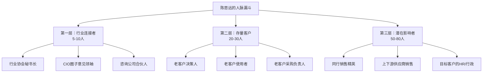

## 案例三：销售冠军的人脉秘密

> "销售的本质不是卖东西，而是建立信任。信任的载体不是话术，而是关系。"

### 案例背景

#### 人物画像

陈思远（化名），32岁，坐标杭州。2018年进入某大型B2B软件公司担任普通销售代表，底薪6000元，第一年业绩排名全组倒数第三。2023年，他连续第三年蝉联华东区销售冠军，年签单额突破3800万元，个人年收入超过120万元，管理8人销售团队。

从倒数第三到三连冠，陈思远的逆袭不是靠更勤奋地打电话、更拼命地跑客户，而是靠一套系统化的人脉经营方法论。用他自己的话说："我前两年在'打猎'，后来学会了'种田'。打猎靠运气，种田靠系统。"

#### 行业背景

B2B企业软件销售是一个典型的"长周期、高客单价、多决策人"行业：

| 维度 | 特征 |
|------|------|
| 平均销售周期 | 3-6个月 |
| 平均客单价 | 30-80万元 |
| 决策参与人 | 5-8人（IT、业务、采购、财务、高管） |
| 客户获取成本 | 约2-5万元/单 |
| 行业平均成交率 | 8-12% |

在这个行业里，纯粹靠电话陌拜和扫楼的"推式销售"已经越来越难以为继。客户的决策越来越理性，信息越来越透明，销售的核心竞争力从"谁能说"变成了"谁被信任"。

### 从倒数第三到中游：问题诊断（第1年）

#### 失败模式分析

陈思远入职后的第一年，采用的是公司培训的标准销售流程：

1. 每天打100个cold call（冷电话）
2. 每周拜访5-8个意向客户
3. 按标准话术做产品演示
4. 跟进、逼单、签合同

这套流程的问题在于——所有销售都在用同样的方法，竞争完全变成了体力和运气的比拼。陈思远第一年的数据很能说明问题：

| 指标 | 陈思远 | 团队平均 | 销售冠军 |
|------|--------|----------|----------|
| 日均电话量 | 100个 | 80个 | 60个 |
| 周均拜访量 | 6次 | 5次 | 4次 |
| 年成交客户 | 4个 | 6个 | 18个 |
| 平均客单价 | 25万 | 35万 | 55万 |
| 年签单额 | 100万 | 210万 | 990万 |

注意一个反直觉的数据：陈思远的电话量和拜访量都是最高的，但业绩却是最差的。原因很简单——他在"打猎"，每天把大量时间花在了陌生人身上，而没有建立起能够持续产出的信任关系。

#### 转折点：一次失败的复盘

第一年年终复盘时，销售总监问了他一个问题："你今年签下的4个客户，最初的线索是怎么来的？"

陈思远回顾后发现：4个客户中，有3个是通过老客户或行业朋友转介绍来的，只有1个是cold call转化的。而这3个转介绍客户的平均成交周期只有45天，客单价是cold call客户的2倍。

这个发现彻底改变了他的认知：

> **销售的真相：80%的业绩来自20%的关系网络，而不是100%的电话量。**

### 第一次进化：构建"人脉漏斗"（第2年）

#### 核心理念转变

陈思远在第二年开始执行一个关键理念转变：**从"找客户"变成"建网络"**。他不再把时间平均分配给所有潜在客户，而是集中精力经营三类关键人脉：



#### 第一层：行业连接者（结构洞位置）

陈思远识别出5个处于"结构洞"位置的关键人物——他们本身不是他的客户，但他们连接着大量潜在客户：

**人物1：浙江省软件行业协会秘书长老周**
- 认识全省3000+企业的IT负责人
- 每年组织10+场行业活动
- 陈思远的做法：免费为协会活动提供场地赞助，主动担任志愿者

**人物2：某知名IT咨询公司合伙人张总**
- 每年服务50+大中型企业的数字化转型项目
- 客户恰好是陈思远的目标客户
- 陈思远的做法：每次签单后给张总10%的"信息费"（公司合规范围内），形成稳定的利益绑定

**人物3：某行业媒体主编李姐**
- 掌握行业媒体资源和企业曝光渠道
- 陈思远的做法：定期提供行业洞察文章，帮李姐完成内容指标，换取精准客户推荐

这5个连接者在第二年为陈思远带来了12个高质量线索，最终成交5个，转化率42%，远超cold call的3-5%。

#### 第二层：存量客户经营

陈思远建立了一套"客户不只是客户"的关系深化体系：

| 动作 | 频率 | 目的 |
|------|------|------|
| 行业资讯推送（非产品相关） | 每周1次 | 建立"行业专家"形象 |
| 客户企业周年庆/里程碑祝贺 | 即时 | 表达关注，超越买卖关系 |
| 帮客户对接上下游资源 | 每月1-2次 | 成为"价值连接者" |
| 邀请客户参加行业闭门会 | 每季度1次 | 提升客户圈层，增加粘性 |
| 转介绍感谢（非金钱） | 即时 | 强化转介绍行为 |

关键数据：第二年存量客户转介绍占总线索的45%，而第一年这个比例只有15%。

#### 第三层：潜在影响者网络

陈思远开始有意识地经营"弱关系"——那些不是直接客户，但可能在未来某个节点产生价值的人：

- **目标客户的IT部门基层员工**：他们是未来的技术决策者，今天是工程师，三年后可能是CTO
- **同行销售精英**：互相交换"不适合自己产品但适合对方"的客户线索
- **上下游供应商的销售**：比如做ERP的销售和做CRM的销售，客户群体高度重叠但不竞争

#### 第二年成果

| 指标 | 第1年 | 第2年 | 增长 |
|------|-------|-------|------|
| 年签单额 | 100万 | 680万 | 580% |
| 成交客户数 | 4个 | 12个 | 200% |
| 平均客单价 | 25万 | 47万 | 88% |
| 成交周期 | 120天 | 65天 | -46% |
| cold call占比 | 85% | 30% | — |
| 转介绍占比 | 15% | 55% | — |

### 第二次进化：系统化与复利效应（第3年）

#### 建立人脉管理系统

当人脉网络扩大到一定程度后，陈思远发现靠脑子记不住了。他开始建立一套系统化的人脉管理流程：

**工具选择：CRM + 个人人脉表**

公司CRM用于管理销售线索，但他额外维护了一张个人"人脉地图"表格：

| 字段 | 说明 | 示例 |
|------|------|------|
| 姓名 | 全名 | 周建华 |
| 角色定位 | 连接者/客户/影响者 | 连接者 |
| 影响力半径 | 能触达的潜在客户数 | 300+ |
| 关系温度 | 1-5分 | 4 |
| 最近互动 | 最后一次有意义的接触 | 2周前 |
| 互动频率建议 | 多久联系一次 | 每月1次 |
| 对方核心需求 | 他最关心什么 | 协会活动质量 |
| 我能提供的价值 | 我能帮他什么 | 场地+内容 |
| 下次行动 | 具体下一步 | 3月5日邀请参加沙龙 |

这张表他每周末花30分钟更新一次，确保没有任何关系"降温"到被遗忘的程度。

#### "人脉复利"的三个加速器

**加速器1：客户成功驱动的口碑飞轮**

陈思远做了一件大多数销售不愿意做的事——签单之后花大量时间确保客户真正用好产品。他会：

- 协调技术团队做深度实施，而不是甩给售后
- 每月主动回访一次使用情况
- 帮客户写内部汇报材料，让客户的领导看到采购价值
- 在客户企业获得行业奖项时，第一时间祝贺并帮其传播

结果：他的客户续约率达到92%（行业平均60%），NPS（净推荐值）达到78分（行业平均35分）。这些满意的客户成为他最强大的"销售员"。

**加速器2：内容营销建立行业影响力**

从第二年下半年开始，陈思远在LinkedIn和公众号上持续输出行业洞察：

- 每周1篇行业分析文章（1500-2000字）
- 每月1次线上直播分享（与行业协会合作）
- 每季度1份行业白皮书（与咨询公司联合发布）

这些内容不是产品广告，而是真正有价值的行业思考。一年后，他在LinkedIn上积累了8000+行业关注者，其中约200人是目标企业的决策者。

内容营销带来的直接效果：**主动上门咨询的客户从每月0-1个增长到每月3-5个**，这些"集客"线索的成交率高达35%。

**加速器3：构建"销售联盟"生态**

陈思远与5个做不同产品但客户群体相同的销售精英组成了"联盟"：

```text
联盟成员及分工：
├── 陈思远：企业软件（CRM/ERP）
├── 老王：云服务器/IT基础设施
├── 小林：人力资源SaaS
├── 阿杰：财务软件
└── 大刘：网络安全产品

联盟规则：
1. 每两周线下聚餐一次，同步客户动态
2. 发现非自身产品的线索，优先转给联盟成员
3. 转介绍成交后，获3-5%的感谢费（合规范围内）
4. 联合拜访大客户，提供"一站式解决方案"
5. 共享行业情报和市场趋势
```

这个联盟在第三年产生了显著效果：联盟内部互相转介绍的线索占各自总线索的20-30%，而这些线索的转化率是cold call的6-8倍。

#### 关键策略：大客户的"人脉渗透"

陈思远在攻克大型客户时，采用了一种"人脉渗透"策略，而非传统的"硬攻"模式：

```mermaid
graph LR
    A[目标：某制造业集团<br/>年采购预算500万] --> B[第一步：找到内部盟友]
    B --> C[通过行业协会认识<br/>集团IT经理王工]
    C --> D[第二步：建立信任]
    D --> E[半年内4次非销售互动<br/>行业沙龙/技术交流]
    E --> F[第三步：获取情报]
    F --> G[了解决策流程/痛点/<br/>竞争对手/预算周期]
    G --> H[第四步：精准切入]
    H --> I[在预算周期前3个月<br/>提交定制方案]
    I --> J[第五步：多点接触]
    J --> K[同时接触IT/业务/采购<br/>三个决策层]
    K --> L[第六步：高层背书]
    L --> M[通过咨询公司合伙人<br/>引荐集团副总]
    M --> N[成交：480万元<br/>周期：4个月]
```



这个客户的传统销售路径可能是：cold call前台→约IT经理→被拒→换人再约→约到后做demo→等预算→跟采购砍价→半年后不确定结果。陈思远的方法把成交率从不到5%提升到了60%以上。

### 成果数据总览

#### 三年成长曲线

| 指标 | 第1年 | 第2年 | 第3年 | 3年复合增长率 |
|------|-------|-------|-------|--------------|
| 年签单额 | 100万 | 680万 | 3800万 | 236% |
| 成交客户数 | 4个 | 12个 | 28个 | 165% |
| 平均客单价 | 25万 | 47万 | 136万 | 134% |
| 平均成交周期 | 120天 | 65天 | 38天 | -43% |
| 客户续约率 | — | 78% | 92% | — |
| 转介绍占比 | 15% | 55% | 72% | — |
| 个人年收入 | 8万 | 42万 | 120万 | 246% |

#### 人脉网络规模变化

| 维度 | 第1年 | 第2年 | 第3年 |
|------|-------|-------|-------|
| 活跃联系人 | ~50人 | ~200人 | ~500人 |
| 核心连接者 | 0人 | 5人 | 12人 |
| 活跃客户（含续约） | 4个 | 14个 | 38个 |
| 转介绍网络触达 | ~200人 | ~2000人 | ~15000人 |
| LinkedIn关注者 | 0 | 3000 | 12000 |
| 销售联盟成员 | 0人 | 3人 | 5人 |

### 深度分析：陈思远方法论的底层逻辑

#### 与弱关系理论的对应

陈思远的"三层人脉漏斗"完美对应了格兰诺维特的弱关系理论：

| 理论概念 | 陈思远的实践 | 效果 |
|----------|-------------|------|
| 弱关系桥接不同圈子 | 经营行业连接者 | 获得自己圈子外的客户线索 |
| 强关系提供信任背书 | 深化存量客户关系 | 转介绍的高转化率 |
| 网络结构多样性 | 销售联盟+影响者网络 | 信息来源多元化 |

#### 与结构洞理论的对应

陈思远之所以能获得超额回报，核心在于他占据了多个"结构洞"位置：

1. **客户与客户之间的结构洞**：他连接了不同行业的客户，能够跨界传递信息和资源
2. **销售与销售之间的结构洞**：联盟成员之间的信息枢纽位置
3. **行业上下游的结构洞**：连接咨询公司、行业协会、媒体等不同生态角色

占据结构洞意味着：**你不需要拥有所有资源，你只需要连接拥有资源的人**。

#### 与社会资本回报率的对应

陈思远的案例展示了社交资本的"复利效应"：

```text
社会资本回报率公式（简化版）：

ROI = (关系质量 × 关系数量 × 网络结构价值) / 维护成本

陈思远的数据：
- 第1年：(2 × 50 × 1) / 高（大量cold call）= 低回报
- 第2年：(4 × 200 × 3) / 中（系统化维护）= 高回报  
- 第3年：(5 × 500 × 5) / 低（飞轮自转）= 超高回报

关键洞察：当网络结构价值（指数级）和关系质量（线性提升）同时增长时，
回报率呈指数级上升——这就是人脉的复利效应。
```

### 可复制的方法论提炼

#### 销售人脉经营的"五步法"

基于陈思远的经验，提炼出一套可复制的销售人脉经营框架：

**第一步：人脉审计（第1个月）**

盘点你现有的人脉资源：

```text
人脉审计清单：
□ 列出所有认识的人（不限于客户）
□ 按"连接者/客户/影响者/其他"分类
□ 标注每人的影响力半径（能触达多少潜在客户）
□ 标注关系温度（1-5分）
□ 找出最热的3-5个连接者，优先深化
□ 找出最冷但最有价值的5-10个人，制定激活计划
```

**第二步：连接者地图（第1-2个月）**

识别你所在行业的"结构洞"人物：

| 连接者类型 | 典型人物 | 你提供的价值 | 你需要的回报 |
|-----------|---------|-------------|-------------|
| 行业协会 | 秘书长/理事 | 内容/场地/赞助 | 活动参与名单 |
| 咨询公司 | 合伙人/顾问 | 行业案例/数据 | 客户推荐 |
| 媒体 | 主编/记者 | 精品内容/独家观点 | 品牌曝光 |
| 上下游销售 | 不竞争的同行 | 客户线索互换 | 双向转介绍 |
| 客户内部人 | 中层管理者 | 行业资源/职业建议 | 内部情报/推荐 |

**第三步：价值先行（持续执行）**

在提出任何请求之前，先提供至少3次无条件的价值：

- 帮连接者解决一个具体问题
- 分享一条对对方有用的信息
- 介绍一个对对方有价值的人
- 参加对方的活动并积极贡献

**第四步：系统化维护（每周30分钟）**

建立人脉维护的例行机制：

```text
每周例行：
├── 周一：查看本周需要跟进的联系人
├── 周三：发送3-5条非销售性质的信息（行业新闻、文章推荐）
├── 周五：更新人脉温度表，标记下周行动
└── 周末：写1篇行业内容（长期积累影响力）

每月例行：
├── 第1周：邀请2-3个关键人脉共进午餐
├── 第2周：组织或参加1次行业小型聚会
├── 第3周：给3个老客户做回访（非销售目的）
└── 第4周：复盘本月人脉互动效果，调整策略
```

**第五步：飞轮效应（第6个月后）**

当人脉网络达到临界规模后，启动"飞轮"：

```text
口碑飞轮路径：
客户满意 → 主动推荐 → 新客户信任度高 → 成交率高 
→ 更多精力服务 → 更高满意度 → 更多推荐 → ...
```

启动飞轮的关键指标：
- 客户NPS > 60分
- 转介绍占比 > 30%
- 主动咨询客户 > 2个/月

达到这三个指标后，飞轮开始自转，你的获客成本会持续下降。

### 常见误区与避坑指南

#### 误区一：把"认识"当"关系"

**错误做法**：参加一次行业大会，加了200个微信，回来后群发产品介绍。

**正确做法**：一次活动深度交流5-10个人，会后24小时内发送个性化的跟进消息（提到你们聊过的具体内容），一周内提供一次价值（分享文章、介绍资源）。

**核心原则**：关系的质量 = 互动的深度 × 互动的频率。认识200人但没有一次深度对话，不如深度交流5个人。

#### 误区二：只维护"有用的"人脉

**错误做法**：只在需要签单时才联系客户，签完单就消失。

**正确做法**：对所有关系一视同仁地维护，因为你永远不知道谁会在什么时候变得"有用"。那个今天买不起你产品的小企业主，三年后可能成为行业独角兽的采购总监。

**核心原则**：人脉投资是长期行为，不要用短期ROI来衡量每一段关系。

#### 误区三：用金钱代替关系

**错误做法**：给转介绍人高额回扣，但不投入时间建立真实关系。

**正确做法**：金钱激励可以作为"启动器"，但长期关系必须建立在相互尊重和价值交换的基础上。最高级的激励是：让对方因为推荐你而获得面子和社交资本。

**核心原则**：钱能买到线索，但买不到信任。信任才是高转化率的根本原因。

#### 误区四：忽视"非决策者"

**错误做法**：只接触客户的老板/总监，忽视基层员工。

**正确做法**：客户的IT工程师、采购专员、行政助理都是重要的人脉节点。他们可能不拍板，但他们的推荐和内部信息对你的成功率影响巨大。

**核心原则**：决策者决定"选谁"，但影响者决定"推谁"。两条线都要经营。

#### 误区五：人脉网络没有多样性

**错误做法**：只认识同行业、同层级的人。

**正确做法**：有意识地拓展跨行业、跨层级、跨地域的人脉。多样性的网络能带来更多的"弱关系桥接"机会。

**核心原则**：网络同质化 = 信息茧房。你需要不同类型的人来打破信息壁垒。

### 进阶策略：从个人到团队

#### 当你成为销售管理者

陈思远在第三年晋升为销售主管后，将个人的人脉方法论扩展为团队能力：

**团队人脉共享机制**

```text
团队人脉管理规范：
1. 每位销售维护个人人脉地图，季度更新
2. 每周一早会分享1个"本周关键人脉动态"
3. 团队公共CRM中标注"可转介绍"的客户关系
4. 大客户攻坚时，调用团队人脉资源协同拜访
5. 新人入职时，由老人"移交"部分非核心人脉
```

**团队人脉ROI对比**

| 指标 | 纯个人作战 | 团队协同 | 提升 |
|------|-----------|---------|------|
| 人均年签单额 | 500万 | 850万 | 70% |
| 平均成交周期 | 55天 | 38天 | -31% |
| 大客户（>100万）占比 | 15% | 35% | +133% |
| 新人6个月产能达标率 | 30% | 65% | +117% |

### 写在最后

陈思远的故事告诉我们一个朴素但深刻的道理：**在销售这个行业里，最贵的资产不是产品知识、不是话术技巧、不是勤奋程度，而是你花了多年时间建立起来的信任关系网络。**

这个网络不会因为你换公司、换行业而完全消失（前提是关系是真实的而非纯功利的）。它是你的"社交资本账户"，越早开始储蓄，复利效应越惊人。

正如陈思远在一次内部培训中分享的：

> "我前两年觉得销售是体力活，后来发现是脑力活，现在觉得是人品活。你的产品可以被复制，你的价格可以被打压，但你用了三年建立起来的信任关系网络——没有人能复制它。这才是你真正的护城河。"
