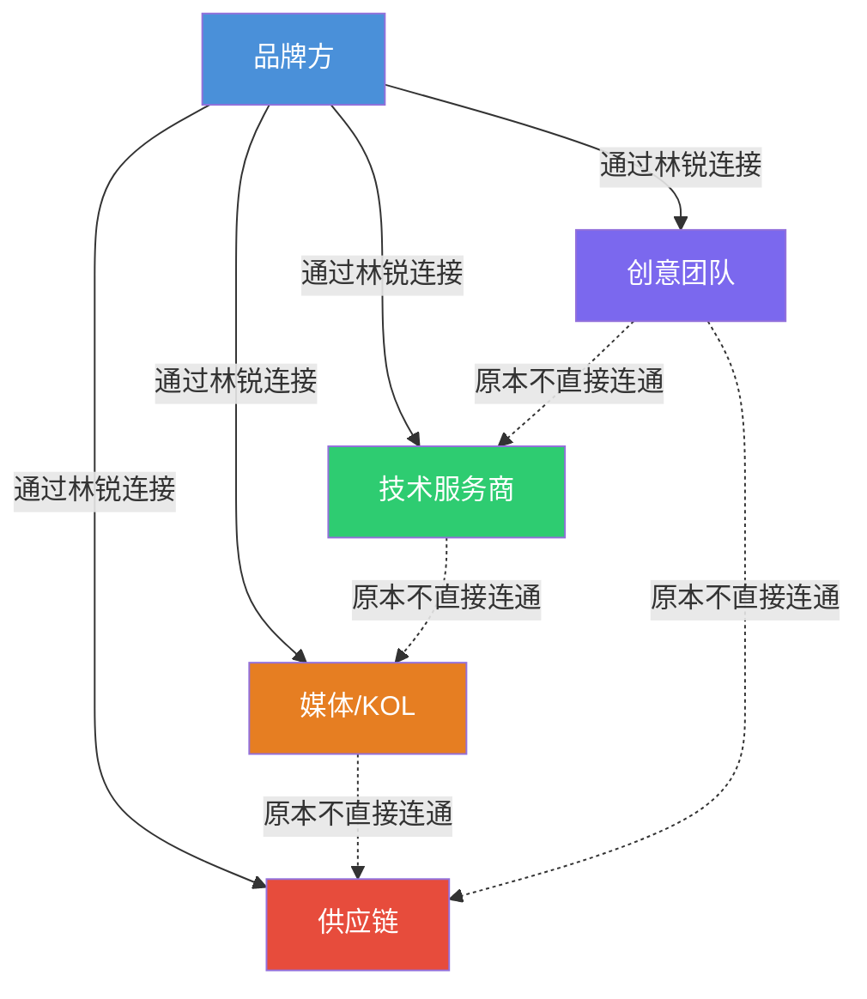

## 案例四：跨行业资源整合的奇迹

跨行业资源整合是社交资本变现的高阶形态——不是在单一行业内深耕人脉，而是将不同行业、不同领域的人和资源编织成一张价值网络，创造出任何单一方都无法独立完成的商业奇迹。本案例的主角林锐（化名），用三年时间从一个普通的广告公司客户经理，成长为一家估值过亿的产业整合平台创始人，核心能力只有一个：**把A行业的资源带到B行业，把B行业的解决方案带回A行业**。

### 一、案例背景

#### 1.1 人物画像

林锐，29岁，本科广告学专业，毕业后进入一家中型广告公司做客户经理，月薪8000元。工作内容是对接品牌客户，协调创意团队和媒体资源。表面上这是个"传话筒"式的岗位，但林锐在这个过程中积累了两个关键资源：

- **甲方视角**：深度理解十几个不同行业品牌的营销痛点、预算结构和决策流程
- **乙方资源**：积累了大量创意团队、媒体渠道、KOL、技术服务商的联系方式和信任关系

工作两年后，林锐发现自己处于一个独特的位置——他同时理解供给侧（各类服务商的能力边界）和需求侧（品牌方的真实需求），但他并没有急于创业，而是花了半年时间系统梳理自己的人脉网络。

#### 1.2 行业环境

2023年前后的中国市场呈现几个关键趋势：

| 趋势 | 具体表现 | 资源整合机会 |
|------|----------|-------------|
| 品牌出海潮 | DTC品牌扎堆东南亚、中东市场 | 国内品牌方 × 海外本地化团队 |
| 短视频爆发 | 抖音/快手商业化成熟 | 传统品牌方 × 内容创作者 |
| AI技术落地 | AIGC从概念进入商用 | 技术公司 × 行业应用场景 |
| 消费降级 | 品牌预算收紧但效果要求更高 | 需要更精准的资源整合而非大水漫灌 |

这些趋势共同指向一个结论：**单一行业的资源已经不够用了，品牌方需要的是跨行业的整合方案**。谁能把不同行业的资源打通，谁就能获得巨大的价值差。

#### 1.3 起点资产盘点

林锐在正式行动前，用一张表盘点了自己的"社交资产"：

| 资产类别 | 数量 | 质量评级 | 变现潜力 |
|----------|------|----------|----------|
| 品牌方决策人（总监以上） | 23人 | A级8人、B级15人 | 直接付费能力 |
| 创意/设计团队负责人 | 12人 | A级5人、B级7人 | 服务能力 |
| 媒体/KOL资源 | 30+ | A级6人、B级24人 | 流量能力 |
| 技术服务商（SaaS、开发） | 8人 | A级3人、B级5人 | 技术能力 |
| 供应链/工厂资源 | 5人 | B级 | 生产能力 |
| 跨境/海外本地资源 | 3人 | B级 | 国际化能力 |

这张表的关键不在于数量，而在于**林锐清楚地知道每个资源的能力边界和信任程度**。他给每个人标注了实际合作过的次数、对方的靠谱程度评级、以及对方当前最需要什么。这就是后续所有整合操作的基础。

### 二、资源整合的核心逻辑

#### 2.1 结构洞位置的自觉运用

回顾本章理论基础部分的结构洞理论，林锐所处的位置是一个典型的"结构洞占据者"——他连接着品牌方、创意团队、技术服务商等多个彼此之间并不直接连通的群体。



结构洞的价值在于：**当你同时拥有A和B的信息，而A和B之间没有直接通道时，你可以为双方创造价值，同时获取信息差带来的溢价**。

林锐的操作不是简单地"卖信息"，而是通过以下三步实现价值创造：

1. **信息整合**：把品牌方的模糊需求翻译成具体的技术/创意语言
2. **资源匹配**：从自己的资源库中找到最合适的组合方案
3. **信任背书**：用自己的信誉为双方的首次合作提供保障

#### 2.2 弱关系的杠杆效应

格兰诺维特的弱关系理论在这个案例中体现得淋漓尽致。林锐最赚钱的几次资源整合，都来自"不太熟"的朋友：

- 一个只见过两次的跨境物流公司老板，后来成为他帮品牌出海的核心合作伙伴
- 一个大学同学的前同事，在AI公司做商务，后来成为他对接AIGC项目的桥梁
- 一个行业峰会上交换名片的供应链负责人，后来帮他解决了客户的小批量生产问题

**强关系提供情感支持，弱关系提供信息和机会**——这是跨行业资源整合的第一定律。林锐刻意维护了一套"弱关系激活"机制，后文会详细展开。

#### 2.3 整合收益的乘数效应

单行业合作的收益是线性的（你有客户，我有服务，1+1=2），但跨行业整合的收益是乘数级的：

| 合作模式 | 参与方 | 收益模式 | 放大倍数 |
|----------|--------|----------|----------|
| 单一服务 | 品牌方 + 1个服务商 | 服务费 | 1x |
| 行业整合 | 品牌方 + 多个同行业服务商 | 佣金 + 溢价 | 2-3x |
| 跨行业整合 | 品牌方 + 多个跨行业资源 | 平台费 + 股权 + 长期分成 | 5-10x |

林锐第一次真正感受到乘数效应，是在帮一个美妆品牌做"短视频+私域+供应链"一体化方案时：他把短视频内容团队（行业A）、私域运营服务商（行业B）、代工厂（行业C）整合在一起，品牌方获得了从内容到转化到交付的完整闭环，而林锐作为整合方收取了总项目金额15%的协调费——这个比例远高于任何单一服务商的利润率。

### 三、执行过程：从副业到平台的三阶段

#### 3.1 第一阶段：小规模验证（0-6个月）

**核心动作：用最小成本验证"跨行业整合"这个模式是否可行**

林锐没有辞职，而是在广告公司工作的同时，用业余时间做三件事：

**第一步：建立资源地图**

他用Notion建了一张详细的资源数据库，字段包括：

```text
字段设计：
- 姓名/公司/职位
- 行业标签（可多选）
- 核心能力（具体描述，不用抽象词）
- 合作历史（有/无，具体项目）
- 信任评级（S/A/B/C，基于实际互动）
- 当前需求（对方最近在找什么）
- 对方能提供的独特价值
- 最近一次联系时间
- 下次联系计划
```

这个数据库不是通讯录——**它记录的是每个关系的"能力-需求"双向信息**。林锐每周花2小时更新一次，重点记录"对方最近在找什么"，因为这往往是整合机会的起点。

**第二步：制造"连接事件"**

林锐开始有意识地组织小型饭局（4-6人），每次邀请来自不同行业但可能有互补需求的人。饭局规则：

- 每次不超过6人，确保深度交流
- 参与者必须来自至少3个不同行业
- 每个人必须带一个"我最近需要的资源"或"我能提供的资源"
- 林锐作为组织者，负责前期的需求匹配和事后的跟进

前6个月他组织了8场饭局，参与者共计32人次。这些饭局直接产生了4个跨行业合作项目，其中2个是林锐作为中间人促成的。

**第三步：完成第一个"整合项目"**

第一个标志性项目来自第三场饭局。一个母婴品牌的市场总监（林锐的前客户）提到想找人做"线下体验店+线上社群"的联动方案，但传统的广告公司只能做线上，线下活动公司不懂私域，私域运营团队不懂母婴行业。

林锐从自己的资源库里找到：
- 一个做过母婴线下活动的活动公司（之前帮另一个客户做过发布会）
- 一个专注于母婴行业的私域运营团队（朋友推荐，见过一次）
- 一个母婴KOL（之前合作过，关系不错）

他把三方拉到一起，用一周时间出了一个整合方案，品牌方一次性通过。项目总金额35万，林锐收取10%的整合服务费，即3.5万元——这是他工资之外的第一笔"资源整合收入"。

**第一阶段成果：**

| 指标 | 数据 |
|------|------|
| 组织饭局 | 8场 |
| 新增有效人脉 | 18人 |
| 促成跨行业合作 | 4个 |
| 整合服务收入 | 8.2万元 |
| 平均月收入（额外） | 1.37万元 |

#### 3.2 第二阶段：规模化复制（6-18个月）

**核心动作：将个人能力转化为可复制的流程，并建立团队**

第一阶段验证了模式可行后，林锐开始做两件关键的事：

**第一：将整合流程标准化**

他把促成跨行业合作的经验总结成了一套"五步整合法"：

```text
五步整合法（Cross-Industry Integration Framework）

第一步：需求拆解（Demand Decomposition）
  - 把客户的模糊需求拆解成3-5个独立的能力模块
  - 每个模块标注：所需技能、预算范围、时间要求、质量标准

第二步：资源扫描（Resource Scanning）
  - 从资源数据库中检索每个模块的候选供应商
  - 每个模块至少3个候选，按"能力匹配度 × 信任度 × 性价比"排序

第三步：方案设计（Solution Design）
  - 组合最优资源，设计整合方案
  - 关键：设计各方的协作流程和接口标准
  - 明确各方的权责、收益分配和风险承担

第四步：信任连接（Trust Bridge）
  - 林锐作为信任中介，为各方提供背书
  - 组织面对面会议或视频会，建立直接信任
  - 提供过往合作案例和评价作为佐证

第五步：执行协调（Execution Coordination）
  - 建立项目群（微信群或飞书群），明确沟通机制
  - 关键节点检查，及时发现和解决协作摩擦
  - 项目结束后收集各方反馈，更新资源数据库
```

**第二：引入"资源合伙人"机制**

一个人的资源终究有限。林锐设计了一个"资源合伙人"制度——邀请各行业的资深人士成为合伙人，每人负责维护自己行业的资源网络，林锐负责跨行业的整合和匹配。

合伙人权益设计：

| 层级 | 要求 | 权益 |
|------|------|------|
| 核心合伙人 | 提供10+优质资源，参与至少3个项目 | 项目利润分成30%，平台决策参与权 |
| 行业合伙人 | 提供5+优质资源，参与至少1个项目 | 项目利润分成15%，所在行业优先推荐 |
| 资源合伙人 | 提供3+优质资源 | 成功推荐后单次佣金10% |

这个机制的核心逻辑是：**让每个合伙人都成为自己行业里的"林锐"，林锐则成为连接所有合伙人的超级节点**。到第12个月时，林锐已经有了7个核心合伙人、12个行业合伙人，覆盖了美妆、母婴、食品、3C、教育、健康、跨境电商、短视频、私域运营、供应链、AI技术、设计等12个细分领域。

**第二阶段里程碑项目：**

第10个月时，林锐接到了一个改变局面的项目——一家中型家电品牌想做"AI+智能家居"的跨界营销，预算200万。传统广告公司只能做传播，但品牌方需要的是从产品概念、技术实现、内容营销到渠道铺设的全链路方案。

林锐通过合伙人网络，在两周内组建了一个"虚拟团队"：

```text
项目团队构成：
├── AI技术顾问（合伙人A推荐，某AI公司技术VP）
├── 工业设计团队（合伙人B的资源，做过智能硬件设计）
├── 内容营销团队（林锐原有的广告公司资源）
├── 短视频KOL矩阵（合伙人C运营的达人网络）
├── 电商代运营（合伙人D的公司）
└── 线下渠道资源（合伙人E的家电行业关系）

项目收入分配：
- 总项目金额：200万元
- 各方服务成本：155万元
- 林锐平台整合费（20%）：30万元
- 利润池（按合伙人贡献分配）：15万元
```

这个项目的成功不仅带来了收入，更重要的是**验证了平台模式的可行性**——林锐不需要自己拥有任何技术或服务能力，他只需要做好"资源整合+信任背书+协调执行"这三件事。

**第二阶段成果：**

| 指标 | 数据 |
|------|------|
| 合伙人总数 | 19人（7核心+12行业） |
| 覆盖行业 | 12个细分领域 |
| 完成整合项目 | 23个 |
| 项目总流水 | 680万元 |
| 平台整合收入 | 98万元 |
| 平均项目规模 | 29.6万元 |
| 客户复购率 | 65% |

#### 3.3 第三阶段：平台化运营（18-36个月）

**核心动作：从"人脉驱动"转向"系统驱动"，建立可持续的平台商业模式**

到第18个月，林锐面临一个甜蜜的烦恼——项目越来越多，但每个项目都依赖他个人的判断力和协调能力来匹配资源，效率开始跟不上。

他做了三个关键决策：

**决策一：开发资源匹配系统**

投入15万元，外包开发了一个内部资源管理系统（后来逐步演变为SaaS产品）：

```text
系统核心功能：
├── 资源库管理
│   ├── 供应商能力画像（技能、案例、评级）
│   ├── 历史合作数据（完成率、满意度、响应速度）
│   └── 实时可用状态（在忙/可接单）
├── 需求智能匹配
│   ├── 客户需求自动拆解（NLP提取关键能力模块）
│   ├── 资源自动推荐（基于能力匹配+历史评分+可用性）
│   └── 方案模板库（按行业+场景分类的历史成功方案）
├── 项目管理
│   ├── 协作流程看板
│   ├── 自动化沟通提醒
│   └── 里程碑验收和付款节点
└── 数据分析
    ├── 合伙人贡献度追踪
    ├── 行业趋势洞察
    └── 客户需求热点分析
```

这个系统的核心价值在于：**把林锐脑子里的资源整合经验变成了可量化的算法和数据**。新加入的合伙人即使不认识林锐，也能通过系统快速了解如何参与项目。

**决策二：建立行业研究院**

林锐意识到，跨行业整合的最大壁垒不是人脉，而是**对各行业的深度理解**。他投入资源建立了"跨界产业研究院"，每月发布一份《跨行业整合机会洞察》报告：

```text
报告结构示例（2024年Q2）：
1. 本月跨行业热点：AI+美妆（个性化护肤方案）
2. 成功案例拆解：某零食品牌×游戏IP联名的资源整合路径
3. 供需匹配机会：有3家教育公司在找线下场地资源
4. 合伙人动态：新加入2位供应链领域专家
5. 下月预测：健康食品×运动APP的跨界机会窗口
```

这份报告免费发给所有合伙人和潜在客户，**既是知识产品，也是获客工具**——很多客户是看了报告后主动找来的。

**决策三：从"整合服务费"到"多元收入模型"**

| 收入来源 | 模式 | 占比 |
|----------|------|------|
| 项目整合服务费 | 按项目金额的15-25%收取 | 45% |
| 年度顾问费 | 品牌方年度战略顾问，按年收费 | 25% |
| 资源对接SaaS | 供应商和品牌方自助匹配的平台工具 | 15% |
| 行业报告/培训 | 付费报告、企业内训、行业峰会 | 10% |
| 战略投资 | 对优质供应商/项目方的早期投资 | 5% |

**第三阶段成果（截至第36个月）：**

| 指标 | 数据 |
|------|------|
| 平台注册资源方 | 320+（涵盖18个行业） |
| 活跃品牌客户 | 47家 |
| 累计完成项目 | 89个 |
| 年度平台流水 | 2800万元 |
| 年度净利润 | 420万元 |
| 团队规模 | 12人（含3个核心运营） |
| 平台估值（融资时） | 1.2亿元 |

### 四、关键转折点深度复盘

#### 4.1 转折点一：从"帮忙"到"生意"

林锐最初帮朋友对接资源是不收费的——觉得只是"牵个线"。直到有一次，他花了三周时间帮一个客户对接了AI技术团队、内容团队和渠道资源，项目金额300万，客户主动问他"你怎么收费"。

这个瞬间让林锐意识到：**资源整合不是"顺便帮忙"，而是创造了真实的价值，应该有对应的定价**。他开始研究行业惯例，发现：
- 猎头行业的佣金是年薪的20-30%
- 投行FA的佣金是融资额的3-5%
- 广告代理的佣金是媒介购买额的15%
- 工程项目总包的管理费是总造价的3-8%

综合参考后，他把整合服务费定在项目金额的15-25%，根据项目复杂度和自己的参与深度浮动。这个定价既不会让客户觉得太贵（相比他们自己摸索的时间成本），也能覆盖林锐的协调成本和风险。

#### 4.2 转折点二：第一次"翻车"和信任管理

第8个月时，林锐遭遇了第一次项目危机——他推荐的一个技术服务商严重延期，导致品牌方的上市计划被打乱。品牌方直接找林锐"要说法"。

林锐做了三件事：

1. **主动担责**：不推卸给技术服务商，以整合方身份向客户道歉并承担违约金（项目款的10%，即2.8万元）
2. **快速补救**：48小时内找到替代团队接手，自己额外投入时间监督
3. **建立风控机制**：从此以后，所有合作的技术服务商都要先完成一个小项目（金额<5万）来验证能力，才能进入核心供应商库

这次危机的处理反而增强了品牌方对林锐的信任——因为他们看到林锐不会在出问题时甩锅。这个品牌后来成为林锐的年度顾问客户，三年累计合作金额超过500万。

**教训提炼**：跨行业整合的风险不是"找不到资源"，而是"对资源的能力评估不准确"。林锐后来建立了一套供应商评级体系：

```text
供应商五维评估模型：
├── 能力维度：过往案例质量、团队专业度、技术/创意水平
├── 可靠维度：按时交付率、沟通响应速度、问题处理态度
├── 性价比维度：报价合理性、隐性成本控制、弹性议价空间
├── 协作维度：配合度、接口标准化程度、跨团队协作经验
└── 成长维度：学习能力、新需求响应速度、长期合作意愿

评级规则：
- S级（90分以上）：优先推荐，可参与大项目
- A级（80-89分）：常规推荐，中小项目优先
- B级（70-79分）：备选推荐，需要林锐团队额外监督
- C级（60-69分）：仅限简单项目，需要明确风险告知
- D级（60分以下）：不推荐，从资源库移除
```

#### 4.3 转折点三：从个人品牌到平台品牌

第14个月时，林锐意识到一个危险的信号——客户找他合作的理由是"找林锐"而不是"用他的平台"。这意味着如果他个人出了任何问题（生病、精力不足、被竞争对手挖角），整个业务就会停摆。

他开始有意识地做"去个人化"：

1. **让合伙人直接对接客户**：之前所有沟通都经过林锐，现在改为"林锐负责匹配，合伙人直接对接执行"
2. **建立标准化的服务流程**：从需求沟通到方案交付，每一步都有模板和检查清单，任何团队成员都能执行
3. **沉淀案例库**：把每个成功项目的方案、流程、经验教训沉淀为可复用的知识资产
4. **培养"小林锐"**：选了3个有潜力的年轻团队成员，手把手教他们如何做资源整合

到第24个月时，已经有一半的项目是团队独立完成匹配和协调的，林锐只需要在关键节点做决策。这让他有更多时间思考战略方向和拓展新领域。

### 五、跨行业资源整合的方法论提炼

#### 5.1 资源整合者的三重能力模型

通过林锐的案例，可以提炼出跨行业资源整合者需要的三重核心能力：

| 能力层级 | 具体能力 | 林锐的体现 | 训练方法 |
|----------|----------|-----------|----------|
| **认知层** | 跨行业知识广度、需求洞察力、趋势判断力 | 能快速理解不同行业的痛点和语言 | 每月深度研究1个新行业，阅读行业报告，参加行业峰会 |
| **关系层** | 信任建立、弱关系维护、多方协调 | 用饭局和项目合作快速建立信任 | 每周联系3个"弱关系"，每季度组织1次跨行业聚会 |
| **执行层** | 项目管理、流程标准化、风控能力 | 五步整合法、供应商评级体系 | 复盘每个项目，持续优化流程和工具 |

这三层能力的关系是：**认知决定你能看到什么机会，关系决定你能调动什么资源，执行决定你能把机会变成多少收入**。任何一层缺失都会限制资源整合的效果。

#### 5.2 跨行业资源整合的五个原则

**原则一：价值先行，连接在后**

不要为了"拓展人脉"而社交。林锐从不参加没有明确价值交换目的的社交活动。他每次接触新人之前都会问自己三个问题：
- 我能给对方提供什么价值？
- 对方能给我或我的客户提供什么价值？
- 这个连接的时机是否合适？

**原则二：信任是唯一的货币**

跨行业整合的最大障碍不是信息不对称，而是信任不对称。一个品牌方不会因为你说"我认识一个很好的技术团队"就放心合作，他需要的是：
- 你对这个团队能力的真实了解（不是听说，是合作过）
- 你愿意用个人信誉为这个推荐背书
- 出了问题时你愿意承担责任

**原则三：小项目验证，大项目放量**

林锐从不让一个新资源直接参与大项目。他的规则是：任何新供应商必须先完成一个5万以下的小项目，表现合格才能进入常规推荐池。这个规则帮他避免了至少3次可能的重大翻车。

**原则四：让每一方都觉得自己赚了**

成功的资源整合不是零和博弈，而是让所有参与方都觉得"这次合作我赚到了"：
- 品牌方获得了超出预期的整合方案
- 各服务商获得了自己搞不定的项目机会
- 合伙人获得了持续的分佣收入
- 林锐获得了整合服务费和长期客户关系

**原则五：信息流是整合的血液**

跨行业资源整合的本质是**在正确的时间把正确的信息传递给正确的人**。林锐维护了一套"信息流管理"机制：

```text
信息流管理清单：
├── 每日：扫描各行业新闻，标记可能的整合机会
├── 每周：更新资源数据库中"对方当前需求"字段
├── 每两周：向核心合伙人发送行业动态和机会摘要
├── 每月：发布跨行业整合机会洞察报告
├── 每季度：组织合伙人线下会议，同步战略方向
└── 每半年：全面盘点资源库，清理无效资源，补充新资源
```

#### 5.3 跨行业资源整合的常见陷阱

| 陷阱 | 表现 | 后果 | 纠正方法 |
|------|------|------|----------|
| 贪多嚼不烂 | 同时推进太多行业，每个都浅尝辄止 | 资源质量下降，客户体验变差 | 先深耕3-5个行业，建立口碑后再扩展 |
| 过度承诺 | 为了拿下客户，承诺自己做不到的事 | 交付不了，信任崩塌 | 只承诺自己有把握的部分，宁可少说多做 |
| 忽视退出机制 | 合作没有明确的终止条件和善后方案 | 出问题时各方扯皮 | 每个合作协议都包含退出条款和争议解决机制 |
| 信息不透明 | 各方不知道其他人的报价和利润分配 | 一旦发现被"赚差价"，信任瓦解 | 建立透明的定价机制，整合费单独列出 |
| 只做一次性交易 | 项目结束就不再跟进 | 复购率低，每次都要重新获客 | 建立项目后复盘机制和定期回访制度 |
| 忽略文化差异 | 不同行业的沟通方式和价值观差异 | 协作中产生误解和摩擦 | 提前了解各方的工作习惯，做"翻译"和"润滑" |

### 六、对不同读者群体的启示

#### 6.1 职场新人：如何开始积累跨行业资源

不需要等到"资深"才能做资源整合。从现在开始：

1. **认识你行业的上下游**：如果你是程序员，去了解产品经理、设计师、运营在想什么
2. **参加跨行业活动**：不局限于自己的技术社区，去参加创业、营销、设计类的活动
3. **做一个"资源记录者"**：从今天开始，用一个简单的表格记录你认识的人的能力和需求
4. **主动做"连接者"**：当你发现两个人可能互相需要时，主动介绍他们认识

#### 6.2 中层管理者：如何利用职位优势做整合

中层管理者有一个天然优势——你同时接触上级（决策层）和外部（供应商、合作伙伴），这本身就是一个结构洞位置。利用方法：

1. **把公司内部需求和外部资源做匹配**：在不违反公司规定的前提下，建立自己的外部资源网络
2. **参与行业社群**：在垂直社群中主动回答问题、分享经验，建立专业声誉
3. **开始做小规模的"连接"**：帮朋友对接资源，不收费，先积累案例和口碑

#### 6.3 创业者：如何把整合作为核心商业模式

如果想把跨行业资源整合作为创业方向，关键考量：

```text
可行性评估清单：
□ 你是否有至少3个不同行业的深度人脉？（不是认识，是合作过）
□ 你是否能清晰描述每个行业的核心痛点？
□ 你是否有足够的时间和精力做项目协调？
□ 你所在的市场是否存在明显的"资源错配"现象？
□ 你是否愿意承担整合失败的连带责任？
□ 你是否有至少6个月的财务缓冲？

如果以上6项中有4项以上是"是"，跨行业整合可以作为你的创业方向。
```

### 七、案例数据全景

| 阶段 | 时间跨度 | 核心动作 | 关键指标 | 月均收入 |
|------|----------|----------|----------|----------|
| 验证期 | 0-6个月 | 小饭局+单项目验证 | 8场饭局、4个合作 | 1.37万 |
| 规模期 | 6-18个月 | 合伙人体系+流程标准化 | 19个合伙人、23个项目 | 5.4万（额外） |
| 平台期 | 18-36个月 | 系统化+多元收入 | 320+资源方、2800万流水 | 35万（含平台分红） |
| **三年总计** | **36个月** | **从副业到平台** | **估值1.2亿** | **累计980万+** |

### 八、本案例的核心启示

林锐的故事不是"人脉广就能赚钱"的鸡汤。它真正揭示的是三个深层逻辑：

1. **跨行业资源整合的本质是"信息翻译"和"信任传递"**——你不是在卖人情，而是在降低不同行业之间的协作成本
2. **社交资本的变现需要系统化**——靠个人魅力和记忆是不够的，必须有工具、流程和团队来支撑规模化
3. **整合者的最大护城河是"靠谱的声誉"**——技术可以被复制，资源可以被挖走，但多年积累的信任和口碑是无法速成的

记住本章理论基础中的社会资本回报率公式：**社交资本回报 = 资源质量 × 连接效率 × 信任深度 × 时间复利**。林锐的故事，就是这个公式最生动的注解。
