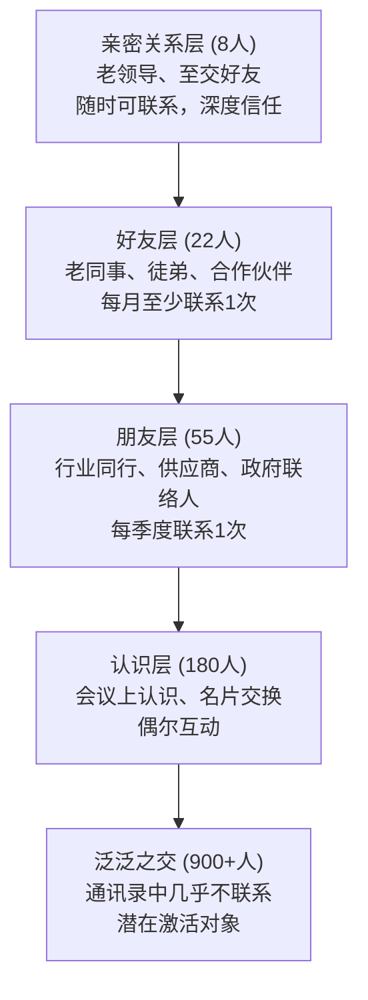
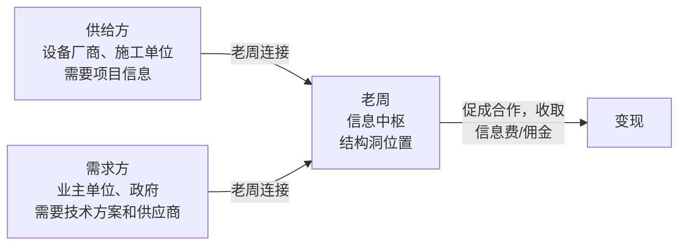

## 案例五：退休人士的社交资本变现

退休不等于社交资本归零。恰恰相反，一个在职场深耕三十年的人，其社交资本的积累量往往是年轻职场人的数倍——问题只在于，这些资本是否被看见、被激活、被转化为实际收入。

本案例的主人公老周，退休前是某省属国企的技术副总，退休后第一年坐吃山空、无所事事，第二年却靠社交资本变现实现了月均收入1.8万元。他的路径不是创业、不是炒股，而是将三十年积累的人脉、经验和行业资源，系统性地转化为可持续的服务收入。

这个案例的特殊价值在于：它揭示了退休人士如何利用自身独特优势——深厚的行业信誉、广泛的人脉网络、丰富的实战经验——在不依赖原单位、不承担经营风险的前提下，实现社交资本的变现。

---

### 一、案例背景：从"被需要"到"被遗忘"的落差

#### 1.1 人物画像

| 维度 | 详情 |
|------|------|
| 姓名 | 周建国（化名），男，60岁 |
| 退休前职位 | 某省属国企技术副总经理 |
| 工作年限 | 32年（其中管理岗18年） |
| 退休金 | 约8500元/月 |
| 退休前月薪 | 约2.2万元/月 |
| 核心技能 | 环保工程设计、项目管理、政府关系协调 |
| 社交网络规模 | 估算1200+联系人（含行业、政府、学术、供应商等多圈层） |

#### 1.2 退休后的困境

老周2023年6月正式退休。退休前三个月，单位已经开始"去中心化"——他负责的项目逐步交接，会议邀请减少，连办公室都从独立间搬到了公共区。退休当天，除了工会组织的一场简短欢送会，没有特别的仪式。

退休后的第一个月，老周经历了典型的"退休综合征"：

- **身份失落**：以前每天接30+个电话，现在一周只有3-4个，还是推销电话
- **社交断裂**：原来围着他转的供应商、同行、下属，退休后几乎不再主动联系
- **价值怀疑**：以前觉得自己"很重要"，退休后发现"原来别人找的不是我，是我屁股下面的位子"
- **作息混乱**：没有了工作节奏，每天睡到自然醒，下午遛弯，晚上看电视，觉得人生失去了意义

老周的太太形容他"像一个被拔了电源的机器人，整天在屋里转圈"。

#### 1.3 转折点：一次偶然的求助

退休后第四个月，老周接到一个电话。打来的是他二十年前带过的徒弟小李，现在在一家民营环保公司做技术总监。小李遇到一个难题：公司投标一个工业园区的污水处理项目，标书中的技术方案部分需要资深专家把关，而公司内部没有人有这种级别的经验。

小李开口的第一句话是："周总，我实在想不出还能找谁了。这个领域的专家，我认识的就您一个。"

老周花了一个下午帮小李审阅了技术方案，指出了三个关键问题：一是工艺选型不适合当地的水质特征，二是设备选型的冗余系数过大导致报价偏高，三是标书中引用的排放标准版本过旧。小李按照建议修改后，项目顺利中标，合同金额480万元。

小李事后给老周转了1万元"咨询费"，老周推辞了三次才收下。但这次经历让他意识到一件事：**他的经验和技术判断力，退休后依然是稀缺资源。** 而且这种稀缺性，恰恰来源于他三十年积累的行业人脉和实战经验——没有这些，他不可能对一个陌生项目的工艺选型做出准确判断。

---

### 二、社交资本盘点：退休人士的隐藏家底

老周在意识到自己的价值后，没有急于行动，而是先做了系统性的社交资本盘点。这一点非常关键——大多数退休人士急于变现，上来就想"我能做什么"，而忽略了"我拥有什么"。

#### 2.1 人脉网络分层分析

老周用了一周时间，翻遍了手机通讯录、微信联系人、名片盒，整理出了一份人脉清单。按照邓巴数的分层理论，他将人脉分为五层：

#### 2.2 社交资本的三个维度评估

| 维度 | 评估内容 | 老周的情况 | 评分 |
|------|----------|------------|------|
| 结构维度 | 网络规模、多样性、结构洞位置 | 1200+联系人，覆盖工程、政府、学术、供应商四大圈层，是多个圈层的连接者 | ★★★★★ |
| 关系维度 | 信任深度、互惠历史、情感联结 | 核心圈层信任度极高，有大量"欠人情"和"人情债"的关系 | ★★★★☆ |
| 认知维度 | 共享语言、行业知识、价值观 | 与行业人士有高度共享的专业语言和认知框架 | ★★★★★ |

#### 2.3 识别结构洞：老周的独特优势

按照罗纳德·伯特的结构洞理论，老周发现自己占据了多个结构洞位置：

- **技术-政府结构洞**：他既懂技术细节，又熟悉政府审批流程，能帮企业在两者之间建立桥梁
- **国企-民企结构洞**：他在国企体系内工作32年，同时与大量民企有合作关系，能看到双方的信息差
- **学术-产业结构洞**：他与多所高校的环境工程教授有交情，同时深谙产业落地的实际困难
- **上游-下游结构洞**：他熟悉设备供应商（上游）和工程业主（下游）两端的情况

**这些结构洞位置，意味着老周可以充当信息中介和资源经纪人——这正是他变现的核心逻辑。**

---

### 三、变现路径设计：四条收入线并行

老周没有选择"全职返聘"这种简单的路径（虽然有单位邀请过他），因为他不想再次被绑定在单一组织上。他设计了四条并行的收入线，每条线都直接依赖他的社交资本。

#### 3.1 第一条线：技术咨询（月均8000元）

**业务模式**：为中小环保企业提供技术方案审核、投标文件把关、工艺选型建议等咨询服务。

**获客渠道**：完全通过人脉推荐。老周告诉他的核心圈子（8个亲密关系+22个好友），他现在可以接咨询项目。两周内就收到了4个咨询需求。

**定价策略**：
- 单次方案审核：2000-5000元/次（根据项目规模）
- 持续顾问协议：3000元/月（每月不超过8小时咨询时间）
- 项目陪同考察：1500元/天 + 差旅费

**具体案例**：某中型环保公司（员工60人）的技术总监是老周前同事的前下属，通过两层关系找到老周。该公司正在申请一项市政污水项目，需要一位有正高级职称的专家出具技术意见书。老周审阅了全部资料，出具了6页的意见书，收费5000元。该公司随后与老周签了年度顾问协议，月付3000元。

**社交资本运用**：
- 弱关系理论：大部分客户是通过"朋友的朋友"找到他的（二度人脉），而非直接朋友
- 信任背书：客户愿意付费，很大程度上是因为引荐人对老周的信誉背书

#### 3.2 第二条线：行业培训与讲座（月均5000元）

**业务模式**：为环保行业从业者提供实战培训，主题包括项目管理、投标策略、技术方案编写、政府沟通技巧等。

**启动方式**：老周先在行业内做了3场免费讲座（每场1-2小时），地点分别是：一家合作企业的会议室、一个行业协会的月度活动、一个线上直播平台。免费讲座的目的不是赚钱，而是验证需求和建立口碑。

**效果数据**：

| 讲座 | 参与人数 | 后续转化 |
|------|----------|----------|
| 第一场（线下，企业内部） | 18人 | 2人付费咨询 |
| 第二场（线下，行业协会） | 45人 | 5人加微信，3人后来成为客户 |
| 第三场（线上直播） | 120人（峰值） | 收获了第一批"粉丝" |

**收费模式**：
- 线下半天培训：5000-8000元/场（企业内训）
- 线上系列课程：199元/人（每期30-50人）
- 行业论坛演讲：2000-3000元/场（含差旅）

**社交资本运用**：
- 结构洞优势：老周的培训之所以有价值，正是因为他同时了解"理论"和"实战"两端，能把学术界的概念翻译成一线从业者听得懂的语言
- 关系维度变现：来参加培训的人，很多是冲着"周总"的名头来的——三十年积累的行业信誉，是年轻培训师无法复制的护城河

#### 3.3 第三条线：项目对接与资源撮合（月均3000元）

**业务模式**：利用人脉网络的连接者优势，在供需双方之间撮合合作，收取信息服务费或佣金。

**运作机制**：

**具体案例**：老周知道A市某工业园区正在招标污水处理设备（来自政府关系圈），同时他知道B省有一家设备厂商的产品非常匹配（来自供应商圈）。他将双方连接起来，厂商成功中标后，给了老周3万元"信息费"。整个过程老周投入的时间不超过10小时。

**关键原则**：
- 只做信息对接，不参与具体交易（避免法律风险）
- 只推荐自己了解和信任的合作伙伴（维护信誉）
- 提前与双方确认佣金/信息服务费的约定（避免纠纷）

**社交资本运用**：
- 结构洞理论的直接应用：老周是两个不相关圈子的唯一连接点，这个位置本身就具有经济价值
- 信任经济学：双方都信任老周，所以愿意接受他的推荐——信任降低了交易成本

#### 3.4 第四条线：行业自媒体（月均2000元，增长中）

**业务模式**：将三十年的行业经验转化为文字内容，通过微信公众号和知乎专栏发布，建立个人品牌，吸引更广泛的客户。

**内容策略**：
- 每周发布1-2篇文章，每篇2000-3000字
- 主题围绕"环保工程实战经验"，包括案例分析、行业趋势、政策解读
- 写作风格：不说教、不学术，像老同事跟你聊天一样

**变现方式**：
- 广告和流量分成（初期收入较少）
- 文章引流到付费咨询和培训（核心价值）
- 行业报告和付费专栏（远期规划）

**数据表现**（运营6个月后）：

| 指标 | 数据 |
|------|------|
| 公众号粉丝 | 1800人 |
| 知乎关注者 | 650人 |
| 篇均阅读量 | 800-1200次 |
| 通过文章直接转化的客户 | 7人 |

**社交资本运用**：
- 内容吸引策略：老周的文章之所以有人看，不是因为文笔好，而是因为内容"真"——每一个案例都是他亲身经历的，每一个数据都是他亲手积累的
- 长尾效应：一篇文章发布后，可以持续被搜索到、被转发，相当于一个24小时在线的"自我介绍"

---

### 四、执行时间线与关键节点

老周从意识到自身价值到稳定月入1.8万，用了大约8个月。以下是关键时间线：

| 阶段 | 时间 | 行动 | 月收入 |
|------|------|------|--------|
| 觉醒期 | 第1个月 | 被徒弟求助，意识到自身价值 | 1万（偶然） |
| 盘点期 | 第2个月 | 系统梳理人脉、技能、资源 | 0（纯规划） |
| 试水期 | 第3-4个月 | 告知核心圈子，接第一批咨询单 | 3000-5000元 |
| 验证期 | 第5-6个月 | 做3场免费讲座，开公众号 | 8000-10000元 |
| 放量期 | 第7-8个月 | 口碑传播，客户开始主动上门 | 15000-18000元 |
| 稳定期 | 第9个月+ | 四条线并行运营，进入稳态 | 18000元+ |

---

### 五、成果数据：从0到1.8万的完整画像

#### 5.1 收入结构

| 收入线 | 月均收入 | 占比 | 投入时间 | 核心依赖 |
|--------|----------|------|----------|----------|
| 技术咨询 | 8000元 | 44% | 15-20小时/月 | 行业经验+专业信誉 |
| 培训讲座 | 5000元 | 28% | 8-12小时/月 | 表达能力+行业人脉 |
| 资源撮合 | 3000元 | 17% | 5-8小时/月 | 结构洞位置+信任网络 |
| 自媒体 | 2000元 | 11% | 10-15小时/月 | 内容输出+个人品牌 |
| **合计** | **18000元** | **100%** | **38-55小时/月** | — |

#### 5.2 综合对比

| 指标 | 退休时 | 变现成熟后 | 变化 |
|------|--------|------------|------|
| 月收入（含退休金） | 8500元 | 26500元 | +212% |
| 有效联系人数量 | ~30人 | ~120人 | +300% |
| 每周有意义的社交互动 | 2-3次 | 12-15次 | +400% |
| 主观生活满意度（1-10） | 4分 | 8分 | +100% |
| 被动等待客户数 | 0 | 5-8个排队 | — |

#### 5.3 隐性收益

除了直接收入，老周还获得了以下隐性收益：

- **社会价值感**：从"无用的退休老头"变成"行业里仍然活跃的周总"
- **认知活力**：持续学习新政策、新技术，保持大脑活跃
- **社交质量提升**：退休后建立的新关系，比工作时的关系更真诚（因为少了利益纠葛）
- **健康改善**：有了生活目标后，作息规律了，焦虑和抑郁症状明显减轻

---

### 六、方法论提炼：退休人士社交资本变现的五步法

从老周的案例中，可以提炼出一套可复制的方法论：

#### 第一步：盘点——全面梳理你的社交资本

**操作要点**：
1. 导出手机通讯录和微信联系人，逐一标注：姓名、关系类型、行业、亲密度（1-5分）、最后一次联系时间
2. 按照邓巴数的分层模型，将联系人分层：亲密关系（5人）、好友（15人）、朋友（50人）、认识的人（150人）
3. 识别你占据的结构洞位置：你连接了哪些不同的圈子？你是哪些圈子之间的唯一桥梁？
4. 评估你的独特价值：你有什么经验、技能、资源是市场上稀缺的？

**工具推荐**：
- 微信通讯录 + 标签功能（基础版）
- Excel/Notion表格（进阶版，适合联系人超过200的情况）
- 纸质名片整理 + 扫描存档（整理实体名片）

#### 第二步：测试——低成本验证市场需求

**操作要点**：
1. 选择你最有信心的1-2项技能，先免费提供给3-5个目标客户
2. 收集反馈：他们觉得你的服务值多少钱？他们会推荐给朋友吗？
3. 观察自然传播：当你帮了一个人之后，有没有其他人主动找上门？

**关键指标**：
- 如果免费服务后有20%以上的人主动付费或推荐他人，说明需求成立
- 如果免费服务后无人问津，需要重新审视技能定位或目标客户群

#### 第三步：定价——建立合理的价格体系

**定价参考模型**：

| 服务类型 | 定价逻辑 | 参考价格范围 |
|----------|----------|-------------|
| 一对一咨询 | 按小时收费，参考退休前时薪的1.5-2倍 | 300-800元/小时 |
| 培训/讲座 | 按场次收费，参考同行业培训师价格 | 3000-10000元/场 |
| 顾问协议 | 按月收费，约定服务时间和内容 | 2000-5000元/月 |
| 资源撮合 | 按成交金额的比例收取，或固定信息费 | 5000-50000元/次 |
| 内容输出 | 按阅读量分成或固定稿费 | 500-2000元/篇 |

**定价原则**：
- 初期可以略低于市场价，用低价获取第一批客户和口碑
- 不要免费（免费会降低你的价值感，也会让对方不珍惜）
- 随着口碑积累逐步提价，每年上调10-20%

#### 第四步：放大——从个人服务到系统化运营

**放大策略**：

1. **内容放大**：将一次咨询中积累的经验，写成文章或做成课程，一次创作反复变现
2. **网络放大**：让满意的客户成为你的"分销渠道"，通过口碑裂变获取新客户
3. **平台放大**：加入在行、知乎、知识星球等平台，扩大你的触达范围
4. **合作放大**：与其他退休专家组建"智囊团"，共同承接更大的项目

#### 第五步：传承——建立可持续的影响力

退休人士的社交资本变现有一个天然的时间窗口——随着年龄增长，精力会下降，行业会变化。因此，需要考虑长远：

1. **知识传承**：将核心经验整理成文档、课程、书籍，形成可传承的知识资产
2. **人脉传递**：将你的人脉网络有意识地介绍给年轻一代，建立"师徒传承"关系
3. **品牌沉淀**：通过持续的内容输出，建立个人品牌，让品牌价值超越个人能力

---

### 七、退休人士社交资本变现的常见误区

#### 误区一："退休了就没人脉了"

**真相**：你的人脉不会因为退休而消失，只是从"显性"变成了"隐性"。退休后主动联系你的人少了，不代表他们不认你了。老周的经验是，当他主动告诉核心圈子"我现在可以接咨询"后，两周内就收到了4个需求。

**纠正方法**：主动告知你的社交网络你现在在做什么。不要等别人来找你，你先迈出第一步。

#### 误区二："我的经验不值钱了"

**真相**：退休人士最大的资产是"实战经验"和"行业判断力"——这些东西不是AI能替代的，也不是年轻人通过学习就能获得的。一个在环保行业干了30年的人，他对工艺选型的直觉判断，可能比一台计算机的模拟结果更准确，因为他见过太多"理论上可行但实际上不行"的案例。

**纠正方法**：列出你过去30年处理过的最棘手的3个问题。如果这些问题对今天的从业者仍然有价值，你的经验就仍然值钱。

#### 误区三："不好意思收朋友的钱"

**真相**：这是退休人士最常见的心理障碍。老周最初也推辞了徒弟的1万元咨询费。但换个角度想：你帮朋友省了几十万甚至上百万的试错成本，收几千元的咨询费，不是"占朋友便宜"，而是"公平交换"。而且，免费的建议往往不被珍惜——当对方付费后，他会更认真地对待你的建议，执行效果也会更好。

**纠正方法**：先从"象征性收费"开始（比如收个红包），逐步过渡到正式定价。记住：你卖的不是时间，是三十年的经验和判断力。

#### 误区四："我要做全职才能赚到钱"

**真相**：老周每月投入40-55小时（平均每天1.5-2小时），远不是"全职"的概念。退休人士的优势恰恰在于可以灵活安排时间——每周只需要投入10-15小时在变现活动上，其余时间用来享受退休生活。

**纠正方法**：设定每周的"工作时间上限"，比如每周不超过20小时。这样既保持了生活品质，又避免了退休后变成"另一种形式的打工人"。

#### 误区五："只要专业能力强就够了"

**真相**：专业能力是基础，但变现还需要另外两个能力：**社交能力**（让别人知道你）和**商业能力**（让别人愿意付费）。很多技术专家退休后接不到活，不是因为技术不行，而是因为他们从来不经营人脉，退休后才发现"酒香也怕巷子深"。

**纠正方法**：如果社交和商业能力是短板，可以找一个互补的合作伙伴——比如一个擅长运营的前同事，你们分工合作，你出技术，他出渠道。

---

### 八、不同行业退休人士的变现路径参考

老周的案例来自环保行业，但社交资本变现的逻辑适用于几乎所有行业。以下是不同行业的参考路径：

| 行业 | 核心社交资本 | 变现方式 | 参考月收入 |
|------|-------------|----------|-----------|
| 制造业 | 供应链关系、工艺经验 | 供应商推荐佣金、工艺优化咨询 | 8000-15000元 |
| 金融业 | 客户资源、风控经验 | 理财顾问、风控培训、合规咨询 | 10000-25000元 |
| 教育行业 | 师生网络、教育政策理解 | 升学咨询、教师培训、课程开发 | 6000-12000元 |
| 医疗行业 | 患者信任、同行认可 | 健康管理顾问、医学培训、学术审稿 | 8000-20000元 |
| 政府/事业单位 | 政策理解、体制内人脉 | 政策咨询、企业合规辅导、行业培训 | 8000-15000元 |
| IT行业 | 技术栈经验、开发者社区 | 技术顾问、架构评审、技术写作 | 10000-30000元 |
| 法律行业 | 司法人脉、实务经验 | 法律顾问、仲裁调解员、法律培训 | 12000-30000元 |
| 销售/市场 | 客户资源、渠道关系 | 渠道撮合、销售培训、市场咨询 | 8000-20000元 |

---

### 九、法律与税务注意事项

退休人士在变现社交资本时，需要注意以下法律和税务问题：

#### 9.1 竞业限制

- 如果退休前签过竞业协议，需要确认协议是否仍然有效（通常有期限限制）
- 避免直接为原单位的竞争对手服务
- 不要使用原单位的商业秘密或客户信息

#### 9.2 税务合规

- 个人咨询收入属于"劳务报酬所得"，需要缴纳个人所得税
- 年收入超过12万元需要进行个税汇算清缴
- 建议注册个体工商户或使用合规的灵活用工平台，降低税负

#### 9.3 合同与发票

- 超过5000元的服务，建议签订书面服务合同
- 保留服务记录、沟通记录、交付成果等证据
- 如果对方需要发票，可以通过税务局代开或使用电子发票平台

#### 9.4 退休金影响

- 正常的咨询服务收入不会影响退休金的领取
- 但如果被原单位"返聘"并签订劳动合同，可能会影响社保缴纳方式，需要提前咨询社保部门

---

### 十、本案例的核心启示

老周的案例告诉我们三个核心道理：

**第一，社交资本是退休人士最大的隐性资产。** 很多人退休后盘点自己的资产，只看到房产、存款、退休金，却忽略了三十年积累的人脉网络和行业信誉。这些人脉和信誉的变现潜力，可能远超你的想象。

**第二，变现社交资本不等于"利用朋友"。** 老周的每一条收入线，都是基于真实的价值创造——帮企业解决技术难题、帮从业者提升技能、帮供需双方匹配资源。这不是"卖人情"，而是"用经验换收入"。

**第三，退休是社交资本变现的黄金期，但窗口不会永远敞开。** 行业在变化，人脉在老化，技术在更新。如果你有三十年的行业经验，现在就是变现的最佳时机——再等五年，你的经验可能就过时了。

**最关键的一句话：你的退休金是国家给你的保障，你的社交资本是你给自己创造的机会。前者让你活着，后者让你活得有价值。**

---

*本案例基于真实经验改编，人物和行业细节已做脱敏处理。案例中的收入数据为该行业、该经验水平的合理估算范围，实际收入因个人能力、行业环境和地域差异而有所不同。*
