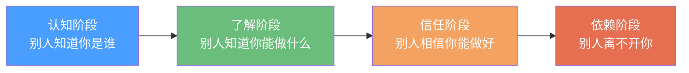

## 案例总结：人脉变现的共同规律

通过对程序员转型创业、宝妈社群创业、销售冠军人脉经营、跨行业资源整合、退休人士社交资本变现、线上到线下社交升级、社交恐惧突破等七个典型案例的深入剖析，我们可以提炼出人脉变现过程中反复出现的底层规律。这些规律不是某个行业的特例，而是社交资本运作的通用法则。

### 一、七类案例的横向对比

在深入规律之前，先用一张全景对比表把七个案例的关键变量摆在一起：

| 维度 | 程序员转型 | 宝妈社群 | 销售冠军 | 跨行业整合 | 退休人士 | 线上转线下 | 社恐突破 |
|------|-----------|---------|---------|-----------|---------|-----------|---------|
| 起点资源 | 技术技能 | 育儿经验 | 客户关系 | 多行业人脉 | 行业声望 | 线上粉丝 | 几乎为零 |
| 核心杠杆 | 技术输出 | 内容社群 | 信任积累 | 信息差 | 经验背书 | 流量转化 | 心态突破 |
| 变现路径 | 咨询→培训 | 社群→电商 | 转介绍→大客户 | 资源对接费 | 顾问→投资 | 付费社群 | 社交教练 |
| 爬坡周期 | 6-12个月 | 3-6个月 | 12-18个月 | 1-3个月 | 6-12个月 | 3-9个月 | 持续过程 |
| 月收入峰值 | 2-5万 | 1-3万 | 3-10万 | 5-20万 | 1-3万 | 2-8万 | 0.5-2万 |
| 复购/转介率 | 60% | 45% | 80% | 50% | 40% | 55% | 70% |

从这张表中可以直观看到：**不同起点、不同路径，但都通向了变现**。这说明人脉变现不是某个特定群体的特权，而是一种可习得、可复制的能力。

### 二、六大共同规律

#### 规律一：价值先行——先有用，再有利

七个案例无一例外地遵循了"先提供价值，后获得回报"的顺序。

程序员先在技术社区免费回答问题、写博客，积累了行业声望后才有客户主动找上门。宝妈先在妈妈群里分享育儿心得，解决了其他妈妈的实际困惑，之后才顺理成章地推荐好物。销售冠军不是一上来就推销，而是花大量时间了解客户的业务痛点，提供超出预期的建议。

**为什么价值先行如此关键？**

从社会交换理论（Social Exchange Theory）来看，人际关系本质上是一种资源交换。当你持续提供价值时，对方会产生"亏欠感"和"信任感"，这正是变现的心理基础。反过来，如果一上来就索取，对方会本能地启动防御机制，关系链条从一开始就断裂了。

**价值先行的三层递进：**

```text
第一层：信息价值 —— 分享有用的知识、数据、行业洞察
第二层：连接价值 —— 把对的人介绍给对的人，降低信息不对称
第三层：方案价值 —— 针对对方的具体问题给出可执行的解决方案
```

大多数人停留在第一层（转发文章、点赞评论），少数人到达第二层（主动牵线搭桥），真正做到第三层的人才具备最强的变现能力。

**实操检验清单：**

- 你最近一周是否免费帮助过至少一个人解决实际问题？
- 你的社交圈里，有多少人遇到问题时会第一时间想到你？
- 你分享的内容，是否有具体的人因此受益并反馈给你？

如果三个问题的答案都是"没有"或"很少"，说明你还在"索取端"而不是"价值端"。

#### 规律二：定位清晰——有标签才能被记住

所有成功案例的主人公都有一个明确的"社交标签"：

- 程序员 → "能解决技术难题的那个人"
- 宝妈 → "最懂育儿的社群群主"
- 销售冠军 → "永远比你多想一步的顾问"
- 资源整合者 → "什么人都认识的超级连接者"
- 退休人士 → "行业里最有经验的老前辈"
- 线上达人 → "那个内容最有料的博主"
- 社恐突破者 → "最理解社恐人群的社交教练"

**为什么标签如此重要？**

邓巴数理论告诉我们，一个人能维持的稳定社交关系上限约为150人。在你的社交圈里，每个人都在同时管理着150个"标签位"。如果你没有一个清晰的标签，你在别人的记忆中就是模糊的"某个人"——这意味着你永远不会被优先想起。

**标签设计的三要素：**

| 要素 | 说明 | 示例 |
|------|------|------|
| 专业领域 | 你擅长什么 | Python后端开发 |
| 差异化特征 | 你和其他人有什么不同 | 专注高并发架构优化 |
| 价值承诺 | 别人找你能得到什么 | 48小时内给出性能瓶颈诊断报告 |

**标签的传播测试：**

试着让三个朋友分别用一句话向别人介绍你。如果三个人说的都不一样，说明你的标签还没有立住。如果三个人说的都一样且准确，说明你的个人品牌已经成功植入了他们的认知。

#### 规律三：信任积累——慢就是快

七个案例中，从零到第一次变现的最短周期是1-3个月（跨行业资源整合），最长是12-18个月（销售冠军）。但无论快慢，**没有一个案例是跳过信任积累阶段直接变现的**。

**信任积累的四个阶段：**



- **认知阶段**（0-1个月）：通过持续输出内容、参与社群互动、出席线下活动等方式让目标人群认识你。关键词：曝光度。
- **了解阶段**（1-3个月）：通过具体的作品、案例、服务让别人了解你的能力边界。关键词：可验证。
- **信任阶段**（3-6个月）：通过多次小规模合作、及时响应、超预期交付建立信任。关键词：一致性。
- **依赖阶段**（6个月以上）：通过持续创造不可替代的价值，让对方形成路径依赖。关键词：不可替代。

**加速信任积累的三个杠杆：**

1. **背书借力**：找到已经被目标人群信任的人为你背书。退休人士案例中，主人公通过老同事的推荐迅速获得了新客户的信任——这是用别人的信用为你"预支"信任。
2. **小胜积大信**：不要等"大机会"，先把每一件小事做到极致。一次高质量的免费咨询胜过十次空洞的社交寒暄。
3. **公开承诺与兑现**：在社交媒体上公开承诺（"本周五前发布教程"），然后如期兑现。每次兑现都是一次信任存款。

#### 规律四：网络效应——从线性增长到指数增长

单独经营一对一关系是线性增长，建立网络效应才能实现指数增长。七个案例的共同转折点都出现在**从"我服务客户"转向"客户帮我介绍客户"**的那一刻。

**网络效应的三种模式：**

| 模式 | 机制 | 案例对应 | 启动难度 | 增长天花板 |
|------|------|---------|---------|-----------|
| 转介绍网络 | 满意的客户主动推荐新客户 | 销售冠军 | 低 | 中 |
| 社群网络 | 用户之间产生连接和互动 | 宝妈社群 | 中 | 高 |
| 平台网络 | 供需双方在你的平台上匹配 | 跨行业整合 | 高 | 极高 |

**触发网络效应的关键动作：**

1. **设计"可分享"的服务体验**：让客户在使用你的服务后有冲动分享给朋友。宝妈社群的做法是设计"组队优惠"——邀请3位好友入群可解锁专属福利。
2. **主动制造转介绍的机会**：销售冠军每次服务结束后都会说："如果您身边有朋友也有类似需求，欢迎推荐给我，我会给您和朋友都提供专属优惠。"这句话把转介绍从被动等待变成了主动触发。
3. **建立中间人激励机制**：跨行业资源整合者会给每个成功牵线的中间人一定比例的佣金，这让所有人都变成了你的"销售员"。

**网络效应的数学本质：**

假设你有N个客户，每个客户平均带来K个新客户，转化率为P。那么你的客户增长模型是：

```text
每轮新增客户 = N × K × P
```

当 K × P > 1 时，客户数量呈指数增长。这意味着：**只要每个客户平均能带来1个以上的新客户，你的增长就不会停止**。

#### 规律五：系统化——从手工作坊到自动化流水线

所有案例的主人公在初期都是亲力亲为，但最终实现规模化收入的关键转折是**建立系统**。

**系统化的四个层次：**

```text
Level 1：手动模式
  - 所有事情亲力亲为
  - 时间换钱，收入有天花板
  - 适合：起步阶段，验证商业模式

Level 2：流程化
  - 把重复性工作总结成SOP（标准操作流程）
  - 可以雇人或外包执行
  - 适合：已有稳定客户群，需要提升效率

Level 3：产品化
  - 把服务打包成标准化产品（课程、工具包、模板）
  - 一次生产，多次销售
  - 适合：已经验证需求，需要规模化

Level 4：平台化
  - 搭建平台，让供需双方自行匹配
  - 收取撮合费或平台佣金
  - 适合：拥有大量供需双方资源
```

**程序员案例的系统化路径：**

- Level 1：一对一接单写代码（月入5000）
- Level 2：整理出"常见技术问题解决方案库"，实习生按文档执行（月入1.2万）
- Level 3：把高频需求开发成自动化工具，按年收费（月入3万）
- Level 4：建立技术外包平台，对接需求方和开发者（月入10万+）

**系统化的核心原则：**

- **可复制**：任何人按照流程都能达到80%的质量
- **可度量**：每个环节都有明确的输入输出指标
- **可迭代**：有定期复盘和优化的机制

#### 规律六：反脆弱——把危机变成机会

七个案例中，没有一个是一帆风顺的。程序员遇到了技术迭代的冲击，宝妈经历了社群活跃度下降，销售冠军面对了行业寒冬，退休人士遭遇了健康问题。但他们都展现了同一种特质：**反脆弱性**——在压力和冲击下不仅没有崩溃，反而变得更强。

**反脆弱的人脉经营策略：**

| 策略 | 具体做法 | 效果 |
|------|---------|------|
| 多元化收入来源 | 不依赖单一客户或单一渠道 | 某条线断裂不会致命 |
| 深度关系储备 | 平时维护20-30个核心关系 | 危机时有人愿意帮你 |
| 持续学习迭代 | 每年学习1-2项新技能 | 能够适应环境变化 |
| 冗余社交网络 | 不只在一个圈子里活动 | 某个圈子衰退时有备选 |
| 现金流安全垫 | 始终保持6个月以上的生活储备 | 有底气拒绝劣质机会 |

**危机转机会的案例：**

宝妈社群在2023年遭遇微信封群，所有社群成员一夜之间失联。但她提前让核心成员互加了微信，并建立了备用的飞书群。在重建社群后，反而因为"失而复得"效应，核心用户的忠诚度和活跃度大幅提升。她后来说："那次封群是最好的用户筛选器——留下来的都是真正认可我的人。"

### 三、人脉变现的底层公式

综合以上六大规律，可以提炼出一个人脉变现的底层公式：

```text
人脉变现收益 = 价值密度 × 信任深度 × 网络广度 × 系统效率 × 时间复利
```

- **价值密度**：你提供的价值有多稀缺、多具体、多可衡量
- **信任深度**：别人对你的信任有多深——是"认识"还是"离不开"
- **网络广度**：你的有效人脉网络覆盖了多少人、多少行业
- **系统效率**：你把价值交付给客户的效率有多高
- **时间复利**：你的人脉资产是否随时间自动增值

五个变量是乘法关系，任何一个为零，总收益就是零。这就是为什么有些人"认识很多人"却赚不到钱（网络广度高但价值密度为零），有些人"技术很强"却卖不出去（价值密度高但网络广度为零）。

### 四、不同阶段的优先级策略

根据你当前所处的阶段，应该有不同的发力重点：

| 阶段 | 核心目标 | 第一优先级 | 第二优先级 | 常见陷阱 |
|------|---------|-----------|-----------|---------|
| 冷启动期（0-3个月） | 被人知道 | 输出价值 | 建立标签 | 急于变现，吓跑潜在客户 |
| 爬坡期（3-12个月） | 建立信任 | 深耕核心客户 | 触发转介绍 | 贪多求全，精力分散 |
| 稳定期（1-3年） | 规模化 | 系统化建设 | 品牌升级 | 停止学习，被后来者超越 |
| 飞轮期（3年以上） | 被动收入 | 平台化布局 | 生态构建 | 过度依赖既有模式，错失新机会 |

**冷启动期的关键动作：**

1. 选定一个细分领域，持续输出至少50篇高质量内容
2. 主动帮助20个目标人群解决实际问题（免费）
3. 找到3-5个同领域的KOL，建立初步连接
4. 记录每一次互动和反馈，建立个人CRM

**爬坡期的关键动作：**

1. 把最受欢迎的内容/服务打包成付费产品
2. 建立客户反馈闭环，每周复盘客户满意度
3. 设计转介绍机制，把满意客户变成推广渠道
4. 开始建立社群，把散点关系变成网络

**稳定期的关键动作：**

1. 搭建团队或合作体系，从"一个人干"变成"一群人干"
2. 建立品牌护城河——商标、版权、专利、独家资源
3. 拓展第二条变现曲线，避免单点依赖
4. 定期"社交体检"——评估人脉网络的健康度

**飞轮期的关键动作：**

1. 从"自己赚钱"转向"帮别人赚钱"，建立平台效应
2. 投资或孵化新的社交资本项目
3. 建立行业标准或认证体系，成为规则制定者
4. 回馈社区，建立长期声誉资产

### 五、最容易踩的五个坑

在梳理七个案例的过程中，我们发现即使最终成功的人也在以下坑里摔过跤：

**坑一：把"加好友"等同于"建人脉"**

很多人追求微信好友数量，加了几千人但从不深度交流。实际上，5000个"点赞之交"的价值远不如50个"患难之交"。邓巴数的启示是：你真正能维护的关系上限是150人，核心亲密关系只有5人。把精力花在深耕少数高质量关系上，比广撒网有效得多。

**纠正方法**：每季度做一次"人脉断舍离"——把从未互动的联系人归档，把精力集中在真正有价值的关系上。

**坑二：只输出不输入**

有些人持续输出内容，但从不学习新知识、不接触新圈子。输出的内容逐渐同质化，最终失去吸引力。

**纠正方法**：遵循"721法则"——70%的时间输出，20%的时间学习输入，10%的时间反思总结。

**坑三：忽视弱关系的价值**

很多人只经营强关系（家人、密友），忽视弱关系（点头之交、社群网友）。但社会学家格兰诺维特的研究表明，弱关系才是信息和机会的主要来源——因为强关系的圈子高度重叠，而弱关系能把你带到全新的信息网络。

**纠正方法**：每月至少参加一次新圈子的活动，主动与3个弱关系进行有深度的对话。

**坑四：过早追求变现**

在信任还没有建立起来的时候就急于推销产品或收费服务，会让好不容易积累的好感瞬间崩塌。

**纠正方法**：给自己设定一个"免费价值输出期"——至少3个月内不主动推销，只通过价值输出建立信任。当对方主动问"你有什么产品/服务"时，才是最佳的变现时机。

**坑五：忽视关系维护的持续性**

很多人在获得客户后就不再维护关系，直到需要再次变现时才突然联系。这种"用完就扔"的模式会让关系迅速退化。

**纠正方法**：建立"关系维护日历"——每周固定花2小时进行关系维护，包括：给核心联系人分享有价值的信息、祝贺对方的成就、在对方需要时主动提供帮助。

### 六、自测：你的人脉变现能力到了哪个阶段？

回答以下10个问题，每个"是"计1分：

| # | 问题 | 0分 | 1分 |
|---|------|-----|-----|
| 1 | 你能否用一句话说清楚自己能为别人提供什么价值？ | 含糊 | 清晰 |
| 2 | 你的社交圈里是否有人主动向别人推荐你？ | 无 | 有 |
| 3 | 最近一个月你是否免费帮助过至少3个人？ | 否 | 是 |
| 4 | 你是否有至少一个稳定的付费客户或收入来源？ | 否 | 是 |
| 5 | 你是否有一套标准化的服务流程（SOP）？ | 否 | 是 |
| 6 | 你是否定期参加新圈子的活动？ | 否 | 是 |
| 7 | 你的收入是否不依赖于单一客户？ | 否 | 是 |
| 8 | 你是否有意识地维护至少20个核心关系？ | 否 | 是 |
| 9 | 你最近半年是否学过一项新技能？ | 否 | 是 |
| 10 | 你是否有明确的个人品牌标签？ | 否 | 是 |

**评分解读：**

- **0-3分**：冷启动期——你需要先找到自己的价值定位，开始持续输出
- **4-6分**：爬坡期——你已经有了基础，重点是深耕客户关系和触发转介绍
- **7-8分**：稳定期——你的体系已初具规模，下一步是系统化和团队化
- **9-10分**：飞轮期——你的社交资本已经能自动运转，重点是平台化和生态构建

### 七、本节总结

七类不同背景的案例，指向同一个结论：**人脉变现的本质不是"认识多少人"，而是"为多少人创造了不可替代的价值"**。

六大共同规律可以浓缩为一句话：**先创造价值、再建立信任、然后放大网络、最后用系统固化**。这四个步骤的顺序不能颠倒——跳过前两步直接做第三步（疯狂加人拉群），就像地基没打好就盖高楼，早晚会塌。

记住那个公式：**人脉变现收益 = 价值密度 × 信任深度 × 网络广度 × 系统效率 × 时间复利**。找到你当前最薄弱的那个变量，集中精力突破它。当五个变量都为正且持续增长时，人脉变现就不再是"努力赚钱"，而是"钱自己来找你"。
