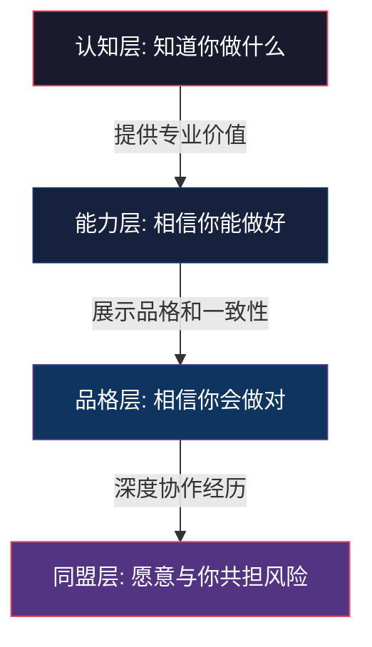
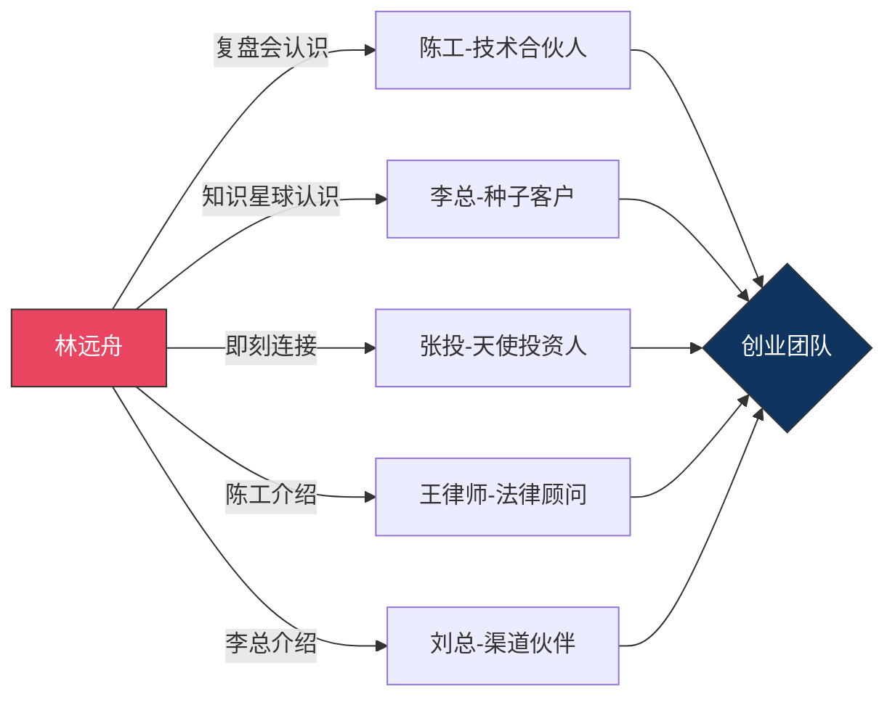
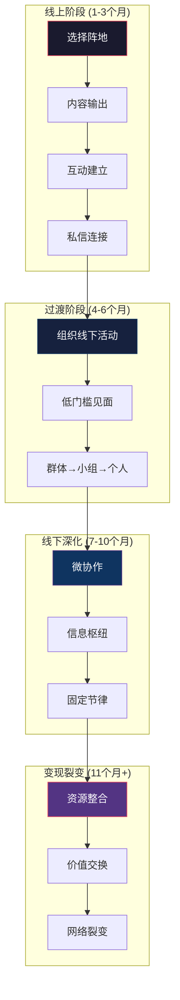

## 案例六：从线上到线下的社交升级

> **核心命题**：线上社交是起点，不是终点。真正有深度的人脉关系，必须经历从屏幕到面对面的"社交升级"，才能产生信任复利。

### 案例主人公

**林远舟**，28岁，二线城市（成都）互联网公司产品经理，工作第四年。性格偏内向，不擅长酒桌应酬和线下寒暄，但在文字表达和逻辑分析上有明显优势。微信好友约600人，其中能算得上"朋友"的不到20人，行业人脉几乎为零。

**起点困境**：工作四年，技术能力扎实，但职业发展遇到瓶颈——公司内部晋升通道有限，跳槽又缺乏行业人脉获取优质机会。同时，他有创业的想法（面向B端的SaaS工具），但既没有合伙人资源，也没有客户渠道。

**转折时间线**：从2024年3月开始有意识地进行"线上→线下"社交升级，历时14个月，建立了覆盖成都互联网圈、投资人圈、SaaS行业圈的三维人脉网络，最终通过人脉促成创业，获得天使轮融资。

---

### 第一阶段：线上播种（第1-3个月）

#### 1.1 选择正确的线上阵地

林远舟没有盲目铺开所有平台，而是根据自己的目标和优势做了精准选择：

| 平台 | 定位 | 投入策略 | 目标 |
|------|------|----------|------|
| 即刻 | 产品经理社区，氛围年轻 | 每天发布1条产品思考，参与热门话题讨论 | 建立行业认知度 |
| 知识星球 | 付费圈子，质量筛选 | 加入2个高质量产品/创业圈子，每周写2篇深度复盘 | 吸引同频高质量人脉 |
| 微信公众号 | 长文输出，建立专业标签 | 每两周1篇3000字以上的深度分析 | 沉淀专业内容资产 |
| LinkedIn/脉脉 | 职场社交，弱关系池 | 更新个人资料，主动连接同行业产品经理 | 拓展弱关系网络 |

**关键决策逻辑**：不是哪个平台火就去哪个，而是选择"目标人群密度最高+自身优势最容易发挥"的平台组合。即刻和知识星球的产品经理浓度远高于抖音或小红书，而林远舟的文字表达能力恰好是最强武器。

#### 1.2 内容策略：从"潜水者"到"被看见的人"

林远舟给自己定了一个原则：**不发没有观点的内容**。

他观察到大多数人在社交平台上要么转发不评论，要么发情绪化的吐槽，这两种都无法建立专业形象。他选择了一条差异化路线——**用数据和逻辑说话**。

**具体做法**：

- **产品分析系列**：拆解热门产品的商业模式、用户增长策略、产品设计决策。不是泛泛而谈，而是带着产品经理的视角，分析"这个决策背后的逻辑是什么""如果是我会怎么做"。
- **行业观察周报**：每周整理SaaS行业的融资动态、产品更新、趋势变化，附上自己的简短点评。信息密度高，节省读者时间。
- **实战复盘帖**：把自己工作中遇到的真实问题（当然做了脱敏处理）拿出来分析，展示思考过程而非结论。

**数据表现**（3个月后）：

| 指标 | 第1个月 | 第2个月 | 第3个月 |
|------|---------|---------|---------|
| 即刻关注者 | 120 | 580 | 1,400 |
| 知识星球互动 | 15条/周 | 40条/周 | 80条/周 |
| 公众号粉丝 | 50 | 320 | 900 |
| 主动私信交流人数 | 2 | 8 | 25 |

这些数字看起来不大，但**质量远超数量**——主动私信的人大多是行业内的产品经理、创业者、投资人，每一个都是高价值弱关系的起点。

#### 1.3 线上社交的关键技巧

**技巧一：评论比发帖更重要**

林远舟发现，在别人的帖子下留一条有深度的评论，效果往往好过自己发一条新帖。原因很简单：评论能借势——借大V的流量、借热门话题的热度。而且一条好评论会让原帖作者注意到你，这就是弱关系建立的第一步。

他的方法是：每天花30分钟浏览行业大V的更新，找到自己能提供独特视角的帖子，写一条200字以上的深度评论。不追求每条都火，但保证每条都有实质内容。

**技巧二：私信的"三段式"结构**

当林远舟想主动连接某个人时，他的私信遵循固定的结构：

```text
第一段：认同（说明你关注对方的哪些内容，为什么觉得有价值）
第二段：共鸣（分享你对同一话题的思考，展示同频）
第三段：请求（明确、具体、低成本的请求）
```

**反面案例** vs **正面案例**：

```text
❌ "你好，我是做产品的，想加你微信交流一下。"
——太模糊，对方没有理由回应。

✅ "张老师您好，您上周在即刻分析的SaaS定价策略那条我看了三遍，
特别是'价值锚点比成本锚点更适合B端'这个观点，我正好在做一个
定价模型的项目，做了一份竞品定价对比表，如果您有兴趣我可以
发给您看看，也想听听您的看法。"
——有认同、有共鸣、有具体的价值交换请求。
```

**技巧三：建立"内容钩子"**

林远舟会刻意在内容中留下"钩子"——一些开放性的问题、一个未完成的分析框架、一个邀请协作的方向。这些钩子会激发读者的参与欲望，从被动阅读变成主动互动。

---

### 第二阶段：线上→线下的临界点突破（第4-6个月）

#### 2.1 为什么要从线上走到线下？

林远舟在第4个月做了一次复盘，发现了一个关键问题：

> 线上建立了大约50个有价值的弱关系，但这些关系的"温度"始终停留在6分（满分10分）。点赞、评论、私信能维持关系的活性，但无法推动信任的深化。

这正是格兰诺维特弱关系理论的延伸应用——**弱关系带来信息优势，但只有升级为中等强度关系，才能带来资源对接和深度合作**。而升级的关键催化剂，就是线下见面。

社会心理学研究也支持这一点。斯坦福大学的一项实验发现，面对面交流建立的信任度是纯文字交流的3.2倍，是视频交流的1.8倍。原因在于线下交流能传递大量非语言信号——微表情、肢体语言、语调变化、即时反应速度——这些信号是判断一个人是否值得信任的关键依据。

#### 2.2 线下见面的"低门槛启动法"

直接约一个网上认识的人线下见面，双方都会感到压力。林远舟设计了一套"低门槛启动法"：

**第一步：从"小聚"开始，而非"一对一约见"**

他没有直接约人一对一喝咖啡（这种方式对双方都是高压力），而是选择组织3-5人的小规模主题聚会。

```text
主题选择原则：
1. 参与者有共同话题（避免冷场尴尬）
2. 有明确的讨论议程（不是漫无目的的闲聊）
3. 时间控制在2小时以内（不要让人觉得是负担）
4. 选择中性场所（咖啡厅、共享空间，而非餐厅或酒吧）
```

**第二步：利用"活动"作为社交容器**

林远舟发起了一个"成都产品经理月度复盘会"的活动：

| 要素 | 具体安排 |
|------|----------|
| 频率 | 每月最后一个周六下午 |
| 人数 | 每期6-8人（控制在邓巴亲密关系圈的范围内） |
| 形式 | 每人15分钟分享当月产品复盘 + 30分钟自由讨论 |
| 地点 | 成都高新区某共享办公空间（免费或AA） |
| 筛选 | 线上活跃度 + 从业年限 + 分享意愿 |

**关键设计**：活动的"价值主张"不是社交本身，而是"学习和成长"。这让参与者觉得即使没有建立人脉，也能获得知识价值，降低了参与的心理门槛。

**第三步：制造"自然的线下过渡"**

对于一些一对一见面更合适的人，林远舟会创造自然的过渡场景：

- "我下周三下午在太古里那边见一个客户，你办公室是不是也在附近？方便的话喝杯咖啡？"——利用已有的行程，减少对方的心理负担。
- "我们复盘会结束后，几个做SaaS的说要留下来聊聊创业的事，你有兴趣一起来吗？"——从群体活动中自然延伸出小群体深聊。

#### 2.3 第一次线下聚会的复盘

**第一次活动数据**：

| 项目 | 数据 |
|------|------|
| 报名人数 | 12人 |
| 实到人数 | 7人 |
| 平均交流时长 | 2.5小时 |
| 活动后加微信 | 互加21对（7人之间的全排列） |
| 后续保持联系 | 5人（71%留存率） |

**关键发现**：7个人中有2个是林远舟线上已经认识的，5个是通过这2个人的转发报名来的。这完美验证了弱关系理论——通过已有的弱关系，桥接到新的弱关系。

**意外收获**：其中一个参与者（陈工，某上市公司技术总监）在会后主动找林远舟聊了40分钟，表达了对他SaaS创业想法的兴趣。这成为后来林远舟创业的第一个技术合伙人候选人。

---

### 第三阶段：线下信任深化（第7-10个月）

#### 3.1 从"认识"到"信任"的关键路径

线下见面只是起点。林远舟总结出了一套"信任三阶梯"模型：



**认知层**：对方知道你是谁、做什么、擅长什么。——线上内容已经解决。

**能力层**：对方相信你有能力把事情做好。——需要通过具体的事例证明。

**品格层**：对方相信你在利益冲突时会做正确的选择。——需要时间和经历来验证。

**同盟层**：对方愿意与你共担风险、共享资源。——这是人脉变现的最高形态。

#### 3.2 加速信任深化的三个方法

**方法一：创造"微协作"机会**

林远舟主动为他想深交的人提供小规模、低风险的协作机会：

- 为一个做增长的朋友做了一份免费的用户调研分析报告
- 帮一个创业者的商业计划书提了修改建议
- 和一个投资人朋友合作写了一篇行业分析文章，联合署名发表

这些"微协作"的特点是：**投入小、周期短、风险低、价值可见**。通过完成一件小事，证明自己的能力和靠谱程度，为更深度的合作铺路。

**方法二：成为"信息枢纽"**

林远舟刻意训练自己做一个"信息路由器"——当他看到对某人有用的信息、资源或人脉时，主动转发和连接。

```text
他的转发公式：
"@李总，看到这个SaaS安全合规的政策解读，想到您之前提过
合规是你们产品的痛点，这篇文章的第三部分分析得很到位。
另外，我认识一个做安全合规咨询的朋友@王工，如果需要
我可以介绍你们认识。"
```

这种行为的社交效果是双重的：既提供了直接价值（信息和资源），又展示了自己的"连接者"身份——暗示你拥有丰富的人脉网络，是值得结交的人。

**方法三：建立"固定社交节律"**

林远舟给自己制定了一个社交日历：

| 时间 | 活动 | 对象 |
|------|------|------|
| 每周一上午 | 给3个重要联系人发消息 | 核心人脉（15人） |
| 每周三中午 | 和1个人线下午餐 | 本周需要加深的关系 |
| 每月最后一个周六 | 产品经理复盘会 | 社群成员（6-8人） |
| 每季度一次 | 组织跨圈聚会 | 不同圈子的核心人物 |

这个节律的关键在于**一致性**——不是心血来潮时疯狂社交，而是像上班打卡一样稳定执行。信任的建立靠的不是一次惊艳的表现，而是持续可靠的出现。

#### 3.3 线下社交的具体场景与话术

**场景一：一对一咖啡会谈**

林远舟总结了"咖啡会谈三段论"：

```text
前30分钟：听对方说（了解对方的需求、挑战、关注点）
中间20分钟：分享你的思考（针对对方的问题提供你的视角）
最后10分钟：明确下一步（约下次、确认帮忙事项、交换资源）
```

关键话术示例：

```text
开场："最近在忙什么项目？有什么有意思的发现吗？"
——开放式问题，让对方选择话题方向。

深入："这个挑战听起来挺有意思的，你目前考虑了哪些方案？
各有什么优劣？"
——引导对方展开分析，展示你在认真思考。

收尾："今天聊得很收获，有两件事我可以帮你：
一是我可以把XX的联系方式推给你，二是我可以帮你看看
那个方案的逻辑有没有漏洞。下周方便的话，我把结果发你。"
——具体化下一步行动，展示靠谱。
```

**场景二：多人聚会中的社交策略**

```text
到场前：
- 了解参会人员名单和背景
- 准备2-3个"万能话题"（行业趋势、近期热点事件）
- 设定目标：和至少2个新人深度交流

到场时：
- 前15分钟：观察全场，找到"落单"的人主动搭话
- 中间时段：做一个"连接者"，主动介绍互不认识但可能有交集的人
- 后半段：和目标交流对象深入对话

离场后：
- 24小时内发一条"很高兴认识你"的消息
- 分享对方提到的感兴趣的内容
- 把今天认识的、可能互相需要的两个人介绍给彼此
```

---

### 第四阶段：人脉网络的变现与裂变（第11-14个月）

#### 4.1 创业合伙人网络的形成

经过10个月的线上+线下经营，林远舟的人脉网络发生了质变：

| 维度 | 起步时 | 10个月后 |
|------|--------|----------|
| 微信好友 | 600人 | 1,200人 |
| "高质量联系人"（邓巴50人层） | 20人 | 45人 |
| "信任同盟"（可深度合作） | 0人 | 8人 |
| 跨行业人脉覆盖 | 1个（互联网产品） | 5个（+投资、技术、销售、设计、法律） |
| 主动找上门的合作机会 | 0次/月 | 3-5次/月 |

**最关键的转化**：在第10个月，林远舟通过人脉网络找到了创业所需的核心资源：



每一个关键资源的获取路径都不同，但都遵循同一个模式：**线上建立认知 → 线下深化信任 → 价值交换促成合作**。

#### 4.2 从人脉到融资的转化路径

林远舟的天使轮融资，完整展示了"社交资本→经济资本"的转化过程：

**第一环：内容吸关注**
林远舟在即刻和公众号上持续输出的SaaS行业分析，引起了投资人张投的注意。张投是某天使基金的合伙人，专注SaaS赛道。

**第二环：线上建连接**
张投主动在林远舟的一篇分析下留言讨论，两人在线上交流了两周，涉及行业趋势、产品方向、商业模式。

**第三环：线下验信任**
张投邀请林远舟参加一个小型投资圈聚会。林远舟在聚会中的表现——专业、务实、不夸大——给张投和其他投资人留下了深刻印象。

**第四环：协作试水温**
张投建议林远舟先以顾问身份服务一个被投企业，验证其产品能力。林远舟花了一个月时间，交付了一份高质量的产品方案。

**第五环：投资落地**
基于线上内容评估+线下信任验证+实际协作验证的三重背书，张投决定领投林远舟的种子轮融资，金额150万元。

#### 4.3 人脉网络的裂变效应

创业之后，林远舟的人脉网络进入了"裂变期"：

```text
裂变路径：
种子客户（3个，来自人脉网络）
  → 客户转介绍（+7个新客户）
    → 行业口碑（+15个主动咨询）
      → 媒体报道（行业公众号撰文推荐）
        → 更多投资人关注
```

14个月后，林远舟的SaaS产品已经拥有25个付费客户，团队扩展到5人（其中3人通过人脉网络招募），月营收突破8万元。

---

### 方法论提炼：线上→线下社交升级的完整框架

#### 框架总览



#### 线上→线下转化的核心公式

```text
社交升级成功率 = 内容价值 × 见面频率 × 协作深度 × 时间积累
```

- **内容价值**决定了别人为什么要认识你（入场券）
- **见面频率**决定了信任建立的速度（催化剂）
- **协作深度**决定了关系的牢固程度（粘合剂）
- **时间积累**决定了网络的规模和质量（复利因子）

四个因子缺一不可。只有内容没有见面，关系停在弱连接；只有见面没有协作，关系停在点头之交；只有协作没有时间，关系无法形成稳定同盟。

---

### 常见误区与纠偏

#### 误区一：线上表现好就够了

**错误认知**：我在网上有很多粉丝/关注者，我的社交资本已经很强了。

**真相**：线上影响力≠社交资本。粉丝是单向的关注关系，不是双向的信任关系。10,000个粉丝中可能只有10个人愿意在你需要时伸出援手，而这10个人一定是你线下见过面、建立过信任的人。

**纠偏方法**：每获得100个线上高质量关注者，至少将其中5个转化为线下见面。

#### 误区二：线下见面就是吃饭喝酒

**错误认知**：社交就是请客吃饭、KTV应酬，不去就是不给面子。

**真相**：有效的线下社交是"价值交换的场景化"，核心不在于吃什么喝什么，而在于交流中传递了什么信息、建立了什么共识、达成了什么协作意向。一顿3小时的饭局，如果没有实质内容的交流，不如一次30分钟的高质量咖啡会谈。

**纠偏方法**：每次线下见面前，明确"这次见面我要解决什么问题/达成什么目标"，带着目的社交。

#### 误区三：社交升级要广撒网

**错误认知**：认识的人越多越好，线下活动参加得越多越好。

**真相**：邓巴数限制了你能够维持的关系数量。频繁参加活动但不做深度跟进，等于不断往一个漏桶里倒水。林远舟的成功不在于参加了多少活动，而在于每次活动后都做了高质量的跟进和深化。

**纠偏方法**：参加活动的数量做减法（每月不超过4次），但每次活动后的跟进做加法（24小时内联系、1周内再次互动、1个月内创造协作机会）。

#### 误区四：等待别人主动联系你

**错误认知**：我是做技术/产品的，不需要主动社交，做出好东西自然有人来找我。

**真相**：酒香也怕巷子深。在信息爆炸的时代，再好的能力如果不主动展示，就会被淹没。而且"主动"不等于"功利"——主动分享有价值的内容、主动帮助别人解决问题、主动介绍可能互相需要的人认识，这些都是"主动社交"的形式，但完全不功利。

**纠偏方法**：每天花30分钟做"社交投资"——发一条有价值的内容、帮一个人解决一个问题、给一个朋友推荐一个资源。

#### 误区五：线上到线下一步到位

**错误认知**：在网上聊得不错，直接约出来一对一见面。

**真相**：从线上到线下的过渡需要"缓冲区"。直接约一对一见面，双方都有压力——万一对方和网上表现的不一样怎么办？万一没话题聊怎么办？

**纠偏方法**：遵循"群体→小组→个人"的渐进路径。先在群体活动中见面（3-5人的聚会），然后在小群体中深聊（2-3人的专题讨论），最后才是单独见面。

---

### 工具箱：线上→线下社交升级的实操清单

#### 线上阶段工具

| 工具 | 用途 | 具体操作 |
|------|------|----------|
| 即刻/Twitter | 行业话题互动 | 每天30分钟浏览+2条深度评论 |
| 知识星球 | 高质量圈子沉淀 | 加入2-3个付费圈子，每周输出2篇 |
| Notion | 内容选题管理 | 建立选题库，记录灵感和素材 |
| 微信标签 | 联系人分类管理 | 按"行业-关系深度-最近互动时间"三维标签 |

#### 线下过渡工具

| 工具 | 用途 | 具体操作 |
|------|------|----------|
| 活动行/互动吧 | 活动发布和报名 | 每月发布1次主题聚会 |
| 飞书/腾讯文档 | 活动议程共享 | 提前发议程，参与者了解讨论方向 |
| 名片全能王 | 线下名片管理 | 拍照识别，自动录入CRM |
| 微信备忘录 | 交流要点记录 | 每次见面后记录对方关键信息和承诺事项 |

#### 关系深化工具

| 工具 | 用途 | 具体操作 |
|------|------|----------|
| Notion/飞书多维表格 | 人脉CRM系统 | 记录每个人的背景、需求、互动历史、下一步行动 |
| 日历提醒 | 固定社交节律 | 设定每周/每月的社交活动提醒 |
| 石墨文档 | 协作项目管理 | 和关键人脉的微协作项目跟踪 |
| 微信"强提醒" | 重要跟进不遗漏 | 对需要重点跟进的人设置强提醒 |

---

### 财务视角：社交投资的ROI分析

林远舟在14个月的社交升级过程中，记录了完整的投入产出数据：

#### 投入成本明细

| 成本项 | 月均投入 | 14个月合计 | 备注 |
|--------|----------|------------|------|
| 线上内容创作时间 | 15小时 | 210小时 | 写作、评论、互动 |
| 线下活动时间 | 8小时 | 112小时 | 聚会、咖啡、深聊 |
| 工具订阅费 | 200元 | 2,800元 | 知识星球、CRM工具等 |
| 线下活动费用 | 300元 | 4,200元 | 咖啡、场地、交通 |
| **合计** | **24小时+500元** | **322小时+7,000元** | — |

#### 产出回报明细

| 回报项 | 价值估算 | 备注 |
|--------|----------|------|
| 创业合伙人（陈工） | 无法估价 | CTO级别的合伙人，市场年薪80万+ |
| 天使轮融资（150万） | 150万元 | 通过张投的人脉直接获得 |
| 种子客户（3个） | 约15万元/年 | 首年合同金额 |
| 团队招聘（3人） | 节省猎头费约9万元 | 按每人3万猎头费计算 |
| 行业信息价值 | 难以量化 | 提前获取政策变化、竞品动态等 |
| **保守估算总回报** | **174万+** | 不含长期复利和信息价值 |

#### ROI计算

```text
投入：322小时 + 7,000元
产出：174万元 + 不可量化的长期价值

时间投入折算（按月薪15,000元、月176小时计算，时薪85元）：
322小时 × 85元 = 27,370元

总投入成本：27,370 + 7,000 = 34,370元
总产出回报：1,740,000元

ROI = (1,740,000 - 34,370) / 34,370 ≈ 4,960%
```

**这个ROI不是每个人都能复制的**——它依赖于林远舟自身的能力基础和市场机遇。但它清晰地说明了一个事实：**社交资本的投资回报率，远高于大多数金融投资产品**。

---

### 进阶思考：线上→线下社交升级的底层逻辑

#### 为什么线上到线下是单向不可逆的升级？

从社会学角度看，线上和线下社交满足的是不同层次的需求：

| 层次 | 线上社交 | 线下社交 |
|------|----------|----------|
| 信息交换 | ✅ 高效 | ✅ 高效 |
| 情感连接 | ⚠️ 有限 | ✅ 深度 |
| 信任验证 | ❌ 困难 | ✅ 可靠 |
| 非语言信号 | ❌ 缺失 | ✅ 丰富 |
| 共同经历 | ⚠️ 弱 | ✅ 强 |
| 承诺约束 | ❌ 低 | ✅ 高 |

线上社交擅长"广度"——低成本连接大量弱关系。线下社交擅长"深度"——高效率建立信任和情感连接。两者不是替代关系，而是递进关系。

#### 社交升级的"临界质量"现象

林远舟的经历验证了一个现象：社交资本的增长不是线性的，而是存在一个"临界质量"——

- **临界质量前**（前6个月）：投入大量时间和精力，但回报不明显。会感觉"社交好像没什么用"。
- **临界质量后**（第7个月起）：机会开始主动找上门，人脉网络开始自我增长，投入产出比急剧提升。

这个临界质量大约在"50个高质量弱关系+10个中等信任关系+3个深度信任关系"时出现。到达这个点后，网络效应开始发挥作用——你的朋友们开始互相介绍，新的机会通过二度、三度人脉自动传导到你这里。

这就是为什么社交投资需要**长期主义**——大多数人放弃在临界质量到来之前，误以为社交没有用。

---

### 本案例的核心启示

1. **线上是手段，线下是目的**。线上社交的价值在于低成本筛选和连接弱关系，但真正有价值的人脉关系必须走到线下。

2. **内容是最好的社交货币**。在信息过载的时代，持续输出有价值的内容是最低成本、最高效率的"被发现"方式。

3. **从群体到个人的渐进路径**。不要直接约网上认识的人一对一见面，通过群体活动作为过渡，降低双方的心理压力。

4. **信任需要"微协作"来验证**。口头承诺不算数，只有通过具体的、小规模的协作，才能真正验证一个人是否值得信任。

5. **社交资本的回报是非线性的**。前期投入看不到回报是正常的，坚持到临界质量后，回报会呈指数级增长。

6. **社交的本质是价值交换**。提升自身价值是一切社交策略的根本。没有价值的人，再多的社交技巧也只是花架子。

> **林远舟的总结**："我不是一个善于社交的人，但我发现社交的本质不是能说会道，而是能为别人创造价值。当你持续输出有价值的内容、真诚地帮助每一个你遇到的人、靠谱地完成每一件你承诺的事，人脉会自己长出来。"
