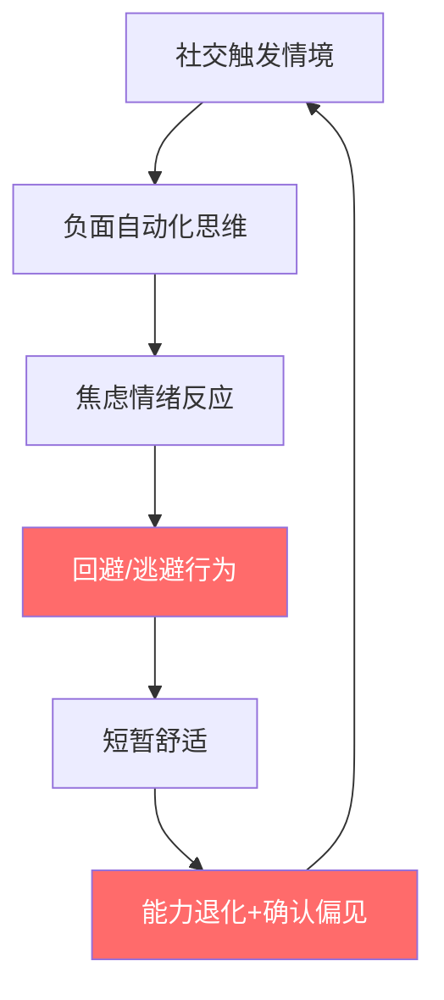
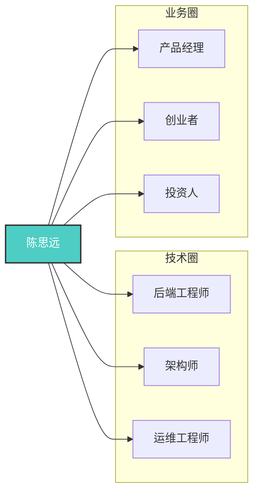

## 案例七：从社交恐惧到社交达人——一个内向程序员的社交资本逆袭之路

> "社交恐惧不是性格缺陷，而是一套可以被改写的认知程序。"

### 案例背景

#### 主人公画像

陈思远（化名），30岁，某互联网公司后端开发工程师。技术能力在团队中属于上游，但入职五年始终停留在P6级别，薪资涨幅远低于同期入职的同事。问题出在哪里？不是代码写得不好，而是**几乎没有人知道他代码写得好**。

他的社交状态可以用一组数据来描述：

| 维度 | 具体表现 |
|------|----------|
| 社交回避频率 | 每周拒绝2-3次同事聚餐/活动邀请 |
| 主动社交行为 | 近乎为零——不主动加微信、不主动发起话题 |
| 人脉圈规模 | 微信好友不足200人，活跃联系人不超过10人 |
| 线下社交耐受力 | 超过4人的聚会就会感到焦虑，30分钟后想逃离 |
| 职场影响力 | 年度述职评分在团队中排名后20% |
| 身体反应 | 社交场合会出现心跳加速、手心出汗、大脑空白 |

陈思远的情况并非个例。中国心理卫生协会的调查显示，约**15%-20%的职场人士存在不同程度的社交焦虑**，其中技术岗位的比例更高，达到25%-30%。这些人往往能力很强，但因为社交障碍，错失了大量的职业发展和财富增长机会。

#### 转折点：一次被拒的晋升

入职第五年，陈思远申请晋升P7。技术评审顺利通过，但在360度环评环节，他收到了这样的反馈：

- "不太了解他的工作成果"——来自隔壁组的Tech Lead
- "很少看到他在技术分享中发言"——来自部门总监
- "合作中沟通偏被动，不太清楚他的想法"——来自产品经理

最终，一个技术能力不如他但善于展示和沟通的同事获得了晋升名额。这次失败让陈思远意识到：**在职场中，被看见和被认可，与能做事同等重要。**

他决定改变。

---

### 第一阶段：认知重建——理解社交恐惧的底层机制（第1-4周）

#### 1.1 社交恐惧的心理学本质

陈思远做的第一件事不是逼自己去社交，而是**理解自己的恐惧从何而来**。他阅读了心理学家林恩·亨德森（Lynne Henderson）的《社交焦虑手册》和认知行为疗法（CBT）的相关文献，逐渐理解了社交焦虑的核心机制：



**社交恐惧的恶性循环**：回避行为虽然带来短期舒适，但长期来看会强化"我不擅长社交"的信念，导致社交能力进一步退化，形成自我实现的预言。

陈思远在笔记本上记录了自己的核心恐惧模式：

| 触发情境 | 自动化思维 | 情绪评分(0-10) | 认知偏差类型 |
|----------|-----------|----------------|-------------|
| 团队聚餐被点名发言 | "我说的话一定很无聊" | 8 | 读心术+灾难化 |
| 技术分享会上提问 | "问题太傻会被嘲笑" | 7 | 过度概括 |
| 电梯里遇到领导 | "不知道说什么会很尴尬" | 6 | 灾难化 |
| 行业活动中的陌生人 | "别人不想被打扰" | 9 | 读心术 |
| 微信群里的讨论 | "回复不好会暴露无知" | 7 | 全或无思维 |

#### 1.2 内向≠社交恐惧

通过学习，陈思远区分了两个经常被混淆的概念：

**内向（Introversion）**：一种人格特质，内向者通过独处恢复能量。内向者可以社交得很好，只是社交会消耗他们的能量。世界首富比尔·盖茨、投资大师沃伦·巴菲特都是典型的内向者，但他们的社交能力毫不逊色。

**社交焦虑（Social Anxiety）**：一种心理状态，表现为对社交场景的过度恐惧和回避。社交焦虑的本质是**对负面评价的恐惧**，它不是人格特质，而是一套可以被改写的认知模式。

这个区分很重要——它意味着陈思远不需要把自己变成一个外向的人，他只需要**消除那些不合理的恐惧和回避行为**。

#### 1.3 制定"社交康复"路线图

基于认知行为疗法的阶梯暴露原则，陈思远为自己制定了一个从低焦虑到高焦虑的渐进式社交训练计划：

| 阶段 | 时间 | 目标场景 | 焦虑等级 | 具体任务 |
|------|------|----------|----------|----------|
| 第一阶段 | 第1-4周 | 安全环境 | 2-3/10 | 与1-2个熟人的日常交流 |
| 第二阶段 | 第5-8周 | 半安全环境 | 4-5/10 | 团队内部的主动发言和讨论 |
| 第三阶段 | 第9-16周 | 挑战环境 | 6-7/10 | 跨部门交流、小型行业活动 |
| 第四阶段 | 第17-24周 | 高挑战环境 | 8-9/10 | 大型行业活动、主动社交拓展 |

---

### 第二阶段：从安全区开始——微习惯养成（第1-8周）

#### 2.1 每日社交微练习

陈思远没有一开始就逼自己去参加大型社交活动，而是从**最小可执行的社交行为**开始：

**第一周的任务清单：**

- [ ] 每天主动和一个同事打招呼（不是被动回应，而是主动发起）
- [ ] 在茶水间遇到同事时，多说一句话（比如"今天咖啡不错"而不是只点头）
- [ ] 在工作群中回复一条消息（可以是对他人观点的赞同）
- [ ] 记录每天的社交行为和焦虑评分

**第二周的任务清单（在第一周基础上增加）：**

- [ ] 每天和一个同事进行5分钟以上的非工作话题聊天
- [ ] 主动问一个同事"中午一起吃饭吗"
- [ ] 在代码评审中至少提一条建设性意见
- [ ] 给一个同事的朋友圈点赞并写一条有内容的评论

#### 2.2 认知重构日记

每天晚上，陈思远花10分钟记录当天的社交事件，用CBT的三栏法进行认知重构：

| 事件 | 原始想法 | 理性替代想法 |
|------|----------|-------------|
| 午饭时同事聊游戏，我插不上话 | "我太无趣了，和大家没有共同语言" | "我不玩这个游戏不代表无趣，可以问他们这个游戏好玩在哪，了解新领域" |
| 代码评审时被质疑方案 | "他们觉得我技术不行" | "代码评审的目的就是互相质疑方案，这是正常的技术讨论，不是人身攻击" |
| 主动打招呼后对方没回应 | "我被无视了，以后别自讨没趣" | "他可能戴着耳机没听到，或者在想事情，这和我无关" |

#### 2.3 成果：建立第一个"安全基地"

经过8周的微练习，陈思远取得了初步进展：

| 指标 | 训练前 | 第8周 |
|------|--------|-------|
| 每日主动社交次数 | 0次 | 3-4次 |
| 社交焦虑平均评分 | 7.2/10 | 5.1/10 |
| 团队聚餐参与率 | 20% | 75% |
| 工作群发言频率 | 每周1-2次 | 每天1-2次 |
| 与同事的午餐频率 | 每周1次 | 每周4次 |

最大的变化不是数据上的，而是**认知上的**——他开始意识到，大多数人并没有他想象中那么关注他的表现。心理学中有一个概念叫"聚光灯效应"（Spotlight Effect），人们往往会高估别人对自己的关注度。实际测试下来，他说错话时别人根本不在意，他的"社交灾难"大多只存在于自己的想象中。

---

### 第三阶段：能力构建——社交技能的刻意练习（第9-16周）

#### 3.1 学习"社交脚本"

陈思远发现，社交高手并不是天生能说会道，而是**掌握了一套可以复用的社交脚本**。他开始系统学习和练习：

**破冰脚本：**

```text
场景：行业技术沙龙，想认识旁边的人
脚本：
1. 观察切入点："你好，我看到你的胸牌上写着XX公司，你们在做XX方向吧？"
2. 表达好奇心："我对这个方向很感兴趣，最近正好在研究相关技术"
3. 提出开放性问题："你们在这个方向上遇到的最大技术挑战是什么？"
4. 分享价值："我们团队之前做过类似的项目，有些经验可以分享"
5. 交换联系方式："聊得很开心，加个微信吧，回头我把那份技术文档发你"
```

**深度对话脚本：**

```text
场景：一对一咖啡聊天
脚本：
1. 开场暖场（3分钟）：最近在忙什么？有什么新发现？
2. 深入探索（10分钟）：你当初是怎么进入这个行业的？最让你有成就感的事情是什么？
3. 价值交换（10分钟）：我能帮你什么？你能给我什么建议？
4. 自然收尾（2分钟）：今天聊得很受启发，下次我们可以聊XX话题
```

#### 3.2 从"被动回应"到"主动创造价值"

陈思远意识到，社交的本质不是"表演"，而是**价值交换**。他开始在自己擅长的领域主动创造价值：

**技术博客写作：** 每周写一篇技术博客，分享自己在后端架构方面的经验。3个月内写了12篇文章，累计获得了8000+阅读量。文章被几个技术社区转载，开始有人主动加他微信请教技术问题。

**技术分享会：** 在部门内部做了一次"高并发系统设计实战"的技术分享。虽然准备过程让他焦虑到失眠，但分享效果出乎意料——30人的分享会，结束后有8个人主动找他交流，其中3个是其他部门的同事。

**问题解答者：** 他在公司内部技术群里变成了一个活跃的问题解答者。不是所有问题都能答，但他会认真思考后给出有价值的回复，或者帮忙找相关资料。

#### 3.3 建立"社交资产"

通过持续的价值输出，陈思远开始积累一种特殊的社交资产——**专业声誉**。具体体现在：

| 社交资产类型 | 具体表现 | 量化指标 |
|-------------|---------|----------|
| 专业认知度 | 越来越多的人知道他是"后端架构方面的专家" | 被提及频率从每月1次提升到每周3-4次 |
| 信任资本 | 同事愿意在技术决策上征求他的意见 | 每周被咨询2-3次 |
| 互惠网络 | 他帮助过的人开始回馈他 | 收到3次内部岗位推荐 |
| 弱关系网络 | 通过博客和分享认识了行业外的人 | 新增微信好友50+，其中行业外人士占40% |

---

### 第四阶段：网络扩展——构建跨圈层人脉（第17-24周）

#### 4.1 走出舒适区：第一次参加行业大会

第17周，陈思远报名参加了QCon全球软件开发大会。这是他第一次参加大型行业活动。

**会前准备：**

1. **研究议程和演讲者**：选定了3个最感兴趣的议题，了解演讲者的背景和研究方向
2. **设定具体目标**：不是"多认识人"这样的模糊目标，而是"与至少5个陌生人进行有意义的对话，交换至少3张名片"
3. **准备"社交弹药"**：准备好30秒自我介绍、3个可以聊的话题、以及自己的技术博客链接
4. **预演焦虑管理**：提前练习深呼吸技巧，设定"焦虑超过8分就休息10分钟"的规则

**现场表现：**

第一天上午，他坐在会场后排，焦虑评分7/10。午饭时间，他强迫自己坐在一个不认识的人旁边，用准备好的脚本开始对话。对方是一家创业公司的CTO，两人聊得很投机。这次成功的互动大幅降低了他的焦虑。

下午，他参加了"架构设计"分会场，在问答环节举手提了一个问题。虽然声音有点发抖，但问题质量很高，演讲者给了详细回答，会后还有两个人主动来和他交流。

**两天成果：**

| 指标 | 目标 | 实际 |
|------|------|------|
| 有意义的对话 | 5次 | 7次 |
| 交换名片/加微信 | 3人 | 9人 |
| 焦虑平均评分 | - | 5.5/10（预期7+） |
| 后续约见 | - | 约了2次线下咖啡 |

#### 4.2 从弱关系到结构洞

陈思远开始有意识地运用结构洞理论来经营人脉。他发现自己的独特优势在于：**同时理解技术实现和业务需求**。这让他能够连接以下两个通常不太交集的群体：



他开始有意识地做"连接者"：

- **帮产品经理理解技术可行性**：当产品经理提出不切实际的需求时，他不再只是说"做不了"，而是解释技术约束并提出替代方案
- **帮创业者对接技术资源**：通过行业活动认识的创业者，遇到技术难题时他会推荐合适的技术方案或人才
- **帮同行了解业务视角**：在技术社区分享时，他开始加入业务场景的分析，这让他的内容更有深度和实用性

#### 4.3 建立个人品牌

陈思远将过去6个月的社交经验系统化为一个"内向者的社交方法论"，在技术社区进行了分享。这篇文章意外地获得了大量关注——因为太多技术人员有同样的困扰。

他的个人品牌逐渐成型：**"既懂技术又懂沟通的架构师"**。这个定位非常稀缺——在技术圈，纯粹的技术高手很多，但能同时做好技术沟通的人很少。

品牌效应带来的具体回报：

| 来源 | 具体机会 | 经济价值 |
|------|---------|----------|
| 技术博客读者 | 被邀请为某技术社区的专栏作者 | 月稿费2000元 |
| 行业活动人脉 | 被推荐到一家头部公司面试P7 | 年薪涨幅40% |
| 创业者朋友 | 参与一个兼职技术顾问项目 | 月顾问费5000元 |
| 跨圈人脉 | 被邀请做付费技术分享 | 单次3000-5000元 |

---

### 成果数据

经过6个月的系统训练和实践，陈思远的各项指标发生了显著变化：

| 指标 | 改变前 | 6个月后 | 变化幅度 |
|------|--------|---------|----------|
| 社交焦虑评分 | 7.2/10 | 2.8/10 | 降低61% |
| 每周主动社交次数 | 0次 | 12-15次 | 从0到常态化 |
| 微信好友数 | 不足200人 | 650+人 | 增长225% |
| 活跃人脉数（月互动） | 10人 | 45人 | 增长350% |
| 职级 | P6 | P7 | 晋升成功 |
| 年收入（含副业） | 35万元 | 58万元 | 增长66% |
| 行业影响力 | 无 | 技术社区专栏作者+3次受邀分享 | 从0到质变 |

**关键转折点时间线：**

| 时间节点 | 标志性事件 |
|----------|-----------|
| 第2周 | 第一次主动邀请同事吃午饭，焦虑6/10，成功后降到3/10 |
| 第6周 | 在工作群中第一次主动分享技术文章，获得12个赞 |
| 第10周 | 部门技术分享，30人参加，8人会后主动交流 |
| 第14周 | 第一次被其他部门邀请做技术咨询 |
| 第17周 | 参加QCon大会，认识9个新朋友 |
| 第20周 | 技术博客被转载，开始有陌生人主动加微信 |
| 第22周 | 获得P7晋升通知 |
| 第24周 | 第一次获得兼职技术顾问收入 |

---

### 深度复盘：五个关键认知转变

#### 转变一：从"社交是表演"到"社交是服务"

> 陈思远最初的恐惧源于一个错误假设：社交就是在别人面前"表演"自己，而他觉得自己没有表演天赋。

改变后他理解到：**真正的社交不是表演，而是服务——为他人提供价值**。当你专注于"我能为对方做什么"而不是"对方怎么看我"时，焦虑会大幅降低，因为你把注意力从自己身上转移到了对方身上。

这个认知转变来自一个简单的实验：在一次行业活动中，他决定不再想着怎么"推销自己"，而是专注于帮助身边的人——帮人拍照、帮人介绍认识、帮人解答技术问题。结果那次活动他反而认识了最多的人，因为**帮助别人是最自然的破冰方式**。

#### 转变二：从"我必须有趣"到"我只需要好奇"

> 内向者常见的自我否定："我不擅长聊天，我太无聊了。"

改变后的认知：**你不需要成为一个有趣的人，你只需要成为一个好奇的人**。好的社交者不是滔滔不绝的演讲者，而是认真倾听的提问者。当你真诚地对别人的故事感兴趣，提出好的问题，对方会觉得你是一个非常好的聊天对象——尽管你可能只说了20%的话。

陈思远练习的一个核心技能是**深度提问**：

| 浅层提问 | 深层提问 |
|----------|---------|
| "你是做什么的？" | "你当初为什么选择这个方向？" |
| "工作忙吗？" | "最近工作中最让你有成就感的事情是什么？" |
| "技术栈用的什么？" | "你们在技术选型时最看重什么？遇到过什么坑？" |

#### 转变三：从"社交消耗能量"到"社交可以被设计"

> 内向者确实需要独处来恢复能量，但这不意味着社交必须是痛苦的。

改变后的策略：**设计适合自己的社交方式**。

陈思远发现，让自己最消耗能量的社交场景是：大群体、噪音大、主题不明确的聚会。而让自己最舒适的社交场景是：一对一或三人小聚、安静环境、有明确话题的深度交流。

于是他调整了社交策略：

- **减少**：大型饭局、KTV、纯喝酒的聚会
- **增加**：一对一咖啡、小规模技术讨论、线上深度交流
- **保留**：有明确议题的技术沙龙和行业大会（因为有"安全话题"可以聊）

这种策略调整让他在不增加太多能量消耗的情况下，保持了足够的社交频率和质量。

#### 转变四：从"人脉=认识人多"到"人脉=被信任"

> 早期陈思远以为社交达人就是微信好友5000+、认识各种大佬。

改变后的认知：**人脉的本质不是你认识多少人，而是多少人信任你、愿意在关键时刻帮你**。邓巴数告诉我们，能维持的深度关系上限约150人。与其追求人脉的广度，不如追求信任的深度。

他用一个公式来指导自己的人脉经营：

```text
人脉价值 = 信任度 × 能力匹配度 × 互动频率
```

三个变量缺一不可：有信任但能力不匹配（朋友很铁但帮不上忙）、有能力匹配但没信任（知道某人能帮但关系不够）、有能力和信任但没互动（曾经的好友已失联）——都不构成有效人脉。

#### 转变五：从"改变性格"到"改变行为"

> 最初陈思远以为自己需要"变成一个外向的人"。

改变后的认知：**你不需要改变你是谁，只需要改变你做什么**。社交能力是一套行为技能，就像开车、游泳一样，可以通过练习掌握。你练习开车时不会想"我要变成一个爱开车的人"，同理，你练习社交时也不需要"变成一个外向的人"。

这个认知让他放下了"改变自己"的巨大压力，转而专注于**一个一个具体行为的练习**：今天练习主动打招呼，明天练习在会议上发言，后天练习在行业活动中破冰。每次只聚焦一个行为，不评价自己的性格。

---

### 陈思远的社交工具箱

#### 工具一：社交焦虑自测与应对卡片

陈思远制作了一套随身携带的卡片，每张卡片上写了一个常见的社交场景和他的应对策略：

```text
场景：电梯里遇到不太熟的领导
应对脚本：
1. 微笑点头："X总好"
2. 观察切入点（手里拿的咖啡/刚结束的会议）
3. 如果对方回应，聊1-2句
4. 如果对方没回应，安静乘电梯即可
焦虑管理：深呼吸3次，告诉自己"最多30秒"
```

#### 工具二：人脉关系记录表

| 姓名 | 认识场景 | 职业/专长 | 关系深度(1-5) | 上次互动 | 下次行动 |
|------|---------|----------|-------------|---------|---------|
| 张工 | QCon大会架构专场 | 分布式存储 | 3 | 3月15日 | 发他的技术文章给他，附我的看法 |
| 李总 | 创业者朋友介绍 | SaaS创业 | 2 | 3月10日 | 两周后约咖啡，聊技术顾问的事 |
| 王老师 | 技术社区 | Go语言专家 | 2 | 3月8日 | 转发他的新课程到朋友圈 |

#### 工具三：每日社交复盘模板

```markdown
## 日期：YYYY-MM-DD

### 今日社交行为
1. [主动/被动] 与谁 做了什么 → 焦虑评分 X/10
2. ...

### 认知重构
- 原始想法：
- 理性替代：

### 明日社交目标
- 最小目标（必完成）：
- 进阶目标（尽量完成）：

### 本周社交KPI完成度
- 主动社交次数：X/10
- 维护老关系次数：X/5
- 新认识人数：X/2
```

---

### 给同类读者的行动建议

如果你也是一个有社交焦虑的技术人员，以下是从陈思远经验中提炼的行动路线：

**第一步（第1-2周）：认知先行**

1. 阅读一本关于社交焦虑的认知行为疗法书籍（推荐《害羞与社交焦虑症》或《社交天性》）
2. 完成社交焦虑自评量表（LSAS或SAD），了解自己的焦虑程度和具体触发场景
3. 列出你最恐惧的5个社交场景，按焦虑等级排序

**第二步（第3-4周）：微习惯启动**

1. 每天一个最小社交行为（打招呼、点赞、简短聊天）
2. 记录社交日记，用三栏法做认知重构
3. 找一个"社交教练"（可以是信任的朋友），每周复盘

**第三步（第5-12周）：能力构建**

1. 学习2-3个社交脚本（破冰、深度对话、结束对话）
2. 开始在自己擅长的领域输出价值（写文章、做分享、回答问题）
3. 参加1-2次小型行业活动（30人以下）

**第四步（第13-24周）：网络扩展**

1. 参加1-2次大型行业活动
2. 有意识地连接不同圈子的人
3. 建立个人品牌，让别人主动来找你

**核心原则：渐进暴露，不跳级。** 每一步都要在上一步稳固后再推进。如果你在某个等级的焦虑还没降到5/10以下，不要急着进入下一个等级。社交能力的提升没有捷径，但有方法——关键是**持续、渐进、有反馈**。

---

### 本案例的核心启示

1. **社交恐惧是可以被系统性克服的**：它不是性格缺陷，而是一套可以通过认知行为疗法改写的思维模式
2. **内向者有独特社交优势**：深度倾听、深度思考、高质量的一对一交流，这些是外向者反而不容易做到的
3. **社交能力是一种可训练的技能**：不是天赋，而是可以通过刻意练习掌握的行为模式
4. **价值输出是最好的社交策略**：与其学话术、练口才，不如在自己擅长的领域持续创造价值，让别人因为你的价值而主动连接你
5. **人脉经营的核心是信任**：不是认识多少人，而是多少人信任你。信任的建立需要时间、一致性和真诚

> 陈思远的故事告诉我们：一个人不需要变得"外向"才能拥有强大的社交资本。他需要的是**理解恐惧的机制、掌握社交的技能、找到适合自己的社交方式**，然后持续行动。社交恐惧的对面不是社交天赋，而是**系统化的行动和练习**。
