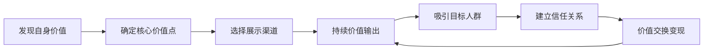
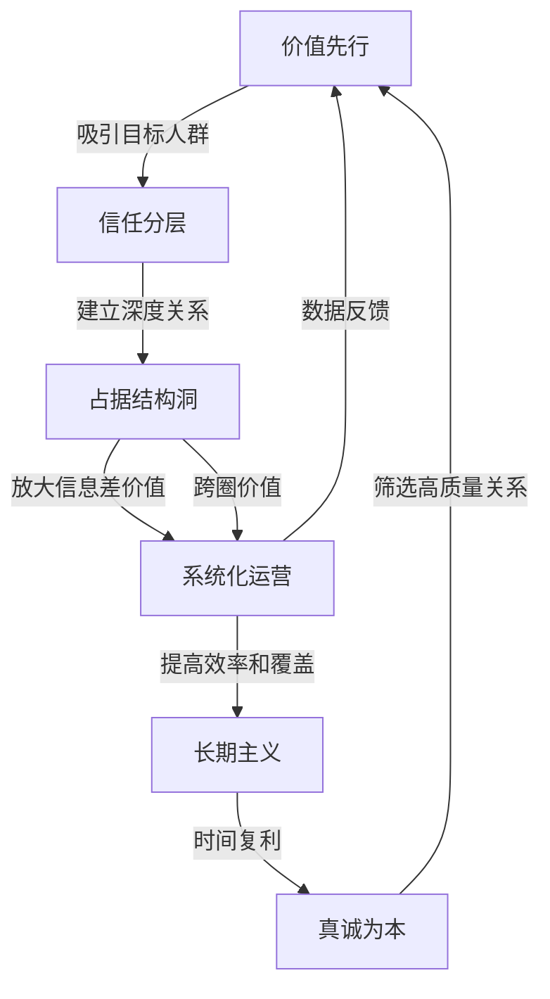

## 案例总结：人脉变现的共同规律

前七个案例涵盖了不同人生阶段、不同行业背景、不同性格特质的个体，他们从零开始经营社交资本，最终实现了人脉的经济价值转化。尽管路径各异、节奏不同，但如果将这些案例放在一起交叉分析，就会浮现出一组高度一致的底层规律。本节的任务就是提炼这些规律，构建一套可复制、可验证的人脉变现方法论。

### 一、七个案例的横向对比

在进入规律提炼之前，先用一张全景对比表把七个案例的关键维度拉齐，方便后续讨论时有统一的参照系。

| 维度 | 案例一：程序员→创业者 | 案例二：宝妈社群创业 | 案例三：销售冠军 | 案例四：跨行业资源整合 | 案例五：退休人士变现 | 案例六：线上→线下升级 | 案例七：社交恐惧→达人 |
|------|----------------------|---------------------|-----------------|----------------------|---------------------|---------------------|---------------------|
| 起点状态 | 技术能力强，社交圈窄 | 全职妈妈，无职业人脉 | 有销售经验，人脉待激活 | 行业背景单一 | 退休后人脉流失 | 线上活跃，线下薄弱 | 社交恐惧，回避人群 |
| 核心策略 | 用技术能力破圈 | 用育儿经验建立信任 | 系统化维护客户关系 | 成为跨行业信息枢纽 | 激活存量关系+社区活动 | 线上关系线下化 | 渐进式脱敏+价值输出 |
| 变现周期 | 12-18个月 | 6-12个月 | 3-6个月 | 18-24个月 | 6-12个月 | 9-15个月 | 12-24个月 |
| 月收入峰值 | 5万+ | 2万+ | 3万+ | 10万+ | 8000+ | 1.5万+ | 1.2万+ |
| 关键转折点 | 技术博客引来第一个合伙人 | 第一个宝妈社群裂变 | 建立客户分层管理体系 | 同时对接三个行业的资源 | 组织退休校友活动 | 第一次线下沙龙成功举办 | 第一次主动发起话题讨论 |
| 最大障碍 | 从"做技术"到"做人脉"的角色转换 | 时间碎片化、精力有限 | 从"卖产品"到"卖信任"的认知升级 | 信任建立周期长 | 被认为"没用了"的心理落差 | 线上关系到线下见面的信任跨越 | 内心恐惧与自我否定 |

从这张表中可以提炼出两个关键观察：

**第一，起点不决定终点。** 社交恐惧者、退休人士、全职妈妈——这些看似"社交资本弱势"的群体，同样实现了人脉变现。决定结果的不是起点，而是策略和执行。

**第二，变现周期与策略质量成反比。** 案例三（销售冠军）的变现周期最短（3-6个月），因为他的策略最系统化；案例四（跨行业整合）的变现周期最长（18-24个月），因为跨行业信任建立需要更长时间，但峰值收入也最高（10万+）。这验证了社交资本的复利效应——前期投入越大、基础越扎实，后期回报越丰厚。

### 二、六大共同规律

#### 规律一：价值先行——先成为别人需要的人

七个案例中，没有任何一个案例是通过"求人办事"实现变现的。每一个成功案例的起点，都是主人公先找到了自己能为他人提供的独特价值。

| 案例 | 提供的独特价值 | 价值接收方 |
|------|---------------|-----------|
| 程序员创业者 | 技术解决方案 | 有技术需求的传统企业 |
| 宝妈 | 育儿经验和情感支持 | 同龄宝妈群体 |
| 销售冠军 | 行业洞察和采购建议 | 企业采购决策者 |
| 跨行业整合者 | 信息桥接和资源对接 | 不同行业的供需双方 |
| 退休人士 | 人生经验和行业人脉 | 后辈职场人士 |
| 线上达人 | 内容输出和社群运营 | 同好群体 |
| 社交恐惧者 | 真诚和专注（稀缺品质） | 厌倦套路化社交的人 |

**底层机制**：社交资本的本质是价值交换网络。你提供的价值越大、越稀缺，你在网络中的节点价值就越高。这与经济学中的"供给决定价格"原理一致——当你是稀缺价值的唯一供给方时，你的社交资本回报率最高。

**实操方法**：

1. **价值盘点**：列出你的所有能力、资源、知识、经验、人脉，逐一评估"这些对谁有用"。很多人低估自己的价值，是因为他们习惯性地认为"我懂的东西别人也懂"——事实恰恰相反。

2. **价值锚定**：从盘点清单中选择1-2个最具稀缺性的价值点，作为你社交的"核心货币"。不要试图面面俱到，聚焦才能建立辨识度。

3. **价值展示**：通过内容输出（文章、分享、回答问题）、实际行动（帮忙、牵线、提供资源）等方式，让目标人群感知到你的价值。展示不是炫耀，而是让需要你的人能够找到你。



**常见错误**：很多人的社交策略是"我要认识某某大佬"，然后想方设法去接近。这种"索取型"社交的成功率极低。正确的思路是"我要成为某某大佬需要的人"，然后通过价值输出吸引对方主动靠近。

#### 规律二：信任分层——关系深度决定变现效率

所有案例都呈现了一个共同的信任建设路径：陌生人→认识的人→有好感的人→信任的人→深度合作伙伴。这个路径不能跳跃，但可以加速。

**信任建设的四层模型**：

```text
┌─────────────────────────────────────────────┐
│ 第四层：深度合作  │ 共同利益绑定、长期战略合作  │
│ 需要：6-24个月   │ 指标：对方主动找你合作       │
├─────────────────────────────────────────────┤
│ 第三层：信任建立  │ 可靠性验证、能力背书        │
│ 需要：3-6个月    │ 指标：对方愿意推荐你给别人   │
├─────────────────────────────────────────────┤
│ 第二层：好感积累  │ 价值感知、情感连接          │
│ 需要：1-3个月    │ 指标：对方主动与你互动       │
├─────────────────────────────────────────────┤
│ 第一层：破冰连接  │ 初次接触、留下印象          │
│ 需要：一次互动   │ 指标：对方记住你的名字       │
└─────────────────────────────────────────────┘
```

**各层的信任加速器**：

- **第一层→第二层**：提供一次超出预期的价值。比如在初次见面后，发送一份对方可能感兴趣的研究报告。"超预期"是好感的催化剂。
- **第二层→第三层**：创造共同经历。一起参加活动、合作完成一个项目、共同面对一次挑战。共同经历产生的信任密度远超日常寒暄。
- **第三层→第四层**：利益绑定。当双方有了共同的经济利益或事业目标时，关系会自然深化为战略合作。

**关键数据**：从七个案例的平均数据来看，从破冰到首次变现的平均周期为8个月。但如果在信任建设的每个阶段都使用"加速器"，这个周期可以缩短到3-4个月。

#### 规律三：网络结构——占据结构洞位置收益最大

回顾案例四（跨行业资源整合，月入10万+）和案例三（销售冠军，月入3万+），他们的共同特点是都占据了"结构洞"位置——连接着两个或多个原本不互通的群体。

**结构洞位置的三个优势**：

1. **信息差优势**：你能获得A圈子不知道的B圈子的信息，反之亦然。信息差就是商业机会。
2. **定价权优势**：作为唯一的连接者，你对连接服务有定价权。中介费、咨询费、撮合佣金都是结构洞的直接变现。
3. **创新优势**：不同圈子的知识碰撞最容易产生创新。案例四中跨行业的商业模式创新，就源于此。

**如何识别和占据结构洞**：

| 步骤 | 操作 | 案例对照 |
|------|------|---------|
| 1. 绘制你的社交网络图 | 列出所有联系人，标注他们之间的关系 | 案例三的客户分层管理 |
| 2. 识别不相连的群体 | 找出你的联系人中互不认识的群体 | 案例四发现三个行业的信息断层 |
| 3. 评估商业价值 | 判断连接这两个群体能创造什么价值 | 案例四评估"供应链优化"的市场空间 |
| 4. 建立桥梁 | 主动在两个群体之间传递价值 | 案例四定期组织跨行业交流会 |
| 5. 巩固位置 | 让双方都依赖你作为连接点 | 案例四建立标准化的对接流程 |

**重要提醒**：占据结构洞位置不是搞垄断。如果你只是"卡位"而不创造实际价值，双方迟早会绕过你直接连接。真正可持续的结构洞策略是：你持续为双方提供超越"连接"本身的附加价值（如信息筛选、风险评估、方案优化），让通过你连接比直接连接更高效。

#### 规律四：系统化运营——从随机社交到精密管理

所有成功案例都有一个共同特征：他们不是随机社交，而是有系统、有节奏、有数据地运营人脉。

**系统化运营的四个支柱**：

**支柱一：人脉数据库**

| 字段 | 说明 | 用途 |
|------|------|------|
| 姓名/昵称 | 基本信息 | 标识 |
| 行业/职业 | 背景信息 | 价值匹配 |
| 核心能力/资源 | 对方的独特价值 | 资源对接 |
| 关系阶段 | 破冰/好感/信任/合作 | 维护策略 |
| 最近互动日期 | 上次联系时间 | 防止关系淡化 |
| 对方的需求/痛点 | 当前关注点 | 提供针对性价值 |
| 重要日期 | 生日、纪念日等 | 关系维护节点 |
| 备注 | 其他关键信息 | 个性化沟通 |

**支柱二：社交日历**

- **每日**：花15分钟维护3个已有关系（点赞、评论、简短问候）
- **每周**：认识1个新的有质量的联系人
- **每月**：组织或参加1次社交活动
- **每季度**：做1次人脉盘点，清理、补充、调整策略

**支柱三：价值输出体系**

不要等到别人开口才提供价值，要建立主动输出的习惯：

- 内容输出：每周发布1-2条专业相关的高质量内容
- 资源输出：看到可能对某个朋友有用的信息，主动转发
- 人脉输出：发现两个朋友可能互相需要，主动介绍

**支柱四：复盘机制**

每月问自己三个问题：
1. 这个月最有价值的一次社交互动是什么？为什么它有价值？
2. 这个月错失了什么社交机会？下次如何避免？
3. 下个月最想深化哪三段关系？具体怎么做？

#### 规律五：长期主义——社交资本的J型曲线

七个案例中，几乎所有人都经历过一个"投入期"——大量时间精力投入，却看不到明显的经济回报。这个阶段通常持续3-12个月。

**社交资本的J型曲线**：

```text
收益
 │
 │                                          ╱───── 指数增长期
 │                                        ╱
 │                                      ╱
 │                                    ╱
 │                              ╱────╱
 │                          ╱──╱
 │ ───────────────────────╱  ← 临界点（网络效应启动）
 │                        │
 │  ╲                    │
 │    ╲  投入期          │
 │      ╲  （净投入）     │
 │────────╲───────────────┼──────────────── 时间
 │         ╲              │
 └─────────────────────────┘
```

**三个关键节点**：

1. **起步期（0-3个月）**：大量投入，零回报。这个阶段的核心任务是"建立连接"，不是"变现"。大多数人在这个阶段放弃。

2. **积累期（3-12个月）**：开始有零星的回报，但远低于投入。这个阶段的核心任务是"验证价值"——确认你提供的价值确实是别人需要的，并根据反馈调整。

3. **收获期（12个月+）**：网络效应启动，机会开始主动找上门。这个阶段的核心任务是"规模化"——将已验证的模式复制到更多关系中。

**如何度过投入期**：

- **设定非经济指标**：在投入期不要用收入衡量进展，而用"新增连接数""获得的信任反馈""价值输出次数"等过程指标。
- **找到早期正反馈**：哪怕只是一次真诚的感谢、一个有价值的建议被采纳，都是你走在正确道路上的信号。
- **建立同伴效应**：找到2-3个也在经营人脉的朋友，互相鼓励、分享经验、交换资源。

#### 规律六：真诚为本——套路的尽头是真诚

案例七（从社交恐惧到社交达人）尤其能说明这个规律。一个社交恐惧的人，最终的成功恰恰是因为他的"不完美"——他的真诚、专注、不善套路，反而成了他在社交市场中的稀缺品质。

**为什么真诚比套路更有效**：

1. **套路的半衰期越来越短**。在信息高度透明的时代，任何社交套路一旦被识别，就会产生强烈的反效果。社交媒体上每天都有"人脉经营技巧"被拆解和嘲讽。

2. **真诚的信号成本最高，因此最可信**。经济学中有一个"信号理论"——越是需要付出高成本的信号，越可信。真诚意味着你愿意暴露脆弱、承担风险，这种高成本信号比任何精心包装的社交话术都更能建立信任。

3. **真诚吸引的是同类**。你用真诚吸引来的人，也会对你真诚；你用套路吸引来的人，也会对你用套路。人脉网络的质量，取决于你的"筛选机制"——真诚是最有效的筛选器。

**真诚的实操边界**：

真诚不等于"没有边界"。以下是一些实操建议：

- **可以不说，但说出来的必须是真话**。社交中你有权保留隐私，但不应该编造虚假信息。
- **可以策略性地展示自己，但展示的必须是真实的自己**。选择在合适的时机展示你的优势，不是虚伪，而是策略。
- **可以拒绝，但拒绝要真诚**。不想参加某个活动，直接说"这次去不了"比编造借口好得多。

### 三、规律之间的协同关系

这六条规律不是孤立的，它们形成了一个自我强化的闭环：



**协同机制解读**：

- **价值先行**为你赢得进入信任建设通道的入场券
- **信任分层**将浅关系转化为可以商业化的深关系
- **结构洞**放大你的信息差优势，提高单位关系的变现效率
- **系统化运营**确保你不会因为"忙"而忽视人脉维护
- **长期主义**让你度过投入期，等到J型曲线的拐点
- **真诚**保证你的社交网络质量，避免劣币驱逐良币

缺少任何一环，整个系统都会出现瓶颈。比如：有价值但不系统化运营，你会"忙到没时间社交"；有系统但缺乏真诚，你的关系网络质量会持续下降。

### 四、不同人群的适配策略

虽然六大规律是通用的，但不同人群的执行重点和节奏需要调整。

#### 4.1 职场新人（工作0-3年）

| 优先级 | 规律 | 具体行动 |
|--------|------|---------|
| 最高 | 价值先行 | 深耕专业能力，用"做事靠谱"建立口碑 |
| 高 | 信任分层 | 重点维护同事和行业前辈关系 |
| 中 | 长期主义 | 不急于变现，以学习和积累为主 |

**核心建议**：职场新人最大的错误是过早追求"人脉变现"。这个阶段应该把80%的精力放在提升自身价值上，20%放在关系维护上。当你足够强大时，人脉会主动来找你。

#### 4.2 中层管理者（工作3-10年）

| 优先级 | 规律 | 具体行动 |
|--------|------|---------|
| 最高 | 结构洞 | 有意识地连接不同部门、不同行业 |
| 高 | 系统化运营 | 建立人脉数据库和社交日历 |
| 中 | 价值先行 | 从"个人价值"升级为"平台价值"——你能连接多少资源 |

**核心建议**：中层管理者最大的优势是"位置红利"——你在组织中的位置天然让你接触到不同层级和部门的人。利用好这个优势，但不要只在公司内部经营人脉。

#### 4.3 自由职业者/创业者

| 优先级 | 规律 | 具体行动 |
|--------|------|---------|
| 最高 | 系统化运营 | 人脉就是你的"销售渠道"，必须系统管理 |
| 高 | 价值先行 | 明确你的独特价值主张，持续输出 |
| 高 | 真诚为本 | 创业者的信任成本更高，任何套路的风险都更大 |

**核心建议**：自由职业者和创业者的人脉经营不能是"业余爱好"，必须是"核心业务"的一部分。建议每周至少投入10小时在社交活动上。

#### 4.4 转型期人士（换行业/退休/全职妈妈复出）

| 优先级 | 规律 | 具体行动 |
|--------|------|---------|
| 最高 | 长期主义 | 转型期的社交投资回报周期更长，需要更多耐心 |
| 高 | 价值先行 | 重新盘点自身价值，找到新旧价值的交叉点 |
| 高 | 信任分层 | 激活存量关系，通过旧关系进入新圈子 |

**核心建议**：转型期最容易犯的错误是"推倒重来"——完全放弃旧人脉，从零建立新关系。正确做法是"旧瓶装新酒"——用旧关系的信任基础，嫁接新的价值内容。案例五（退休人士）就是典型：他没有放弃几十年积累的行业人脉，而是在新的人生阶段为这些关系注入了新的价值。

### 五、常见失败模式与避坑指南

综合七个案例中的挫折经历和大量类似案例，以下是人脉变现最常见的六种失败模式：

#### 失败模式一：功利心过重

**症状**：每次社交都带着明确的"利用"目的，对方能明显感受到被利用。

**数据**：在一项针对500名企业高管的调查中，78%的受访者表示能"立即识别"功利性社交，并会主动回避。

**纠正方法**：采用"70-30法则"——70%的社交互动应该是纯价值输出（不期望任何回报），30%可以带有明确的商业目的。如果你的比例是反过来的，成功率会急剧下降。

#### 失败模式二：广而不深

**症状**：认识很多人，但没有一段真正深入的关系。微信好友5000人，但找不到一个可以半夜打电话倾诉的人。

**纠正方法**：用邓巴数理论指导你的人脉管理。维护5个亲密关系、15个好朋友、50个普通朋友，这比5000个泛泛之交更有商业价值。每季度做一次"关系深度审计"，把浅关系中最有潜力的几个升级为深关系。

#### 失败模式三：只进不出

**症状**：不断地认识新朋友、加微信、换名片，但从不主动为别人提供价值。

**纠正方法**：采用"先存后取"的思维。把每次社交互动看作一次"存款"——你先往关系账户里存入价值（帮忙、分享、介绍），等账户余额充足时再"取款"（请求帮助、寻求合作）。如果账户余额不足就强行取款，关系就会"破产"。

#### 失败模式四：忽视维护

**症状**：建立了关系后就不再联系，直到需要帮忙时才想起对方。

**纠正方法**：建立"最低维护频率"——亲密关系每周至少联系一次，好朋友每月至少联系一次，普通朋友每季度至少联系一次。用日历提醒来保证执行。

#### 失败模式五：圈子固化

**症状**：只和同类型的人社交，圈子越来越同质化。

**纠正方法**：每季度挑战自己进入一个完全陌生的圈子。程序员去参加设计圈的活动，金融人去参加科技圈的聚会。不舒服的社交环境反而是最有价值的——因为那里有你最大的信息差。

#### 失败模式六：急于求成

**症状**：经营人脉一两个月看不到回报就放弃。

**纠正方法**：记住J型曲线。在投入期，用过程指标（新增连接数、互动质量、价值输出频率）来衡量进展，而不是用经济回报。设定一个"最低投入期限"——至少坚持6个月再评估效果。

### 六、从案例到行动：你的个人人脉变现路线图

基于以上六大规律，以下是适用于任何人的分阶段行动路线图：

#### 第一阶段：基础建设（第1-3个月）

| 周次 | 行动 | 产出 |
|------|------|------|
| 第1周 | 价值盘点：列出你所有的能力、资源、知识、人脉 | 个人价值清单 |
| 第2周 | 目标定位：确定你要服务的人群和提供的核心价值 | 价值主张声明 |
| 第3周 | 渠道选择：确定你的主要社交渠道（线上/线下/行业活动） | 渠道清单 |
| 第4周 | 数据库搭建：建立人脉管理表格或CRM系统 | 人脉数据库 |
| 第5-8周 | 启动价值输出：每周发布2条专业内容、主动帮助3个人 | 内容积累+关系破冰 |
| 第9-12周 | 扩展连接：每周认识1个新的有质量的联系人 | 新增12+连接 |

#### 第二阶段：信任积累（第4-9个月）

| 行动 | 频率 | 目标 |
|------|------|------|
| 维护已有关系 | 每天15分钟 | 防止关系淡化 |
| 深化重点关系 | 每周1次深度交流 | 将5段浅关系升级为深关系 |
| 价值输出 | 每周2-3次 | 建立专业影响力 |
| 社交活动 | 每月1-2次 | 持续扩展网络 |
| 人脉盘点 | 每月1次 | 优化人脉结构 |
| 跨圈社交 | 每季度1次 | 占据结构洞位置 |

#### 第三阶段：价值变现（第10-18个月）

| 变现方式 | 具体操作 | 预期收入 |
|----------|---------|---------|
| 信息变现 | 通过人脉获取商业信息，转化为商业决策或咨询服务 | 因行业而异 |
| 资源对接 | 作为中间人连接需求方和供给方，收取佣金或服务费 | 单次500-5000元 |
| 品牌变现 | 借助人脉背书获取付费合作、演讲、培训机会 | 单次2000-2万元 |
| 联合创业 | 与信任的伙伴共同启动项目 | 长期收益 |

**注意**：以上收入数据基于七个案例的平均值和中位数，实际结果因人而异。影响变现效率的关键变量是：行业利润率、个人专业水平、人脉网络规模和深度、执行力。

### 七、终极认知：人脉变现的本质

回到最根本的问题——人脉变现的本质是什么？

不是"利用"关系赚钱，而是**通过关系网络放大你创造价值的能力**。

一个人的能力再强，如果只有他自己知道，价值就是1倍。但如果他的能力通过人脉网络被100个人知道，他的价值就放大了100倍。如果有10个人通过人脉网络成为他的合作伙伴，他的价值就放大了1000倍。

这才是人脉变现的真正公式：

```text
个人价值 × 网络覆盖度 × 信任深度 = 实际变现能力
```

- **个人价值**是基础——没有价值的人脉经营就是空中楼阁
- **网络覆盖度**是放大器——覆盖越广，被需要的概率越高
- **信任深度**是转化率——信任越深，机会转化为收入的效率越高

三个变量缺一不可。只有网络覆盖度没有个人价值，你是"社交蝴蝶"——到处飞但不结果；只有个人价值没有网络覆盖度，你是"深巷好酒"——好但没人知道；只有前两者没有信任深度，你是"知名陌生人"——大家都认识你但没人愿意和你做生意。

七个案例的主人公，都在这三个变量上找到了自己的最优解。你也一样——不需要模仿他们的路径，但需要理解他们的规律，然后找到属于你自己的最优解。

**行动从今天开始。** 不要等到"准备好了"再开始经营人脉——你永远不会完全准备好。从今天开始，给你认识的某个人发一条有价值的消息，就是第一步。
