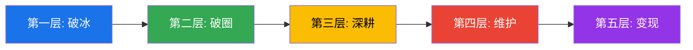
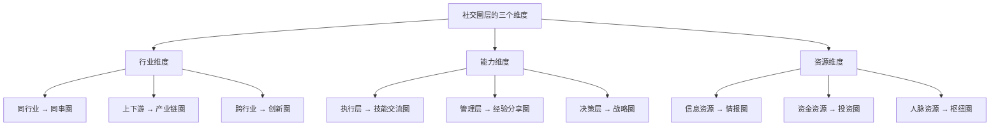
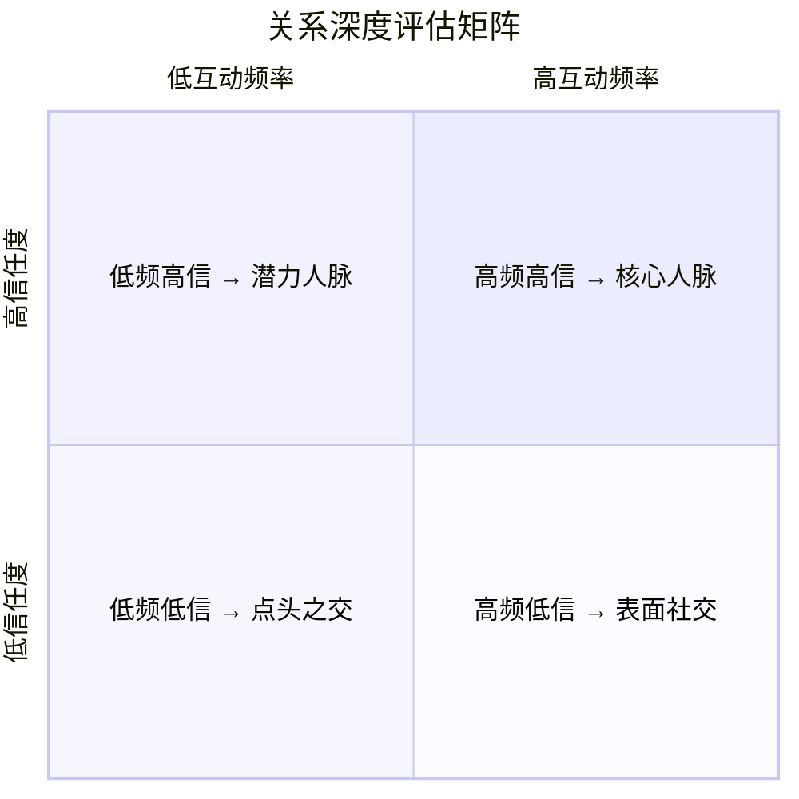
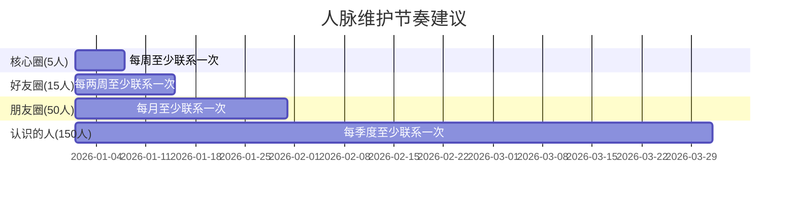
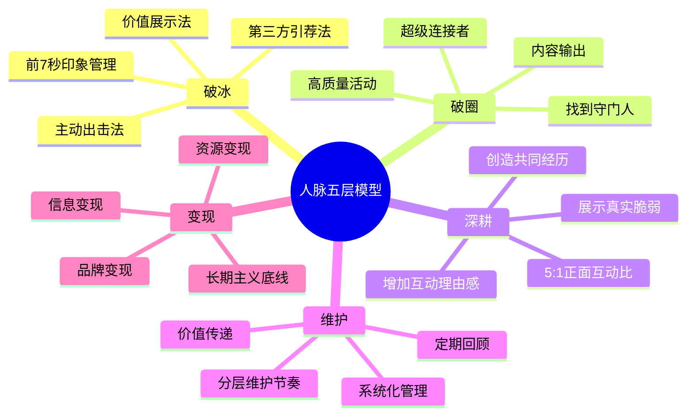

## 一、人脉建立的五个层次

人脉不是"认识多少人"，而是"有多少人愿意在关键时刻为你行动"。斯坦福大学社会学家马克·格兰诺维特（Mark Granovetter）在1973年发表的开创性论文《弱关系的力量》中指出：真正带来机会的，往往不是你的亲密好友，而是那些"点头之交"——弱关系连接着不同的社交圈，是信息和机会的桥梁。

哈佛商学院教授罗纳德·伯特（Ronald Burt）进一步提出了"结构洞"理论：那些连接两个原本不相连的社交圈的人，拥有信息优势和控制优势，能获得更高的回报。这意味着，**人脉的质量不在于密度，而在于跨度**。

人脉建设是一个渐进的过程，从最初的破冰到最终的价值变现，可以划分为五个清晰的层次。每个层次都有其核心任务、关键方法和常见陷阱。掌握这五个层次，你就拥有了一套完整的人脉经营操作系统。



### 1.1 第一层：破冰——如何与陌生人建立连接

破冰是人脉经营的起点。心理学研究表明，人们在初次见面的**前7秒**就会形成对你的基本印象（普林斯顿大学Janine Willis和Alexander Todorov, 2006）。这7秒决定了对方是否愿意与你继续交流。

#### 1.1.1 破冰的心理学基础

人类社交行为受三个核心心理机制驱动：

- **互惠原则**：当别人对你释放善意时，你会本能地想要回报。主动微笑、赞美、提供帮助，都能触发对方的互惠心理（罗伯特·西奥迪尼《影响力》）
- **相似性吸引**：人们天然倾向于喜欢与自己相似的人。找到共同点——校友、同乡、同行、共同爱好——是建立连接的捷径
- **曝光效应**：单纯多次出现就能增加好感度。在同一个场合多次露面，比一次深度交流更容易被记住

#### 1.1.2 三种破冰方法的深度拆解

**方法一：主动出击法**

核心逻辑：社交场合中，大多数人都是被动等待的。主动出击的人天然拥有选择权。

具体操作步骤：

1. **扫描环境**：进入场合后先花2-3分钟观察，找到落单或看起来友善的人，避免打断正在深入交谈的群体
2. **身体语言准备**：保持开放姿态（不交叉双臂），面带微笑，与人有自然的目光接触
3. **开放式问题开场**：不要用"你好"这种封闭式开场。有效的开场白包括：
   - "你是怎么认识主办方的？"（建立背景关联）
   - "今天最有收获的分享是什么？"（引发思考）
   - "我看你在XX领域很有经验，能请教一下……"（满足对方的价值感）
4. **FORD模型推进对话**：
   - **F**amily（家庭）："你是本地人吗？"
   - **O**ccupation（职业）："你主要做什么方向？"
   - **R**ecreation（兴趣）："工作之外有什么爱好？"
   - **D**reams（目标）："接下来有什么计划？"
5. **及时退出**：聊到5-10分钟自然收尾，交换联系方式，不要拖到无话可说

**方法二：价值展示法**

核心逻辑：社交的本质是价值交换。在你开口要什么之前，先让别人看到你能给什么。

关键原则——**不要"推销"自己，要"展示"自己**：

- **分享有料的见解**：在交流中，适时抛出一个独到的观点、一个鲜为人知的数据、一个实用的工具。例如："最近我在用一个叫Notion的工具管理项目，效率提升了很多，你有没有类似的工具推荐？"
- **用故事代替论断**：说"我帮一个客户把转化率提升了40%"比说"我很擅长营销"有说服力一百倍
- **做信息的枢纽**：如果你知道某个对对方有价值的信息，主动分享。"我刚看到一个报告说你们行业明年增长率可能达到15%，你关注到了吗？"

**方法三：第三方引荐法**

核心逻辑：引荐是一种"信任转移"——引荐人把自己的信用借给了你，对方因为信任引荐人而愿意信任你。

引荐的正确流程：

1. **选择合适的引荐人**：引荐人与目标对象关系越近，引荐效果越好
2. **给引荐人充分的理由**：不要说"帮我介绍一下张总"，而要说"我正在做XX项目，张总在这个领域的经验对我帮助很大，能否帮我引荐一下？我也可以把我在XX方面的资源分享给他"
3. **降低引荐人的成本**：准备好一段简短的自我介绍（30秒版本），让引荐人可以方便地转发
4. **引荐后的24小时法则**：在引荐后24小时内主动联系目标对象，超过48小时热度会急剧下降
5. **事后反馈**：无论结果如何，都要向引荐人反馈进展，维护引荐人的信任

#### 1.1.3 破冰阶段的常见误区

| 误区 | 后果 | 正确做法 |
|------|------|----------|
| 一上来就递名片/加微信 | 对方感到被推销，防御心理上升 | 先建立对话，聊出共同点后再自然交换联系方式 |
| 只聊自己，不问对方 | 对方觉得你自恋，失去兴趣 | 遵循"听:说 = 7:3"的比例，多问多听 |
| 追求数量，广泛撒网 | 每个连接都很浅，无法转化 | 一场活动深聊3-5个人，比浅聊30个人有效 |
| 过度谦虚或过度自夸 | 前者让人低估你，后者让人反感 | 用事实和故事代替自我评价，让对方自己判断 |
| 只在需要帮助时才出现 | 对方觉得你功利，不愿深交 | 在不需要帮助时也保持联系，建立非功利关系 |

### 1.2 第二层：破圈——如何进入新的社交圈层

破圈是人脉升级的关键转折点。社会学家皮埃尔·布迪厄（Pierre Bourdieu）提出"社会资本"概念时指出：一个人的社会资本不仅取决于他认识谁，更取决于他所处的社交网络的结构和质量。**进入更高层次的圈层，意味着你能够触达更多样化、更高质量的资源和信息**。

#### 1.2.1 社交圈层的三个维度

理解圈层的本质，才能找到破圈的路径：



#### 1.2.2 破圈的四条路径

**路径一：找到"守门人"**

每个圈层都有"守门人"（Gatekeeper）——他们不一定是最有权势的人，但一定是社交活跃度最高、连接最多的人。获得守门人的认可，等于拿到了圈子的入场券。

识别守门人的特征：
- 在圈内活动中频繁出现
- 善于介绍不同的人互相认识
- 在微信群/社群中活跃发言
- 组织聚会、分享会等活动

接触守门人的策略：
1. 先通过内容输出（写文章、做分享）让守门人注意到你
2. 在活动中主动提供帮助（帮忙拍照、整理资料、搬运东西）
3. 找到与守门人的共同连接点（共同朋友、共同兴趣）
4. 为守门人提供他需要的价值（信息、资源、能力）

**路径二：参加高质量的圈层活动**

不是所有活动都值得参加。选择活动的标准：

| 活动类型 | 价值密度 | 适合阶段 | 注意事项 |
|----------|----------|----------|----------|
| 行业峰会/论坛 | ★★★★★ | 有一定积累后 | 提前研究嘉宾名单，锁定目标人物 |
| 高端培训课程 | ★★★★★ | 任何时候 | 同学关系是最强的弱关系之一 |
| 创业路演/投资会 | ★★★★ | 有创业/投资需求时 | 准备好30秒电梯演讲 |
| 行业协会/商会 | ★★★★ | 有一定资历后 | 持续参加才能建立信任 |
| 线上社群/知识星球 | ★★★ | 任何时候 | 先输出价值，再寻求连接 |
| 朋友聚会 | ★★★ | 任何时候 | 让朋友多介绍新朋友给你认识 |

**路径三：用内容输出打开圈层**

在信息时代，**内容是最好的社交货币**。一篇高质量的文章、一次有价值的分享，可以让圈子里的人主动来找你。

具体操作：
1. 选择你最擅长的领域，持续输出专业内容（公众号、知乎、小红书）
2. 在目标圈层的平台上发表观点（行业论坛、社群、播客）
3. 将内容转化为社交话题："我最近写了一篇关于XX的文章，想听听你的看法"
4. 用内容建立专业形象，让别人觉得"认识你有价值"

**路径四：成为"超级连接者"**

罗纳德·伯特的研究表明，**连接两个原本不相连的群体的人，获得的回报最高**。如果你能成为两个圈层之间的桥梁，你就同时拥有了信息优势和控制优势。

操作方法：
1. 先在两个不同的圈层中分别建立关系
2. 识别两个圈层中可以互补的需求和资源
3. 主动撮合，介绍双方认识
4. 在撮合过程中，你的价值会自然凸显

#### 1.2.3 破圈的心理障碍与突破

**障碍一：身份焦虑——"我不够格进入那个圈子"**

破解方法：每个圈层都有不同的价值需求。你可能没有他们的资源和地位，但你可能有他们需要的技术能力、年轻视角、特定领域的专业知识。找到你的差异化价值。

**障碍二：社交恐惧——"我害怕被拒绝"**

破解方法：将社交视为"给予"而非"索取"。当你的心态是"我能为对方提供什么"而不是"我能从对方那里得到什么"时，焦虑会大幅降低。

**障碍三：信息不对称——"我不知道怎么找到那些圈子"**

破解方法：
- 关注行业KOL的社交动态，他们参加的活动就是你需要进入的圈子
- 通过LinkedIn、脉脉等职业社交平台搜索目标圈层的关键人物
- 让已有圈层的朋友介绍和推荐

### 1.3 第三层：深耕——如何将浅关系变成深关系

社会学家格兰诺维特定义了强关系的四个维度：**互动频率、情感强度、亲密程度、互惠交换**。从浅关系升级为深关系，本质上就是在这四个维度上持续投入。

#### 1.3.1 关系深度的评估矩阵

在深耕之前，先评估你的关系现状：



四个象限的经营策略：

- **核心人脉（高频高信）**：深度合作，共同成长，是你的"人生董事会"
- **潜力人脉（低频高信）**：增加互动频率，将信任转化为行动
- **点头之交（低频低信）**：评估是否值得投入，不值得的果断放弃
- **表面社交（高频低信）**：降低无效社交，将时间转移到更有价值的关系上

#### 1.3.2 深耕的五个关键方法

**方法一：增加互动的"理由感"**

不要为了联系而联系，要让每次互动都有自然的理由：

- 看到一篇与对方工作相关的文章，转发并说"看到这个想到你，觉得对你可能有用"
- 对方公司有新产品发布、融资消息、获奖信息，第一时间祝贺
- 节假日、生日、工作纪念日的个性化祝福（不要群发模板）
- 旅行时带一份有当地特色的小礼物
- 自己有新的职业进展，与对方分享

**关键原则**：联系的理由越具体、越个性化，效果越好。"生日快乐"和"记得你说过生日想去看海，希望今年能实现"，哪个更让人感动？

**方法二：创造共同经历**

心理学家阿瑟·阿伦（Arthur Aron）的著名实验"36个问题"证明：共同经历能快速加深亲密感。在人脉经营中，共同经历是建立深层信任的最快方式。

有效的共同经历类型：
- **协作完成一个项目**：共同完成一件有挑战的事，比吃十顿饭都管用
- **一起学习成长**：参加同一个课程、读书会、训练营
- **共度关键时刻**：在对方创业最艰难时提供帮助，在对方转型期给予建议
- **旅行和体验**：一起旅行能暴露真实性格，是检验关系深度的试金石

**方法三：展示真实的脆弱**

哈佛商学院教授艾米·卡迪（Amy Cuddy）的研究表明，人们判断他人时有两个核心维度：**能力**和**温暖**。只展示能力会让人敬佩但有距离感；适度展示脆弱（困难、失败、不确定），反而会增加温暖感和信任度。

具体做法：
- 适度分享你正在面临的挑战（不是抱怨，而是坦诚）
- 承认你不懂的领域，向对方请教
- 分享你曾经犯过的错误和从中学到的教训
- 在对方遇到困难时，分享你类似的经历和解决方案

**方法四：建立"5:1正面互动比"**

心理学家约翰·戈特曼（John Gottman）在研究婚姻关系时发现，稳定健康的关系中，正面互动与负面互动的比例至少为5:1。这个原理同样适用于所有人际关系。

正面互动包括：赞美、感谢、支持、幽默、分享好消息
负面互动包括：批评、争论、拒绝、忽视、传递负能量

经营策略：
- 每次互动尽量以正面开始和结束
- 提出不同意见时，先肯定对方的合理之处
- 定期表达感谢和欣赏，不要觉得"说了矫情"

**方法五：成为对方的"非对称资源"**

所谓"非对称资源"，是指你拥有对方不常能获得的资源或能力。当你是某个人脉的非对称资源时，对方维护这段关系的动力会大大增强。

如何建立非对称资源：
- 深耕一个专业领域，成为该领域的专家
- 积累某个特定圈子的人脉，成为连接者
- 掌握某个稀缺技能（数据分析、设计、技术开发等）
- 拥有独特的信息渠道或行业洞察

#### 1.3.3 深耕阶段的时间管理

人的精力有限，不可能与所有浅关系都建立深度连接。邓巴数（Dunbar's Number）理论指出，人类能维持的稳定社交关系上限约为150人，其中：

- 核心圈（最亲密）：约5人
- 好友圈：约15人
- 朋友圈：约50人
- 认识的人：约150人

**实操建议**：将你的人脉按照邓巴数分层，将80%的深耕精力投入到核心圈和好友圈的20人身上。这20人是你人脉资产中最核心的部分。

### 1.4 第四层：维护——如何让人脉关系持续保鲜

人脉关系像花园，不浇水就会枯萎。但维护不是盲目地群发消息，而是有策略地保持连接。

#### 1.4.1 建立系统化的联系人管理

**为什么需要系统？** 当你的人脉超过100人时，靠记忆已经无法有效管理。你需要一个外部系统来帮你记住每个人的背景、上次联系时间、重要日期等信息。

**工具选择矩阵**：

| 工具 | 适合人群 | 优势 | 劣势 |
|------|----------|------|------|
| 微信标签+备注 | 社交关系<200人 | 零成本，操作简单 | 功能有限，无法设置提醒 |
| Notion/Airtable | 喜欢自定义的人 | 高度灵活，可关联多种信息 | 需要持续维护 |
| 专业CRM（如HubSpot） | 商务人士 | 自动化程度高 | 学习成本高，部分功能收费 |
| 专属人脉管理App | 专注人脉经营者 | 功能针对性强 | 数据可能不互通 |

**联系人信息模板**（建议每个重要联系人记录以下信息）：

```text
姓名：
职业/公司/职位：
认识时间和场合：
共同朋友：
兴趣爱好：
家庭情况：
重要日期（生日、入职纪念日等）：
上次联系时间：
上次交流内容摘要：
对方关注的领域/需求：
我能为对方提供的价值：
下一步行动计划：
```

#### 1.4.2 维护节奏的黄金法则

不同层级的关系，维护频率不同：



**维护的关键不是频率，而是质量**。一次有深度的交流，胜过十次"在吗？""最近怎么样？"的寒暄。

#### 1.4.3 高效维护的五种动作

**动作一：价值传递**

定期为对方提供有价值的信息、资源或机会。关键是要"定制化"——你需要了解对方当前关注什么、需要什么，然后精准地传递相关信息。

示例：
- "我刚看到你们行业出了一个新政策，可能会影响你的业务方向，发给你看看"
- "我认识一个做XX的朋友，他的资源和你的项目很匹配，要不要我介绍你们认识？"

**动作二：成就祝贺**

当对方取得成就时（升职、融资成功、项目获奖、公司上市等），第一时间真诚祝贺。这不仅是维护关系，更是在传递"我关注你、我为你高兴"的信号。

**动作三：困难支持**

在对方遇到困难时提供实质帮助，比顺境中的锦上添花更能加深关系。但要注意：帮助要具体，不要说"有需要随时找我"（太模糊），而要说"我在XX方面有经验，如果你需要，我可以帮你做XX"。

**动作四：定期回顾**

每个季度花1-2小时回顾你的人脉清单：
- 哪些关系在淡化？需要主动激活
- 哪些关系在升温？需要加强投入
- 哪些关系已经过时？可以降低维护优先级
- 有没有新的关系需要纳入管理？

**动作五：创造"回忆触发点"**

在交流中，有意识地创造一些共同的"暗号"或"梗"。这些回忆触发点能在未来的交流中快速拉近距离。例如，一起经历过的某个有趣事件、某个共同的口头禅、某个只有你们知道的笑话。

#### 1.4.4 维护中的常见错误

- **过度联系**：每天发消息、每周打电话，让对方感到压力。维护需要给对方空间
- **群发模板**：节假日群发"祝你XX快乐"，效果为零甚至为负。对方一眼就能看出是群发
- **只说不做**：总是说"改天一起吃饭""下次帮你介绍"，但从不落实。承诺不兑现会严重损害信任
- **功利性太强**：每次联系都在推销产品、请求帮忙。这种关系注定无法持久
- **忽视边界**：在对方不方便的时间联系，或过度探询隐私

### 1.5 第五层：变现——如何让人脉产生实际价值

"人脉变现"这个词听起来功利，但本质上，**人脉变现是价值交换的自然结果**。当你为足够多的人创造了价值，回报是自然而然的事情。社会交换理论（Social Exchange Theory）指出：人际关系的本质是价值交换，长期不对等的关系必然走向破裂。

#### 1.5.1 人脉变现的三种模式

**模式一：信息变现**

信息是最轻量、最高频的变现方式。通过人脉获取的独家信息，可以直接转化为商业决策优势。

操作路径：
1. 建立"信息雷达"系统：在不同行业、不同圈层中都有信息触点
2. 培养信息敏感度：能够识别哪些信息具有商业价值
3. 快速验证和行动：信息的价值随时间衰减，速度是关键
4. 建立信息交换网络：你为别人提供信息，别人也为你提供信息

真实案例：某创业者通过校友圈得知某大厂即将裁员的一个部门有大量优质技术人才，提前三个月开始接触，成功招到了5名核心工程师，比市场招聘节省了60%的成本。

**模式二：资源变现**

资源变现是通过整合人脉中的资源，促成合作项目或交易，从中获得收益。

常见的资源变现方式：
- **对接撮合**：连接有需求的一方和有供给的一方，收取佣金或服务费
- **联合项目**：整合多方资源，共同完成一个单独无法完成的项目
- **渠道合作**：利用你的人脉网络作为产品或服务的分销渠道
- **背书推荐**：用你的信誉为优质产品或服务背书，获得推荐回报

**模式三：品牌变现**

品牌变现是人脉经营的最高境界。当你的个人品牌足够强大时，人脉本身就是变现工具。

品牌变现的路径：
1. 通过人脉网络扩大个人影响力
2. 借助人脉背书提升专业可信度
3. 将人脉转化为内容素材（案例、故事、数据）
4. 通过个人品牌吸引更高质量的人脉（正向循环）

#### 1.5.2 人脉变现的原则与底线

变现不等于"利用"。以下是几条不可逾越的红线：

- **不透支信任**：每一次变现行为都是在消耗信任存量。如果变现大于积累，关系必然崩溃
- **不损害第三方**：不要为了自己的利益而损害朋友的利益
- **信息有边界**：从人脉中获得的非公开信息，不能随意传播
- **互利是底线**：只索取不回报的关系不可持续。确保每次合作对方也能获益
- **长期主义**：宁可放弃一次变现机会，也不要损害一段重要关系

#### 1.5.3 变现效果的评估框架

定期评估你的人脉变现效果，可以帮助你优化人脉经营策略：

| 评估维度 | 关键指标 | 优化方向 |
|----------|----------|----------|
| 信息质量 | 信息的时效性、准确性、独家性 | 扩大信息源的多样性 |
| 资源整合 | 撮合成功率、合作项目的回报率 | 提升对资源匹配的判断力 |
| 品牌影响 | 内容传播量、被引用次数、受邀演讲频率 | 加大内容输出力度 |
| 信任存量 | 对方主动求助频率、对方为你推荐的次数 | 提升每次互动的价值密度 |
| 关系健康度 | 互动频率、情感温度、互惠平衡 | 及时修复关系中的不平衡 |

### 1.6 五层模型的综合应用

#### 1.6.1 不同职业阶段的侧重点

| 职业阶段 | 重点层次 | 核心任务 | 时间分配建议 |
|----------|----------|----------|--------------|
| 初入职场(0-3年) | 破冰+破圈 | 扩大社交面，建立基础人脉 | 破冰60%、破圈30%、其他10% |
| 快速成长期(3-7年) | 破圈+深耕 | 进入更高圈层，建立深度关系 | 破圈30%、深耕40%、维护20%、其他10% |
| 成熟期(7-15年) | 深耕+维护 | 巩固核心人脉，系统化管理 | 深耕30%、维护40%、变现20%、其他10% |
| 巅峰期(15年+) | 维护+变现 | 最大化人脉价值，回馈社会 | 维护30%、变现40%、回馈20%、其他10% |

#### 1.6.2 内向者的人脉经营策略

内向者不必模仿外向者的社交方式。苏珊·凯恩（Susan Cain）在《安静：内向性格的竞争力》中指出，内向者在人脉经营中有独特优势：更善于倾听、更深度的思考、更真诚的连接。

内向者的高效社交策略：
- **一对一深度交流** > 群体社交：选择咖啡厅一对一聊天，而不是参加大型派对
- **内容输出驱动社交**：通过写文章、做研究来吸引别人主动联系你
- **线上先行**：先在微信、LinkedIn上建立初步连接，再转为线下深度交流
- **设定社交配额**：每周设定合理的社交数量上限，避免能量耗尽
- **利用独处优势**：内向者独处时的深度思考，恰恰是社交中的高价值内容

#### 1.6.3 数字化时代的人脉经营新规则

在数字化时代，人脉经营的底层逻辑没有变，但工具和场景发生了根本变化：

**线上社交的新原则**：
- **个人简介就是你的数字名片**：确保你在微信、LinkedIn、脉脉等平台上的简介清晰传达你的价值主张
- **内容就是你的社交货币**：持续输出高质量内容，让别人有理由关注你、联系你
- **群聊是新的社交场**：在高质量的微信群中积极参与讨论，是低成本建立连接的好方式
- **朋友圈是你的人设窗口**：有策略地展示你的专业能力、生活态度和价值观念

**线上线下融合的正确姿势**：
- 线上建立初步连接 → 线下见面加深关系 → 线上持续维护
- 线上看到有价值的信息 → 线下见面时自然提起 → 创造深度交流话题
- 线下活动收集名片 → 线上及时添加并备注 → 定期线上互动维护

### 1.7 本节核心要点总结



**一句话总结**：人脉经营的本质不是"认识谁"，而是"成为谁"。当你持续为他人创造价值时，高质量的人脉关系会自然聚集。五个层次不是线性的阶梯，而是螺旋上升的过程——每一次破冰都可能打开新的圈层，每一次变现都可能带来新的连接机会。关键在于：**真诚、持续、系统化**。
