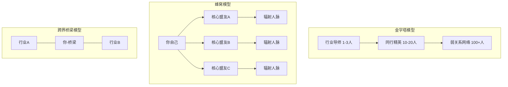
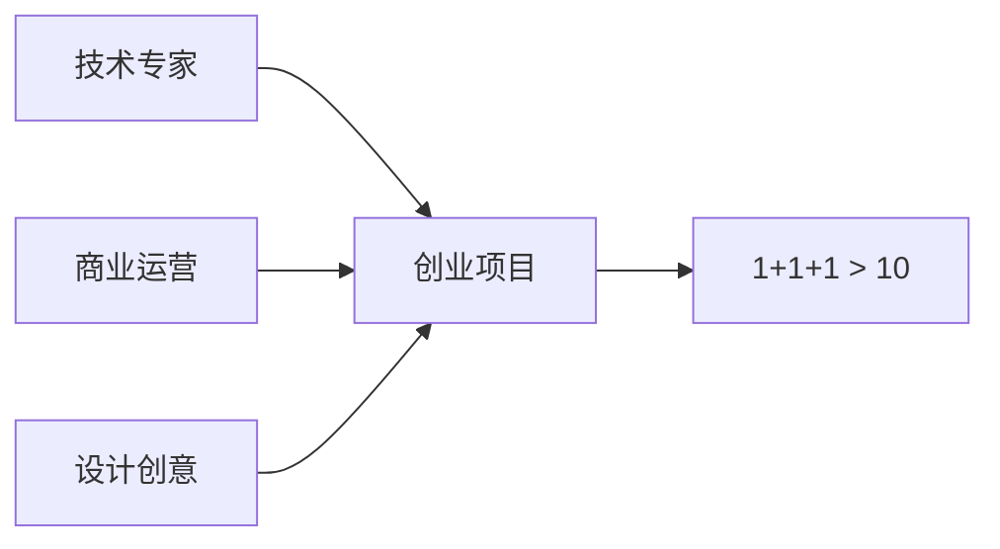
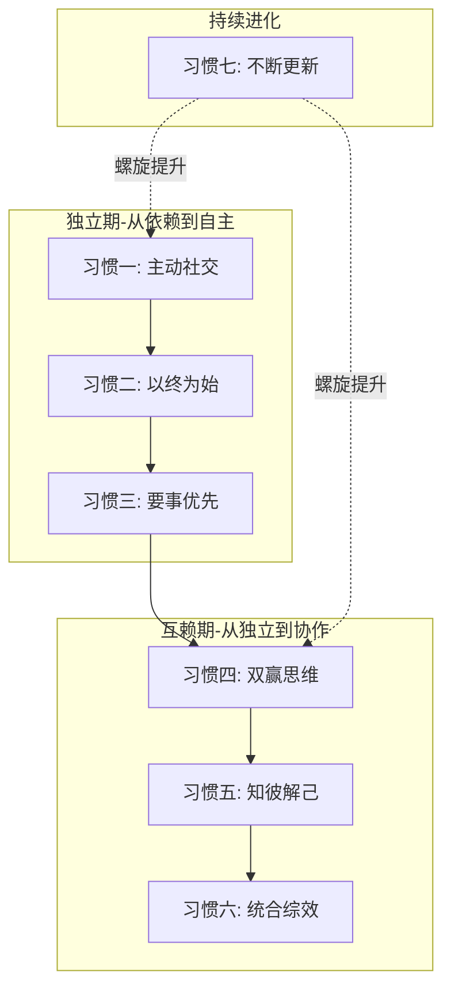

## 二、高效社交的七个习惯

Stephen Covey 在《高效能人士的七个习惯》中提出了一套从内而外的个人效能框架。将这套框架迁移到社交领域，可以提炼出七个核心习惯——它们不是"社交技巧"，而是深层的行为模式和思维范式。技巧会过时，习惯却能持续产生复利效应。

本节的七个习惯按照「依赖期→独立期→互赖期」的成长路径排列，前三个习惯帮助你成为一个独立、有内核的社交者，中间三个习惯教你高效地与他人协作共赢，第七个习惯则是持续进化的底层保障。

### 2.1 习惯一：主动社交（Be Proactive）——从"等机会"到"造机会"

#### 2.1.1 核心原理

社会心理学家 Albert Bandura 的"自我效能感"理论指出：相信自己能影响结果的人，行动力远高于被动等待的人。在社交领域，这意味着高效社交者不会等待"合适的时机"或"别人的邀请"，而是主动创造社交机会。

被动社交者的典型心态：
- "等我有了足够的资源，再去认识厉害的人"
- "我不擅社交，等别人来找我吧"
- "这种活动去了也没用，浪费时间"

主动社交者的心态：
- "我能为对方提供什么价值？"
- "这次活动我能认识谁、学到什么？"
- "即使没有即时回报，这也是在积累社交资本"

#### 2.1.2 实操框架：社交主动性四步法

| 步骤 | 行动 | 具体做法 |
|------|------|----------|
| 第一步：扫描机会 | 每周花30分钟扫描社交机会 | 关注行业活动日历、社群动态、朋友圈有价值的内容 |
| 第二步：主动出击 | 每周至少发起3次主动社交 | 发一条有价值的评论、约一次线下咖啡、分享一篇对方可能感兴趣的文章 |
| 第三步：降低门槛 | 让别人容易回应你 | 提出具体的、低成本的请求，而不是模糊的"有空聊聊" |
| 第四步：复盘优化 | 每月回顾社交投入产出 | 哪些主动社交带来了价值？哪些浪费了时间？如何调整策略？ |

#### 2.1.3 主动社交的具体话术模板

**初次连接后的跟进消息**：

```text
张总您好，昨天在XX论坛上听了您的分享，关于[具体观点]的分析
让我很受启发。我最近也在研究[相关领域]，整理了一份[具体资料]，
如果您有兴趣我可以发给您参考。期待未来有更多交流的机会。
```

**请求介绍的标准句式**：

```text
[介绍人姓名]，我最近在做[具体项目/方向]，了解到[目标人物]
在[具体领域]有很深的积累。不知道您方不方便帮我引荐一下？
我可以先发一份简短的自我介绍给您过目。
```

#### 2.1.4 常见误区

| 误区 | 纠正 |
|------|------|
| 主动社交=讨好别人 | 主动社交的核心是"创造价值交换的机会"，不是单方面迎合 |
| 联系越频繁越好 | 过度联系会造成社交疲劳，关键是每次接触都有价值 |
| 只向上社交 | 平行和向下社交同样重要，今天的"小人物"可能是明天的关键人物 |
| 所有人都值得主动联系 | 需要筛选——与你价值观相悖、单方面消耗你能量的人不值得投入 |

### 2.2 习惯二：以终为始（Begin with the End in Mind）——社交目标的顶层设计

#### 2.2.1 核心原理

大多数人社交没有目标，碰到什么是什么，结果是积累了大量"无效人脉"——加了几千个微信好友，真正在关键时刻能帮上忙的不超过10个人。

高效社交者会先想清楚三个问题：
1. **我的人生/职业目标是什么？** ——社交是为目标服务的手段
2. **要实现这个目标，我需要什么样的人脉？** ——精确画像而非来者不拒
3. **我当前的人脉结构离目标差距有多大？** ——找到关键缺口

#### 2.2.2 人脉目标画布

用以下画布工具来设计你的人脉战略：

```text
┌─────────────────────────────────────────────────────────┐
│                    人脉目标画布                           │
├──────────────┬──────────────┬───────────────────────────┤
│  我的3年目标  │  需要的能力   │  需要的关键人脉类型        │
│  (职业/生活)  │  与资源缺口   │                          │
├──────────────┼──────────────┼───────────────────────────┤
│              │              │                           │
│  目标A:____  │  缺口:____   │  行业导师 / 投资人 /       │
│              │              │  技术伙伴 / 客户资源        │
├──────────────┼──────────────┼───────────────────────────┤
│  现有人脉资产 │  覆盖度评估   │  优先行动                   │
├──────────────┼──────────────┼───────────────────────────┤
│  强关系:___人 │  ___%覆盖    │  1. 拓展______圈子         │
│  弱关系:___人 │  ___%覆盖    │  2. 深化______关系         │
│  信息源:___个 │  ___%覆盖    │  3. 学习______技能         │
└──────────────┴──────────────┴───────────────────────────┘
```

#### 2.2.3 人脉结构的三种理想模型

根据你的职业阶段和目标，选择合适的人脉结构模型：

**1. 金字塔模型（适合职场晋升型）**
- 塔尖：1-3位行业导师/关键决策者
- 中层：10-20位同行精英/合作伙伴
- 底层：100+位弱关系连接者（信息来源和机会窗口）

**2. 蜂窝模型（适合创业/自由职业型）**
- 核心节点：你自己
- 一级连接：5-8位核心盟友（深度信任、利益绑定）
- 二级连接：每核心盟友辐射10-15人
- 三级连接：弱关系网络提供信息和机会

**3. 跨界桥梁模型（适合资源整合型）**
- 左圈：行业A的核心人脉
- 右圈：行业B的核心人脉
- 桥梁角色：连接两个圈子，占据"结构洞"位置（参见理论基础章节）



#### 2.2.4 案例：一位产品经理的人脉战略设计

小王是一位3年经验的产品经理，目标是3年内成为产品总监。他的人脉目标画布如下：

| 维度 | 分析 |
|------|------|
| 3年目标 | 产品总监，负责一条完整产品线 |
| 能力缺口 | 商业思维、团队管理、行业资源 |
| 需要的人脉 | 1位产品VP做导师、5位同行产品总监交流、投资人了解行业趋势、技术Leader做搭档 |
| 现状 | 强关系主要是初级产品经理和开发同事，缺乏向上和跨界连接 |
| 优先行动 | ①加入产品经理高端社群 ②定期参加行业峰会做分享 ③找机会做跨部门项目暴露给高层 |

### 2.3 习惯三：要事优先（Put First Things First）——社交时间的精力管理

#### 2.3.1 核心原理

社交是有成本的——时间、精力、情绪。高效社交者不是社交面最广的人，而是在关键人脉上投入最多的人。

这与"邓巴数"理论（参见理论基础章节）高度吻合：人类大脑能维持的稳定社交关系上限约150人，其中核心圈仅5人，亲密圈15人，朋友圈50人。你的时间和精力是有限的，必须分配到最高价值的关系上。

#### 2.3.2 人脉价值矩阵

将你现有的人脉按照"关系深度"和"对你的价值"两个维度进行分类：

```text
                    对你的价值（高）
                         │
        ┌────────────────┼────────────────┐
        │                │                │
        │   Ⅱ 战略投资    │  Ⅰ 核心圈       │
        │   (高价值/浅关系) │  (高价值/深关系) │
        │   策略:加大投入   │  策略:持续维护   │
        │   优先级:★★★★   │  优先级:★★★★★  │
        │                │                │
  关系 ──┼────────────────┼────────────────┼── 关系
  深度低 │                │                │  深度高
        │   Ⅳ 边缘区      │  Ⅲ 舒适区       │
        │   (低价值/浅关系) │  (低价值/深关系) │
        │   策略:减少投入   │  策略:定期审视   │
        │   优先级:★       │  优先级:★★      │
        │                │                │
        └────────────────┼────────────────┘
                         │
                    对你的价值（低）
```

**四象限解读与行动策略**：

| 象限 | 特征 | 策略 | 时间分配建议 |
|------|------|------|-------------|
| Ⅰ 核心圈 | 关系深、价值高，如合伙人、挚友、导师 | 持续投入，主动维护，深度交流 | 占社交时间的40% |
| Ⅱ 战略投资 | 价值高但关系浅，如行业大佬、潜在投资人 | 制定接触计划，创造深度交流机会 | 占社交时间的30% |
| Ⅲ 舒适区 | 关系深但价值低，如老同学、老同事 | 定期审视，是否有提升价值的可能 | 占社交时间的20% |
| Ⅳ 边缘区 | 关系浅、价值低，如泛泛之交 | 减少投入，维持最低限度的礼节性互动 | 占社交时间的10% |

#### 2.3.3 社交时间的分配实操

**每周社交时间预算**（假设每周投入6小时在社交上）：

| 时间段 | 活动类型 | 目标象限 |
|--------|----------|----------|
| 周一至周五，每天15分钟 | 微信/邮件维护性互动 | Ⅰ核心圈 + Ⅱ战略投资 |
| 周三晚上，1.5小时 | 深度交流（线上/线下约见） | Ⅱ战略投资 |
| 周六上午，2小时 | 参加行业活动/社群互动 | Ⅱ战略投资 + 拓展新人脉 |
| 周日下午，30分钟 | 社交复盘与下周计划 | 全局 |

**社交精力管理的四个原则**：

1. **高能量时段留给高价值社交**：重要的会面安排在你精力最好的时间
2. **批量处理低价值社交**：集中回复消息、点赞评论，不要让碎片社交打断深度工作
3. **设置社交"断舍离"**：每季度审视一次人脉清单，果断减少无效应酬
4. **保留独处恢复时间**：社交是高耗能活动，内向者尤其需要独处来充电

### 2.4 习惯四：双赢思维（Think Win-Win）——从"索取"到"共创"

#### 2.4.1 核心原理

博弈论中的"重复博弈"理论表明：在一次性的交易中，欺骗可能是最优策略；但在重复博弈（即长期社交关系）中，合作策略的总收益远高于欺骗。

高效社交者把每次社交互动都视为"重复博弈"的一步——不追求单次利益最大化，而是追求长期关系总价值最大化。具体表现为双赢思维：寻找让双方都受益的方案，而不是零和博弈中的你赢我输。

#### 2.4.2 社交中的六种互动模式

| 模式 | 心态 | 短期效果 | 长期效果 | 适用场景 |
|------|------|----------|----------|----------|
| 赢/输 | 我要赢，你得输 | 可能得利 | 关系破裂 | 一次性交易（尽量避免） |
| 输/赢 | 我让步，你得利 | 对方满意 | 自己被掏空 | 不对等关系中的妥协 |
| 输/输 | 宁可两败俱伤 | 双方受损 | 双方受损 | 谈判破裂时（尽量避免） |
| 赢/赢 | 双方都受益 | 双方满意 | 关系加深 | **首选模式** |
| 赢/赢/输 | 双方赢，但第三方受损 | 双方满意 | 可能引发更大问题 | 需谨慎使用 |
| 不成交 | 找不到双赢方案就放弃 | 短期无收益 | 保护双方利益 | 价值观冲突时 |

#### 2.4.3 实现双赢社交的四步法

**第一步：建立情感账户**

人际关系就像银行账户——每一次正面互动（帮忙、赞美、守约）都是存款，每一次负面互动（失信、批评、忽视）都是取款。在提出任何请求之前，确保你的"情感账户"余额充足。

情感账户存款的具体方式：
- 记住对方说过的细节，下次见面时主动提及
- 分享对对方有价值的信息（文章、机会、人脉），不附带任何条件
- 在对方需要帮助时主动伸出援手，而且不期望即时回报
- 在公开场合真诚地赞美对方的成就

**第二步：探索对方的真实需求**

大多数人只想着自己要什么，很少深入思考对方真正需要什么。高效社交者会花大量时间去理解对方的：
- 当前面临的挑战是什么？
- 最近在推进什么项目？
- 什么样的帮助对他最有价值？
- 他的长期目标是什么？

**第三步：寻找价值交集**

将你能提供的价值和对方的需求进行匹配，找到重叠区域：

| 你能提供的 | 对方需要的 | 双赢方案 |
|-----------|-----------|----------|
| 行业信息 | 决策参考 | 定期分享行业报告 |
| 技术能力 | 项目落地 | 合作开发项目 |
| 人脉资源 | 客户/合作伙伴 | 介绍精准人脉 |
| 传播渠道 | 品牌曝光 | 为对方产品做推荐 |
| 专业建议 | 问题解决 | 提供免费咨询换取信任 |

**第四步：明确期望，书面确认**

双赢方案需要双方对期望有清晰的共识。模糊的口头承诺是社交关系破裂的主要原因之一。

具体做法：
- 用文字确认合作内容、各自的责任和时间表
- 设定合理的预期——承诺少一点，交付多一点
- 建立定期沟通机制，及时调整方案

#### 2.4.4 案例：一位自由设计师的双赢社交

设计师小李想拓展企业客户，但他没有销售经验。他的双赢策略：

1. **存款阶段**（前3个月）：在设计师社群免费分享自己的设计模板和素材包，积累了3000+关注者
2. **探索需求**：主动与10位中小企业主聊天，发现他们最大的痛点不是设计本身，而是"不懂如何用设计提升转化率"
3. **价值交集**：小李将服务重新定义为"转化率优化设计顾问"，不只是做图，而是用数据驱动设计方案
4. **明确合作**：与首批3位客户签订"效果对赌"协议——设计费用的一部分与转化率提升挂钩

结果：半年后，小李的客户全部来自口碑介绍，客单价从3000元提升到2万元。

### 2.5 习惯五：知彼解己（Seek First to Understand, Then to Be Understood）——深度倾听的艺术

#### 2.5.1 核心原理

大多数人际沟通的问题不是"说得不好"，而是"听得不够"。Harvard Business Review 的研究显示，高管们平均只记住了对方在对话中传达信息的 25%-50%。更糟糕的是，多数人在"倾听"时其实在做三件事之一：
- **假装在听**：心里在想别的事
- **选择性听**：只听自己感兴趣的部分
- **准备回应**：对方还没说完就在想自己要说什么

真正的倾听是为了理解——不是为了回应，不是为了判断，而是为了完整地接收对方想传达的信息（包括言语和非言语信息）。

#### 2.5.2 四级倾听模型

| 级别 | 名称 | 特征 | 效果 |
|------|------|------|------|
| Level 1 | 听而不闻 | 心不在焉，敷衍回应 | 对方感到不被尊重 |
| Level 2 | 选择性倾听 | 只听自己感兴趣的部分 | 错过重要信息 |
| Level 3 | 专注倾听 | 认真听每一句话 | 获取表面信息 |
| Level 4 | 共情倾听 | 听到言语背后的情感和需求 | 建立深层信任 |

**共情倾听的三个维度**：
- **听事实**：对方在说什么内容？
- **听情感**：对方在表达什么情绪？
- **听需求**：对方真正需要什么？

#### 2.5.3 深度倾听的SOLER技巧

| 要素 | 含义 | 具体做法 |
|------|------|----------|
| **S** - Squarely | 正面对着对方 | 身体朝向对方，表示你在全身心投入 |
| **O** - Open | 开放的身体语言 | 不交叉双臂，保持放松的姿态 |
| **L** - Lean | 身体微微前倾 | 表示你在认真关注 |
| **E** - Eye Contact | 保持眼神接触 | 目光自然地看着对方（不是死盯），约60%-70%的时间 |
| **R** - Relax | 放松自然 | 不要过于紧绷，保持自然的状态 |

#### 2.5.4 高效提问的技巧

倾听不仅仅是"听"，更重要的是"问"。好的提问能引导对方说出更多有价值的信息。

**三种高效提问类型**：

| 类型 | 示例 | 效果 |
|------|------|------|
| 开放式提问 | "你对这个行业的未来怎么看？" | 引导对方深入表达 |
| 追问式提问 | "你刚才提到了XX，能具体说说吗？" | 挖掘更多细节 |
| 反射式提问 | "你的意思是……对吗？" | 确认理解，表示你在认真听 |

**绝对要避免的三种提问方式**：

| 类型 | 示例 | 问题 |
|------|------|------|
| 封闭式提问 | "你是做IT的吧？" | 限制了对话空间 |
| 引导式提问 | "你不觉得XX很好吗？" | 把自己的观点强加于人 |
| 审判式提问 | "你为什么会这么做？" | 让人产生防御心理 |

#### 2.5.5 先理解别人，再让别人理解你

当你真正理解了对方之后，你的表达也会更有针对性。高效表达的FAB法则：

| 要素 | 含义 | 示例 |
|------|------|------|
| **F** - Feature | 你的特点/能力 | "我有5年的数据分析经验" |
| **A** - Advantage | 你的优势 | "我能快速从海量数据中发现商业洞察" |
| **B** - Benefit | 对对方的价值 | "这能帮你减少60%的决策盲区" |

#### 2.5.6 案例：一次成功的社交倾听

小赵是技术出身，想转型做产品经理。在一次行业沙龙上，他遇到了一位产品VP。

**失败的对话方式**（多数人会这样做）：
> "您好，我是做技术的，想转产品，您有什么建议吗？"
> （这是索取式开场，对方没有动力认真回答）

**成功的对话方式**（小赵实际的做法）：
> 小赵先花10分钟倾听VP的分享，然后在问答环节提了一个关于VP分享内容的深度问题。
> 会后，小赵找到VP说："您刚才提到'产品决策要在不确定性中做判断'，我在做技术时也经常遇到类似困境——不知道该先优化哪个模块。您一般用什么框架来做这种决策？"
> VP花15分钟详细解释了他的决策框架。小赵认真记笔记，最后说："非常感谢，这对我帮助很大。我整理了一份笔记，可以发给您看看我理解得对不对吗？"

这个对话让VP感受到了被尊重和被需要，后续他们保持了联系，VP最终成为了小赵的产品导师。

### 2.6 习惯六：统合综效（Synergize）——1+1>2 的社交乘数效应

#### 2.6.1 核心原理

"统合综效"是高效社交的最高形态——通过整合不同人的能力、资源和视角，创造出任何单一个体都无法实现的成果。在社交资本理论中，这对应"结构洞"概念：连接不同圈子的人，能产生最大的信息和资源优势。

统合综效不是简单的"人多力量大"，而是通过差异化组合产生化学反应。关键要素：
- **多样性**：参与者的能力、背景、视角各不相同
- **互补性**：彼此的能力恰好弥补对方的短板
- **信任基础**：深度信任才能实现真正的开放协作
- **共创机制**：有结构化的协作流程，而不是随意拼凑

#### 2.6.2 社交乘数效应的三种模式

**模式一：能力互补型**



| 角色 | 贡献 | 获得 |
|------|------|------|
| 技术专家 | 技术实现 | 商业变现通道 |
| 商业运营 | 市场和客户 | 产品落地能力 |
| 设计创意 | 用户体验 | 商业验证机会 |

**模式二：资源嫁接型**

将A圈子的资源嫁接到B圈子的需求上。例如：
- 你认识制造业工厂主（A圈子）
- 你认识跨境电商卖家（B圈子）
- 你撮合双方合作——工厂获得海外订单，卖家获得优质供应商
- 你在中间获得佣金或股权

**模式三：信息增值型**

将不同来源的信息整合后产生新洞察。例如：
- 从投资人那里了解到某赛道即将爆发
- 从技术朋友那里得知某项新技术成熟了
- 综合判断后发现"新技术+热赛道=蓝海机会"
- 带着这个洞察找到合适的团队一起创业

#### 2.6.3 如何培养统合综效能力

| 步骤 | 方法 | 具体做法 |
|------|------|----------|
| 1. 拓宽信息源 | 刻意接触不同领域的人 | 每月参加1个非本行业的活动 |
| 2. 建立连接图谱 | 了解每个人的专长和需求 | 维护一份"能力-需求"清单 |
| 3. 做"连接器" | 主动介绍可能互补的人认识 | 每月至少促成1次有价值的连接 |
| 4. 创造协作场景 | 设计让多方受益的合作项目 | 组织跨界沙龙、联合项目等 |
| 5. 信任验证 | 用小项目测试合作默契 | 从低成本、低风险的合作开始 |

#### 2.6.4 连接器的自我修炼

成为"连接器"是社交资本积累的最高策略。连接器的核心能力：

**信息中枢能力**：了解每个人在做什么、需要什么、能提供什么。这不是窥探隐私，而是在日常交流中自然积累的信息地图。

**匹配判断能力**：能快速判断两个人是否值得连接。不匹配的介绍会消耗你三方的信任。

**撮合执行能力**：不只是"互相加个微信"，而是给出具体的连接理由和合作方向。

**连接后退出能力**：好的连接器介绍完之后就退出，不居功、不插手、不要回扣——除非双方主动邀请你参与。

#### 2.6.5 案例：一位社区运营者的统合综效

社区运营者小陈管理着一个2000人的行业社群。他的统合综效实践：

1. **信息收集**：通过日常聊天和问卷，了解每个成员的专长和需求
2. **精准匹配**：发现A是供应链专家、B在做电商品牌缺供应链、C是投资人看好供应链赛道
3. **创造场景**：组织了一次"供应链×电商"闭门沙龙，邀请A做分享，B做案例展示，C做投资视角点评
4. **催化合作**：沙龙后撮合A和B合作，C表示愿意投资
5. **收获回报**：项目成功后，三方都对小陈高度信任，分别给他介绍了更多优质人脉

### 2.7 习惯七：不断更新（Sharpen the Saw）——社交能力的持续进化

#### 2.7.1 核心原理

社交能力不是一成不变的——随着你的职业发展、人生阶段、社交圈层的变化，你需要持续更新自己的社交工具箱。这就是"磨锯"的习惯：定期投资自己，保持竞争力。

社交能力需要从四个维度持续更新：

| 维度 | 内容 | 更新方式 |
|------|------|----------|
| 身体维度 | 精力和状态 | 规律运动、充足睡眠——精力差的人社交状态也好不了 |
| 智力维度 | 知识和视野 | 持续学习、阅读、参加行业活动——有料的人才值得交流 |
| 社会/情感维度 | 社交技能和情绪管理 | 练习倾听、同理心、冲突处理——技术会过时，情商不会 |
| 精神维度 | 价值观和使命感 | 明确自己的价值观——知道什么该做什么不该做 |

#### 2.7.2 社交能力的持续提升清单

**每日常规（15分钟）**：
- 回复重要的社交消息，维护情感账户
- 在社交媒体上分享有价值的内容（不是自拍和鸡汤）
- 阅读1篇行业文章，积累谈资

**每周练习（2小时）**：
- 与1位非亲密关系的人深度交流
- 主动为1位朋友提供帮助或信息
- 复盘本周社交互动，反思做得好和不好的地方

**每月提升（半天）**：
- 参加1次行业活动或社群聚会
- 阅读1本社交/沟通/心理学相关书籍
- 更新人脉管理系统（添加新联系人、更新信息）

**每季度审视**：
- 审视人脉结构，是否有新的缺口需要补充
- 评估核心人脉关系的健康度
- 调整社交策略和时间分配

#### 2.7.3 社交能力提升的推荐学习路径

| 阶段 | 学习重点 | 推荐资源 |
|------|----------|----------|
| 入门期（0-6个月） | 基础沟通技巧、社交心态建设 | 《人性的弱点》《非暴力沟通》 |
| 成长期（6-18个月） | 深度倾听、双赢谈判、人脉管理 | 《高效能人士的七个习惯》《影响力》 |
| 成熟期（18-36个月） | 跨文化社交、领导力、组织社交资本 | 《思考快与慢》《社会性动物》 |
| 专家期（36个月+） | 教练式社交、社交资本的系统性运用 | 《网络科学》《结构洞》(Burt) |

#### 2.7.4 社交中的情绪管理

社交能力的"锯"最容易被忽视的部分是情绪管理。在社交场景中，以下情绪陷阱需要警惕：

| 情绪陷阱 | 表现 | 应对方法 |
|----------|------|----------|
| 社交焦虑 | 紧张、回避、过度准备 | 接纳焦虑、从小场合练起、关注对方而非自己 |
| 嫉妒心理 | 看到别人人脉好就不舒服 | 把嫉妒转化为学习动力，主动向对方请教 |
| 讨好倾向 | 为了维护关系而不断妥协 | 明确自己的底线，学会说"不" |
| 优越感 | 觉得自己人脉广就高人一等 | 记住每个人都有你可以学习的地方 |
| 受害者心态 | "别人不回我消息就是看不起我" | 给对方合理的解释，不要过度解读 |

#### 2.7.5 案例：从社交恐惧到社交达人的进化路径

小周是一位程序员，典型的社交恐惧者。他的进化路径：

| 阶段 | 时间 | 挑战 | 行动 | 成果 |
|------|------|------|------|------|
| 觉醒期 | 第1个月 | 意识到社交能力影响职业发展 | 阅读《非暴力沟通》，理解倾听的重要性 | 改变了对社交的认知 |
| 破冰期 | 第2-3个月 | 害怕与陌生人说话 | 每天在技术群里回答1个问题 | 积累了"技术专家"的社交名片 |
| 实践期 | 第4-6个月 | 不会闲聊 | 参加线下技术沙龙，用"提问+倾听"代替"表演" | 发现倾听比表达更容易获得好感 |
| 成长期 | 第7-12个月 | 不会维护关系 | 建立联系人表格，每周跟进3人 | 人脉从20人扩展到100+ |
| 成熟期 | 第13-18个月 | 不会深度社交 | 主动做"连接器"，介绍互补的人认识 | 被社群公认为"最值得认识的人" |

### 2.8 七个习惯的整合应用框架

七个习惯不是独立的技巧，而是一个相互关联的系统。下面的框架展示了它们之间的逻辑关系：



**整合应用的日常检查清单**：

```text
□ 今天我是否主动发起了有价值的社交互动？（习惯一）
□ 我今天的社交行动是否对准了我的长期目标？（习惯二）
□ 我是否把社交时间花在了最重要的人身上？（习惯三）
□ 我今天的社交互动是否创造了双赢？（习惯四）
□ 我是否真正理解了对方的需求？（习惯五）
□ 我是否连接了可以互补的人或资源？（习惯六）
□ 我今天在社交能力的哪个维度有了提升？（习惯七）
```

### 2.9 本节常见误区

| 误区 | 真相 | 纠正方法 |
|------|------|----------|
| "社交就是要外向" | 内向者的深度倾听和思考在社交中更有优势 | 找到适合自己性格的社交方式，而不是模仿外向者 |
| "认识人多就是人脉广" | 1000个点赞之交不如10个真心朋友 | 用邓巴数管理人脉规模，深耕核心圈 |
| "社交是浪费时间" | 社交是最重要的投资之一，回报率远超多数理财产品 | 把社交当成"第二份工作"来规划和执行 |
| "社交就是请客吃饭" | 最有效的社交是价值交换，不是物质投入 | 关注"我能为对方做什么"而不是"我要花多少钱" |
| "只向上社交就够了" | 向下社交和横向社交同样重要——今天的新人是明天的大佬 | 保持与各层级的均衡连接 |
| "有了微信好友就够了" | 线上互动只是社交的起点，深度关系需要线下互动和共同经历 | 每月至少与核心人脉进行1次线下/深度交流 |
| "社交技巧学完就会了" | 社交是实践性技能，知道和做到之间差1000次练习 | 每周设定具体的社交练习目标并复盘 |

### 2.10 本节小结

高效社交的七个习惯构成了一个完整的社交能力体系：

| 习惯 | 核心一句话 | 最关键的行动 |
|------|-----------|-------------|
| 一、主动社交 | 不等机会，创造机会 | 每周至少发起3次主动社交 |
| 二、以终为始 | 先画蓝图，再建关系 | 完成人脉目标画布 |
| 三、要事优先 | 好钢用在刀刃上 | 用四象限矩阵管理人脉 |
| 四、双赢思维 | 让每次互动都创造价值 | 建立情感账户，先存款再取款 |
| 五、知彼解己 | 先听懂，再被听懂 | 练习共情倾听（Level 4） |
| 六、统合综效 | 做连接者，创造乘数效应 | 每月促成1次有价值的跨界连接 |
| 七、不断更新 | 持续磨锯，保持锋利 | 每日15分钟社交维护，每月半天社交学习 |

记住：社交不是天赋，而是可以通过刻意练习不断提升的技能。从今天开始，选择1-2个你最薄弱的习惯，制定具体的30天行动计划，你会发现社交能力的提升速度远超你的预期。
