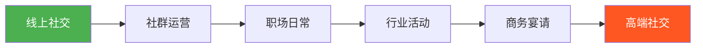
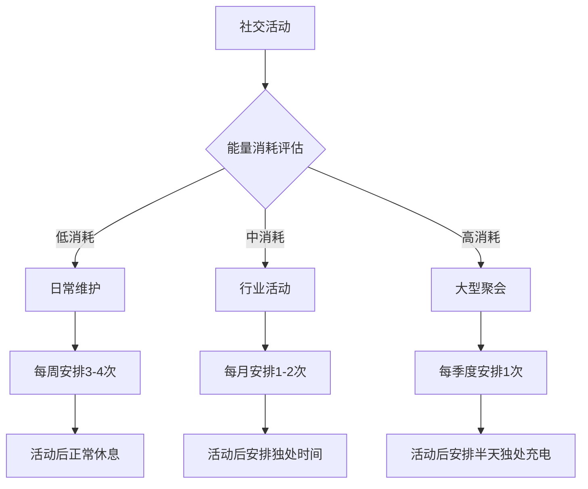
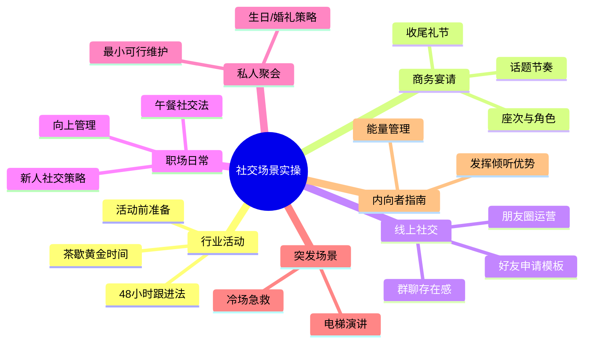

## 三、社交场景的实操指南

社交能力不是天赋，而是可以在不同场景中反复练习的技能。本节将常见的社交场景逐一拆解，提供从准备到执行、从破冰到后续跟进的完整操作手册。无论你是社交新手还是希望精进的老手，都能找到对应场景的具体打法。

### 1. 社交场景分类与难度评估

不同的社交场景对技能的要求差异巨大。先了解全貌，再有针对性地练习。

#### 1.1 场景矩阵

| 场景类型 | 典型场景 | 难度 | 核心挑战 | 适合阶段 |
|----------|----------|------|----------|----------|
| 职场日常 | 同事午餐、电梯偶遇、茶水间闲聊 | ★★☆ | 自然不刻意、不越界 | 入门 |
| 行业活动 | 峰会、论坛、技术沙龙 | ★★★ | 高效筛选目标、短时间内建立印象 | 进阶 |
| 商务宴请 | 客户饭局、合作方晚宴 | ★★★★ | 照顾多方感受、把控节奏 | 中级 |
| 社群运营 | 线上社群、兴趣小组、校友会 | ★★★ | 持续活跃、创造价值 | 入门 |
| 私人聚会 | 朋友生日、婚礼、家庭聚餐 | ★★☆ | 人情世故、关系维护 | 入门 |
| 高端社交 | 私董会、精英俱乐部、慈善晚宴 | ★★★★★ | 身份匹配、价值对等 | 高级 |
| 线上社交 | 微信添加、朋友圈互动、社群发言 | ★★☆ | 文字表达力、频率控制 | 入门 |
| 突发场景 | 偶遇名人、被引荐、电梯演讲 | ★★★★ | 即时反应、临场发挥 | 进阶 |

#### 1.2 新手推荐路径



建议从低难度场景开始练习，每次掌握后再进入下一阶段。跳级容易产生挫败感，反而阻碍社交能力的成长。

### 2. 行业活动：峰会、论坛与技术沙龙

行业活动是拓展弱关系的黄金场景。一次好的行业活动，可以让你在半天内接触20-50位行业相关人士。

#### 2.1 活动前准备清单

准备充分程度直接决定你在活动中的收获。以下是经过验证的准备流程：

**信息准备（活动前3-7天）**

1. **研究议程和嘉宾名单**：标记你想接触的3-5位目标人物，查阅其LinkedIn/公众号/过往演讲内容
2. **了解参会企业**：重点关注与你业务有交集的公司，提前想好合作切入点
3. **准备自我介绍**：30秒版本（一句话概括身份+价值）和2分钟版本（加入具体案例）
4. **准备行业观点**：对当前热点话题形成自己的看法，便于在交流中展示深度

**物资准备（活动前1天）**

1. 名片至少50张（检查数量、质量、信息准确性）
2. 手机充满电，备好充电宝
3. 穿着比活动着装要求高半档（宁可稍正式也不要过于随意）
4. 准备一个小笔记本或用手机备忘录（用于记录关键信息）
5. 带一件轻便外套（室内温度不可控时应急）

**心理准备**

- 设定合理目标：如"认识3位新朋友并交换联系方式"，而非"认识所有人"
- 接受被拒绝是正常的：不是每个人都有兴趣交流，这与你无关
- 提前10分钟到达：给自己热身时间，也更容易遇到早到的积极社交者

#### 2.2 活动中的执行策略

**选择位置**

- 不要坐在最后一排角落——那是"隐形人"的座位
- 最佳位置：中间偏前排，靠近过道。便于被看到，也方便在休息时移动
- 如果有圆桌讨论，选择有目标人物在的那桌

**茶歇时间的操作流程**

茶歇（Coffee Break）是行业活动中最重要的社交窗口，通常只有15-30分钟：

```text
第1-3分钟：扫描全场，识别目标
    → 看名牌、看小圈子人数、看谁在独自站着
第3-5分钟：主动接近独处的人或2人小组
    → 避免打断3人以上的深入对话
第5-20分钟：展开对话，使用"三点式破冰法"
    → 关联（我们有共同点）+ 好奇（我对你的XX很感兴趣）+ 价值（我可能能帮你XX）
第20-25分钟：交换联系方式，约定后续
    → "加个微信吧，我回头把那个资料发给您"
第25-30分钟：找一个安静角落记录关键信息
    → 姓名、公司、职位、聊了什么、后续要做什么
```

**提问模板（活动场景专用）**

| 场景 | 开场问题 | 为什么有效 |
|------|----------|------------|
| 茶歇偶遇 | "您刚才在哪个分论坛？感觉怎么样？" | 自然切入，对方有话可说 |
| 同桌用餐 | "您是第一次参加这个活动吗？" | 降低防御，适合开场 |
| 听完演讲后 | "您对XX老师说的那个观点怎么看？" | 展示你在认真听，引发深度讨论 |
| 被人引荐时 | "XX跟我提过您在做XX方面的事，能简单介绍一下吗？" | 有中间人背书，信任度高 |

**需要避免的行为**

- 不要一上来就发名片——先建立基本对话再交换
- 不要拿着手机不停刷——这传达"我不想被打扰"的信号
- 不要只和认识的人待在一起——强迫自己每次至少认识1位新朋友
- 不要在别人面前推销自己的产品——先建立关系，业务机会自然会来
- 不要聊完就走——至少等对方说完当前话题再礼貌告辞

#### 2.3 活动后的跟进流程

活动结束后的48小时是关系维护的黄金窗口：

```text
活动结束后 24 小时内：
  ├── 发送微信好友申请（附上"我是XX活动坐您旁边的XXX"）
  ├── 通过好友后发一条感谢消息
  │     "很高兴在XX活动认识您，您提到的XX观点很有启发"
  └── 在朋友圈分享活动照片（让新朋友看到你活跃的一面）

活动结束后 1 周内：
  ├── 发送承诺过的资料/链接
  ├── 如果聊到了共同兴趣，分享一篇相关文章
  └── 将新联系人信息录入人脉管理工具

活动结束后 1 个月内：
  ├── 约一次线上/线下咖啡（1对1深度交流）
  └── 在朋友圈与对方的内容互动（点赞+有价值的评论）
```

### 3. 商务宴请：饭局中的社交艺术

在中国商业文化中，饭局不仅是吃饭，更是建立信任、传递诚意的社交仪式。掌握饭局社交，等于掌握了中国商业关系的核心密码。

#### 3.1 饭局的底层逻辑

饭局社交的本质是**非正式场景下的信任构建**。与会议室相比：

| 维度 | 会议室 | 饭局 |
|------|--------|------|
| 氛围 | 正式、紧张 | 轻松、开放 |
| 对话模式 | 结构化汇报 | 自由闲聊 |
| 信任建立速度 | 慢（需要多次会议） | 快（一次饭局可建立初步信任） |
| 真实信息比例 | 低（都戴着面具） | 高（酒精+放松=更多真话） |
| 关系深度 | 业务关系 | 可发展为私人关系 |

#### 3.2 座次安排与角色意识

**标准圆桌座次（以8人桌为例）**

```text
        [门]

    7    8    1
   [副陪] [ ] [主宾]
    6    [ ]    2
   [ ]   [ ]  [ ]
    5    4    3
   [三宾] [主陪] [副主宾]

     [菜口/上菜方向]
```

- **主位（1号）**：面向门口，留给最尊贵的客人
- **主陪（4号）**：背对门口，负责买单和控场
- **副主宾（3号）**：主位右手边，第二尊贵
- **副陪（8号）**：主陪右手边，协助活跃气氛

**你的角色判断**

如果你是：
- **组织者**：提前到场，安排座位，控制节奏，关注每个人的状态
- **被邀请者**：准时到场，尊重座次，配合主人的节奏
- **中间人**：负责引荐双方，活跃气氛，填补冷场

#### 3.3 饭局全程操作手册

**开场阶段（前15分钟）**

1. 主人先敬酒，说开场词。等主人举杯后再动筷
2. 第一轮敬酒顺序：先敬主宾，再按职位高低依次敬
3. 敬酒时站起来，杯沿低于对方杯沿（表示尊重）
4. 敬酒词简短有力："感谢X总百忙中赴约，敬您一杯"

**交流阶段（核心时段）**

- **话题选择**：先聊轻松话题（美食、旅行、行业趣闻），酒过三巡后再聊正事
- **倾听为主**：饭局上说得最多的人往往收获最少。多提问、多倾听、少表演
- **适时捧场**：别人说到精彩处，真诚地说"这个角度我之前没想到"、"太有道理了"
- **照顾边缘人**：如果有人被冷落，主动把话题引向他——"张总，您在这个行业这么多年，怎么看这个事？"

**收尾阶段（最后15分钟）**

- 不要第一个提出结束——等主人或最尊贵的客人暗示
- 散场时逐一握手告别，说"今天收获很大，改天我做东回请"
- 帮忙叫车或送客（尤其对长辈和重要客人）
- 当晚或次日上午发一条感谢微信

#### 3.4 饭局禁忌清单

| 禁忌 | 原因 | 替代做法 |
|------|------|----------|
| 手机不离手 | 不尊重在座的人 | 调静音，重要电话离席接听 |
| 抢着买单失败后尴尬 | 暴露格局小 | 提前和服务员打招呼把单买了 |
| 喝醉失态 | 毁掉所有好印象 | 量力而行，学会得体地拒绝续杯 |
| 传播八卦或负面信息 | 让人觉得你不靠谱 | 只说正面的、建设性的话 |
| 过早谈业务 | 显得功利 | 先建立个人层面的连接 |
| 对服务员态度差 | 暴露人品问题 | 对每个人都保持礼貌 |

### 4. 线上社交：微信与社交媒体

对于大多数人来说，线上社交是频率最高、覆盖面最广的社交场景。

#### 4.1 添加好友的正确姿势

**发送好友申请时必须附上验证信息**

错误示范：
```text
（空白）
你好
我是张三
```

正确示范：
```text
李总您好，我是XX公司的小王，昨天在XX峰会上坐在您旁边，聊得很开心
```

验证信息要素：你的身份 + 认识的场景 + 一个让对方想起你的细节

**通过后第一条消息**

```text
李总好！感谢通过好友申请。
我是昨天XX峰会坐在您右边的小王（穿灰色西装的那位）。
您当时提到的关于私域流量的那三个阶段，我回去仔细想了一下，
确实和我们正在做的事情高度契合。
改天方便的时候想请您喝杯咖啡当面请教，不知您下周有空吗？
```

要素拆解：
- 自我介绍（带记忆锚点）
- 复述对话内容（证明你在认真听）
- 表达后续意图（让关系有方向）

#### 4.2 朋友圈运营策略

朋友圈是你的社交名片，决定别人对你的第一印象。

**内容比例建议（黄金比例 5:3:2）**

```text
50% —— 专业内容（行业见解、工作成果、学习心得）
30% —— 生活内容（旅行、运动、美食、家庭温馨时刻）
20% —— 社交内容（转发朋友的好内容、帮朋友宣传）
```

**发圈频率**
- 最佳：每天1-2条
- 可接受：每2-3天1条
- 过少（每月不到3条）：别人会忘记你
- 过多（每天超过5条）：容易被屏蔽

**朋友圈互动规则**
- 对目标人脉的朋友圈定期点赞+评论（每周至少1次）
- 评论要有实质内容，不要只发"👍"或"太棒了"
- 好评论示例："这个方法我们团队也试过，效果确实不错。您是用什么指标来衡量ROI的？"
- 差评论示例："厉害👍👍👍"

#### 4.3 微信聊天的沟通节奏

**回复速度管理**

| 对方类型 | 建议回复速度 | 原因 |
|----------|-------------|------|
| 上级/客户 | 5分钟内 | 展现重视和效率 |
| 同级/同事 | 30分钟内 | 正常工作节奏 |
| 新认识的朋友 | 1-2小时 | 不显得太急切，但不冷落 |
| 不太熟的人 | 当天内 | 礼貌回应即可 |

**聊天长度控制**

```text
开场寒暄 → 2-3轮
核心沟通 → 3-5轮
结束语 → 1轮

总对话不超过10轮。
超过10轮的内容应该转为电话或见面聊。
```

**高价值聊天模板**

分享资源型：
```text
王总，看到一篇关于XX的文章，想到您之前提过这方面的困惑，
分享给您看看。我觉得第三部分的分析特别到位。
```

求助型（适度）：
```text
张姐，最近在做XX项目，遇到一个XX的问题，
想到您在这方面经验丰富，方便请教一下吗？
占用您5分钟就好。
```

提供价值型：
```text
李总，我们公司最近新上了XX功能，
感觉和您之前提到的需求很匹配，我让同事给您开个试用账号？
```

#### 4.4 群聊中的存在感管理

微信群是低成本社交的核心战场。

**发言频率**
- 大群（100人以上）：每周发言2-3次即可，重质不重量
- 小群（20人以下）：保持每天有互动，哪怕只是一个表情
- 业务群：有信息就响应，不拖延

**高效发言策略**

1. **回答问题型**：有人提问时主动回答——这是最低成本建立好感的方式
2. **分享资源型**：定期分享有价值的行业报告、工具、方法论
3. **接话捧场型**：别人说了好内容，补充一个案例或数据来支持
4. **避免负面**：不在群里抱怨、争论、发牢骚

### 5. 职场日常：同事关系的经营

职场是大多数人社交的主战场。同事关系经营得好，不仅工作顺利，还能成为终身人脉。

#### 5.1 新人入职的社交策略

入职前两周是社交黄金期——所有人都对你保持好奇和友善。

**第一周行动清单**

- [ ] 记住所有直接同事的名字和职责
- [ ] 主动约团队成员吃午饭（每天换一个人）
- [ ] 在茶水间/电梯里主动微笑打招呼
- [ ] 找到团队中"信息枢纽"人物（通常是消息灵通的老员工）
- [ ] 了解公司不成文的社交规则（比如周五下午茶、谁过生日集体送礼等）

**关键人物识别**

每个团队都有这几种关键社交角色：

| 角色 | 特征 | 交往策略 |
|------|------|----------|
| 信息枢纽 | 什么都知道，认识所有人 | 多请教，建立信息渠道 |
| 技术权威 | 业务最强，说话有分量 | 尊重专业，展示学习态度 |
| 气氛担当 | 幽默风趣，活跃气氛 | 配合参与，不要抢风头 |
| 隐形大佬 | 低调但关系深厚 | 观察识别，私下多交流 |
| 新人友好 | 愿意帮助新人 | 主动靠近，建立初始信任 |

#### 5.2 午餐社交法

午餐是职场中最重要的非正式社交场景。

**三种午餐策略**

```text
策略一：广度型（适合新入职）
  → 每天和不同的人吃，快速扩大认识面

策略二：深度型（适合稳定期）
  → 固定和3-5个核心同事吃，深入关系

策略三：升级型（适合进阶期）
  → 每周约1次跨部门同事，拓展横向人脉
```

**午餐话题库**

适合的：
- 最近追的剧/综艺（轻松破冰）
- 周末/假期做了什么（分享生活）
- 行业新闻/热点（展示专业）
- 美食推荐/探店（实用且安全）

避免的：
- 薪资收入（敏感且容易引发比较）
- 办公室八卦（传话变味的风险）
- 政治/宗教话题（容易引发冲突）
- 对同事的负面评价（隔墙有耳）

#### 5.3 向上社交：与领导的关系经营

与领导的关系是职场社交中最需要技巧的部分。

**基本原则**

1. **汇报即社交**：每次工作汇报都是展示自己的机会，用"结论先行+数据支撑+下一步计划"的结构
2. **主动沟通**：不要等领导来问你，定期同步进度（每周1次简短汇报）
3. **理解领导的压力**：领导也有KPI和上级，帮他解决问题就是最好的社交
4. **适度展示个人特质**：让领导看到你工作之外的闪光点（比如组织能力、创新思维）

**与领导吃饭的注意事项**

- 不要抢着点菜——先问领导有没有忌口，推荐2-3个选择让领导定
- 不要聊领导的私人话题——除非领导主动提起
- 可以请教职业发展建议——大多数领导喜欢被当作导师
- 主动买单可以，但要注意分寸——太殷勤反而让人不舒服

### 6. 私人聚会：朋友间的社交维护

私人聚会是强关系维护的主要场景。弱关系帮你开拓机会，强关系给你托底支撑。

#### 6.1 不同聚会的社交策略

**生日聚会**

- 带一份用心的礼物（不需要贵，但要有心——知道对方想要什么）
- 帮忙张罗，不要只当客人——主动帮忙拍照、切蛋糕、招呼其他客人
- 发一条走心的朋友圈@寿星——这是低成本高回报的人情投资

**婚礼**

- 红包金额参考当地行情，宁可略高不要偏低
- 婚礼上认识的人都是新人双方的亲友——高质量社交场景
- 婚礼后一周内发一条祝福微信，巩固关系

**同学聚会**

- 同学聚会是弱关系复活的绝佳机会
- 不要炫耀，也不要抱怨——保持平和、真诚的状态
- 主动和不太熟的同学交流——未来最有价值的关系往往来自意想不到的人
- 聚会后建群，保持联系——不要让聚会变成一次性事件

#### 6.2 社交维护的最小可行动作

不需要每次都大操大操，持续的小动作比偶尔的大动作更有效：

```text
每天（1分钟）：
  → 给1-2个目标人脉的朋友圈点赞评论

每周（10分钟）：
  → 给1位久未联系的朋友发一条问候微信
  → 在群里参与1-2次有价值的讨论

每月（1小时）：
  → 约1位朋友见面吃饭/喝咖啡
  → 整理一次人脉笔记（更新联系人信息和近期动态）

每季度（半天）：
  → 组织一次小型聚会（3-5人）
  → 复盘社交状况，调整策略
```

### 7. 突发社交场景的应急处理

有些社交机会不期而至，能否抓住取决于你的即时反应能力。

#### 7.1 电梯演讲（Elevator Pitch）

当意外遇到重要人物，你只有30秒来介绍自己。

**结构模板**

```text
我是 [身份]，
专注于 [领域]，
正在做 [具体事情]，
已经 [成果/数据]。
我对您的 [具体方面] 非常感兴趣，
方便加个微信后续请教吗？
```

**示例**

```text
我是小王，专注于企业数字化转型领域，
正在帮传统制造企业做智能工厂方案，
已经落地了3个项目，平均提效30%。
我拜读过您关于工业4.0的文章，非常受启发。
方便加个微信吗？想找个时间当面向您请教。
```

**练习方法**

- 写下5个版本的电梯演讲，对着镜子练习
- 每个版本控制在30秒以内
- 录音回放，检查语速、清晰度和自信程度
- 在不同场景下测试（朋友、同事、陌生人），收集反馈

#### 7.2 被突然引荐时的应对

当朋友在聚会上把你介绍给一个你不认识的人：

```text
1. 微笑 + 握手（适度有力，不要软绵绵也不要太用力）
2. "您好，久仰！"（即使没听过也不要表现出来）
3. 看向引荐人，请他补充介绍（"XX，你帮我介绍一下？"）
4. 根据介绍内容找到切入点展开对话
5. 离开时说"很高兴认识您，我们加个微信吧"
```

#### 7.3 冷场急救术

当对话陷入尴尬沉默时：

| 方法 | 话术示例 | 适用场景 |
|------|----------|----------|
| 转移话题 | "对了，您刚才提到的XX..." | 之前聊过的内容被搁置 |
| 环境评论 | "这家店的装修挺有意思的" | 餐厅/咖啡馆 |
| 自嘲破冰 | "我这人有个毛病，一安静下来就紧张" | 对方也比较内向时 |
| 提问引导 | "最近有没有看什么好电影推荐？" | 通用万能话题 |
| 借机离场 | "不好意思，我去加点水，您要带一杯吗？" | 实在聊不下去时 |

### 8. 内向者的社交突围指南

如果你是内向者，不需要变成外向者才能社交成功。你需要的是找到适合自己的社交方式。

#### 8.1 内向者的社交优势

| 优势 | 如何发挥 |
|------|----------|
| 善于倾听 | 在对话中多提问，让对方多说。大多数人都喜欢被倾听 |
| 深度思考 | 准备有深度的问题和观点，展示你的思想深度 |
| 观察力强 | 注意细节，记住对方说过的具体内容，下次见面时提起 |
| 一对一更自在 | 避开大型聚会，专注于1对1的深度交流 |
| 文字表达好 | 利用线上社交平台，通过文章、评论建立影响力 |

#### 8.2 内向者的社交能量管理



#### 8.3 内向者的万能社交公式

```text
准备（活动前）+ 策略（活动中）+ 跟进（活动后）= 社交成功
```

- **准备**：提前了解参与者、准备话题、设定社交目标（如"今天认识2个人"）
- **策略**：先找到1个让你舒服的人待在一起，通过他/她认识更多人
- **跟进**：活动后通过微信/邮件跟进，把线上互动作为你的主战场

### 9. 社交场景的复盘与优化

每次社交活动结束后花5分钟复盘，进步速度会成倍提升。

#### 9.1 社交复盘模板

```text
日期：_______
场景：_______
参与人数：_______

目标达成情况：
  □ 目标1：_____________ 完成/未完成
  □ 目标2：_____________ 完成/未完成

做得好的地方：
1. _______________
2. _______________

可以改进的地方：
1. _______________
2. _______________

关键收获（人/信息/机会）：
1. _______________
2. _______________

后续行动：
1. ______ （截止日期：___）
2. ______ （截止日期：___）
```

#### 9.2 进步追踪指标

| 指标 | 入门水平 | 进阶水平 | 高手水平 |
|------|----------|----------|----------|
| 单次活动新认识人数 | 1-2人 | 3-5人 | 5-10人 |
| 新关系1个月内跟进率 | 30% | 60% | 90% |
| 能自然交谈的场景数 | 2-3种 | 5-6种 | 8种以上 |
| 社交焦虑程度 | 高（紧张出汗） | 中（略紧张） | 低（自然放松） |
| 人脉转化率（认识→合作） | 1-2% | 5-10% | 15%以上 |

### 10. 常见误区与纠正

| 误区 | 真相 | 纠正方法 |
|------|------|----------|
| "我性格内向，不适合社交" | 社交是技能，不是性格 | 用适合内向者的方式社交（见第8节） |
| "人脉就是认识很多人" | 质量远比数量重要 | 深度经营50人 > 泛泛认识500人 |
| "社交就是功利" | 互惠互利是健康社交的基础 | 先想"我能提供什么价值"，而非"我能得到什么" |
| "关系好就不用维护" | 所有关系都需要持续投入 | 设置定期维护提醒，不要等需要帮忙时才联系 |
| "社交靠天赋" | 所有社交达人都经过刻意练习 | 用复盘模板，每次进步一点 |
| "线上社交不算真正的社交" | 线上是线下关系的重要补充 | 线上建立初步连接，线下深化关系 |
| "加了微信就是人脉" | 没有互动的关系等于零 | 加好友后必须有至少3次有效互动 |

### 11. 本节要点回顾



社交场景的实操核心就一句话：**准备充分、真诚待人、持续跟进**。不需要八面玲珑，不需要巧舌如簧。每一次用心的准备，每一次真诚的对话，每一次及时的跟进，都在为你积累社交资本。这些资本会在未来某个你意想不到的时刻，以你意想不到的方式回报给你。
