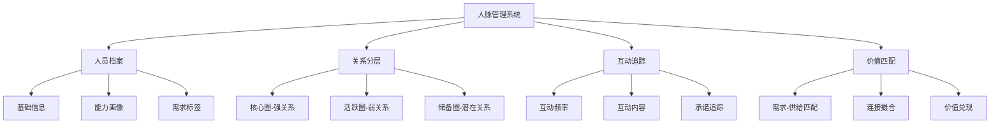
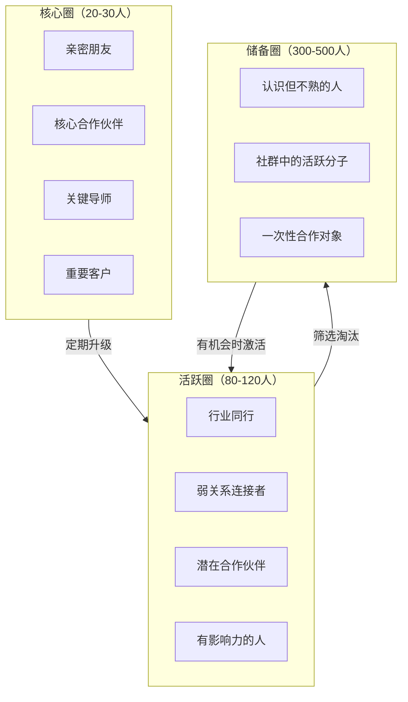
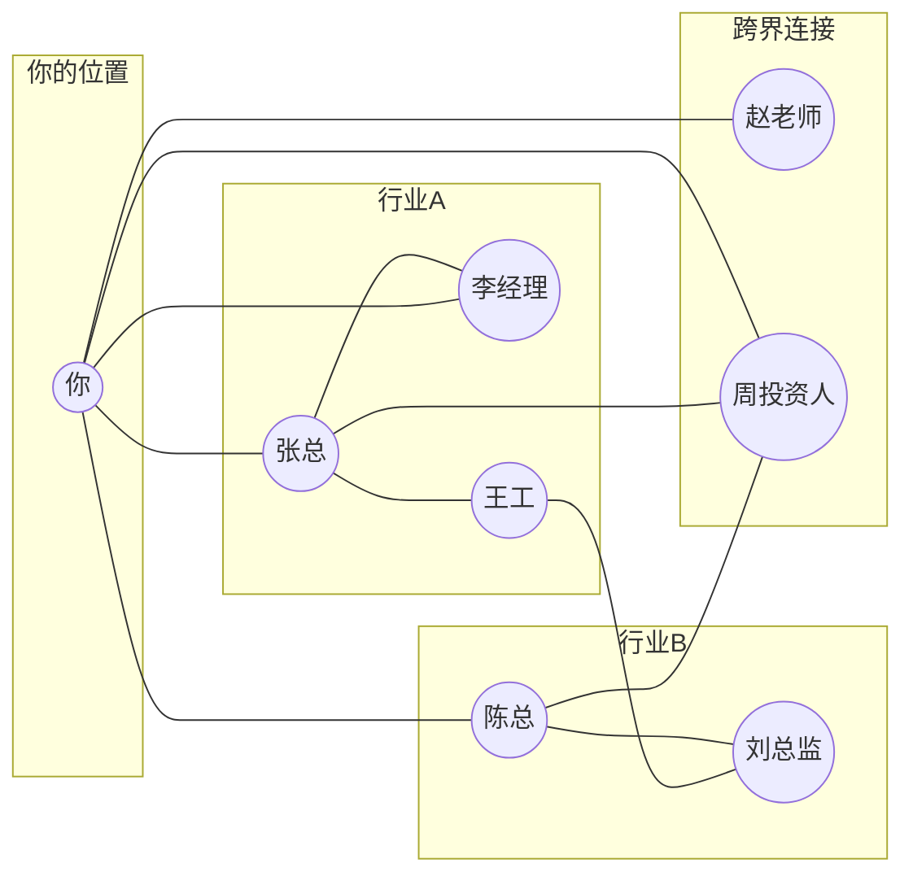

## 四、人脉管理的工具与方法

人脉管理不是"加了微信就算认识"——那只是通讯录管理。真正的人脉管理是一个系统工程：你需要知道每个人是谁、你们的关系深度、上次互动是什么时候、对方需要什么、你能提供什么。没有系统，人脉就是一堆散乱的联系人；有了系统，人脉才是可调动、可增值的社交资本。

本节从底层逻辑到具体工具，完整覆盖人脉管理的方法论和实操方案。

### 1. 人脉管理的底层逻辑

#### 1.1 为什么需要管理人脉

大多数人对人脉的管理停留在"想起来就联系"的状态。这种方式有三个致命缺陷：

**记忆偏差**：人的大脑倾向于记住最近发生的事和情绪激烈的事。三个月前对你帮助很大的人，可能因为没有"情感峰值"而被遗忘。研究表明，人类大脑在没有外部系统辅助的情况下，稳定维护的社会关系上限约为150人（邓巴数），而真正有效的弱关系网络远超这个数字。

**关系退化**：社会学研究发现，如果两个人在6个月内没有任何互动，关系亲密度会下降约40%。这不是因为感情变了，而是因为缺乏"关系维护信号"——你们没有交换新的社交信息，大脑自然将这段关系降级。

**价值浪费**：你不记得A认识B，也不记得C正在找D能提供的服务。没有管理系统，你永远无法高效地进行人际匹配——而人际匹配恰恰是人脉变现的核心能力。

#### 1.2 人脉管理的核心模型：CRM思维

企业用CRM（客户关系管理）系统管理客户关系，个人也应该用同样的思维管理人脉。核心要素有四个：



**人员档案**：不只是姓名电话，而是包含对方的职业、专长、需求、兴趣、社交风格等完整画像。你在系统中对一个人了解得越深，你就越能在合适的时机提供精准价值。

**关系分层**：不是所有关系都值得同等投入。150个核心联系人中，真正需要高频维护的可能只有20-30人，其余的用低成本方式保持连接即可。

**互动追踪**：记录每次互动的时间、方式、内容和承诺。"我答应下周给他介绍一个人"——如果没有记录系统，这种承诺很容易被遗忘，而每一次食言都会损害你的社交信用。

**价值匹配**：人脉管理的终极目标不是"记住所有人"，而是能在关键时刻做出精准的人际连接——A需要什么，B能提供什么，你作为连接者创造价值。

### 2. 人脉档案的建立与维护

#### 2.1 人脉档案的核心字段

一份有效的人脉档案至少需要包含以下信息：

| 字段类别 | 具体字段 | 说明 |
|---------|---------|------|
| 基础信息 | 姓名、联系方式、公司、职位 | 通讯录级别，最基本的 |
| 社交画像 | 性格特征、沟通风格、兴趣爱好 | 决定你如何与对方互动 |
| 能力标签 | 专业技能、资源优势、行业影响力 | 你能从对方身上获得什么 |
| 需求标签 | 当前需求、痛点、目标 | 你能为对方提供什么 |
| 关系状态 | 关系深度(1-5分)、信任度、亲密度 | 当前关系的客观评估 |
| 互动记录 | 最近互动时间、内容、承诺 | 维护关系的数据支撑 |
| 来源渠道 | 认识的场景、介绍人、共同圈子 | 关系的背景信息 |

#### 2.2 信息采集的三个时机

**初次认识时**：记录基本信息和认识场景。最佳做法是见面后24小时内完成录入，超过48小时你的记忆会快速衰减。在名片上做简短备注（如"周三行业峰会，对AI创业感兴趣"），或者在微信备注中写明认识场景。

**深度交流时**：记录对方的需求、痛点和目标。比如对方提到"最近在找供应链方面的资源"，立刻打上"需求：供应链"的标签。这些信息是未来你为对方创造价值的线索。

**互动反馈时**：每次互动后更新关系状态。你帮对方介绍了一个客户，对方表示感谢并在后续给了你反馈——这些都应该被记录，因为它们反映了关系的真实深度。

#### 2.3 信息维护的节奏

人脉档案不是一次性建立就完事的，它需要持续更新。推荐的维护节奏：

- **高频联系人（每月1次以上）**：每次互动后立即更新
- **中频联系人（每季度1次）**：每季度检查一次，补充新信息
- **低频联系人（半年1次）**：半年做一次全面清理，删除过时信息、合并重复条目

### 3. 数字工具的选择与使用

#### 3.1 工具选择的核心原则

选工具不要追求功能最全，而要选"你能坚持用下去的"。再强大的CRM系统，如果你两周后就弃用，还不如一个坚持维护的Excel表格。选工具时重点考虑三个维度：

**录入成本**：添加一条新联系人需要多长时间？如果超过3分钟，你就不会坚持录入。最好的工具是能在1分钟内完成一条记录的工具。

**查询效率**：你需要找到"做跨境电商的所有人"或"上次在某次会议认识的人"时，工具能不能快速筛选？标签和分组功能是关键。

**提醒机制**：工具能不能在你该联系某人时主动提醒你？手动维护"下次联系时间"很容易遗忘，自动化提醒是持续维护的保障。

#### 3.2 主流工具对比

| 工具 | 适合人群 | 优势 | 劣势 | 成本 |
|------|---------|------|------|------|
| 微信通讯录+备注 | 轻度用户(联系人<500) | 零学习成本，与社交场景无缝衔接 | 功能有限，无法做复杂筛选和提醒 | 免费 |
| Notion/Airtable | 中度用户(联系人500-2000) | 高度自定义，支持多视图和自动化 | 需要前期搭建，维护成本中等 | 免费/付费 |
| 专业CRM(如HubSpot) | 重度用户/商务场景 | 功能全面，自动化程度高 | 学习成本高，可能过度复杂 | 免费/付费 |
| 专用人脉管理App(如Lunchbox、Covve) | 社交密集型职业 | 针对人脉场景优化，提醒功能强 | 国内可用性有限，生态较小 | 付费 |
| Excel/Google Sheets | 技术型用户 | 完全自由，无平台依赖 | 无提醒，无自动化，容易放弃 | 免费 |

#### 3.3 用Notion搭建个人人脉CRM（实操）

以下是用Notion搭建人脉管理系统的具体步骤：

**第一步：创建数据库**

新建一个Database，包含以下属性（Property）：

```text
- 姓名（Title）：联系人姓名
- 公司（Text）：所在公司/组织
- 职位（Text）：当前职位
- 关系分层（Select）：核心圈 / 活跃圈 / 储备圈
- 认识渠道（Multi-select）：行业会议 / 朋友介绍 / 线上社群 / 其他
- 能力标签（Multi-select）：技术 / 营销 / 资金 / 渠道 / 人脉 / 其他
- 需求标签（Multi-select）：同上
- 亲密度（Number）：1-5分
- 最近联系（Date）：最后一次互动的日期
- 联系频率（Select）：每周 / 每月 / 每季度 / 每半年
- 微信号（Text）
- 邮箱（Text）
- 手机（Text）
- 备注（Text）：自由备注
```

**第二步：创建视图**

```text
- 默认视图：按最近联系日期倒序排列
- 分层视图：按关系分层分组，一目了然各圈层人数
- 逾期视图：筛选"距今>联系频率×1.5倍"的人，这些是需要立即维护的关系
- 需求匹配视图：按需求标签筛选，快速找到有特定需求的人
```

**第三步：设置自动化提醒**

利用Notion的提醒功能或配合Zapier/Make自动化：

```text
规则1：每周一检查"逾期视图"，发送需要联系的人的列表
规则2：每月底提醒做一次关系盘点
规则3：录入新联系人时，自动设置"7天后跟进"提醒
```

#### 3.4 用微信生态做轻量级人脉管理

对于不想搭建复杂系统的用户，微信本身已经提供了不少人脉管理能力：

**通讯录备注**：格式建议为"公司-职位-认识场景"，例如"字节-产品总监-2025Q2行业峰会"。这是最低成本的档案管理方式。

**标签分组**：创建标签如"核心圈""行业A""行业B""待开发"等，定期给联系人打标签。发朋友圈时可以按标签选择可见范围，这是一种低成本的关系维护方式。

**微信收藏**：把与重要联系人的关键对话收藏起来，记录承诺和重要信息。虽然不如专业工具方便，但对于联系人不超过500人的情况已经够用。

**聊天置顶+定期提醒**：把核心联系人置顶，配合手机日历设置定期提醒"联系某某"。简单粗暴但有效。

### 4. 人脉分层管理的实操方法

#### 4.1 三圈分层模型

不是所有关系都值得同等投入。推荐用"三圈模型"进行分层管理：



**核心圈（20-30人）**：你愿意在凌晨3点接他们的电话，他们也愿意为你承担风险。维护策略：高频互动（每周至少1次），深度交流，主动提供高价值帮助。

**活跃圈（80-120人）**：你知道他们是谁、做什么、需要什么，但不会每天联系。维护策略：每月至少1次有价值互动，定期分享对他们有用的信息，记住重要日子（生日、公司周年等）。

**储备圈（300-500人）**：认识但不熟，关系停留在"加了微信"的层面。维护策略：每季度1次低成本互动（点赞、评论、转发），在对方需要时提供帮助，等待将关系升级到活跃圈的机会。

#### 4.2 分层管理的时间预算

人脉管理需要投入时间，但时间是有限的。一个合理的月度时间预算：

| 圈层 | 人数 | 月度时间投入 | 单人投入 | 维护方式 |
|------|------|------------|---------|---------|
| 核心圈 | 25人 | 20小时 | 约48分钟/人 | 深度交流、面对面、电话 |
| 活跃圈 | 100人 | 10小时 | 约6分钟/人 | 微信互动、分享信息、偶尔见面 |
| 储备圈 | 400人 | 5小时 | 约0.75分钟/人 | 社交媒体互动、群消息 |
| **合计** | **525人** | **35小时/月** | — | **约1.2小时/天** |

每天花1小时15分钟维护人脉，一年下来你的社交资本会有质的飞跃。关键是持续性——每天1小时坚持一年，远好于心血来潮一周花10小时然后放弃。

#### 4.3 动态升降级机制

人脉分层不是一成不变的。需要建立清晰的升降级标准：

**升级条件**（从储备圈到活跃圈）：
- 发生了3次以上有实质内容的互动
- 对方展示了可验证的专业能力或资源
- 双方有明确的互补性（能力、资源、需求）
- 通过共同朋友获得了信任背书

**升级条件**（从活跃圈到核心圈）：
- 经历过至少一次重大合作或互助
- 互相信任经过考验（如涉及利益、隐私的信任事件）
- 双方都主动维护关系，不是单方面投入

**降级条件**：
- 超过联系频率3倍的时间没有任何互动
- 对方多次爽约或食言
- 关系中存在持续的不对等（一方总是索取）
- 对方价值观与你严重不一致

### 5. 互动追踪与承诺管理

#### 5.1 互动记录的最小必要信息

每次与重要联系人互动后，花30秒记录以下信息：

```text
日期：2025-06-20
联系人：张明（核心圈）
方式：微信语音（25分钟）
关键信息：
  - 他正在筹备B轮融资，目标500万
  - 对供应链金融方向感兴趣
  - 提到李华（活跃圈）可能有资源
承诺：
  - [ ] 本周五前把李华的联系方式给他
  - [ ] 下周分享一篇供应链金融的报告
下次跟进：2025-06-27（周五）
```

这个格式的关键在于"承诺"部分——你答应了什么，什么时候兑现。每一次兑现都在积累社交信用，每一次食言都在透支信任。

#### 5.2 承诺追踪系统

用一个简单的清单系统追踪所有对外承诺：

| 承诺内容 | 给谁 | 截止日期 | 状态 | 完成日期 |
|---------|------|---------|------|---------|
| 介绍李华给张明 | 张明 | 2025-06-22 | ✅ 已完成 | 2025-06-21 |
| 分享行业报告给王芳 | 王芳 | 2025-06-25 | ⏳ 进行中 | — |
| 帮陈刚对接供应商 | 陈刚 | 2025-06-30 | ❌ 需跟进 | — |

每天早上花5分钟检查这个清单，确保没有遗漏的承诺。如果你的承诺完成率低于90%，说明你要么承诺太多，要么执行力不够——都需要调整。

#### 5.3 互动模式的选择

不同场景需要不同的互动模式，选择合适的模式能事半功倍：

| 互动模式 | 适合关系 | 频率 | 效果 | 成本 |
|---------|---------|------|------|------|
| 面对面聚餐 | 核心圈 | 每月1-2次 | ★★★★★ | 高（时间+金钱） |
| 电话/视频 | 核心圈+活跃圈 | 每周-每月 | ★★★★ | 中（时间） |
| 微信私聊 | 所有圈层 | 随时 | ★★★ | 低 |
| 朋友圈互动 | 所有圈层 | 随时 | ★★ | 极低 |
| 群聊互动 | 活跃圈+储备圈 | 随时 | ★★ | 极低 |
| 转发/推荐 | 所有圈层 | 有合适内容时 | ★★★★ | 低 |
| 送小礼物 | 核心圈 | 节日/特殊时刻 | ★★★★ | 中（金钱） |

关键原则：互动的效果与成本成正比，但边际效用递减。每月见面3次的边际收益远低于每月1次，但成本却高出3倍。找到每个关系的"最优互动频率"是人脉管理的核心技能。

### 6. 人脉网络的可视化与分析

#### 6.1 绘制你的社交网络图

将人脉关系可视化，能让你发现盲点和机会。用以下方法绘制你的社交网络：



通过网络图你可以识别：
- **网络中心度**：你是否处于自己网络的中心？如果你和某些圈子没有连接，说明存在盲区。
- **结构洞**：哪些人之间没有直接连接？你能否成为桥梁？桥梁位置是人脉变现的高价值位置。
- **孤岛**：哪些人只和你有连接，与你网络中的其他人完全隔离？孤岛越多，网络越脆弱。

#### 6.2 人脉健康度诊断

定期（建议每季度）对你的社交网络做一次健康诊断：

| 诊断维度 | 健康指标 | 不健康信号 | 改善方法 |
|---------|---------|-----------|---------|
| 多样性 | 覆盖5个以上行业/领域 | 90%的人在同一行业 | 主动拓展跨行业社交 |
| 深度 | 核心圈≥15人 | 核心圈<5人 | 从活跃圈中筛选升级 |
| 活跃度 | 每月有互动的人≥40% | 大量联系人超过半年无互动 | 清理不活跃关系，聚焦有效连接 |
| 结构性 | 存在3+个结构洞位置 | 所有人都互相认识 | 引入不同圈子的人 |
| 互惠性 | 大部分关系是双向的 | 长期单方面付出或索取 | 调整投入方向，淘汰不对等关系 |
| 增长率 | 每月新增2-5个有价值联系人 | 半年没有认识新的人 | 参加新的社交活动和社群 |

#### 6.3 人脉的"投资回报率"分析

社交资本和金融资本一样，需要计算投入产出比。一个简化的分析框架：

```text
关系ROI = (该关系带来的直接价值 + 间接价值) / 维护成本

直接价值：合作收入、信息价值、资源对接
间接价值：转介绍带来的新关系、声誉背书
维护成本：时间成本 + 机会成本 + 金钱成本
```

如果一段关系长期ROI为负（你一直在付出，对方从未提供任何价值或机会），你需要重新评估这段关系的定位——不是一定要断交，但可以降级到储备圈，降低投入。

### 7. 人脉管理的高级方法

#### 7.1 "人际经纪人"策略

当你的人脉管理系统积累了足够的数据，你就可以扮演"人际经纪人"的角色——主动发现人与人之间的匹配机会。

操作方法：
1. 每周花30分钟浏览你的人脉数据库
2. 识别出3-5个潜在的匹配组合（A的需求正好是B的专长）
3. 主动为双方做介绍，并说明你为什么认为他们应该认识
4. 记录每次介绍的结果，追踪匹配成功率

人际经纪人的回报是巨大的：你不需要有资源，只需要有信息和连接能力。每一次成功撮合都在增强你的"社交枢纽"地位。

#### 7.2 "关系投资组合"管理

像管理投资组合一样管理人脉——分散风险，平衡收益：

- **成长型关系**（占比30%）：比你年轻或资历浅的人，当前价值不高但潜力大。长期投资，未来可能成为你的核心资源。
- **价值型关系**（占比40%）：现阶段能提供稳定价值的人。重点维护，确保关系持续健康。
- **机会型关系**（占比20%）：有特殊资源或能力的人，平时低频维护，需要时能快速激活。
- **探索型关系**（占比10%）：全新领域的人脉，用于拓展视野和边界。即使短期没有回报，长期可能开辟新的可能性。

#### 7.3 人脉管理的自动化工作流

利用工具自动化重复性工作，把精力集中在高价值的互动上：

**每日自动任务**：
- 检查今日需要联系的人（基于设定的联系频率）
- 扫描朋友圈/社交媒体，发现互动机会
- 检查承诺清单，提醒到期的待办事项

**每周自动任务**：
- 生成本周新增联系人列表
- 汇总本周互动统计（联系了多少人、哪些关系需要关注）
- 提醒下周需要重点维护的关系

**每月自动任务**：
- 生成人脉健康度报告
- 识别"逾期联系"（超过设定频率1.5倍未互动的人）
- 提醒做关系盘点和分层调整

### 8. 常见误区与纠正

#### 误区一：把人脉管理等同于"记通讯录"

**错误表现**：只记录姓名、电话、微信，没有任何关系信息和互动记录。

**纠正方法**：人脉管理的核心不是"记住谁是谁"，而是"知道在什么时候、用什么方式、为谁创造什么价值"。档案中最有价值的字段是需求标签和互动记录，不是联系方式。

#### 误区二：工具选得越高级越好

**错误表现**：花大量时间搭建复杂的CRM系统，结果用了两周就放弃。

**纠正方法**：工具的价值 = 功能 × 使用频率。一个每天都在用的简单表格，比一个弃用的专业CRM有价值一万倍。先从最简单的工具开始（微信备注+手机日历提醒），等习惯养成后再考虑升级。

#### 误区三：只管"加人"不管"维护"

**错误表现**：疯狂参加活动、加微信，但从不跟进维护。通讯录有5000人，真正能说上话的不到50个。

**纠正方法**：认识一个人的"成本"（参加活动、寒暄、交换联系方式）远低于维护一段关系的"成本"（定期互动、提供价值、建立信任）。如果时间有限，减少认识新人的频率，把时间投入到维护现有高质量关系上。

#### 误区四：人脉管理是"功利的""不真诚的"

**错误表现**：觉得记录别人的信息、分析关系价值是"算计"，不愿意做。

**纠正方法**：恰恰相反，系统化的人脉管理让你更加"真诚"——因为你记得对方的需求、承诺和重要日子，不会因为"忘了"而让对方失望。真正不真诚的是嘴上说"我们是朋友"，却从不主动维护关系。

#### 误区五：过度依赖工具而忽视直觉

**错误表现**：完全按照系统提示行动，该联系谁就联系谁，失去了社交的自然感。

**纠正方法**：工具是辅助，不是替代。系统告诉你"该联系张总了"，但具体用什么方式、聊什么话题、带什么价值，需要你的社交直觉和判断力。把工具当作"记忆外挂"和"提醒助手"，把关系经营的判断留给自己。

### 9. 本节要点总结

1. **人脉管理的本质**：不是管理联系人信息，而是管理关系价值的创造和交换过程。
2. **档案建立**：超越通讯录级别，建立包含能力画像、需求标签、互动记录的完整档案。
3. **工具选择**：从最简单的工具开始，坚持使用比功能强大更重要。
4. **分层管理**：三圈模型（核心/活跃/储备），不同圈层投入不同资源。
5. **互动追踪**：记录每次互动和承诺，承诺完成率是社交信用的核心指标。
6. **网络分析**：定期诊断人脉健康度，识别多样性和结构性问题。
7. **高级策略**：做人际经纪人、管理关系投资组合、建立自动化工作流。
8. **避免误区**：不要过度追求工具复杂度，不要只加人不维护，不要把系统化等同于功利化。

工具是手段，关系是目的。最好的人脉管理系统，是那个你每天都在用、让你的人际关系越来越好的系统。
