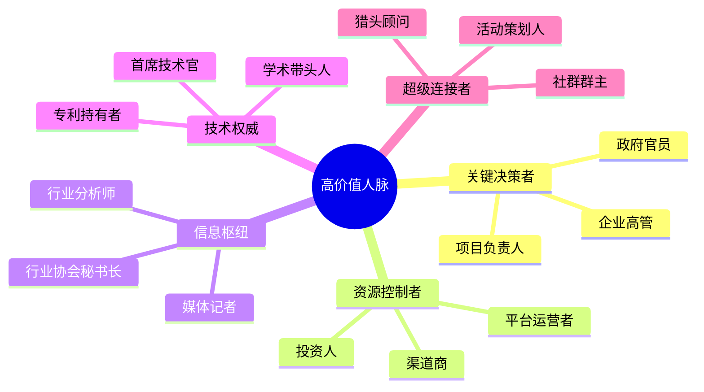
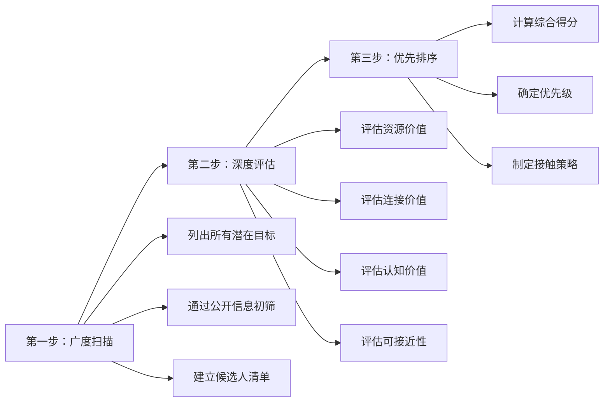
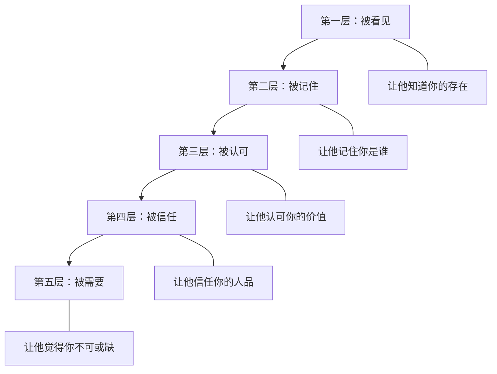
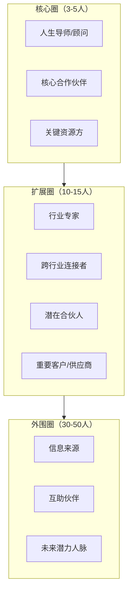

## 五、高价值人脉的识别与接近

人脉经营不是撒网捕鱼——认识的人越多越好。真正的社交高手懂得**精准识别**高价值人脉，并用正确的方式**接近**他们。本节将系统讲解如何定义"高价值"、如何在茫茫人海中找到这些人、如何突破他们的社交防线建立有效连接。

### 5.1 什么是"高价值人脉"

#### 5.1.1 高价值的三层含义

"高价值"不等于"有钱"或"有权"。真正高价值的人脉具有三个维度：

| 维度 | 含义 | 典型代表 | 对你的价值 |
|------|------|----------|-----------|
| **资源价值** | 拥有你缺乏的关键资源（资金、渠道、技术、信息） | 投资人、供应商负责人、技术专家 | 直接解决你的资源瓶颈 |
| **连接价值** | 处于社交网络的关键节点，认识大量不同圈层的人 | 行业媒体人、商会秘书长、猎头顾问 | 通过他们触达更广阔的人脉网络 |
| **认知价值** | 拥有超越你当前层级的思维方式、行业洞察、决策能力 | 企业高管、连续创业者、资深专家 | 帮你打开视野，避免低级错误 |

**关键认知**：最理想的人脉是三个维度兼具的人——既有资源，又是连接者，还能提升你的认知。但现实中这样的人极少，你需要在三个维度之间做取舍和组合。

#### 5.1.2 高价值人脉的五类画像

根据实际社交场景，高价值人脉可以归纳为五类典型画像：



**第一类：关键决策者**

他们掌握着审批权、采购权、合作权等关键决策权。你不需要认识一家公司的所有人，只需要认识那个能拍板的人。例如：你想做某企业的供应商，与其花时间维护采购专员的关系，不如想办法接触采购总监。

**第二类：资源控制者**

他们控制着你需要的稀缺资源——资金、渠道、流量、供应链。投资人控制资金，平台运营者控制流量入口，经销商控制线下渠道。与他们建立关系，等于直接获取资源。

**第三类：信息枢纽**

他们不一定直接拥有资源，但他们知道"谁有什么"、"谁在找什么"。行业分析师了解市场趋势，媒体记者掌握行业动态，行业协会秘书长清楚每家企业的近况。与他们保持联系，你就拥有了信息优势。

**第四类：技术权威**

在技术驱动的行业里，技术权威的意见往往决定技术路线和合作方向。首席技术官、学术带头人、核心技术专利持有者，他们的背书或合作意向可以为你打开技术壁垒。

**第五类：超级连接者**

他们天生擅长社交，认识各行各业的人，乐于介绍不同圈子的人互相认识。社群群主、活动策划人、猎头顾问通常属于这一类。与一个超级连接者建立深度关系，等于间接认识了他背后几百甚至上千人。

#### 5.1.3 "高价值"是相对的——情境决定论

同一个人在不同情境下，对你的价值完全不同：

- 一个律师，在你创业初期可能价值一般（你付不起律师费）；但当你准备融资、上市时，他的价值瞬间飙升
- 一个政府工作人员，在你做C端业务时没什么用；但当你需要审批资质时，他就是关键人脉
- 一个程序员，在你做传统行业时价值有限；但当你转型互联网时，他可能成为你的技术合伙人

**核心原则**：不要用静态的眼光评判一个人的价值。你今天的"弱关系"，可能是明天的"关键人脉"。保持开放心态，对所有人保持基本的尊重和善意。

### 5.2 识别高价值人脉的系统方法

识别高价值人脉不能靠直觉，需要一套系统化的筛选框架。

#### 5.2.1 三步筛选法



**第一步：广度扫描**

先广泛收集潜在高价值人脉的信息来源：

| 信息来源 | 具体方法 | 效率评级 |
|----------|----------|----------|
| 行业峰会/论坛 | 查看演讲嘉宾名单、圆桌讨论参与者 | ★★★★★ |
| 行业媒体 | 关注行业头部媒体的报道对象 | ★★★★ |
| 企业官网 | 查看"管理团队"、"关于我们"页面 | ★★★ |
| LinkedIn/脉脉 | 搜索行业关键词，按职级、公司筛选 | ★★★★ |
| 行业协会 | 获取会员名单、理事会成员 | ★★★★ |
| 投融资新闻 | 关注融资企业的创始人和投资人 | ★★★★★ |
| 学术论文/专利 | 搜索行业核心论文的作者 | ★★★ |
| 社交媒体 | 关注行业KOL的互动对象 | ★★★ |

**第二步：深度评估**

对初筛后的候选人，用以下维度进行深度评估：

| 评估维度 | 评估问题 | 评分标准（1-5分） |
|----------|----------|-------------------|
| 资源匹配度 | 他拥有的资源是否正好解决你的核心瓶颈？ | 1=完全无关，5=精准匹配 |
| 影响力范围 | 他的决策能影响多少人、多大范围？ | 1=仅限个人，5=影响行业 |
| 可接近性 | 你能否通过现有关系或合理方式接触到他？ | 1=几乎不可能，5=有直接渠道 |
| 互惠可能性 | 你能为他提供什么价值？ | 1=几乎为零，5=高度互补 |
| 信任建立难度 | 建立深度信任需要多长时间和成本？ | 1=极难，5=较容易 |

**第三步：优先排序**

计算综合得分 = 资源匹配度×3 + 影响力×2 + 可接近性×2 + 互惠可能性×2 + 信任建立难度×1，总分最高50分。

按得分排序，优先接触得分最高的5-10人。不要贪多——同时维护超过10个高价值人脉会分散精力，导致每个都浮于表面。

#### 5.2.2 识别高价值人脉的七个信号

在日常社交中，以下信号暗示对方可能是高价值人脉：

**信号一：他被频繁引荐**

当你向不同的人打听某个人时，经常听到同一个名字——这说明他在多个圈层都有影响力，是真正的节点人物。

**信号二：他很少主动社交，但很多人都想认识他**

真正高价值的人通常很忙，不会到处社交。他们的时间成本极高，所以只选择性地参加重要活动。如果你发现某人很少露面但总被提及，说明他的"稀缺性"很强。

**信号三：他的朋友圈/社交动态质量很高**

不是看他发了多少内容，而是看互动质量——有多少行业大佬给他点赞评论，有多少人转发他的内容。高质量的互动说明他在圈子里的受认可程度高。

**信号四：他能调动非本领域的资源**

如果一个做技术的人还能轻松调动政府关系、媒体资源、资本力量，说明他的社交网络远超本职范围，是一个跨界连接者。

**信号五：他被邀请担任评委、顾问、独立董事**

经常被邀请做评委、顾问、独立董事的人，通常是在特定领域有公认权威的人。这些角色本身就代表了行业认可。

**信号六：他的名字出现在行业报告、新闻稿中**

媒体和研究机构引用某人的观点或采访他，说明他是这个领域的"声音代表"。这类人往往对行业走向有较强的判断力。

**信号七：他曾经做过你想做的事**

一个已经走过你想走的路的人，他的一条建议可能帮你节省几个月甚至几年的时间。这类人的经验价值是无法用金钱衡量的。

#### 5.2.3 避开"伪高价值"陷阱

有些人看起来很"高价值"，实际上并不值得你投入大量精力去维护：

| 伪高价值特征 | 为什么是陷阱 | 如何辨别 |
|-------------|-------------|----------|
| 朋友圈天天晒豪车、名表 | 真正的富人通常低调，频繁炫富可能是为了吸引下线 | 观察他的实际业务规模和行业口碑 |
| 名片上印一堆"创始人""CEO"头衔 | 很多是空壳公司，头衔不值钱 | 在企查查上查他的公司注册信息、经营状态 |
| 认识很多"大佬"但从不引荐 | 他可能只是认识别人，别人并不认可他 | 试探性地请他帮忙引荐，看他的反应 |
| 到处加人但从不深度交流 | 人脉数量不等于质量，他是"社交收集者" | 观察他与别人的互动深度 |
| 聊天时总说自己"很忙" | 真正忙的人会直接拒绝，而不是反复强调 | 他是否真的在做有价值的事 |

### 5.3 接近高价值人脉的策略体系

识别出目标后，如何突破他们的社交防线？

#### 5.3.1 接近的五个层级

接近高价值人脉是一个循序渐进的过程，不能一步到位：



**第一层：被看见——让他知道你的存在**

方法：
- 在他的社交媒体内容下留下有深度的评论（不是"说得好"，而是补充观点或提出有质量的问题）
- 参加他出席的公开活动，争取提问机会
- 通过共同朋友在合适的场合自然地提到你

**第二层：被记住——让他记住你是谁**

方法：
- 发送一条个性化信息，提及他的某个具体成就或观点（不是群发模板）
- 分享一篇与他相关的文章或资源，附上你的见解
- 在行业群里与他互动，让他对你的ID产生印象

**第三层：被认可——让他认可你的价值**

方法：
- 主动为他提供帮助——帮他转发内容、介绍资源、解决小问题
- 在你的专业领域发布高质量内容，让他看到你的专业能力
- 在公开场合真诚地表达对他的认可（但不要拍马屁）

**第四层：被信任——让他信任你的人品**

方法：
- 信守承诺，说到做到（哪怕是很小的承诺）
- 保守秘密，不传播他分享的私密信息
- 在他遇到困难时主动提供帮助，而不是只在顺风时锦上添花

**第五层：被需要——让他觉得你不可或缺**

方法：
- 成为他在某个领域的"第一联系人"
- 持续为他提供独一无二的价值
- 在关键时刻能帮他解决问题

#### 5.3.2 突破"社交屏障"的六种方法

高价值人脉通常有天然的"社交屏障"——他们时间有限，每天被大量人请求见面。如何突破这个屏障？

**方法一：价值前置法（最推荐）**

在请求见面之前，先提供一个他无法拒绝的价值。

错误示范：
> "张总您好，我是XX公司的李明，想找个时间和您聊聊合作的可能性。"

正确示范：
> "张总您好，我注意到贵公司在东南亚市场有扩展计划。我们团队刚完成了一份东南亚XX行业的深度调研报告（附链接），里面有三个发现可能对您有参考价值。如果您有兴趣，我可以把完整版发给您。"

核心逻辑：先给后要。让他感受到"这个人是有价值的"，而不是"又一个来要资源的"。

**方法二：第三方引荐法**

通过双方都信任的中间人引荐，成功率比直接联系高3-5倍。

操作要点：
1. 选择引荐人：选择与目标关系好、且了解你价值的人
2. 降低引荐成本：为引荐人准备好一段简短的自我介绍和目的说明
3. 表达感谢：引荐后分别向引荐人和目标发送感谢信息
4. 不要辜负信任：引荐后的表现直接影响引荐人的面子

**方法三：场景创造法**

与其请求单独见面（占用他的时间），不如创造一个他愿意参加的场景：

- 组织一个小型闭门沙龙，邀请他作为嘉宾分享
- 邀请他参加你举办的行业活动
- 在某个社交场合"自然地"遇到他

为什么有效？因为"参加一个有价值的活动"比"和一个陌生人喝咖啡"更有吸引力。

**方法四：内容吸引法**

通过持续输出高质量内容，让他主动来找你。

具体操作：
1. 研究他关注的话题，在这些领域持续输出深度内容
2. 在他活跃的平台（公众号、知乎、LinkedIn、Twitter）发布
3. 用数据和案例支撑你的观点，建立专业形象
4. 偶尔@他或在文章中引用他的观点（但要真诚，不要刻意讨好）

**方法五：节点切入法**

不直接找目标本人，而是先与他身边的人建立关系。

示例路径：
- 想认识CEO → 先认识他的VP或助理
- 想认识投资人 → 先认识他投过的创业公司创始人
- 想认识行业大佬 → 先认识他的合伙人或前同事

为什么有效？因为身边人对目标更了解，可以帮你判断接近时机和方式，还能在合适的时机帮你美言几句。

**方法六：偶遇设计法**

在目标经常出现的场所"偶遇"他——健身房、高尔夫球场、常去的餐厅、特定的行业活动。注意：这不是跟踪，而是通过了解他的习惯，在合理的社交场合创造自然接触的机会。

#### 5.3.3 第一次接触的话术模板

第一次与高价值人脉接触，话术的设计至关重要。以下是几种场景的模板：

**场景一：社交媒体私信**

```text
[称呼]您好，我是[你的名字+一句话身份]。

我关注您的[具体内容]很久了，特别是[具体观点/项目]，对我的启发很大。

[一句话说明你提供的价值或共同话题]

如果方便的话，希望能加个微信进一步交流。我的微信号：[XXX]
```

**场景二：活动后跟进**

```text
[称呼]您好，我是昨天[活动名称]上和您聊过[话题]的[名字]。

您提到的[具体观点]让我重新思考了[具体问题]，我整理了一些相关的资料（附链接），希望能对您有参考价值。

期待下次有机会再向您请教。
```

**场景三：第三方引荐后**

```text
[称呼]您好，[引荐人]向我介绍了您，一直很想认识您。

我是[一句话身份]，目前在做[具体项目/方向]。[引荐人]提到您在[具体领域]的经验非常丰富，希望能有机会向您请教。

我知道您时间宝贵，方便的话能否约一个15分钟的电话？我会提前把问题整理好，确保高效。
```

**关键原则**：
- **个性化**：每条消息必须针对对方的实际情况定制，绝不群发
- **具体化**：提到对方的具体成就、观点、项目，而不是泛泛而谈
- **简洁化**：高价值人脉没有时间读长消息，控制在150字以内
- **给予化**：明确说明你能提供什么，而不是你想得到什么
- **低门槛化**：第一次接触不要要求太多，一个15分钟电话比一小时午餐更容易被接受

### 5.4 接近后的关键动作

成功接触到高价值人脉只是开始，后续的动作决定了关系能否深化。

#### 5.4.1 首次见面/通话的黄金法则

**准备阶段**：
- 研究对方的背景、近况、关注点（至少花1小时）
- 准备3-5个有深度的问题（不是百度能搜到答案的问题）
- 明确你这次接触的目标（不是"认识一下"，而是具体的成果）
- 准备好你的"价值主张"——用一句话说清你能提供什么

**交流阶段**：
- 前5分钟建立信任：找到共同点（共同认识的人、共同经历、共同兴趣）
- 中间阶段深入交流：多听少说，比例控制在7:3（对方说70%）
- 最后5分钟明确下一步：不要让关系停留在"聊得挺好"的阶段

**关键细节**：
- 准时到达（提前5分钟最佳）
- 手机静音，全程不看手机
- 做笔记（征得同意后），显示你的重视
- 不要提任何请求或要求——第一次见面的唯一目的是建立连接

#### 5.4.2 首次见面后的48小时跟进

首次接触后的48小时是关系能否深化的关键窗口。错过这个窗口，对方对你的印象会快速淡化。

| 时间点 | 动作 | 具体内容 |
|--------|------|----------|
| 见面后2小时内 | 感谢信息 | 简短感谢，提及交流中的一个亮点 |
| 24小时内 | 价值兑现 | 提供你在见面时承诺的东西（资料、引荐、信息等） |
| 48小时内 | 社交互动 | 在他的朋友圈/动态下留一条有质量的评论 |
| 一周内 | 二次触达 | 分享一篇他可能感兴趣的文章或行业信息 |

#### 5.4.3 持续关系维护的节奏

与高价值人脉的关系维护需要持续但不打扰。推荐以下节奏：

| 维护方式 | 频率 | 具体操作 |
|----------|------|----------|
| 微信互动 | 每周1-2次 | 朋友圈点赞+有质量的评论 |
| 信息分享 | 每2周1次 | 发送他可能感兴趣的行业资讯、报告、机会 |
| 深度交流 | 每月1次 | 电话、见面或线上会议 |
| 价值提供 | 随时 | 看到对他有用的信息/资源，立刻转发 |
| 节日祝福 | 每年5-6次 | 春节、中秋、对方生日、公司周年等 |

**核心原则**：每次接触都要带去价值，而不是消耗对方的时间和精力。

### 5.5 不同场景的接近策略

#### 5.5.1 行业峰会/论坛

行业峰会是接触高价值人脉最高效的场景——大家来就是为了交流，社交门槛最低。

**会前准备**：
1. 查看嘉宾名单和议程，确定3-5个目标人物
2. 研究他们的背景、近况、近期发表的观点
3. 准备好你的"电梯演讲"（30秒内说清你是谁、做什么、有什么价值）
4. 准备高质量名片或电子名片（包含你的核心价值主张）

**会中操作**：
1. 选择目标人物可能出现的场次（演讲、圆桌、茶歇）
2. 在演讲环节坐在前排，提问时展示你的专业度
3. 茶歇时间主动靠近，用准备好的话题自然攀谈
4. 不要纠缠——3-5分钟的高质量对话比30分钟的尬聊更有效
5. 交换联系方式后立即备注信息（姓名、公司、交流内容）

**会后跟进**：
1. 当天晚上发送跟进信息，提及交流的具体内容
2. 兑现你在交流中提到的任何承诺
3. 一周内发送一条价值信息，巩固记忆

#### 5.5.2 线上社群/行业论坛

线上社群的优势是可以低成本地长期"刷存在感"，逐步建立专业形象。

**操作步骤**：
1. 加入目标人物活跃的社群（微信群、知识星球、行业论坛）
2. 前2周只观察不发言，了解社群文化和目标人物的风格
3. 第3周开始定期输出高质量内容（回答问题、分享见解）
4. 当你的输出积累到一定量后，通过私信与目标人物建立联系
5. 私信时引用你在社群中与他的互动，降低陌生感

#### 5.5.3 经典"六度分隔"路径

当你没有任何直接渠道接触目标人物时，可以利用社交网络的"六度分隔"原理——任何两个人之间最多通过6个人就能建立联系。

**实操方法**：
1. 在LinkedIn/脉脉上搜索目标人物
2. 查看你们的共同联系人（一度或二度关系）
3. 从共同联系人中选择与你关系最好的
4. 请求引荐，说明你希望认识目标的原因和你能提供的价值
5. 每次引荐都要降低引荐人的成本——准备好你要说的话，让引荐人只需要"转发"

### 5.6 误区与纠偏

#### 5.6.1 六大常见误区

**误区一：只向上社交，忽视平行和向下社交**

很多人只想着认识比自己厉害的人，忽视了同层级和后辈。但社交网络的价值不仅来自向上连接——你的同层级伙伴可能是未来的行业领袖，你的后辈可能成为你的得力干将。

纠偏：建立"三维社交"策略——向上（20%精力）、平行（50%精力）、向下（30%精力）。

**误区二：追求人脉数量而非质量**

有人以"微信好友5000人"为荣，但其中99%连面都没见过。人脉的价值不在于数量，而在于深度和质量。

纠偏：控制高价值人脉维护数量在10-20人，把精力集中在最重要的关系上。

**误区三：带着强烈的功利心接近**

高价值人脉阅人无数，能瞬间识别出"带着目的来的人"。过度功利的态度会让你失去建立真正关系的机会。

纠偏：从"我能从他那里得到什么"转变为"我能为他提供什么价值"。真正的社交是双向的价值交换。

**误区四：一次接触就想建立深度关系**

关系的建立需要时间。一次见面就提出合作请求或重大帮助，只会让对方觉得你"太急了"。

纠偏：遵循"先给后要"原则，至少提供3次价值后，再考虑请求帮助。

**误区五：只在需要帮助时才联系**

"有事有人，无事无人"是社交的大忌。如果你只在需要帮助时才联系某人，对方很快会对你产生防备心理。

纠偏：建立定期维护机制，平时保持互动，不要等到需要帮助时才出现。

**误区六：忽视"社交信用"的积累**

社交信用是别人对你的信任度。每次你兑现承诺、保守秘密、主动帮助别人，都在积累社交信用。每次你食言、泄露信息、只索取不给予，都在消耗社交信用。

纠偏：把每次社交互动都看作"信用账户"的存取款操作，确保长期余额为正。

#### 5.6.2 高价值人脉经营的"红线"

以下行为会彻底破坏你与高价值人脉的关系，一旦触犯几乎无法修复：

- **未经允许公开私人信息**：他告诉你的事，不要告诉第三个人
- **背着引荐人做私下交易**：通过A认识了B，却绕过A直接和B合作
- **过度频繁地打扰**：每天发消息、每周请求见面，会让对方产生厌烦
- **在公开场合炫耀与他的关系**：高价值人脉通常不喜欢被"消费"
- **利用他的名义做事**：没有得到授权就说"XX总让我来找你的"

### 5.7 进阶：高价值人脉的战略布局

#### 5.7.1 构建你的"核心人脉圈"

高价值人脉不是越多越好，你需要一个精心设计的"核心人脉圈"：



**核心圈（3-5人）**：每周至少联系一次，互相了解近况，重大决策前会咨询的人。
**扩展圈（10-15人）**：每月至少联系一次，有明确的价值交换关系。
**外围圈（30-50人）**：每季度至少联系一次，保持基本的熟悉度和信息流通。

#### 5.7.2 人脉组合的"投资组合理论"

像管理投资组合一样管理你的人脉组合：

| 人脉类型 | 占比 | 作用 | 风险 |
|----------|------|------|------|
| "蓝筹股"人脉 | 30% | 行业领袖、稳定资源方，提供确定性回报 | 低风险，回报稳定但有限 |
| "成长股"人脉 | 40% | 正在快速上升的潜力股，未来可能成为行业领袖 | 中等风险，回报潜力大 |
| "高风险"人脉 | 20% | 跨界人物、新兴领域先锋，可能带来突破性机会 | 高风险，可能大赚也可能无回报 |
| "保险"人脉 | 10% | 律师、财务顾问、心理咨询师等专业服务者 | 风险对冲，关键时刻的价值不可估量 |

#### 5.7.3 用"弱关系理论"优化你的社交策略

社会学家格兰诺维特（Mark Granovetter）的"弱关系理论"指出：最有价值的信息和机会往往来自"弱关系"（偶尔联系的熟人），而非"强关系"（经常联系的密友）。

原因在于：强关系和你处于同一个社交圈，知道的信息和你高度重叠；而弱关系连接着不同的社交圈，能带来你圈子之外的新信息、新机会。

**实操建议**：
1. 定期审视你的人脉网络，确保有足够的"弱关系"
2. 与"弱关系"保持低频率但高质量的互动（每季度一次深度交流）
3. 当弱关系给你带来机会时，及时升级为强关系
4. 通过弱关系扩展你的社交网络——请求他们介绍他们圈子中的人

### 5.8 自检清单与行动计划

#### 5.8.1 高价值人脉经营自检清单

| 检查项 | 是/否 |
|--------|-------|
| 我清楚地知道自己当前最需要哪类高价值人脉 | |
| 我有3-5个明确的高价值人脉目标 | |
| 我知道每个目标的可接近路径 | |
| 我准备好了自己的"价值主张"——能用一句话说清我能提供什么 | |
| 我有定期维护高价值人脉的机制和习惯 | |
| 我的社交行为以"给予"为导向，而非"索取" | |
| 我有记录人脉信息的系统（CRM工具或人脉笔记） | |
| 我定期审视和更新我的人脉组合 | |
| 我注意积累社交信用，长期保持正向信用余额 | |
| 我避免了常见误区中的至少80% | |

#### 5.8.2 30天行动计划

| 周次 | 行动 | 预期成果 |
|------|------|----------|
| 第1周 | 用三步筛选法识别5个高价值人脉目标 | 建立目标清单，含基本信息和可接近路径 |
| 第2周 | 对每个目标进行深度研究，准备接触策略 | 完成5份目标画像和个性化接触方案 |
| 第3周 | 对最容易接近的2-3个目标发起第一次接触 | 至少与1-2个目标建立初步联系 |
| 第4周 | 跟进所有首次接触，开始关系维护 | 建立持续互动的节奏 |

> **核心提醒**：人脉经营是一场马拉松，不是百米冲刺。真正的高价值人脉需要数月甚至数年的持续经营。不要期望一夜之间建立深度关系，保持耐心和真诚，时间会给你回报。
